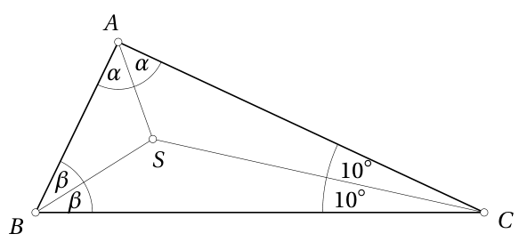
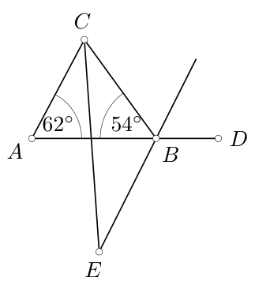

# 9. klase · Tests A · 2. daļa

Vārds, uzvārds: \_\_\_\_\_\_\_\_\_\_\_\_\_\_\_\_\_\_\_\_\_\_\_\_\_\_\_\_\_\_\_\_\_\_ Klase: \_\_\_\_\_\_ Rezultāts: \_\_\_\_\_ / 17 p.

**Laiks — 40 minūtes. Vērtē tikai to, kas ierakstīts rindiņā "Atbilde"; aprēķinus vari veikt lapas brīvajā vietā vai uz melnraksta.** Kalkulatoru nelieto; par nepareizu atbildi punktus neatņem; ja jāatrod *visi* skaitļi, uzraksti visus, atdalot ar komatiem; leņķus raksti grādos.

<!-- SAGATAVE. Zem katra uzdevuma numura slīprakstā ir norāde, kāds uzdevums šeit ievietojams; pirms drukāšanas norādes dzēst.
     Priekšzināšanas: 1.-8. klases kurss.
     Struktūra: 11.-14. uzd. — skolas temats T3 (8.2., 5.2. Pakāpes, sadalījums pirmreizinātājos un dalāmība); 15. un 20. uzd. — olimpiāžu temats O2 (K2. Dirihlē princips un ekstremālais elements; 9.-10. kl.);
     16.-19. uzd. — skolas temats T4 (7.5., 7.6. Trijstūris: leņķi, bisektrises, augstumi, vienādsānu trijstūris, trijstūra nevienādība). Katrā skolas tematā: 2 uzdevumi SOLO 1-2, 2 uzdevumi SOLO 3 (viens ar citu tematu).
     Punkti: SOLO 1-2 → 1 p., SOLO 3 → 2 p., olimpiāžu uzdevumi → 2 p. un 3 p. Kopā 17 p. Numerācija turpinās (11.-20.). -->

<!-- ŠIS FAILS ir uzdevumu komplekts kopā ar analīzi (metadati <small>, atbildes un pilni atrisinājumi).
     Skolēniem izdalāmajā variantā jāatstāj tikai uzdevumu teksti, zīmējumi un tukšās rindiņas "Atbilde". -->

## 11. uzdevums (1 p.)

<!-- *Šeit ievietot uzdevumu par tematu **pakāpju salīdzināšana un īpašības** (8.2.; A1), SOLO 1–2: salīdzināt divus reizinājumus vai pakāpes ar dažādām bāzēm ($2^{56}\cdot 7^{14}$ un $3^{28}\cdot 5^{21}$; $2^{100}$ un $3^{60}$), pārejot uz kopīgu kāpinātāju, — uzrakstīt lielāko; vai aprēķināt izteiksmi ar negatīviem kāpinātājiem. Atbilde — pakāpe vai skaitlis. Līdzīgi: LV.NOL.2022.8.1.* -->

Atrodi reizinājuma $2^{2008} \cdot 5^{2011}$ ciparu summu.

<small>

* source:EE.PK.2008TEST.9.2
* answer:8
* questionType:ShortAnswer

</small>

**Atbilde:** $8$

### Atrisinājums

Izteiksmi varam uzrakstīt formā $2^{2008} \cdot 5^{2011} = 2^{2008} \cdot 5^{2008} \cdot 5^3 = 125\cdot 10^{2008}=125000\ldots 00$, jo $2^{2008} \cdot 5^{2008} = 10^{2008}$. Tātad skaitļa ciparu summa ir $1 + 2 + 5 + 0 + \ldots + 0 = 8$.

*Piezīme skolotājam.* Uzdevums atbilst pakāpju īpašībām ($a^n b^n=(ab)^n$, $a^{m+n}=a^m a^n$), nevis pakāpju salīdzināšanai.

## 12. uzdevums (1 p.)

<!-- *Šeit ievietot uzdevumu par tematu **pirmskaitļa pakāpe skaitļa sadalījumā** (8.2., 5.2.; S2), SOLO 2: ar kādu lielāko $k$ skaitlis $1\cdot 2\cdots 30$ dalās ar $3^k$ (jāsaskaita reizinātāji pa pakāpēm), vai cik dalītāju ir skaitlim $2^4\cdot 3^2\cdot 5$, vai kāds ir pakāpes $7^{2025}$ pēdējais cipars. Atbilde — skaitlis.* -->

Cik nepāra naturālu dalītāju ir skaitlim $6^{2014}$?

<small>

* source:EE.PK.2014TEST.9.4
* answer:2015
* questionType:ShortAnswer

</small>

**Atbilde:** $2015$

### Atrisinājums

Tā kā $6^{2014}=2^{2014} \cdot 3^{2014}$, tad tā nepāra naturālie dalītāji ir tie, kuru sadalījumā neietilpst $2$, t.i., $1, 3, 3^2, 3^3, \ldots, 3^{2014}$; to pavisam ir $2015$.

*Piezīme skolotājam.* Tipiskā kļūda — $2014$ (aizmirst dalītāju $1=3^0$).

## 13. uzdevums (2 p.)

<!-- *Šeit ievietot uzdevumu par tematu **dalāmība ar saliktu skaitli un pirmskaitļi** (5.2., 8.2.; S1, S2), SOLO 3: atrast mazāko $N$, kuram $1\cdot 2\cdots N$ dalās ar dotu saliktu skaitli (piem., $434$ vai $2025$ — jāsadala un jāatrod lielākais nepieciešamais reizinātājs), vai kāds lielākais skaits no skaitļiem $x, x+2, x+4, x+6, x+8$ vienlaikus var būt pirmskaitļi (atlikumi pēc moduļa 5) un pie kāda $x$. Atbilde — skaitlis. Līdzīgi: LV.NOL.2025.9.2, LV.NOL.2023.9.1.* -->

Atrodi izteiksmes

$$
\frac{a \cdot b \cdot c}{3 \cdot 4 \cdot 5 \cdot 6 \cdot 7}
$$

mazāko iespējamo veselo vērtību, ja $a$, $b$ un $c$ ir trīs pēc kārtas sekojoši naturāli skaitļi.

<small>

* source:EE.PK.2014TEST.9.5
* answer:17
* questionType:ShortAnswer

</small>

**Atbilde:** $17$

### Atrisinājums

Izsakot izteiksmes saucēju kā pirmreizinātāju reizinājumu, iegūstam $\frac{a \cdot b \cdot c}{2^3 \cdot 3^2 \cdot 5 \cdot 7}$, kam jābūt veselam skaitlim. Tā kā no trim pēc kārtas sekojošiem skaitļiem tikai viens dalās ar trīs, tad vienam no skaitļiem $a$, $b$, $c$ jādalās ar $9$. Starp skaitļiem $a, b, c$ jābūt arī skaitlim, kas dalās ar $5$, un skaitlim, kas dalās ar $7$. Aplūkosim skaitļa $9$ daudzkārtņus $9k$, kuriem starp skaitļiem $9k - 2$, $9k - 1$, $9k$, $9k + 1$ un $9k + 2$ būtu ar $5$ un ar $7$ dalāms skaitlis: pie $9$ tie ir $10$ un $7$; pie $27$ — $25$ un $28$, taču neviens no šiem trijniekiem nav trīs pēc kārtas sekojoši skaitļi; pie $36$ skaitlis $35$ dalās gan ar $5$, gan ar $7$. Tā kā $34 \cdot 35 \cdot 36 = 2^3 \cdot 3^2 \cdot 5 \cdot 7 \cdot 17$, tad dalījuma vērtība ir $17$, kas patiešām ir vesels skaitlis. (Arī reizinājums $35\cdot36\cdot37$ dalās, bet dod lielāku vērtību $37$.)

## 14. uzdevums (2 p.)

<!-- *Šeit ievietot uzdevumu par tematu **dalāmība** (5.2.) **kombinācijā ar decimālo pierakstu** (5.1.; S3), SOLO 3: divciparu skaitlim galā pieraksta divciparu skaitli un iegūtais dalās ar 13 (vai 11), dots papildu nosacījums par cipariem — jāatrod visi derīgie skaitļi, izmantojot $\overline{abcd}=100\cdot\overline{ab}+\overline{cd}$ un atlikumus; vai mazākais ciparu skaits, kas jāpieraksta dotai ciparu virknei, lai skaitlis dalītos ar doto skaitli. Atbilde — saraksts vai skaitlis. Līdzīgi: LV.AMO.2023.9.2, LV.NOL.2019.9.5.* -->

Pierakstā $7\ast 32\ast$ zvaigznītes aizstāj ar piemērotiem cipariem un iegūst skaitli, kas, dalot ar $15$, dod atlikumu $2$. Atrodi lielāko no šādiem skaitļiem.

<small>

* source:EE.PK.2007TEST.9.2
* answer:79322
* questionType:ShortAnswer

</small>

**Atbilde:** $79322$

### Atrisinājums

*1. atrisinājums.* Meklējamā skaitļa $\overline{7a32b}$ ciparu summai, dalot ar $3$, jādod atlikums $2$, un šim skaitlim jābeidzas ar $2$ vai $7$ (jo, dalot ar $5$, jādod atlikums $2$). Ja $a = 9$, tad pie $b = 7$ iegūstam ciparu summu $28$, kas neder, bet pie $b = 2$ iegūstam derīgu ciparu summu $23$.

*2. atrisinājums.* Atņemot no dotā skaitļa $2$, iegūstam skaitli $\overline{7x32y}$, kas dalās ar $15$ bez atlikuma (skaitļa priekšpēdējais cipars ar šo darbību nemainās). Iegūtā skaitļa pēdējais cipars ir vai nu $0$, vai $5$, un tā ciparu summai jādalās ar $3$. Ja $x = 9$ un $y = 5$, tad ciparu summa ir $26$, kas neder. Ja $x = 9$ un $y = 0$, tad iegūstam derīgu ciparu summu $21$. Meklējamais skaitlis ir par $2$ lielāks par šo skaitli jeb $79322$.

## 15. uzdevums (2 p.)

<!-- *Šeit ievietot uzdevumu par olimpiāžu tematu **Dirihlē princips** (K2, 7.–8./9.–10. kl.), SOLO 2–3: skolēnu atzīmes ir veseli skaitļi no $0$ līdz $10$; jāatrod **mazākais** skolēnu skaits, lai noteikti būtu vismaz 4 ar vienādu atzīmi, vai mazākais skaitļu skaits no $1$ līdz $100$, lai starp tiem noteikti būtu divi, kuru starpība dalās ar 7; "kastes" jāsaskata pašam. Atbilde — skaitlis. Līdzīgi: LV.AMO.2024.9.2 (pārveidot par "mazākais skaits").* -->

Kastē ir $15$ bumbiņas, kas ir sarkanzilas (puse sarkana, puse zila), $12$ bumbiņas, kas ir zilzaļas, un $9$ bumbiņas, kas ir zaļsarkanas. Kāds ir mazākais bumbiņu skaits, kas jāizņem no kastes (neskatoties), lai noteikti būtu vismaz septiņas bumbiņas, kurām ir kāda kopīga krāsa?

<small>

* adaptedFrom:UKMT.EPK.2006.16
* sourceNote:2006 European Pink Kangaroo, 16. uzd. (UKMT Yearbook 2005-06); tulkots, izvēles varianti noņemti
* answer:10
* questionType:ShortAnswer

</small>

**Atbilde:** $10$

### Atrisinājums

Izņemot trīs sarkanzilas, trīs zilzaļas un trīs zaļsarkanas bumbiņas, katra krāsa ir tieši uz sešām bumbiņām, tātad ar $9$ bumbiņām nepietiek.

Savukārt $10$ bumbiņām kopā ir $20$ „puslodes” trīs dažādās krāsās. Ja katra krāsa būtu ne vairāk kā uz $6$ bumbiņām, pusložu būtu ne vairāk kā $3\cdot 6=18<20$. Tātad (Dirihlē princips) kāda krāsa ir vismaz uz $7$ bumbiņām.

*Piezīme skolotājam.* „Kastes” ir trīs krāsas, bet katra bumbiņa nonāk divās kastēs — tas jāsaskata. Tipiskā kļūda — $19=3\cdot6+1$ (katrai bumbiņai pieņem tikai vienu krāsu). Oriģinālā bija varianti A 7, B 8, C 9, D 10, E 11.

<!-- ===== Lapas otrā puse: 16.–20. uzdevums ===== -->

## 16. uzdevums (1 p.)

<!-- *Šeit ievietot uzdevumu par tematu **trijstūra nevienādība** (7.6.; Ģ1), SOLO 1–2: vienādsānu trijstūra pamats ir dots, perimetrs ierobežots vai malas ir veseli skaitļi — jāatrod **visi** iespējamie sānu malas garumi (veseli). Atbilde — saraksts. Līdzīgi: LV.NOL.2020.9.1.* -->

Cik ir tādu vienādsānu trijstūru, kuru katras malas garums ir vesels centimetru skaits, pamats ir garāks par sānu malu un kuros ir mala ar garumu $5\ \mathrm{cm}$?

<small>

* source:EE.PK.2017TEST.9.9
* answer:6
* questionType:ShortAnswer

</small>

**Atbilde:** $6$

### Atrisinājums

Ja pamata garums ir $5\ \mathrm{cm}$, tad par to īsākās sānu malas garums var būt $4\ \mathrm{cm}$ vai $3\ \mathrm{cm}$, jo divu vēl īsāku sānu malu garumu summa nebūtu lielāka par $5\ \mathrm{cm}$ (trijstūra nevienādība: $2+2<5$). Ja sānu malas garums ir $5\ \mathrm{cm}$, tad par to garākā pamata garums var būt $6\ \mathrm{cm}$, $7\ \mathrm{cm}$, $8\ \mathrm{cm}$ vai $9\ \mathrm{cm}$, jo tālāk pamata garums nebūtu mazāks par abu sānu malu garumu summu ($5+5=10$). Kopā meklējamo trijstūru ir $2+4=6$.

*Piezīme skolotājam.* Sagatavē ieteikts uzdevums ar sarakstu atbildē; šeit prasīts trijstūru skaits. Tipiskās kļūdas: $7$ (ieskaita $5,5,10$) vai $4$/$2$ (apskata tikai vienu gadījumu).

## 17. uzdevums (1 p.)

<!-- *Šeit ievietot uzdevumu par tematu **leņķi starp bisektrisēm un augstumiem** (7.5., 7.6.; Ģ1), SOLO 2: trijstūrī doti divi leņķi, jāatrod leņķis starp divām bisektrisēm ($90^\circ+\frac{\gamma}{2}$) vai starp augstumu un bisektrisi no vienas virsotnes; divi soļi ar leņķu summu. Atbilde — grādi.* -->

Trijstūra $ABC$ bisektrises krustojas punktā $S$. Atrodi leņķa $ASB$ lielumu, ja $\angle ACS = 10^\circ$. (Zīmējums nav mērogā.)

<small>

* source:EE.PK.2013TEST.9.6
* answer:$100^\circ$
* questionType:ShortAnswer

</small>

**Atbilde:** $100^\circ$

### Atrisinājums

Apzīmēsim $\alpha = \angle BAS$ un $\beta = \angle ABS$. Tad trijstūra $ABC$ leņķu lielumi ir $2\alpha$, $2\beta$ un $2 \cdot 10^\circ$, tātad $\alpha + \beta + 10^\circ = \frac{180^\circ}{2} = 90^\circ$. Tātad $\alpha + \beta = 80^\circ$. Iegūstam

$$
\angle ASB = 180^\circ - (\alpha + \beta) = 100^\circ.
$$

(Vispārīgi: $\angle ASB=90^\circ+\frac12\angle ACB$.)

## 18. uzdevums (2 p.)

<!-- *Šeit ievietot uzdevumu par tematu **bisektrises un ārējie leņķi** (7.5., 7.6.; Ģ1), SOLO 3: punkts uz nogriežņa, trijstūris ar dotu leņķi pie virsotnes, un divu leņķu (iekšējā un blakusleņķa) bisektrises krustojas — jāaprēķina leņķis to krustpunktā; konfigurācija prasa pareizi izvēlēties, kurus leņķus izteikt caur nezināmajiem. Atbilde — grādi. Līdzīgi: LV.NOL.2022.9.3.* -->

Leņķa $ACB$ bisektrise krustojas ar leņķa $CBD$ bisektrisi punktā $E$. Atrodi leņķa $CEB$ lielumu. (Zīmējums nav mērogā.)

<small>

* source:EE.PK.2014TEST.8.8
* answer:31°
* questionType:ShortAnswer

</small>

**Atbilde:** $31^\circ$

### Atrisinājums

Trijstūra $ABC$ trešā leņķa lielums ir $\angle ACB = 180^\circ - 62^\circ - 54^\circ = 64^\circ$, un ārējā leņķa lielums ir $\angle CBD = 62^\circ + 64^\circ = 126^\circ$. Punkts $E$ atrodas uz leņķa $CBD$ bisektrises pagarinājuma aiz virsotnes $B$, tāpēc $\angle ABE$ ir krustleņķis leņķim, ko bisektrise veido ar malu $BD$: $\angle ABE = \frac{1}{2}\angle CBD = 63^\circ$. Tātad $\angle CBE=\angle CBA+\angle ABE=54^\circ+63^\circ=117^\circ$. Tā kā $\angle BCE = \frac{1}{2}\angle ACB = 32^\circ$, tad no trijstūra $BCE$ iegūstam $\angle CEB = 180^\circ - 32^\circ - 117^\circ = 31^\circ$.

(Vispārīgi: $\angle CEB=\frac12\angle CAB$ — šeit $\frac12\cdot 62^\circ=31^\circ$.)

## 19. uzdevums (2 p.)

<!-- *Šeit ievietot uzdevumu par tematu **augstumi trijstūrī** (7.5.) **kombinācijā ar taisnleņķa trijstūra īpašībām un vienādības pazīmēm** (7.6., 8.8.; Ģ1), SOLO 3: šaurleņķu trijstūra augstumi krustojas punktā $M$, dots $AB=CM$ — jāaprēķina $\sphericalangle ACB$ (vienādi taisnleņķa trijstūri), vai augstumu pēdas ar vienādiem nogriežņiem — jāatrod leņķis. Atbilde — grādi. Līdzīgi: LV.NOL.2025.8.3, LV.NOL.2025.9.3 (pārveidot par aprēķinu).* -->

No taisnleņķa trijstūra $ABC$ taisnā leņķa virsotnes $C$ novilkts augstums $CD$, kas krustojas ar no virsotnes $B$ novilkto bisektrisi punktā $L$. Leņķa $BLC$ lielums ir $110^\circ$. Atrodi leņķa $ACD$ lielumu. (Zīmējums nav mērogā.)

<small>

* source:EE.PK.2017TEST.8.6
* answer:$40^\circ$
* questionType:ShortAnswer

</small>

**Atbilde:** $40^\circ$

### Atrisinājums

Tā kā $\angle BLD = 180^\circ - 110^\circ = 70^\circ$, tad no taisnleņķa trijstūra $DBL$ iegūstam vienādību $\angle DBL = 180^\circ - 90^\circ - 70^\circ = 20^\circ$. Tātad $\angle CBA = 2 \cdot 20^\circ = 40^\circ$. No taisnleņķa trijstūra $ABC$ iegūstam $\angle CAB = 90^\circ - 40^\circ = 50^\circ$, un no taisnleņķa trijstūra $ACD$ — $\angle ACD = 90^\circ - 50^\circ = 40^\circ$.

(Oriģinālajā atrisinājumā izmantota trijstūru $ACD$ un $ABC$ līdzība; 9. klasē pirms līdzības tēmas pietiek ar leņķu summu divos taisnleņķa trijstūros.)

## 20. uzdevums (3 p.)

<!-- *Šeit ievietot uzdevumu par olimpiāžu tematu **Dirihlē princips ar ekstremālo elementu** (K2 + M5, 9.–10. kl.), SOLO 3–4: uz $36$ kartītēm skaitļi, kurus var sadalīt 9 grupās pa 4 ar vienādām summām un 6 grupās pa 6 ar vienādām summām — jāatrod, **cik lielākais** skaitļu var būt lielāki par doto, vai $120$ dažādi naturāli skaitļi pa pāriem ar summu $>1000$ — jāatrod lielākā garantētā vērtība noteiktam pēc lieluma skaitlim; pareizai atbildei nepieciešams gan novērtējums, gan piemērs. Šis ir daļas grūtākais uzdevums; formulēt kā "lielākais/mazākais", nevis "pierādīt". Atbilde — skaitlis. Līdzīgi: LV.AMO.2023.9.4, LV.NOL.2021.9.5.* -->

Doti septiņi dažādi naturāli skaitļi; katriem diviem no dotajiem skaitļiem aprēķināja to summu (pavisam $21$ summa). Kāds lielākais skaits no šīm summām var būt pirmskaitļi?

<small>

* source:LV.AMO.2014.10.4
* answer:12
* questionType:FindOptimal

</small>

**Atbilde:** $12$

### Atrisinājums

**Novērtējums.** Ja starp dotajiem ir $k$ pāra skaitļi un $7-k$ nepāra skaitļi, tad starp summām ir $k(7-k)$ nepāra skaitļi, bet pārējās summas ir pāra skaitļi un nav pirmskaitļi (neviena no summām nav $2$, jo $2$ nav izsakāms kā divu dažādu naturālu skaitļu summa). Izteiksme $k(7-k)$ savu lielāko vērtību, kad $k \in\{0 ; 1 ; 2 ; \ldots ; 7\}$, pieņem pie $k=3$ un $k=4$, un šī lielākā vērtība ir $3\cdot 4=12$.

**Piemērs.** $12$ pirmskaitļi ir iespējami, piemēram, ja doti skaitļi $2,4,8,14,3,9,15$, tad nepāra summas ir $5, 11, 17, 7, 13, 19, 11, 17, 23, 17, 23, 29$, kas visas ir pirmskaitļi.

*Piezīme skolotājam.* Uzdevums ir par ekstremālo vērtību ar novērtējumu un piemēru (paritāte + $k(7-k)$ maksimizācija), nevis klasisks Dirihlē uzdevums; sagatavē minētie LV.AMO.2023.9.4 un LV.NOL.2021.9.5 nav izmantoti. Tipiskās kļūdas: $21$ (visas summas) vai atbilde bez piemēra, piem., $10$ vai $6$.

*Vieta aprēķiniem un zīmējumiem:*

&nbsp;

&nbsp;

&nbsp;

&nbsp;

---

<!-- Skolotājam. Šo sadaļu pirms drukāšanas skolēniem dzēst vai pārcelt uz atsevišķu failu. -->

## Atbilžu atslēga (tikai skolotājam)

| Nr. | Temats | SOLO | P. | Atbilde (B var.) | Pieņemamās ekvivalentās formas |
|---|---|---|---|---|---|
| 11 | T3 8.2. | 1–2 | 1 | 8 | |
| 12 | T3 8.2./5.2. | 2 | 1 | 2015 | |
| 13 | T3 5.2./8.2. | 3 | 2 | 17 | |
| 14 | T3 5.2. + 5.1. | 3 | 2 | 79322 | |
| 15 | O2 K2 | 2–3 | 2 | 10 | |
| 16 | T4 7.6. | 1–2 | 1 | 6 | |
| 17 | T4 7.5./7.6. | 2 | 1 | 100° | |
| 18 | T4 7.6. | 3 | 2 | 31° | |
| 19 | T4 7.5. + 8.8. | 3 | 2 | 40° | |
| 20 | O2 K2 + M5 | 3–4 | 3 | 12 | |

Jomu profils: T3 (11.–14. uzd.) — 6 p.; T4 (16.–19. uzd.) — 6 p.; O2 (15., 20. uzd.) — 5 p. Kopā 17 p. Abas daļas kopā — 34 p.

Avoti: EE.PK (`math/sources/EE_PK/`), UKMT (2006 European Pink Kangaroo, `math/sources/UKMT/Yearbook-2005-06.pdf`, tulkots), LV.AMO (`math/problembase/`).
