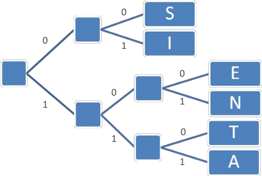
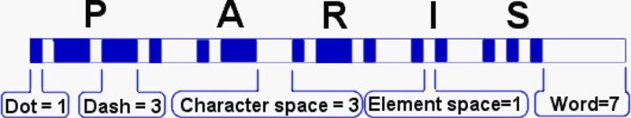
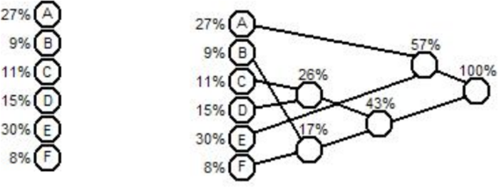
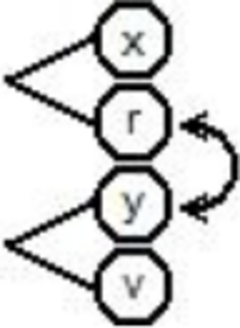
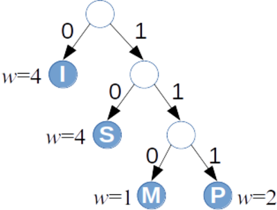

# &nbsp;

<hgroup>

<h1 style="font-size:28pt">Lietišķie algoritmi</h1>

<blue>Bezzudumu saspiešana - 1</blue>

</hgroup><hgroup>

<span style="color:darkgreen">**(1) Ievads**</span>  
<span>(2) [Saspiešanas jēdzieni](#section-1)</span>  
<span>(3) [Prefiksu kodēšana](#section-2)</span>  
<span>(4) [Hafmana algoritms](#section-3)</span>  
<span>(5) [Entropija](#section-4)</span>  
<span>(6) [Aptaujas](#section-5)</span>  
<span>(7) [(P) Bibliotēku lietojums](#section-6)</span>  
<span>(8) [Kopsavilkums](#section-7)</span>

</hgroup>

<!--

TODO: 
Pievienot  
Ievadnodaļu - kādi 4-5 slaidi: 
Par 6 lielajām tēmam un kursa mērķi
Virsuzdevumi šinī kursā. 

TODO: 
Par Hafmana algoritmu - vajag kaut kā pa soļiem: kā
inicializē datu struktūras u.c. 


TODO:
Vairāk intuīcijas par entropiju - kaut kādas vizualizācijas, 
kas parāda "pašinformācijas daudzumu" vai kaut ko vidējo. 
Arī E(X) kā vidējo vērtību. 


TODO: Pievienot testa uzdevumu atrisinājumus. 

--> 


-----


# <lo-why/> why

<div class="bigWhy">
Kāpēc vajag vairāk par vienu saspiešanas algoritmu?
</div>

<div class="smallWhy">

* Kā saspiešana kļūst atkarīga no ievades datiem
un lietojuma arhitektūras?
* Kurus datus var/nevar efektīvi saspiest?

</div>


--


## <lo-theory/> Sasniedzamie rezultāti

1. Definēt ziņojumu alfabētu, 
2. Raksturot kodējumus, saspiešanu un atspiešanu.
3. Saskaitīt ziņojumus noteiktā alfabētā.
4. Aprakstīt kodēšanu, saspiešanu un atspiešanu prefiksu kokā.
5. Lietot Hafmana algoritmu prefiksu koka veidošanai.
6. Definēt un aprēķināt entropiju diskrētam gadījuma lielumam.


-----

# &nbsp;

<hgroup>

<h1 style="font-size:28pt">Lietišķie algoritmi</h1>

<blue>Bezzudumu saspiešana - 1</blue>

</hgroup><hgroup>

<span>(1) [Ievads](#section)</span>  
<span style="color:darkgreen">**(2) Saspiešanas jēdzieni**</span>  
<span>(3) [Prefiksu kodēšana](#section-2)</span>  
<span>(4) [Hafmana algoritms](#section-3)</span>  
<span>(5) [Entropija](#section-4)</span>  
<span>(6) [Aptaujas](#section-5)</span>  
<span>(7) [(P) Bibliotēku lietojums](#section-6)</span>  
<span>(8) [Kopsavilkums](#section-7)</span>

</hgroup>

-----

# <lo-theory/> Alfabēti, vārdi, valodas

Par <blue>*alfabētu*</blue> saucam galīgu kopu ar simboliem. 

* Latīņu/angļu alfabēts: 26 simboli
* Latviešu alfabēts: 33 simboli ($26 - 4 + 11$)
* [ASCII alfabēts](http://www.asciitable.com/): 128 simboli
* Unikoda alfabēts (UCS-2, *Basic Multilingual Plane*): 
65536 simboli. Pavisam Unikoda standartā ir ap 170 tūkstošiem simbolu, 
bet tad kodējumā parādās "papildu plaknes".


--

## <lo-summary/> Vai baits ir 8 biti? 

* Datoru arhitektūrā <blue>*baits*</blue> (*byte*) vienmēr ir 8 biti
* Baitu var uztvert arī kā nedalāmu viena loģiska simbola kodējumu. 
* ASCII kodējums vēsturiski pieraksta populārajiem tastatūras
simboliem 7 bitus. Tātad $256-128=128$ vietas 
paliek neaizņemtas. 

Neaizņemtās vietas var aizpildīt ar citiem derīgiem 
simboliem. 1990-tajos gados "KOI-8", "Windows-1257" u.c. 
kodējumi ērti lietoja baitus, lai tur saliktu modificētos
R-Eiropas burtus, latviešu vai krievu burtus, u.c.


--

## <lo-theory/> Ziņojumu kopa

* Saspiešanas algoritmi ne vienmēr saspiež individuālus
burtus. 
* To salīdzināšanai ir derīgāks jēdziens: $S$ - iespējamo 
ziņojumu kopa (*the set of messages*). Sākotnējie ziņojumi 
pierakstīti vienā alfabētā, to kodējumi - varbūt jau citā.
`$$S = \{ s_1, s_2, \ldots, s_n \}.$$`
* Atkarībā no konteksta ziņojums var būt atsevišķs burts, 
noteikta garuma vārds vai pat vesels fails (ziņojumu kopa 
var būt arī bezgalīga, bet mums parasti to nevajadzēs). 


Ja ziņojumam ir zināms garums sākotnējā, nesaspiestajā formā, 
var runāt par <blue>*saspiešanas attiecību*</blue> 
(*compression ratio*). 


--


## <lo-theory/> Kodējuma jēdziens

Kodējums $C$ ziņojumu kopai $S$ ir attēlojums, kas 
katru ziņojumu pārvērš par bitu virkni. 
Katru bitu virkni sauc par kodavārdu (*codeword*) un 
apzīmēsim visus kodējumā ietilpstošos attēlojumus šādi:
`$$C = \{ (s_1,w_1),(s_2,w_2),\ldots,(s_m,w_m)\}.$$`


-----

# <lo-theory/> 2 saspiešanas veidi


* **Bezzudumu saspiešana:** Atspiestais ziņojums
precīzi sakrīt ar sākotnējo.  
Iecienīts teksta dokumentiem, izpildāmam kodam.
* **Zudumradošā saspiešana:** Atspiestais ziņojums tikai aptuveni vienāds
ar sākotnējo.  
Attēlu, skaņas, video glabāšana un pārraide.


--

## <lo-theory/> Universāli saspiest nevar

Neeksistē tāds algoritms, kas **katru** $n$ bitu virkni
bezzudumu saspiešanā pārveido 
par $k$ bitu virkni, kur $k < n$.

*Pamatojums:* Ar skaitīšanu.  
Bitam ir $2$ vērtības ($0$ vai $1$). 

* $m$ bitu virknei ir $2^m$ vērtības,
* $k$ bitu virknei ir $2^k$ vērtības. 


--

## <lo-theory/> Injektīvi attēlojumi

**Definīcija:** Funkciju $f\,:\;X \rightarrow Y$ 
sauc par <blue>*injektīvu*</blue>, 
ja katriem diviem argumentiem $x_1,x_2 \in X$ izpildās:
`$$x_1 \neq x_2\;\;\Rightarrow\;\;f(x_1) \neq f(x_2).$$`

Bezzudumu saspiešanas funkcijai 
jābūt injektīvai, tajā nedrīkst
būt "kolīzijas" (vērtību "saskriešanās"). 

Bet no <blue>*Dirihlē principa*</blue> (*Pigeonhole principle*) 
tieši seko, ka injektīva funkcija no kopas ar $2^m$ elementiem
uz $2^k$ elementiem (ja $k < m$) neeksistē.

-----

# &nbsp;

<hgroup>

<h1 style="font-size:28pt">Lietišķie algoritmi</h1>

<blue>Bezzudumu saspiešana - 1</blue>

</hgroup><hgroup>

<span>(1) [Ievads](#section)</span>  
<span>(2) [Saspiešanas jēdzieni](#section-1)</span>  
<span style="color:darkgreen">**(3) Prefiksu kodēšana**</span>  
<span>(4) [Hafmana algoritms](#section-3)</span>  
<span>(5) [Entropija](#section-4)</span>  
<span>(6) [Aptaujas](#section-5)</span>  
<span>(7) [(P) Bibliotēku lietojums](#section-6)</span>  
<span>(8) [Kopsavilkums](#section-7)</span>

</hgroup>

-----

# <lo-theory/> Mainīga garuma kodi

* Dažāda garuma kodi var palīdzēt ietaupīt vietu. 
Ja visus ziņojumus kodē vienādi gari, tad 
katrs simbols aizņem 
${\displaystyle \left\lceil \log_2 |S| \right\rceil }$ - tas parasti
ir ļoti neoptimāli.
* Ar dažāda garuma kodavārdiem rasties *divdomības* (*ambiguities*). 
Piemēram, ja kodējums ir 
`$$\{(a, \mathtt{1}), (b, \mathtt{01}), (c, \mathtt{101}), (d, \mathtt{011})\},$$`
tad $\mathtt{1011}$ var saprast trīs dažādos veidos:
`$$\mathtt{1.01.1},\;\;\mathtt{1.011},\;\;\mathtt{101.1}.$$`

--

## <lo-theory/> Prefiksu kodējuma jēdziens

<hgroup>



<blue>*Prefiksu kodējumā*</blue> (*prefix code*) 
neviens kodavārds nav cita kodavārda
prefikss.  
(Faktiski "bezprefiksu" kodējums.)

</hgroup>
<hgroup>

`$$C=\{ (S, \mathtt{00}), (I, \mathtt{01}),$$`
`$$ (E, \mathtt{100}), (N, \mathtt{101}),$$`
`$$ (T, \mathtt{110}), (A, \mathtt{111})\}.$$`


</hgroup>


--

## <lo-sample/> Atkodēšanas piemēri

<hgroup>

* Atkodēt virkni `11100110100`,
* Atkodēt virkni `0001100101111`.

</hgroup>
<hgroup>


</hgroup>


-----

# <lo-theory/> Vidējais kodējuma garums

Pieņemsim, ka ir zināms varbūtību sadalījums ziņojumu telpā $S$: 
Katram $s \in S$ ir piekārtota 
varbūtība $p(s)$ un $p(s_1)+\ldots+p(s_n)=1$.

**Definīcija:** Par kodējuma $C = \{(s_1,w_1),\ldots,(s_n,w_n)\}$ 
<blue>*vidējo garumu*</blue> (*average length*) sauksim summu:
`$$\ell_a(C) = \sum\limits_{(s,w) \in C} p(s)\ell(w),$$`
kur $\ell(w)$ apzīmē kodavārda $w$ garumu bitos. 


--

## <lo-theory/> Optimāls prefiksu kodējums

**Definīcija:** Teiksim, ka prefiksu kods $C$ ir <blue>*optimāls*</blue>
prefiksu kods, ja tā $\ell_a(C)$ ir minimāls. Citiem vārdiem, ja 
dotajam ziņojumu varbūtību sadalījumam neeksistē cits prefiksu 
kods, kam vidējais garums ir vēl zemāks.


--

## <lo-yellow> Morzes kods

* Morzes kods izmanto mainīga garuma kodēšanas principus (biežākiem 
simboliem atbilst īsāki kodavārdi). 
* Attiecībā uz svītriņām un punktiņiem tas **nav** prefiksu kods. 
Atkodēšanas viennozīmību nodrošina atšķirīgās pauzes.




Sk. [Morse structure and timing](http://www.nu-ware.com/NuCode%20Help/index.html?morse_code_structure_and_timing_.htm)


-----

# &nbsp;

<hgroup>

<h1 style="font-size:28pt">Lietišķie algoritmi</h1>

<blue>Bezzudumu saspiešana - 1</blue>

</hgroup><hgroup>

<span>(1) [Ievads](#section)</span>  
<span>(2) [Saspiešanas jēdzieni](#section-1)</span>  
<span>(3) [Prefiksu kodēšana](#section-2)</span>  
<span style="color:darkgreen">**(4) Hafmana algoritms**</span>  
<span>(5) [Entropija](#section-4)</span>  
<span>(6) [Aptaujas](#section-5)</span>  
<span>(7) [(P) Bibliotēku lietojums](#section-6)</span>  
<span>(8) [Kopsavilkums](#section-7)</span>

</hgroup>


-----

# <lo-theory/> Hafmana algoritms

**Ievade:** Burti (ziņojumi) ar dotām varbūtībām.  
**Izvade:** Prefiksu koks šo burtu/ziņojumu attēlošanai ar prefiksu kodējumu.



Hafmana algoritms atbilst <blue>*rijīgo*</blue> (*greedy*) algoritmu 
paradigmai - "lokāla" optimizēšana šoreiz noved pie globāli optimāla
risinājuma.


--

## <lo-theory/> Algoritma pseidokods

<table class="pseudocode">
<tr><th colspan="2">Huffman($S$)</th></tr>
<tr>
<td>1</td>
<td>$n = |S|$&nbsp;&nbsp;<green>// elementu skaits</green></td>
</tr>
<tr>
<td>2</td>
<td>$Q = S$&nbsp;&nbsp;<green>// Q - min-prioritāšu kaudze</green></td>
</tr>
<tr>
<td>3</td>
<td><b>for</b> $i=1$ to $n-1$</td>
</tr>
<tr>
<td>4</td>
<td class="ind1">radām jaunu koka virsotni $z$</td>
</tr>
<tr>
<td>5</td>
<td class="ind1">$z.\mathit{left}=x=$<span style="font-variant: small-caps;">ExtractMin($Q$)</span></td>
</tr>
<tr>
<td>6</td>
<td class="ind1">$z.\mathit{right}=y=$<span style="font-variant: small-caps;">ExtractMin($Q$)</span></td>
</tr>
<tr>
<td>7</td>
<td class="ind1">$z.\mathit{freq} = x.\mathit{freq} + y.\mathit{freq}$</td>
</tr>
<tr>
<td>8</td>
<td class="ind1"><span style="font-variant: small-caps;">Insert($Q$,$z$)</span></td>
</tr>
<tr>
<td>9</td>
<td><b>return</b> <span style="font-variant: small-caps;">ExtractMin($Q$)</span></td>
</tr>
</table>

* <span style="font-variant: small-caps;">ExtractMin($Q$)</span> 
minimuma prioritāšu kaudzē vajag $O(\log n)$.
* <span style="font-variant: small-caps;">Insert($Q$,$z$)</span> laiks arī ir $O(\log n)$.
* <span style="font-variant: small-caps;">Huffman($S$)</span> laiks ir $O(n \log n)$.


--

## <lo-theory/> Kā atspiest Hafmana kodējumu


* **A1** Vispirms sakārto pēc kodavārda garuma; ja vienādi kodavārdi, tad pēc alfabēta.
* **A2** Īsākiem kodavārdiem piekārto nulli, garākiem - vieninieku.

```
B = 0     (1 bits)
A = 10    (2 biti)
C = 110   (3 biti)
D = 111   (3 biti)
```

Ja kodētājs un saņēmējs zina, ka lietots **sakārtots** ziņojumu alfabēts $S=\{ A,B,C,D \}$, 
tad pietiek paziņot attiecīgo burtu kodavārdu garumus: $2, 1, 3, 3$.


--

## <lo-yellow/> Daži Hafmana algoritma lietojumi

* PKZIP (Phil Katz) arhivators - PKZIP 2.04g un jaunāki standarti, 
kuri lieto `DEFLATE` saspiešanas standartu 
(tas pats, kas populārie Zip failu formāti mūsdienās). 
* [RFC 7541 - HPACK: Header Compression for HTTP/2](https://tools.ietf.org/html/rfc7541)
Hederu saspiešana HTTP/2 protokolam (RFC 7540), ko lieto kopš 2015.g.


-----

# <lo-theory/> Hafmana koka optimalitāte

<hgroup>

**Teorēma:** Hafmana algoritms ģenerē optimālu bināro prefiksu koku 
ziņojumu kopai $S$ pie dotā varbūtību sadalījuma. 

</hgroup><hgroup>

Starp visiem kodējumiem $C$, kur ziņojumiem $s \in S$ 
kaut kā piešķir bezprefiksu kodus $w_s$, 
vid. garums 
`$$\ell_a(C) = \sum\limits_{(s,w_s) \in C} p(s)\ell(w_s)$$`
Hafmana koka aprakstītajā kodējumā $C^{\ast}$ būs vismazākais
(vai viens no vismazākajiem).

</hgroup>

--

## <lo-theory/> Optimalitātes pierādījums - 1

**Bāze:** Ja ziņojumu alfabētā $S$ ir $1$ burts. Tad ir tikai viens koks, 
kas ir gan optimālais, gan Hafmana koks.

**Indukcijas pāreja:** Ja ir vismaz divi burti.
Pieņemam, ka Hafmana algoritms vienmēr dod optimālu koku pie $k-1$ burtiem.  
Tagad dots alfabēts $S$ ar $k$ burtiem, kur
$x$ un $y$ ir divi visretāk sastopamie burti.


--

## <lo-theory/> Optimalitātes pierādījums - 2

Pirmajā solī Hafmana algoritms apvieno virsotnes $x$ un $y$. 
Izveidojas jauna virsotne, kuras
biežums ir $p(x) + p(y)$. Tālāk ir jāpielieto Hafmana algoritms $k-1$ burtam.

Pēc indukcijas pieņēmuma Hafmana algoritms $k-1$ burtam dod optimālo koku. 
Tas nozīmē, ka Hafmana
algoritms dod optimālo koku starp tiem kokiem, kuros $x$ un $y$ atrodas
blakus.

Varbūt ir vēl optimālāks koks, kur $x$ un $y$ neatrodas blakus?

--

## <lo-theory/> Optimalitātes pierādījums - 3

Pamatosim, ka citus kokus var pārveidot par 
kokiem, kuri ir vismaz tikpat optimāli, turklāt $x$ un $y$ ir blakus.

Optimālā kokā izpildās 2 apgalvojumi:

1. Ja $p(x) < p(y)$, tad $\ell_x \geq \ell_y$ (citādi varētu apmainīt $x$ un $y$ vietām kokā
un kodējuma garums no tā samazinātos.) 
2. Apskatīsim maksimālo kodavārda garumu jeb prefiksu koka dziļumu ar $\ell_{\text{max}}$.
Tad ir divi tādi burti $u$, $v$, kuriem $\ell_u = \ell_v = \ell_{\text{max}}$.
(Vispirms atrodam maksimāli dziļu $u$. Ja blakus nebūtu šķautnes uz $v$,
tad varētu saīsināt $u$ kodējumu par vienu šķautni.)

--

## <lo-theory/> Optimalitātes pierādījums - 4

<hgroup>

Doti $x,y$ – 2 visretāk sastopamie burti, bet $u,v$ - visdziļāk prefiksu kokā esošie kaimiņi.

* Abi $x,y$ ir tikpat dziļi kokā kā maksimāli dziļās virsotnes $u$ un $v$ (citādi koku varētu uzlabot). 
* Apmainot $x$ ar $u$, bet $y$ ar $v$, no jebkura optimāla koka var
iegūt citu optimālu koku, kuram $x$ un $y$ ir blakus.

</hgroup>
<hgroup>




</hgroup>


-----

# &nbsp;

<hgroup>

<h1 style="font-size:28pt">Lietišķie algoritmi</h1>

<blue>Bezzudumu saspiešana - 1</blue>

</hgroup><hgroup>

<span>(1) [Ievads](#section)</span>  
<span>(2) [Saspiešanas jēdzieni](#section-1)</span>  
<span>(3) [Prefiksu kodēšana](#section-2)</span>  
<span>(4) [Hafmana algoritms](#section-3)</span>  
<span style="color:darkgreen">**(5) Entropija**</span>  
<span>(6) [Aptaujas](#section-5)</span>  
<span>(7) [(P) Bibliotēku lietojums](#section-6)</span>  
<span>(8) [Kopsavilkums](#section-7)</span>

</hgroup>

-----

# <lo-theory/> Entropija diskrētā sistēmā

**Definīcija:** Ja (diskrētam) <blue>*gadījuma lielumam*</blue>
(*random variable*) ir zināma iespējamo stāvokļu kopa $S$ un 
katram $s \in S$ zināma varbūtība, tad 
par gadījuma lieluma <blue>*entropiju*</blue> sauc vērtību: 
`$$H(S) = - \sum\limits_{s \in S} p(s) \log_2 p(s),$$`
kur $p(s)$ ir stāvoklim $s$ atbilstošā varbūtība.


--

## <lo-theory/> Kloda Šenona "pašinformācija"

Katram ziņojumam $s \in S$ Klods Šenons (*Claude Shannon*) 
definēja arī <blue>*pašinformāciju*</blue> 
(*self information*) ar izteiksmi: 
`$$h(s) = \log_2 \frac{1}{p(s)} = -\log_2 p(s).$$`

Jo retāks kāds ziņojums, jo tā apgrieztā varbūtība 
ir lielāka, arī logaritms no tās lielāks.

Tomēr entropija galīgai ziņojumu kopai paliek ierobežota arī ja 
daži $p(s) \rightarrow 0$, 
jo $\lim_{x \rightarrow 0} x \log_2(x) = 0$. 


--

## <lo-summary/> Piemēri: monēta un metamais kauliņš

1. "Godīgai" monētai ir divi stāvokļi: $S=\{ \text{cipars}, 
\text{ģerbonis} \}$, katram $p=\frac{1}{2}$. 
Entropija ir 
`$$H(S) = - (1/2) \cdot \log_2 (1/2) - (1/2) \cdot \log_2 (1/2) = 1/2+1/2 = 1.$$`
2. Metamajam kauliņam ir seši stāvokļi, katram no tiem varbūtība
ir $1/6$. Entropija: 
`$$H(S) = - 6 \cdot ((1/6) \cdot \log_2 (1/6)) \approx 2.585.$$`


--

## <lo-summary/> Bitu virknītes entropija

*Piemērs:* Ja ir $n = 2^L$ ziņojumi ar vienādām varbūtībām $1/n$, 
tad katru no tiem var iekodēt ar $\log_2 n = L$ bitiem. 

Katra ziņojuma pašinformācija $h(s) = -\log_2 (1/n) = \log_2 n = L$. 
Tātad arī entropija (visu šo "pašinformāciju" svērts aritmētiskais vidējais)
ir $L$.  
Šajā ekstrēmajā gadījumā entropija precīzi sakrīt ar kodēšanai nepieciešamajiem 
baitiem. 

--

## <lo-summary/> 2 ziņojumu pašinformāciju summa?

Pieņemsim, ka $A,B \in S$ ir divi ziņojumi, kas ir neatkarīgi kā 
varbūtiski notikumi. Tad saņemt tos vienu pēc otra var ar 
varbūtību $p(AB) = p(A) \cdot p(B)$ un informācijas daudzums:
`$$h(AB) = -\log_2 (p(A) \cdot p(B)) = $$`
`$$= -\log_2(p(A)) - \log_2(p(B)) = h(A) + h(B).$$`

Logaritms ir vienkārša funkcija, kas reizinājumu pārtaisa 
par summu.

--

# <lo-theory/> Entropijas saistība ar saspiešanu


**Teorēma:** Katrai ziņojumu kopai $S$ ar zināmu varbūtību sadalījumu 
un optimālu prefiksu kodējumu $C$:
`$$\ell_a(C) \leq H(S) + 1.$$`

*Pierādījums:* Sekos citā nodarbībā.


-----

# &nbsp;

<hgroup>

<h1 style="font-size:28pt">Lietišķie algoritmi</h1>

<blue>Bezzudumu saspiešana - 1</blue>

</hgroup><hgroup>

<span>(1) [Ievads](#section)</span>  
<span>(2) [Saspiešanas jēdzieni](#section-1)</span>  
<span>(3) [Prefiksu kodēšana](#section-2)</span>  
<span>(4) [Hafmana algoritms](#section-3)</span>  
<span>(5) [Entropija](#section-4)</span>  
<span style="color:darkgreen">**(6) Aptaujas**</span>  
<span>(7) [(P) Bibliotēku lietojums](#section-6)</span>  
<span>(8) [Kopsavilkums](#section-7)</span>

</hgroup>


-----

# <lo-quiz/> Jautājums Nr.1

<hgroup>

Dots kalkulators, kurš rēķina $f(x) = \text{ln}\,x$ (logaritmu 
ar bāzi $e = 2.71828\ldots$). Kā ar šo kalkulatoru 
aprēķināt $\log_2 6$ (piemēram, nosakot metamā
kauliņa ģenerētā gadījumlieluma entropiju)? 

</hgroup>
<hgroup>

**(a)** $(\ln 2) \cdot (\ln 6)$  
**(b)** ${\displaystyle (\ln 2)/(\ln 6)}$   
**(c)** ${\displaystyle (\ln 6)/(\ln 2)}$   
**(d)** $\ln (2\ln 6)$

</hgroup>

--

## <lo-quiz/> Jautājums Nr.1: Atrisinājums

Logaritma bāzes maiņas formula ir šāda: 
`$$\log_a b = \frac{\log_m b}{\log_m a}.$$`

Mūsu gadījumā 
`$${\displaystyle \log_2 6 = (\ln 6)/(\ln 2) \approx 2.584963.}$$`


-----

# <lo-quiz/> Jautājums Nr.2

<hgroup>

Atrast entropiju gadījumlielumam $S = \{A,B,C\}$, 
kam $p(A)=1/2$, $p(B)=p(C)=1/4$. Atbildi noapaļot
līdz diviem cipariem aiz komata. 

</hgroup>
<hgroup>

Ierakstīt skaitli formātā <red>`d.dd`</red>: _____

</hgroup>


--

## <lo-quiz/> Jautājums Nr.2: Atrisinājums

Katram no simboliem $A,B,C$ aprēķinām informācijas saturu:  
$h(A) = \log_2 \frac{1}{1/2} = \log_2 2 = 1.$
$h(B)=h(C)= \log_2 \frac{1}{1/4} = \log_2 4 = 2.$

Entropija ir svērts vidējais $(1/2)p(A) + (1/4)p(B) + (1/4)p(C)$: 
`$$(1/2)\cdot 1 + (1/4) \cdot 2 + (1/4) \cdot 2 = 1.5.$$`


-----

# <lo-quiz/> Jautājums Nr.3

<hgroup>

Kāds ir Hafmana kodējuma vidējais garums, ja ar to 
kodē burtu virknīti <blue>`MISSISSIPPI`</blue>.
Atbildi noapaļot
līdz diviem cipariem aiz komata. 

</hgroup>
<hgroup>

Ierakstīt skaitli formātā <red>`d.dd`</red>: _____

</hgroup>


--

## <lo-quiz/> Jautājums Nr.3: Atrisinājums

<hgroup>



<table>
<tr><th>$a \in S$</th><th>$w(a)$</th><th>$\ell_a$</th><th>$p(a)$</th></tr>
<tr><td>I</td><td>`0`</td><td>1</td><td>$4/11$</td></tr>
<tr><td>S</td><td>`10`</td><td>2</td><td>$4/11$</td></tr>
<tr><td>M</td><td>`110`</td><td>3</td><td>$1/11$</td></tr>
<tr><td>P</td><td>`111`</td><td>3</td><td>$2/11$</td></tr>
</table>

</hgroup>
<hgroup>

Burtu $I,S,M,P$ kodējumu garumi ir attiecīgi $1,2,3,3$ biti. 
Piereizinām ar attiecīgo burtu varbūtībām 
(to relatīvajiem biežumiem vārdā <blue>`MISSISSIPPI`</blue>).

`$$1\frac{4}{11} + 2\frac{4}{11} + 3\frac{2}{11}+$$`
`$$+ 3\frac{1}{11} = \frac{21}{11} \approx 1.91.$$`

</hgroup>


-----

# <lo-quiz/> Jautājums Nr.4

<hgroup>

Kāds būtu kodējuma vidējais garums, ja vārdā <blue>`MISSISSIPPI`</blue>
katru no četriem burtiem kodētu šādi:
`$$C = \{(I,\mathtt{00}),(M,\mathtt{01}),$$`
`$$(P,\mathtt{10}),(S,\mathtt{11})\}.$$`
Atbildi noapaļot
līdz diviem cipariem aiz komata. 

</hgroup>
<hgroup>

Ierakstīt skaitli formātā <red>`d.dd`</red>: _____

</hgroup>


--

## <lo-quiz/> Jautājums Nr.4: Atrisinājums

Pat neko nerēķinot, redzams, ka ikviena simbola kodējuma
garums ir $2$, tātad arī vidējais kodējuma garums būs 
svērts vidējais starp visiem šiem divniekiem:

`$$p(M)\cdot 2 + p(I)\cdot 2 + p(S)\cdot 2 + p(P)\cdot 2 =$$`
`$$(1/11)\cdot 2 + (4/11)\cdot 2 + (4/11)\cdot 2 + (2/11)\cdot 2 = 2.$$`


-----

# &nbsp;

<hgroup>

<h1 style="font-size:28pt">Lietišķie algoritmi</h1>

<blue>Bezzudumu saspiešana - 1</blue>

</hgroup><hgroup>

<span>(1) [Ievads](#section)</span>  
<span>(2) [Saspiešanas jēdzieni](#section-1)</span>  
<span>(3) [Prefiksu kodēšana](#section-2)</span>  
<span>(4) [Hafmana algoritms](#section-3)</span>  
<span>(5) [Entropija](#section-4)</span>  
<span>(6) [Aptaujas](#section-5)</span>  
<span style="color:darkgreen">**(7) (P) Bibliotēku lietojums**</span>  
<span>(8) [Kopsavilkums](#section-7)</span>

</hgroup>


-----

# <lo-yellow/> Pasaka: Saspiešana programmēšanā

Kāpēc pašiem nekodēt utilītalgoritmus:

* Iztērēts laiks un kods pēc tam ir jāuztur.
* Kļūdas un nepatikšanas ar robežgadījumiem.  
Ja algoritmam robežgadījumu nav un heiristikas 
tur nelieto, tas (vēl) nav *īstās dzīves* algoritms.
(Saspiešanas algoritmiem - ļoti gari failu ceļi; 
īpaši simboli failu vārdos.) 


--

## <lo-yellow/> Gatavu bibliotēku lietošana

Gatavu bibliotēku izmantošana nav triviāla:
 
* Izvēlēties implementāciju un versiju, 
* Cīnīties ar licencēm, 
* Pareizi izsaukt (saspiešanai - saprast
baitu vai simbolu plūsmu ievadi/izvadi) un konfigurēt,
* Rakstīt vajadzīgās diagnostikas žurnālfailos (*logs*), 
* Testēt un profilēt veiktspēju (sk. *software profiling*).


-----

# &nbsp;

<hgroup>

<h1 style="font-size:28pt">Lietišķie algoritmi</h1>

<blue>Bezzudumu saspiešana - 1</blue>

</hgroup><hgroup>

<span>(1) [Ievads](#section)</span>  
<span>(2) [Saspiešanas jēdzieni](#section-1)</span>  
<span>(3) [Prefiksu kodēšana](#section-2)</span>  
<span>(4) [Hafmana algoritms](#section-3)</span>  
<span>(5) [Entropija](#section-4)</span>  
<span>(6) [Aptaujas](#section-5)</span>  
<span>(7) [(P) Bibliotēku lietojums](#section-6)</span>  
<span style="color:darkgreen">**(8) Kopsavilkums**</span>

</hgroup>


-----

# <lo-theory/> Ko darījām šajā nodarbībā?

1. Aprakstījām ziņojumus un to alfabētus
2. Atšķīrām bezzudumu/zudumradošo saspiešanu
3. Pamatojām, ka lielo vairumu ziņojumu dotajā alfabētā saspiest nevar
4. Aprakstījām prefiksu kokus
5. Aprakstījām un analizējām Hafmana algoritmu
6. Definējām un lietojām entropiju kā "visvairāk saspiestās" 
informācijas garumu.


-----

# <lo-theory/> Atsauces

* [G.Blelloch. Introduction to Data Compression](https://www.cs.cmu.edu/~guyb/realworld/compression.pdf) - 
Pamatots Hafmana algoritms un apgalvojumi par entropiju.
* [Tinyray. Huffman animation](https://demo.tinyray.com/huffman) - animēts Hafmana algoritms (var iekopēt
nelielu teksta gabaliņu un spiest **Run**).


