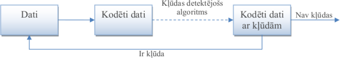
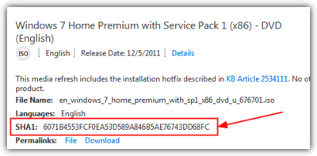

# &nbsp;

<hgroup>

<h1 style="font-size:28pt">Lietišķie algoritmi</h1>

<blue>Kļūdu korekcija - 1</blue>

</hgroup><hgroup>

**(1) Ievads**  
(2) [Kļūdu detekcija un korekcija](#section-1)  
(3) [Kopsavilkums](#section-2)

</hgroup>

<!--
* Izvākt vairumu R-S kodu uz 2.daļu. 
* Pievienot bildi, kurā 2d+1 attālums pamatots ar trijstūra nevienādību
* Pievienot bildi ar epsilon-apkārtnēm - pie Heminga kodu optimalitātes pierādījuma. 
* Atgādināt dzeltenajā slaidā par kreisi asociatīvām un labēji asociatīvām darbībām.

-->

--

## <lo-theory/> Mērķi

* Definēt kļūdu detekcijas un korekcijas atšķirības
* Pamatot apgalvojumu par divu kļūdu korekcijas kodu attālumu.
* Lietot un pamatot Heminga kodus. 

-----

# &nbsp;

<hgroup>

<h1 style="font-size:28pt">Lietišķie algoritmi</h1>

<blue>Kļūdu korekcija - 1</blue>

</hgroup><hgroup>

(1) [Ievads](#section-0)  
**(2) Kļūdu detekcija un korekcija**  
(3) [Kopsavilkums](#section-2)

</hgroup>

-----

# <lo-theory/> Kļūdu detekcija un korekcija

Kļūdu detekcija:

Kļūdu korekcija:

--

## <lo-summary/> Bitu paritātes metode

**Situācija:** Pārraida $n$ bitu virkni 
$x_1,x_2,\ldots,x_n \in \{ 0; 1\}$. 
Lai konstatētu iespējamu kļūdu $1$ bitā (kas var gan 
iestāties, gan neiestāties), pārraida $n+1$ bitus:  
Visus $x_1,x_2,\ldots,x_n$ un arī pēdējo bitu
$$\left( x_1 + x_2 + \ldots + x_n \right)\,\text{mod}\,2.$$

Pēdējais bits glabā visu iepriekšējo bitu paritāti. 
Tāpēc visu $n+1$ bitu paritāte ir $0$. Ja pārraidē rodas viena
kļūda, tad paritāte būs $1$, un kļūdu varēs konstatēt. 

--

## <lo-summary/> CRC kontrolsumma

"Frame Check Sequence" (FCS) izmanto 
32-bitu CRC (cyclical redundancy check). 
Tajā veic bitveida "XOR-ošanu stabiņā" ar maģisko 
skaitli `0xC704DD7B`. 

FCS 4 baitos ieraksta CRC doto atlikumu. Viena bita 
pārbaudīšana nav pietiekami droša; CRC32 ir noturīgāks
pret pārraides kļūdām, kas var pārmainīt vairākus blakusesošus
bitus. 

"Data link layer" (OSI Layer2) izmet tos freimus, 
kuri ir kļūdaini. Augstāka līmeņa transporta protokoli (TCP) 
palūdz kļūdainos freimus sūtīt atkārtoti. 

--

## <lo-summary/> MD5 hešfunkcija

Garākiem failiem (kuri varbūt tikuši bojāti apzināti) var 
izmantot hešfunkcijas. Piemēram MD5 izveido 128 bitu virknīti 
(pieraksta kā 32 hex ciparus). 

MD5 hešfunkcijas kolīzijas...

-----

# &nbsp;

<hgroup>

<h1 style="font-size:28pt">Lietišķie algoritmi</h1>

<blue>Kļūdu korekcija - 1</blue>

</hgroup><hgroup>

(1) [Ievads](#section-0)  
(2) [Kļūdu detekcija un korekcija](#section-1)  
**(3) Kopsavilkums**

</hgroup>

