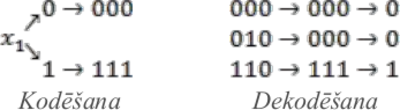

# &nbsp;

<hgroup>

<h1 style="font-size:28pt">Lietišķie algoritmi</h1>

<blue>Kļūdu korekcija - 1</blue>

</hgroup><hgroup>

<span style="color:darkgreen">**(1) Ievads**</span>  
<span>(2) [Kļūdu detekcija un korekcija](#section-1)</span>  
<span>(3) [Kļūdu korekcijas kodi](#section-2)</span>  
<span>(4) [Heminga kodi](#section-3)</span>  
<span>(5) [Citi lineāri kodi](#section-4)</span>  
<span>(6) [Rīda-Solomona pamatdoma](#section-5)</span>  
<span>(7) [Kopsavilkums](#section-6)</span>

</hgroup>


<!--
* Izvākt vairumu R-S kodu uz 2.daļu. 
* Pievienot bildi, kurā 2d+1 attālums pamatots ar trijstūra nevienādību
* Pievienot bildi ar epsilon-apkārtnēm - pie Heminga kodu optimalitātes pierādījuma. 
* Atgādināt dzeltenajā slaidā par kreisi asociatīvām un labēji asociatīvām darbībām.

-->


--

## <lo-theory/> Mērķi

* Definēt kļūdu detekcijas un korekcijas atšķirības
* Pamatot apgalvojumu par divu kļūdu korekcijas kodu attālumu.
* Lietot un pamatot Heminga kodus. 


-----

# &nbsp;

<hgroup>

<h1 style="font-size:28pt">Lietišķie algoritmi</h1>

<blue>Kļūdu korekcija - 1</blue>

</hgroup><hgroup>

<span>(1) [Ievads](#section)</span>  
<span style="color:darkgreen">**(2) Kļūdu korekcijas ievads**</span>  
<span>(3) [Kļūdu korekcijas kodi](#section-2)</span>  
<span>(4) [Heminga kodi](#section-3)</span>  
<span>(5) [Citi lineāri kodi](#section-4)</span>  
<span>(6) [Rīda-Solomona pamatdoma](#section-5)</span>  
<span>(7) [Kopsavilkums](#section-6)</span>

</hgroup>


-----

# <lo-theory/> Kļūdu korekcija


Ideja visās metodēs - papildināt pārraidāmos datus ar 
papildinformāciju, cerot, ka papildinformācija ļaus pamanīt 
kļūdas. 


--

## <lo-summary/> Triviāls kods: 3x atkārtošana



Katru pārraidāmo bitu atkārto trīs reizes. Saņēmējs 
atrod, kādu
bitu ir vairāk – nuļļu vai vieninieku.
Šāds kods var izlabot kļūdu vienā bitā.


-----

# &nbsp;

<hgroup>

<h1 style="font-size:28pt">Lietišķie algoritmi</h1>

<blue>Kļūdu korekcija - 1</blue>

</hgroup><hgroup>

<span>(1) [Ievads](#section)</span>  
<span>(2) [Kļūdu detekcija un korekcija](#section-1)</span>  
<span style="color:darkgreen">**(3) Kļūdu korekcijas kodi**</span>  
<span>(4) [Heminga kodi](#section-3)</span>  
<span>(5) [Citi lineāri kodi](#section-4)</span>  
<span>(6) [Rīda-Solomona pamatdoma](#section-5)</span>  
<span>(7) [Kopsavilkums](#section-6)</span>

</hgroup>


-----

# <lo-theory/> Korekcijas koda jēdziens

**Definīcija:** Par $[n,k,d]$-kodu sauc kļūdu korekcijas kodu, kurā  
$n$ – bitu skaits, kurus kodējums faktiski pārraida,  
$k$ – kodējamo bitu skaits,  
$d$ – kļūdu skaits, ko iespējams koriģēt.

**Piemērs:** Atkārtošanas metodei $n=3$, $k=1$, $d=1$, tāpēc tas ir
$[3,1,1]$-kods.


--

## <lo-summary/> Negatīvs piemērs

Vēlamies veidot kļūdu korekcijas kodu alfabētam, kurā ir 
$3$ ziņojumi: $A = \{ a,b,c \}$. (Ziņojumu skaits nav divnieka
pakāpe; informācijas saturs vienam ziņojumam ir $\log_2 3 \approx 1.585$ biti.)

Piedāvājam kodēt ziņojumus $a,b,c$ attiecīgi ar kodiem 
$S = \{ 1000,0101,1101 \}$.  
Šāds kods nespēj koriģēt vienu kļūdu, jo,
saņemot virkni `0101`, nav skaidrs, vai tika pārraidīta virkne `0101`
(bez kļūdām) vai arī virkne `1101`
(ar vienu kļūdu – pirmajā bitā).  
Divdomīgs ir arī `1001` u.c.


-----

# <lo-theory/> Kļūdu labošanas koda pazīmes

**Teorēma:** Kopa $S$ ir
$[n,k,d]$-kods tad un tikai tad, ja  
(1) $S$ sastāv no virknēm garumā $n$,  
(2) $|S| \geq 2^k$, lai visām $k$-bitu virknēm pietiktu kodu.  
(3) katras divas virknes no $S$ atšķiras vismaz $2d+1$ vietās.

**Pierādījums:** 
Kods nespēj koriģēt $d$ kļūdas, ja eksistē virkne $z = z_1z_2\ldots{}z_n$
un divas kopas virknes $x=x_1x_2\ldots{}x_n$ un $y=y_1y_2\ldots{}y_n$, 
kas katra atšķiras no $z$ ne vairāk kā $d$ vietās. 
Līdz ar to virknes $x$ un $y$ atšķiras ne vairāk kā $2d$
vietās. Tāpēc, lai kods spētu koriģēt
kļūdas, katrām divām kopas $S$ virknēm ir
jāatšķiras vismaz $2d+1$ vietā. $\blacksquare$


--

## <lo-summary> Piemērs `$\;n=3$`

Ja pārraidāmo bitu skaits ir $n=3$, 
bet maksimāli pieļaujamo kļūdu skaits $d=1$, 
tad vairāk par divām virknēm kopai $S$ nevar
piederēt. Ja $x_1x_2x_3 \in S$, tad 
otra var būt vienīgi tāda $y_1y_2y_3$, ka 
$y_1 \neq x_1$, $y_2 \neq x_2$, $y_3 \neq x_3$. 

**Secinājums:** Eksistē 
$[n,k,d]$ kods $[3,1,1]$, kas 
$n=3$ bitos pārraida $k=1$ satura bitu un 
var izlabot kļūdas, kuru skaits nepārsniedz $d = 1$.  
Lielāku bitu skaitu nekā $k=1$ (jeb divas 
atšķiramas virknes) pārraidīt nevar.

--

## <lo-summary/> Piemērs `$\;n=4$`

**Apgalvojums:** 
Ja pārraida $n=4$ bitus, arī tad nevar 
iekodēt vairāk par divām virknēm (kuras 
atšķiramas, ja kļūdu skaits nepārsniedz $d=1$). 

**Pierādījums:** 
Pieņemsim pretējo un aplūkosim trīs virknes, 
ko satur kopa $S$: $x_1x_2x_3x_4$,  
$y_1y_2y_3y_4$ un $z_1z_2z_3z_4$. 
Nekādas divas virknes nevar sakrist 
vairāk kā vienā vietā. 
Līdz ar to kopējais sakritību skaits 
nevar būt lielāks par $3$.


--

## <lo-summary/> Piemērs n=4 (turpināts)

Ja kādā pozīcijā $i$ 
visi trīs biti sakristu ($x_i = y_i = z_i$), tad 
būtu iegūta pretruna: visas trīs sakritības 
jau izlietotas, bet kaut kādām sakritībām 
jābūt arī citās pozīcijās $j \neq i$, 
jo ir trīs skaitļi $x_j$, $y_j$, $z_j$ un 
tikai divas vērtības. 

Ja divi biti sakrīt, bet trešais – atšķiras,
tad sakritību skaits šajā bitā ir 1.
Tā kā mums ir 4 biti, tad varam secināt, 
ka kopējais sakritību skaits būs vismaz 4, kas ir pretrunā ar to, ka šis skaits nevar būt lielāks par 3. 

Tātad kopa $S$ nevar saturēt vairāk par divām virknēm. 
$\blacksquare$


--

## <lo-sample/> Piemērs, ja n=5, k=2

<table>
<tr>
<th>$x_1$</th>
<th>$x_2$</th>
<th>$x_1,x_1,x_2,x_2,(x_1 + x_2)\,\text{mod}\,2$</th>
</tr>
<tr><td>$0$</td><td>$0$</td><td>`00000`</td></tr>
<tr><td>$0$</td><td>$1$</td><td>`00111`</td></tr>
<tr><td>$1$</td><td>$0$</td><td>`11001`</td></tr>
<tr><td>$1$</td><td>$1$</td><td>`11110`</td></tr>
</table>

Tabula parāda, kā kodēt divu bitu virknītes par piecu bitu 
virknītēm: divreiz pārraida pirmo bitu, divreiz - otro, 
bet pēdējais baits ir abu satura bitu paritāte. 

*Piezīme:* Tabulā redzams $[5,2,1]$-kods. 


--

## <lo-sample/> Vai pie n=5 būt vairāk par 4 virknēm? 

**Apgalvojums:** 
Kopa $S$ pie $n=5$ un $d=1$ nevar saturēt vairāk par četrām virknēm. 


Pieņemsim pretējo un aplūkosim piecas virknes, ko satur kopa $S$. 
Vismaz trim no tām pirmais bits būs vienāds, t.i., vai nu būs 
vismaz $3$ virknes, kurām pirmais bits vienāds ar $0$, 
vai arī vismaz $3$ virknes, kurām pirmais bits vienāds ar $1$. 

Šīm trim virknēm atšķirības var būt tikai pēdējos četros bitos. 
Bet četru bitu gadījumā jau tika pierādīts, ka lielākais 
atšķiramo virkņu skaits ir $2$. Tāpēc kādas divas no 
šīm trim virknēm atšķirsies mazāk nekā trijās vietās.
Pretruna. $\blacksquare$


-----

# &nbsp;

<hgroup>

<h1 style="font-size:28pt">Lietišķie algoritmi</h1>

<blue>Kļūdu korekcija - 1</blue>

</hgroup><hgroup>

<span>(1) [Ievads](#section)</span>  
<span>(2) [Kļūdu detekcija un korekcija](#section-1)</span>  
<span>(3) [Kļūdu korekcijas kodi](#section-2)</span>  
<span style="color:darkgreen">**(4) Heminga kodi**</span>  
<span>(5) [Citi lineāri kodi](#section-4)</span>  
<span>(6) [Rīda-Solomona pamatdoma](#section-5)</span>  
<span>(7) [Kopsavilkums](#section-6)</span>

</hgroup>


-----

# <lo-theory/> Ja pārraida n=7 bitus

<hgroup>

No $n=7$ iespējams izveidot $2^4 = 16$ atšķiramas virknes:

</hgroup>

<hgroup>

```
0000000
0000111
0011001
0011110
0101010
0101101
0110011
0110100
1001011
1001100
1010010
1010101
1100001
1100110
```
</hgroup>

--

## <lo-summary/> Heminga koda konstruēšana

Virkni $x_1x_2x_3x_4$ pārraida 
kā $x_1x_2x_3y_1x_4y_2y_3$, 
kur 

$$y_1 = \left( x_1 + x_2 + x_3 \right)\,\text{mod}\,2$$
$$y_2 = \left( x_1 + x_2 + x_4 \right)\,\text{mod}\,2$$
$$y_1 = \left( x_1 + x_3 + x_4 \right)\,\text{mod}\,2$$

Šis ir $[7,4,1]$-kods, ko sauc arī par 
<blue>*Heminga kodu*</blue> (*Haming code*). 


-----

# <lo-theory/> Apgalvojums par Hemingu [7,4,1]

**Teorēma:** Katras divas šādi konstruētas
7-bitu virknes atšķirsies vismaz $3$ vietās
(tātad varēs izlabot vienu kļūdu). 

**Pierādījums:** Apskatīsim jebkuras divas
pareizi izrēķinātas (bez kļūdām saņemtas)
virknes $x_1x_2x_3y_1x_4y_2y_3$ un 
$x'_1x'_2x'_3y'_1x'_4y'_2y'_3$.


--

## <lo-summary/> Pierādījums - 1

**1.gadījums:** Atšķiras viens $x_i$.  
Katrs $x_i$ ietilpst vismaz $2$ no formulām 
priekš $y_1$, $y_2$, $y_3$ un, mainoties $x_i$ vērtībai,
mainīsies šo formulu vērtības. 
Tāpēc virknes atšķiras vismaz $3$ vietās: vienā $x_i$ un
vismaz divos $y_i$.

<div style="font-size:70%; color:blue;">
$$y_1 = \left( x_1 + x_2 + x_3 \right)\,\text{mod}\,2$$
$$y_2 = \left( x_1 + x_2 + x_4 \right)\,\text{mod}\,2$$
$$y_1 = \left( x_1 + x_3 + x_4 \right)\,\text{mod}\,2$$
</div>


--

## <lo-summary/> Pierādījums - 1

**2.gadījums:** Atšķiras divi $x_i$.  
Apzīmējam atšķirīgos bitus ar $x_i$ un $x_j$. 
Lai kādi būtu $i$ un $j$, mēs vienmēr varam atrast
vienu no $y_i$ formulām, kurā ietilpst viens no 
$x_i$ un $x_j$, bet ne otrs. Virknes atšķirsies
vismaz $3$ vietās: divos $x_i$ un šajā vienā $y_i$.

**3.gadījums:** Atšķiras trīs $x_i$.  
Tad uzreiz ir $3$ atšķirības attiecīgajos $x_i$ (jo tos 
pārraida arī pašus).


-----

# <lo-theory/> Heminga kods: Vispārīgais gadījums

Heminga kods sastāv no $2^n-1$ bitu virknēm, 
kurās $2^n-n-1$ biti tiek izmantoti ziņojumam, bet $n$ 
ir kontrolbiti, kas tiek izrēķināti no ziņojuma bitiem.

Lai aprakstītu šo kodu, sanumurējam $2^n-1$ bitu pozīcijas 
ar skaitļiem $1, 2, \ldots, 2^n-1$, 
šos skaitļus pierakstot binārajā skaitīšanas sistēmā 
(`000001`, `000010`, $\ldots$, `111111`). 
Ir $n$ skaitļi, kuru binārajā pierakstā ir tieši 
viens $1$ (`000001`, `000010`, $\ldots$, `100000`). 
Šajās pozīcijās būs kontrolbiti. 

Pārējās pozīcijas ir ziņojuma biti, kas var būt patvaļīgi.


--

## <lo-theory/> Piemēri

Vispārinātais Hemings ir 
$\left[ 2^n - 1, 2^n - n - 1,1 \right]$ kods - koriģē tikai $1$ bitu.

* Ja $n = 2$, tad iegūstam $[3,1,1]$ (trīskāršā atkārtošana). 
* Ja $n = 3$, tad Hemings $[7,4,1]$. 
* Ja $n = 4$, tad Hemings $[15,11,1]$. 
* Ja $n = 5$, tad Hemings $[31,26,1]$. 
* Ja $n = 6$, tad Hemings $[64,57,1]$. 


--

## <lo-summary/> Kontrolbitu izrēķināšana

`$$x_{0\ldots{}010\ldots{}0} = \left( 
\sum\limits_{i_1,\ldots,i_{k-1},i_{k+1},\ldots,i_{n}}
x_{i_1\ldots{}i_{k-1}1i_{k+1}\ldots{}i_n} \right)\;\text{mod}\;2.$$`

Lai atrastu, vai ir kļūda, rīkojās šādi. Ja kontrolbits pozīcijā 
$0\ldots{}010\ldots{}0$ (ar 1-nieku $k$-tajā ciparā) 
**nesakrīt** ar to, kas izrēķināts pēc formulas, 
tad mēs zinām, ka kādā no bitiem, 
kuru numuriem $k$-tā pozīcija $=1$ ir kļūda. 

Ja kontrolbits pozīcijā $0\ldots{}010\ldots{}0$ (ar 1-nieku $k$-tajā ciparā) 
**sakrīt** ar to, kas izrēķināts pēc formulas, 
tad kļūda var būt tikai tajos bitos, kuru numuriem 
$k$-tajā pozīcijā ir $0$ 
(jo visi biti ar 1 k-tajā pozīcijā ietilpst formulā).


--

## <lo-summary/> Kļūdas atrašana

Šādā veidā pēc katra kontrolbita var noteikt vienu bitu 
pozīcijai, kurā ir kļūda, numura. 
Kontrolbiti tad pilnībā nosaka šīs pozīcijas numuru. 
Ja iegūtais numurs ir $000\ldots{}000$ 
(t.i., visi kontrolbiti sakrita), tad kļūdas nav vispār. 
Citādi, mēs zinām, kurā vietā tā ir.

Kas notiek, ja kļūda ir pašā kontrolbitā?


-----

# <lo-theory/> Heminga koda optimalitāte

**Teorēma:** 
Ja $S \subseteq \{ 0, 1\}^{2^n-1}$ ir kods, kas spēj 
koriģēt vienu kļūdu, tad 
$$|S| \leq 2^{2^n-n-1}.$$

Šī teorēma nozīmē, ka virkņu skaitu Heminga kodā 
nevar uzlabot pat par $1$ virkni!


--

## <lo-summary/> Optimalitātes pierādījums

Apzīmējam koda virknes ar $v_1,\ldots,v_m$. 
Ar $V_i$ apzīmējam kopu, kur ietilpst $v_i$ un 
visas virknes, kas atšķiras no $v_i$ tieši vienā vietā
(koda $v_i$ "$\varepsilon$-apkārtne"). 

1. Apkārtnēm $V_i$ un $V_j$ ($i \neq j$) nav kopīgu elementu, 
citādi nevarētu veikt kļūdu korekciju. 
2. Katrā $V_i$ ietilpst tieši $2^n$ virknes: $v_i$ un 
$2^n - 1$ virknes, kas atšķiras no tās kādā $1$ pozīcijā. 

Tāpēc kopās $V_1,V_2,\ldots,V_m$ kopā ir $2^n \cdot m$ elementi. 
Tā kā ir pavisam $2^{2^n - 1}$ virkņu garumā $2^n-1$, tad

`$$2^n \cdot m \leq 2^{2^n - 1} \;\;\Rightarrow\;\; m \leq 2^{2^n - n-1}.$$`


-----

# &nbsp;

<hgroup>

<h1 style="font-size:28pt">Lietišķie algoritmi</h1>

<blue>Kļūdu korekcija - 1</blue>

</hgroup><hgroup>

<span>(1) [Ievads](#section)</span>  
<span>(2) [Kļūdu detekcija un korekcija](#section-1)</span>  
<span>(3) [Kļūdu korekcijas kodi](#section-2)</span>  
<span>(4) [Heminga kodi](#section-3)</span>  
<span style="color:darkgreen">**(5) Citi lineāri kodi**</span>  
<span>(6) [Rīda-Solomona pamatdoma](#section-5)</span>  
<span>(7) [Kopsavilkums](#section-6)</span>

</hgroup>


-----

# <lo-theory/> Lineāra koda jēdziens

Jebkuru kodu, kurā katrs nokodētās virknes bits ir aprakstāms ar formulu
$$\left( x_{i_1} + \ldots + x_{i_k} \right)\,\text{mod}\,2$$
sauc par lineāru kodu. Heminga kods ir lineārs kods un gandrīz visi citi praksē lietotie
kodi arī ir lineāri.

Lineāru kodu var aprakstīt ar tā ģeneratormatricu. 
Ja $n$ ir kodētā ziņojuma garums, bet
$k$ – nokodēto bitu skaits, tad ģeneratormatrica ir $n \times k$ matrica. 
Ja bits $x_i$ ietilpst formulāpēc kuras rēķina $j$-to nokodētā ziņojuma bitu, 
tad šīs matricas $(i,j)$-ajā vietā ir $1$.
Citādi tur ir $0$. 


--

## <lo-summary/> Lineāra koda piemērs

<div style="font-size:70%">

Heminga $[7,4,1]$ ģeneratormatrica izskatās šādi:

`$$G = \left(
\begin{array}{cccc}
1 & 0 & 0 & 0 \\
0 & 1 & 0 & 0 \\
0 & 0 & 1 & 0 \\
1 & 1 & 1 & 0 \\
0 & 0 & 0 & 1 \\
1 & 1 & 0 & 1 \\
1 & 0 & 1 & 1 
\end{array} \right)$$`

1.,2.,3. un 5. rinda apraksta kodētā ziņojuma 
bitu sakrišanu ar sākotnējā ziņojuma bitiem.  
Pārējās rindas apraksta formulas kontrolbitiem. 

</div>


--

## <lo-summary/> Ziņojuma kodēšana

Lai nokodētu ziņojumu, mēs aprakstām to ar vektoru:

`$$\mathbf{x} = \left( \begin{array}{l}
x_1\\
x_2\\
x_3\\
x_4
\end{array} \right)$$`

un tad reizinām šo vektoru ar ģeneratormatricu $M$.  
Nokodētais ziņojums būs $M\mathbf{x}$, 
visus tā elementus rēķinot pēc moduļa $2$.


--

## <lo-summary/> Lineāru kodu pareizības pārbaude - 1

Atkodēšanai izmanto arī
paritātes pārbaudes matricu. Hemingam $[7,4,1]$ tā ir šāda:

`$$P = \left( \begin{array}{ccccccc}
1 & 1 & 1 & 1 & 0 & 0 & 0\\
1 & 1 & 0 & 0 & 1 & 1 & 0\\
1 & 0 & 1 & 0 & 1 & 0 & 1
\end{array} \right).$$`

Katra tabulas rinda apraksta vienu no Heminga koda pārbaudēm 
(vai kontrolbits sakrīt ar noteiktu bitu summu pēc mod $2$). 


--

## <lo-summary/> Lineāru kodu pareizības pārbaude - 2

Ja $\mathbf{y}$ – nokodētais ziņojums, $P$ – paritātes 
pārbaudes matrica un kļūdu nav, tad, rēķinot pēc mod $2$, jāizpildās

`$$P\mathbb{y} = \left( \begin{array}{c}
0 \\ 
0 \\
0 
\end{array} \right).$$`

Paritātes pārbaudes matricu var izmantot arī, 
lai noteiktu, kur ir kļūdas, ja tādas ir, 
bet tas ir sarežģītāk un šajā kursā netiks aplūkots.


-----

# &nbsp;

<hgroup>

<h1 style="font-size:28pt">Lietišķie algoritmi</h1>

<blue>Kļūdu korekcija - 1</blue>

</hgroup><hgroup>

<span>(1) [Ievads](#section)</span>  
<span>(2) [Kļūdu detekcija un korekcija](#section-1)</span>  
<span>(3) [Kļūdu korekcijas kodi](#section-2)</span>  
<span>(4) [Heminga kodi](#section-3)</span>  
<span>(5) [Citi lineāri kodi](#section-4)</span>  
<span style="color:darkgreen">**(6) Heminga piemēri**</span>  
<span>(7) [Kopsavilkums](#section-6)</span>

</hgroup>


-----

# <lo-summary/> 7-bitu Heminga kods

<div style="font-size:90%">

<table>
<tr>
<th>$x;y$ apzīmējumi</th><td>$x_1$</td><td>$x_2$</td><td>$x_3$</td><td>$\color{#F00}{y_1}$</td><td>$x_4$</td><td>$\color{#F00}{y_2}$</td><td>$\color{#F00}{y_3}$</td>
</tr>
<tr>
<th><blue>Vispārīgais apzīmējums</blue></th>
<td>$\color{#00F}{x_{111}}$</td>
<td>$\color{#00F}{x_{110}}$</td>
<td>$\color{#00F}{x_{101}}$</td>
<td>$\color{#00F}{x_{100}}$</td>
<td>$\color{#00F}{x_{011}}$</td>
<td>$\color{#00F}{x_{010}}$</td>
<td>$\color{#00F}{x_{001}}$</td>
</tr>
</table>

Kodi $x_{111},\ldots,x_{001}$ izkārtoti <blue>*apgrieztā leksikogrāfiskā secībā*</blue> 
(*reverse lexicographic order* - [Wikipedia](https://oeis.org/wiki/Orderings#Reverse_lexicographic_order)). 

Kāpēc virknītē $x_1,x_2,x_3,y_1,x_4,y_2,y_3$ 
ziņojuma biti $x_i$ nedaudz sajaukti ar kontrolbitiem $y_j$?

`$$\left\{
\begin{array}{l}
y_{1} = \color{#00F}{x_{100}} = \color{#00F}{x_{111} \oplus x_{110} \oplus x_{101}} = x_1 \oplus x_2 \oplus x_3\\
y_{2} = \color{#00F}{x_{010}} = \color{#00F}{x_{111} \oplus x_{110} \oplus x_{011}} = x_1 \oplus x_2 \oplus x_4\\
y_{3} = \color{#00F}{x_{001}} = \color{#00F}{x_{111} \oplus x_{101} \oplus x_{011}} = x_1 \oplus x_3 \oplus x_4
\end{array} \right.$$`

Ar `$x_1 \oplus x_2$` apzīmējam 
`$\left(x_1+x_2\right)\,\text{mod}\,2$`.  
Saskaitīšana pēc moduļa $2$ jeb XOR, jeb 
"izslēdzošais VAI".

</div>


-----

# <lo-sample/> Piemērs #1

Izmantojot Heminga kodu $[7,4,1]$, nokodēt virkni 0110.


--

## <lo-soln/> Piemērs #1

<hgroup style="font-size:70%">

Ņemam $x_1 = 0$, $x_2 = 1$, $x_3 = 1$, $x_4 = 0$.  
Aprēķinot $y_1$, $y_2$, $y_3$ saskaņā ar
formulām:
$$\left\{
\begin{array}{l}
y_1 = x_1 \oplus x_2 \oplus x_3\\
y_2 = x_1 \oplus x_2 \oplus x_4\\
y_3 = x_1 \oplus x_3 \oplus x_4
\end{array} \right.$$
Iegūst $y_1 = 0$, $y_2 = 1$, $y_3 = 1$.  
Tātad kodētais ziņojums būs: `0110011`.

</hgroup>
<hgroup>

Saskaitīšana pēc mod $2$:

<table>
<tr>
<td>$x_1 \oplus x_2$</td>
<th>$x_1=\mathtt{0}$</th>
<th>$x_1=\mathtt{1}$</th>
</tr>
<tr>
<th>$x_2 = \mathtt{0}$</th>
<td>0</td>
<td>1</td>
</tr>
<tr>
<th>$x_2 = \mathtt{1}$</th>
<td>1</td>
<td>0</td>
</tr>
</table>


</hgroup>


-----

# <lo-sample/> Piemērs #2

Izmantojot Heminga kodu $[7,4,1]$, atkodēt virkni `0111101`.


--

## <lo-soln/> Piemērs #2

<hgroup style="font-size:70%">

`$$\left\{
\begin{array}{l}
y_1 = x_1 \oplus x_2 \oplus x_3,\\
y_2 = x_1 \oplus x_2 \oplus x_4,\\
y_3 = x_1 \oplus x_3 \oplus x_4.
\end{array} \right.$$`

* $y_1$ nesakrīt $\Rightarrow$ kļūda var būt tikai kādā no bitiem, kas ietekmē $y_1$ ($y_1, x_1, x_2, x_3$). 
* $y_2$ sakrīt $\Rightarrow$ kļūda var būt tikai kādā no bitiem, kas neietekmē $y_2$ ($y_1, y_3, x_3$).
* $y_3$ nesakrīt $\Rightarrow$ kļūda var būt tikai kādā no bitiem, kas ietekmē $y_3$ ($x_1, x_3, x_4, y_3$).
* Vienīgais bits, kas ir atzīmēts visās rindās ir $x_3$. Tātad tas ir kļūdainais bits. 

Sākotnējais ziņojums bija $\mathtt{01}\color{#F00}{\mathtt{0}}\mathtt{1101}$ 
(un $x_1x_2x_3x_4 = \mathtt{0101}$).

</hgroup>
<hgroup style="font-size:70%">

"X" $i$-tajā rindiņā nozīmē, ka kontrolbits $y_i$ 
pieļauj iespēju, ka attiecīgajā bitā ir kļūda.

<table>
<tr>
<th style="border-bottom: 0px !important;">$x_1$</th>
<th style="border-bottom: 0px !important;">$x_2$</th>
<th style="border-bottom: 0px !important;">$x_3$</th>
<th style="border-bottom: 0px !important;">$y_1$</th>
<th style="border-bottom: 0px !important;">$x_4$</th>
<th style="border-bottom: 0px !important;">$y_2$</th>
<th style="border-bottom: 0px !important;">$y_3$</th>
</tr>
<tr>
<th>`0`</th>
<th>`1`</th>
<th>`1`</th>
<th>`1`</th>
<th>`1`</th>
<th>`0`</th>
<th>`1`</th>
</tr>
<tr><td>X</td><td>X</td><td>X</td><td>X</td><td>&nbsp;</td><td>&nbsp;</td><td>&nbsp;</td></tr>
<tr><td>&nbsp;</td><td>&nbsp;</td><td>X</td><td>X</td><td>&nbsp;</td><td>&nbsp;</td><td>X</td></tr>
<tr><td>X</td><td>&nbsp;</td><td>X</td><td>&nbsp;</td><td>X</td><td>&nbsp;</td><td>X</td></tr>
<tr>
<th>`0`</th>
<th>`1`</th>
<th><red>`0`</red></th>
<th>`1`</th>
<th>`1`</th>
<th>`0`</th>
<th>`1`</th>
</tr>
</table>

</hgroup>


-----

# <lo-sample/> Piemērs #3

Izmantojot Heminga kodu $[7,4,1]$, atkodēt virkni `1010010`.


--

## <lo-soln/> Piemērs #3

<hgroup style="font-size:70%">

$$\left\{
\begin{array}{l}
y_1 = x_1 \oplus x_2 \oplus x_3,\\
y_2 = x_1 \oplus x_2 \oplus x_4,\\
y_3 = x_1 \oplus x_3 \oplus x_4.
\end{array} \right.$$

* $y_1$ sakrīt $\Rightarrow$ kļūda var būt tikai kādā no bitiem, kas neietekmē $y_1$ ($y_2, y_3, x_4$). 
* $y_2$ sakrīt $\Rightarrow$ kļūda var būt tikai kādā no bitiem, kas neietekmē $y_2$ ($y_1, y_3, x_3$).
* $y_3$ sakrīt $\Rightarrow$ kļūda var būt tikai kādā no bitiem, kas neietekmē $y_3$ ($y_1, y_2, x_2$).
* Nav neviena bita, kas ir atzīmēts visās rindās. Kļūdainu bitu nav.

Sākotnējais ziņojums bija $\mathtt{1010010}$ 
(un $x_1x_2x_3x_4 = \mathtt{1010}$).

</hgroup>
<hgroup style="font-size:70%">

"X" $i$-tajā rindiņā nozīmē, ka kontrolbits $y_i$ 
pieļauj iespēju, ka attiecīgajā bitā ir kļūda.

<table>
<tr>
<th style="border-bottom: 0px !important;">$x_1$</th>
<th style="border-bottom: 0px !important;">$x_2$</th>
<th style="border-bottom: 0px !important;">$x_3$</th>
<th style="border-bottom: 0px !important;">$y_1$</th>
<th style="border-bottom: 0px !important;">$x_4$</th>
<th style="border-bottom: 0px !important;">$y_2$</th>
<th style="border-bottom: 0px !important;">$y_3$</th>
</tr>
<tr>
<th>`1`</th>
<th>`0`</th>
<th>`1`</th>
<th>`0`</th>
<th>`0`</th>
<th>`1`</th>
<th>`0`</th>
</tr>
<tr><td>&nbsp;</td><td>&nbsp;</td><td>&nbsp;</td><td>&nbsp;</td><td>X</td><td>X</td><td>X</td></tr>
<tr><td>&nbsp;</td><td>&nbsp;</td><td>X</td><td>X</td><td>&nbsp;</td><td>&nbsp;</td><td>X</td></tr>
<tr><td>&nbsp;</td><td>X</td><td>&nbsp;</td><td>X</td><td>&nbsp;</td><td>X</td><td>&nbsp;</td></tr>
<tr>
<th>`1`</th>
<th>`0`</th>
<th>`1`</th>
<th>`0`</th>
<th>`0`</th>
<th>`1`</th>
<th>`0`</th>
</tr>
</table>


</hgroup>


-----

# <lo-sample/> Piemērs #4

Izmantojot Heminga kodu $[7,4,1]$, atkodēt virkni `1101110`.


--

## <lo-soln/> Piemērs #4

<hgroup style="font-size:70%">

$$\left\{
\begin{array}{l}
y_1 = x_1 \oplus x_2 \oplus x_3,\\
y_2 = x_1 \oplus x_2 \oplus x_4,\\
y_3 = x_1 \oplus x_3 \oplus x_4.
\end{array} \right.$$

* $y_1$ nesakrīt $\Rightarrow$ kļūda ir kādā no bitiem, kas ietekmē $y_1$ ($y_1, x_1, x_2, x_3$). 
* $y_2$ sakrīt $\Rightarrow$ kļūda ir kādā no bitiem, kas neietekmē $y_2$ ($y_1, y_3, x_3$).
* $y_3$ sakrīt $\Rightarrow$ kļūda ir kādā no bitiem, kas neietekmē $y_3$ ($x_2, y_1, y_2$).
* Vienīgas bits, kas ir atzīmēts visās rindās ir $y_1$. Tātad tas ir kļūdainais bits. 

Tāpēc nosūtītais ziņojums bija $\mathtt{110}\color{#F00}{\mathtt{0}}\mathtt{110}$
(un $x_1x_2x_3x_4 = \mathtt{1101}$).

</hgroup>
<hgroup style="font-size:70%">

"X" $i$-tajā tabulas rindiņā nozīmē, ka kontrolbits $y_i$ 
pieļauj iespēju, ka attiecīgajā bitā ir kļūda.

<table>
<tr>
<th style="border-bottom: 0px !important;">$x_1$</th>
<th style="border-bottom: 0px !important;">$x_2$</th>
<th style="border-bottom: 0px !important;">$x_3$</th>
<th style="border-bottom: 0px !important;">$y_1$</th>
<th style="border-bottom: 0px !important;">$x_4$</th>
<th style="border-bottom: 0px !important;">$y_2$</th>
<th style="border-bottom: 0px !important;">$y_3$</th>
</tr>
<tr>
<th>`1`</th>
<th>`1`</th>
<th>`0`</th>
<th>`1`</th>
<th>`1`</th>
<th>`1`</th>
<th>`0`</th>
</tr>
<tr><td>X</td><td>X</td><td>X</td><td>X</td><td>&nbsp;</td><td>&nbsp;</td><td>&nbsp;</td></tr>
<tr><td>&nbsp;</td><td>&nbsp;</td><td>X</td><td>X</td><td>&nbsp;</td><td>&nbsp;</td><td>X</td></tr>
<tr><td>&nbsp;</td><td>X</td><td>&nbsp;</td><td>X</td><td>&nbsp;</td><td>X</td><td>&nbsp;</td></tr>
<tr>
<th>`1`</th>
<th>`1`</th>
<th>`0`</th>
<th><red>`0`</red></th>
<th>`1`</th>
<th>`1`</th>
<th>`0`</th>
</tr>
</table>


</hgroup>


-----

# &nbsp;

<hgroup>

<h1 style="font-size:28pt">Lietišķie algoritmi</h1>

<blue>Kļūdu korekcija - 1</blue>

</hgroup><hgroup>

<span>(1) [Ievads](#section)</span>  
<span>(2) [Kļūdu detekcija un korekcija](#section-1)</span>  
<span>(3) [Kļūdu korekcijas kodi](#section-2)</span>  
<span>(4) [Heminga kodi](#section-3)</span>  
<span>(5) [Citi lineāri kodi](#section-4)</span>  
<span>(6) [Rīda-Solomona pamatdoma](#section-5)</span>  
<span style="color:darkgreen">**(7) Kopsavilkums**</span>

</hgroup>


