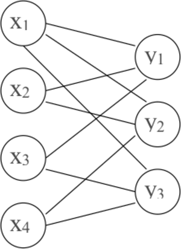
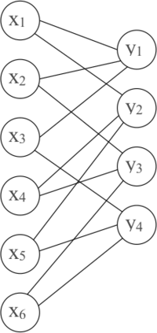

# &nbsp;

<hgroup>

<h1 style="font-size:28pt">Lietišķie algoritmi</h1>

<blue>Kļūdu korekcija - 2</blue>

</hgroup><hgroup>

**(1) Ievads**  
(2) [Tornado kodi](#section-1)  
(3) [Kopsavilkums](#section-2)

</hgroup>

-----

# <lo-why/> why

Kāpēc kļūdu korekcijas algoritma izvēle (un pat atkodēšana) 
atkarīga no situācijas?

* Kā vienkārši atkodēt Heminga kodus? 
* Kādu skaitļu pasaulē darbojas Rīda-Solomona kodi?

-----

# &nbsp;

<hgroup>

<h1 style="font-size:28pt">Lietišķie algoritmi</h1>

<blue>Kļūdu korekcija - 2</blue>

</hgroup><hgroup>

(1) [Ievads](#section-0)  
**(2) Tornado kodi**  
(3) [Kopsavilkums](#section-2)

</hgroup>

-----

# <lo-theory/> Tornado kodu ievads

* Tornado kodi izstrādāti 1990-to gadu beigās. 
* Datu pārraide, ja liela datu daļa var tikt pazaudēta, 
bet saņemtie dati ir pareizi. (Piemēram, ja 
datu pakete tiek saņemta, tad tās dati ir pareizi, bet
pakešu pazušana ir bieža.) 
* Var lietot arī Rīda-Solomona kodus. Taču to atkodēšanai jārisina 
vai nu lineāras vienādojumu sistēmas vai arī interpolācija. 
Abi aprēķini ir diezgan darbietilpīgi. 
* Tornado kodi ļauj koriģēt (datu pazušanas) kļūdu apjomu līdzīgu 
Rīda-Solomona kodiem, izmantojot tikai XOR operāciju.

--

## <lo-theory/> Tornado kodi un XOR

Vienkāršākais Tornado kodu speciālgadījums ir šāds. 
Kods sastāv no ziņojuma bitiem $x_1, x_2, \ldots$ un 
kontrolbitiem $y_1, y_2, \ldots$. Katrs kontrolbits ir vairāku ziņojuma bitu XOR 
(summa pēc moduļa $2$). 

Šādu kodu var attēlot ar divdaļīgu grafu, kur virsotnes kreisajā pusē 
atbilst ziņojuma bitiem $x_1, x_2, \ldots$, bet virsotnes labajā pusē - 
kontrolbitiem $y_1, y_2, \ldots$. Ja kontrolbits 
$y_i$ ir kaut kādu ziņojuma bitu $x_j$ XOR, tad $y_i$ atbilstošā virsotne 
tiek savienota ar katram $x_j$ atbilstošo virsotni. 

--

## <lo-summary/> Hemings kā atsevišķs gadījums

<hgroup>

Piemēram, Heminga kodam $[7,4,1]$, 
kur kontrolbiti definēti kā

$$\left\{
\begin{array}{l}
y_1 = x_1 \oplus x_2 \oplus x_3\\
y_2 = x_1 \oplus x_2 \oplus x_4\\
y_3 = x_1 \oplus x_3 \oplus x_4\\
\end{array} \right.$$

atbilst šāds grafs:

</hgroup>
<hgroup>

</hgroup>

--

## <lo-summary/> Tornado atkodēšana

Pieņemsim, ka mums ir situācija, kad visi kontrolbiti $y_i$ saņemti, 
bet trūkst dažu ziņojuma bitu. Tad atkodēšanu var veikt šādi:

1. Atrodam kontrolbitu $y_i$, kuram ir zināmi visi $x_j$, 
kas izmantoti tā aprēķinā, atskaitot vienu.
2. Izmantojot zināmās vērtības, aprēķinam trūkstošo $x_j$.
3. Ja vēl nav atrasti visi $x_j$, atgriežamies pie 1.soļa un meklējam nākošo $y_i$,
kuram ir zināmi visi tajā ietilpstošie $x_j$, atskaitot vienu.

-----

# <lo-sample/> Piemērs

<hgroup>

</hgroup>
<hgroup>

Kļūdas koriģējošs kods uzdots ar 
zīmējumā redzamo grafu.  
Zināms, ka $x_1 = 1$, $x_2 = 0$, 
$x_5 = 1$, $y_1 = 0$, $y_2 = 1$, $y_3 = 1$, $y_4 = 0$. 
Noteikt pazaudētos ziņojuma bitus.

</hgroup>

--

## <lo-soln/> Piemēra atrisinājums

<hgroup style="font-size:70%">

$(x_1,x_2,\color{#F00}{x_3},\color{#F00}{x_4},x_5,\color{#F00}{x_6}) = (1,0,?,?,1,?)$,  
$(y_1,y_2,y_3,y_4) = (0,1,1,0)$.

</hgroup>
<hgroup>

* Pēc $y_1 = x_1 \oplus x_2 \oplus x_3$ nosakām, ka $0 = 1 \oplus 0 \oplus x_3$, kas nozīmē, ka $x_3 = 1$.
* Pēc $y_3 = x_1 \oplus x_4 \oplus x_5$ nosakām, ka $1 = 1 \oplus x_4 \oplus 1$, kas nozīmē, ka $x_4 = 1$.
* Pēc $y_4 = x_3 \oplus x_5 \oplus x_6$ nosakām, ka $0 = 1 \oplus 1 \oplus x_6$, kas nozīmē, ka $x_6 = 0$.

</hgroup>

-----

# &nbsp;

<hgroup>

<h1 style="font-size:28pt">Lietišķie algoritmi</h1>

<blue>Kļūdu korekcija - 2</blue>

</hgroup><hgroup>

(1) [Ievads](#section-0)  
(2) [Tornado kodi](#section-1)  
**(3) Kopsavilkums**

</hgroup>

-----

# <lo-theory/> Ko darījām nodarbībā

* Nokodējām un atkodējām Heminga kodus
* Definējām Rīda-Solomona kodus
* Saskaitījām un reizinājām galīgu lauku elementus
* Aplūkojām dažas Rīda-Solomona kodu atkodēšanas metodes, t.sk. Berlekampa-Velča algoritmu.
* Aplūkojām dažus vienkāršus Tornado kodu piemērus.

