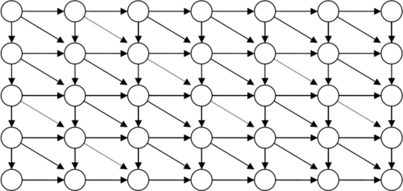

# &nbsp;

<hgroup>

<h1 style="font-size:28pt">Lietišķie algoritmi</h1>

<blue>Virkņu meklēšana - 2</blue>

</hgroup><hgroup style="font-size:90%">

<span style="color:darkgreen">**(1) Ievads**</span>  
<span>(2) [Bojera-Mūra algoritms](#section-1)</span>  
<span>(3) [BM algoritma piemēri](#section-2)</span>  
<span>(4) [Rekursīvu algoritmu sarežģītība](#section-3)</span>  
<span>(5) [Dinamiskā programmēšana](#section-4)</span>  
<span>(6) [Labošanas attālums](#section-5)</span>  
<span>(7) [(P) Regulāru izteiksmju meklēšana](#section-6)</span>  
<span>(8) [Kopsavilkums](#section7)</span>

</hgroup>

<!--
Meklēšana virknēs - 2
------
Ievads
Bojera-Mūra algoritms
BM algoritma piemēri
Dinamiskā programmēšana (Fibonači virknes; Daijkstras algoritms)
Rekursīvu algoritmu sarežģītība
Labošanas attālums
(P) Regulāru izteiksmju meklēšana
Kopsavilkums


Meklēšana virknēs - 3
------------
Ievads

Sufiksu koku jēdziens
Ukkonena algoritms
(P) Failu digitālnospiedumi (fingerprinting) un Blūma filtri
Kopsavilkums
-->

-----


# <lo-why/> why

<div class="bigWhy">

Kāpēc jāizmanto dinamiskā programmēšana?

</div>

<div class="smallWhy">

* Dažiem optimizācijas uzdevumiem 
jādala uzdevums apakšuzdevumos.
* Starprezultātu iegaumēšana var būtiski paātrināt
dažus algoritmus.

</div>


--

## <lo-summary/> Nodarbības mērķi 

* Aprakstīt Bojera Mūra algoritmu. 
* Aplūkot BM piemērus un darbības pareizību. 
* Salīdzināt rekursīvi definētas un iteratīvā ciklā definētas funkcijas
(faktoriāli, Fibonači skaitļi)
* Atgādināt Daikstras īsāko ceļu algoritmu. 
* Definēt Levenšteina attālumu 2 virknēm
* Atrast Levenšteina attālumu ar dinamisko programmēšanu. 
* Atrast Levenšteina attālumu ar izmainītu Daikstras algoritmu.


-----

# &nbsp;

<hgroup>

<h1 style="font-size:28pt">Lietišķie algoritmi</h1>

<blue>Virkņu meklēšana - 2</blue>

</hgroup><hgroup style="font-size:90%">

<span>(1) [Ievads](#section)</span>  
<span>(2) [Bojera-Mūra algoritms](#section-1)</span>  
<span>(3) [BM algoritma piemēri](#section-2)</span>  
<span style="color:darkgreen">**(4) Rekursīvu algoritmu sarežģītība**</span>  
<span>(5) [Dinamiskā programmēšana](#section-4)</span>  
<span>(6) [Labošanas attālums](#section-5)</span>  
<span>(7) [(P) Regulāru izteiksmju meklēšana](#section-6)</span>  
<span>(8) [Kopsavilkums](#section7)</span>

</hgroup>


-----

# <lo-theory/> "Astes rekursija"

```python 
def factorial(n): 
    if n == 0: return 1
    else: return n*factorial(n-1)

print(factorial(100))
```

* Vai funkcija pareizi rēķina faktoriālus pie $n \geq 0$?
* Kas strādā labāk - rekursīva faktoriāla izteiksme vai reizināšana ar "for" ciklu?


-----

# <lo-sample/> Fibonači virkne

<div style="font-size:80%">

Virkni $F(n)$ definē šādi: $F_0 = 0$, $F_1 = 1$ un
$$F_{n+2} = F_n + F_{n+1}.$$

<table>
<tr><th>$n$</th>
<th>$0$</th><th>$1$</th><th>$2$</th><th>$3$</th><th>$4$</th>
<th>$5$</th><th>$6$</th><th>$7$</th><th>$8$</th><th>$9$</th><th>$10$</th>
</tr>
<tr><th>$F(n)$</th>
<td>$0$</td><td>$1$</td><td>$1$</td><td>$2$</td><td>$3$</td>
<td>$5$</td><td>$8$</td><td>$13$</td><td>$21$</td><td>$34$</td><td>$55$</td>
</tr>
</table>

Ar indukciju var pamatot, ka visiem $n \geq 1$:
$$F_n = \frac{1}{\sqrt{5}}\left[ \left( \frac{1 + \sqrt{5}}{2}  \right)^n -
\left( \frac{1 - \sqrt{5}}{2} \right)^n \right]\;\;\text{un arī}$$

$$\left( \begin{array}{cc}
1 & 1\\
1 & 0 \end{array} \right)^n = 
\left( \begin{array}{cc}
F_{n+1} & F_{n}\\
F_{n} & F_{n-1} \end{array} \right).$$

</div>


--

## <lo-sample/> Rekursīva Fibonači funkcija

```python 
def fib(n):
    if n == 0: return 0
    elif n == 1: return 1
    else: return fib(n-1) + fib(n-2)
    
print(fib(40))
```

* Vai funkcija rēķina Fibonači skaitļus pie $n \geq 0$?
* Kāda ir šīs funkcijas laika sarežģītība?


--

## <lo-theory/> Fibonači funkcija ar atmiņu

```python
memo = [0, 1]
def fibonacci(n):
    while len(memo) < n+1:
        memo.append(0)  
    if n <= 1:
        return n  
    elif memo[n-1] == 0:
        memo[n-1] = fibonacci(n-1)                
    memo[n] = memo[n-2] + memo[n-1]
    return memo[n]
```

* Astes rekursiju var arī pārrakstīt ar "for" ciklu. 
* Sk. [iedvesmas avotu](https://www.geeksforgeeks.org/program-for-nth-fibonacci-number/)


-----

# &nbsp;

<hgroup>

<h1 style="font-size:28pt">Lietišķie algoritmi</h1>

<blue>Virkņu meklēšana - 2</blue>

</hgroup><hgroup style="font-size:90%">

<span>(1) [Ievads](#section)</span>  
<span>(2) [Bojera-Mūra algoritms](#section-1)</span>  
<span>(3) [BM algoritma piemēri](#section-2)</span>  
<span>(4) [Rekursīvu algoritmu sarežģītība](#section-3)</span>  
<span style="color:darkgreen">**(5) Dinamiskā programmēšana**</span>  
<span>(6) [Labošanas attālums](#section-5)</span>  
<span>(7) [(P) Regulāru izteiksmju meklēšana](#section-6)</span>  
<span>(8) [Kopsavilkums](#section7)</span>

</hgroup>


--

## <lo-summary/> Memoizācija un Dinamiskā programmēšana

<hgroup style="font-size:80%">

**Definīcija:** Par <blue>*memoizāciju*</blue> (*memoization*) 
sauc starpvērtību noglabāšanu (piemēram, vērtību tabulā). 
Ja to pašu starpvērtību algoritmam 
vajag vairākkārt, to nerēķina atkārtoti, bet izmanto kešoto 
vērtību no tabulas.  
Memoizācija ir atsevišķs gadījums <blue>*kešošanai*</blue> (*caching*) - šajā gadījumā
nepastāv izvēle iztīrīt kešu.

</hgroup>
<hgroup style="font-size:80%">

**Definīcija:** Par <blue>*dinamisko programmēšanu*</blue> (*dynamic programming*)
sauc vispārīgu pieeju algoritmu (īpaši optimizācijas algoritmu) veidošanai. 
DP pieeja sastāv no šādiem lieliem soļiem:

* Sadala uzdevumu apakšuzdevumos.
* Katram apakšuzdevumam piekārto vērtību.
* Atrod sakarību starp apakšuzdevumu vērtībām.
* Ciklā rēķina rekurento sakarību un piepilda memoizāciju tabulu. 
* Atrod memoizāciju tabulā sākotnējā uzdevuma atrisinājumu.

</hgroup>


-----

# <lo-summary/> Daijkstras īsāko ceļu algoritms

**Uzdevums:** Dots orientēts grafs $G(V,E)$, kura virsotņu kopa ir $V$, 
šķautņu kopa ir $E$ un katrai šķautnei $(u,v) \in E$ (kur $u,v \in V$ ir 
divas savienotas grafa virsotnes) ir pierakstīts nenegatīvs svars $w(u,v)$: 
cik maksā nokļūšana no $u$ uz $v$ pa šo šķautni.  
Daikstras algoritms atrod "viena avota īsākos ceļus" grafā $G$: Dotajai 
sākuma virsotnei $s \in V$ tas atrod pašus lētākos ceļus uz jebkuru 
citu virsotni šajā grafā. 


-----

# <lo-summary/> Minimālie ceļi grafā

<hgroup>



</hgroup>

<hgroup style="font-size:70%">

Grafa virsotnes `$(i, j)$` atbilst tabulas elementiem `$M[i, j]$`. 

* Virsotņu pāri, kas sastāv no `$(i,j-1)$` un `$(i, j)$`, 
vai no `$(i-1,j)$` un `$(i,j)$`, savienoti ar šķautni garumā `$1$`. 
* Virsotņu pāri, kas sastāv no `$(i-1,j-1)$` un `$(i,j)$`, 
savienoti ar šķautni garumā `$0$` (zīmējumā – pārtraukta līnija), 
ja `$A[i] = B[j]$` un šķautni garumā `$1$` citos gadījumos.

`$M[m,n]$` ir īsākais ceļš no `$(0,0)$` uz `$(m,n)$`. To izrēķina ar Daikstras algoritmu 
īsākā ceļa atrašanai. Tam vajadzīgi `$O(n \cdot D)$` soļi, kur `$D$` - minimālais labojumu skaits. 
Ja `$D << m,n$` (virknes ir ļoti līdzīgas), tad tas ir labāk nekā `$O(m \cdot n)$`.

</hgroup>


-----

# <lo-summary/> Daikstras algoritms

Daikstras algoritms atrod īsākos ceļus no vienas virsotnes 
grafā uz katru no pārējām virsotnēm. Šajā konkrētajā gadījumā 
Daikstras algoritms ir vienkāršāks nekā vispārējā gadījumā:

1. `$i=0$`;
2. Izveido sarakstu `$S_i$` ar visām virsotnēm attālumā `$i$` no `$(0;0)$`. 
Palielina `$i$` (`$i = i+1$`). 
3. Soli Nr.2 atkārto līdzkamēr `$(m,n) \in S_i$`. 


-----

## <lo-summary/> Saraksta S_0 izveide

1. `$i = 0$`
2. Pievieno `$(i,i)$` sarakstam `$S_0$`, `$i = i+1$` līdz brīdim kad 
`$A[i] \neq B[i]$`. 


## <lo-summary/> Saraksta S_i izveide (i>0)

<div style="font-size:70%">

Priekš katra iepriekšējā saraksta `$S_{i-1}$` 
elementa `$(j, k)$`:

1. Ja `$(j+1,k)$` nav nevienā no sarakstiem `$S_0, S_1, \ldots, S_{i-1}$`, tad:
    * Pievieno `$(j+1, k)$` sarakstam `$S_i$`.
    * Katram `$r>0$`, kuram apakšvirkne `$A[j+2]\ldots{}A[j+r+1]$` 
sakrīt ar `$B[k+1]\ldots{}B[k+r]$`, pievieno `$(j+r+1, k+r)$` sarakstam `$S_i$`.
2. Ja `$(j,k+1)$` nav nevienā no sarakstiem `$S_0, S_1, \ldots, S_{i-1}$`, tad:
    * Pievieno `$(j, k+1)$` sarakstam `$S_i$`.
    * Katram `$r>0$`, kuram apakšvirkne `$A[j+1]\ldots{}A[j+r]$` 
sakrīt ar `$B[k+2]\ldots{}B[k+r+1]$`, pievieno `$(j+r,k+r+1)$` sarakstam `$S_i$`.
3. Ja `$(j+1, k+1)$` nav nevienā no sarakstiem `$S_0, S_1, \ldots, S_{i-1}$`, tad:
    * Pievieno `$(j+1, k+1)$` sarakstam `$S_i$`.
    * Katram `$r>0$`, kuram apakšvirkne `$A[j+2]\ldots{}A[j+r+1]$` sakrīt ar 
`$B[k+2]\ldots{}B[k+r+1]$`, pievieno `$(j+r+1, k+r+1)$` sarakstam `$S_i$`.

</div>


-----

# &nbsp;

<hgroup>

<h1 style="font-size:28pt">Lietišķie algoritmi</h1>

<blue>Virkņu meklēšana - 2</blue>

</hgroup><hgroup style="font-size:90%">

<span>(1) [Ievads](#section)</span>  
<span>(2) [Bojera-Mūra algoritms](#section-1)</span>  
<span>(3) [BM algoritma piemēri](#section-2)</span>  
<span>(4) [Rekursīvu algoritmu sarežģītība](#section-3)</span>  
<span>(5) [Dinamiskā programmēšana](#section-4)</span>  
<span>(6) [Labošanas attālums](#section-5)</span>  
<span>(7) [(P) Regulāru izteiksmju meklēšana](#section-6)</span>  
<span style="color:darkgreen">**(8) Kopsavilkums**</span>

</hgroup>


