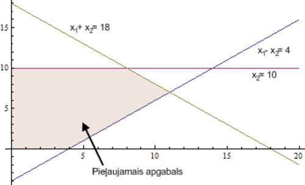
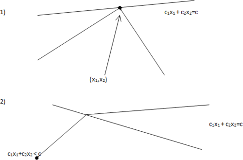

# &nbsp;

<hgroup>

<h1 style="font-size:28pt">Lietišķie algoritmi</h1>

<blue>Lineārā optimizācija - 1</blue>

</hgroup><hgroup style="font-size:90%">

**(1) Ievads**  
(2) [Optimizācijas uzdevumi](#section-1)  
(3) [Grafiskā interpretācija](#section-2)  
(4) [LP lietojumi un redukcijas](#section-3)  
(5) [Kopsavilkums](#section-4)

</hgroup>

<!--
P2.
Simpleksu metodes atkārtojums
Dualitāte
Simpleksu sarežģītība
Elipsoīdu  metode

P3.
Visādas iekšējo punktu metodes

https://www.abacademies.org/articles/an-application-of-linear-programming-in-performance-evaluation-6723.html
--> 

-----

# <lo-why/> why

Kāpēc lineāru izteiksmju maksimizēšana  ir praktiski svarīga?

* Kāpēc risinām lineārās programmēšanas uzdevumus noteiktā formā? 
* Kāpēc simpleksu metode LP uzdevumu risināšanā 
ir praktiska un intuitīvi saprotama?

--

## <lo-theory/> Sasniedzamie rezultāti

1. Definēt dažus optimizācijas uzdevumu veidus (ar vai bez nosacījumiem).
2. Uzrakstīt lineārās programmēšanas uzdevumu vispārīgā formā.
3. Izveidot grafisku interpretāciju LP uzdevumam nelielam dimensiju skaitam.
4. Risināt LP uzdevumus ar simpleksu metodi. 

-----

# &nbsp;

<hgroup>

<h1 style="font-size:28pt">Lietišķie algoritmi</h1>

<blue>Lineārā optimizācija - 1</blue>

</hgroup><hgroup style="font-size:90%">

(1) [Ievads](#section-0)  
**(2) Optimizācijas uzdevumi**  
(3) [Grafiskā interpretācija](#section-2)  
(4) [LP lietojumi un redukcijas](#section-3)  
(5) [Kopsavilkums](#section-4)

</hgroup>

-----

# <lo-theory/> Optimizācijas uzdevumu veidi

Optimizācijas uzdevumos mērķis ir maksimizēt (vai minimizēt) noteiktu funkciju 
(piemēram, peļņu vai izmaksas) pie kaut kādiem dotiem nosacījumiem. 

* Optimizācija bez nosacījumiem: Minimizēt $f(x_1, x_2, \ldots, x_n)$.
* Optimizācija ar nosacījumiem: Minimizēt $f(x_1, x_2, \ldots, x_n)$ pie nosacījumiem
`$$c_1(x_1, x_2, \ldots, x_n) \geq 0, \ldots, c_k(x_1, x_2, \ldots, x_n) \geq 0,$$`
`$$d_1(x_1, x_2, \ldots, x_n) = 0, \ldots, d_{\ell}(x_1, x_2, \ldots, x_n) = 0.$$`

--

## <lo-summary/> Piemērs: Kvadrātiskā programmēšana

Ieviešot nosacījumus attiecībā uz funkciju $f$, 
iegūst šādus optimizācijas uzdevumu paveidus:

**Kvadrātiskā programmēšana:** Minimizēt
`${\displaystyle \sum\limits_{i,j=1}^{n} a_{ij}x_ix_j +  \sum\limits_{i=1}^{n} b_ix_i }$`
pie nosacījumiem
`$$\left\{ 
\begin{array}{l} 
c_{11} x_1 + c_{12} x_1 + \ldots + c_{1n} x_n \leq d_1,\\
\ldots,\\
c_{m1} x_1 + c_{m2} x_1 + \ldots + c_{mn} x_n \leq d_m,
\end{array} \right.$$`

Šajā gadījumā minimizējamā funkcija ir kvadrātiska, bet nosacījumi ir lineāri. 

--

## <lo-summary/> Piemērs: Lineārā programmēšana

**Lineārā programmēšana:** Minimizēt 
`${\displaystyle \sum\limits_{i=1}^{n} b_ix_i }$`  pie nosacījumiem
`$$\left\{ \begin{array}{l}
c_{11} x_1 + c_{12} x_2 + \ldots + c_{1n} x_n \leq d_1,\\
\ldots,\\
c_{m1} x_1 + c_{m2} x_2 + \ldots + c_{mn} x_n \leq d_m,
\end{array} \right.$$`

*Piezīme:* Vārds "programmēšana" lietots nozīmē "plānošana". 
Dažus optimizācijas uzdevumu veidus sauc par programmēšanu jau 
kopš 1920.-tajiem gadiem. 

--

## <lo-summary/> Piemērs: Lineārā programmēšana

**Veselo skaitļu programmēšana:** 
Jeb lineārā programmēšana veselos skaitļos (*Integer Linear Programming* jeb 
*Integer Programming*): uzdevums tāds pats kā lineārā programmēšanā, 
tikai klāt nāk nosacījums, ka visi $x_1, x_2, \ldots, x_n$ visiem jābūt veseliem skaitļiem.

Ar lineārajām programmām veselos skaitļos 
var aprakstīt daudzus interesantus un praktiski svarīgus uzdevumus, 
bet tām nav zināms algoritms, kas ātri (polinomiālā laikā) atrisina 
patvaļīgu veselo skaitļu programmu. 

--

## <lo-summary/> NP-pilni uzdevumi

**Apgalvojums:** Veselo skaitļu programmēšanas uzdevums ir $NP$-pilns: 
tas pieder labi pazīstamai uzdevumu saimei, kurus var visus citu uz citu reducēt.  
(Efektīvs algoritms nav zināms. Ja tādu veselo skaitļu programmēšanai atrastu, 
tad varētu efektīvi atrisināt arī pārējos $20$ uzdevumus no slavenā 
[Ričarda Karpa saraksta](https://en.wikipedia.org/wiki/Karp%27s_21_NP-complete_problems) un vēl simtiem citu uzdevumu, kas arī ir $NP$-pilni - algoritmiski 
ekvivalenti katrs ar katru.)

Lineārām programmām reālos skaitļos efektīvi polinomiāli algoritmi ir. 
Tāpēc šajā kursā mēs tālāk apskatīsim tikai lineāras programmas, 
kuru mainīgie ir reāli skaitļi.

-----

# <lo-sample/> LP Piemērs: Pārtikas iepirkšana

Ir zināmi produkti `$1,\ldots, n$ ar cenām $p_1,\ldots, p_n$`.
Ir `$k$` uzturvielu tipi un vienā dienā cilvēkam vajadzīgs daudzums `$c_i$` ar
uzturvielu `$i$`. Atrast lētāko produktu
kombināciju, kas nodrošina pietiekami daudz katras uzturvielas.

**Leonīds Kantorovičs (1912-1986)** (*Леонид Канторович*, 
*Leonid Kantorovich*):  
Optimāla izejvielu izmantošana finiera 
rūpniecībā (1939.g.). Agrīni optimizācijas uzdevumi bieži saistīti ar
ražošanas plānošanu, it īpaši situācijās, kurās nav brīvā tirgus.

--

## <lo-summary/> Pārtikas iepirkšanas lineārais modelis 

Ar $x_i$ apzīmējam $i$-tā produkta daudzumu, 
ko iegādāsimies. Tad jāminimizē kopējās izmaksas
`$\color{#00F}{p_1 x_1 + p_2 x_2 + \ldots + p_n x_n}$`
pie nosacījumiem
`$$\left\{ 
\begin{array}{l}
x_1 \geq 0,\;\; x_2 \geq 0,\;\; \ldots,\;\; x_n \geq 0,\\
a_{11} x_1 + a_{12} x_2 + \ldots + a_{1n} x_n \geq c_1,\\
\ldots,\\
a_{k1} x_1 + a_{k2} x_2 + \ldots + a_{kn} x_n \geq c_k,
\end{array} \right.$$`
kur `$a_{ij}$` apzīmē `$i$`-tās uzturvielas daudzumu produktā `$j$`.

Ja produktu daudzumi ir mērāmi veselos skaitļos 
(piemēram, veselā skaitā `$1L$` paku), 
tad iegūstam lineāro programmēšanu veselos skaitļos. 
Ja dažiem mainīgajiem jābūt veseliem, 
bet citi drīkst būt patvaļīgi reāli skaitļi, 
tad tā ir jauktā veselo skaitļu programmēšana 
(*mixed integer programming*).

-----

# &nbsp;

<hgroup>

<h1 style="font-size:28pt">Lietišķie algoritmi</h1>

<blue>Lineārā optimizācija - 1</blue>

</hgroup><hgroup style="font-size:90%">

(1) [Ievads](#section)  
(2) [Optimizācijas uzdevumi](#section-1)  
**(3) Grafiskā interpretācija**  
(4) [LP lietojumi un redukcijas](#section-3)  
(5) [Kopsavilkums](#section-4)

</hgroup>

-----

# <lo-theory/> Vispārīgais LP uzdevums

Lineārā programmēšana apraksta daudzas praktiskas problēmas.
LP uzdevumiem eksistē efektīvi algoritmi.

Vispārīgais LP uzdevums:  
Atrast $\color{#00F}{\max\left(c_1x_1 + \ldots + c_nx_n\right)}$, 
ja izpildās nosacījumi:
`$$\left\{
\begin{array}{l}
a_{11}x_1 + a_{12}x_2 + \ldots + a_{1n}x_n \leq b_1\\
\ldots\\
a_{m1}x_1 + a_{m2}x_2 + \ldots + a_{mn}x_n \leq b_m
\end{array} \right.$$`

--

## <lo-summary/> 2-dimensiju piemērs

Atrast `$\color{#00F}{\max(2x_1 + 3x_2)}$`, kur
`$$\left\{ \begin{array}{l}
x_1 - 2x_2 \leq 4,\\
x_1 + x_2 \leq 18,\\
x_2 \leq 10,\\
x_1,x_2 \geq 0.
\end{array} \right.$$`

*Piezīme.* Katrs maksimizācijas uzdevums ekvivalents kādam 
minimizācijas uzdevumam (un otrādi). Piemēram:
`$$\max(2x_1 + 3x_2) = -\min(-2x_1 - 3x_2).$$` 
Turpmāk apskatīsim tikai maksimizācijas uzdevumus.

-----

# <lo-theory/> Grafiskā interpretācija

<hgroup style="font-size:70%">

Atrast $\color{#00F}{\max(2x_1 + 3x_2)}$, kur
`$$\left\{ \begin{array}{l}
x_1 - 2x_2 \leq 4,\\
x_1 + x_2 \leq 18,\\
x_2 \leq 10,\\
x_1,x_2 \geq 0.
\end{array} \right.$$`

</hgroup>
<hgroup style="font-size:70%">

Attēlā viegli redzēt uzdevuma atrisinājumu – tas ir punkts 
$(8,10)$.  Lielākam dimensiju skaitam var būt grūti
veidot šādu attēlu. Tipiskos LP uzdevumos <blue>*pieļaujamais apgabals*</blue>
(*feasible region*) ir galīgs. Citādi var gadīties, ka maksimuma nemaz nav - 
izteiksme var pieņemt patvaļīgi 
lielas vērtības. Pirms LP risināšanas jāpārbauda, ka apgabals ir galīgs.

</hgroup>

--

## <lo-summary/> Optimuma atrašanās

<hgroup>

</hgroup>
<hgroup style="font-size:80%">

Attēlos var pamanīt divus nozīmīgus faktus:

**Fakts 1:** Mērķfunkcija savu maksimumu sasniedz pieļaujamā apgabala stūrī.  
**Fakts 2:** Ja kādā stūri `$a_1x_1 + \ldots + a_nx_n$` 
nesasniedz maksimumu, tad vienā no blakus stūriem 
`$a_1x_1 + \ldots + a_nx_n$` ir lielāka vērtība.
 
Divu dimensiju gadījumā, piemēram, par 2.faktu var pārliecināties, 
lietojot ģeometrisko interpretāciju. 

</hgroup>

--

## <lo-summary/> Kur atrodas maksimums

<hgroup>

</hgroup>
<hgroup style="font-size:80%">

1.gadījumā iegūstam vienu no diviem rezultātiem:  
**(a)** `$c_1x_1 + c_2x_2 \leq c$` visā pieļaujamajā apgabalā – stūris ir maksimums.  
**(b)** `$c_1x_1+c_2x_2 \geq c$` visā pieļaujamajā apgabalā – stūris ir minimums.

2.gadījumā stūris nav nedz maksimums, nedz minimums un redzams, 
ka ir gan blakus stūris ar lielāku `$c_1x_1+c_2x_2$` vērtību, gan blakus 
stūris ar mazāku vērtību.

</hgroup>

-----

# &nbsp;

<hgroup>

<h1 style="font-size:28pt">Lietišķie algoritmi</h1>

<blue>Lineārā optimizācija - 2</blue>

</hgroup><hgroup style="font-size:90%">

(1) [Ievads](#section-0)  
(2) [Optimizācijas uzdevumi](#section-1)  
(3) [Grafiskā interpretācija](#section-2)  
**(4) LP lietojumi un redukcijas**  
(5) [Kopsavilkums](#section-4)

</hgroup>

-----

# <lo-theory/> Kāpēc LP ir svarīgas?

* (Reālo skaitļu) LP ir pirmais solis, lai risinātu 
veselo skaitļu problēmas (*Integer Programming, IP*) un 
jauktās LP problēmas (*Mixed Integer Linear Programs, MIP*). 
* Kā optimāli izvēlēties komplektu (izejvielas, akciju portfeļus), 
kā vislabāk sadalīt kādu resursu.
* Plūsmas maksimizēšana grafā (skatīsimies šajā lekcijā).

Veselie skaitļi kā nezināmie (*Integer Programming*) 
labāk modelē Yes/No lēmumu pieņemšanu (0 un 1 vērtības), 
bet šādus uzdevumus ir grūtāk risināt. 

--

## <lo-summary/> LP algoritmi 

* Simpleksalgoritmi (Kantorovičs, 1939; Dantzig, 1947).
* Elipsoīda algoritms (Khachian, 1979)
* Iekšējo punktu metodes (*Interior Point methods*).
    - Projektīvā metode (Karmarkar, 1984).
    - Afīnā metode (Dikin, 1967).
    - Log Barrier Method. 

Simpleksalgoritms parasti ir ļoti ātrs, bet īpaši uzkonstruēti
piemēri var būt sarežģīti.   
Matricām var būt ap 100 tūkstošiem rindiņu/kolonnu; ap miljons
skaitļu šajās matricās nav nulles. 

--

## <lo-summary/> Hamiltona cikli

<hgroup style="font-size:70%">

 <!-- .element: width="200px" -->

**Definīcija:** Par Hamiltona ciklu neorientētā grafā 
sauc virsotņu virknīti `$A_0,A_1,\ldots,A_n$`, kur
katra grafa virsotne piedalās tieši vienreiz (izņemot 
`$A_0=A_n$` - pirmā visotne sakrīt ar pēdējo) un katras 
divas blakusesošas virsotnes savieno šķautne. 

</hgroup>
<hgroup>

**Jautājums:** Dots neorientēts grafs. Kā uzrakstīt 
lineāru vienādību vai nevienādību sistēmu, kuru atrisinot 
(vai pamatojot, ka atrisinājuma nav), var atrast Hamiltona ciklu 
grafā (vai pierādīt, ka šāda cikla nav)?

</hgroup>

-----

# &nbsp;

<hgroup>

<h1 style="font-size:28pt">Lietišķie algoritmi</h1>

<blue>Lineārā optimizācija - 2</blue>

</hgroup><hgroup style="font-size:90%">

(1) [Ievads](#section-0)  
(2) [Optimizācijas uzdevumi](#section-1)  
(3) [Grafiskā interpretācija](#section-2)  
(4) [LP lietojumi un redukcijas](#section-3)  
**(5) Kopsavilkums**

</hgroup>

