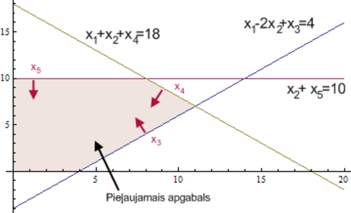
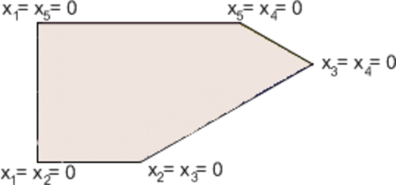
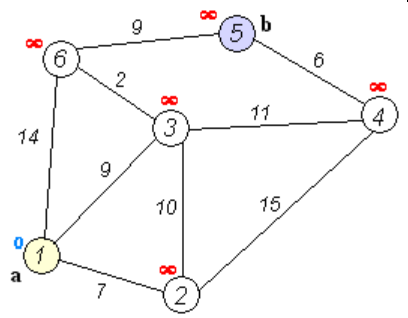
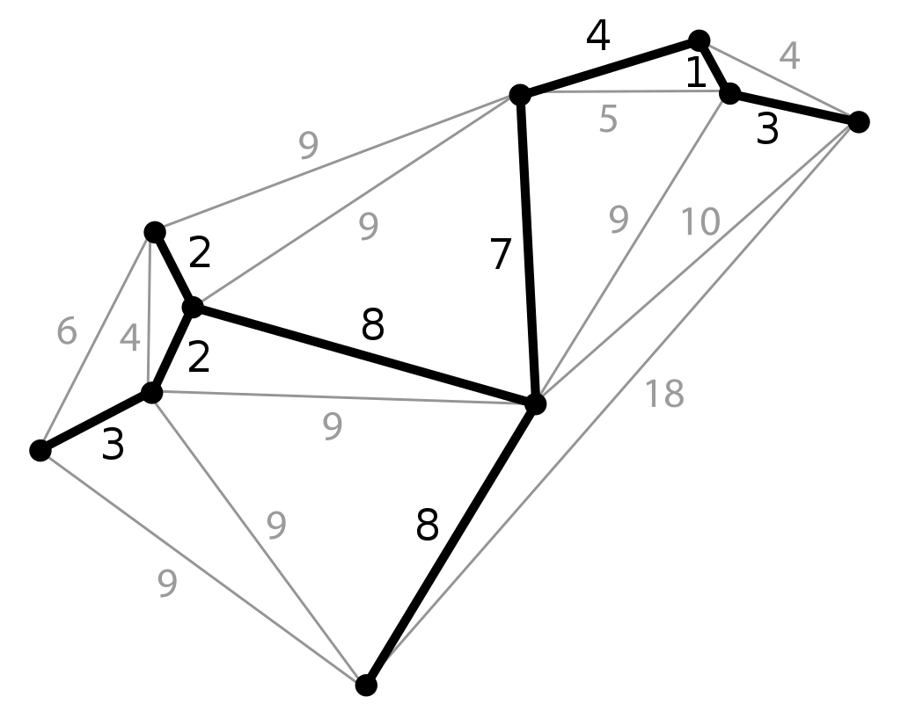
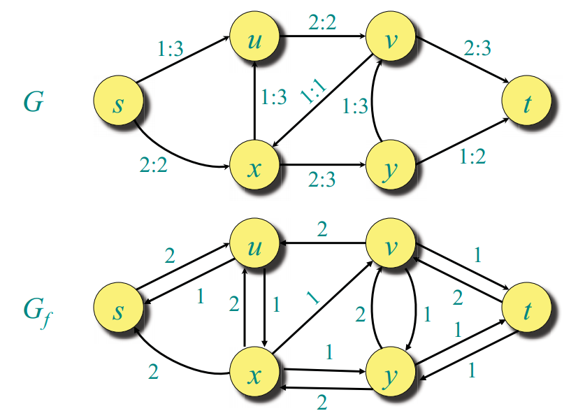

# &nbsp;

<hgroup>

<h1 style="font-size:28pt">Lietišķie algoritmi</h1>

<blue>Lineārā optimizācija - 1</blue>

</hgroup><hgroup style="font-size:90%">

**(1) Ievads**  
(2) [Simpleksa algoritma piemērs](#section-1)  
(3) [Simpleksa algoritma tabula](#section-2)  
(4) [(P) LP lietojumi](#section-3)  
(5) [Kopsavilkums](#section-4)

</hgroup>

<!--
P2.
Simpleksu metodes atkārtojums
Dualitāte
Simpleksu sarežģītība
Elipsoīdu  metode

P3.
Visādas iekšējo punktu metodes

https://www.abacademies.org/articles/an-application-of-linear-programming-in-performance-evaluation-6723.html
--> 

-----

# <lo-why/> why

Kāpēc lineāru izteiksmju maksimizēšana  ir praktiski svarīga?

* Kāpēc risinām lineārās programmēšanas uzdevumus noteiktā formā? 
* Kāpēc simpleksu metode LP uzdevumu risināšanā 
ir praktiska un intuitīvi saprotama?

--

## <lo-theory/> Sasniedzamie rezultāti

1. Definēt dažus optimizācijas uzdevumu veidus (ar vai bez nosacījumiem).
2. Uzrakstīt lineārās programmēšanas uzdevumu vispārīgā formā.
3. Izveidot grafisku interpretāciju LP uzdevumam nelielam dimensiju skaitam.
4. Risināt LP uzdevumus ar simpleksu metodi. 

-----

# &nbsp;

<hgroup>

<h1 style="font-size:28pt">Lietišķie algoritmi</h1>

<blue>Lineārā optimizācija - 1</blue>

</hgroup><hgroup style="font-size:90%">

(1) [Ievads](#section-0)  
**(2) Simpleksa algoritma piemērs**  
(3) [Simpleksa algoritma tabula](#section-2)  
(4) [(P) Lineārās programmēšanas lietojumi](#section-3)  
(5) [Kopsavilkums](#section-4)

</hgroup>

-----

# <lo-theory/> Simpleksa metode

Simpleksalgoritma pamatideja:

1. Sāk ar $v$ - patvaļīgu stūri pieļaujamajā apgabalā.
2. Kamēr stūrim $v$ blakus atrodas stūris $u$, kurā
$c_{11}x_1+\ldots+c_nx_n$ vērtība ir lielāka, aizstāj $v$ ar $u$.

Atkārto otro soli tik ilgi, kamēr nevar atrast blakus stūri, 
kurā mērķa funkcijai ir lielāka vērtība. 
 
Otrā fakta dēļ, ja tāda blakus stūra nav, tad mērķa funkcija 
sasniedz maksimālo vērtību visā pieļaujamajā apgabalā.

--

## <lo-summary/> Pārveidojuma piemērs

<hgroup style="font-size:70%">

Par uzdevuma standartformu sauc uzdevumu tādā formā, 
ka nosacījumi ir nevienādības formā $x_i \geq 0$ vai arī vienādības. 

Piemēram, lai nosacījumu $x_1 - 2x_2 \leq 4$ pārvērstu standartformā, 
ievieš papildus mainīgo $x_3 \geq 0$. Tātad:
`$$x_1-2x_2 \leq 4\;\; \Leftrightarrow$$`
`$$x_1-2x_2+x_3=4,\;x_3 \geq 0$$`
Tādā veidā var iegūt ekvivalentu uzdevumu, kurā vienīgās nevienādības ir formā 
$x_i \geq 0$.

</hgroup>

<hgroup style="font-size:70%">

Piemēram: $\color{#00F}{\max \left( 2x_1 + 3x_2 \right)}$, kur
`$$\left\{ \begin{array}{l} 
x_1-2x_2 \leq 4,\\
x_1+x_2 \leq 18,\\
x_2 \leq 10,\\
x_1,x_2 \geq 0. 
\end{array} \right.$$`
 
Pārveidojam:
`$\color{#00F}{\max \left( 2x_1 + 3x_2 \right)}$`, kur
`$$\left\{ \begin{array}{l}
x_1-2x_2+x_3=4,\\
x_1+x_2+x_4=18,\\
x_2+x_5=10,\\
x_1,x_2,x_3,x_4,x_5 \geq 0.
\end{array} \right.$$`

</hgroup>

--

## <lo-sample/> Nosacījumiem atbilstošais apgabals

Stūris - punkts, kur krustojas $2$ taisnes, kas atbilst nosacījumam - 
ir punkts, kurā divi no $x_1,\ldots,x_n= 0$. 
No iepriekšējā piemēra.

--

## <lo-sample/> Attēls ar stūriem

 

Plaknes gadījumā stūri var aprakstīt, pasakot kuri 
divi mainīgie ir vienādi ar $0$. Vairāku dimensiju gadījumā ir līdzīgi. 
Trīs dimensiju gadījumā stūris ir punkts, kurā $3$ mainīgie ir $0$.

Ja ir $k$ dimensijas (meklē 
$\color{#00F}{\max \left(a_1x_1 + \ldots + a_kx_k\right)}$), tad stūris ir punkts, 
kurā sastopas $k$ plaknes $n$-dimensiju telpā, 
t.i. $k$ mainīgie ir vienādi ar $0$.

-----

# &nbsp;

<hgroup>

<h1 style="font-size:28pt">Lietišķie algoritmi</h1>

<blue>Lineārā optimizācija - 1</blue>

</hgroup><hgroup style="font-size:90%">

(1) [Ievads](#section-0)  
(2) [Simpleksa algoritma piemērs](#section-1)  
**(3) Simpleksa algoritma tabula**  
(4) [(P) Lineārās programmēšanas lietojumi](#section-3)  
(5) [Kopsavilkums](#section-4)

</hgroup>

-----

# <lo-theory/> Simpleksalgoritms

Simpleksalgoritma parādīšanai turpinām agrāko piemēru:

`$$\color{#00F}{\max \left( 2x_1+3x_2 \right)}$$`
`$$\left\{ \begin{array}{l}
x_1-2x_2+x_3=4\\
x_1+x_2+x_4=18\\
x_2+x_5=10\\
x_1,x_2,x_3,x_4,x_5 \geq 0 
\end{array} \right.$$`

--

## <lo-summary/> Simpleksalgoritma tabula

Simpleksalgoritma soļus ērti pierakstīt ar tabulas palīdzību. 
Sākotnējo tabulu sastāda tabulas rindiņās ierakstot uzdevuma ierobežojumus. 
Tabulas pēdējā rindiņa raksta funkciju, kuru maksimizēt. 

<table>
<tr>
<th>$x_1$</th>
<th>$x_2$</th>
<th>$x_3$</th>
<th>$x_4$</th>
<th>$x_5$</th>
<th>$b_i$</th>
<th>Atbilstošā izteiksme</th>
</tr>
<tr> 
<td>1</td>
<td>-2</td>
<td>1</td>
<td>0</td>
<td>0</td>
<td>4</td>
<td>$x_1-2x_2+x_3=4$</td>
</tr>
<tr>
<td>1</td>
<td>1</td>
<td>0</td>
<td>1</td>
<td>0</td>
<td>18</td>
<td>$x_1+x_2+x_4=18$</td>
</tr>
<tr>
<td>0</td>
<td>1</td>
<td>0</td>
<td>0</td>
<td>1</td>
<td>10</td>
<td>$x_2+x_5=10$</td>
</tr>
<tr style="color:blue;">
<td>2</td>
<td>3</td>
<td>0</td>
<td>0</td>
<td>0</td>
<td>0</td>
<td>$\max\left(2x_1+3x_2\right)$</td>
</tr>
<tr>
<td colspan="2" style="background-color:#DAEEF3;">brīvie mainīgie</td>
<td colspan="3" style="background-color:#E5DFEC;">pamatmainīgie</td>
<td colspan="2">&nbsp;</td>
</tr>
</table>

$x_i = 0$ - brīvie mainīgie,  
$x_i \neq 0$ - pamatmainīgie.

--

## <lo-sample/> LP vispārīgajā formā

**LP uzdevums:** Atrast $\color{#00F}{\max(c_1x_1 + \ldots + c_nx_n)}$, ja izpildās 
$k+n$ nosacījumi:
`$$\left\{
\begin{array}{l}
a_{11}x_1 + a_{12}x_2 + \ldots + a_{1n}x_n = b_1\\
\ldots\\
a_{k1}x_1 + a_{m2}x_2 + \ldots + a_{kn}x_n = b_k\\
x_1,x_2,\ldots,x_n \geq 0
\end{array} \right.$$`

<table>
<tr>
<th>$x_1$</th>
<th>$\ldots$</th>
<th>$x_{n-k}$</th>
<th>$x_{n-k+1}$</th>
<th>&nbsp;</th>
<th>$\ldots$</th>
<th>$x_{n}$</th>
<th>$b_i$</th>
<th>Atbilstošā izteiksme</th>
</tr>
<tr> 
<td>$a_{1,1}$</td>
<td>$\ldots$</td>
<td>$a_{1,n-k}$</td>
<td>$a_{1,n-k+1}$</td>
<td>$\ldots$</td>
<td>$\ldots$</td>
<td>$a_{1,n}$</td>
<td>$b_1$</td>
<td>$a_{1,1}x_1+\ldots+a_{1,n}x_n=b_1$</td>
</tr>
<tr>
<td>$a_{2,1}$</td>
<td>$\ldots$</td>
<td>$a_{2,n-k}$</td>
<td>$a_{2,n-k+1}$</td>
<td>$\ldots$</td>
<td>$\ldots$</td>
<td>$a_{2,n}$</td>
<td>$b_2$</td>
<td>$a_{2,1}x_1+\ldots+a_{2,n}x_n=b_2$</td>
</tr>
<tr>
<td>$\ldots$</td>
<td>$\ldots$</td>
<td>$\ldots$</td>
<td>$\ldots$</td>
<td>$\ldots$</td>
<td>$\ldots$</td>
<td>$\ldots$</td>
<td>$\ldots$</td>
<td>$\ldots$</td>
</tr>
<tr>
<td>$a_{k,1}$</td>
<td>$\ldots$</td>
<td>$a_{k,n-k}$</td>
<td>$a_{k,n-k+1}$</td>
<td>$\ldots$</td>
<td>$\ldots$</td>
<td>$a_{k,n}$</td>
<td>$b_k$</td>
<td>$a_{k,1}x_1+\ldots+a_{k,n}x_n=b_k$</td>
</tr>
<tr style="color:blue;">
<td>$c_1$</td>
<td>$\ldots$</th>
<td>$c_{n-k}$</td>
<td>$c_{n-k+1}$</td>
<td>$c_{n-k+2}$</td>
<td>$\ldots$</td>
<td>$c_n$</td>
<td>&nbsp;</td>
<td>$\max(c_1x_1 + \ldots + c_nx_n)$</td>
</tr>
<tr>
<td colspan="3" style="background-color:#DAEEF3;">$x_1 = 0, \ldots, x_{n-k} = 0$</td>
<td colspan="4" style="background-color:#E5DFEC;">$x_i \neq 0$</td>
<td colspan="2">&nbsp;</td>
</tr>
</table>

Ar šo <blue>*simpleksalgoritma tabulu*</blue> (*simplex tableau*), 
kas ir taisnstūrveida $(k+1) \times (n+1)$ matrica,
veiksim rindu un kolonnu pārveidojumus. 

--

## <lo-sample/> Pārveidošana standartformā

**Tāpat kā agrāk:** Mainīgie $x_1,\ldots,x_n \geq 0$ apmierina $k$
lineāras vienādības ($k < n$).   
**Papildus zināms:** Simpleksalgoritms atrodas stūrī: $x_1,\ldots,x_{n-k} = 0$. 

<table>
<tr>
<th>$x_1$</th>
<th>$\ldots$</th>
<th>$x_{n-k}$</th>
<th>$x_{n-k+1}$</th>
<th>&nbsp;</th>
<th>$\ldots$</th>
<th>$x_{n}$</th>
<th>$b_i$</th>
<th>Atbilstošā izteiksme</th>
</tr>
<tr> 
<td>$a_{1,1}$</td>
<td>$\ldots$</td>
<td>$a_{1,n-k}$</td>
<td style="background-color:#ffffbb">$1$</td>
<td style="background-color:#ffffbb">$0$</td>
<td style="background-color:#ffffbb">$\ldots$</td>
<td style="background-color:#ffffbb">$0$</td>
<td>$b_1$</td>
<td>&nbsp;</td>
</tr>
<tr>
<td>&nbsp;</td>
<td>&nbsp;</td>
<td>&nbsp;</td>
<td style="background-color:#ffffbb">$0$</td>
<td style="background-color:#ffffbb">$1$</td>
<td style="background-color:#ffffbb">$\ldots$</td>
<td style="background-color:#ffffbb">$0$</td>
<td>$b_2$</td>
<td>&nbsp;</td>
</tr>
<tr>
<td>&nbsp;</td>
<td>&nbsp;</td>
<td>&nbsp;</td>
<td style="background-color:#ffffbb">$\ldots$</td>
<td style="background-color:#ffffbb">$\ldots$</td>
<td style="background-color:#ffffbb">$\ldots$</td>
<td style="background-color:#ffffbb">$\ldots$</td>
<td>$\ldots$</td>
<td>&nbsp;</td>
</tr>
<tr>
<td>&nbsp;</td>
<td>&nbsp;</td>
<td>&nbsp;</td>
<td style="background-color:#ffffbb">$0$</td>
<td style="background-color:#ffffbb">$0$</td>
<td style="background-color:#ffffbb">$\ldots$</td>
<td style="background-color:#ffffbb">$1$</td>
<td>$b_k$</td>
<td>&nbsp;</td>
</tr>
<tr style="color:blue;">
<td>$c_1$</td>
<td>$\ldots$</th>
<td>$c_{n-k}$</td>
<td>$0$</td>
<td>$0$</td>
<td>$\ldots$</td>
<td>$0$</td>
<td>&nbsp;</td>
<td>&nbsp;</td>
</tr>
<tr>
<td colspan="3" style="background-color:#DAEEF3;">$x_1 = 0, \ldots, x_{n-k} = 0$</td>
<td colspan="4" style="background-color:#E5DFEC;">$x_i \neq 0$</td>
<td colspan="2">&nbsp;</td>
</tr>
</table>

Iepriekšējā piemērā $n=5$, $k=3$ un tabula jau ir standartformā:

<table>
<tr>
<th>$x_1$</th>
<th>$x_2$</th>
<th>$x_3$</th>
<th>$x_4$</th>
<th>$x_5$</th>
<th>$b_i$</th>
<th>Atbilstošā izteiksme</th>
</tr>
<tr> 
<td>1</td>
<td>-2</td>
<td style="background-color:#ffffbb">1</td>
<td style="background-color:#ffffbb">0</td>
<td style="background-color:#ffffbb">0</td>
<td>4</td>
<td>$x_1-2x_2+x_3=4$</td>
</tr>
<tr>
<td>1</td>
<td>1</td>
<td style="background-color:#ffffbb">0</td>
<td style="background-color:#ffffbb">1</td>
<td style="background-color:#ffffbb">0</td>
<td>18</td>
<td>$x_1+x_2+x_4=18$</td>
</tr>
<tr>
<td>0</td>
<td>1</td>
<td style="background-color:#ffffbb">0</td>
<td style="background-color:#ffffbb">0</td>
<td style="background-color:#ffffbb">1</td>
<td>10</td>
<td>$x_2+x_5=10$</td>
</tr>
<tr style="color:blue;">
<td>2</td>
<td>3</td>
<td>0</td>
<td>0</td>
<td>0</td>
<td>0</td>
<td>$\max\left(2x_1+3x_2\right)$</td>
</tr>
<tr>
<td colspan="2" style="background-color:#DAEEF3;">brīvie mainīgie</td>
<td colspan="3" style="background-color:#E5DFEC;">pamatmainīgie</td>
<td colspan="2">&nbsp;</td>
</tr>
</table>

--

## <lo-sample/> Simpleksalgoritma solis

Esam stūrī, kuru apraksta iepriekšējā tabula. 
Pārbauda, vai blakus stūrī vērtība nav lielāka

1. Atrod brīvo mainīgo, kuru palielinot pieaug mērķfunkcija
2. Palielina šo mainīgo. Tas bija $0$, tagad pozitīvs, 
vienlaikus mainot pamatmainīgos tā, lai visi nosacījumi paliktu patiesi.
3. Ja kāds no pamatmainīgajiem ir $0$, apstājas.

Jāatrod mainīgais, kuru palielinot funkcijas vērtība pieaug. 
Der abi mainīgie. Piemēram, palielinām  $x_2$.
 
Ja $x_2$ pieaug par $d$:  
$x_1-2x_2+x_3$ samazinās par $2d$. Pēc nosacījumiem izteiksmei 
jābūt vienādai ar $4$. Lai to panāktu $x_3$ palielina par $2d$.  
$x_1+x_2+x_4$ pieaug par $d$. Lai saglabātu vienādību, 
$x_4$ samazina par $d$; $x_2+x_5$ pieaug par $d$. Jāsamazina $x_5$ par $d$.

-----

# <lo-summary/> Piemēra turpinājums

Cik daudz var palielināt $x_2$, nepadarot citu mainīgo negatīvu?  
$x_3=4$, $x_4=18$, $x_5=10$.

Palielinot $x_2$ par $d$:  
$x_3= 4 + 2d$;
$x_4=18 - d$; 
$x_5=10 - d$.  
Ja $d = 10$, tad $x_5 = 0$. Ja $d > 10$, $x_5 < 0$. 
Tātad maksimālais palielinājums ir $10$.
 
Tādā gadījumā mēs būsim pārgājuši no stūra, 
kurā $x_1 = x_2 = 0$ uz stūri, kurā $x_1 = x_5 = 0$.

<table>
<tr>
<th>$x_1$</th>
<th>$x_5$</th>
<th>$x_3$</th>
<th>$x_4$</th>
<th>$x_2$</th>
<th>$b_i$</th>
<th>Atbilstošā izteiksme</th>
</tr>
<tr> 
<td>1</td>
<td>0</td>
<td>1</td>
<td>0</td>
<td>-2</td>
<td>4</td>
<td>$x_1-2x_2+x_3=4$</td>
</tr>
<tr>
<td>1</td>
<td>0</td>
<td>0</td>
<td>1</td>
<td>1</td>
<td>18</td>
<td>$x_1+x_2+x_4=18$</td>
</tr>
<tr>
<td>0</td>
<td>1</td>
<td>0</td>
<td>0</td>
<td>1</td>
<td>10</td>
<td>$x_2+x_5=10$</td>
</tr>
<tr style="color:blue;">
<td>2</td>
<td>0</td>
<td>0</td>
<td>0</td>
<td>3</td>
<td>0</td>
<td>$\max\left(2x_1+3x_2\right)$</td>
</tr>
<tr>
<td colspan="2" style="background-color:#DAEEF3;">brīvie mainīgie</td>
<td colspan="3" style="background-color:#E5DFEC;">pamatmainīgie</td>
<td colspan="2">&nbsp;</td>
</tr>
</table>

--

## <lo-summary/> 2.solis

<table>
<tr>
<th>$x_1$</th>
<th>$x_5$</th>
<th>$x_3$</th>
<th>$x_4$</th>
<th>$x_2$</th>
<th>$b_i$</th>
<th>Atbilstošā izteiksme</th>
</tr>
<tr> 
<td>1</td>
<td>0</td>
<td>1</td>
<td>0</td>
<td>-2</td>
<td>4</td>
<td>$x_1-2x_2+x_3=4$</td>
</tr>
<tr>
<td>1</td>
<td>0</td>
<td>0</td>
<td>1</td>
<td>1</td>
<td>18</td>
<td>$x_1+x_2+x_4=18$</td>
</tr>
<tr>
<td>0</td>
<td>1</td>
<td>0</td>
<td>0</td>
<td>1</td>
<td>10</td>
<td>$x_2+x_5=10$</td>
</tr>
<tr style="color:blue;">
<td>2</td>
<td>0</td>
<td>0</td>
<td>0</td>
<td>3</td>
<td>0</td>
<td>$\max\left(2x_1+3x_2\right)$</td>
</tr>
<tr>
<td colspan="2" style="background-color:#DAEEF3;">brīvie mainīgie</td>
<td colspan="3" style="background-color:#E5DFEC;">pamatmainīgie</td>
<td colspan="2">&nbsp;</td>
</tr>
</table>

Lai izdarītu nākamo soli, tabula jāpārveido par ekvivalentu tabulu standartformā: 

1. Pareizina 3.rindu ar $2$, pieskaita 1.rindai:  $(x_1+x_3-2x_2)+2(x_5+x_2)=4 + 2 \cdot 10$
2. Atņem 3.rindu no 2.rindas

<table>
<tr>
<th>$x_1$</th>
<th>$x_5$</th>
<th>$x_3$</th>
<th>$x_4$</th>
<th>$x_2$</th>
<th>$b_i$</th>
<th>Atbilstošā izteiksme</th>
</tr>
<tr> 
<td>1</td>
<td>2</td>
<td>1</td>
<td>0</td>
<td>0</td>
<td>24</td>
<td>$x_1+2x_5+x_3=24$</td>
</tr>
<tr>
<td>1</td>
<td>-1</td>
<td>0</td>
<td>1</td>
<td>0</td>
<td>8</td>
<td>$x_1-x_5+x_4=8$</td>
</tr>
<tr>
<td>0</td>
<td>1</td>
<td>0</td>
<td>0</td>
<td>1</td>
<td>10</td>
<td>$x_2+x_5=10$</td>
</tr>
<tr style="color:blue;">
<td>2</td>
<td>0</td>
<td>0</td>
<td>0</td>
<td>3</td>
<td>0</td>
<td>$\max\left(2x_1+3x_2\right)$</td>
</tr>
<tr>
<td colspan="2" style="background-color:#DAEEF3;">brīvie mainīgie</td>
<td colspan="3" style="background-color:#E5DFEC;">pamatmainīgie</td>
<td colspan="2">&nbsp;</td>
</tr>
</table>

--

## <lo-summary/> 3.solis

<table>
<tr>
<th>$x_1$</th>
<th>$x_5$</th>
<th>$x_3$</th>
<th>$x_4$</th>
<th>$x_2$</th>
<th>$b_i$</th>
<th>Atbilstošā izteiksme</th>
</tr>
<tr> 
<td>1</td>
<td>2</td>
<td>1</td>
<td>0</td>
<td>0</td>
<td>24</td>
<td>$x_1+2x_5+x_3=24$</td>
</tr>
<tr>
<td>1</td>
<td>-1</td>
<td>0</td>
<td>1</td>
<td>0</td>
<td>8</td>
<td>$x_1-x_5+x_4=8$</td>
</tr>
<tr>
<td>0</td>
<td>1</td>
<td>0</td>
<td>0</td>
<td>1</td>
<td>10</td>
<td>$x_2+x_5=10$</td>
</tr>
<tr style="color:blue;">
<td>2</td>
<td>0</td>
<td>0</td>
<td>0</td>
<td>3</td>
<td>0</td>
<td>$\max\left(2x_1+3x_2\right)$</td>
</tr>
<tr>
<td colspan="2" style="background-color:#DAEEF3;">brīvie mainīgie</td>
<td colspan="3" style="background-color:#E5DFEC;">pamatmainīgie</td>
<td colspan="2">&nbsp;</td>
</tr>
</table>

Jātiek vaļā arī no nenulles koeficienta pēdējā rindā:

<table>
<tr>
<th>$x_1$</th>
<th>$x_5$</th>
<th>$x_3$</th>
<th>$x_4$</th>
<th>$x_2$</th>
<th>$b_i$</th>
<th>Atbilstošā izteiksme</th>
</tr>
<tr> 
<td>1</td>
<td>2</td>
<td>1</td>
<td>0</td>
<td>0</td>
<td>24</td>
<td>$x_1+2x_5+x_3=24$</td>
</tr>
<tr>
<td>1</td>
<td>-1</td>
<td>0</td>
<td>1</td>
<td>0</td>
<td>8</td>
<td>$x_1-x_5+x_4=8$</td>
</tr>
<tr>
<td>0</td>
<td>1</td>
<td>0</td>
<td>0</td>
<td>1</td>
<td>10</td>
<td>$x_2+x_5=10$</td>
</tr>
<tr style="color:blue;">
<td>2</td>
<td>-3</td>
<td>0</td>
<td>0</td>
<td><red>0</red></td>
<td>-30</td>
<td>$\max\left(2x_1-3x_5\right)$</td>
</tr>
<tr>
<td colspan="2" style="background-color:#DAEEF3;">brīvie mainīgie</td>
<td colspan="3" style="background-color:#E5DFEC;">pamatmainīgie</td>
<td colspan="2">&nbsp;</td>
</tr>
</table>

--

## <lo-summary/> 4.solis

<table>
<tr>
<th>$x_1$</th>
<th>$x_5$</th>
<th>$x_3$</th>
<th>$x_4$</th>
<th>$x_2$</th>
<th>$b_i$</th>
<th>Atbilstošā izteiksme</th>
</tr>
<tr> 
<td>1</td>
<td>2</td>
<td>1</td>
<td>0</td>
<td>0</td>
<td>24</td>
<td>$x_1+2x_5+x_3=24$</td>
</tr>
<tr>
<td>1</td>
<td>-1</td>
<td>0</td>
<td>1</td>
<td>0</td>
<td>8</td>
<td>$x_1-x_5+x_4=8$</td>
</tr>
<tr>
<td>0</td>
<td>1</td>
<td>0</td>
<td>0</td>
<td>1</td>
<td>10</td>
<td>$x_2+x_5=10$</td>
</tr>
<tr style="color:blue;">
<td>2</td>
<td>-3</td>
<td>0</td>
<td>0</td>
<td>0</td>
<td>-30</td>
<td>$\max\left(2x_1-3x_5\right)$</td>
</tr>
<tr>
<td colspan="2" style="background-color:#DAEEF3;">brīvie mainīgie</td>
<td colspan="3" style="background-color:#E5DFEC;">pamatmainīgie</td>
<td colspan="2">&nbsp;</td>
</tr>
</table>

Iegūta tabula standartformā.  
Tā kā palielinot $x_5$ mērķa funkcija samazinātos, atliek palielināt $x_1$.

$x_1 = x_1 + d$; $x_3 = x_3 - d$; $x_3 = 24 - d$, $x_4 = x_4 - d$, $x_4 = 8 - d$.   
Ja $d=8$, tad $x_4=0$.

<table>
<tr>
<th>$x_4$</th>
<th>$x_5$</th>
<th>$x_3$</th>
<th>$x_1$</th>
<th>$x_2$</th>
<th>$b_i$</th>
<th>Atbilstošā izteiksme</th>
</tr>
<tr> 
<td>0</td>
<td>2</td>
<td>1</td>
<td>1</td>
<td>0</td>
<td>24</td>
<td>$x_1+2x_5+x_3=24$</td>
</tr>
<tr>
<td>1</td>
<td>-1</td>
<td>0</td>
<td>1</td>
<td>0</td>
<td>8</td>
<td>$x_1-x_5+x_4=8$</td>
</tr>
<tr>
<td>0</td>
<td>1</td>
<td>0</td>
<td>0</td>
<td>1</td>
<td>10</td>
<td>$x_2+x_5=10$</td>
</tr>
<tr style="color:blue;">
<td>0</td>
<td>-3</td>
<td>0</td>
<td>2</td>
<td>0</td>
<td>-30</td>
<td>$\max\left(2x_1-3x_5\right)$</td>
</tr>
<tr>
<td colspan="2" style="background-color:#DAEEF3;">brīvie mainīgie</td>
<td colspan="3" style="background-color:#E5DFEC;">pamatmainīgie</td>
<td colspan="2">&nbsp;</td>
</tr>
</table>

--

## <lo-summary/> 5.solis

<table>
<tr>
<th>$x_4$</th>
<th>$x_5$</th>
<th>$x_3$</th>
<th>$x_1$</th>
<th>$x_2$</th>
<th>$b_i$</th>
<th>Atbilstošā izteiksme</th>
</tr>
<tr> 
<td>0</td>
<td>2</td>
<td>1</td>
<td>1</td>
<td>0</td>
<td>24</td>
<td>$x_1+2x_5+x_3=24$</td>
</tr>
<tr>
<td>1</td>
<td>-1</td>
<td>0</td>
<td>1</td>
<td>0</td>
<td>8</td>
<td>$x_1-x_5+x_4=8$</td>
</tr>
<tr>
<td>0</td>
<td>1</td>
<td>0</td>
<td>0</td>
<td>1</td>
<td>10</td>
<td>$x_2+x_5=10$</td>
</tr>
<tr style="color:blue;">
<td>0</td>
<td>-3</td>
<td>0</td>
<td>2</td>
<td>0</td>
<td>-30</td>
<td>$\max\left(2x_1-3x_5\right)$</td>
</tr>
<tr>
<td colspan="2" style="background-color:#DAEEF3;">brīvie mainīgie</td>
<td colspan="3" style="background-color:#E5DFEC;">pamatmainīgie</td>
<td colspan="2">&nbsp;</td>
</tr>
</table>

Pārveidojam standartformā. 

<table>
<tr>
<th>$x_4$</th>
<th>$x_5$</th>
<th>$x_3$</th>
<th>$x_1$</th>
<th>$x_2$</th>
<th>$b_i$</th>
<th>Atbilstošā izteiksme</th>
</tr>
<tr> 
<td>-1</td>
<td>3</td>
<td>1</td>
<td>0</td>
<td>0</td>
<td>16</td>
<td>$-x_4+3x_5+x_3=16$</td>
</tr>
<tr>
<td>1</td>
<td>-1</td>
<td>0</td>
<td>1</td>
<td>0</td>
<td>8</td>
<td>$x_1-x_5+x_4=8$</td>
</tr>
<tr>
<td>0</td>
<td>1</td>
<td>0</td>
<td>0</td>
<td>1</td>
<td>10</td>
<td>$x_2+x_5=10$</td>
</tr>
<tr style="color:blue;">
<td>-2</td>
<td>-1</td>
<td>0</td>
<td>0</td>
<td>0</td>
<td>-30</td>
<td>$\max\left(-2x_4-x_5\right)$</td>
</tr>
<tr>
<td colspan="2" style="background-color:#DAEEF3;">brīvie mainīgie,  $x_i = 0$</td>
<td colspan="3" style="background-color:#E5DFEC;">pamatmainīgie,  $x_i \neq 0$</td>
<td colspan="2">&nbsp;</td>
</tr>
</table>

Brīvos mainīgos nevar palielināt tā, lai izteiksmes 
vērtība palielinātos. Sasniegts maksimums.

-----

# &nbsp;

<hgroup>

<h1 style="font-size:28pt">Lietišķie algoritmi</h1>

<blue>Lineārā optimizācija - 1</blue>

</hgroup><hgroup style="font-size:90%">

(1) [Ievads](#section-0)  
(2) [Simpleksa algoritma piemērs](#section-1)  
(3) [Simpleksa algoritma tabula](#section-2)  
**(4) (P) Lineārās programmēšanas lietojumi**  
(5) [Kopsavilkums](#section-4)

</hgroup>

-----

# <lo-theory/> Īsāko ceļu uzdevums

* Īsāko ceļu algoritmi orientētos virzītos grafos no viena avota 
* [Dijkstras algoritms](https://en.wikipedia.org/wiki/Dijkstra%27s_algorithm) - kā izveidot lineāru programmu.

 <!-- .element: style="display: block; margin-left: auto;margin-right: auto; width: 50%;" --> 

Note: 

Ir Belmana-Forda (Belmana-Forda-Mūra) algoritms.

--

# <lo-theory/> Minimālā savienotā koka uzdevums

* Minimālais savienotais koks (Minimum Spanning Tree (MST))
* Kraskala un Prima algoritmi

 <!-- .element: style="display: block; margin-left: auto;margin-right: auto; width: 50%;" --> 

--

# <lo-theory/> Maksimālās plūsmas uzdevums

* Forda-Falkersona algoritms; Reziduālā plūsma

 <!-- .element: style="display: block; margin-left: auto;margin-right: auto;  width: 70%;" --> 

-----

# &nbsp;

<hgroup>

<h1 style="font-size:28pt">Lietišķie algoritmi</h1>

<blue>Lineārā optimizācija - 1</blue>

</hgroup><hgroup style="font-size:90%">

(1) [Ievads](#section-0)  
(2) [Simpleksa algoritma piemērs](#section-1)  
(3) [Simpleksa algoritma tabula](#section-2)  
(4) [(P) Lineārās programmēšanas lietojumi](#section-3)  
**(5) Kopsavilkums**

</hgroup>

