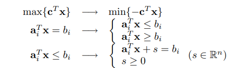

# Introduction<!-- .element: style="visibility:hidden;" -->

<hgroup>

<h1 style="font-size:28pt">Lietišķie algoritmi</h1>

<blue>Lineārā optimizācija - 3</blue>

</hgroup><hgroup style="font-size:90%">

**(1) Ievads**  
(2) [LP matricu pieraksts](#/matrix-notation)  
(3) [Farkaša lemma](#/farkas-lemma)  
(4) [Duālas LP problēmas jēdziens](#/dual-problem)  
(5) [Vājās dualitātes teorēma](#/weak-duality)  
(6) [Stiprās dualitātes teorēma](#/strong-duality)  
(7) [Sākumtuvinājuma izvēle](#/checking-feasibility)  
(8) [Plūsmu uzdevumi](#/max-flow-problem)  
(9) [Kopsavilkums](#/summary)

</hgroup>

Note: 

See also [https://ocw.mit.edu/courses/electrical-engineering-and-computer-science/6-854j-advanced-algorithms-fall-2008/lecture-notes/lec9.pdf]

<!--
https://ocw.mit.edu/courses/mathematics/18-086-mathematical-methods-for-engineers-ii-spring-2006/video-lectures/lecture-28-linear-programming-and-duality/
-->

-----

# <lo-why/> why

Kāpēc ar simpleksalgoritmu nepietiek?

* Simpleksalgoritma varianti (sākotnējā un duālā problēma,
pirmā stūra izvēle, pārejas izvēle un randomizācija). 
* Var būt slikta sarežģītība (īpaši uzkonstruētem piemēriem). 
* Polinomiāla laika algoritms ir standarts visam, ko lieto praksē.

--
 
## <lo-theory/> Sasniedzamie rezultāti

1. Pārveidot lineārās programmas standartformā
2. Lietot matricas/vektorus (arī nevienādību sistēmām)
3. Formulēt un pierādīt Farkaša lemmu
4. Definēt duālo uzdevumu. 
5. Formulēt vājo un stipro dualitātes teorēmu. 
6. Pārbaudīt ierobežojumu nepretrunību, atrast LP pirmo tuvinājumu.
7. LP un tam duālais uzdevums maksimālās plūsmas uzdevumos.

-----

# Matrix Notation<!-- .element: style="visibility:hidden;" -->

<hgroup>

<h1 style="font-size:28pt">Lietišķie algoritmi</h1>

<blue>Lineārā optimizācija - 3</blue>

</hgroup><hgroup style="font-size:90%">

(1) [Ievads](#/introduction)  
**(2) LP matricu pieraksts**  
(3) [Farkaša lemma](#/farkas-lemma)  
(4) [Duālas LP problēmas jēdziens](#/dual-problem)  
(5) [Vājās dualitātes teorēma](#/weak-duality)  
(6) [Stiprās dualitātes teorēma](#/strong-duality)  
(7) [Sākumtuvinājuma izvēle](#/checking-feasibility)  
(8) [Plūsmu uzdevumi](#/max-flow-problem)  
(9) [Kopsavilkums](#/summary)

</hgroup>

-----

# <lo-theory/> Primārā lineārā programma

Lineāra programma $P$ (saukta par <blue>*primāro LP*</blue>):

Šoreiz izvēlamies <emblue>minimizēt</emblue> `$c_1 x_1 + c_2 x_2 + \ldots + c_n x_n$` pie šādiem nosacījumiem:
`$$ \left\{ \begin{array}{l}
a_{11} x_1 + a_{12} x_2 + \ldots + a_{1n} x_n  \;\;\color{#F00}{?}\;\; b_1,\\
\ldots\\
a_{k1} x_1 + a_{k2} x_2 + \ldots + a_{kn} x_n \;\;\color{#F00}{?}\;\; b_k,\\
x_1 \geq 0,\; x_2 \geq 0,\;\ldots 
\end{array} \right.$$`

LP var nebūt standartformā: 

* Nosacījumiem `$a_{i1} x_1 + a_{i2} x_2 + \ldots + a_{in} x_n \;\;\color{#F00}{?}\;\; b_i$`,  
jautājuma zīmes vietā var būt jebkura zīme ($\geq$, $\leq$, $=$). 
* Attiecībā uz mainīgajiem $x_i$ var būt nosacījumi $x_i \geq 0$, $x_i \leq 0$, 
vai vispār nebūt nosacījuma attiecībā uz $x_i$.

-----

# <lo-theory/>Manipulācijas

<!-- .element: width="700px" --> 

-----

# <lo-theory/>LP Definīcijas

**Definīcija 1:** Vektoru `$\mathbf{x}$` sauc par <emblue>iespējamu</emblue> (*feasible*) 
(arī (neoptimālu) LP uzdevuma <emblue>risinājumu</emblue>), 
ja tas apmierina visus ierobežojumus (vienādības, nevienādības). 

**Definīcija 2:** LP uzdevumu sauc par <emblue>iespējamu</emblue> (*feasible*), ja tam ir iespējams risinājums `$\mathbf{x}$`. 

**Definīcija 3:** LP uzdevums ir <emblue>neiespējams</emblue> (*infeasible*), ja tam šāds `$\mathbf{x}$` neeksistē. 

**Definīcija 4:** LP minimuma uzdevums (`$\min\{ \mathbf{c}^T \mathbf{x}\;:\;A\mathbf{x}=\mathbf{b},\mathbf{x}\geq\mathbf{0}\}$`) ir <emblue>neierobežots</emblue> (*unbounded*), ja katram `$\lambda \in \mathbb{R}$` eksistē `$\mathbf{x} \in \mathbb{R}^n$`, 
ka visi LP ierobežojumi izpildās un `$\mathbf{c}^T \mathbf{x} \leq \lambda$`. 

-----

# Farkas Lemma<!-- .element: style="visibility:hidden;" -->

<hgroup>

<h1 style="font-size:28pt">Lietišķie algoritmi</h1>

<blue>Lineārā optimizācija - 3</blue>

</hgroup><hgroup style="font-size:90%">

(1) [Ievads](#/introduction)  
(2) [LP matricu pieraksts](#/matrix-notation)  
**(3) Farkaša lemma**  
(4) [Duālas LP problēmas jēdziens](#/dual-problem)  
(5) [Vājās dualitātes teorēma](#/weak-duality)  
(6) [Stiprās dualitātes teorēma](#/strong-duality)  
(7) [Sākumtuvinājuma izvēle](#/checking-feasibility)  
(8) [Plūsmu uzdevumi](#/max-flow-problem)  
(9) [Kopsavilkums](#/summary)

</hgroup>

-----

# <lo-theory/>Farkaša lemma

**Lemma:** Ja $A$ ir $m \times n$ matrica, tad izpildās tieši viens no apgalvojumiem:  
**(1)** `$\exists\mathbf{x} \in \mathbb{R}^n\;:\;A\mathbf{x}=\mathbf{b}$`, kur `$\mathbf{x} \geq \mathbf{0}$`,  
**(2)** `$\exists\mathbf{y} \in \mathbb{R}^m\;:\;A^T \mathbf{y} \geq \mathbf{0}$`, kur `$\mathbf{b}^T \mathbf{y} < 0$`. 

Atsevišķs gadījums ir lineārajā algebrā, kur vai nu `$A\mathbf{x} = \mathbf{b}$` eksistē atrisinājums, 
vai arī sistēmai `$A^T \mathbf{y} = 0$` (kur `$\mathbf{b}^T \mathbf{y} \neq 0$`) eksistē atrisinājums. 

-----

# <lo-theory/>Farkaša lemmas pierādījums - 1

Abi nosacījumi nevar vienlaicīgi izpildīties, jo šādu $\mathbf{x}$ un $\mathbf{y}$ pastāvēšana nozīmētu 

`$$\mathbf{y}^T A \mathbf{x} = \mathbf{y}^T (A \mathbf{x}) = \mathbf{y} \mathbf{b} < 0$$`
bet 
`$$\mathbf{y}^T A \mathbf{x} = (A^T \mathbf{y})^T \mathbf{x} \geq 0$$`
(jo divu nenegatīvu vektoru skalārais reizinājums ir nenegatīvs). 

# Dual Problem<!-- .element: style="visibility:hidden;" -->

<hgroup>

<h1 style="font-size:28pt">Lietišķie algoritmi</h1>

<blue>Lineārā optimizācija - 3</blue>

</hgroup><hgroup style="font-size:90%">

(1) [Ievads](#/introduction)  
(2) [LP matricu pieraksts](#/matrix-notation)  
(3) [Farkaša lemma](#/farkas-lemma)  
**(4) Duālas LP problēmas jēdziens**  
(5) [Vājās dualitātes teorēma](#/weak-duality)  
(6) [Stiprās dualitātes teorēma](#/strong-duality)  
(7) [Sākumtuvinājuma izvēle](#/checking-feasibility)  
(8) [Plūsmu uzdevumi](#/max-flow-problem)  
(9) [Kopsavilkums](#/summary)

</hgroup>

-----

# <lo-theory/> Duālais uzdevums standartgadījumā

<hgroup>

<emblue>Primārā LP</emblue> (*Primal LP*) apzīmēta ar $P$: 

Atrast $\min \mathbf{c}^T \cdot \mathbf{x}$,  
kur $A \mathbf{x} \leq \mathbf{b}$, $\mathbf{x} \geq 0$. 

</hgroup>

<hgroup>

<emblue>Duālā LP</emblue> (*Dual LP*) apzīmēta ar $D$:

Atrast $\max \mathbf{b}^T \cdot \mathbf{y}$,  
kur $A^T \mathbf{y} \leq \mathbf{c}$.

</hgroup>

-----

# <lo-sample/> LP Piemērs #1

<hgroup style="font-size:70%">

**Primārais LP uzdevums ($P$):**  
<blue>Maksimizēt</blue> $\color{#00F}{5x_1 + 16x_2}$ pie nosacījumiem
`$$ \left\{ \begin{array}{l}
x_1 + x_2 \leq 1,\\
2x_1 + 7x_2 \leq 9,\\
x_1 \geq 0,\;\; x_2 \geq 0,
\end{array} \right.$$`

</hgroup>
<hgroup style="font-size:70%">

**Duālais LP uzdevums ($D$):**  
<red>Minimizēt</red> `$\color{#F00}{y_1+ 9y_2}$` pie nosacījumiem:
`$$\left\{ \begin{array}{l}
y_1 + 2y_2 \geq 5,\\
y_1 + 7y_2 \geq 16,\\
y_1 \geq 0,\;\; y_2 \geq 0.
\end{array} \right.$$`

</hgroup>

--

## <lo-sample/> Duālā uzdevuma nozīme

Duālo uzdevumu var interpretēt šādi: katrs tā atrisinājums 
dod novērtējumu no augšas primārās programmas atrisinājumam. 
Piemēram, ja ir duālās programmas atrisinājums $y_1 = y_2 = 2$, 
tad no duālās programmas nosacījumiem seko, ka
`$$5x_1 + 16x_2 \leq  2(x_1 + x_2) + 2(2x_1 + 7x_2).$$`

Apvienojot ar primārās programmas nosacījumiem:
`$$5x_1 + 16x_2  \leq  2 \cdot 1 + 2 \cdot 9 = 20.$$`
Primārās LP mērķfunkcija jebkurā punktā $(x_1,x_2)$ ir mazāka 
par duālās programmas mērķfunkciju. (Arī jebkurā punktā, 
jo augstāk minētajā spriedumā $y_1 = y_2 = 2$ var aizstāt ar jebkuru 
citu punktu, kur izpildās visi duālās programmas nosacījumi). 

-----

# <lo-theory/> Primārā lineārā programma

Lineāra programma $P$ (saukta par <blue>*primāro LP*</blue>):

Šoreiz izvēlamies <emblue>minimizēt</emblue> `$c_1 x_1 + c_2 x_2 + \ldots + c_n x_n$` pie šādiem nosacījumiem:
`$$ \left\{ \begin{array}{l}
a_{11} x_1 + a_{12} x_2 + \ldots + a_{1n} x_n  \;\;\color{#F00}{?}\;\; b_1,\\
\ldots\\
a_{k1} x_1 + a_{k2} x_2 + \ldots + a_{kn} x_n \;\;\color{#F00}{?}\;\; b_k,\\
x_1 \geq 0,\; x_2 \geq 0,\;\ldots 
\end{array} \right.$$`

LP var nebūt standartformā: 

* Nosacījumiem `$a_{i1} x_1 + a_{i2} x_2 + \ldots + a_{in} x_n \;\;\color{#F00}{?}\;\; b_i$`,  
jautājuma zīmes vietā var būt jebkura zīme ($\geq$, $\leq$, $=$). 
* Attiecībā uz mainīgajiem $x_i$ var būt nosacījumi $x_i \geq 0$, $x_i \leq 0$, 
vai vispār nebūt nosacījuma attiecībā uz $x_i$.

-----

# <lo-theory/>Dualizācija vispārīgai LP

Par <blue>*duālo programmu*</blue> sauc tādu lineāro programmu, kur jāminimizē izteiksme:
`$$b_1 y_1 + b_2 y_2 + \ldots + b_k y_k,$$`
pie nosacījumiem
`$a_{11} y_1 + a_{21} y_2 + \ldots + a_{k1} y_k \;\;\color{#F00}{?}\;\; c_k,$`
kur simbols jautājuma zīmes vietā tiek noteikts šādi:

* Ja primārajā LP bija nosacījums $x_i \geq 0$, tad jautājuma zīmes vietā ir $\geq$.
* Ja primārajā LP bija nosacījums $x_i \leq 0$, tad jautājuma zīmes vietā ir $\leq$.
* Ja primārajā LP nebija nosacījuma attiecībā uz $x_i$, tad jautājuma zīmes vietā ir $=$.

Attiecībā uz mainīgajiem `$y_1, y_2, \ldots, y_k$`, nosacījumi ir atkarīgi no tā, 
kāda zīme bija primārās LP nosacījumā `$a_{i1} x_1 + a_{i2} x_2 + \ldots + a_{in} x_n \;\;\color{#F00}{?}\;\; b_i$`:

* Ja $?$ vietā bija `$\geq$`, tad mums tagad ir nosacījums `$y_i \leq 0$`.
* Ja $?$ vietā bija `$\leq$`, tad mums tagad ir nosacījums `$y_i \geq 0$`.
* Ja $?$ vietā bija `$=$`, tad mums tagad nav nosacījuma attiecībā uz `$y_i$`.

-----

# <lo-sample/> LP Piemērs #2

<hgroup style="width:40%; font-size:70%;">

**Primārais LP uzdevums:** <blue>Maksimizēt:</blue> $\color{#00F}{4x_1 + 2x_2 - x_3}$, kur 
`$$\left\{
\begin{array}{l}
x_1 + x_2 + x_3 = 20\\
2x_1 - x_2 \geq 6\\
3x_1 + 2x_2 + x_3 \leq 40\\
x_1,x_2 \geq 0
\end{array} \right.$$`

</hgroup>
<hgroup style="width:10%; font-size:70%;">
&nbsp;
</hgroup>
<hgroup style="font-size:70%">

**Matricu pieraksts**

<blue>Maksimizēt skalāro reizinājumu:</blue>
`$\color{#00F}{(4, 2, -1) \cdot (x_1,x_2,x_3)}$`, kur 
`$$A = \left(
\begin{array}{ccc}
1 & 1 & 1\\
2 & -1 & 0\\
3 & 2 & 1
\end{array} \right) \left(
\begin{array}{c}
x_1\\
x_2\\
x_3 \end{array} \right) 
\begin{array}{c}
=\\
\geq \\
\leq
\end{array}
\left(
\begin{array}{c}
20\\
6 \\
40
\end{array} \right).$$`
un 
`$$x_1 \geq 0,\;\;x_2 \geq 0,\;\;x_3\;\text{bez nosac.}.$$`

</hgroup>

--

## <lo-sample/>LP Piemērs #2

<hgroup style="font-size:65%;">

**Primārais LP uzdevums:**

<blue>Maksimizēt skalāro reizinājumu:</blue>
`$\color{#00F}{(4, 2, -1) \cdot (x_1,x_2,x_3)}$`, kur 
`$$\left(
\begin{array}{ccc}
1 & 1 & 1\\
2 & -1 & 0\\
3 & 2 & 1
\end{array} \right) \left(
\begin{array}{c}
x_1\\
x_2\\
x_3 \end{array} \right) 
\begin{array}{c}
=^{\color{#080}{(a)}}\\
\geq^{\color{#080}{(b)}} \\
\leq^{\color{#080}{(c)}}
\end{array}
\left(
\begin{array}{c}
20\\
6 \\
40
\end{array} \right).$$`
un  
`$x_1 \geq^{\color{#080}{(d)}} 0$`, `$x_2 \geq^{\color{#080}{(e)}} 0$`, `$x_3\;\text{bez nosac.}^{\color{#080}{(f)}}$`

</hgroup>

<hgroup style="font-size:65%;">

**Duālais LP uzdevums:**  

<red>Minimizēt skalāro reizinājumu:</red> $\color{#F00}{(20,6,-40) \cdot \left( y_1, y_2, y_3 \right)}$, kur 
`$$\left(
\begin{array}{ccc}
1 & 2 & 3\\
1 & -1 & 2\\
1 & 0 & 1
\end{array} \right) \left(
\begin{array}{c}
y_1\\
y_2\\
y_3 \end{array} \right) 
\begin{array}{c}
\geq^{\color{#080}{(d)}}\\
\geq^{\color{#080}{(e)}} \\
=^{\color{#080}{(f)}}
\end{array}
\left(
\begin{array}{c}
4\\
2 \\
-1
\end{array} \right).$$`
un   
`$$y_1\;\text{bez nosac.}^{\color{#080}{(a)}},\;y_2 \leq^{\color{#080}{(b)}} 0,\;\;y_3 \geq^{\color{#080}{(c)}} 0.$$`

</hgroup>

Note:

* Koeficientus iegūst, transponējot $A$. 
* Vienādību un nevienādību tipus nosaka atbilstoši 
augšminētajiem noteikumiem: Piemēram, ja $x_1 \geq 0$ primārajā 
problēmā, tad $x_1$ mainīgajam atbilstošais duālais vienādojums 
`$y_1 + 2y_2 + 3y_3 \geq 4$`. 

-----

## <lo-theory/> Primārās un duālās LP apvienošana

Ja dotas primārā LP un duālā LP, varam uzrakstīt jaunu LP, 
kas satur visus mainīgos (gan `$x_1, x_2, \ldots, x_n$`, 
gan `$y_1, y_2, \ldots, y_k$`), 
gan visus nosacījumus no abām programmām un pievienot tai vēl vienu nosacījumu:
`$$c_1 x_1 + c_2 x_2 + \ldots + c_n x_n = b_1 y_1 + b_2 y_2 + \ldots + b_k y_k.$$`

Tad vienīgais gadījums, kad izpildās visi nosacījumi ir, ja 
`$x_1, x_2, \ldots, x_n$` sasniedz primārās LP maksimums, bet 
`$y_1, y_2, \ldots, y_k$` sasniedz duālās LP minimumu.

**Secinājums:** Ja mums ir algoritms, kas prot patvaļīgai LP atrast 
vienu punktu, kas apmierina visus nosacījumus, tad šo algoritmu 
var izmantot arī maksimuma atrašanai.

-----

# Weak Duality<!-- .element: style="visibility:hidden;" -->

<hgroup>

<h1 style="font-size:28pt">Lietišķie algoritmi</h1>

<blue>Lineārā optimizācija - 3</blue>

</hgroup><hgroup style="font-size:90%">

(1) [Ievads](#/introduction)  
(2) [LP matricu pieraksts](#/matrix-notation)  
(3) [Farkaša lemma](#/farkas-lemma)  
(4) [Duālas LP problēmas jēdziens](#/dual-problem)  
**(5) Vājās dualitātes teorēma**  
(6) [Stiprās dualitātes teorēma](#/strong-duality)  
(7) [Sākumtuvinājuma izvēle](#/checking-feasibility)  
(8) [Plūsmu uzdevumi](#/max-flow-problem)  
(9) [Kopsavilkums](#/summary)

</hgroup>

-----

# <lo-theory/>Vājās dualitātes teorēma

<hgroup>

Primārā $P$: $\min \mathbf{c}^T \cdot \mathbf{x}$,  
kur $A\mathbf{x} = \mathbf{b}$, $\mathbf{x} \geq 0$. 

 

Duālā $D$: $\max \mathbf{b}^T \cdot \mathbf{y}$,  
kur $A^T\mathbf{y} \leq \mathbf{c}$. 

</hgroup>

<hgroup>

**Teorēma:** Zināms, ka $P$ atrisinājums ir 
`$\mathbf{x} = \mathbf{x}_{\text{opt}}$` un 
$D$ atrisinājums ir `$\mathbf{y} = \mathbf{y}_{\text{opt}}$`. 
Apzīmējam optimālās vērtības ar 
`$z_{\text{opt}} = \mathbf{c}^T \cdot \mathbf{x}_{\text{opt}}$`
un `$w_{\text{opt}} = \mathbf{b}^T \cdot \mathbf{y}_{\text{opt}}$`. 

Tad `$z_{\text{opt}} \geq w_{\text{opt}}$`. 

</hgroup>

--

## <lo-theory/>Pretrunīgi/neierobežoti nosacījumi

Vājās dualitātes teorēma spēkā pat tad, ja primārā `$P$` vai 
duālā `$D$` ir pretrunīgas vai neierobežotas. Apzīmējam:

* Ja primārais/minimuma uzdevums $P$ ir pretrunīgs, tad optimums `$z_{\text{opt}} = +\infty$`.
* Ja primārais/minimuma uzdevums $P$ ir neierobežots, tad optimums `$z_{\text{opt}} = -\infty$`.
* Ja duālais/maksimuma uzdevums $D$ ir pretrunīgs, tad optimums `$w_{\text{opt}} = -\infty$`.
* Ja duālais/maksimuma uzdevums $D$ ir neierobežots, tad optimums `$w_{\text{opt}} = +\infty$`.

--

## <lo-theory>Vājās dualitātes pierādījums

Duālā LP veidota tā, lai vājā dualitāte būtu spēkā.  
Iedomāsimies, ka ir kaut kāds vektors $\mathbf{y}$, kam $A^T\mathbf{y} \leq \mathbf{c}$. 
Pārrakstām:

`$$\mathbf{y}^T \mathbf{b} = \mathbf{y}^T A \mathbf{x} \leq \mathbf{c}^T \mathbf{x},$$`

kur `$\mathbf{x}$` ir jebkurš (arī neoptimāls) risinājums, kas apmierina $P$ nosacījumus. 
Tādēļ $\mathbf{y}^T \mathbf{b}$ ir apakšējais novērtējums optimālajam risinājumam. 
Tas ir spēkā visiem $\mathbf{y}$, kas apmierina $A^T \mathbf{y} \leq \mathbf{c}$, 
tādēļ vislabāko apakšējo novērtējumu iegūsim, maksimizējot 
$\mathbf{y}^T \mathbf{b}$  pie nosacījuma $A^T \mathbf{y} \leq \mathbf{c}$.
$\blacksquare$

-----

# Strong Duality<!-- .element: style="visibility:hidden;" -->

<hgroup>

<h1 style="font-size:28pt">Lietišķie algoritmi</h1>

<blue>Lineārā optimizācija - 3</blue>

</hgroup><hgroup style="font-size:90%">

(1) [Ievads](#/introduction)  
(2) [LP matricu pieraksts](#/matrix-notation)  
(3) [Farkaša lemma](#/farkas-lemma)  
(4) [Duālas LP problēmas jēdziens](#/dual-problem)  
(5) [Vājās dualitātes teorēma](#/weak-duality)  
**(6) Stiprās dualitātes teorēma**  
(7) [Sākumtuvinājuma izvēle](#/checking-feasibility)  
(8) [Plūsmu uzdevumi](#/max-flow-problem)  
(9) [Kopsavilkums](#/summary)

</hgroup>

-----

# <lo-summary/>Duālais uzdevums, tikai nevienādības

<hgroup>

**Primārais LP uzdevums:**  
Maksimizēt skalāro reizinājumu $z = \mathbf{c} \cdot \mathbf{x}$, kur 
`$$\left\{ \begin{array}{l}
A\mathbf{x} \leq \mathbf{b}\\
\mathbf{x} \geq \mathbf{0} 
\end{array} \right.$$`

</hgroup>
<hgroup>

**Duālais LP uzdevums:**  
Minimizēt skalāro reizinājumu $Z = \mathbf{y} \cdot \mathbf{b}$, kur
`$$\left\{ \begin{array}{l}
A^{T}\mathbf{y} \geq \mathbf{c}\\
\mathbf{y} \geq \mathbf{0} 
\end{array} \right.$$`

</hgroup>

-----

## <lo-summary/>Dualitātes teorēma - 1

**Dualitātes teorēma:** 
(1) Ja $\mathbf{x}^{\ast}$ ir pieļaujams vektors primārajai problēmai 
(apmierina nevienādības $A\mathbf{x}^{\ast} \leq \mathbf{b}$ un 
$\mathbf{x}^{\ast} \geq \mathbf{0}$),  
(2) Un ja $\mathbf{y}^{\ast}$ ir 
pieļaujams risinājums duālajai problēmai 
(apmierina nevienādības 
`$A^{T}\mathbf{y} \geq \mathbf{c}$ un $\mathbf{y} \geq \mathbf{0}$`,  
TAD  
`$\mathbf{c}\cdot \mathbf{x}^{\ast} \leq \mathbf{b} \cdot \mathbf{y}^{\ast}$`.  

-----

# <lo-summary/> Dualitātes teorēma - 2

**Dualitātes teorēma (turpinājums):** 
Ja turklāt `$\mathbf{x}^{\ast}$` un `$\mathbf{y}^{\ast}$` ir optimālie 
atrisinājumi attiecīgi primārajai un duālajai lineārajām programmām, tad 
`$$\mathbf{c}\cdot \mathbf{x}^{\ast} = \mathbf{b} \cdot \mathbf{y}^{\ast}$$`

**Definīcija:** Atšķirību `$\mathbf{b} \cdot \mathbf{y}^{\ast} - \mathbf{c} \cdot \mathbf{x}^{\ast}$`
sauc par <emblue>dualitātes atstarpi</emblue> 
(*duality gap*). Šīs atstarpes lielums palīdz noteikt, cik tālu 
pašreizējais atrisinājums (neoptimāls, bet pieļaujams vektors $\mathbf{x}$ 
vai attiecīgi $\mathbf{y}$) ir no optimālā.

-----

# Checking Feasibility<!-- .element: style="visibility:hidden;" -->

<hgroup>

<h1 style="font-size:28pt">Lietišķie algoritmi</h1>

<blue>Lineārā optimizācija - 3</blue>

</hgroup><hgroup style="font-size:90%">

(1) [Ievads](#/introduction)  
(2) [LP matricu pieraksts](#/matrix-notation)  
(3) [Farkaša lemma](#/farkas-lemma)  
(4) [Duālas LP problēmas jēdziens](#/dual-problem)  
(5) [Vājās dualitātes teorēma](#/weak-duality)  
(6) [Stiprās dualitātes teorēma](#/strong-duality)  
**(7) Sākumtuvinājuma izvēle**  
(8) [Plūsmu uzdevumi](#/max-flow-problem)  
(9) [Kopsavilkums](#/summary)

</hgroup>

-----

# <lo-theory/>Mākslīgu mainīgo pievienošana - 1

**Gadījums Nr.1:** Dots LP uzdevums šādā formā:
`$$A\mathbf{x} \color{#F00}{\leq} \mathbf{b},\;\;\mathbf{x} \geq 0,\;\; \mathbf{b} \geq 0.$$`

Var pievienot <emblue>nokares mainīgos</emblue> (*slack variables*), 
kas nosaka sākumstāvokli: visi vektora $\mathbf{x}$ mainīgie ir $0$, 
bet visi nokares mainīgie $\mathbf{y}$ vienādi ar attiecīgajām 
vērtībām $\mathbf{b}$. 

--

## <lo-summary/>Mākslīgu mainīgo pievienošana - 2

**Gadījums Nr.2:** Dots LP uzdevums, kur nevienādības vietā ir vienādība:
`$$A\mathbf{x} \color{#F00}{\leq} \mathbf{b},\;\;\mathbf{x} \geq 0,\;\; \mathbf{b} \geq 0,$$`
tad pirmo tuvinājumu vispirms ir jāatrod. 

Viens no veidiem - sākt risināt nedaudz izmainītu uzdevumu. 

Katram mākslīgajam mainīgajam piekārtojam ļoti negatīvu $c_i$, 
lai noteikti nebūtu izdevīgi tam piešķirt nekādu pozitīvu vērtību.

--

## <lo-summary/>Mākslīgu mainīgo pievienošana - 3

Sākotnēji visi mākslīgie mainīgie ir "pamata mainīgie" (ja izmaksu 
vektora vērtības $c_i$ zem tiem var pataisīt par 0, izmantojot 
Gausa izslēgšanas metodi). 

Pēc tam simpleksa algoritms tos citu pēc cita padara par brīvajiem 
mainīgajiem.

1. Ja visi mākslīgie mainīgie kļūst brīvi, tad tiem atbilstošās kolonnas 
var turpmāk ignorēt (aprēķini šajās kolonnās vairs neiespaidos LP atrisinājumu), 
jo neviens no tiem nebūs pozitīvs.
2. Ja mākslīgie mainīgie saglabājas pie pamatmainīgajiem un tos izslēgt 
gājienu skaitā, kas sakristu ar šo mainīgo skaitu, neizdodas, tad nosacījumi ir 
pretrunīgi.

-----

# Max Flow Problem<!-- .element: style="visibility:hidden;" -->

<hgroup>

<h1 style="font-size:28pt">Lietišķie algoritmi</h1>

<blue>Lineārā optimizācija - 3</blue>

</hgroup><hgroup style="font-size:90%">

(1) [Ievads](#/introduction)  
(2) [LP matricu pieraksts](#/matrix-notation)  
(3) [Farkaša lemma](#/farkas-lemma)  
(4) [Duālas LP problēmas jēdziens](#/dual-problem)  
(5) [Vājās dualitātes teorēma](#/weak-duality)  
(6) [Stiprās dualitātes teorēma](#/strong-duality)  
(7) [Sākumtuvinājuma izvēle](#/checking-feasibility)  
**(8) Plūsmu uzdevumi**  
(9) [Kopsavilkums](#/summary)

</hgroup>

-----

# <lo-sample/>Maksimālās plūsmas atrašana grafā

Aplūkotajā grafā katrai šķautnei ir pierakstīta skaitliska vērtība - maksimālā 
atļautā plūsma, kuru pa šo šķautni var sūtīt (vai nu vienā, vai otrā virzienā). 
Var sūtīt arī mazāku plūsmu.   
**Uzdevums:** Atrast lielāko plūsmu no virsotnes "IN" uz virsotni "OUT". 

Šim uzdevumam 1956.g. tika izveidots [Forda-Falkersona algoritms](https://en.wikipedia.org/wiki/Ford%E2%80%93Fulkerson_algorithm) (*Ford-Fulkerson algorithm*), ko kursā neaplūkojam. 
Uzdevumu var arī reducēt uz Lineāro programmēšanu. 

-----

# <lo-soln/>Lineārā programma plūsmai

<hgroup style="font-size:70%">

Katrai (neorientētai) šķautnei ieviešam divus mainīgos, piemēram, $x_1$ un 
$x'_1$ (nenegatīvas plūsmas katrā no iespējamajiem virzieniem). 

</hgroup>
<hgroup style="font-size:70%">

1. Katrai virsotnei grafā rakstām "plūsmas saglabāšanās" ("flow preservation") 
vienādojumus. Piemēram, 
`$$x_1 + x_2 + x'_3 = x'_1 + x'_2 + x_3.$$`
2. Katrai šķautnei grafā rakstām divas nevienādības caurlaidībai ("edge capacity"). 
Piemēram, 
`$$x_1 \leq 3,\;\;x'_1 \leq 3.$$`
(Ja šķautne, kas atbilst $x_1$ un $x'_1$ ir ar caurlaidību $3$.)
3. Visas plūsmas ir nenegatīvas. Piemēram, 
`$$x_1 \geq 0,\;\;x'_1 \geq 0.$$`

</hgroup>

-----

# <lo-soln/>Maksimizējamā funkcija

<hgroup>

</hgroup><hgroup>

1. Var maksimizēt plūsmu summu visām no "IN" izejošajām virsotnēm. 
2. Biežāk izmanto triku: pievieno fiktīvu šķautni no "OUT" atpakaļ uz "IN" - un maksimizē
plūsmu uz šīs vienas šķautnes.

</hgroup>

-----

# <lo-theory/>Dualitāte maksimālajai plūsmai

Sk. [Max Flow to Linear Programming](http://www.cs.cmu.edu/~odonnell/toolkit13/lecture14.pdf)

**Tipiska ideja:** No reālās dzīves nākušam Lineārās Programmēšanas 
uzdevumam formulējam duālo uzdevumu un mēģinām atrast šī uzdevuma interpretāciju. 

-----

# Summary<!-- .element: style="visibility:hidden;" -->

<hgroup>

<h1 style="font-size:28pt">Lietišķie algoritmi</h1>

<blue>Lineārā optimizācija - 3</blue>

</hgroup><hgroup style="font-size:90%">

(1) [Ievads](#/introduction)  
(2) [LP matricu pieraksts](#/matrix-notation)  
(3) [Farkaša lemma](#/farkas-lemma)  
(4) [Duālas LP problēmas jēdziens](#/dual-problem)  
(5) [Vājās dualitātes teorēma](#/weak-duality)  
(6) [Stiprās dualitātes teorēma](#/strong-duality)  
(7) [Sākumtuvinājuma izvēle](#/checking-feasibility)  
(8) [Plūsmu uzdevumi](#/max-flow-problem)  
**(9) Kopsavilkums**

</hgroup>

-----

# <lo-theory/> Ko darījām šajā nodarbībā

1. Pārveidojām patvaļīgu LP standartā (matricu) pierakstā.
2. Formulējām un pierādījām Farkaša lemmu.
3. Veidojām dotajam LP uzdevumam duālo. 
4. Formulējām vājo un stipro dualitātes teorēmu.
5. Minējām metodi sākotnējā tuvinājuma izvēlei (vai LP uzdevums
ir atrisināms un nav pretrunīgs).
6. Aprakstījām, kā maksimālo plūsumu grafā var formulēt kā LP uzdevumu
(un ko nozīmē tam duālais uzdevums).

