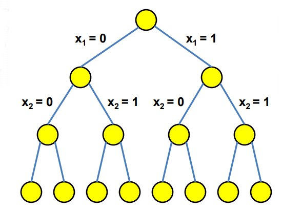
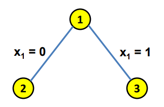
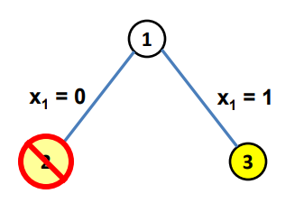
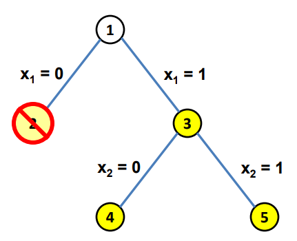
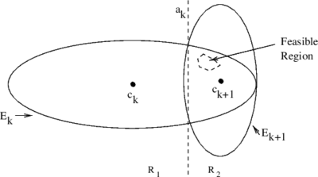

# Introduction<!-- .element: style="visibility:hidden;" -->

<hgroup>

<h1 style="font-size:28pt">Lietišķie algoritmi</h1>

<blue>Lineārā optimizācija - 4</blue>

</hgroup><hgroup style="font-size:90%">

**(1) Ievads**  
(2) [Branch and Bound algoritms](#/branch-and-bound)  
(3) [Simpleksa metodes pretpiemērs](#/simplex-worst-case)  
(4) [Vispārīgais elipsoīda algoritms](#/general-ellipsoid-algorithm)  
(5) [Elipsoīda laika sarežģītība](#/ellipsoid-complexity)  
(6) [Elipsoīda algoritms LP uzdevumiem](#/ellipsoid-algorithm-for-lp)  
(7) [Kopsavilkums](#/summary)

</hgroup>

Note: 

<!--
http://math.mit.edu/~goemans/18433S07/ellipsoid.pdf
-->

-----

# <lo-why/>why

Kāpēc ar simpleksalgoritmu nepietiek?

* LP uzdevumi mēdz būt milzīgi un nāk no dažādām jomām (LP ierobežojumi mēdz būt 
neparasti).
* Polinomiāls laiks nepieciešams ``masu problēmai''.

Note: 

Šis ir matemātiskas izteiksmes paraugs: $\varphi = \frac{1 + \sqrt{5}}{2}$.

--
 
## <lo-theory/>Sasniedzamie rezultāti

1. Veselo skaitļu programmēšanas metode ``branch and bound'' (tai jārisina daudzi LP uzdevumi)
2. Pierakstīt LP uzdevuma piemēru, kam simpleksu metode ir neefektīva
3. Formulēt Elipsoīda algoritmu (L.Hačijans). 
4. Lietot Elipsoīda algoritmu lineārām programmām. 

-----

# Branch and Bound<!-- .element: style="visibility:hidden;" -->

<hgroup>

<h1 style="font-size:28pt">Lietišķie algoritmi</h1>

<blue>Lineārā optimizācija - 4</blue>

</hgroup><hgroup style="font-size:90%">

(1) [Ievads](#/introduction)  
**(2) Branch and Bound algoritms**  
(3) [Simpleksa metodes pretpiemērs](#/simplex-worst-case)  
(4) [Vispārīgais elipsoīda algoritms](#/general-ellipsoid-algorithm)  
(5) [Elipsoīda laika sarežģītība](#/ellipsoid-complexity)  
(6) [Elipsoīda algoritms LP uzdevumiem](#/ellipsoid-algorithm-for-lp)  
(7) [Kopsavilkums](#/summary)

</hgroup>

-----

# <lo-sample/>Mugursomas uzdevums

<hgroup style="font-size:80%">

<emblue>Mugursomas uzdevums</emblue> (*0-1 Knapsack Problem*) ir kombinatoriskās optimizācijas 
uzdevums: Dotas vairākas lietas (katrai zināms gan svars, gan vērtība), 
atrast kuras no tām pievienot kolekcijai ("mugursomai") tā, lai kopīgais svars nepārsniedz 
doto limitu un kopīgā vērtība ir iespējami liela.  
(Tie ir resursu piešķiršanas uzdevumi, kur jāizvēlas no daudziem nedalāmiem projektiem 
pie fiksēta budžeta vai laika ierobežojuma.)

</hgroup>
<hgroup style="font-size:80%">

Maksimizēt  `$\sum\limits_{i=1}^n v_i x_i$`  
ja izpildās nosacījums `$\sum\limits_{i=1}^n w_i x_i \leq W$` un `$x_i \in \{0,1\}$`.

Vispārīgākā gadījumā var atļaut lietas ņemt līdz skaitam $c$ (*Bounded knapsack problem*).

Vai arī jebkuru veselu skaitu kopiju (*Unbounded knapsack problem*).

</hgroup>

-----

# <lo-summary/>Meklēšana ar pilno pārlasi

<hgroup>

<!-- .element: width="400px" -->

<emblue>Lēmumu koks</emblue> (*decision tree*) mainīgajiem 
$x_1,x_2,x_3,\ldots$.

</hgroup><hgroup>

* Jau zināms, ka LP uzdevuma mainīgie ir veseli skaitļi, kas
izpilda nevienādības: $0 \leq x_i \leq 1$ visiem $i = 1,\ldots,m$. 
* Pilnā pārlase vienmēr strādās ($4$ mainīgajiem un $16$ gadījumiem tas arī ir vieglākais 
variants), bet lielākām problēmām pilnās pārlases ilgums pieaugs eksponenciāli. 

</hgroup>

--

# <lo-theory/>Algoritma pamatideja

<hgroup style="font-size:80%">

* "Branch and bound" izmanto <emblue>LP relaksāciju</emblue>
(atļauj reālus $x_i \in (0;1)$), lai risinātu sākotnējo veselo skaitļu uzdevumu.
* Ja arī relaksētā LP uzdevuma atrisinājums ir mazāks, 
nekā līdz šim atrastais veselo skaitļu risinājums - 
<emblue>spēkā esošais risinājums</emblue> (*incumbent solution*), 
tad attiecīgo zaru <emblue>nogriež</emblue> (prune).  
Var atmest `$>99.99999\%$` utml. 
no koka virsotnēm (atsver
LP apakšuzdevumu risināšanai atvēlēto laiku). 

</hgroup>
<hgroup style="font-size:80%">

* Ieviesīsim numurētus <emblue>mezglus</emblue> (*nodes*) lēmumu kokā (atkarībā no tā, cik mainīgos esam fiksējuši 
par $0$ vai $1$). Teiksim, mezglā nr. $1$ nekas nav fiksēts; 
mezglā $2$ ir $x_1 = 0$ (citi patvaļīgi); mezglā $3$ ir $x_1 = 1$ utt. 
* Ar `$\mathbf{x}(j)$` apzīmējam (relaksētā) LP uzdevuma optimālās reālās 
vērtības $x_i \in (0;1)$ un 
$z_{LP}(j)$ apzīmē iegūtā maksimuma vērtību uzdevumam mezglā $j$. 

-----

# <lo-summary/> "Branch and Bound" Pseidokods

<table class="pseudocode" style="font-size:60%">
<tr><th colspan="2"><tt>Branch_and_Bound</tt>($\mathbf{c}$,$A$,$\mathbf{b}$)</th></tr>
<tr>
<td>1</td>
<td>Active nodes = $\{\varepsilon\}$&nbsp;&nbsp;<green>// the root ($x_i$ not yet set)</green></td>
</tr>
<tr>
<td>2</td>
<td>Incumbent $\mathbf{x} = (0,\ldots,0)$, $z^{\ast} = 0$. 
</tr>
<tr>
<td>3</td>
<td><b>while</b> Active nodes $\neq \emptyset$</td>
</tr>
<tr>
<td>4</td>
<td class="ind1">Select an active node $j$ and mark it inactive</td>
</tr>
<tr>
<td>5</td>
<td class="ind1"><b>let</b> $\mathbf{x}(j)$ be the solution of relaxed LP and $z_{LP}(j) = \mathbf{c}^T \cdot \mathbf{x}(j)$</td>
</tr>
<tr>
<td>6</td>
<td class="ind1"><b>if</b> $z^{\ast} \geq z_{LP}(j)$:&nbsp;&nbsp;<green>// Not optimal</td>
</tr>
<tr>
<td>7</td>
<td class="ind2">Prune $j$</td>
</tr>
<tr>
<td>8</td>
<td class="ind1"><b>else if</b> $z^{\ast} < z_{LP}(j)$ <b>and</b> $\mathbf{x}(j)$ is all integers:&nbsp;&nbsp;<green>// Better than incumbent</green></td> 
</tr>
<tr>
<td>9</td>
<td class="ind2">Incumbent becomes $\mathbf{x}(j)$</td>
</tr>
<tr>
<td>10</td>
<td class="ind2">Prune $j$</td>
</tr>
<tr>
<td>11</td>
<td class="ind1"><b>else if</b> $z^{\ast} < z_{LP}(j)$ <b>and</b> $\mathbf{x}(j)$ is not all integers:&nbsp;&nbsp;<green>// Could improve incumbent?</green></td> 
</tr>
<tr>
<td>12</td>
<td class="ind2">Mark the descendants of node $j$ as active</td>
</tr>
</table>

-----

# <lo-sample/>Veselu skaitļu uzdevuma piemērs

<hgroup style="font-size:80%">

Meklēsim mainīgos divu skaitļu kopā (biti `$\{0,1\}$`): 
`$$\max 15x_1 + 12x_2 + 4x_3 + 2x_4,$$`
kur
`$$8x_1 + 5x_2 + 3x_3 + 2x_4 \leq 10,$$`
un `$x_k \in \{0,1\}$` pie `$k=1,2,3,4$`.

</hgroup><hgroup style="font-size:80%">

`$$\mathbf{x} = \left( 
\begin{array}{c} 
x_1 \\
x_2 \\
x_3 \\
x_4 \\
\end{array} \right),\;\;\mathbf{c} = \left( 
\begin{array}{c} 
15 \\
12 \\
4 \\
2 \\
\end{array} \right),$$`
`$$A = \left( 
\begin{array}{cccc} 
8 & 5 & 3 & 2 \\
\end{array} \right),\;\;\;\mathbf{b} = \left( 
\begin{array}{c} 
10 \\
\end{array} \right)$$`

</hgroup>

--

# <lo-soln/> Risinājums - 1.daļa

<hgroup style="font-size:80%">

`$\max 15x_1 + 12x_2 + 4x_3 + 2x_4,$`  
`$8x_1 + 5x_2 + 3x_3 + 2x_4 \leq 10,$`  
`$x_k \leq 1,\;\;k=1,2,3,4$`  
`$x_k \geq 0,\;\;k=1,2,3,4$`

<!-- .element: width="50px" --> 

<emblue>Pašreizējais</emblue> (*Incumbent*):  
$\mathbf{x}^{\ast} = (0, 0, 0, 0)$, $z^{\ast} = 0$.

</hgroup>
<hgroup style="font-size:80%">

`$$\mathbf{x}_{LP}(1) = (5/8, 1 , 0, 0),$$`
`$$z_{LP}(1) = 21\frac{3}{8}.$$`

<!-- .element: width="200px" --> 

</hgroup>

--

## <lo-soln/> Risinājums - 2.daļa

<hgroup style="font-size:80%">

`$\max 15x_1 + 12x_2 + 4x_3 + 2x_4,$`  
`$8x_1 + 5x_2 + 3x_3 + 2x_4 \leq 10,$`  
`$x_k \leq 1,\;\;k=1,2,3,4$`  
`$x_k \geq 0,\;\;k=1,2,3,4$`

<!-- .element: width="200px" --> 

`$$\mathbf{x}_{LP}(2) = (0, 1, 1, 1),$$`
`$$z_{LP}(2) = 18.$$`

</hgroup><hgroup style="font-size:80%">

Tā kā `$z_{LP}(2) = 18 > z^{\ast}$`, un 
`$\mathbf{x}_{LP}(2) = (0, 1, 1, 1)$` ir veseli skaitļi, tad
tas ir jaunais tekošais risinājums. Nometam mezglu nr. $2$
(un visu apakškoku zem tā). 

<!-- .element: width="200px" --> 

</hgroup>

--

## <lo-soln/> Risinājums - 3.daļa

<hgroup style="font-size:80%"> 

`$\max 15x_1 + 12x_2 + 4x_3 + 2x_4,$`  
`$8x_1 + 5x_2 + 3x_3 + 2x_4 \leq 10,$`  
`$x_k \leq 1,\;\;k=1,2,3,4$`  
`$x_k \geq 0,\;\;k=1,2,3,4$`

Spēkā esošais risinājums:  
`$\mathbf{x}^{\ast} = (0, 1, 1, 1)$`  
`$z^{\ast} = 18$`.

</hgroup> 
<hgroup style="font-size:80%"> 

`$$\mathbf{x}_{LP}(3) = (1, 2/5 , 0, 0),$$`
`$$z_{LP}(3) = 19\frac{4}{5}.$$`

<!-- .element: width="300px" --> 

</hgroup>

--

## <lo-soln/> Risinājums - 4.daļa

<hgroup style="font-size:80%"> 

`$\max 15x_1 + 12x_2 + 4x_3 + 2x_4,$`  
`$8x_1 + 5x_2 + 3x_3 + 2x_4 \leq 10,$`  
`$x_k \leq 1,\;\;k=1,2,3,4$`  
`$x_k \geq 0,\;\;k=1,2,3,4$`

Spēkā esošais risinājums:  
`$\mathbf{x}^{\ast} = (0, 1, 1, 1)$`  
`$z^{\ast} = 18$`.

</hgroup>
<hgroup style="font-size:80%"> 

`$\mathbf{x}_{LP}(4) = (1, 0, 2/3, 0)$`,  
`$z_{LP}(4) = 17 \frac{2}{3}$`. 

$\mathbf{x}_{LP}(5)$ ir neizpildāms.

<!-- .element: width="300px" --> 

</hgroup> 

-----

# Simplex Worst Case<!-- .element: style="visibility:hidden;" -->

<hgroup>

<h1 style="font-size:28pt">Lietišķie algoritmi</h1>

<blue>Lineārā optimizācija - 4</blue>

</hgroup><hgroup style="font-size:90%">

(1) [Ievads](#/introduction)  
(2) [Branch and Bound algoritms](#/branch-and-bound)  
**(3) Simpleksa metodes pretpiemērs**  
(4) [Vispārīgais elipsoīda algoritms](#/general-ellipsoid-algorithm)  
(5) [Elipsoīda laika sarežģītība](#/ellipsoid-complexity)  
(6) [Elipsoīda algoritms LP uzdevumiem](#/ellipsoid-algorithm-for-lp)  
(7) [Kopsavilkums](#/summary)

</hgroup>

-----

# <lo-theory/>Simpleksa pretpiemērs

Maksimizēt izteiksmi ar $D$ mainīgajiem:  
`$2^{D-1}x_1+2^{D-2}x_2+ \dots + 2x_{D-1}+x_D$`

Nevienādības ir sekojošas:

`$$\left\{ \begin{array}{l}
x_1 \leq 5\\
4x_1+x_2 \leq 25\\
8x_1+4x_2+x_3 \leq 125 \\
 \vdots\\
2^Dx_1+2^{D-1}x_2+ \dots +4x_{D-1}+x_D \leq 5^D \\
x_1\ge0, \, \, \dots , \, \, x_D \geq 0.
\end{array} \right.$$`

--

## <lo-theory/>Klee-Minty saspiestais hiperkubs

* Deterministisks simpleksa algoritms apciemo visas $2^D$ hiperkuba 
virsotnes pirms atrod optimālo risinājumu $x_D = 5^D$ (visas citas 
ir nulles). 
* Ja simpleksu algoritms izvēlas nākamo soli ar varbūtisku (nevis 
deterministisku) metodi, pietiek ar polinomiālu laiku. 
* Piemērs ir nestabils; reālo skaitļu aritmētika un noapaļošana 
arī parasti noved pie tā, ka algoritms beidzas pēc polinomiāli daudziem soļiem.

[Reālo LP algoritmu ātrdarbība](https://cstheory.stackexchange.com/questions/2373/complexity-of-the-simplex-algorithm)

-----

# General Ellipsoid Algorithm<!-- .element: style="visibility:hidden;" -->

<hgroup>

<h1 style="font-size:28pt">Lietišķie algoritmi</h1>

<blue>Lineārā optimizācija - 4</blue>

</hgroup><hgroup style="font-size:90%">

(1) [Ievads](#/introduction)  
(2) [Branch and Bound algoritms](#/branch-and-bound)  
(3) [Simpleksa metodes pretpiemērs](#/simplex-worst-case)  
**(4) Vispārīgais elipsoīda algoritms**  
(5) [Elipsoīda laika sarežģītība](#/ellipsoid-complexity)  
(6) [Elipsoīda algoritms LP uzdevumiem](#/ellipsoid-algorithm-for-lp)  
(7) [Kopsavilkums](#/summary)

</hgroup>

-----

# <lo-summary/>Elipsoīda algoritma ievads

Šo algoritmu izgudroja Hačijans (Khachiyan) 1979. gadā.  
Elipsoīda algoritms pazīstams kā pirmais lineārās programmēšanas algoritms, 
kuram tika pierādīts, ka tas atrod atrisinājumu polinomiālā laikā ($O(n^4L)$),
kur $n$ - dimensiju skaits, $L$ – ar cik bitu precizitāti jāatrod atrisinājums. 

Lai gan teorētiski darbības laiks ir polinomiāls, praksē algoritms ir 
lēns un netiek lietots. Tāpēc šajā kursā mēs ierobežosimies ar īsu šī algoritma aprakstu.

-----

# <lo-summary/>Elipsoīda algoritms LP uzdevumiem

Dualitātes teorēmas (un redukcijas uz primāro+duālo) dēļ 
pietiek ar algoritmu, kas atrod punktu, kur izpildās visi nosacījumi. To meklē šādi:

Sāk ar elipsoīdu $E_0$, kas noteikti ietver LP pieļaujamo apgabalu.  
Pilda sekojošus soļus līdzkamēr sasniegta vajadzīgā precizitāte:

1. Ņem iepriekšējā elipsoīda $E_i$ centru $c_i$.
2. Ja $c_i$ neapmierina visus LP nosacījumus, tad atrod nosacījumu 
$a_k$, kas tiek pārkāpts visvairāk.
3. Ar plakni, kas sastāv no visiem punktiem, kur nosacījuma $a_k$ 
izteiksmei ir vienāda vērtība $c$ (kur $c$ ir pa vidu starp vērtību punktā 
$c_i$ un pieļaujamajām izteiksmes vērtībām) pārdala telpu divās daļās. 
Ar $R_1$ apzīmējam daļu, kur nonāk $c_i$ un ar $R_2$ apzīmējam daļu, 
kur nonāk pieļaujamais apgabals.
4. Uzkonstruē jaunu elipsoīdu $E_{i+1}$, tā lai izpildītos
$$E_i \cap R_2 \subseteq E_{i+1}.$$

-----

## <lo-summary/>Apgalvojums par elipsoīdu

<hgroup>

</hgroup>
<hgroup style="font-size:80%">

**Uzdevums:** Meklē punktu izliektā $n$ dimensiju telpas apgabalā.
Hačjana konstrukcijā (*barycentric coordinate descent*) veido elipsoīdu virkni, kurai 
`$$\frac{\text{Volume}(E_{k+1})}{\text{Volume}(E_{k})} = e^{-\frac{1}{2n+1}}$$`
jeb tilpumu attiecība ir stingri mazāka par $1$ (atkarīga tikai no dimensiju skaita $n$). 

Sal. [Elipsoīda algoritma lekcija 6-854J.L12](https://ocw.mit.edu/courses/electrical-engineering-and-computer-science/6-854j-advanced-algorithms-fall-2008/lecture-notes/lec12.pdf)

</hgroup>

-----

# Ellipsoid Complexity<!-- .element: style="visibility:hidden;" -->

<hgroup>

<h1 style="font-size:28pt">Lietišķie algoritmi</h1>

<blue>Lineārā optimizācija - 4</blue>

</hgroup><hgroup style="font-size:90%">

(1) [Ievads](#/introduction)  
(2) [Branch and Bound algoritms](#/branch-and-bound)  
(3) [Simpleksa metodes pretpiemērs](#/simplex-worst-case)  
(4) [Vispārīgais elipsoīda algoritms](#/general-ellipsoid-algorithm)  
**(5) Elipsoīda laika sarežģītība**  
(6) [Elipsoīda algoritms LP uzdevumiem](#/ellipsoid-algorithm-for-lp)  
(7) [Kopsavilkums](#/summary)

</hgroup>

-----

# Ellipsoid Algorithm for LP<!-- .element: style="visibility:hidden;" -->

<hgroup>

<h1 style="font-size:28pt">Lietišķie algoritmi</h1>

<blue>Lineārā optimizācija - 4</blue>

</hgroup><hgroup style="font-size:90%">

(1) [Ievads](#/introduction)  
(2) [Branch and Bound algoritms](#/branch-and-bound)  
(3) [Simpleksa metodes pretpiemērs](#/simplex-worst-case)  
(4) [Vispārīgais elipsoīda algoritms](#/general-ellipsoid-algorithm)  
(5) [Elipsoīda laika sarežģītība](#/ellipsoid-complexity)  
**(6) Elipsoīda algoritms LP uzdevumiem**  
(7) [Kopsavilkums](#/summary)

</hgroup>

-----

# Summary<!-- .element: style="visibility:hidden;" -->

<hgroup>

<h1 style="font-size:28pt">Lietišķie algoritmi</h1>

<blue>Lineārā optimizācija - 4</blue>

</hgroup><hgroup style="font-size:90%">

(1) [Ievads](#/introduction)  
(2) [Branch and Bound algoritms](#/branch-and-bound)  
(3) [Simpleksa metodes pretpiemērs](#/simplex-worst-case)  
(4) [Vispārīgais elipsoīda algoritms](#/general-ellipsoid-algorithm)  
(5) [Elipsoīda laika sarežģītība](#/ellipsoid-complexity)  
(6) [Elipsoīda algoritms LP uzdevumiem](#/ellipsoid-algorithm-for-lp)  
**(7) Kopsavilkums**

</hgroup>

-----

# <lo-theory/>Ko darījām šajā nodarbībā

1. Minējām metodi sākotnējā tuvinājuma atrašanai (un pārbaudei, vai LP uzdevums
ir atrisināms un nav pretrunīgs). 

