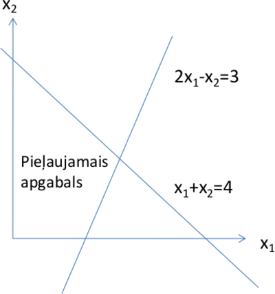
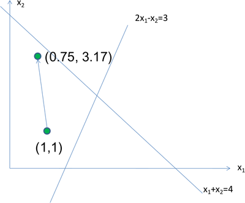

# Introduction<!-- .element: style="visibility:hidden;" -->

<hgroup>

<h1 style="font-size:28pt">Lietišķie algoritmi</h1>

<blue>Lineārā optimizācija - 5</blue>

</hgroup><hgroup style="font-size:90%">

**(1) Ievads**  
(2) [Iekšējā punkta metožu jēdzieni](#/interior-point-method-concepts)  
(3) [Afīnās mērogošanas soļi](#/afine-scaling-steps)  
(4) [Afīnās mērogošanas piemērs](#/afine-scaling-example)  
(5) [Citas iekšējā punkta metodes](#/other-interior-point-methods)  
(6) [Lineārās programmēšanas lietojumi](#/more-lp-applications)  
(7) [Kopsavilkums](#/summary)

</hgroup>

<!--
Karmakar? Interior point?
https://ocw.mit.edu/courses/electrical-engineering-and-computer-science/6-251j-introduction-to-mathematical-programming-fall-2009/lecture-notes/MIT6_251JF09_lec20.pdf

Lietojumi: 
https://www.sciencedirect.com/science/article/pii/S1110016818302126
-->

-----

# <lo-why/>why

Kāpēc vērts izmantot iekšējā punkta metodes?

* Var būt ātrākas par simpleksalgoritmu, garantē 
LP uzdevuma atrisināšanu polinomiālā laikā.
* Ir praktiskas un precīzas.

-----

# Interior-Point Method Concepts<!-- .element: style="visibility:hidden;" -->

<hgroup>

<h1 style="font-size:28pt">Lietišķie algoritmi</h1>

<blue>Lineārā optimizācija - 5</blue>

</hgroup><hgroup style="font-size:90%">

(1) [Ievads](#/introduction)  
**(2) Iekšējā punkta metožu jēdzieni**  
(3) [Afīnās mērogošanas soļi](#/afine-scaling-steps)  
(4) [Afīnās mērogošanas piemērs](#/afine-scaling-example)  
(5) [Citas iekšējā punkta metodes](#/other-interior-point-methods)  
(6) [Lineārās programmēšanas lietojumi](#/more-lp-applications)  
(7) [Kopsavilkums](#/summary)

</hgroup>

-----

# <lo-theory/> Iekšējā punkta metožu vēsture

* N. K. Karmarkar. A new polynomial-time algorithm for linear programming. Combinatorica, 4:373–395, 1984.  
**(Pazīstama kā pirmā efektīvā tuvinājumu metode LP)**
* R. J. Vanderbei, M. S. Meketon, and B. A. Freedman. A modification of Karmarkar’s linear programming algorithm. Algorithmica, 1:395–407, 1986.  
**(Izmainīta Karmarkara metode; Izskaidrota šajā nodarbībā)**
* I. I. Dikin. Iterative solution of problems of linear and quadratic programming. Doklady Akademii Nauk SSSR, 174:747–748, 1967.

Note: 

[Dažas atsauces](https://homepages.rpi.edu/~mitchj/handouts/interior_html/interior.html)

-----

# <lo-theory/>Pamatidejas

* Apgabalu, kurā meklē atrisinājumu var aizstāt ar <emblue>barjerfunkciju</emblue> (*barrier function*), 
kas strauji aug tad, ja tuvojas atļautā apgabala robežai.
* Atšķirībā no simpleksmetodes, kas pārmeklē pieļaujamā 
apgabala stūrus, iekšējā punkta metode meklē labākus un 
labākus atrisinājumus pieļaujamā apgabala iekšienē, 
tuvojoties stūrim tikai algoritma beigās.  
To mēdz realizēt divos veidos. 

--

## <lo-theory/> Iekšējā punkta 1.veids

**Pirmais veids:** Modificējot mērķfunkciju tā, lai tās vērtība kļūtu 
sliktāka pieļaujamā apgabala malās. 
Piemēram, mērķfunkciju `$\max (c_1 x_1 + c_2 x_2 + \ldots + c_n x_n)$` 
var aizstāt ar
`$$\max \left( c_1 x_1 + c_2 x_2 + \ldots + c_n x_n + \ln x_1 + \ldots + \ln x_n \right).$$`
Tad, tuvojoties `$x_i=0$` plaknēm, kas ierobežo pieļaujamo apgabalu, 
`$\ln x_i$` tiecas uz `$-\infty$` un mērķfunkcija arī tieksies uz `$-\infty$`.

--

## <lo-theory/> Iekšējā punkta 2.veids

**Otrais veids:** Ievieš papildus nosacījumus, 
kas attur no pieļaujamā apgabala malām.

Ar katru soli, papildus nosacījumi tiek vājināti, 
ļaujot algoritmam pietuvoties stūrim, kur ir sākotnējas 
mērķfunkcijas maksimālā vērtība. Mērķis ir panākt, 
lai algoritms sākumā atrod optimālo vērtību pieļaujamā 
apgabala iekšienē un tad nonāk optimālajā stūrī. 

--

## <lo-theory/>Iekšējā punkta metožu varianti

Iekšējā punkta metodei ir trīs galvenie varianti:

* **Afīnā mērogošana** – teorētiska ātrdarbības novērtējuma nav, 
bet praksē strādā diezgan labi;
* **Potenciāla redukcija** – pierādāmi strādā laikā `$O(nL)$`, kur `$n$` – mainīgo skaits, 
`$L$` – precizitāte bitos, ar kādu jāatrod atrisinājums;
* **Centrālā trajektorija** - pierādāmi strādā laikā `$O(L \sqrt{n})$`.

Sīkāk apskatīsim pirmo no šiem variantiem.

-----

# Afine Scaling Steps<!-- .element: style="visibility:hidden;" -->

<hgroup>

<h1 style="font-size:28pt">Lietišķie algoritmi</h1>

<blue>Lineārā optimizācija - 5</blue>

</hgroup><hgroup style="font-size:90%">

(1) [Ievads](#/introduction)  
(2) [Iekšējā punkta metožu jēdzieni](#/interior-point-method-concepts)  
**(3) Afīnās mērogošanas soļi**  
(4) [Afīnās mērogošanas piemērs](#/afine-scaling-example)  
(5) [Citas iekšējā punkta metodes](#/other-interior-point-methods)  
(6) [Lineārās programmēšanas lietojumi](#/more-lp-applications)  
(7) [Kopsavilkums](#/summary)

</hgroup>

-----

# <lo-theory/>Uzdevums

Apzīmējam:

`$$x = \left( 
\begin{array}{c}
x_1\\
x_2\\
\ldots\\
x_n
\end{array} \right),\;\;
A=\left( 
\begin{array}{cccc}
a_{11} & a_{12} & \ldots & a_{1n}\\
\ldots & \ldots & \ldots & \ldots\\
a_{m1} & a_{m2} & \ldots & a_{mn}
\end{array} \right),\;\;
b=\left( 
\begin{array}{c}
b_1\\
\ldots\\
b_m
\end{array} \right).$$`

Maksimizēt `$\color{#00F}{c_1 x_1 + c_2 x_2 + \ldots + c_n x_n}$`  
pie nosacījumiem `$Ax = b$`, `$x_1 \geq 0$`, `$x_2 \geq 0$`, `$\ldots$`, `$x_n \geq 0$`.

--

## <lo-summary/>Afīnās mērogošanas metodes soļi

Sākam ar kaut kādu lineārās programmas atrisinājumu `$\mathbf{x} = (x_1, x_2, \ldots, x_n)$`.
Atkārto šādu darbību virkni:

1. Novelk elipsoīdu ap tekošo atrisinājumu 
`$\mathbf{x} = (x_1, x_2, \ldots, x_n)$`, kas pieskaras visām plaknēm `$x_i=0$`.
2. Atrod, kurā elipsoīda punktā mērķfunkcija ir maksimāla. 
(Maksimumu meklē visos elipsoīda punktos, arī kur `$A\mathbf{x}=\mathbf{b}$` neizpildās.) 
Atrasto maksimumu apzīmē ar `$\mathbf{x}’ = (x’_1, x’_2, \ldots, x’_n)$`.
3. Projicē vektoru `$\mathbf{x}’ - \mathbf{x}$` 
uz plakni `$Ax=0$`. Iegūto projekciju apzīmē ar `$\mathbf{z} = (z_1, z_2, \ldots, z_n)$`.
4. Jebkuram `$a \in \mathbb{R}$`, vektors `$x + a z$` apmierina nosacījumus `$Ax = b$`. 
Aprēķinām maksimālo `$a$`, pie kura `$x_i + az_i \geq 0$` (t.i. joprojām `$x_i \geq 0$`).
5. Jaunais atrisinājums būs `$\mathbf{x}’ = (x’_1, x’_2, \ldots, x’_n)$`, kur
`$x’_i = x_i + 0.96 \cdot a \cdot z_i$`.

Šeit `$\beta = 0.96$` ir <blue>*soļa garums*</blue> (*step size*), ko bieži izmanto praksē. 
Citos kontekstos der arī citas vērtības `${\displaystyle \beta \in \left[ \frac{2}{3};1 \right)}$`. 

-----

# Afine Scaling Example<!-- .element: style="visibility:hidden;" -->

<hgroup>

<h1 style="font-size:28pt">Lietišķie algoritmi</h1>

<blue>Lineārā optimizācija - 5</blue>

</hgroup><hgroup style="font-size:90%">

(1) [Ievads](#/introduction)  
(2) [Iekšējā punkta metožu jēdzieni](#/interior-point-method-concepts)  
(3) [Afīnās mērogošanas soļi](#/afine-scaling-steps)  
**(4) Afīnās mērogošanas piemērs**  
(5) [Citas iekšējā punkta metodes](#/other-interior-point-methods)  
(6) [Lineārās programmēšanas lietojumi](#/more-lp-applications)  
(7) [Kopsavilkums](#/summary)

</hgroup>

-----

# <lo-sample/>LP Uzdevums

<hgroup>

Maksimizēt `${\displaystyle -\frac{x_1}{3} + x_2}$`
pie nosacījumiem:
`$$\left\{ 
\begin{array}{l}
x_1 + x_2 \leq 4,\\
2x_1 - x_2 \leq 3,\\
x_1 \geq 0, x_2 \geq 0. 
\end{array} \right.
$$`

<blue>Sākumpunkts: `$x_1=1$`, `$x_2=1$`.</blue>

</hgroup>
<hgroup>

</hgroup>

--

## <lo-soln/>Pārveidošana standartformā

Pārveido LP formā, kur ir tikai vienādības.

Maksimizēt `${\displaystyle -\frac{x_1}{3} + x_2}$`
pie nosacījumiem:
`$$\left\{ 
\begin{array}{l}
x_1 + x_2 + x_3 = 4,\\
2x_1 - x_2 + x_4 = 3,\\
x_1 \geq 0, x_2 \geq 0, x_3 \geq 0, x_4 \geq 0.
\end{array} \right.$$`

<blue>Sākumpunkts: `$x_1=1$`, `$x_2=1$`, `$x_3=2$`, `$x_4=2$`.</blue>

--

## <lo-soln/>1.solis

* Koordinātu transformācija.  
`$x_1=1+y_1$`, `$x_2=1+y_2$`, `$x_3=2+y_3$`, `$x_4=2+y_4$`.  
Koordinātu pārveidojums: `$(1, 1, 2, 2) \rightarrow (0, 0, 0, 0)$`.
* Jaunā programma.  
Maksimizēt `${\displaystyle -\frac{x_1}{3} + x_2 = -\frac{y_1 + 1}{3} + (y_2+1) = }$`
`$={\displaystyle \color{#00F}{-\frac{y_1}{3} + y_2 + \frac{2}{3}}}$` jeb 
`${\displaystyle \color{#F00}{-\frac{y_1}{3} + y_2}}$` pie nosacījumiem 
`$$\left\{ 
\begin{array}{l}
y_1 + y_2 + y_3 = 0,\\
2y_1 - y_2 + y_4 = 0,\\
y_1 \geq -1,\; y_2 \geq -1,\; y_3 \geq -2,\; y_4 \geq -2.
\end{array} \right.$$`

--

## <lo-soln/>2.solis

* Koordinātu “saspiešana”.  
`$y_1=z_1$`, `$y_2=z_2$`, `$y_3=2z_3$`, `$y_4=2z_4$`.
* Jaunā programma:  
Maksimizēt `${\displaystyle -\frac{z_1}{3} + z_2}$` pie nosacījumiem 
`$$\left\{ 
\begin{array}{l}
z_1 + z_2 + 2z_3 = 0,\\
2z_1 - z_2 + 2z_4 = 0,\\
z_1 \geq -1, z_2 \geq -1, z_3 \geq -1, z_4 \geq -1.
\end{array} \right.$$`

Tekošais punkts – vienādā apkārtnē no visiem ierobežojumiem.

--

## <lo-soln/>3.solis

Maksimizēt `${\displaystyle -\frac{z_1}{3} + z_2}$` pie nosacījumiem 
`$$\left\{ 
\begin{array}{l}
2z_1-z_2 + 2z_3 = 0,\\
z_1+z_2 + 2z_4 = 0,\\
z_1 \geq -1, z_2 \geq -1, z_3 \geq -1, z_4 \geq -1.
\end{array} \right.$$`

Sfēra, kas pieskaras visiem ierobežojumiem:

`$$z_1^2 + z_2^2 + z_3^2 + z_4^2 = 1.$$`

--

## <lo-soln/>4.solis

**Teorēma:** `$a_1z_1 + a_2z_2 +\ldots + a_nz_n$`
maksimums uz sfēras 
`$$z_1^2 + z_2^2 + \ldots + z_n^2 = 1$$`
tiek sasniegts virzienā
`$$z_1 = a_1,\;z_2=a_2,\,\ldots,\;z_n = a_n.$$`

Mūsu gadījumā izteiksmei 
`${\displaystyle -\frac{z_1}{3} + z_2}$` 
maksimums ir uz tā vektora, kas 
rāda virzienā `$z_{\max} = (z_1,z_2,z_3,z_4) = (-1/3,1,0,0)$`. 

--

## <lo-soln/>5.solis

Vēlamies projicēt `$z_{\max} = (-1/3, 1, 0, 0)$` 
uz divdimensiju hipertelpu (divu trīsdimensiju hipertelpu šķēlumu), kur izpildās nosacījumi:  
`$$\left\{ 
\begin{array}{l} 
z_1 + z_2 + 2z_3 = 0,\\
2z_1 - z_2 + 2z_4 = 0.
\end{array} \right.$$`

Koeficientu matrica ir

`$$B = \left( 
\begin{array}{cccc}
1 & 1 & 2 & 0 \\ 
2 & -1 & 0 & 2 
\end{array} \right)$$`

--

## <lo-soln/>5.solis (turpinājums)

Aprēķinām `$B \cdot B^T$` un `$B \cdot z_{\max}$`
`$$B \cdot B^T = 
\left( 
\begin{array}{cccc}
1 & 1 & 2 & 0 \\ 
2 & -1 & 0 & 2 
\end{array} \right) \cdot 
\left( 
\begin{array}{cc}
1 & 2 \\ 
1 & -1 \\
2 & 0 \\
0 & 2
\end{array} \right)
 =
\left(
\begin{array}{cc}
6 & 1\\
1 & 9 
\end{array} \right)$$`

`$$B \cdot z_{\max} = B \cdot \left( \begin{array}{c}
-1/3\\
1\\
0\\
0 \end{array} \right) = \left(
\begin{array}{c}
2/3\\
-5/3
\end{array} \right).$$`

--

## <lo-soln/>6.solis 

Risinām sistēmu `$B \cdot B^T \cdot w = B \cdot z_{max}$`.

`$$\left\{ \begin{array}{l}
6w_1 + w_2 = \frac{2}{3}\\
w_1 + 9w_2 = -\frac{5}{3}
\end{array} \right.$$`

Vienādojumu sistēmas atrisinājums ir 

`$$w_1 = \frac{23}{159},\;\;w_2 = -\frac{32}{159}.$$`

--

## <lo-soln/>7.solis 

Projekcijas vektora virziens:

`$$p = z - B^T \cdot w = $$`
`$$= \left( \begin{array}{c}
-\frac{1}{3}\\
1\\
0\\
0 \end{array} \right) - 
\left( \begin{array}{cc}
1 & 2\\
1 & -1\\
2 & 0\\
0 & 2 \end{array} \right) \cdot 
\left( \begin{array}{c}
\frac{23}{159}\\
-\frac{32}{159} \end{array} \right) = 
\left( \begin{array}{c}
-\frac{12}{159}\\
\frac{104}{159}\\
-\frac{46}{159}\\
\frac{64}{159}
\end{array} \right).
$$`

--

## <lo-soln/>8.solis 

Novelkam taisni virzienā `$p$`. Šo taisni var uzdot parametriski:
`$$\left\{ \begin{array}{l}
z_1 = -12t,\\
z_2 = 104t,\\
z_3 = -46t,\\
z_4 = 64t,
\end{array} \right.$$`
kur `$t$` ir parametrs.

Tagad jānosaka pirmais krustpunkts starp šo taisni un plaknēm `$z_i \geq -1$` 
(virzienā `$t \geq 0$`). Tas ir `$t = 1/46$`, kur mūsu taisne krusto 
`$z_3 \geq -1$`. 

--

## <lo-soln/>9.solis 

Tātad jaunais atrisinājums būs

`$$\left\{ \begin{array}{l}
z_1 = -0.96 \cdot 12 \cdot \frac{1}{46} = -0.25043,\\
z_2 = 0.96 \cdot 104 \cdot \frac{1}{46} = 2.17044,\\
z_3 = -0.96 \cdot 46 \cdot \frac{1}{46} = 0.96000,\\
z_4 = 0.96 \cdot 64 \cdot \frac{1}{46} = 1.33565.
\end{array} \right.$$`

Pārveidojam atpakaļ uz sākotnējās koordinātēm:

`$$\left\{ \begin{array}{l}
y_1 = z_1 = -0.25043\\
y_2 = z_2 = 2.17044\\
y_3 = 2z_3 = 1.92000\\
y_4 = 2z_4 = 2.67130 
\end{array} \right.;\;\;
\left\{ \begin{array}{l}
x_1 = 1 + y_1 = 0.74957\\
x_2 = 1 + y_2 = 3.17044\\
x_3 = 2 + y_3 = 3.92000\\
x_4 = 2 + y_4 = 4.67130 
\end{array} \right.$$`

--

## <lo-summary/>Afīnās mērogošanas galarezultāts

<hgroup>

Maksimizēt `${\displaystyle -\frac{x_1}{3} + x_2}$`
pie nosacījumiem:
`$$\left\{ 
\begin{array}{l}
x_1 + x_2 \leq 4,\\
2x_1 - x_2 \leq 3,\\
x_1 \geq 0, x_2 \geq 0. 
\end{array} \right.
$$`

</hgroup>
<hgroup>

No punkta `$(x_1,x_2) = (1,1)$` pēc 1.iterācijas
ieguvām `$(0.74957;3.17044)$`

</hgroup>

-----

# Other Interior Point methods<!-- .element: style="visibility:hidden;" -->

<hgroup>

<h1 style="font-size:28pt">Lietišķie algoritmi</h1>

<blue>Lineārā optimizācija - 5</blue>

</hgroup><hgroup style="font-size:90%">

(1) [Ievads](#/introduction)  
(2) [Iekšējā punkta metožu jēdzieni](#/interior-point-method-concepts)  
(3) [Afīnās mērogošanas soļi](#/afine-scaling-steps)  
(4) [Afīnās mērogošanas piemērs](#/afine-scaling-example)  
**(5) Citas iekšējā punkta metodes**  
(6) [Lineārās programmēšanas lietojumi](#/more-lp-applications)  
(7) [Kopsavilkums](#/summary)

</hgroup>

-----

# <lo-theory/>Potenciāla samazināšanas metode

Minimizējam 
`$$q \ln (cx - by) = \sum\limits_{j=1}^n \ln (x_j),$$`
kur `$Ax =b$`, `$x \geq 0$`,  
`$yA + s = 0$`, `$s \geq 0$`. 

-----

# <lo-theory/>Centrālās trajektorijas metode

Minimizējam 
`$$cx - \mu_k \sum\limits_{j=1}^n \ln (x_j),$$`
kur `$Ax =b$`, `$x > 0$`. 
Sākotnēji šādas metodes radās nelineāriem optimizācijas
uzdevumiem, risinot tos ar Ņūtona pieskaru metodi
(kurā Ņūtona solim uzliek papildus ierobežojumus). 

Katrā nākamajā solī izvēlas `$\mu_{k+1} \leq \mu_k$`, 
un `$\mu_k$` tuvojas nullei. 

-----

# More LP Applications<!-- .element: style="visibility:hidden;" -->

<hgroup>

<h1 style="font-size:28pt">Lietišķie algoritmi</h1>

<blue>Lineārā optimizācija - 5</blue>

</hgroup><hgroup style="font-size:90%">

**(1) Ievads**  
(2) [Iekšējā punkta metožu jēdzieni](#/interior-point-method-concepts)  
(3) [Afīnās mērogošanas soļi](#/afine-scaling-steps)  
(4) [Afīnās mērogošanas piemērs](#/afine-scaling-example)  
(5) [Citas iekšējā punkta metodes](#/other-interior-point-methods)  
**(6) Lineārās programmēšanas lietojumi**  
(7) [Kopsavilkums](#/summary)

</hgroup>

-----

# <lo-theory/>Divu veidu ieteikumu veidošana

1. Collaborative systems: Iesaka jaunu saturu, balstoties uz to, ko 
2. Content-based systems

Note:

MovieLens dataset  - https://www.youtube.com/watch?v=9gBC9R-msAk

-----

# Summary<!-- .element: style="visibility:hidden;" -->

<hgroup>

<h1 style="font-size:28pt">Lietišķie algoritmi</h1>

<blue>Lineārā optimizācija - 5</blue>

</hgroup><hgroup style="font-size:90%">

(1) [Ievads](#/introduction)  
(2) [Iekšējā punkta metožu jēdzieni](#/interior-point-method-concepts)  
(3) [Afīnās mērogošanas soļi](#/afine-scaling-steps)  
(4) [Afīnās mērogošanas piemērs](#/afine-scaling-example)  
(5) [Citas iekšējā punkta metodes](#/other-interior-point-methods)  
(6) [Lineārās programmēšanas lietojumi](#/more-lp-applications)  
**(7) Kopsavilkums**

</hgroup>

