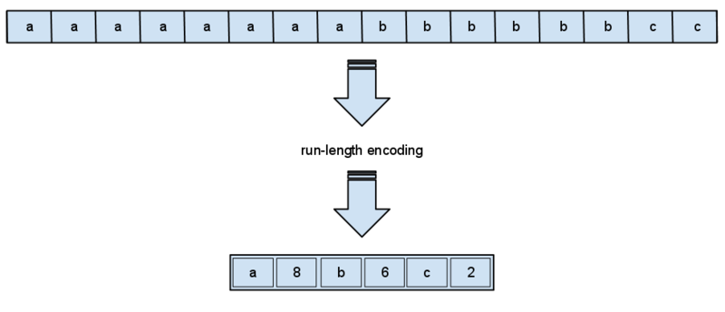
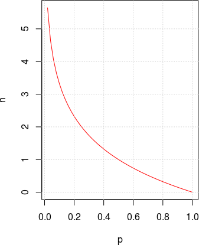
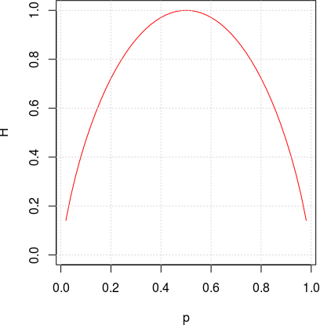

# &nbsp;

<hgroup>

<blue>Informācijas saspiešanas pamatjēdzieni</blue>

<!-- .element: width="400px" -->

</hgroup><hgroup>

**(1) Ievads**  
(2) [Saspiešanas jēdzieni](#section-1)  
(3) [Universālas saspiešanas neiespējamība](#section-2)  
(4) [Informācijas saturs](#section-3)  
(5) [Entropija](#section-4)  
(6) [Monētu svēršana](#section-5)  
(7) [Entropijas īpašības](#section-6)  
(8) [Kopsavilkums](#section-7)

</hgroup>

Note:
[Run length encodings](https://commons.wikimedia.org/wiki/File:Run-lengthEncoding1.png)

<!--

TODO 2020: 
* Add definition of average code length - a little expression
* Remind of the independent variables; finish example with information content in two dice-rolls. 
* 

-->

-----

# <lo-summary/> Kursa priekšmetapgabali

* Bezzudumu saspiešana (informācijas teorija u.c.)
* Zudumradošā saspiešana
* Kļūdu labošanas kodi
* Grafi un svērti grafi
* Lineārā programmēšana (lineāras izteiksmes 
optimizācija ar lineāriem ierobežojumiem)
* Virkņu/Stringu meklēšana

Priekšnoteikums: **DatZ3168** (Datu struktūras un algoritmi)

--

## <lo-summary/> Algoritmu paradigmas 
 
<small>(Anany Levitin. Introduction to The Design and 
Analysis of Algorithms.)</small>

* Pilnās pārlases jeb rupjā spēka paradigma
* Samazināšanas-valdīšanas paradigma
* Skaldīšanas-valdīšanas paradigma
* Pārveidošanas-valdīšanas paradigma
* Dinamiskās programmēšanas paradigma
* Alkatīgā paradigma
* Iteratīvās uzlabošanas paradigma 

*Arī priekšmetapgabalu/paradigmu tabula.*

-- 

## <lo-summary/> Kursa mērķi

* Algoritmu un to sarežģītības teorētiska izpēte 
(tsk. laika/telpas sarežģītība, NP-pilnas problēmas).
* IT risinājumi ar advancētiem algoritmiem
(tsk. uzlabojumi "ikdienišķos" produktos un pakalpojumos).
* Praktiska eksperimentēšana un prototipu veidošana.

**Līdzekļi:** Jēdzienu definīcijas. Algoritmu paveidi pseidokoda līmenī 
(RSA algoritmu grāmatas stils). Matemātiski apgalvojumi.
Produktu un standartu salīdzināšana. Jupyter Notebook 
(var arī C++ utml.). 

-- 

## <lo-summary/> Kas ir kursa tvērumā?

<hgroup>

**In Scope:**

* Noderīgums īstajā pasaulē.
* Informācijas teorija, datu pārraide, tīklošanās.
* Priekšmetapgabalu saspēle (dualitāte, 
NP-pilni uzdevumi, lineārā algebra, u.c.).

</hgroup>
<hgroup>

**Out of Scope:**

* Datu struktūru klasika (saraksti, koki, kārtošana, hešings, utml.).
* Kriptogrāfija.
* Skaitļojamā ģeometrija. 
* Skaitliskās metodes. 
* Advancēti skaitļošanas modeļi (paralēlie, kvantu algoritmi).

</hgroup>

-----

# <lo-why/> why

Kāpēc vajag vairāk nekā vienu saspiešanas algoritmu?

* Kādos gadījumos saspiešana atkarīga no ievades datiem?
* Kādus datus var (un kādus nevar) efektīvi saspiest?

--

## <lo-summary/> Sasniedzamie rezultāti

1. Definēt ziņojumu alfabētus un to varbūtību sadalījumus
2. Definēt kodējumu kā funkciju uz bitu virknēm, tā sagaidāmo garumu
3. Pamatot universālas saspiešanas neiespējamību.
4. Definēt bezzudumu un zudumradošo saspiešanu.
5. Definēt ziņojuma informācijas saturu. 
6. Definēt entropiju, aprakstīt tās īpašības.
7. Izmantot entropiju teksta uzdevumos.

-----

# &nbsp; 

<hgroup>

<blue>Informācijas saspiešanas pamatjēdzieni</blue>

</hgroup><hgroup>

(1) [Ievads](#section-0)  
**(2) Saspiešanas jēdzieni**  
(3) [Universālas saspiešanas neiespējamība](#section-2)  
(4) [Informācijas saturs](#section-3)  
(5) [Entropija](#section-4)  
(6) [Monētu svēršana](#section-5)  
(7) [Entropijas īpašības](#section-6)  
(8) [Kopsavilkums](#section-7)

</hgroup>

-----

# <lo-theory/> Alfabēti, vārdi, valodas

Par <emblue>alfabētu</emblue> (*alphabet*) saucam galīgu kopu ar simboliem. 

* Latīņu/angļu alfabēts: 26 simboli
* Latviešu alfabēts: 33 simboli ($26 - 4 + 11$)
* [ASCII alfabēts](http://www.asciitable.com/): 128 simboli
* Unikoda alfabēts (UCS-2, *Basic Multilingual Plane*): 
65536 simboli. Unikoda standartā ir ap 170 tūkstošiem simbolu
(arī papildu plaknes).

--

## <lo-theory/> Ziņojumu alfabēts

* Vienkāršākā teorija ir par atsevišķu ziņojumu kodēšanu. 
Pieņemam, ka sākotnēji dota $n$ iespējamo ziņojumu kopa:
`$$S = \{ s_1, s_2, \ldots, s_n \}.$$` 
* Ziņojumu alfabēts var būt jebkāds; ziņojums var būt viens burts, vairāki burti 
vai pat vesels fails.
* Ja dotas ziņojumu varbūtības, var atrast informācijas saturu un entropiju.

--

## <lo-theory/> Kodējuma jēdziens

* Par <emblue>kodējumu</emblue> (*encoding*) 
ziņojumu kopai $S$ sauc funkciju $C$, kas
katru ziņojumu pārvērš par bitu virkni. 
* Katru bitu virkni sauc par <emblue>kodavārdu</emblue> (*codeword*) un 
aprakstām kodējumu ar funkcijas vērtību sarakstu:
`$$C = \{ (s_1,w_1),(s_2,w_2),\ldots,(s_m,w_m)\}.$$`
* Ja ziņojumam dots garums sākotnējā, nesaspiestajā formā, 
var runāt par <emblue>saspiešanas attiecību</emblue> 
(*compression ratio*):

`$$r = \frac{\text{Uncompressed size}}{\text{Compressed size}} = \frac{|s_i|}{|w_i|}.$$`

--

## <lo-theory/> 2 saspiešanas veidi

<!-- .element: width="700px" -->

**Bezzudumu saspiešana:**  
Atspiestais ziņojums
precīzi sakrīt ar sākotnējo.  
Iecienīts teksta dokumentiem, izpildāmam kodam.

**Zudumradošā saspiešana:**   
Atspiestais ziņojums tikai aptuveni vienāds
ar sākotnējo.  
Attēlu, skaņas, video glabāšana un pārraide.

-----

# &nbsp;

<hgroup>

<blue>Informācijas saspiešanas pamatjēdzieni</blue>

</hgroup><hgroup>

(1) [Ievads](#section-0)  
(2) [Saspiešanas jēdzieni](#section-1)  
**(3) Universālas saspiešanas neiespējamība**  
(4) [Informācijas saturs](#section-3)  
(5) [Entropija](#section-4)  
(6) [Monētu svēršana](#section-5)  
(7) [Entropijas īpašības](#section-6)  
(8) [Kopsavilkums](#section-7)

</hgroup>

-----

# <lo-theory/> Injektīvi attēlojumi

**Definīcija:** Funkciju $f\,:\;X \rightarrow Y$ 
sauc par <emblue>injektīvu</emblue> (*injective*), 
ja katriem diviem argumentiem $x_1,x_2 \in X$ izpildās:
`$$x_1 \neq x_2\;\;\Rightarrow\;\;f(x_1) \neq f(x_2).$$`

Bezzudumu saspiešanas funkcijai 
jābūt injektīvai, tajā nedrīkst
būt "kolīzijas" (vērtību "saskriešanās"). 

--

## <lo-theory/> Universāli saspiest nevar

Neeksistē tāds algoritms, kas **katru** $n$ bitu virkni
bezzudumu saspiešanā pārveido 
par $k$ bitu virkni, kur $k < n$.

*Pamatojums:* Ar skaitīšanu.  
Bitam ir $2$ vērtības ($0$ vai $1$). 

* $m$ bitu virknei ir $2^m$ vērtības,
* $k$ bitu virknei ir $2^k$ vērtības. 

No <emblue>Dirihlē principa</emblue> (*Pigeonhole principle*) 
seko, ka injektīva funkcija no kopas ar $2^m$ elementiem
uz $2^k$ elementiem (ja $k < m$) neeksistē.

-----

# &nbsp;

<hgroup>

<blue>Informācijas saspiešanas pamatjēdzieni</blue>

</hgroup><hgroup>

(1) [Ievads](#section-0)  
(2) [Saspiešanas jēdzieni](#section-1)  
(3) [Universālas saspiešanas neiespējamība](#section-2)  
**(4) Informācijas saturs**  
(5) [Entropija](#section-4)  
(6) [Monētu svēršana](#section-5)  
(7) [Entropijas īpašības](#section-6)  
(8) [Kopsavilkums](#section-7)

</hgroup>

-----

# <lo-theory/> Logaritmu īpašības

* Logaritms no reizinājuma
* Logaritms no dalījuma
* Logaritma bāzes maiņas formula

--

## <lo-theory/> Šenona informācijas saturs

Ziņojumam $s \in S$ <emblue>Klods Šenons</emblue> (*Claude Shannon*) 
definēja <emblue>informācijas saturu</emblue> 
(*information content*): 
`$$h(s) = \log_2 \frac{1}{p(s)} = -\log_2 p(s).$$`

Ja ziņojuma varbūtība tiecas uz $0$, tad $h(s)$ tiecas uz $\infty$, 
bet svarīgi, ka informācijas satura un varbūtības reizinājums tiecas uz $0$:
`$$\lim\limits_{x \rightarrow 0} (-\log_2\,x) \cdot x = 0.$$` 

--

## <lo-sample/> Divi informācijas satura piemēri

<hgroup>

Godīgai monētai ir divi stāvokļi: `$S=\{ \mathtt{heads}, \mathtt{tails} \}$`, 
to varbūtības ir $p=\frac{1}{2}$. Informācijas saturs: 
`$$h(\mathtt{heads}) = h(\mathtt{tails}) =$$`
`$$= - \log_2 (1/2) = 1.$$`

</hgroup>
<hgroup>

Metamajam kauliņam ir seši stāvokļi, katram no tiem varbūtība
ir $1/6$. Informācijas saturs:
`$$h(s_i) = - \log_2 (1/6) \approx 2.585.$$`

</hgroup>

--

## <lo-sample/> Divu informācijas saturu summa

Pieņemsim, ka $A,B \in S$ ir divi neatkarīgi varbūtiski notikumi jeb ziņojumi. 
Tad varbūtība saņemt tos vienu aiz otra ir
$p(AB) = p(A) \cdot p(B)$ un informācijas daudzums:
`$$h(AB) = -\log_2 (p(A) \cdot p(B)) = $$`
`$$= -\log_2(p(A)) - \log_2(p(B)) = h(A) + h(B).$$`

Logaritms ir funkcija, kas reizinājumu pārtaisa 
par summu.

-----

# &nbsp;

<hgroup>

<blue>Informācijas saspiešanas pamatjēdzieni</blue>

</hgroup><hgroup>

(1) [Ievads](#section-0)  
(2) [Saspiešanas jēdzieni](#section-1)  
(3) [Universālas saspiešanas neiespējamība](#section-2)  
(4) [Informācijas saturs](#section-3)  
**(5) Entropija**  
(6) [Monētu svēršana](#section-5)  
(7) [Entropijas īpašības](#section-6)  
(8) [Kopsavilkums](#section-7)

</hgroup>

-----

# <lo-theory/> Entropija diskrētā sistēmā

**Definīcija:** Ja (diskrētam) <emblue>gadījuma lielumam</emblue>
(*random variable*) ir zināma iespējamo stāvokļu kopa $S$ un 
katram $s \in S$ zināma varbūtība, tad 
par gadījuma lieluma <emblue>entropiju</emblue> sauc vērtību: 
`$$H(S) = - \sum\limits_{s \in S} p(s) \log_2 p(s),$$`
kur $p(s)$ ir stāvoklim $s$ atbilstošā varbūtība.

--

## <lo-summary/> Bitu virknītes entropija

*Piemērs:* Ja ir $n = 2^L$ ziņojumi ar vienādām varbūtībām $1/n$, 
tad katru no tiem var iekodēt ar $\log_2 n = L$ bitiem. 

Katra ziņojuma informācijas saturs $h(s) = -\log_2 (1/n) = \log_2 n = L$. 
Tātad arī entropija (visu šo informācijas saturu vidējā vērtība)
ir $L$.  
Šajā ekstrēmajā gadījumā entropija precīzi sakrīt ar kodēšanai nepieciešamajiem 
baitiem. 

--

## <lo-theory/> Negodīga monēta

<hgroup>

<!-- .element: width="500px" -->

</hgroup>
<hgroup style="font-size:90%">

* Ja varbūtības diviem monētas mešanas iznākumiem ir 
attiecīgi $0.9$ un $0.1$, tad pirmajam iznākumam informācijas
saturs ir $0.152$, bet otrajam $3.32$. 
* Informācijas saturu un entropiju
izsaka "bitos" (datoru arhitektūrā arī ir
biti, bet tie ir reāli biti, kamēr entropijā izsaka 
"perfekti saspiestas" informācijas bitus).

</hgroup>

--

## <lo-theory/> Entropija 2 iznākumiem

<hgroup>

<!-- .element: width="500px" -->

</hgroup>
<hgroup>

* Vislielākā entropija jeb nenoteiktība ir tad, ja 
2 iznākumu gadījumlielums ir ar divām vienādām varbūtībām. 
* Ja veic Bernulli eksperimentu sēriju - met godīgu monētu, 
tad katrā eksperimentā rodas informācijas saturs - tieši $1$ bits.

</hgroup>

--

## <lo-theory/> Info saturs secīgiem ziņojumiem

Ja kāds nosūta divus ziņojumus (jeb alfabēta simbolus) $x_1$ un 
$x_2$, kas ir neatkarīgi kā gadījuma lielumi, tad to 
secības entropija ir abu viņu entropijas summa $h(x_1x_2) = h(x_1) + h(x_2)$

--

# <lo-theory/> Entropijas saistība ar saspiešanu

**Teorēma:** Katrai ziņojumu kopai $S$ ar zināmu varbūtību sadalījumu 
un optimālu prefiksu kodējumu $C$:
`$$\ell_a(C) \leq H(S) + 1.$$`

(*Pierādījums būs nākamajā sadaļā.*)

-----

# <lo-quiz/> Jautājums Nr.1

<hgroup>

Uz godīga metamā kauliņa uzmeta kādu skaitli 
no kopas `$\{1,2,3,4,5,6\}$`. Kura izteiksme izsaka 
šī notikuma informācijas saturu?

</hgroup>
<hgroup>

**(A)** $(\ln 2) \cdot (\ln 6)$  
**(B)** ${\displaystyle (\ln 2)/(\ln 6)}$   
**(C)** ${\displaystyle (\ln 6)/(\ln 2)}$   
**(D)** $\ln (2\ln 6)$

</hgroup>

<!--
## <lo-quiz/> Jautājums Nr.1: Atrisinājums

Logaritma bāzes maiņas formula ir šāda: 
`$$\log_a b = \frac{\log_m b}{\log_m a}.$$`

Mūsu gadījumā 
`$${\displaystyle \log_2 6 = (\ln 6)/(\ln 2) \approx 2.584963.}$$`
-->

-----

# <lo-quiz/> Jautājums Nr.2

<hgroup>

Atrast entropiju gadījumlielumam $S = \{A,B,C\}$, 
kam $p(A)=1/2$, $p(B)=p(C)=1/4$. Atbildi noapaļot
līdz diviem cipariem aiz komata. 

</hgroup>
<hgroup>

Ierakstīt skaitli formātā <red>`d.dd`</red>: _____

</hgroup>

<!--

## <lo-quiz/> Jautājums Nr.2: Atrisinājums

Katram no simboliem $A,B,C$ aprēķinām informācijas saturu:  
$h(A) = \log_2 \frac{1}{1/2} = \log_2 2 = 1.$
$h(B)=h(C)= \log_2 \frac{1}{1/4} = \log_2 4 = 2.$

Entropija ir svērts vidējais $(1/2)p(A) + (1/4)p(B) + (1/4)p(C)$: 
`$$(1/2)\cdot 1 + (1/4) \cdot 2 + (1/4) \cdot 2 = 1.5.$$`
-->

-----

# &nbsp;

<hgroup>

<blue>Informācijas saspiešanas pamatjēdzieni</blue>

</hgroup><hgroup>

(1) [Ievads](#section-0)  
(2) [Saspiešanas jēdzieni](#section-1)  
(3) [Universālas saspiešanas neiespējamība](#section-2)  
(4) [Informācijas saturs](#section-3)  
(5) [Entropija](#section-4)  
**(6) Monētu svēršana**  
(7) [Entropijas īpašības](#section-6)  
(8) [Kopsavilkums](#section-7)

</hgroup>

-----

# <lo-sample/> 12 monētas

**Uzdevums:** Dotas $12$ monētas, no kurām visām ir vienādas masas, 
izņemot vienu, kura ir vai nu vieglāka, vai nu smagāka nekā citas.   
Ar kādu mazāko svēršanu skaitu var noskaidrot, vai tā ir vieglāka
vai smagāka kā arī atrast šo monētu?

--

## <lo-summary/> Uzdevuma sarežģītības analīze

* Cik svēršanas būtu nepieciešamas, ja jau zinām atbildi un mums tā 
jāpierāda, piemēram, tiesas ekspertīzē?  
<emblue>Nedeterministiskie algoritmi</emblue> (*non-deterministic algorithms*). 
* Cik svēršanas nepieciešamas deterministiskam algoritmam? 
Pamatojums ar variantu saskaitīšanu un Dirihlē principu?

--

## <lo-summary/> Pirmais solis

Cik pret cik svērt vispirms? Rēķinām entropiju (vidējo 
sagaidāmo Šenona informācijas saturu no 1.svēršanas):

<table>
<tr><th>Svēršana</th><th>Rezultātu varbūtības</th><th>Entropija (biti)</th></tr>
<tr><td>$6$ pret $6$</td><td>$p(\text{L},\text{Eq},\text{R})=(1/2,0,1/2)$</td><td>$1$</td></tr>
<tr><td>$5$ pret $5$</td><td>$p(\text{L},\text{Eq},\text{R})=(5/12,1/6,5/12)$</td><td>$1.483356$</td></tr>
<tr><td>$4$ pret $4$</td><td>$p(\text{L},\text{Eq},\text{R})=(1/3,1/3,1/3)$</td><td><red>$1.584963$</red></td></tr>
<tr><td>$3$ pret $3$</td><td>$p(\text{L},\text{Eq},\text{R})=(1/4,1/2,1/4)$</td><td>$1.5$</td></tr>
<tr><td>$2$ pret $2$</td><td>$p(\text{L},\text{Eq},\text{R})=(1/6,2/3,1/6)$</td><td>$1.251629$</td></tr>
<tr><td>$1$ pret $1$</td><td>$p(\text{L},\text{Eq},\text{R})=(1/12,5/6,1/12)$</td><td>$0.8166891$</td></tr>
</table>

--

## <lo-summary/> Par entropiju divās situācijās

<hgroup>

**Situācija Nr.1** Ja jāsaspiež dati, to var vislabāk izdarīt tad, 
ja informācijas saturs ieejas ziņojumu virknē ir **minimāls** (to varbūtības ir 
ļoti dažādas, tie ir savstarpēji atkarīgi, veido prognozējamas virknītes - 
ko īpaši izmanto Lempela-Ziva un Berouza-Vīlera algoritmi).

</hgroup>
<hgroup>

**Situācija Nr.2** Ja kaut kas jāmeklē ar mazāko iespējamo svēršanu skaitu, 
tad vislabāk **maksimizēt** informācijas saturu, ko ceram saņemt 1 svēršanā. 
Vislabāk, ja svēršanas eksperimentu iznākumi 
ir ar līdzīgām varbūtībām. Sviras svariem ideāli:
${\displaystyle \left( \frac{1}{3},\frac{1}{3},\frac{1}{3} \right)}$. 

</hgroup>

-----

# &nbsp;

<hgroup>

<blue>Informācijas saspiešanas pamatjēdzieni</blue>

</hgroup><hgroup>

(1) [Ievads](#section-0)  
(2) [Saspiešanas jēdzieni](#section-1)  
(3) [Universālas saspiešanas neiespējamība](#section-2)  
(4) [Informācijas saturs](#section-3)  
(5) [Entropija](#section-4)  
(6) [Monētu svēršana](#section-5)  
**(7) Entropijas īpašības**  
(8) [Kopsavilkums](#section-7)

</hgroup>

-----

# &nbsp;

<hgroup>

<blue>Informācijas saspiešanas pamatjēdzieni</blue>

</hgroup><hgroup>

(1) [Ievads](#section-0)  
(2) [Saspiešanas jēdzieni](#section-1)  
(3) [Universālas saspiešanas neiespējamība](#section-2)  
(4) [Informācijas saturs](#section-3)  
(5) [Entropija](#section-4)  
(6) [Monētu svēršana](#section-5)  
(7) [Entropijas īpašības](#section-6)  
**(8) Kopsavilkums**

</hgroup>

-----

# <lo-theory/> Ko darījām šajā nodarbībā?

1. Aprakstījām ziņojumus un to alfabētus
2. Atšķīrām bezzudumu/zudumradošo saspiešanu
3. Pamatojām, ka lielo vairumu ziņojumu dotajā alfabētā saspiest nevar
4. Aprakstījām prefiksu kokus
5. Aprakstījām un analizējām Hafmana algoritmu
6. Definējām un lietojām entropiju kā "visvairāk saspiestās" 
informācijas garumu.

