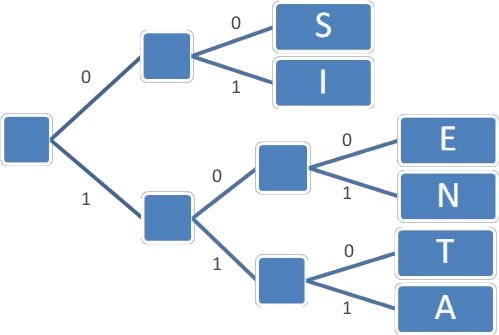
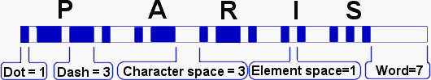
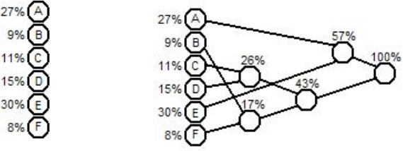
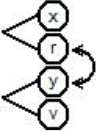
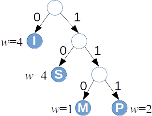
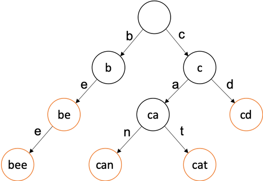

# &nbsp; 

<hgroup>

<blue>Prefiksu kodi</blue>

</hgroup><hgroup>

<span style="color:darkgreen">**(1) Ievads**</span>  
<span>(2) [Prefiksu kodējumi](#section-1)</span>  
<span>(3) [Kodējuma vidējais garums](#section-2)</span>  
<span>(4) [Hafmana algoritms](#section-3)</span>  
<span>(5) [Hafmana optimalitāte](#section-4)</span>  
<span>(6) [Prefiksu koka attēlošana](#section-5)</span>  
<span>(7) [Hafmana algoritma modifikācijas](#section-6)</span>  
<span>(8) [Kopsavilkums](#section-7)</span>

</hgroup>

<!--
http://eem.eskisehir.edu.tr/ongerek/EEM562/icerik/decodable.pdf
-->


-----

# <lo-why/> why

<div class="bigWhy">
Kāpēc saspiežamas virknes ar dažādiem ziņojumu biežumiem?
</div>

<div class="smallWhy">

* Kā saspiest neatkarīgu ziņojumu virkni ar zināmu varbūtību sadalījumu?

</div>

--

## <lo-theory/> Sasniedzamie rezultāti

1. Definēt prefiksu kodējumu.
2. Pierādīt teorēmu par optimālu prefiksu kodējumu.
3. Lietot un analizēt Hafmana algoritmu.
4. Pamatot Hafmana algoritma optimalitāti.
5. Ieviest prefiksu koka kanonisku un efektīvu pierakstu.
6. Apspriest Hafmana algoritma modifikācijas.
7. Atrast kodējumu vidējos garumus dažos piemēros.

-----

# &nbsp; 

<hgroup>

<blue>Prefiksu kodi</blue>

</hgroup><hgroup>

<span>(1) [Ievads](#section-0)</span>  
<span style="color:darkgreen">**(2) Prefiksu kodējumi**</span>  
<span>(3) [Kodējuma vidējais garums](#section-2)</span>  
<span>(4) [Hafmana algoritms](#section-3)</span>  
<span>(5) [Hafmana optimalitāte](#section-4)</span>  
<span>(6) [Prefiksu koka attēlošana](#section-5)</span>  
<span>(7) [Hafmana algoritma modifikācijas](#section-6)</span>  
<span>(8) [Kopsavilkums](#section-7)</span>

</hgroup>


-----

# <lo-theory/> Mainīga garuma kodi

* Dažāda garuma kodi var palīdzēt ietaupīt vietu. 
Ja visus ziņojumus kodē vienādi gari, tad 
katrs simbols aizņem 
${\displaystyle \left\lceil \log_2 |S| \right\rceil }$ - tas parasti
ir ļoti neoptimāli.
* Ar dažāda garuma kodavārdiem rasties *divdomības* (*ambiguities*). 
Piemēram, ja kodējums ir 
`$$\{(a, \mathtt{1}), (b, \mathtt{01}), (c, \mathtt{101}), (d, \mathtt{011})\},$$`
tad $\mathtt{1011}$ var saprast trīs dažādos veidos:
`$$\mathtt{1.01.1},\;\;\mathtt{1.011},\;\;\mathtt{101.1}.$$`


--

## <lo-theory/> Prefiksu kodējuma jēdziens

<hgroup>

<!-- .element: width="440px" --> 

<blue>*Prefiksu kodējumā*</blue> (*prefix code*) 
neviens kodavārds nav cita kodavārda
prefikss.  
(Faktiski "bezprefiksu" kodējums.)

</hgroup>
<hgroup>

`$$C=\{ (S, \mathtt{00}), (I, \mathtt{01}),$$`
`$$ (E, \mathtt{100}), (N, \mathtt{101}),$$`
`$$ (T, \mathtt{110}), (A, \mathtt{111})\}.$$`

</hgroup>


--

## <lo-sample/> Atkodēšanas piemēri

<hgroup>

* Atkodēt virkni `11100110100`,
* Atkodēt virkni `0001100101111`.

</hgroup>
<hgroup>

<!-- .element: width="440px" --> 

</hgroup>


-----

# <lo-theory/> Vidējais kodējuma garums

Pieņemsim, ka ir zināms varbūtību sadalījums ziņojumu telpā $S$: 
Katram $s \in S$ ir piekārtota 
varbūtība $p(s)$ un $p(s_1)+\ldots+p(s_n)=1$.

**Definīcija:** Par kodējuma $C = \{(s_1,w_1),\ldots,(s_n,w_n)\}$ 
<blue>*vidējo garumu*</blue> (*average length*) sauksim summu:
`$$\ell_a(C) = \sum\limits_{(s,w) \in C} p(s)\ell(w),$$`
kur $\ell(w)$ apzīmē kodavārda $w$ garumu bitos. 


--

## <lo-theory/> Optimāls prefiksu kodējums

**Definīcija:** Teiksim, ka prefiksu kods $C$ ir <blue>*optimāls*</blue>
prefiksu kods, ja tā $\ell_a(C)$ ir minimāls. Citiem vārdiem, ja 
dotajam ziņojumu varbūtību sadalījumam neeksistē cits prefiksu 
kods, kam vidējais garums ir vēl zemāks.


--

## <lo-yellow> Morzes kods

* Morzes kods izmanto mainīga garuma kodēšanas principus (biežākiem 
simboliem atbilst īsāki kodavārdi). 
* Attiecībā uz svītriņām un punktiņiem tas **nav** prefiksu kods. 
Atkodēšanas viennozīmību nodrošina atšķirīgās pauzes.


<!-- .element: width="700px" --> 

Sk. [Morse structure and timing](http://www.nu-ware.com/NuCode%20Help/index.html?morse_code_structure_and_timing_.htm)


-----

# &nbsp; 

<hgroup>

<blue>Prefiksu kodi</blue>

</hgroup><hgroup>

<span>(1) [Ievads](#section-0)</span>  
<span>(2) [Prefiksu kodējumi](#section-1)</span>  
<span style="color:darkgreen">**(3) Kodējuma vidējais garums**</span>  
<span>(4) [Hafmana algoritms](#section-3)</span>  
<span>(5) [Hafmana optimalitāte](#section-4)</span>  
<span>(6) [Prefiksu koka attēlošana](#section-5)</span>  
<span>(7) [Hafmana algoritma modifikācijas](#section-6)</span>  
<span>(8) [Kopsavilkums](#section-7)</span>

</hgroup>


-----


# <lo-theory/> T1: Kodējuma garuma novērtējums

**Teorēma 1:**  
Katrai ziņojumu kopai $S$ ar zināmu varbūtību sadalījumu un 
viennozīmīgi atkodējamu kodējumu $C$ ir spēkā nevienādība:
$$H(S) \leq l_a(C).$$

--

## <lo-theory/> Intuīcija par Šenona apgalvojumu

Sūtot ziņojumu $x$ no 
alfabēta $S$, <emblue>informācijas saturs</emblue> (*information content*) 
$h(x)$ ir ieteicamais bitu skaits.

**Intuīcija:** Ja ziņojumiem $x_i$ atbilst varbūtības
$p_i$, tad katrs no tiem aizņem kaut gabalu no 
"kodu telpas". Piemēram, izmantojot kodēšanai $4$ bitus, esam aizņēmuši
$1/16$ no kodu telpas.


--

## <lo-summary/> Pierādījums ar nevienādību ķēdīti

<div style="font-size:90%">
$$H(S) − \ell_a(C) = \sum\limits_{s \in S} p(s)  \log_2 \frac{1}{p(s)} - 
\sum\limits_{s \in S} p(s)\ell(s) =$$
$$= \sum\limits_{s \in S} p(s) \left( \log_2 \frac{1}{p(s)} - \log_2 2^{\ell(s)} \right) = $$
$$=\sum\limits_{s \in S} p(s) \log_2 \frac{ 2^{-\ell(s)}}{p(s)} \leq 
\log_2 \sum_{s \in S} 2^{-\ell(s)} \leq 0.$$

$\blacksquare$
</div>

--

## <lo-yellow/> Pēdējais pārveidojums ķēdītē

Atgādinām $\ell$ definīciju:
Katram ziņojumam $s_i \in S$ ar $\ell(s_i)$ apzīmējam $s_i$ kodavārda $w_i$ garumu 
kodējumā $C$, t.i. $(s_i,w_i) \in C$. 

Kādēļ ir spēkā nevienādība?
$$\sum\limits_{s \in S} p(s) \log_2 \frac{ 2^{-\ell(s)}}{p(s)} \leq 
\log_2 \sum_{s \in S} 2^{-\ell(s)}$$

--

## <lo-yellow/> Jensena nevienādība

**Jensena nevienādība:** Dota `$f(x)$` divreiz nepārtraukti diferencējama
funkcija intervālā `$[a;b]$` un šajā intervālā `$f''(x) \leq 0$`, t.i. 
$f(x)$ grafiks ir izliekts uz augšu. 
Doti arī $n$ skaitļi `$x_1,x_2,\ldots,x_n \in [a;b]$` un 
svari `$p_1,p_2,\ldots,p_n$`, kuru summa ir $1$. Tad ir spēkā nevienādība:

`$$p_1f(x_1) + p_2f(x_2) + \ldots + p_nf(x_n) \leq f \left( p_1x_1 + \ldots p_nx_n \right).$$`


------

# <lo-theory/> Krafta-Makmilana nevienādība

**Teorēma 2:** (*Kraft-McMillan Inequality*)  
Ja ir <emblue>viennozīmīgi atkodējams kods</emblue> 
(*Uniquely decodable code*) $C = \{ (x_1,w_1),\ldots,(x_n,w_n)\}$, tad
`$$\sum\limits_{(x_i,w_i) \in C} 2^{-\ell(w_i)} \leq 1.$$`

Un otrādi: Ja ir doti vairāki kodējumu garumi $l_i$, kas
apmierina `$\sum 2^{-l_i} \leq 1$`, tad no tiem var uzbūvēt
prefiksu koku, kur katram garumam $l_i$ atbilst lapa šajā kokā, kuras
dziļums ir tieši $l_i$. 

--

## <lo-theory/> Kā pamatot Krafta-Makmilana teorēmu?

**Pierādījums:**  
Vispārīgiem "uniquely decodable codes" pierādīt piņķerīgi.

<emblue>Prefiksu kodiem</emblue> (*prefix-free codes*) ievērojam, ka ikviens
$k_i$-bitu kods aizpilda prefiksu kokā (sauktā arī par "kodu telpu") 
tieši `$\frac{1}{2^{k_i}}$` daļu no tilpuma. 

Dažādu kodu veidotie "tilpumi" nevar daļēji šķelties. Un tā kā 
neviens nav prefikss otram, neviens nevar būt pilnīgi otra iekšpusē.
Pilnās kodu telpas tilpums ir $1$, tādēļ summa 
visiem $2^{-k_i}$, kur $k_i = \ell(w_i)$ nepārsniedz $1$.  
$\blacksquare$


-----


# <lo-theory/> Optimāla kodējuma garums


**Teorēma 3:** Katrai ziņojumu kopai $S$ ar zināmu varbūtību sadalījumu 
un optimālu prefiksu kodējumu $C$:
$$\ell_a(C) \leq H(S) + 1.$$

**Sekas:** Tā kā Hafmana algoritms rada optimālo
(vai vienu no optimālajiem) prefiksu kodējumu (sk. Teorēmu 4), tad 
arī Hafmana kodējumam $C^{\ast}$ ir spēkā: 
$$\ell_a(C^{\ast}) \leq H(S) + 1.$$

--

## <lo-theory/> Optimāla kodējuma garums - 2

**Pierādījums:** Katram ievades ziņojumam/simbolam $s \in S$ 
izvēlamies 
${\displaystyle \ell(s) = \left\lceil \log_2 \frac{1}{p(s)} \right\rceil}$. Tādā gadījumā:
$$\sum\limits_{s \in S} 2^{-\ell(s)} = \sum\limits_{s \in S} 
2^{-\left\lceil \log_2 \frac{1}{p(s)} \right\rceil} \leq$$
$$\sum\limits_{s \in S} 2^{- \log_2 \frac{1}{p(s)}} = \sum\limits_{s \in S} p(s) = 1.$$

--

## <lo-theory/> Optimāla kodējuma garums - 3

Pēc Krafta-Makmilana teorēmas (pretējā virziena) varam 
atrast tādu prefiksu kodu $C'$, kam ir tieši šādi kodavārdu garumi. 
Vidējā garuma $\ell_{avg}(C')$ novērtējums:
$$\ell_{avg}(C') = \sum\limits_{s \in S} p(s) \cdot \left\lceil \log_2 \frac{1}{p(s)} \right\rceil \leq $$
$$\leq \sum\limits_{s \in S} p(s)\left( 1 + \log_2 \frac{1}{p(s)} \right) = $$
$$ = 1 + H(S).$$

--

## <lo-theory/> Optimāla kodējuma garums - 4

Optimālajam prefiksu kodam $C$ jābūt vismaz tikpat labam kā nupat piedāvātais $C'$. 
Tādēļ arī tam būs novērtējums:
$$\ell_{avg}(C) \leq \ell_{avg}(C') \leq 1 + H(S).$$  
$\blacksquare$


-----


# &nbsp; 

<hgroup>

<blue>Prefiksu kodi</blue>

</hgroup><hgroup>

<span>(1) [Ievads](#section-0)</span>  
<span>(2) [Prefiksu kodējumi](#section-1)</span>  
<span>(3) [Kodējuma vidējais garums](#section-2)</span>  
<span style="color:darkgreen">**(4) Hafmana algoritms**</span>  
<span>(5) [Hafmana optimalitāte](#section-4)</span>  
<span>(6) [Prefiksu koka attēlošana](#section-5)</span>  
<span>(7) [Hafmana algoritma modifikācijas](#section-6)</span>  
<span>(8) [Kopsavilkums](#section-7)</span>

</hgroup>


-----

# <lo-theory/> Hafmana algoritms

**Ievade:** Burti (ziņojumi) ar dotām varbūtībām.  
**Izvade:** Prefiksu koks šo burtu/ziņojumu attēlošanai ar prefiksu kodējumu.

<!-- .element: width="700px" --> 

Hafmana algoritms atbilst <blue>*rijīgo*</blue> (*greedy*) algoritmu 
paradigmai - "lokāla" optimizēšana šoreiz noved pie globāli optimāla
risinājuma.


--

## <lo-theory/> Hafmana pseidokods

<table class="pseudocode">
<tr><th style="font-variant: small-caps;" colspan="2">Huffman($S$)</th></tr>
<tr>
<td>1</td>
<td>$n = |S|$&nbsp;&nbsp;<green>// elementu skaits</green></td>
</tr>
<tr>
<td>2</td>
<td>$Q = S$&nbsp;&nbsp;<green>// Q - min-prioritāšu kaudze</green></td>
</tr>
<tr>
<td>3</td>
<td><b>for</b> $i=1$ <b>to</b> $n-1$</td>
</tr>
<tr>
<td>4</td>
<td class="ind1">allocate a new node $z$</td>
</tr>
<tr>
<td>5</td>
<td class="ind1">$z.\mathit{left}=x=$<span style="font-variant: small-caps;">ExtractMin($Q$)</span></td>
</tr>
<tr>
<td>6</td>
<td class="ind1">$z.\mathit{right}=y=$<span style="font-variant: small-caps;">ExtractMin($Q$)</span></td>
</tr>
<tr>
<td>7</td>
<td class="ind1">$z.\mathit{freq} = x.\mathit{freq} + y.\mathit{freq}$</td>
</tr>
<tr>
<td>8</td>
<td class="ind1"><span style="font-variant: small-caps;">Insert($Q$,$z$)</span></td>
</tr>
<tr>
<td>9</td>
<td><b>return</b> <span style="font-variant: small-caps;">ExtractMin($Q$)</span></td>
</tr>
</table>

Note:
(Cormen2009, p.431)

--

## <lo-theory/> Algoritma sarežģītība


* <span style="font-variant: small-caps;">ExtractMin($Q$)</span> 
minimuma prioritāšu kaudzē vajag $O(\log n)$.
* <span style="font-variant: small-caps;">Insert($Q$,$z$)</span> laiks arī ir $O(\log n)$.
* <span style="font-variant: small-caps;">Huffman($S$)</span> laiks ir $O(n \log n)$.


--

## <lo-theory/> Kā atspiest Hafmana kodējumu

[Kanoniskais Hafmana kodējums](https://en.wikipedia.org/wiki/Canonical_Huffman_code)

* **A1** Vispirms sakārto pēc kodavārda garuma; ja vienādi kodavārdi, tad pēc alfabēta.
* **A2** Īsākiem kodavārdiem piekārto nulli, garākiem - vieninieku.

```
B = 0     (1 bits)
A = 10    (2 biti)
C = 110   (3 biti)
D = 111   (3 biti)
```

Ja kodētājs un saņēmējs zina, ka lietots **sakārtots** ziņojumu alfabēts $S=\{ A,B,C,D \}$, 
tad pietiek paziņot attiecīgo burtu kodavārdu garumus: $2, 1, 3, 3$.


--

## <lo-yellow/> Daži Hafmana algoritma lietojumi

* PKZIP (Phil Katz) arhivators - PKZIP 2.04g un jaunāki standarti, 
kuri lieto `DEFLATE` saspiešanas standartu 
(tas pats, kas populārie Zip failu formāti mūsdienās). 
* [RFC 7541 - HPACK: Header Compression for HTTP/2](https://tools.ietf.org/html/rfc7541)
Hederu saspiešana HTTP/2 protokolam (RFC 7540), ko lieto kopš 2015.g.


-----


# &nbsp; 

<hgroup>

<blue>Prefiksu kodi</blue>

</hgroup><hgroup>

<span>(1) [Ievads](#section-0)</span>  
<span>(2) [Prefiksu kodējumi](#section-1)</span>  
<span>(3) [Kodējuma vidējais garums](#section-2)</span>  
<span>(4) [Hafmana algoritms](#section-3)</span>  
<span style="color:darkgreen">**(5) Hafmana optimalitāte**</span>  
<span>(6) [Prefiksu koka attēlošana](#section-5)</span>  
<span>(7) [Hafmana algoritma modifikācijas](#section-6)</span>  
<span>(8) [Kopsavilkums](#section-7)</span>

</hgroup>


-----

# <lo-theory/> Hafmana koka optimalitāte

<hgroup>

**Teorēma 4:** Hafmana algoritms ģenerē optimālu bināro prefiksu koku 
ziņojumu kopai $S$ pie dotā varbūtību sadalījuma. 

</hgroup><hgroup>

Starp visiem kodējumiem $C$, kur ziņojumiem $s \in S$ 
kaut kā piešķir bezprefiksu kodus $w_s$, 
vid. garums 
`$$\ell_a(C) = \sum\limits_{(s,w_s) \in C} p(s)\ell(w_s)$$`
Hafmana koka aprakstītajā kodējumā $C^{\ast}$ būs vismazākais
(vai viens no vismazākajiem).

</hgroup>

--

## <lo-theory/> Optimalitātes pierādījums - 1

**Bāze:** Ja ziņojumu alfabētā $S$ ir $1$ burts. Tad ir tikai viens koks, 
kas ir gan optimālais, gan Hafmana koks.

**Indukcijas pāreja:** Ja ir vismaz divi burti.
Pieņemam, ka Hafmana algoritms vienmēr dod optimālu koku pie $k-1$ burtiem.  
Tagad dots alfabēts $S$ ar $k$ burtiem, kur
$x$ un $y$ ir divi visretāk sastopamie burti.


--

## <lo-theory/> Optimalitātes pierādījums - 2

Pirmajā solī Hafmana algoritms apvieno virsotnes $x$ un $y$. 
Izveidojas jauna virsotne, kuras
biežums ir $p(x) + p(y)$. Tālāk ir jāpielieto Hafmana algoritms $k-1$ burtam.

Pēc indukcijas pieņēmuma Hafmana algoritms $k-1$ burtam dod optimālo koku. 
Tas nozīmē, ka Hafmana
algoritms dod optimālo koku starp tiem kokiem, kuros $x$ un $y$ atrodas
blakus.

Varbūt ir vēl optimālāks koks, kur $x$ un $y$ neatrodas blakus?

--

## <lo-theory/> Optimalitātes pierādījums - 3

Pamatosim, ka citus kokus var pārveidot par 
kokiem, kuri ir vismaz tikpat optimāli, turklāt $x$ un $y$ ir blakus.

Optimālā kokā izpildās 2 apgalvojumi:

1. Ja $p(x) < p(y)$, tad $\ell_x \geq \ell_y$ (citādi varētu apmainīt $x$ un $y$ vietām kokā
un kodējuma garums no tā samazinātos.) 
2. Apskatīsim maksimālo kodavārda garumu jeb prefiksu koka dziļumu ar $\ell_{\text{max}}$.
Tad ir divi tādi burti $u$, $v$, kuriem $\ell_u = \ell_v = \ell_{\text{max}}$.
(Vispirms atrodam maksimāli dziļu $u$. Ja blakus nebūtu šķautnes uz $v$,
tad varētu saīsināt $u$ kodējumu par vienu šķautni.)

--

## <lo-theory/> Optimalitātes pierādījums - 4

<hgroup>

Doti $x,y$ – 2 visretāk sastopamie burti, bet $u,v$ - visdziļāk prefiksu kokā esošie kaimiņi.

* Abi $x,y$ ir tikpat dziļi kokā kā maksimāli dziļās virsotnes $u$ un $v$ (citādi koku varētu uzlabot). 
* Apmainot $x$ ar $u$, bet $y$ ar $v$, no jebkura optimāla koka var
iegūt citu optimālu koku, kuram $x$ un $y$ ir blakus.

</hgroup>
<hgroup>

<!-- .element: width="250px" --> 


</hgroup>


-----

# <lo-quiz/> Jautājums Nr.3

<hgroup>

Kāds ir Hafmana kodējuma vidējais garums, ja ar to 
kodē burtu virknīti <blue>`MISSISSIPPI`</blue>.
Atbildi noapaļot
līdz diviem cipariem aiz komata. 

</hgroup>
<hgroup>

Ierakstīt skaitli formātā <red>`d.dd`</red>: _____

</hgroup>


<!--

## <lo-quiz/> Jautājums Nr.3: Atrisinājums

<hgroup>



<table>
<tr><th>$a \in S$</th><th>$w(a)$</th><th>$\ell_a$</th><th>$p(a)$</th></tr>
<tr><td>I</td><td>`0`</td><td>1</td><td>$4/11$</td></tr>
<tr><td>S</td><td>`10`</td><td>2</td><td>$4/11$</td></tr>
<tr><td>M</td><td>`110`</td><td>3</td><td>$1/11$</td></tr>
<tr><td>P</td><td>`111`</td><td>3</td><td>$2/11$</td></tr>
</table>

</hgroup>
<hgroup>

Burtu $I,S,M,P$ kodējumu garumi ir attiecīgi $1,2,3,3$ biti. 
Piereizinām ar attiecīgo burtu varbūtībām 
(to relatīvajiem biežumiem vārdā <blue>`MISSISSIPPI`</blue>).

`$$1\frac{4}{11} + 2\frac{4}{11} + 3\frac{2}{11}+$$`
`$$+ 3\frac{1}{11} = \frac{21}{11} \approx 1.91.$$`

</hgroup>
-->


--

# <lo-quiz/> Jautājums Nr.4

<hgroup>

Kāds būtu kodējuma vidējais garums, ja vārdā <blue>`MISSISSIPPI`</blue>
katru no četriem burtiem kodētu šādi:
`$$C = \{(I,\mathtt{00}),(M,\mathtt{01}),$$`
`$$(P,\mathtt{10}),(S,\mathtt{11})\}.$$`
Atbildi noapaļot
līdz diviem cipariem aiz komata. 

</hgroup>
<hgroup>

Ierakstīt skaitli formātā <red>`d.dd`</red>: _____

</hgroup>

<!--
## <lo-quiz/> Jautājums Nr.4: Atrisinājums

Pat neko nerēķinot, redzams, ka ikviena simbola kodējuma
garums ir $2$, tātad arī vidējais kodējuma garums būs 
svērts vidējais starp visiem šiem divniekiem:

`$$p(M)\cdot 2 + p(I)\cdot 2 + p(S)\cdot 2 + p(P)\cdot 2 =$$`
`$$(1/11)\cdot 2 + (4/11)\cdot 2 + (4/11)\cdot 2 + (2/11)\cdot 2 = 2.$$`
-->


-----


# &nbsp; 

<hgroup>

<blue>Prefiksu kodi</blue>

</hgroup><hgroup>

<span>(1) [Ievads](#section-0)</span>  
<span>(2) [Prefiksu kodējumi](#section-1)</span>  
<span style="color:darkgreen">(3) [Kodējuma vidējais garums](#section-2)</span>  
<span>(4) [Hafmana algoritms](#section-3)</span>  
<span>(5) [Hafmana optimalitāte](#section-4)</span>  
<span style="color:darkgreen">**(6) Prefiksu koka attēlošana**</span>  
<span>(7) [Hafmana algoritma modifikācijas](#section-6)</span>  
<span>(8) [Kopsavilkums](#section-7)</span>

</hgroup>


-----

# <lo-theory/> Problēma: Kā pārsūta pašu koku?

* Saspiešanas algoritmi izmanto simetrisku
<emblue>kodējuma tabulu</emblue> (*codebook*); prefiksu kodiem var iztēloties kā koku.
* Ja ziņojumu biežumi ir zināmi jau iepriekš, koku var 
vienreiz izveidot un ikreiz nesūtīt.
* Biežāk ziņojumu biežumi ir empīriski jānoskaidro pārsūtāmajos datos.

Saspiežot īsu ziņojumu virkni (pietiekami lielā alfabētā) pati kodējuma tabula 
var aizņemt ievērojamu vietu.


--

# <lo-theory/> Kanoniskais Hafmana kods

[Kanonisks Hafmana kods](https://en.wikipedia.org/wiki/Canonical_Huffman_code)


-----


# &nbsp; 

<hgroup>

<blue>Prefiksu kodi</blue>

</hgroup><hgroup>

<span>(1) [Ievads](#section-0)</span>  
<span>(2) [Prefiksu kodējumi](#section-1)</span>  
<span>(3) [Kodējuma vidējais garums](#section-2)</span>  
<span>(4) [Hafmana algoritms](#section-3)</span>  
<span>(5) [Hafmana optimalitāte](#section-4)</span>  
<span>(6) [Prefiksu koka attēlošana](#section-5)</span>  
<span style="color:darkgreen">**(7) Hafmana algoritma modifikācijas**</span>  
<span>(8) [Kopsavilkums](#section-7)</span>

</hgroup>

-----


# <lo-theory/> Simbolu grupēšana

**Piemērs:** Negodīgās monētas alfabēts $S = \{ A,B \}$ ar varbūtībām
$p(A) = 0.9$ un $p(B) = 0.1$.

* Kodējot pa vienam simbolam, iegūstam vidējo koda garumu $\ell_a(C) = 1$, 
kaut arī entropija $H(S) = 0.4689956$. 

* Kodējot pa diviem simboliem: $T = \{ AA,AB,BA,BB \}$ ar 
varbūtībām $\{ 0.81, 0.09, 0.09,0.01 \}$, vidējais koda garums Hafmana
kodam ir 
$$\ell_a(C_2) = 1 \cdot 0.81 + 2\cdot 0.09 + 3\cdot 0.09 + 3 \cdot 0.01 = 1.29/2 = 0.645.$$


--

## <lo-theory/> Prediktīva kodēšana

* Parasti nevajag aplūkot pilnu Dekarta reizinājumu $S \times S$, ko 
veido **visi** iespējamie simbolu pārīši $(s_i,s_j)$, jo ne katri 
divi (vai trīs, četri, utt.) simboli mēdz atrasties blakus.
* Visu simbolu pāru kodēšana ir laba blēdīgajām monētām
(un to radītajai Bernulli eksperimentu virknei, kur 1 eksperimenta
sadalījums ir $\{ p, 1-p \}$). 
* Pirmais tuvinājums reāliem tekstiem ir *Markova ķēdes* (nākamā 
simbola varbūtības sadalījumu nosaka iepriekšējais simbols). 

--

## <lo-theory/>  "Trie" koki

<hgroup>

<!-- .element: width="400px" -->

"Trie" ir koks, kura virsotnēs glabājas
simbolu virknes. Bērnu virsotnēs
virknes ir par vienu garākas nekā vecākiem.

</hgroup>
<hgroup>

* PPM (*Prediction by Partial Matching*) ir saspiešanas algoritmu 
paveids, kas garam tekstam izmanto iepriekšējos $k$ simbolus, lai 
noteiktu nosacīto varbūtību nākamajam simbolam. 
* Dabīgas valodas tekstus var saspiest ļoti labi, 
bet šie algoritmi parasti izveido milzīgas datu struktūras.

</hgroup>

-----


# &nbsp; 

<hgroup>

<blue>Prefiksu kodi</blue>

</hgroup><hgroup>

<span>(1) [Ievads](#section-0)</span>  
<span>(2) [Prefiksu kodējumi](#section-1)</span>  
<span>(3) [Kodējuma vidējais garums](#section-2)</span>  
<span>(4) [Hafmana algoritms](#section-3)</span>  
<span>(5) [Hafmana optimalitāte](#section-4)</span>  
<span>(6) [Prefiksu koka attēlošana](#section-5)</span>  
<span>(7) [Hafmana algoritma modifikācijas](#section-6)</span>  
<span style="color:darkgreen">**(8) Kopsavilkums**</span>

</hgroup>


-----

# <lo-theory/> Ko darījām šajā nodarbībā?

1. Aprakstījām prefiksu kokus
2. Aprakstījām un analizējām Hafmana algoritmu
3. Definējām un lietojām entropiju kā "visvairāk saspiestās" 
informācijas garumu.


