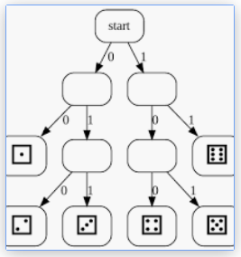

# &nbsp;

<hgroup>

<blue>Aritmētiskie kodi</blue>

</hgroup><hgroup>

**(1) Ievads**  
(2) [Pamatjēdzieni](#section-1)  
(3) [Aritmētiskā saspiešana](#section-2)  
(4) [Veselo skaitļu algoritms](#section-3)  
(5) [Aritmētiskā atspiešana](#section-4)  
(6) [Ātrdarbības novērtējumi](#section-5)  
(7) [Aritmētiskā koda varianti](#section-6)  
(8) [Kopsavilkums](#section-7)  

<small style="font-size:70%; font-style:italic">Veidots sadarbībā ar Anniju V.  
(RBS, 2020.g.)</small>

</hgroup>

<!--
https://en.wikipedia.org/wiki/Asymmetric_numeral_systems

Aplūkot šīs ANS kā iespēju paātrināt saspiešanu "entropijas kodiem"

--> 

Note:
https://web.mat.upc.edu/sebastia.xambo/CDI15/CDI15-04-ArithmeticCoding.pdf

-----

# <lo-why/> why

Kāpēc (nav) jāspiež simboli pa vienam? 

* Ar ko aritmētiskā koda izejas entropija atšķiras no 
Hafmana koda izejas entropijas?

--

 
## <lo-theory/> Sasniedzamie rezultāti

1. Saprast un lietot aritmētiskās saspiešanas algoritmu. 

-----

# &nbsp;

<hgroup>

<blue>Aritmētiskie kodi</blue>

</hgroup><hgroup>

(1) [Ievads](#section-0)  
**(2) Pamatjēdzieni**  
(3) [Aritmētiskā saspiešana](#section-2)  
(4) [Veselo skaitļu algoritms](#section-3)  
(5) [Aritmētiskā atspiešana](#section-4)  
(6) [Ātrdarbības novērtējumi](#section-5)  
(7) [Aritmētiskā koda varianti](#section-6)  
(8) [Kopsavilkums](#section-7)  

</hgroup>

-----

# <lo-theory/> Mērķis - tuvoties entropijai

<hgroup>

<!-- .element: width="400px" -->  
Bezzudumu saspiešanā atspiestais vienāds ar sākotnējo.

</hgroup>
<hgroup style="font-size:70%">

Saspiešanu nosaka divi komponenti:

* <emblue>iekodēšanas algoritms</emblue> (*encoding algorithm*) saņem ieejā 
ziņojumu un izveido "saspiestu" attēlu (veiksmes gadījumā - tajā ir mazāk bitu).
* <emblue>atkodēšanas algoritms</emblue> (*decoding algorithm*) atjauno sākotnējo 
ziņojumu (vai tā tuvinājumu) no saspiestā attēla. 

Aritmētiskā koda gadījumā abi algoritmi atšķiras (nav tik viegli kā 
prefiksu kodējuma tabula).

</hgroup>

--

## <lo-sample/> Metamais kauliņš: Neoptimāls piemērs

<hgroup>

<!-- .element: width="400px" -->

</hgroup>
<hgroup style="font-size:70%">

Alise grib nosūtīt Bobam $1000$ (godīga) metamā kauliņa rezultātus.
Prefiksu kodējumam reizēm vajag $2$, reizēm $3$ bitus.

* `00` = dice roll $1$,
* `010` = dice roll $2$,
* `011` = dice roll $3$,
* `100` = dice roll $4$,
* `101` = dice roll $5$,
* `11` = dice roll $6$.

`$$\ell_a(C) = 2 \cdot \left(\frac{1}{6} \cdot 2\right) + 4 \cdot \left(\frac{1}{6} \cdot 3\right) = 2.666\ldots$$`

</hgroup>

Note:
To send $1000$ dice rolls with Huffman code, Alice expects to send about 
$2667$ bits. Slightly less, if she rolls more 1s and 6s, 
but slightly more, if she rolls more than the average of 2s, 3s, 4s and 5s.

--

## <lo-sample/> Cerība uz samazinājumu no 2667 uz 2585

Entropija (vidējais informācijas saturs) vienā kauliņa metienā ir ap $2.585$.

`$$H = \sum\limits_{s \in S} p(s) \cdot \left( - \log_2 p(s) \right) = $$`
`$$ = 6 \cdot \left( \frac{1}{6} \cdot \left( - \log_2\,\frac{1}{6} \right) \right) \approx 2.584963.$$`

Prefiksu kodi to nevar atrisināt, jo nevar nosūtīt $2.585$ bitus.

Note:
But in this situation Alice has to behave in a more sophisticated way – 
every time there is a dice roll, she constructs a six-times shorter interval 
(as described by the arithmetic encoding). And only at the very end, 
she encodes the resulting (very-very short interval) as a sequence of bits. 

--

## <lo-summary/> Līdzīga situācija ar burtiem

<!-- .element: width="800px" --> 

Aritmētiskais kods palīdz ietaupīt vietu tur, kur simbolu ir nedaudz, 
to varbūtības stipri atšķiras; toties garāku gabalu atkārtošanās nav novērojama.  

Note: 
Dabīgo valodu burtu sadalījums parasti nav labākais piemērs, jo tie mēdz parādīties
prognozējamās virknītēs, atsevišķa simbolu kodēšana (gan ar Hafmana, gan aritmētisko kodējumu)
parasti ir neoptimāla.  
[Burtu biežumi](http://pi.math.cornell.edu/~mec/2003-2004/cryptography/subs/frequencies.html)

--

## <lo-theory/> Aritmētiskā saspiešana

* Kāpēc lietot aritmētisko kodēšanu? 
* Ja ziņojumu telpā ir jocīgas varbūtības, tad Hafmana kodi (kas dala
kodu telpas "nekustamo īpašumu" gabalos pa $1/2$, $1/4$ utt.)
iznieko daudz vietas. 
* Neizmantojam to, ka dažu ziņojumu informācijas saturs 
ir daudz mazāks par $1$. 

**Jautājums:** Kā nosūtīt informācijas saturu, kas ir 0.4 biti?  
**Aritmētiskās saspiešanas ideja:** Griežam kodu telpu tādos gabalos, kā mums vajag
(un bitos iekodējam tikai pašās beigās).

-----

# &nbsp;

<hgroup>

<blue>Aritmētiskie kodi</blue>

</hgroup><hgroup>

(1) [Ievads](#section-0)  
(2) [Pamatjēdzieni](#section-1)  
(3) [Aritmētiskā saspiešana](#section-2)  
(4) [Veselo skaitļu algoritms](#section-3)  
(5) [Aritmētiskā atspiešana](#section-4)  
(6) [Ātrdarbības novērtējumi](#section-5)  
(7) [Aritmētiskā koda varianti](#section-6)  
(8) [Kopsavilkums](#section-7)  

</hgroup>

-----

# <lo-theory/> Algoritma apraksts

**Ievade:** Alfabēts un tā varbūtību sadalījums. Ziņojumu virkne šajā alfabētā.   
**Izvade:** Intervāls $I \subseteq [0;1]$ (pietiek nosūtīt skaitli no šī 
intervāla). 

* Ir $m$ ziņojumi $\{ 1,\ldots,m \}$. To varbūtības
ir $\{p(1),\ldots , p(m)\}$, kuru summa ir $1$. 
* Apzīmējam *kumulatīvās varbūtības*: 
`$$f(j) = \sum\limits_{i=1}^{j-1} p(i),\;\;j=1,\ldots,m.$$`

--

## <lo-summary/> Pirmais intervāls

Dota ziņojumu virkne $x_1,x_2,\ldots,x_k \in \{ 1,\ldots,m \}$.  
Veidojam intervālu virkni: 
$$[0;1] \supset [l_1;l_1+s_1) \supset [l_2;l_2+s_2) \supset \ldots \supset [l_k; l_k+s_k).$$

1.intervāls: $[l_1;l_1 + s_1) = \left[ f(x_1);p(x_1) \right)$.  
Intervāliem $2,\ldots,k$ apzīmējam:  
`$$\left\{
\begin{array}{l}
l_i = l_{i-1} + f(x_i) \cdot s_{i-1}\\
s_i = s_{i-1} \cdot p(x_i)
\end{array} \right.$$`

--

## <lo-theory/> Piemērs

<hgroup>

<!-- .element: width="400px" -->

</hgroup>

<hgroup style="font-size:70%"> 

* Alfabētā ir 3 burti $a,b,c$. Varbūtības ir attiecīgi $0.2, 0.5, 0.3$
(entropija viena burta nosūtīšanai būs $1.485475$)
* Piemērā parādīts, ka <blue>`babc`</blue> atbilst intervāls $[.255, .27)$.
* Galīga bināra daļa šajā intervālā: 
<red>`.0100001`</red> jeb $[33/128,34/128) \subseteq [.255, .27)$.
* $4$ ziņojumu virknītes nosūtīšanai iztērējām $7$ bitus
(vidēji $1.75$ biti uz vienu ziņojumu).

**Jautājums:** Vai robežā nosūtīto bitu daudzums pret ziņojuma garumu tieksies uz 
entropiju $1.485475$. Kāpēc?

</hgroup>

--

## <lo-theory/> Intervālu nosūtīšana

* Ja dots intervāls ar garumu $s$, tad tā iekšienē 
var atrast skaitli, kura binārajā pierakstā ir 
ne vairāk kā $-\left\lceil \log_2 s \right\rceil$ biti.
* Gribam sūtīt tikai vienu skaitli. Lai saprastu, cik garš ir 
tā intervāls, interpretējam, teiksim $.010$ nevis vienkārši 
kā $1/4$, bet kā intervālu $[1/4, 3/8)$. 
* Nepazaudējot vairāk kā 1-2 bitus, varam izveidot šādu 
intervālu $[k/2^n,(k+1)/2^n)$, kurš atradīsies stingri iekšpusē 
tam $I$, ko dod aritmētiskais kods.

--

## <lo-theory/> Aritmētiskā koda īpatnības

* Aritmētiskā koda algoritmus jābūvē vai nu relatīvi nelielām ziņojumu 
kopām (kur mums pietiek ar floating aritmētiku), vai arī
jāizveido tuvinājums, kur reālos skaitļus tuvina ar veseliem skaitļiem. 

Sk arī 21.lpp. no teksta
[G.Blelloch. Introduction to Data Compression](https://www.cs.cmu.edu/~guyb/realworld/compression.pdf) 
- ar veseliem skaitļiem tuvināts aritmētiskās kodēšanas algoritms.

-----

# <lo-sample/> Iekodēšanas piemērs

Sūtām stringu $\color{#00F}{\mathtt{GACGU\$}}$, kur simboli 
$\color{#00F}{\mathtt{A}}$,$\color{#00F}{\mathtt{C}}$,$\color{#00F}{\mathtt{G}}$,$\color{#00F}{\mathtt{U}}$ 
ir RNS-virknes nukleobāzes, 
bet $\color{#00F}{\mathtt{\$}}$ apzīmē stringa beigas.  Simbolu apriorās varbūtības ir šādas:

<table>
<tr><th>$\mathtt{A}$</th><th>$\mathtt{C}$</th><th>$\mathtt{G}$</th><th>$\mathtt{U}$</th><th>$\mathtt{\$}$</th>
<tr><td>30%</td><td>10%</td><td>30%</td><td>20%</td><td>10%</td></tr>
</table>

<!-- .element: width="600px" -->

--

## <lo-sample/> Intervālu aprēķini

* $S_0 = [0.000000; 1.000000]$ atbilst `$\color{#00F}{\mathtt{""}}$` (tukšais strings),
* $S_1 = [0.400000; 0.700000]$ atbilst `$\color{#00F}{\mathtt{G}}$`,
* $S_2 = [0.400000; 0.490000]$ atbilst `$\color{#00F}{\mathtt{GA}}$`,
* $S_3 = [0.427000; 0.436000]$ atbilst `$\color{#00F}{\mathtt{GAC}}$`,
* $S_4 = [0.430600; 0.433300]$ atbilst `$\color{#00F}{\mathtt{GACG}}$`,
* $S_5 = [0.432490; 0.433030]$ atbilst `$\color{#00F}{\mathtt{GACGU}}$`,
* $S_6 = [0.432976; 0.433030]$ atbilst `$\color{#00F}{\mathtt{GACGU\$}}$`.

Bināri pierakstītais skaitlis 
`$$\beta = 0.011011101101100_2 \approx 0.4329834_{10}$$`
pieder intervālam $S_6 = [0.432976; 0.433030]$. 

Kāpēc $\beta$ binārais pieraksts beidzas ar divām nullēm?  
Tieši $15$ cipari aiz komata un `$\left[\beta;\,\beta + \frac{1}{2^{15}}\right] \subseteq S_6$`. 

Note:
Katrai galīgai binārai daļai atbilst $[0;1]$ apakšintervāls.

-----

# &nbsp;

<hgroup>

<blue>Aritmētiskie kodi</blue>

</hgroup><hgroup>

(1) [Ievads](#section-0)  
(2) [Pamatjēdzieni](#section-1)  
(3) [Aritmētiskā saspiešana](#section-2)  
**(4) Veselo skaitļu algoritms**  
(5) [Aritmētiskā atspiešana](#section-4)  
(6) [Ātrdarbības novērtējumi](#section-5)  
(7) [Aritmētiskā koda varianti](#section-6)  
(8) [Kopsavilkums](#section-7)  

</hgroup>

-----

# &nbsp;

<hgroup>

<blue>Aritmētiskie kodi</blue>

</hgroup><hgroup>

(1) [Ievads](#section-0)  
(2) [Pamatjēdzieni](#section-1)  
(3) [Aritmētiskā saspiešana](#section-2)  
(4) [Veselo skaitļu algoritms](#section-3)  
**(5) Aritmētiskā atspiešana  
(6) [Ātrdarbības novērtējumi](#section-5)  
(7) [Aritmētiskā koda varianti](#section-6)  
(8) [Kopsavilkums](#section-7)  

</hgroup>

Note:
PSEUDO_EOF - Hafmana kods var beigties baita vidū. 
Parasti pievieno īpašu simbolu (teksta beigu marķieri), 
lai saprastu, kad atkodēšana jāpārtrauc. 

Ar aritmētisko kodu ir līdzīgs stāsts: beigu marķieris nozīmē to, 
ka viens atkodējamais strings nevar būt cita stringa prefikss.
https://web.stanford.edu/class/archive/cs/cs106b/cs106b.1172/assn/huffman.html

-----

# <lo-theory/> Atspiešanā izmantojamie fakti

* Reālo skaitļu noapaļošana (t.sk. teksta dalīšana blokos, pirms tos aritmētiski iekodē).
* 

Reālu skaitļu aritmētika ir "nekonstruktīva": ja 

-----

# &nbsp;

<hgroup>

<blue>Aritmētiskie kodi</blue>

</hgroup><hgroup>

(1) [Ievads](#section-0)  
(2) [Pamatjēdzieni](#section-1)  
(3) [Aritmētiskā saspiešana](#section-2)  
(4) [Veselo skaitļu algoritms](#section-3)  
(5) [Aritmētiskā atspiešana](#section-4)  
**(6) Ātrdarbības novērtējumi  
(7) [Aritmētiskā koda varianti](#section-6)  
(8) [Kopsavilkums](#section-7)  

</hgroup>

-----

# &nbsp;

<hgroup>

<blue>Aritmētiskie kodi</blue>

</hgroup><hgroup>

(1) [Ievads](#section-0)  
(2) [Pamatjēdzieni](#section-1)  
(3) [Aritmētiskā saspiešana](#section-2)  
(4) [Veselo skaitļu algoritms](#section-3)  
(5) [Aritmētiskā atspiešana](#section-4)  
(6) [Ātrdarbības novērtējumi](#section-5)  
**(7) Aritmētiskā koda varianti**  
(8) [Kopsavilkums](#section-7)  

</hgroup>

-----

# <lo-theory/> JPEG saspiešanas process

JPEG izmanto vairākus bezzudumu saspiešanas posmus:

<!-- .element: width="700px" -->

Note:
Aritmētiskā (arī Hafmana) saspiešana reti parādās kā atsevišķs algoritms; 
parasti tas ir viens no pēdējiem posmiem, lai noēstu līdzšinējos saspiešanas soļos pārpalikušo 
entropiju.

-----

# <lo-theory/> Nosacītās varbūtības modelis

Aritmētisko kodu var uzlabot, ja ņem vērā simbolu parādīšanās
varbūtību atkarību no konteksta (1.kārtas modelis - tikai viens iepriekšējais
simbols). Tad nākamo intervālu dala gabalos atkarībā 
no iepriekšējā simbola.

<!-- .element: width="700px" --> 

Note:
[Bildes par aritmētisko kodēšanu](http://www.ws.binghamton.edu/fowler/fowler%20personal%20page/EE523_files/Ch_04%20Arithmetic%20Coding%20(PPT).pdf)

-----

# <lo-theory/> Asimetriskās skaitīšanas sistēmas

Jaroslaw Duda (2014) pētījumi.  Cīņas par jauniem industrijas standartiem mākoņdatošanā un datu spiešanā.  

1. Facebook Zstandard.
2. Apple LZFSE.
3. Google Draco 3D compressor.

Pagaidām ievērojami ietaupījumi failu izmērā/ātrumā ir vien speciālos gadījumos.  
Būtiski, uz kādas ierīces un kādā situācijā notiek saspiešana/atspiešana. 
(Kešošana, retāka un mazāka tīkla izmantošana. CPU var izmantot drošāk.)

Note:
[Pārskats par asimetriskām skaitīšanas sistēmām](https://en.wikipedia.org/wiki/Asymmetric_numeral_systems)

-----

# &nbsp;

<hgroup>

<blue>Aritmētiskie kodi</blue>

</hgroup><hgroup>

(1) [Ievads](#section-0)  
(2) [Pamatjēdzieni](#section-1)  
(3) [Aritmētiskā saspiešana](#section-2)  
(4) [Veselo skaitļu algoritms](#section-3)  
(5) [Aritmētiskā atspiešana](#section-4)  
(6) [Ātrdarbības novērtējumi](#section-5)  
(7) [Aritmētiskā koda varianti](#section-6)  
**(8) Kopsavilkums**  

</hgroup>

-----

# <lo-theory/> Ko darījām šajā nodarbībā?

1. Lietojām aritmētisko saspiešanu saspiešanai un atspiešanai.

