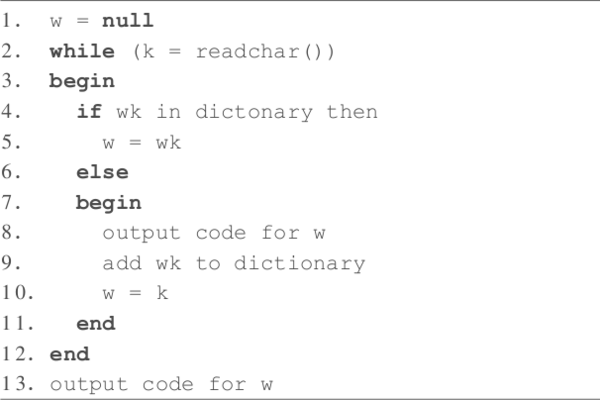

# &nbsp;

<hgroup>

<h1 style="font-size:28pt">Lietišķie algoritmi</h1>

<blue>Bezzudumu saspiešana - 2</blue>

</hgroup><hgroup>

**(1) Ievads**  
(2) [Entropijas atkārtojums](#section-1)  
(3) [Hafmana optimalitāte](#section-2)  
(4) [Hafmana modifikācijas](#section-3)  
(5) [Aritmētiskā saspiešana](#section-4)  
(6) [LZ78 algoritms](#section-5)  
(7) [(P) Proprietāri formāti](#section-6)  
(8) [Kopsavilkums](#section-7)

</hgroup>

<!--
https://en.wikipedia.org/wiki/Asymmetric_numeral_systems

Aplūkot šīs ANS kā iespēju paātrināt saspiešanu "entropijas kodiem"

PSEUDO_EOF - Hafmana kods var beigties baita vidū. Parasti pievieno īpašu simbolu (teksta beigu marķieri), 
lai saprastu, kad atkodēšana jāpārtrauc. 
https://web.stanford.edu/class/archive/cs/cs106b/cs106b.1172/assn/huffman.html

https://stackoverflow.com/questions/40054218/what-if-dictionary-size-in-lzw-algorithm-is-full
--> 

-----

# <lo-why/> why

Kāpēc mainās saspiešanas pieeja, ja ievadē atkārtojas garākas simbolu virknes?

* Kāds ievades datu modelis ir piemērots LZ saimes algoritmiem?
* Kas nodrošina Lempela Ziva algoritmu plašo izmantojumu lietojumprogrammās?

--

 
## <lo-theory/> Sasniedzamie rezultāti

1. Saprast un lietot Lempela-Ziva (LZ78) algoritmu. 

-----

# &nbsp;

<hgroup>

<h1 style="font-size:28pt">Lietišķie algoritmi</h1>

<blue>Bezzudumu saspiešana - 2</blue>

</hgroup><hgroup>

(1) [Ievads](#section)  
(2) [Entropijas atkārtojums](#section-1)  
(3) [Hafmana optimalitāte](#section-2)  
(4) [Hafmana modifikācijas](#section-3)  
(5) [Aritmētiskā saspiešana](#section-4)  
**(6) LZ78 algoritms**  
(7) [(P) Proprietāri formāti](#section-6)  
(8) [Kopsavilkums](#section-7)

</hgroup>

::: notes

https://stackoverflow.com/questions/40054218/what-if-dictionary-size-in-lzw-algorithm-is-full

:::

-----

# <lo-sample/> Piemērs labai saspiešanai ar LZ78

Nejauša pastaiga pa Markova ķēdi ar $3$ stāvokļiem:

$18$ burtu virknīte, sākot ar $A$:  
<blue>`ABCABCBCAAABCABBAB`</blue>

::: notes

sample(1:4,size=17, replace=TRUE)  
[1] 3 3 1 2 3 4 3 2 1 1 4 4 2 3 2 1 4

:::

-----

# <lo-theory> LZ78 iekodēšanas pseidokods

Sākumā vārdnīcā jau atrodas visi simboli. Tad tai pievieno 
garākas virknītes:

--

## <lo-sample/> LZ78 iekodēšanas piemērs

Kodējam augšminēto <blue>`ABCABCBCAAABCABBAB`</blue>

<table>
<tr><th>Solis</th><th>w</th><th>k</th><th>Izvade</th><th>Pievieno vārdnīcai</th></tr>
<tr><td>1</td><td>A</td><td>B</td><td>A</td><td>AB</td></tr>
<tr><td>2</td><td>B</td><td>C</td><td>B</td><td>BC</td></tr>
<tr><td>3</td><td>C</td><td>A</td><td>C</td><td>CA</td></tr>
<tr><td>4</td><td>AB</td><td>C</td><td>AB → 1</td><td>ABC</td></tr>
<tr><td>5</td><td>C</td><td>B</td><td>C</td><td>CB</td></tr>
<tr><td>6</td><td>BC</td><td>A</td><td>BC → 2</td><td>BCA</td></tr>
<tr><td>7</td><td>A</td><td>A</td><td>A</td><td>AA</td></tr>
<tr><td>8</td><td>AA</td><td>B</td><td>AA → 7</td><td>AAB</td></tr>
<tr><td>9</td><td>BCA</td><td>B</td><td>BCA</td><td>BCAB</td></tr>
<tr><td>10</td><td>B</td><td>B</td><td>B</td><td>BB</td></tr>
<tr><td>11</td><td>B</td><td>A</td><td>B</td><td>BA</td></tr>
<tr><td>12</td><td>AB</td><td>`EOF`</td><td>AB → 1</td><td>-</td></tr>
</table>

LZ78 iekodējums ir `A.B.C.AB.C.BC.A.AA.BCA.B.B.AB`  
Aizstājam virknes ar soļiem, kur tās iesprauda vārdnīcā:  
<red>`A.B.C.1.C.2.A.7.6.B.B.1`</red>

-----

# <lo-theory> LZ78 atkodēšanas pseidokods

--

## <lo-sample/> LZ78 atkodēšanas piemērs

**Piemērs:** Izmantot LZ78, lai atkodētu 
virknīti: <red>`A.B.C.1.3.2.D.4.1.A`</red>

Ja atkodēšana veikta pareizi, vajadzētu 
sanākt <blue>`A.B.C.AB.CA.BC.D.ABC.AB.A`</blue>.

-----

# &nbsp;

<hgroup>

<h1 style="font-size:28pt">Lietišķie algoritmi</h1>

<blue>Bezzudumu saspiešana - 2</blue>

</hgroup><hgroup>

(1) [Ievads](#section)  
(2) [Entropijas atkārtojums](#section-1)  
(3) [Hafmana optimalitāte](#section-2)  
(4) [Hafmana modifikācijas](#section-3)  
(4) [Aritmētiskā saspiešana](#section-4)  
(6) [LZ78 algoritms](#section-5)  
**(7) (P) Proprietāri formāti**  
(8) [Kopsavilkums](#section-7)

</hgroup>

-----

# <lo-yellow/> Pasaka: Kur lieto LZ saimes algoritmus

* Gzip, ZIP un V.42bis (modēmos lietots protokols) balstās uz LZ77. 
* Unix `compress`, un GIF formāti izmanto LZ78.
* *"LZ78 was covered by U.S. Patent 4,464,650 by Lempel, Ziv, Cohn, and Eastman, assigned to Sperry Corporation, later Unisys Corporation, filed on August 10, 1981. Two US patents were issued for the LZW algorithm: U.S. Patent 4,814,746 by Victor S. Miller and Mark N. Wegman and assigned to IBM, originally filed on June 1, 1983, and U.S. Patent 4,558,302 by Welch, assigned to Sperry Corporation, later Unisys Corporation, filed on June 20, 1983."*
(sk. [LZW Patents](https://en.wikipedia.org/wiki/Lempel%E2%80%93Ziv%E2%80%93Welch#Patents))

--

## <lo-yellow/> Patenti saistībā ar saspiešanu

* GIF (Unisys patents beidzās ap 2004.g.). Radās aizstājējformāts PNG - tāda
pati bezzudumu saspiesta rastra grafika (tika pievienota "alpha-transparency"). 
* MP3 (patenti ASV beidzās ap 2017.g.). Radās OGG Vorbis formāti skaņai un 
video. 
* [MP3 patentu beigas: 23.aprīlis 2017.g.](https://www.audioblog.iis.fraunhofer.com/mp3-software-patents-licenses)

--

## <lo-yellow/> Praktiskās sekas

* Galalietotājam šie formāti arvien bijuši brīvi, bet dzelžu vai 
programmatūras ražotājiem, kuri no tiem atvasina komerciālus produktus, 
reizēm bija jāmaksā - turklāt patentu tiesības (MP3 gadījumā) bija 
samudžinātas (pamatos Technicolor and Fraunhofer).
* Debian Linux papildu repozitoriji.

-----

# &nbsp;

<hgroup>

<h1 style="font-size:28pt">Lietišķie algoritmi</h1>

<blue>Bezzudumu saspiešana - 3</blue>

</hgroup><hgroup>

(1) [Ievads](#section)  
(2) [LZ78/LZW atkārtojums](#section-1)  
(3) [LZ77 saspiešana](#section-2)  
(4) [Berouza - Vı̄lera algoritms](#section-3)  
(5) [Rīki un bibliotēkas](#section-4)  
**(6) Aptauja**  
(7) [(P) DLP - Datu noplūdes novēršana](#section-6)  
(8) [Kopsavilkums](#section-7)

</hgroup>

-----

# <lo-quiz/> Jautājums Nr.1 

<hgroup>

</hgroup>
<hgroup>

Dota Markova ķēde, kurā automāta sākumstāvoklis (un 
izvades pirmais burts) vienmēr ir $A$. 
Atrast tajā trešā burta varbūtību sadalījumu (ar kādām 
varbūtībām tur ir attiecīgi $A,B,C$). 

Ierakstīt trīs racionālus skaitļus, atdalot tos 
ar komatiem formātā <red>`a/b,c/d,e/f`</red> _____

</hgroup>

--

## <lo-quiz/> Jautājums Nr.1: Atrisinājums

<hgroup style="width:35%">

</hgroup>
<hgroup style="font-size: 70%; width:65%">

1. Trešo burtu $A$ šajā Markova ķēdē var iegūt divos veidos:  
**(i)** Pāreja $A \rightarrow A$ un vēlreiz $A \rightarrow A$.
Varbūtība $\frac{1}{4}\cdot\frac{1}{4}=\frac{1}{16}$.  
**(ii)** Pāreja $A \rightarrow B$ un tad $B \rightarrow A$.
Varbūtība $\frac{3}{4}\cdot\frac{1}{4}=\frac{3}{16}$.  
Abu varbūtību summa ir $\frac{1}{16} + \frac{3}{16} = \frac{1}{4}$.
2. Trešo burtu $B$ arī var iegūt divos veidos:  
**(i)** Pāreja $A \rightarrow A$ un tad $A \rightarrow B$.
Varbūtība $\frac{1}{4}\cdot\frac{3}{4} = \frac{3}{16}$.  
**(ii)** Pāreja $A \rightarrow B$ un tad $B \rightarrow B$.
Varbūtība $\frac{3}{4}\cdot\frac{1}{4} = \frac{3}{16}$.  
Abu varbūtību summa $\frac{3}{16} + \frac{3}{16} = \frac{3}{8}$.
3. Trešo burtu $C$ var iegūt vienā veidā:
$A \rightarrow B$ un tad $B \rightarrow C$.
Varbūtība  $\frac{3}{4}\cdot\frac{1}{2} = \frac{3}{8}$.

Tātad varbūtību sadalījums ir $\left( \frac{1}{4}, \frac{3}{8}, \frac{3}{8} \right)$. 

</hgroup>

-----

# &nbsp;

<hgroup>

<h1 style="font-size:28pt">Lietišķie algoritmi</h1>

<blue>Bezzudumu saspiešana - 2</blue>

</hgroup><hgroup>

(1) [Ievads](#section)  
(2) [Entropijas atkārtojums](#section-1)  
(3) [Hafmana optimalitāte](#section-2)  
(4) [Hafmana modifikācijas](#section-3)  
(5) [Aritmētiskā saspiešana](#section-4)  
(6) [LZ78 algoritms](#section-5)  
(7) [(P) Proprietāri formāti](#section-6)  
**(8) Kopsavilkums**

</hgroup>

-----

# <lo-theory/> Ko darījām šajā nodarbībā?

1. Iesākām apspriest Lempela Ziva algoritmus.

