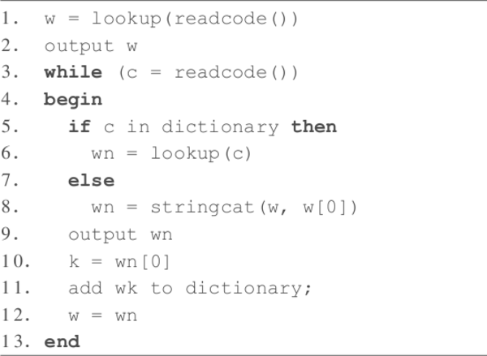

# &nbsp;

<hgroup>

<h1 style="font-size:28pt">Lietišķie algoritmi</h1>

<blue>1.4 Lempela-Ziva algoritmi</blue>

</hgroup><hgroup>

**(1) Ievads**  
(2) [Entropijas atkārtojums](#section-1)  
(3) [Hafmana optimalitāte](#section-2)  
(4) [Hafmana modifikācijas](#section-3)  
(5) [Aritmētiskā saspiešana](#section-4)  
(6) [LZ78 algoritms](#section-5)  
(7) [(P) Proprietāri formāti](#section-6)  
(8) [Kopsavilkums](#section-7)

</hgroup>

<!--
https://en.wikipedia.org/wiki/Asymmetric_numeral_systems

Aplūkot šīs ANS kā iespēju paātrināt saspiešanu "entropijas kodiem"

PSEUDO_EOF - Hafmana kods var beigties baita vidū. Parasti pievieno īpašu simbolu (teksta beigu marķieri), 
lai saprastu, kad atkodēšana jāpārtrauc. 
https://web.stanford.edu/class/archive/cs/cs106b/cs106b.1172/assn/huffman.html

https://stackoverflow.com/questions/40054218/what-if-dictionary-size-in-lzw-algorithm-is-full
--> 

-----

# <lo-why/> why

Kāpēc mainās saspiešanas pieeja, ja ievadē atkārtojas garākas simbolu virknes?

* Kādus ievades datu modeļus var izmantot, analizējot LZ saimes algoritmus?
Vai arī tie ir entropijas kodi?
* Kas nodrošina LZ77, LZW popularitāti lietojumos?

--

 
## <lo-theory/> Sasniedzamie rezultāti

1. Sarežģītības apsvērumi (cik reizes lasa ievadi?)
2. Lietot un analizēt Lempela-Ziva LZ77 algoritmu.
3. Saprast un lietot Lempela-Ziva LZ78 algoritmu un tā variantus.
4. Lempela Ziva algoritmu praktiski lietojumi.

-----

# &nbsp;

<hgroup>

<h1 style="font-size:28pt">Lietišķie algoritmi</h1>

<blue>Bezzudumu saspiešana - 2</blue>

</hgroup><hgroup>

(1) [Ievads](#section)  
(2) [Entropijas atkārtojums](#section-1)  
(3) [Hafmana optimalitāte](#section-2)  
(4) [Hafmana modifikācijas](#section-3)  
(5) [Aritmētiskā saspiešana](#section-4)  
**(6) LZ78 algoritms**  
(7) [(P) Proprietāri formāti](#section-6)  
(8) [Kopsavilkums](#section-7)

</hgroup>

Note:
[What if dictionary is full](https://stackoverflow.com/questions/40054218/what-if-dictionary-size-in-lzw-algorithm-is-full)

-----

# <lo-sample/> Novērojumi par entropijas kodiem

* Datu saspiešanas metode nevar būt labāka par entropiju, ja simboli ir neatkarīgi.
* Reālos datos nākošais simbols atkarīgs no iepriekšējā.
* Var veidot N-grammas (2 burtu virknes kā jaunus "simbolus": aa, ab, ac, ad, ...). Tam pielieto Hafmana vai aritmētisko kodu).
* Var arī izmantojot to, ka ir simbolu virknes, kas atkārtojas (kodus veido tikai reāli esošajām). Ievieš jaunus simbolus priekš šādām virknēm; 
tās arī ir Lempela-Ziva metodes (LZ77 vai LZ78).

-----

# <lo-sample/> Modeļi LZ78 analīzei

Var aplūkot LZ78 kā entropijas kodu (neatkarīgi burti).

**Cits modelis:** Markova ķēde, ko ģenerē automāts ar $3$ stāvokļiem:  

$18$ burtu virknīte, sākot ar $A$:  
<blue>`ABCABCBCAAABCABBAB`</blue>

Note:
Var ģenerēt pastaigu pa automātu.
sample(1:4,size=17, replace=TRUE)  
[1] 3 3 1 2 3 4 3 2 1 1 4 4 2 3 2 1 4  

[LZW algoritma piemērs](http://web.mit.edu/6.02/www/f2010/handouts/recitations/Recitation21VergheseFall2010.pdf)  
[LZ78 sliktākā gadījuma teorija](http://www-math.mit.edu/~shor/PAM/lempel_ziv_notes.pdf)

-----

# <lo-theory> LZ78 iekodēšanas pseidokods

<table class="pseudocode">
<tr><th colspan="2">LZ78Encode($F$) &nbsp;<green>// Kodē failu jeb simbolu plūsmu</green></th></tr>
<tr>
<td>1</td>
<td>$D = $Dictionary($S$) <green>// saliek vārdnīcā visus burtus</green></td>
</tr>
<tr>
<td>2</td>
<td>$w = \varepsilon$&nbsp;<green>// tukšais strings</green></th> </td>
</tr>
<tr>
<td>3</td>
<td>$k =$ ReadSymbol($F$)</td>
</tr>
<tr>
<td>4</td>
<td><b>while</b> $k \neq$&nbsp;eof </td>
</tr>
<tr>
<td>5</td>
<td class="ind1"><b>if</b> $wk \in $&nbsp;keys($D$) </td>
</tr>
<tr>
<td>6</td>
<td class="ind2">$w = wk$</td>
</tr>
<tr>
<td>7</td>
<td class="ind1"><b>else</b></td>
</tr>
<tr>
<td>8</td>
<td class="ind2">Output($D[w]$)</td>
</tr>
<tr>
<td>9</td>
<td class="ind2">Insert($D,w$) <green>// Pievieno vārdnīcai ar jaunu kārtas numuru</green></td>
</tr>
<tr>
<td>10</td>
<td class="ind2">$w=k$</td>
</tr>
<tr>
<td>11</td>
<td class="ind1">$k =$ ReadSymbol($F$)</td>
</tr>
<tr>
<td>12</td>
<td>Output($D[w]$)</td>
</tr>

</table>

<!--

THIS IS LZ-WELCH!!!

<table class="pseudocode">
<tr><th colspan="2">LZ78Encode($S$) &nbsp;<green>// Kodē simbolu plūsmu/stream</green></th></tr>
<tr>
<td>1</td>
<td>$C =$ ReadSymbol($S$)</td>
</tr>
<tr>
<td>2</td>
<td><b>while</b> $C \neq$ eof </td>
</tr>
<tr>
<tr>
<td>3</td>
<td class="ind1">$C' =$ GetIndex($C,x$)</td>
</tr>
<tr>
<td>4</td>
<td class="ind1"><b>while</b> $C' \neq -1$:</td>
</tr>
<tr>
<td>5</td>
<td class="ind2">$C = C'$:</td>
</tr>
<tr>
<td>6</td>
<td class="ind2">$x = $ ReadSymbol($S$)</td>
</tr>
<tr>
<td>7</td>
<td class="ind2">$C' =$ GetIndex($C,x$)</td>
</tr>
<tr>
<td>8</td>
<td class="ind1">Output($C$)</td>
</tr>
<tr>
<td>9</td>
<td class="ind1">AddDict($C,x$)</td>
</tr>
<tr>
<td>10</td>
<td class="ind1">$C =x$</td>
</tr>
</table>

-->

--

# <lo-sample/> Iekodēšanas piemērs

Dota virkne 'abcabcabcdabcaba', kura jānokodē, izmantojot Lempela - Ziva algoritmu.

Vajadzētu sanākt 
`$$\mathtt{a,b,c,1,3,2,d,4,1,a}$$`

--

# <lo-theory/> LZ78 atkodēšanas pseidokods

--

## <lo-sample/> LZ78 atkodēšanas piemēri

**Piemērs 1:** Izmantot LZ78, lai atkodētu 
virknīti: <red>`A.B.C.1.3.2.D.4.1.A`</red>

Ja atkodēšana veikta pareizi, vajadzētu 
sanākt <blue>`A.B.C.AB.CA.BC.D.ABC.AB.A`</blue>.

**Piemērs 2:** <red>`a,a,b,1,2,4,2`</red> uz <blue>`aabaaabaaaab`</blue>

**Piemērs 3:** <red>`a,b,a,3,4`</red> atkodē par <blue>`abaaaaaa`</blue>

-----

## <lo-sample/> LZ78 (biti par bitiem)

Cits LZ78 variants (sāk ar tukšu vārdnīcu).

`$\mathtt{AABABBBABAABABBBABBABB}$` (22 biti)  
`$\mathtt{A.AB.ABB.B.ABA.ABAB.BB.ABBA.BB}$`

<table>
<tr><th>1</th><th>2</th><th>3</th><th>4</th><th>5</th><th>6</th><th>7</th><th>8</th><th>9</th></tr>
<tr>
  <td>$\mathtt{A}$</td>
  <td>$\mathtt{AB}$</td>
  <td>$\mathtt{ABB}$</td>
  <td>$\mathtt{B}$</td>
  <td>$\mathtt{ABA}$</td>
  <td>$\mathtt{ABAB}$</td>
  <td>$\mathtt{BB}$</td>
  <td>$\mathtt{ABBA}$</td>
  <td>$\mathtt{BB}$</td>
</tr>
<tr>
  <td>$\varnothing\mathtt{A}$</td>
  <td>$\mathtt{1A}$</td>
  <td>$\mathtt{2B}$</td>
  <td>$\varnothing\mathtt{B}$</td>
  <td>$\mathtt{2A}$</td>
  <td>$\mathtt{5B}$</td>
  <td>$\mathtt{4B}$</td>
  <td>$\mathtt{3A}$</td>
  <td>$\mathtt{7}$</td>
</tr>
<tr>
  <td>$\color{#00F}{\mathtt{,0}}$</td>
  <td>$\color{#00F}{\mathtt{1,1}}$</td>
  <td>$\color{#00F}{\mathtt{10,1}}$</td>
  <td>$\color{#00F}{\mathtt{00,1}}$</td>
  <td>$\color{#00F}{\mathtt{010,0}}$</td>
  <td>$\color{#00F}{\mathtt{101,1}}$</td>
  <td>$\color{#00F}{\mathtt{100,1}}$</td>
  <td>$\color{#00F}{\mathtt{011,0}}$</td>
  <td>$\color{#00F}{\mathtt{0111}}$</td>
</tr>
</table>

LZ78 kods:  
`$\color{#00F}{\mathtt{01110100101001011100101100111}}$` (29 biti)  
(Sākot no elementa $2^k+1$ viņa vārdnīcas adresi kodē ar $k+1$ bitiem.)

-----

# &nbsp;

<hgroup>

<h1 style="font-size:28pt">Lietišķie algoritmi</h1>

<blue>Bezzudumu saspiešana - 2</blue>

</hgroup><hgroup>

(1) [Ievads](#section)  
(2) [Entropijas atkārtojums](#section-1)  
(3) [Hafmana optimalitāte](#section-2)  
(4) [Hafmana modifikācijas](#section-3)  
(4) [Aritmētiskā saspiešana](#section-4)  
(6) [LZ78 algoritms](#section-5)  
**(7) (P) Proprietāri formāti**  
(8) [Kopsavilkums](#section-7)

</hgroup>

-----

# <lo-yellow/> Pasaka: Kur lieto LZ saimes algoritmus

* Gzip, ZIP un V.42bis (modēmos lietots protokols) balstās uz LZ77. 
* Unix `compress`, un GIF formāti izmanto LZ78.
* *"LZ78 was covered by U.S. Patent 4,464,650 by Lempel, Ziv, Cohn, and Eastman, assigned to Sperry Corporation, later Unisys Corporation, filed on August 10, 1981. Two US patents were issued for the LZW algorithm: U.S. Patent 4,814,746 by Victor S. Miller and Mark N. Wegman and assigned to IBM, originally filed on June 1, 1983, and U.S. Patent 4,558,302 by Welch, assigned to Sperry Corporation, later Unisys Corporation, filed on June 20, 1983."*
(sk. [LZW Patents](https://en.wikipedia.org/wiki/Lempel%E2%80%93Ziv%E2%80%93Welch#Patents))

--

## <lo-yellow/> Patenti saistībā ar saspiešanu

* GIF (Unisys patents beidzās ap 2004.g.). Radās aizstājējformāts PNG - tāda
pati bezzudumu saspiesta rastra grafika (tika pievienota "alpha-transparency"). 
* MP3 (patenti ASV beidzās ap 2017.g.). Radās OGG Vorbis formāti skaņai un 
video. 
* [MP3 patentu beigas: 23.aprīlis 2017.g.](https://www.audioblog.iis.fraunhofer.com/mp3-software-patents-licenses)

--

## <lo-yellow/> Praktiskās sekas

* Galalietotājam šie formāti arvien bijuši brīvi, bet dzelžu vai 
programmatūras ražotājiem, kuri no tiem atvasina komerciālus produktus, 
reizēm bija jāmaksā - turklāt patentu tiesības (MP3 gadījumā) bija 
samudžinātas (pamatos Technicolor and Fraunhofer).
* Debian Linux papildu repozitoriji.

-----

# &nbsp;

<hgroup>

<h1 style="font-size:28pt">Lietišķie algoritmi</h1>

<blue>Bezzudumu saspiešana - 3</blue>

</hgroup><hgroup>

(1) [Ievads](#section)  
(2) [LZ78/LZW atkārtojums](#section-1)  
(3) [LZ77 saspiešana](#section-2)  
(4) [Berouza - Vı̄lera algoritms](#section-3)  
(5) [Rīki un bibliotēkas](#section-4)  
**(6) Aptauja**  
(8) [Kopsavilkums](#section-7)

</hgroup>

-----

# <lo-quiz/> Jautājums Nr.1 

<hgroup>

</hgroup>
<hgroup>

Dota Markova ķēde, kurā automāta sākumstāvoklis (un 
izvades pirmais burts) vienmēr ir $A$. 
Atrast tajā trešā burta varbūtību sadalījumu (ar kādām 
varbūtībām tur ir attiecīgi $A,B,C$). 

Ierakstīt trīs racionālus skaitļus, atdalot tos 
ar komatiem formātā <red>`a/b,c/d,e/f`</red> _____

</hgroup>

--

## <lo-quiz/> Jautājums Nr.1: Atrisinājums

<hgroup style="width:35%">

</hgroup>
<hgroup style="font-size: 70%; width:65%">

1. Trešo burtu $A$ šajā Markova ķēdē var iegūt divos veidos:  
**(i)** Pāreja $A \rightarrow A$ un vēlreiz $A \rightarrow A$.
Varbūtība $\frac{1}{4}\cdot\frac{1}{4}=\frac{1}{16}$.  
**(ii)** Pāreja $A \rightarrow B$ un tad $B \rightarrow A$.
Varbūtība $\frac{3}{4}\cdot\frac{1}{4}=\frac{3}{16}$.  
Abu varbūtību summa ir $\frac{1}{16} + \frac{3}{16} = \frac{1}{4}$.
2. Trešo burtu $B$ arī var iegūt divos veidos:  
**(i)** Pāreja $A \rightarrow A$ un tad $A \rightarrow B$.
Varbūtība $\frac{1}{4}\cdot\frac{3}{4} = \frac{3}{16}$.  
**(ii)** Pāreja $A \rightarrow B$ un tad $B \rightarrow B$.
Varbūtība $\frac{3}{4}\cdot\frac{1}{4} = \frac{3}{16}$.  
Abu varbūtību summa $\frac{3}{16} + \frac{3}{16} = \frac{3}{8}$.
3. Trešo burtu $C$ var iegūt vienā veidā:
$A \rightarrow B$ un tad $B \rightarrow C$.
Varbūtība  $\frac{3}{4}\cdot\frac{1}{2} = \frac{3}{8}$.

Tātad varbūtību sadalījums ir $\left( \frac{1}{4}, \frac{3}{8}, \frac{3}{8} \right)$. 

</hgroup>

-----

# &nbsp;

<hgroup>

<h1 style="font-size:28pt">Lietišķie algoritmi</h1>

<blue>Bezzudumu saspiešana - 2</blue>

</hgroup><hgroup>

(1) [Ievads](#section)  
(2) [Entropijas atkārtojums](#section-1)  
(3) [Hafmana optimalitāte](#section-2)  
(4) [Hafmana modifikācijas](#section-3)  
(5) [Aritmētiskā saspiešana](#section-4)  
(6) [LZ78 algoritms](#section-5)  
(7) [(P) Proprietāri formāti](#section-6)  
**(8) Kopsavilkums**

</hgroup>

--

# <lo-theory/> Ko darījām šajā nodarbībā?

1. Apspriedām entropijas kodu lietojamības robežas.
2. Ieviesām Lempela Ziva algoritmu LZ77.
3. Ieviesām Lempela Ziva algoritmu LZ78.
4. Apspriedām LZ77, LZ78 lietojumus, failu formātus un 
arhivēšanas bibliotēkas.

