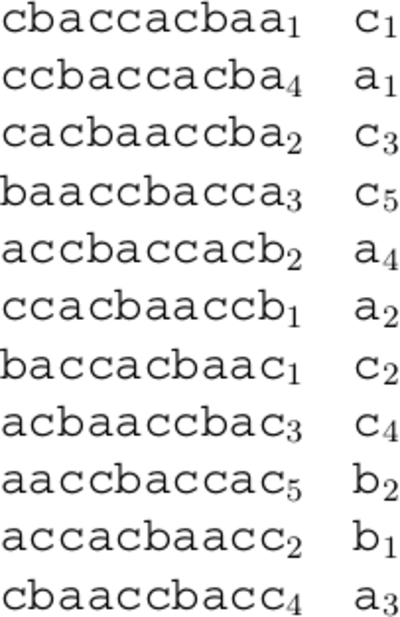

# &nbsp;

<hgroup>

<h1 style="font-size:28pt">Lietišķie algoritmi</h1>

<blue>Bezzudumu saspiešana - 3</blue>

</hgroup><hgroup>

**(1) Ievads**  
(2) [LZ78/LZW atkārtojums](#section-1)  
(3) [LZ77 saspiešana](#section-2)  
(4) [Berouza - Vı̄lera algoritms](#section-3)  
(5) [Rīki un bibliotēkas](#section-4)  
(6) [Aptauja](#section-5)  
(7) [(P) DLP - Datu noplūdes novēršana](#section-6)  
(8) [Kopsavilkums](#section-7)

</hgroup>

-----

# &nbsp;

<hgroup>

<h1 style="font-size:28pt">Lietišķie algoritmi</h1>

<blue>Bezzudumu saspiešana - 3</blue>

</hgroup><hgroup>

(1) [Ievads](#section)  
(2) [LZ78/LZW atkārtojums](#section-1)  
(3) [LZ77 saspiešana](#section-2)  
**(4) Berouza - Vı̄lera algoritms**  
(5) [Rīki un bibliotēkas](#section-4)  
(6) [Aptauja](#section-5)  
(7) [(P) DLP - Datu noplūdes novēršana](#section-6)  
(8) [Kopsavilkums](#section-7)

</hgroup>

-----

# <lo-theory/> Berouza-Vīlera transformācija

<hgroup>

</hgroup>
<hgroup>

Katram burtam atrodam visas cikliskās permutācijas. 
Tās pēc tam sakārtojam inversi-leksikogrāfiski.

</hgroup>

::: notes

https://www.cs.helsinki.fi/u/tpkarkka/opetus/12s/spa/lecture11.pdf
https://docs.python.org/3/library/bz2.html
https://serverfault.com/questions/2600/how-do-you-set-bzip2-block-size-when-using-tar

:::

--

## <lo-theory/> Inversi leksikogrāfiskā kārtība

<hgroup>

</hgroup>
<hgroup>

Pēc sakārtošanas (sākot ar priekšpēdējo burtu, tad priekšpriekšpēdējo, utt.)
iegūstam matricu, no kuras mums vajag tikai pēdējo kolonnu.

Turklāt vajag zināt, kurā rindiņā ir rakstīta mūsu virkne (šajā piemērā
sākotnējā virkne $a_1c_1c_2b_1a_2c_3c_4a_3c_5b_2a_4$ atrodas piektajā
inversi sakārtotās tabulas rindiņā.

</hgroup>

--

## <lo-theory/> Var kārtot arī parasti leksikogrāfiski

<hgroup>

</hgroup>
<hgroup>

Daudzos avotos (atskaitot G.Blelloch tekstu) 
Berouza-Vīlera transformāciju apraksta izmantojot 
parastu leksikogrāfisku kārtošanu.
Lielas atšķirības teorijā nav (tekstu pirms saspiešanas
var uzrakstīt no otra gala).

</hgroup>

--

## <lo-theory/> Kāpēc var atjaunot sākotnējo?

[Sk. 177 lapu](https://www.cs.helsinki.fi/u/tpkarkka/opetus/12s/spa/lecture11.pdf)

--

## <lo-theory/> Ko dod sašķiroti konteksti 

Gari bloki - līdz pat 900K. 

--

## <lo-theory/> Sašķiroti burti pēc TH

-----

# &nbsp;

<hgroup>

<h1 style="font-size:28pt">Lietišķie algoritmi</h1>

<blue>Bezzudumu saspiešana - 3</blue>

</hgroup><hgroup>

(1) [Ievads](#section)  
(2) [LZ78/LZW atkārtojums](#section-1)  
(3) [LZ77 saspiešana](#section-2)  
(4) [Berouza - Vı̄lera algoritms](#section-3)  
(5) [Rīki un bibliotēkas](#section-4)  
**(6) Aptauja**  
(7) [(P) DLP - Datu noplūdes novēršana](#section-6)  
(8) [Kopsavilkums](#section-7)

</hgroup>

-----

# <lo-quiz/> Jautājums Nr.1 

<hgroup>

</hgroup>
<hgroup>

Dota Markova ķēde, kurā automāta sākumstāvoklis (un 
izvades pirmais burts) vienmēr ir $A$. 
Atrast tajā trešā burta varbūtību sadalījumu (ar kādām 
varbūtībām tur ir attiecīgi $A,B,C$). 

Ierakstīt trīs racionālus skaitļus, atdalot tos 
ar komatiem formātā <red>`a/b,c/d,e/f`</red> _____

</hgroup>

-----

# <lo-quiz/> Jautājums Nr.3

Ierakstīt Berouza-Vīlera transformāciju vārdam `ABBA$`. 
Aiz tās norādīt, kurā vietā šajā transformācijā ir strings `ABBA$`.   
*Piezīme.* Sakārtotajā matricā virkņu numerācija sākas no $1$.

--

## <lo-quiz/> Jautājums Nr.3: Atrisinājums

Iegūst cikliskas `ABBA$` permutācijas, sakārto leksikogrāfiski:

$$\left( \begin{array}
\text{A} & B & B & A & \$ \\
\$ & A & B & B & A \\
A & \$ & A & B & B \\
B & A & \$ & A & B \\
B & B & A & \$ & A
\end{array} \right) \rightarrow
\left( \begin{array} 
\text{\$} & A & B & B & \color{#F00}{A} \\
A & \$ & A & B & \color{#F00}{B} \\
A & B & B & A & \color{#F00}{\$} \\
B & A & \$ & A & \color{#F00}{B} \\
B & B & A & \$ & \color{#F00}{A}
\end{array} \right).$$

Transformācijas rezultāts ir labējā kolonna: <red>`AB$BA`</red>.   
Sākotnējā virkne ir 3.rindiņa.

-----

# <lo-quiz/> Jautājums Nr.4

Iepriekšējā jautājumā iegūtajai `ABBA$` Berouza-Vīlera transformācijas 
virknei uzrakstīt **Move-to-Front** kodu, ja
sākotnējā burtu secība alfabētā ir $\text{'\$'} < \text{'A'} < \text{'B'}$.  
*Piezīme.* **Move-to-Front** algoritmos alfabēta numerācija sākas no $0$.

Ar BV transformētā virkne: _____  
Tās **Move-to-Front** kods: _____

## <lo-quiz/> Jautājums Nr.4: Atrisinājums

Katrā **Move-to-Front** kodēšanas solī pārliekam
tekošo simbolu uz alfabēta sākumu. 

<table>
<tr><th>Virkne</th><th>Kods</th><th>Alfabēts</th></tr>
<tr><td><red>`A`</red>`B$BA`</td><td>`1`</td><td>`($,A,B)`</td></tr>
<tr><td>`A`<red>`B`</red>`$BA`</td><td>`2`</td><td>`(A,$,B)`</td></tr>
<tr><td>`AB`<red>`$`</red>`BA`</td><td>`2`</td><td>`(B,A,$)`</td></tr>
<tr><td>`AB$`<red>`B`</red>`A`</td><td>`2`</td><td>`($,B,A)`</td></tr>
<tr><td>`AB$B`<red>`A`</red></td><td>`2`</td><td>`(B,$,A)`</td></tr>
</table>

Iegūtais kods ir `12222`.

-----

# &nbsp;

<hgroup>

<h1 style="font-size:28pt">Lietišķie algoritmi</h1>

<blue>Bezzudumu saspiešana - 3</blue>

</hgroup><hgroup>

(1) [Ievads](#section)  
(2) [LZ78/LZW atkārtojums](#section-1)  
(3) [LZ77 saspiešana](#section-2)  
(4) [Berouza - Vı̄lera algoritms](#section-3)  
(5) [Rīki un bibliotēkas](#section-4)  
(6) [Aptauja](#section-5)  
(7) [(P) DLP - Datu noplūdes novēršana](#section-6)  
**(8) Kopsavilkums**

</hgroup>

