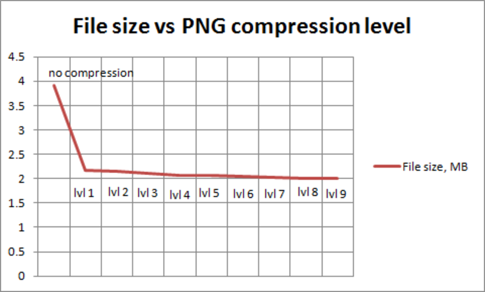
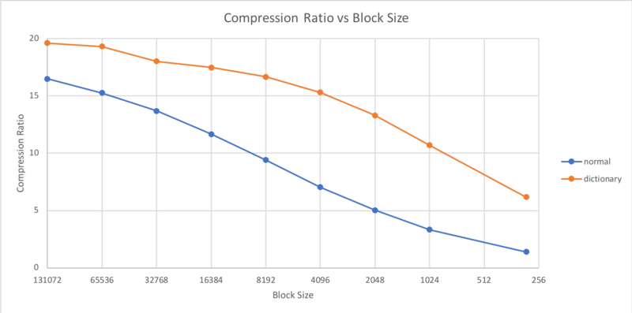

# &nbsp;

<hgroup>

<h1 style="font-size:28pt">Lietišķie algoritmi</h1>

<blue>Bezzudumu saspiešana darbībā</blue>

</hgroup><hgroup>

<span style="color:darkgreen">**(1) Ievads**</span>  
<span>(2) [Rīki un bibliotēkas](#section-4)</span>  
<span>(3) [Aptauja](#section-5)</span>  
<span>(4) [(P) DLP - Datu noplūdes novēršana](#section-6)</span>  
<span>(5) [Kopsavilkums](#section-7)</span>

</hgroup>


-----

# &nbsp;

<hgroup>

<h1 style="font-size:28pt">Lietišķie algoritmi</h1>

<blue>Bezzudumu saspiešana - 3</blue>

</hgroup><hgroup>

<span>(1) [Ievads](#section)</span>   
<span style="color:darkgreen">**(2) Rīki un bibliotēkas**</span>  
<span>(3) [Aptauja](#section-5)</span>  
<span>(4) [(P) DLP - Datu noplūdes novēršana](#section-6)</span>  
<span>(5) [Kopsavilkums](#section-7)</span>

</hgroup>


-----

# <lo-theory/> Kritēriji

* Rīka standartizācija un saspiešanas/atspiešanas vispārēja pieejamība. 
(Dažos gadījumos arī - nedaudz sabojātu arhīvu atjaunošana).
* Rīka izmaksas un licencēšanas kārtība.
* Vai tikai saspiež vai arī sapako lielākas direktorijas un/vai pievieno 
šifrēšanu vai e-parakstu.
* Rīka saspiešanas attiecība, piemēram, cilvēku valodas tekstiem (arī 
programmu izejas tekstiem, rastra grafikai, u.c.).
* Rīka saspiešanas un atspiešanas ātrums. 


-----

# <lo-yellow/> Pasaka: Saspiešana programmēšanā

Kāpēc pašiem nekodēt utilītalgoritmus:

* Iztērēts laiks un kods pēc tam ir jāuztur.
* Kļūdas un nepatikšanas ar robežgadījumiem.  
Ja algoritmam robežgadījumu nav un heiristikas 
tur nelieto, tas (vēl) nav *īstās dzīves* algoritms.
(Saspiešanas algoritmiem - ļoti gari failu ceļi; 
īpaši simboli failu vārdos.) 


--

## <lo-yellow/> Gatavu bibliotēku lietošana

Gatavu bibliotēku izmantošana nav triviāla:
 
* Izvēlēties implementāciju un versiju, 
* Cīnīties ar licencēm, 
* Pareizi izsaukt (saspiešanai - saprast
baitu vai simbolu plūsmu ievadi/izvadi) un konfigurēt,
* Rakstīt vajadzīgās diagnostikas žurnālfailos (*logs*), 
* Testēt un profilēt veiktspēju (sk. *software profiling*).


-----


# <lo-theory/> Linux komandrindu rīks "tar"

```console

# install on Ubuntu/Debian
sudo apt-get install tar
# install on CentOS
sudo yum install tar

# compress
tar -cvfz result.tar.gz original.txt
# uncompress
tar xvzf result.tar.gz

```

* "c" - **create** (veidot arhīvu),
* "x" - **eXtract** (atpakot arhīvu),
* "z" - **gZip** (lietot gzip saspiedēju papildus "Tape ARchive").
* "z" vietā "j" - (lietot bzip2 saspiedēju - t.i. Berouza-Vīlera algoritmu).


::: notes

https://www.unixmen.com/top-15-file-compression-utilities-linux/
https://en.wikipedia.org/wiki/List_of_archive_formats

:::


--

## <lo-theory/> Rīks gzip

```console

# Uzstāda uz Ubuntu/Debian
sudo apt-get install gzip
# Uzstāda uz CentOS
yum install gzip

# compress
gzip examplefile
# list properties
gzip -l examplefile.gz
# uncompress 
gzip -d examplefile.gz

```


--

## <lo-theory/> Rīks LZMA

```console

# compress
lzma -c --stdout examplefile> examplefile.lzma
# uncompress
lzma -d --stdout examplefile.lzma >examplefile

```


<!--

## <lo-theory/> Rīks 7Zip


::: notes

https://linuxhint.com/install-7zip-compression-tool-on-ubuntu/

:::


-->


<!--

# <lo-theory/> Arhīvu failu formāti

https://en.wikipedia.org/wiki/List_of_archive_formats


# <lo-theory/> Izsaukumi no Pitona

* `zlib` bibliotēka. 


::: notes

https://stackabuse.com/python-zlib-library-tutorial/


:::

-->


-----

# <lo-theory/> Kalgari un Kenterberijas korpusi

* [Kalgari korpuss](http://corpus.canterbury.ac.nz/descriptions/#calgary) - 
dažādi failu tipi (ieskaitot melnbaltus attēlus, faksus, veclaicīgu mašīnkodu); 
[dažu algoritmu salīdzinājums](https://en.wikipedia.org/wiki/Calgary_corpus#Benchmarks).  
Kalgari korpusu arvien lieto metožu salīdzināšanai un pat saspiešanas sacensībām.
* [Kenterberijas korpuss](http://corpus.canterbury.ac.nz/) - 
mūsdienīgāks korpuss.


--

## <lo-summary/> Saspiežamība pēc algoritma

TODO: Attēls, kurā salīdzināti algoritmu compression ratio


--

## <lo-summary/> Ātrums pēc algoritma

TODO: Attēls, kurā salīdzināti  


-----

# <lo-theory/> Par PNG formātu

* PNG ir bezzudumu = pēc atspiešanas vienmēr tas pats rezultāts 
(turklāt atspiešanas ātrums būtiski nemainās).
* Augstāks līmenis - lielāks bloku izmērs, lielāka vārdnīca.
* `pngcrush` var piemeklēt optimālus parametrus, ja svarīgi iegūt vismazāko PNG.


--

## <lo-theory/> PNG saspiešanas līmeņi

Saspiešanas līmenis (0 - nesaspiests, ātrākais), 
(9 - visvairāk saspiests, lēnākais). 

```console 

$ fmpeg -i input -vframes 1 -compression_level 0 0.png
$ ffmpeg -i input -vframes 1 -compression_level 100 100.png

```


--

## <lo-sample/> PNG izmērs fotogrāfijām pēc līmeņa




--

## <lo-sample/> PNG izmērs pēc bloku lielumiem 




-----

# &nbsp;

<hgroup>

<h1 style="font-size:28pt">Lietišķie algoritmi</h1>

<blue>Bezzudumu saspiešana - 3</blue>

</hgroup><hgroup>

<span>(1) [Ievads](#section)</span>  
<span>(2) [Rīki un bibliotēkas](#section-4)</span>  
<span style="color:darkgreen">**(3) Aptauja**</span>  
<span>(4) [(P) DLP - Datu noplūdes novēršana](#section-6)</span>  
<span>(5) [Kopsavilkums](#section-7)</span>

</hgroup>


-----

# <lo-quiz/> Jautājums Nr.1 

<hgroup>


</hgroup>
<hgroup>

Dota Markova ķēde, kurā automāta sākumstāvoklis (un 
izvades pirmais burts) vienmēr ir $A$. 
Atrast tajā trešā burta varbūtību sadalījumu (ar kādām 
varbūtībām tur ir attiecīgi $A,B,C$). 

Ierakstīt trīs racionālus skaitļus, atdalot tos 
ar komatiem formātā <red>`a/b,c/d,e/f`</red> _____

</hgroup>


--

## <lo-quiz/> Jautājums Nr.1: Atrisinājums

<hgroup style="width:35%">


</hgroup>
<hgroup style="font-size: 70%; width:65%">

1. Trešo burtu $A$ šajā Markova ķēdē var iegūt divos veidos:  
**(i)** Pāreja $A \rightarrow A$ un vēlreiz $A \rightarrow A$.
Varbūtība $\frac{1}{4}\cdot\frac{1}{4}=\frac{1}{16}$.  
**(ii)** Pāreja $A \rightarrow B$ un tad $B \rightarrow A$.
Varbūtība $\frac{3}{4}\cdot\frac{1}{4}=\frac{3}{16}$.  
Abu varbūtību summa ir $\frac{1}{16} + \frac{3}{16} = \frac{1}{4}$.
2. Trešo burtu $B$ arī var iegūt divos veidos:  
**(i)** Pāreja $A \rightarrow A$ un tad $A \rightarrow B$.
Varbūtība $\frac{1}{4}\cdot\frac{3}{4} = \frac{3}{16}$.  
**(ii)** Pāreja $A \rightarrow B$ un tad $B \rightarrow B$.
Varbūtība $\frac{3}{4}\cdot\frac{1}{4} = \frac{3}{16}$.  
Abu varbūtību summa $\frac{3}{16} + \frac{3}{16} = \frac{3}{8}$.
3. Trešo burtu $C$ var iegūt vienā veidā:
$A \rightarrow B$ un tad $B \rightarrow C$.
Varbūtība  $\frac{3}{4}\cdot\frac{1}{2} = \frac{3}{8}$.

Tātad varbūtību sadalījums ir $\left( \frac{1}{4}, \frac{3}{8}, \frac{3}{8} \right)$. 

</hgroup>


--

## <lo-quiz/> Jautājums Nr.1: Atrisinājums

Starp citu, trešajam burtam atbilstošā varbūtību sadalījuma $\{ 1/4, 3/8, 3/8 \}$ 
entropija ir $1.56$. Bet faktiski no Markova ķēdes
saņemtās virknes var saspiest labāk 
nekā šī entropija, jo burti $A,B,C$ nav pilnīgi neatkarīgi.
Tādēļ aritmētisko saspiešanu šajā gadījumā lietot nav optimāli. 
LZ78, Berouza-Vīlera u.c. algoritmi varētu būt labāki.


-----

# <lo-quiz/> Jautājums Nr.2

Aritmētisko kodu definē garai virknei, ko veido 
no diviem ziņojumiem `(A,B)` ar varbūtībām $p(A) = 0.9$, $p(B) = 0.1$.  
Šajā aritmētiskajā kodā nosūta $1/3$ (binārajā pierakstā $0.010101\ldots_2$). 
Ja $1/3$ atkodē, ar cik ziņojumiem `A` sākas virkne, pirms 
tajā parādās pirmais `B`.

Ierakstīt ziņojumu `A` skaitu pirms pirmā `B`: _____


--

## <lo-quiz/> Jautājums Nr.2: Atrisinājums

* Ja $x \geq 0.9$, tad $x$ atkodējums sākas ar `B`.
* Ja $x < 0.9$ un $x \geq (0.9)^2$, tad atkodējums sākas ar `AB`.
* Ja $x < (0.9)^2$ un $x \geq (0.9)^3$, tad atkodējums sākas ar `AAB`.
* Ja $x < (0.9)^3$ un $x \geq (0.9)^4$, tad atkodējums sākas ar `AAAB`.

Šeit $x = \frac{1}{3}$. Jāatrod mazākais $k-1$, kuram 
$$1/3 \geq (0.9)^k\;\;\text{jeb}\;\;-\ln 3 \geq k \cdot \ln 0.9$$ 

Tā kā $\ln 0.9 < 0$, tad $k \geq \frac{-\ln 3}{\ln 0.9} \approx 10.43$. 
Mazākā veselā $k$ vērtība ir $11$, tātad $x = 1/3$ atkodējumā 
vispirms būs $k-1 = 10$ ziņojumi `A`, pēc tam sekos ziņojums `B`.


--

## <lo-yellow/> Kā atrasts 1/3 binārais pieraksts?

Kādēļ $(1/3)_{10}$ (viena trešdaļa decimālpierakstā)
vienāda ar $0.010101\ldots_2$ (bezgalīga periodiska daļa 
divnieku pierakstā)? 

Summējot $0.010101\ldots$ nenulles ciparus, iegūstam:
$$\frac{1}{4} + \frac{1}{16} + \frac{1}{64} + \ldots = \frac{1/4}{1 - 1/4}.$$

*Bezgalīgas ģeometriskas progresijas summas formula:*

$$b_1 + b_1q + b_1q^2 + b_2q^3 + \ldots = \frac{b_1}{1 - q}.$$


-----

# <lo-quiz/> Jautājums Nr.3

Ierakstīt Berouza-Vīlera transformāciju vārdam `ABBA$`. 
Aiz tās norādīt, kurā vietā šajā transformācijā ir strings `ABBA$`.   
*Piezīme.* Sakārtotajā matricā virkņu numerācija sākas no $1$.


--

## <lo-quiz/> Jautājums Nr.3: Atrisinājums

Iegūst cikliskas `ABBA$` permutācijas, sakārto leksikogrāfiski:

$$\left( \begin{array}
\text{A} & B & B & A & \$ \\
\$ & A & B & B & A \\
A & \$ & A & B & B \\
B & A & \$ & A & B \\
B & B & A & \$ & A
\end{array} \right) \rightarrow
\left( \begin{array} 
\text{\$} & A & B & B & \color{#F00}{A} \\
A & \$ & A & B & \color{#F00}{B} \\
A & B & B & A & \color{#F00}{\$} \\
B & A & \$ & A & \color{#F00}{B} \\
B & B & A & \$ & \color{#F00}{A}
\end{array} \right).$$

Transformācijas rezultāts ir labējā kolonna: <red>`AB$BA`</red>.   
Sākotnējā virkne ir 3.rindiņa.


-----

# <lo-quiz/> Jautājums Nr.4

Iepriekšējā jautājumā iegūtajai `ABBA$` Berouza-Vīlera transformācijas 
virknei uzrakstīt **Move-to-Front** kodu, ja
sākotnējā burtu secība alfabētā ir $\text{'\$'} < \text{'A'} < \text{'B'}$.  
*Piezīme.* **Move-to-Front** algoritmos alfabēta numerācija sākas no $0$.

Ar BV transformētā virkne: _____  
Tās **Move-to-Front** kods: _____


## <lo-quiz/> Jautājums Nr.4: Atrisinājums

Katrā **Move-to-Front** kodēšanas solī pārliekam
tekošo simbolu uz alfabēta sākumu. 

<table>
<tr><th>Virkne</th><th>Kods</th><th>Alfabēts</th></tr>
<tr><td><red>`A`</red>`B$BA`</td><td>`1`</td><td>`($,A,B)`</td></tr>
<tr><td>`A`<red>`B`</red>`$BA`</td><td>`2`</td><td>`(A,$,B)`</td></tr>
<tr><td>`AB`<red>`$`</red>`BA`</td><td>`2`</td><td>`(B,A,$)`</td></tr>
<tr><td>`AB$`<red>`B`</red>`A`</td><td>`2`</td><td>`($,B,A)`</td></tr>
<tr><td>`AB$B`<red>`A`</red></td><td>`2`</td><td>`(B,$,A)`</td></tr>
</table>

Iegūtais kods ir `12222`.


-----

# &nbsp;

<hgroup>

<h1 style="font-size:28pt">Lietišķie algoritmi</h1>

<blue>Bezzudumu saspiešana - 3</blue>

</hgroup><hgroup>

<span>(1) [Ievads](#section)</span>  
<span>(2) [Rīki un bibliotēkas](#section-4)</span>  
<span>(3) [Aptauja](#section-5)</span>  
<span style="color:darkgreen">**(4) (P) DLP - Datu noplūdes novēršana**</span>  
<span>(5) [Kopsavilkums](#section-7)</span>

</hgroup>


-----

# <lo-yellow/> Arhivatori un datu noplūde

* [Symantec DLP risinājumi](https://www.symantec.com/products/dlp)
* [Forcepoint DLP risinājumi](https://www.forcepoint.com/product/dlp-data-loss-prevention)
* [Digital Guardian DLP aģents](https://digitalguardian.com/products/endpoint-dlp)

* Arhīvu atspiešana, saspiešana (reizēm arī TLS atšifrēšana/aizšifrēšana) ir laikietilpīga. 
* DLP notiek kanālos, kuri ir jūtīgi pret novēlošanos (Web, Email) -
sk. [failu izmēru limiti](https://www.websense.com/content/support/library/data/v84/file_support/file_size_limits.aspx), 
[atbalstītie arhīvu formāti](https://www.websense.com/content/support/library/data/v84/file_support/dlp_file_support.pdf). 


--

## <lo-yellow/> Daži arhīvu lietojumi DLP

* Kas notiek, ja atarhivējot failu, rodas ļoti daudz failu? 
* Kas notiek, ja atarhivējot failu, rodas ļoti garš fails?
* Vai saspiešanas algoritms ļauj sākt arhivēt un sūtīt prom datus pirms
saņemts viss nosūtāmais fails vai faili?  
Starpniekserveris (*proxy server*) nevar analizēt lietotāju Web transakcijas ilgāk 
kā aptuveni 10 sekundes, jo pārlūkprogrammu lietotāji nav pieraduši ilgi gaidīt. 
* Kas notiek, ja datus sāk sūtīt adresātam un pēkšņi pamana privātu datu noplūdi?  
Vai saņēmējs arhīvu var saprast arī tad, ja saņemta daļa no tā?


--

## <lo-yellow/> DLP atbildes uz izaicinājumiem

* DLP analīzi censties biežāk veikt lokāli uz lietotāja datora 
(*endpoint* jeb *agent* programmatūra, kas var veltīt vairāk CPU resursu
konkrētā lietotāja failu analīzei).
* Konfigurēt DLP produktus novērošanas (*monitoring*) režīmā - tad
ir vairāk laika analīzei, jo transakcijas var uzreiz atļaut neatkarīgi no to satura.
* Dažus grūti analizējamus failus (dīvaini saspiestus, ar parolēm aizsargātus
biroja programmu dokumentus, šifrētus datus) var nelaist cauri vārtejām, 
piespiest lietotājus sūtīt DLP rīkam saprotami.


-----

# &nbsp;

<hgroup>

<h1 style="font-size:28pt">Lietišķie algoritmi</h1>

<blue>Bezzudumu saspiešana - 3</blue>

</hgroup><hgroup>

<span>(1) [Ievads](#section)</span>  
<span>(2) [Rīki un bibliotēkas](#section-4)</span>  
<span>(3) [Aptauja](#section-5)</span>  
<span>(4) [(P) DLP - Datu noplūdes novēršana](#section-6)</span>  
<span style="color:darkgreen">**(5) Kopsavilkums**</span>

</hgroup>


