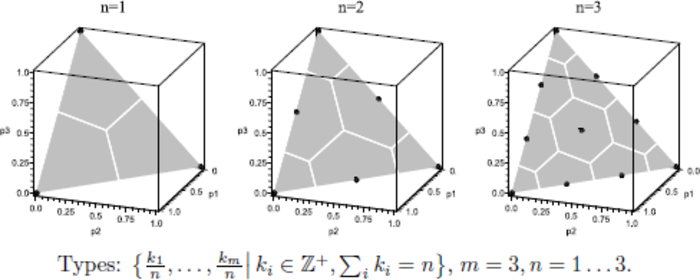
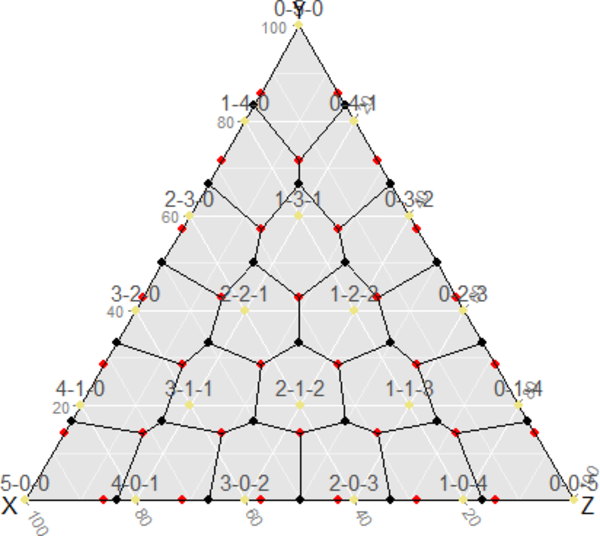

# &nbsp;

<hgroup>

<h1 style="font-size:28pt">Lietišķie algoritmi</h1>

<blue>Zudumradošā saspiešana - 1</blue>

</hgroup><hgroup>

**(1) Ievads**  
(2) [Kvantizācija](#section-1)  
(3) [Kosinusu transformācija](#section-2)  
(4) [JPEG apraksts](#section-3)  
(5) [Citas transformācijas](#section-4)  
(6) [Kopsavilkums](#section-5)

</hgroup>

-----

# &nbsp;

<hgroup>

<h1 style="font-size:28pt">Lietišķie algoritmi</h1>

<blue>Bezzudumu saspiešana - 3</blue>

</hgroup><hgroup>

(1) [Ievads](#section)  
(2) [Kvantizācija](#section-1)  
(3) [Kosinusu transformācija](#section-2)  
(4) [JPEG apraksts](#section-3)  
(5) [Citas transformācijas](#section-4)  
(6) [Kopsavilkums](#section-5)

</hgroup>

-----

# <lo-theory/> Skalārā kvantizācija 

Piemērs: melnbalti attēli.

* Attēlā skaitlis $0-255$ apzı̄mē krāsu (no melnas līdz baltai).
* Visus $256$ toņus acs neatšķir, tāpēc var attēlot $256$ krāsas uz mazāku skaitu.
* Vienkāršākais attēlojums, piemēram
$f(x) = \left\lfloor\frac{x}{4} \right\rfloor$. Tad $f\,:\,\{0,\ldots,255\} \rightarrow \{0,\ldots,63\}$. 
* Praksē lieto sarežǧı̄tāku funkciju, kas kopā sagrupē krāsas, kuras acs sliktāk atšķir.

--

## <lo-theory/> Vektoru kvantizācija (melnbalti attēli)

* Krāsainu punktu nosaka $3$ vērtı̄bas $(\text{Red}, \text{Green}, \text{Blue})$. Telpa $\{ 0,\ldots,255\}^3$.
* $f(x_1, x_2, x_3 ) = (y_1,y_2,y_3)$, tā, lai dažādi trijnieki 
$(x_1, x_2, x_3)$, kas attēlojas par vienu $(y_1,y_2,y_3)$, būtu grūti atšķirami.

Piemērs: [Browser-safe color palette](https://whatis.techtarget.com/definition/216-color-browser-safe-palette)

* Visas krāsu koordinātes, kam abi hex cipariņi ir vienādi un dalās ar $3$: 
(`00,33,66,99,CC,FF`). 
* Trīs baitus jeb $2^{24} = 16777216$ saspiež par $6^3 = 216$
vērtībām. 
* Cik liels ietaupījums sakaru kanālā?

-----

# <lo-summary/> Citi krāsu kvantizācijas veidi

Voronoja diagrammas - ap dotajiem punktiem izveidojas (bieži vien sešstūra formas)
šūnas ar koda punktu centrā.

--

## <lo-yellow/> Proporcionālās vēlēšanu sistēmas

Donta (D'Hondt) sistēmas piemērs $5$ krēsliem.

Sk. [Ungārijas 2018.g. vēlēšanas](https://en.wikipedia.org/wiki/2018_Hungarian_parliamentary_election)

--

## <lo-yellow/> Senlaga sistēma

-----

# &nbsp;

<hgroup>

<h1 style="font-size:28pt">Lietišķie algoritmi</h1>

<blue>Bezzudumu saspiešana - 3</blue>

</hgroup><hgroup>

(1) [Ievads](#section)  
(2) [Kvantizācija](#section-1)  
(3) [Kosinusu transformācija](#section-2)  
(4) [JPEG apraksts](#section-3)  
(5) [Citas transformācijas](#section-4)  
(6) [Kopsavilkums](#section-5)

</hgroup>

-----

# <lo-theory/> Ko darījām šajā nodarbībā?

1. Vienmērīga kvantizācija vienā dimensijā
2. Nevienmērīga kvantizācija
3. Noapaļošana vairākās dimensijās
4. Krāsu koordinātu pārveidojumi un noapaļošana

