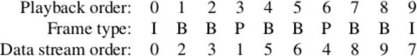
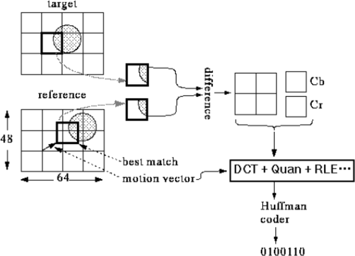
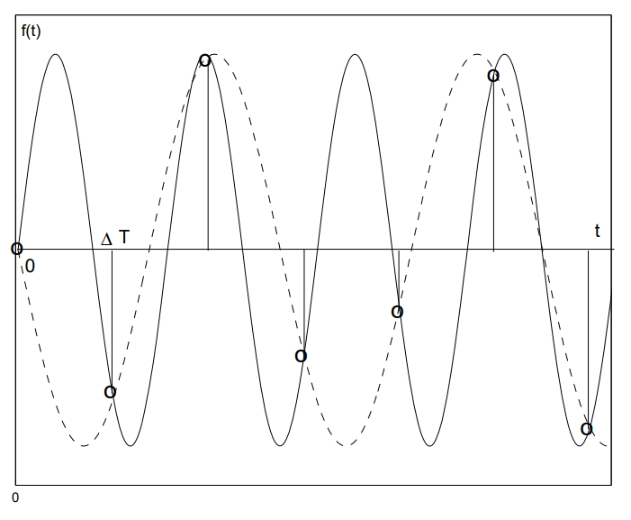
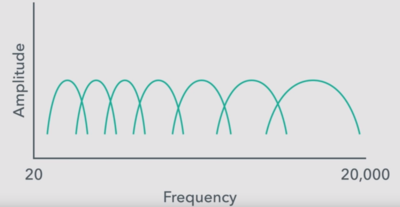
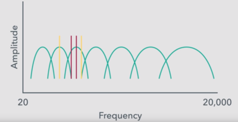
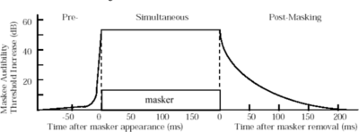
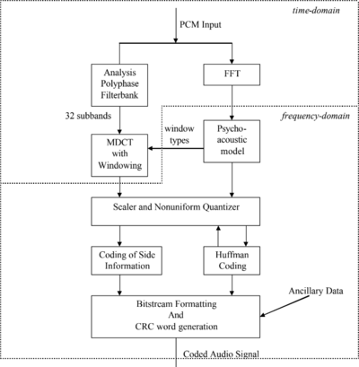
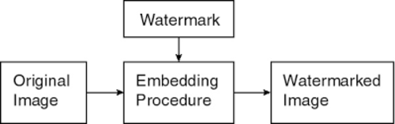

# &nbsp;

<hgroup>

<h1 style="font-size:28pt">Lietišķie algoritmi</h1>

<blue>Zudumradošā saspiešana - 2</blue>

</hgroup><hgroup>

**(1) Ievads**  
(2) [Redzes un dzirdes sajūtas](#section-1)  
(3) [Konteineri un kodeki](#section-2)  
(4) [MPEG4 saspiešana](#section-3)  
(5) [MP3 saspiešana](#section-4)  
(6) [(P) DRM un ūdenszīmes](#section-5)  
(7) [Kopsavilkums](#section-6)

</hgroup>

<!-- 

Watermarking overview
http://www.rroij.com/open-access/a-review-of-watermarking-algorithms-fordigital-image.php?aid=46871

HVS model) 

--> 

--

## <lo-theory/> Mērķi

* Aprakstīt cilvēka redzes modeli zudumradošajā saspiešanā.
* Salīdzināt video konteineru formātus (MP4, AVI, WebM)
* Uzskaitīt dažus populārākos kodekus.
* Aprakstīt MPEG-4 video saspiešanu.
* Aprakstīt MP3 audio saspiešanu. 
* Apspriest steganogrāfijas un ūdenszīmju ievietošanu 
mediju failos.

-----

# &nbsp;

<hgroup>

<h1 style="font-size:28pt">Lietišķie algoritmi</h1>

<blue>Zudumradošā saspiešana - 2</blue>

</hgroup><hgroup>

(1) [Ievads](#section)  
**(2) Redzes un dzirdes sajūtas**  
(3) [Konteineri un kodeki](#section-2)  
(4) [MPEG4 saspiešana](#section-3)  
(5) [MP3 saspiešana](#section-4)  
(6) [(P) DRM un ūdenszīmes](#section-5)  
(7) [Kopsavilkums](#section-6)

</hgroup>

-----

# <lo-theory/> HVS modelis

* *Human Visual System* (HVS) Model - attēlu un audio apstrādei izveidots "vidējots" 
cilvēka redzes modelis.

* Nūjiņas un konusiņi; pieņēmums, ka nūjiņu izšķirtspēja ir aptuveni 
divreiz labāka.

> Krāsu TV teiciens:  
> "Chrominance is at half resolution of luminance".

--

## <lo-summary/> Flicker frequency - mirgošanas frekvence

* Filmu ieraksts: 24 kadri sekundē; atskaņošanas laikā kadrus atkārto (parasti bez izmaiņām), lai 
mirgotu 48 vai 72 reizes sekundē.
* Televīzija: 25 vai 30 kadri sekundē; mirgošana mēdz 
būt divreiz biežāk (50 Hz vai 60 Hz), 
izmantojot "interlacing". 
* Katodstaru lampas mirgoja zemā frekvencē (teiksim, 60 Hz - varēja pamanīt).

-----

# &nbsp;

<hgroup>

<h1 style="font-size:28pt">Lietišķie algoritmi</h1>

<blue>Zudumradošā saspiešana - 2</blue>

</hgroup><hgroup>

(1) [Ievads](#section)  
(2) [Redzes un dzirdes sajūtas](#section-1)  
**(3) Konteineri un kodeki**  
(4) [MPEG4 saspiešana](#section-3)  
(5) [MP3 saspiešana](#section-4)  
(6) [(P) DRM un ūdenszīmes](#section-5)  
(7) [Kopsavilkums](#section-6)

</hgroup>

--

## <lo-summary/> Konteineri, ko atbalsta YouTube

* MP4 (daļa no MPEG-4 standarta); paplašinājums `*.mp4`
* AVI (Audio Video Interleaved/Microsoft); paplašinājums `*.avi`
* WMV (Windows Media Video priekš WM Player); paplašinājums `*.wmv`
* WebM (BSD licencēts konteiners/Google)
* MOV (QuickTime/Apple); paplašinājums `*.qt`
* FLV (Flash Video)
* 3GP (3G mobilo sakaru video)

--

## <lo-summary/> WebP un WebM

* Google atbalstīti formāti
* Kodēt bildes ar WebP un video ar WebP - nedaudz labāka saspiešana kā JPEG vai MPEG-4. 
* Video pasaulē **WebM** ir draudzīgi licencēts, patīk Vikipēdijai. Lietojams
ar pārlūkprogrammās iebūvēto HTML5 video atskaņotāju. 
* **WebP**, kam ir gan bezzudumu, gan zudumradošās saspiešanas funkcijas,
panāk mazākus attēlu izmērus, salīdzinot attiecīgi ar PNG un JPEG (gan
tipiskiem failiem Internetā, gan ļoti optimāli saspiestiem ar `pngcrush` u.c.)

--

## <lo-summary/> Kodeki

Codec (*coder-decoder*) ir konkrētais audio un video kanāla saspiešanas standarts. 
Katram konteineru formātam lietojami daži populāri kodeki:

* DivX, Xvid (AVI konteinerā)
* MPEG (MP4 konteinerā) 
is used in many other applications/hardware and has gained great popularity. Most CD/DVD players, Smartphones, SmartTVs and media players support the Xvid codec. So it will be one of the best video codecs for most users. The Xvid codec is faster than MPEG-1 (Xvid uses lower CPU usage than MPEG-1).

-----

# &nbsp;

<hgroup>

<h1 style="font-size:28pt">Lietišķie algoritmi</h1>

<blue>Zudumradošā saspiešana - 2</blue>

</hgroup><hgroup>

(1) [Ievads](#section)  
(2) [Redzes un dzirdes sajūtas](#section-1)  
(3) [Konteineri un kodeki](#section-2)  
**(4) MPEG4 saspiešana**  
(5) [MP3 saspiešana](#section-4)  
(6) [(P) DRM un ūdenszīmes](#section-5)  
(7) [Kopsavilkums](#section-6)

</hgroup>

-----

# <lo-theory/> Saistītas bildes

* Video visvienkāršākajā izpratnē ir daudzu rastra attēlu secība. 
* Pat iekodējot ar JPEG (katru attēlu atsevišķi) radīsies milzīgi 
lieli faili. 
* Secīgi attēli stipri korelē (ja vien tieši attiecīgajā vietā 
netika samontēti divi gabali vai krasi mainīts kameras stāvoklis). 

--

## <lo-theory/> MPEG freimu tipi

MPEG piemērots gan statiski saspiestiem, gan straumētiem datiem; 
katru attēlu iekodē vienā no šiem 3 veidiem:

* I-frame (*intra-frame*) - bilde, kuru kodē kā pilnu attēlu.
* P-frame (*predictive coded frame*) balstās uz iepriekšējo I-freimu vai P-freimu
* B-frame (*bidirectionally predictive coded frame*) izmanto gan iepriekšējo, 
gan nākamo freimu, kas var būt gan I-, gan P-freims.

--

## <lo-theory/> B-freimus atliek nosūtītajos datos

Ja filmas scēna strauji mainās, ir izdevīgi biežāk lietot I-freimus, ja tā ir relatīvi
statiska, tad - sajauktus P-freimus un B-freimus. Kodeki parasti 
ir optimizēti kaut kādam "caurmēra" ritmam. 

--

## <lo-theory/> Kustības vektors

* Līdzīgi kā JPEG (8x8 bloki), arī MPEG kodē vienādus blokus: 16x16 pikseļi. 
* I-freimiem algoritms līdzīgs kā JPEG. I-freimi ir "pieturas punkti", 
uz kuriem būvē citus. 
* P-freima 16x16 pikseļu blokam meklē līdzīgāko iepriekšējā I-freimā vai 
P-freimā (dažreiz tas var būt nobīdīts - ja video attēlota kustība vai 
kameras iefokusēšanās - *panning*). 

--

## <lo-theory/> P-freimu kodēšana

[YCbCr krāsu plakne](https://en.wikipedia.org/wiki/YCbCr) - nav tas pats kas YIQ.

--

## <lo-theory/> Saspiešanas piemērs

Ja video ir $356 \times 260$ pikseļi, tad freimu izmēri 
un saspiešanas attiecības ir sekojošas: 

<table>
<tr><th>Freims</th><th>Izmērs</th><th>Saspiešana</th></tr>
<tr><td>I-Freims</td><td>18 KiB</td><td>7:1</td></tr>
<tr><td>P-Freims</td><td>6 KiB</td><td>20:1</td></tr>
<tr><td>B-Freims</td><td>2.5 KiB</td><td>50:1</td></tr>
<tr><td>Vidēji</td><td>4.8 KiB</td><td>27:1</td></tr>
</table>

Tādēļ šādu attēlu pārraidīšanai vajadzīgais tīkla
savienojums: 

`$$30\,\text{frame/s}\cdot 4.8\,\text{Kb/frame}\,\cdot 8 = 1.2\,\text{Mbit/s}.$$`

Kopā ar audio tas var būt 1.45 megabiti sekundē, kas aizņem T1 Interneta
savienojumu (viens vītais pāris; 1.544 Mbps).

--

## <lo-theory/> MPEG lietojumi

* Satelīttelevīzijas pārraides, kas digitālu signālu no 
satelīta pārtaisa krāsainā TV signālā (kas var joprojām 
būt analogs). 
* Kabeļtelevīzija. 
* On-demand televīzija ar desmitiem tūkstošu lejupielādējamu 
(vai straumējamu) filmu. 

-----

# &nbsp;

<hgroup>

<h1 style="font-size:28pt">Lietišķie algoritmi</h1>

<blue>Zudumradošā saspiešana - 2</blue>

</hgroup><hgroup>

(1) [Ievads](#section)  
(2) [Redzes un dzirdes sajūtas](#section-1)  
(3) [Konteineri un kodeki](#section-2)  
(4) [MPEG4 saspiešana](#section-3)  
**(5) MP3 saspiešana**  
(6) [(P) DRM un ūdenszīmes](#section-5)  
(7) [Kopsavilkums](#section-6)

</hgroup>

--

# <lo-theory/> MP3 mērķi

* Saspiest mūziku u.c. audiofailus, lai tos varētu pārraidīt 
datortīklos un glabāt mūzikas atskaņotājos. 
* Publiska programmatūra parādījās ap 1994.g.
* Līdz pat 2017.g. Fraunhofer Institute for Integrated Circuits (svarīgāko patentu turētāji) 
uzlika tam ierobežojošas licences; ievāca maksu no softa ražotājiem. 

* Mūsdienās MP3 ir "mantots" (*legacy*) jeb "miris" formāts, bet 
tam joprojām plašs rīku atbalsts.
* Radio un video straumēšana izmanto ISO-MPEG kodekus; 
piemēram, AAC (Advanced Audio Coding) vai MPEG-H. 
* [The MP3 is dead, say creators after terminating licensing](https://www.cnbc.com/2017/05/15/mp3-dead-say-creators-after-terminating-licensing.html)

-----

# <lo-theory/> Parauga ātrums (sample rate)

* *Sample rate* mēra hercos (1 Hz = 1 s^{-1}) - cik reizes
sekundē kaut kas notiek. 
* CD-ROM kvalitātes ierakstam parasti vajag 
ap 44.1 kHz (CD). (Ir arī 
standarti, kas izmanto 48 kHz, 88.2 kHz, vai 96 kHz.)

**Naikvista-Šenona teorēma:** (*Nyquist-Shannon Sampling theorem*)
Ja funkcijai $x(t)$ (pēc Furjē transformācijas pielietošanas)
nav frekvenču, kas pārsniegtu $B$ hercus, tad to 
var pilnībā (bez zudumiem) atjaunot, ja zināmas tās 
vērtības ik pēc laika intervāliem `$\Delta t = 1/(2B)$`.

--

## <lo-theory/> Ekvivalenti apgalvojumi

<hgroup>

**Nyquist-Shannon 1:** Funkciju $f(t)$, kuras vērtības zināmas pēc vienādiem laika intervāliem 
$\Delta T$ var viennozīmīgi atjaunot no šīm vērtībām `$\{ f_n \}$` 
tad un tikai tad, ja $f(t)$ enerģijas spektrs nesatur frekvences virs `$\frac{\pi}{\Delta T}$` rad/s. 

</hgroup>
<hgroup>

**Nyquist-Shannon 3:** 
Ir tikai viena funkcija $f(t)$, kuras frekvenču spektrs viss atrodas zem `$\frac{\pi}{\Delta T}$`, 
ko apmierina dotās vērtības `$\{ f_n \}$`.

[Lecture10 in 2.161](https://ocw.mit.edu/courses/mechanical-engineering/2-161-signal-processing-continuous-and-discrete-fall-2008/lecture-notes/lecture_10.pdf)

</hgroup>

--

## <lo-theory/> Kas notiek, ja neievēro teorēmu

-----

# <lo-theory/> Bitu pārraide? (bitrate)

* Svarīgākais saspiešanas parametrs. 
* MP3 (MPEG layer 3 standarts) atļauj bitu ātrumus no 8 kbit/s līdz 320 kbit/s. 
Noklusējums ir 128 kbit/s.
* Salīdzinājumam, audio CD-ROM satur 2048 baitus sektorā 
(un atskaņo 75 sektorus sekundē). Tātad  = 153,600 baiti sekundē jeb 
1200 kbit/s. 

Tipiski MP3 faili ir 10-reiz mazāki par audio kompaktdiska failiem. 

[CD-ROM bitrate](https://en.wikipedia.org/wiki/Compact_Disc_Digital_Audio#Bit_rate)

--

## <lo-theory/> CBR un VBR

*Constant bitrate* un *Variable bitrate* - var lietot gan vienu, gan otru. 

* Mūzikas sarežģītība var būt atkarīga no tā, cik daudzi instrumenti spēlē. 
VBR to risina, ļaujot bitu ātrumam mainīties atkarībā no signāla. 
Mūzikas gabalu sadala vairākos *freimos* (*frames*) un iekodē ar atšķirīgiem 
bitu ātrumiem. 
* Ieraksta kvalitāti VBR gadījumā nosaka lietotāja izraudzīts parametrs (maksimāli 
atļautais bitu ātrums). 
* VBR var radīt dažiem atskaņotājiem (dekoderiem) grūtības pateikt, cik ilgi gabals skanēs. 
* VBR nav piemērots straumēšanai. 

--

## <lo-theory/> Dzirdamās skaņas frekvences 

* Cilvēka ausis var uztvert no $20$ līdz $20\,000$ hercu 
skaņas frekvenci. Pusmūža cilvēki - no $16\,000$ herciem 
(*dog whistle* uz dzirdamības diapazona robežas). 
* Pirmās oktāvas "la" (jeb **A4**) izmanto toņdakšu, 
ko sauc **Stuttgart pitch**, kam
ir 440 Hz (nosvārsta gaisu 440 reizes sekundē). 
Ja frekvence palielinās divkārt, skaņa par oktāvu augstāka. 
* "Labi temperēta" skaņu skala saliek $12$ pustoņus 
ar vienādām blakusesošo pustoņu frekvenču attiecībām. 
* Piemēram, "do" (C) un "do diēzs" (Cis) frekvenču
attiecība ir $1$ pret $\sqrt[12]{2}$. 

--

## <lo-theory/> Analizējošās filtrubankas (filterbanks)

Atdarina cilvēka ausī esošās struktūras, no kurām katra uztver 
skaņas kaut kādā šaurā frekvenču diapazonā. 
Šo diapazonu ir ap $24$. 

Skaņu plūsmā ir dažas situācijas, kad viens tonis
nomaskē otru (MP3 paredz, ka otru toni nevarēs dzirdēt; 
tāpēc tas tiek nomaskēts). Divi gadījumi - 
tuva frekvence, laika sakritība.

--

## <lo-theory/> Skaņas maskēšana

<hgroup>

</hgroup>
<hgroup>

</hgroup>

--

## <lo-theory/> FFT (ātrā Furjē transformācija)

<hgroup style="width:55%">

</hgroup>

<hgroup style="width:40%">

* Ik pēc aptuveni 25 ms rodas jauns MP3 freims. 
* Tajā saspiež esošās frekvences ar FFT. 
"Sample rate" (ap 40Hz) ir tāds, ka vienā freimā
ir 1152 datu punkti. 

</hgroup>

-----

# <lo-theory/> Stereo-mūzikas dati

* **Joint Stereo** pārraida kreisās un labās auss skaņu 
divos kanālos: Vienā kanālā summu, otrā kanālā - starpību. 
* Tā kā abām ausīm ir ļoti līdzīga skaņa, tad summa ir 
vidējota skaņa, bet starpība ir neliela un to var labi saspiest. 
* Cilvēka telpiskā skaņas uztvere (*immersive sound*) ir ļoti niansēta: 
skaņas virzienu/azimutu var sadzirdēt ar 1 grāda precizitāti; 
augstumu virs horizonta - ar apmēram 10 grādu precizitāti.
* Joprojām grūti risināms jautājums, kā novietot skaļruņus un mainīt
austiņās dzirdamās lietas, ja cilvēks pārvietojas telpā. 
Bet MP3 šo nerisina.

------

# &nbsp;

<hgroup>

<h1 style="font-size:28pt">Lietišķie algoritmi</h1>

<blue>Zudumradošā saspiešana - 2</blue>

</hgroup><hgroup>

(1) [Ievads](#section)  
(2) [Redzes un dzirdes sajūtas](#section-1)  
(3) [Konteineri un kodeki](#section-2)  
(4) [MPEG4 saspiešana](#section-3)  
(5) [MP3 saspiešana](#section-4)  
**(6) (P) DRM un ūdenszīmes**  
(7) [Kopsavilkums](#section-6)

</hgroup>

-----

# <lo-theory/> Steganogrāfija

* Teksta noslēpšana citos teksta failos (vārdu pirmie burti), bet arī atstarpes, 
sinonīmu izvēle u.c. 
* Teksta noslēpšana audio failos. 
* Teksta noslēpšana attēlu failos. 

Jāņem vērā gan mediju faila "payload" (redzamie pikseļi, skaņas u.c.), 
gan metainformācija.  
Ekstrēmāki datu zādzības piemēri - informācijas
slēpšana DNS pieprasījumu hederos.

[Michal Drzymala, et al. Network Steganography in 
the DNS Protocol](http://www.czasopisma.pan.pl/Content/101654/PDF/47.pdf?handler=pdf)

--

## <lo-theory/> Aizsardzība pret steganogrāfiju

* Steganalīze (*steganalysis*) reizēm var atrast 
modificētā materiāla oriģinālu (kurā vēl nav slepenā ziņojuma) 
un salīdzināt ar to. 
* Ne visa steganogrāfija ir robusta/noturīga pret faila
izmaiņām. Zudumradošie algoritmi var (pašiem nemanot) 
steganogrāfisko ziņojumu sabojāt. 

-----

# <lo-theory/> Ūdenszīmju tehnoloģijas

* <emblue>Ūdenszīmju tehnoloģijas</emblue> (*Watermark techniques*) - 
mediju failu izmaiņas, kas var palīdzēt atklāt licencei neatbilstošu 
satura izmantošanu. Dažreiz arī, kurš medija eksemplārs noplūdis.
* Ūdenszīmju ievietošana radniecīga <emblue>steganogrāfijai</emblue> 
(papildus slepena ziņojuma ievietošana failā, kura redzamais 
saturs ir par kaut ko citu).

--

## <lo-summary/> Ūdenszīmju/Steganogrāfijas ievietošana

* Gan ūdenszīmes, gan stenogrāfiju (gan digitālos parakstus, piemēram 
DKIM) ievieto jau gatavā mediju failā. 
* Šis process var notikt mediju failam šķērsojot kādu drošības perimetru
(tas, protams, nedrīkst būt iešifrēts ūdenszīmes pievienošanas brīdī). 

--

## <lo-summary/> Redzamas un neredzamas ūdenszīmes

* <emblue>Redzamas</emblue> (*visible*) ūdenszīmes.   
Var PDF faila lappusēm uzkrāsot virsū kaut kādu musturi; 
visu grāmatu 17.lpp. iespiest bibliotēkas zīmogu.
* <emblue>Neredzamas</emblue> (invisible) ūdenszīmes.
Tās palīdz atzīmēt faila izcelsmi, 
saņēmēju. Reizēm arī šīs informācijas 
<emblue>pretizvairīšanos</emblue> jeb
<emblue>nenoliedzamību</emblue> (*nonrepudiation*).

--

## <lo-summary/> Trauslas un noturīgas ūdenszīmes

* <emblue>Trauslas</emblue> (*fragile*) ūdenszīmes viegli sabojāt pat nelieliem 
medija pārveidojumiem - var palīdzēt atklāt, ja fails ticis mainīts.
* <emblue>Noturīgas</emblue> (*robust*) ūdenszīmes labi saglabājas arī pēc 
mediju faila manipulēšanas.

Bieži vajag gan vienas, gan otras - lai noskaidrotu faila patieso 
izcelsmi (un pēc tam - vai tas nav ticis mainīts pa ceļam līdz saņēmējam). 

--

## <lo-summary/> Telpiskas un spektrālas ūdenszīmes

* <emblue>Telpiskas</emblue> (*spatial*) ūdenszīmes parādās noteiktā medija vietā. 
Noteiktos pikseļos var kvalitatīvi noglabāt datus, bet tie parasti 
nav noturīgi. 
* <emblue>Spektrālas</emblue> (*spectral*) ūdenszīmes izmaina 
mediju faila spektrālā pārveidojumā (DCT, DFT vai DWT - t.i. kosinusu, 
Furjē vai vilnīšu/wavelet pārveidojumā) esošos koeficientus - parasti 
tos, kas atbilst augstākajām frekvencēm, jo cilvēki šīs frekvences
grūtāk atšķir.

Spektrālas ūdenszīmes mēdz būt noturīgākas.

--

## <lo-summary/> Labu ūdenszīmju vēlamās īpašības: 

* Noturība (*robustness*) - izturīgas pret manipulēšanu 
vai mēģinājumu dzēst.
* Caurspīdība (*transparency*) - tehnoloģijas 
lietotāji (ievietotāji un nolasītāji) var saprast, kā
ar mediju failu ir manipulēts.
* Ietilpība (*capacity*) - cik lielu slepeno ziņojumu vai ūdenszīmi
var ievietot.
* Zema sarežģītība (*low complexity*) - 
reizēm savas tiesības uz digitālu saturu jāvar pamatot 
vispārsaprotamā veidā.
* "Tamper resistant" vai "tamper evident".

--

## <lo-summary/> Uzbrukumi ūdenszīmēm

* JPEG vai cita zudumradoša attēla saspiešana. 
* Ģeometriski pārveidojumi: Pikseļu permutācijas, 
apgriešana (*cropping*), mērogošana (*scaling*), 
ģeometriska deformēšana.

--

## <lo-summary/> Lietojumi

* Autortiesību aizsardzība
* Individuālu kopiju marķēšana
* Sekošana citātu vai izvilkumu izplatībai. 
* Mediju satura aizsargāšana pret izmainīšanu.

-----

# &nbsp;

<hgroup>

<h1 style="font-size:28pt">Lietišķie algoritmi</h1>

<blue>Zudumradošā saspiešana - 2</blue>

</hgroup><hgroup>

(1) [Ievads](#section)  
(2) [Redzes un dzirdes sajūtas](#section-1)  
(3) [Konteineri un kodeki](#section-2)  
(4) [MPEG4 saspiešana](#section-3)  
(5) [MP3 saspiešana](#section-4)  
(6) [(P) DRM un ūdenszīmes](#section-5)  
**(7) Kopsavilkums**

</hgroup>

-----

# <lo-theory/> Ko darījām šajā nodarbībā? 

* Apskatījām cilvēka redzes un dzirdes matematizētu modeli, 
kas nosaka zudumradošās saspiešanas algoritmus.
* Raksturojām video konteineru formātus (MP4 jeb MPEG-4 Part 14, AVI, WebM)
* Uzskaitījām dažus populārākos kodekus. 
* Aprakstījām MPEG-4 video saspiešanas pamatalgoritmu.
* Aprakstījām MP3 audio saspiešanu. 
* Ieviesām steganogrāfijas un ūdenszīmju jēdzienu, to ievietošanu 
mediju failos.

