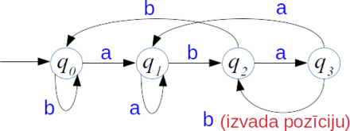
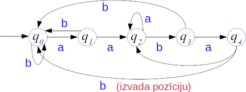
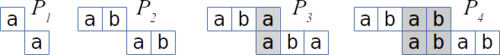
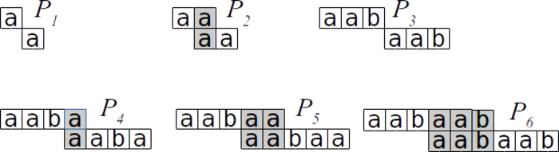

# Introduction<!-- .element: style="visibility:hidden;" -->

<hgroup>

<h1 style="font-size:28pt">Lietišķie algoritmi</h1>

<blue>Virkņu meklēšana - 3</blue>

</hgroup><hgroup style="font-size:90%">

**(1) Ievads**  
(2) [Meklēšana ar automātu](#/finite-state-automaton)  
(3) [Knuta-Morisa-Prata algoritms](#/kmp-algorithm)  
(4) [Kopsavilkums](#/summary)

</hgroup>

<!--
More
------
Ievads
Galīgi automāti
Bojera-Mūra algoritms
BM algoritma pareizība
(P) Regulāru izteiksmju atrašana
Kopsavilkums

Yet more
------------
Ievads
Rekursīvu algoritmu sarežģītība
Dinamiskā programmēšana
Sufiksu koku jēdziens
Ukkonena algoritms
(P) Failu digitālnospiedumi (fingerprinting) un Blūma filtri
Kopsavilkums
-->

-----

# <lo-why/> why

Kāpēc no teksta parauga var izveidot universālu 
``pārlēkšanas funkciju''?

* Galīgie automāti virkņu meklēšanā
* Kādēļ vispārīgā gadījumā būvēt galīgu automātu ir laikietilpīgi
* Knuta-Morisa-Prata algoritms

--

## <lo-summary/> Nodarbības mērķi 

* Lietot naivo stringu meklēšanas algoritmu. 
* Analizēt naivā algoritma sarežģītību.
* Analizēt Rabina-Karpa algoritmu, tā sarežģītību.
* Veidot KMP algoritma starprezultātu struktūras.
* Pamatot KMP algoritma pareizību un sarežģītību.

--

## <lo-summary/> Stringu meklēšanas lietojumi

* Teksta redaktori: 1 vārds, 1 dokuments
* Datu noplūdes novēršana (DLP): daudzi paraugi (vārdi, reg.izteiksmes), 
1 pārbaudāmais dokuments.
* Dokumentu atrašana (*Document retrieval*): nedaudzi paraugi, daudzi dokumenti, kam 
drīkst veikt priekšapstrādi/indeksāciju.
* Plaģiāta meklēšana: Daudzi dokumenti, 1 pārbaudāmais dokuments, atrast 
"kopētos-ielīmētos" (*Copy-Paste*) gabalus vai "kopētos-ielīmētos" un drusku parediģētos.

-----

# Finite-State Automaton<!-- .element: style="visibility:hidden;" -->

<hgroup>

<h1 style="font-size:28pt">Lietišķie algoritmi</h1>

<blue>Virkņu meklēšana - 3</blue>

</hgroup><hgroup style="font-size:90%">

(1) [Ievads](#/introduction)  
**(2) Meklēšana ar automātu**  
(3) [Knuta-Morisa-Prata algoritms](#/kmp-algorithm)  
(4) [Kopsavilkums](#/summary)

</hgroup>

-----

# <lo-theory/> Ievadvirkni lasām tikai vienreiz

Pieņemsim, ka lietojam naivo meklēšanas algoritmu un nobīdes (shift) 
pašreizējā vērtība ir `$i$`, bet salīdzināšanu esam veikuši līdz 
pozīcijai `$j$`.

Ja izrādās, ka 
`$$T[i] = P[0], \ldots, T[i + j - 1] = P[j - 1],$$`
bet `$T[i + j] \neq P[j]$`, tad to izmanto, lai izvēlētos nākamo pāri `$(i^{\ast},j^{\ast})$`. 

Nav obligāti izvēlēties `$(i^{\ast},j^{\ast}) = (i+1,0)$`  kā naivajā algoritmā.

--

## <lo-theory/> Automāta pamatideja

<hgroup>

Apakšstringa meklēšana ar galīgu automātu:  
Automāta stāvokļi `$q_0, q_1, \ldots, q_{m-1}$`. 

**Prefiksu īpašība:** Stāvoklī `$q_i$` atrodamies tad un tikai tad, ja 
"pēdējie `$i$` simboli no `$T$` sakrīt ar pirmajiem `$i$` simboliem no `$P$`". 

</hgroup>
<hgroup style="font-size:80%">

**Piemērs:** Parauga `$P = \mathtt{abab}$` meklēšanas automāts:

*Piezīme.* Pēc `$P = \mathtt{abab}$` atrašanas pārejam 
uz `$q_2$` (nevis `$q_0$`), jo paraugi var pārklāties.

`$$\mathtt{...ababab...}$$`

</hgroup>

-----

# <lo-sample/> Automāta konstrukcijas piemērs

**Uzdevums:** Uzzīmēt galīgu automātu, kas meklē `aabab` kā apakšvirkni 
ievadāmajā tekstā.

**Atrisinājums:**

-----

# <lo-summary/> Laiks meklēšanai ar automātu

<hgroup style="font-size:80%">

**Teksta lasīšanas laiks:** Gatava automāta darbināšanai vajag `$O(n)$` laiku: katram teksta burtam viena operācija.

**Parauga priekšapstrādes laiks:** Lai izveidotu automātu, 
jānosaka nākošais stāvoklis `$q’$` jebkurai pašreizējā stāvokļa `$q$` un pašreizējā burta kombinācijai.

</hgroup>
<hgroup style="font-size:80%">

Pavisam ir `$m$` stāvokļi. Ar `$|S|$` apzīmējam alfabēta `$S$` burtu skaitu. 
Veidojas tabula ar `$m \cdot |S|$` elementiem. Tam vajadzīgas vismaz `$O(m \cdot |S|)$` operācijas.  
**Pilnais laiks:** `$O(n + m \cdot |S|)$`.

*Piezīme:* Priekšapstrādes laiks ir pārāk liels; praksē tā cenšas nedarīt - par to ir KMP algoritms. 
Pat pieņemot, ka `$n >> m$`, arī `$m \cdot |S|$` var būt liels.

</hgroup>

-----

# KMP Algorithm<!-- .element: style="visibility:hidden;" -->

<hgroup>

<h1 style="font-size:28pt">Lietišķie algoritmi</h1>

<blue>Virkņu meklēšana - 3</blue>

</hgroup><hgroup style="font-size:90%">

(1) [Ievads](#/introduction)  
(2) [Meklēšana ar automātu](#/finite-state-automaton)  
**(3) Knuta-Morisa-Prata algoritms**  
(4) [Kopsavilkums](#/summary)

</hgroup>

-----

# <lo-summary/> KMP pamatideja

* Izveidojam tabuliņu ar <emblue>prefiksu funkciju</emblue> (*prefix function*) `$\pi$`. 
* Funkcija `$\pi$` veidojama meklējamam <emblue>paraugam</emblue> (*pattern*). 
Šī funkcija ietver zināšanas par to, kā paraugs `$P$` sakrīt pats ar savām nobīdēm. 
    - Izvairāmies no 
nevajadzīgām nobīdēm naivajā meklēšanas algoritmā. 
    - Nav jāveido automāta stāvokļu diagramma ar atsevišķu bultiņu 
katram iespējamajam ievades simbolam `$s \in S$`. 

1. Ievades tekstu lasa tikai vienreiz: `$O(n)$`, nevis `$O(n \cdot m)$`, kā naivajam algoritmam.
2. Parauga `$P$` priekšapstrāde notiks laikā `$O(m)$`, nevis `$O(m\cdot|S|)$`, kā pilnīgi izveidotam automātam.

-----

# <lo-summary/> Prefiksu funkcija

Prefiksu funkcija atkarīga no meklējamā parauga `$P=P[0]\ldots{}P[m-1]$`.

**Definīcija:** Katram `$j = 1,\ldots,m$` atrod maksimālo `$k$` (`$k<j$`), kam izpildās:
`$$\left\{ \begin{array}{l}
P[0] = P[j - k]\\
P[1] = P[j - k + 1]\\
\ldots\\
P[k - 1] = P[j - 1]
\end{array} \right.$$`
Prefiksu funkcijas vērtība: `$\pi[j]=k$`. Ja tāda `$k$` (`$k<j$`) nav, tad `$\pi[j]=0$`.

**Cita definīcija:**
Ar `$P_k$` apzīmē virknes `$P$` prefiksu garumā `$k$`. Tad 
`$\pi(j)=k$` ir `$P$` `$j$`-tā prefiksa (`$P_j$`) visgarākā sufiksa garums, kas īsāks par pašu `$j$`:
`$$\pi(j) = \max \left\{ k\,:\,k<j\;\text{un}\;P_k\;\text{ir virknes}\;P_j\;\text{sufikss} \right\}$$`

--

## <lo-sample/> Piemērs Nr.1

**Uzdevums:** Atrast prefiksu funkciju, kas atbilst 
meklējamajam paraugam `$P = \mathtt{abab}$`. 

**Maksimālā teleskopiskā sabīdīšana:**

<table style="margin-right:auto;margin-left:0px;">
<tr><th>$j$</th>
<td>$1$</td><td>$2$</td><td>$3$</td><td>$4$</td>
</tr>
<tr>
<th>$\pi(j)$</th>
<td>$0$</td><td>$0$</td><td>$1$</td><td>$2$</td>
</tr>
</table>

--

## <lo-sample/> Piemērs Nr.2

**Uzdevums:** Atrast prefiksu funkciju, kas atbilst 
meklējamajam paraugam `$P = \mathtt{aabaab}$`. 

**Maksimālā teleskopiskā sabīdīšana:**

<table style="margin-right:auto;margin-left:0px;">
<tr><th>$j$</th>
<td>$1$</td><td>$2$</td><td>$3$</td><td>$4$</td><td>$5$</td><td>$6$</td>
</tr>
<tr>
<th>$\pi(j)$</th>
<td>$0$</td><td>$1$</td><td>$0$</td><td>$1$</td><td>$2$</td><td>$3$</td>
</tr>
</table>

-----

# <lo-summary/> KMP pseidokods

<table class="pseudocode">
<tr><th colspan="2">KMP_Matcher($T$, $P$)</th></tr>
<tr>
<td>1</td>
<td>$n = T.\mathit{length}$</td>
</tr>
<tr>
<td>2</td>
<td>$m = P.\mathit{length}$</td>
</tr>
<tr>
<td>3</td>
<td>$\pi =$Compute_Prefix_Function($P$)</td>
</tr>
<tr>
<td>4</td>
<td>$k=0$</td>
</tr>
<tr>
<td>5</td>
<td><b>for</b> $i=0$ <b>to</b> $n-1$&nbsp;&nbsp;<green>// lasa T no kreisās uz labo</green></td>
</tr>
<tr>
<td>6</td>
<td class="ind1"><b>while</b> $k>0$ <b>and</b> $P[k] \neq T[i]$</td>
</tr>
<tr>
<td>7</td>
<td class="ind2">$k = \pi(k)$&nbsp;&nbsp;<green>// hipotēze bija aplama, paraugu pārceļ uz priekšu</green></td>
</tr>
<tr>
<td>8</td>
<td class="ind1"><b>if</b> $P[k] == T[i]$</td>
</tr>
<tr>
<td>9</td>
<td class="ind2">$k = k+1$&nbsp;&nbsp;<green>// hipotēze pagaidām apstiprinās, salīdzina tālāk</green></td>
</tr>
<tr>
<td>10</td>
<td class="ind1"><b>if</b> $k == m$&nbsp;&nbsp;<green>// viss paraugs P jau nolasīts?</green></td>
</tr>
<tr>
<td>11</td>
<td class="ind2">print <tt style="font-family:'Courier New'">"Paraugs parādās ar nobīdi"</tt> $i-m$</td>
</tr>
<tr>
<td>12</td>
<td class="ind2">$k = \pi(k)$&nbsp;&nbsp;<green>// nākamā tuvākā vieta, uz kuru pārcelt paraugu</green></td>
</tr>
</table>

--

## <lo-summary/> Kāpēc KMP strādā pareizi

Pieņemsim, ka tekošā nobīde (*shift*) ir `$i \in \{ 0,\ldots,n-m\}$`: 
Ceram, ka paraugs `$P$` atradīsies tekstā `$T$`, sākot ar `$i$`-to pozīciju.

Bet izrādās, ka kārtējais `$T$` simbols (`$T[i+j]$`) nesakrīt ar `$P[j]$` 
(kur `$j \in \{ 0,\ldots,m-1\}$`). Tad ir spēkā vienādības:

`$$\left\{ \begin{array}{lll}
T[i] & =P[j-k] & =P[0]\\
T[i+1] & =P[j-k+1] & =P[1]\\
\ldots & \ldots & \ldots\\
T[i+k+1] & =P[j-1] & =P[k-1]
\end{array} \right.$$`

Nākamā pozīcija tekstā `$T$`, no kuras var sākties apakšstrings `$P$`, ir, 
sākot ar pēdējiem `$k$` burtiem no jau nolasītā `$T$` gabala.

--

## <lo-sample/> KMP Piemērs

Meklējam paraugu `$P=\mathtt{ababaca}$` tekstā `$T = \mathtt{ababaababaca}$`. 

<table>
<tr style="font-size:70%">
<th>$i$</th>
<th>0</th><th>1</th><th>2</th><th>3</th><th>4</th>
<th>5</th><th>6</th><th>7</th><th>8</th><th>9</th>
<th>10</th><th>11</th><th>&nbsp;</th>
</tr>
<tr>
<th>&nbsp;</th>
<th>$\mathtt{a}$</th><th>$\mathtt{b}$</th><th>$\mathtt{a}$</th><th>$\mathtt{b}$</th><th>$\mathtt{a}$</th>
<th>$\mathtt{a}$</th><th>$\mathtt{b}$</th><th>$\mathtt{a}$</th><th>$\mathtt{b}$</th><th>$\mathtt{a}$</th>
<th>$\mathtt{c}$</th><th>$\mathtt{a}$</th><th>$k=0$</th>
</tr>
<tr>
<th>&nbsp;</th>
<td>$\mathtt{a}$</td><td>$\mathtt{b}$</td><td>$\mathtt{a}$</td><td>$\mathtt{b}$</td><td>$\mathtt{a}$</td>
<td>$\color{#CCC}{\mathtt{c}}$</td><td>$\color{#CCC}{\mathtt{a}}$</td><td>&nbsp;</td><td>&nbsp;</td><td>&nbsp;</td>
<td>&nbsp;</td><td>&nbsp;</td><td><green>$k=1,2,3,4,5$</green></td>
</tr>
<tr>
<th>&nbsp;</th>
<td>$\mathtt{a}$</td><td>$\mathtt{b}$</td><td>$\mathtt{a}$</td><td>$\mathtt{b}$</td><td>$\mathtt{a}$</td>
<td>$\color{#F00}{\mathtt{c}}$</td><td>$\color{#CCC}{\mathtt{a}}$</td><td>&nbsp;</td><td>&nbsp;</td><td>&nbsp;</td>
<td>&nbsp;</td><td>&nbsp;</td><td><green>$k=\pi(5)=3$</green></td>
</tr>
<tr>
<th>&nbsp;</th>
<td>&nbsp;</td><td>&nbsp;</td><td>$\mathtt{a}$</td><td>$\mathtt{b}$</td><td>$\mathtt{a}$</td>
<td>$\color{#F00}{\mathtt{b}}$</td><td>$\color{#CCC}{\mathtt{a}}$</td><td>$\color{#CCC}{\mathtt{c}}$</td><td>$\color{#CCC}{\mathtt{a}}$</td><td>&nbsp;</td>
<td>&nbsp;</td><td>&nbsp;</td><td><green>$k=\pi(3)=1$</green></td>
</tr>
<tr>
<th>&nbsp;</th>
<td>&nbsp;</td><td>&nbsp;</td><td>&nbsp;</td><td>&nbsp;</td><td>$\mathtt{a}$</td>
<td>$\color{#F00}{\mathtt{b}}$</td><td>$\color{#CCC}{\mathtt{a}}$</td><td>$\color{#CCC}{\mathtt{b}}$</td><td>$\color{#CCC}{\mathtt{a}}$</td><td>$\color{#CCC}{\mathtt{c}}$</td>
<td>$\color{#CCC}{\mathtt{a}}$</td><td>&nbsp;</td><td><green>$k=\pi(1)=0$</green></td>
</tr>
<tr>
<th>&nbsp;</th>
<td>&nbsp;</td><td>&nbsp;</td><td>&nbsp;</td><td>&nbsp;</td><td>&nbsp;</td>
<td>$\mathtt{a}$</td><td>$\mathtt{b}$</td><td>$\mathtt{a}$</td><td>$\mathtt{b}$</td><td>$\mathtt{a}$</td>
<td>$\mathtt{c}$</td><td>$\mathtt{a}$</td><td><green>$k=1,2,3,4,5,6,7$</green></td>
</tr>
</table>

Prefiksu funkcija paraugam `$P=\mathtt{ababaca}$`:

<table style="margin-right:auto;margin-left:0px;">
<tr><th>$j$</th>
<td>$1$</td><td>$2$</td><td>$3$</td><td>$4$</td><td>$5$</td><td>$6$</td><td>$7$</td>
</tr>
<tr>
<th>$\pi(j)$</th>
<td>$0$</td><td>$0$</td><td>$1$</td><td>$2$</td><td>$3$</td><td>$0$</td><td>$1$</td>
</tr>
</table>

--

## <lo-summary/> KMP_Matcher ātrdarbības novērtējums

<hgroup>

<table class="pseudocode" style="font-size:50%">
<tr><th colspan="2">KMP_Matcher($T$, $P$)</th></tr>
<tr>
<td>1</td>
<td>$n = T.\mathit{length}$</td>
</tr>
<tr>
<td>2</td>
<td>$m = P.\mathit{length}$</td>
</tr>
<tr>
<td>3</td>
<td>$\pi =$Compute_Prefix_Function($P$)</td>
</tr>
<tr>
<td>4</td>
<td>$k=0$</td>
</tr>
<tr>
<td>5</td>
<td><b>for</b> $i=0$ <b>to</b> $n-1$</td>
</tr>
<tr>
<td>6</td>
<td class="ind1"><b>while</b> $k>0$ <b>and</b> $\color{#F00}{P[k] \neq T[i]}$</td>
</tr>
<tr>
<td>7</td>
<td class="ind2">$k = \pi(k)$</td>
</tr>
<tr>
<td>8</td>
<td class="ind1"><b>if</b> $\color{#F00}{P[k] == T[i]}$</td>
</tr>
<tr>
<td>9</td>
<td class="ind2">$k = k+1$</td>
</tr>
<tr>
<td>10</td>
<td class="ind1"><b>if</b> $k == m$</td>
</tr>
<tr>
<td>11</td>
<td class="ind2">print <tt style="font-family:'Courier New'">"Atrasts ar nobīdi"</tt> $i-m$</td>
</tr>
<tr>
<td>12</td>
<td class="ind2">$k = \pi(k)$</td>
</tr>
</table>

</hgroup>

<hgroup style="font-size:70%">

Pieņemsim, ka `$\pi(j)$` jau izrēķināta.   
Ievērojam, ka jebkurā parauga `$P$` un teksta `$T$` salīdzināšanā
izpildās viena no divām lietām:

* ja `$P[k] == T[i]$`, tad palielinās `$i$`, bet `$i-k$` nemainās.
* ja `$P[k] \neq T[i]$`, tad palielinās `$i-k$`, bet `$i$` nemainās. 

Tā kā `$i$` un `$i-k$` ir veseli skaitļi, kas sākumā ir `$0$` un 
nevar pārsniegt `$n$`, tad algoritmā ir ne vairāk kā `$2n$` salīdzināšanas.
Tātad KMP ātrdarbība ir `$O(n)$`.

</hgroup>

-----

# <lo-summary/> Prefiksu funkcijas pseidokods

<table class="pseudocode">
<tr><th colspan="2">Compute_Prefix_Function($P$)</th></tr>
<tr>
<td>1</td>
<td>$m = P.\mathit{length}$</td>
</tr>
<tr>
<td>2</td>
<td>Rezervē tabulu $\pi(1)\ldots{}\pi(m)$</td>
</tr>
<tr>
<td>3</td>
<td>$\pi(1)=0$</td>
</tr>
<tr>
<td>4</td>
<td>$k=0$</td>
</tr>
<tr>
<td>5</td>
<td><b>for</b> $q=2$ <b>to</b> $m$</td>
</tr>
<tr>
<td>6</td>
<td class="ind1"><b>while</b> $k>0$ <b>and</b> $P[k]\neq{}P[q-1]$</td>
</tr>
<tr>
<td>7</td>
<td class="ind2">$k=\pi(k)$</td>
</tr>
<tr>
<td>8</td>
<td class="ind1"><b>if</b> $P[k]==P[q-1]$</td>
</tr>
<tr>
<td>9</td>
<td class="ind2">$k=k+1$</td>
</tr>
<tr>
<td>10</td>
<td class="ind1">$\pi(q)=k$</td>
</tr>
<tr>
<td>11</td>
<td><b>return</b> $\pi$</td>
</tr>
</table>

--

## <lo-sample/> Piemērs 

**Uzdevums:** Atrast prefiksu funkciju, kas atbilst
meklējamajam paraugam `$P = \mathtt{ababaca}$`.

<table style="margin-right:auto;margin-left:0px;">
<tr><th>$j$</th>
<td>$1$</td><td>$2$</td><td>$3$</td><td>$4$</td><td>$5$</td><td>$6$</td><td>$7$</td>
</tr>
<tr>
<th>$\pi(j)$</th>
<td>$0$</td><td>$0$</td><td>$1$</td><td>$2$</td><td>$3$</td><td>$0$</td><td>$1$</td>
</tr>
</table>

--

## <lo-sample/> Piemērs 

<hgroup>

<table class="pseudocode" style="font-size:55%">
<tr><th colspan="2">Compute_Prefix_Function($P$)</th></tr>
<tr>
<td>1</td>
<td>$m = P.\mathit{length}$</td>
</tr>
<tr>
<td>2</td>
<td>Rezervē tabulu $\pi(1)\ldots{}\pi(m)$</td>
</tr>
<tr>
<td>3</td>
<td>$\pi(1)=0$</td>
</tr>
<tr>
<td>4</td>
<td>$k=0$</td>
</tr>
<tr>
<td>5</td>
<td><b>for</b> $q=2$ <b>to</b> $m$</td>
</tr>
<tr>
<td>6</td>
<td class="ind1"><b>while</b> $k>0$ <b>and</b> $P[k]\neq{}P[q-1]$</td>
</tr>
<tr>
<td>7</td>
<td class="ind2">$k=\pi(k)$</td>
</tr>
<tr>
<td>8</td>
<td class="ind1"><b>if</b> $P[k]==P[q-1]$</td>
</tr>
<tr>
<td>9</td>
<td class="ind2">$k=k+1$</td>
</tr>
<tr>
<td>10</td>
<td class="ind1">$\pi(q)=k$</td>
</tr>
<tr>
<td>11</td>
<td><b>return</b> $\pi$</td>
</tr>
</table>

</hgroup>
<hgroup style="font-size:90%">

<table>
<tr>
<th>&nbsp;</td>
<th>$\mathtt{a}$</th><th>$\mathtt{b}$</th><th>$\mathtt{a}$</th><th>$\mathtt{b}$</th>
<th>$\mathtt{a}$</th><th>$\mathtt{c}$</th><th>$\mathtt{a}$</th>
</tr>
<tr>
<th>$i$</th>
<td>1</td><td>2</td><td>3</td><td>4</td><td>5</td><td>6</td><td>7</td>
</tr>
<tr>
<th>$q=1$</th>
<td>$\color{#00F}{0}$</td><td>&nbsp;</td><td>&nbsp;</td><td>&nbsp;</td><td>&nbsp;</td><td>&nbsp;</td><td>&nbsp;</td>
</tr>
<tr>
<th>$q=2$</th>
<td>$0$</td><td>$\color{#00F}{0}$</td><td>&nbsp;</td><td>&nbsp;</td><td>&nbsp;</td><td>&nbsp;</td><td>&nbsp;</td>
</tr>
<tr>
<th>$q=3$</th>
<td>$0$</td><td>$0$</td><td>$\color{#00F}{1}$</td><td>&nbsp;</td><td>&nbsp;</td><td>&nbsp;</td><td>&nbsp;</td>
</tr>
<tr>
<th>$q=4$</th>
<td>$0$</td><td>$0$</td><td>$1$</td><td>$\color{#00F}{2}$</td><td>&nbsp;</td><td>&nbsp;</td><td>&nbsp;</td>
</tr>
<tr>
<th>$q=5$</th>
<td>$0$</td><td>$0$</td><td>$1$</td><td>$2$</td><td>$\color{#00F}{3}$</td><td>&nbsp;</td><td>&nbsp;</td>
</tr>
<tr>
<th>$q=6$</th>
<td>$0$</td><td>$0$</td><td>$1$</td><td>$2$</td><td>$3$</td><td style="font-size:70%">$\color{#F00}{3\downarrow}$ $1$</td><td>&nbsp;</td>
</tr>
<tr>
<th>$q=6$</th>
<td>$0$</td><td>$0$</td><td>$1$</td><td>$2$</td><td>$3$</td><td style="font-size:70%">$\color{#F00}{1\downarrow}$ $0$</td><td>&nbsp;</td>
</tr>
<tr>
<th>$q=6$</th>
<td>$0$</td><td>$0$</td><td>$1$</td><td>$2$</td><td>$3$</td><td>$\color{#00F}{0}$</td><td>&nbsp;</td>
</tr>
<tr>
<th>$q=7$</th>
<td>$0$</td><td>$0$</td><td>$1$</td><td>$2$</td><td>$3$</td><td>$0$</td><td>$\color{#00F}{1}$</td>
</tr>
</table>

</hgroup>

--

## <lo-summary/> Prefiksu funkcijas iegūšanas ātrums

<hgroup>

<table class="pseudocode" style="font-size:55%">
<tr><th colspan="2">Compute_Prefix_Function($P$)</th></tr>
<tr>
<td>1</td>
<td>$m = P.\mathit{length}$</td>
</tr>
<tr>
<td>2</td>
<td>Rezervē tabulu $\pi(1)\ldots{}\pi(m)$</td>
</tr>
<tr>
<td>3</td>
<td>$\pi(1)=0$</td>
</tr>
<tr>
<td>4</td>
<td>$k=0$</td>
</tr>
<tr>
<td>5</td>
<td><b>for</b> $q=2$ <b>to</b> $m$</td>
</tr>
<tr>
<td>6</td>
<td class="ind1"><b>while</b> $k>0$ <b>and</b> $P[k]\neq{}P[q-1]$</td>
</tr>
<tr>
<td>7</td>
<td class="ind2">$k=\pi(k)$</td>
</tr>
<tr>
<td>8</td>
<td class="ind1"><b>if</b> $P[k]==P[q-1]$</td>
</tr>
<tr>
<td>9</td>
<td class="ind2">$k=k+1$</td>
</tr>
<tr>
<td>10</td>
<td class="ind1">$\pi(q)=k$</td>
</tr>
<tr>
<td>11</td>
<td><b>return</b> $\pi$</td>
</tr>
</table>

</hgroup>
<hgroup style="font-size:70%">

1. Ārējais cikls izpildās `$m-1$` reizes. 
2. Katrā iekšējā cikla iterācijā `$\pi[i+1]$` vērtība tiek samazināta. 
3. Tā kā šī vērtība tiek palielināta tikai katrā ārējā cikla iterācijā par `$1$`, 
tad tā var sasniegt ne vairāk kā `$m$`. Tā kā tā nevar būt negatīva, tad samazināties
var ne vairāk kā `$m$` reizes, tātad iekšējais cikls kopumā izpildās ne vairāk kā `$m$` reizes.

Tātad prefiksu funkcijas veidošanas laiks ir `$O(m)$`.

</hgroup>

-----

# Summary<!-- .element: style="visibility:hidden;" -->

<hgroup>

<h1 style="font-size:28pt">Lietišķie algoritmi</h1>

<blue>Virkņu meklēšana - 3</blue>

</hgroup><hgroup style="font-size:90%">

(1) [Ievads](#/introduction)  
(2) [Meklēšana ar automātu](#/finite-state-automaton)  
(3) [Knuta-Morisa-Prata algoritms](#/kmp-algorithm)  
**(4) Kopsavilkums**

</hgroup>

-----

# <lo-summary/> Ko darījām šajā nodarbībā

1. Apskatījām naivā algoritma uzlabojumu - meklēšanas automātu.
2. Veidojām KMP algoritmam vajadzīgo prefiksu funkciju.

