# Introduction<!-- .element: style="visibility:hidden;" -->

<hgroup>

<h1 style="font-size:28pt">Lietišķie algoritmi</h1>

<blue>Stringi: Sufiksu koki</blue>

</hgroup><hgroup style="font-size:90%">

**(1) Ievads**  
(2) [Traji](#/tries)  
(3) [Sufiksu traji](#/suffix-tries)  
(4) [Sufiksu traju lietojumi](#/applications-of-suffix-tries)  
(5) [Sufiksu koki](#/suffix-trees)  
(6) [Kopsavilkums](#/summary)

</hgroup>

Note: 

[MIT Lecture on Strings](https://ocw.mit.edu/courses/electrical-engineering-and-computer-science/6-851-advanced-data-structures-spring-2012/lecture-videos/session-16-strings/)
[Suffix tries](https://youtu.be/hLsrPsFHPcQ)
[CMU prezentācija](https://www.cs.cmu.edu/~ckingsf/bioinfo-lectures/suffixtrees.pdf)

-----

# <lo-why/> why

Kāpēc ar stringu meklēšanu (KMP un BM) nepietiek?

* Parauga priekšapstrāde vs. Teksta priekšapstrāde.
* Kuri uzdevumi ir atbildami ar "trie" datu struktūru?
* Kā to efektīvi izveidot?

-----

# <lo-theory/> Vienreizēja vs. atkārtota meklēšana

<hgroup style="font-size:80%">

**Optimāli algoritmi:**

* Knuta-Morisa-Prata algoritms
* Bojera-Mūra algoritms
* Rabina-Karpa algoritms

Visi sasniedz lineāru laiku no teksta garuma. 
(Veic parauga priekšapstrādi - izrēķina prefiksu funkciju, 
labā sufiksa funkciju, sliktā simbola funkciju, 
parauga hešfunkciju.)

</hgroup>

<hgroup style="font-size:80%">

**Datu struktūru uzdevums:**  
Identisks, bet apgriezts: Teksta dokuments `$T$` nemainās, 
tajā jāmeklē visādi paraugi `$P$`. 

* Gribam $O(m)$ laiku (meklējamo paraugu vienreiz jāizlasa), 
nevis $O(n)$ laiku (katrreiz no jauna skriet cauri tekstam). 
* Gribam $O(n)$ telpu, lai nav jāglabā daudz lielāka datu 
struktūra kā ir pats teksts.

</hgroup>

-----

# Tries<!-- .element: style="visibility:hidden;" -->

<hgroup>

<h1 style="font-size:28pt">Lietišķie algoritmi</h1>

<blue>Stringi: Sufiksu koki</blue>

</hgroup><hgroup style="font-size:90%">

(1) [Ievads](#/introduction)  
**(2) Traji**  
(3) [Sufiksu traji](#/suffix-tries)  
(4) [Sufiksu traju lietojumi](#/applications-of-suffix-tries)  
(5) [Sufiksu koki](#/suffix-trees)  
(6) [Kopsavilkums](#/summary)

</hgroup>

-----

# <lo-theory/> Traju ievads

* Trajs (*trie*) ir koks, kas glabā nevis pilnas atslēgas
(kā binārās meklēšanas koks), bet dala atslēgu sīkāk, 
izmantojot tās struktūru. 

* Stringu gadījumā trajs analizētu meklējamo stringu pa 
atsevišķiem burtiem. 

* Sufiksu traji ļauj atbildēt uz vairākiem interesantiem vaicājumiem. 

* Lai traji neaizņemtu pārāk daudz vietas, tos reizēm saspiež, 
iegūstot *sufiksu kokus*. 

-----

# <lo-theory/> Priekšteča problēma

**Uzdevums:** Priekšteča problēma 
([Predecessor problem](https://en.wikipedia.org/wiki/Predecessor_problem)): 
Doti teksta gabali $T_1<T_2 <\ldots <T_k$ (alfabētiski sakārtoti);
un arī meklējamais paraugs $P$. Atrast priekšteci un sekotāju: 

* $\text{predecessor}(P)$ - lielāko indeksu $i$, kuram $T_i \leq P$. 
* $\text{successor}(P)$ - mazāko indeksu $j$, kuram $T_j \geq P$. 

Vai to atrisina binārie meklēšanas koki? 
(Meklēšana alfabētiskā katalogā, kur ir daudz dokumentu virsrakstu.)

-----

# <lo-theory/> Trajs: Datu struktūra

Saknei pievieno bērnus, kas apzīmēti ar alfabēta burtiem
(teiksim, $26$ alfabēta burtiem). 

`$\{\mathtt{ANA}, \mathtt{ANN}, \mathtt{ANNA}, \mathtt{ANNE}\}$` - 4 burtu alfabēts 
(pievienojam `$\mathtt{\$}$` simbolu). 

Var izveidot Traju un `$O(|P|)$` soļos varam atrast 
alfabētisko priekšteci un alfabētisko pēcteci.

-----

# <lo-theory/> Kā attēlot Traja mezglus

<hgroup style="font-size:80%">

* Var zīmēt masīvus (garumā $\Sigma$ - alfabēta burtu skaits). 
Tad priekšteča uzdevumā vaicājumu laiks ir $O(|P|)$, bet 
aizņemtā telpa ir $O(|P| \cdot |\Sigma|)$. 
* Var zīmēt Bināros meklēšanas kokus. 
Vaicājuma ilgums ir  $O(|P| \log |\Sigma|)$, 
bet aizņemtā vieta ir tikai $O(|T|)$. 
* Var veidot heštabulas (bet tur nojūk kārtība starp burtiem) - tādēļ 
heštabulas izmantot nevar.

</hgroup>

<hgroup style="font-size:80%">

* Var veidot Van Emde Boasa kokus (vEB kokus) - vaicājums 
$O(|P| \cdot \log \log |\Sigma|)$. 
* Var izmantot "trejus" (*Trays*) un uzlabot uz
$O(|P| + \log |\Sigma|)$. 

Šeit $T = T_1+\ldots +T_k$. 

</hgroup>

-----

# Suffix Tries<!-- .element: style="visibility:hidden;" -->

<hgroup>

<h1 style="font-size:28pt">Lietišķie algoritmi</h1>

<blue>Stringi: Sufiksu koki</blue>

</hgroup><hgroup style="font-size:90%">

(1) [Ievads](#/introduction)  
(2) [Traji](#/tries)  
**(3) Sufiksu traji**  
(4) [Sufiksu traju lietojumi](#/applications-of-suffix-tries)  
(5) [Sufiksu koki](#/suffix-trees)  
(6) [Kopsavilkums](#/summary)

</hgroup>

-----

# <lo-theory/> Datu struktūras definīcija

<hgroup> 

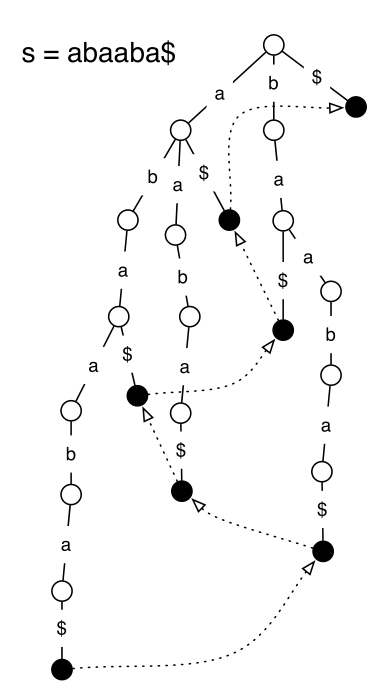<!-- .element: style="width:280px" --> 

</hgroup>

<hgroup>

Veidojam datu struktūru: Sufiksu traju, ievietojot visus sufiksus (un noslēdzot katru no tiem ar 
īpašu simbolu - dolāru, kas nepieder alfabētam). 

Ja dolāru neizmantotu, tad daži lietojumi kļūtu neiespējami (nevarētu atšķirt, 
vai tas ir sufikss vai arī iekšējs strings). 

</hgroup>

-----

# <lo-theory/> Sufiksa beigu apzīmējums

<hgroup> 

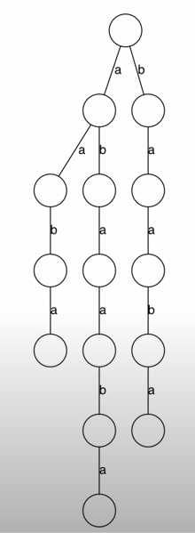<!-- .element: style="width:180px" --> 

</hgroup>

<hgroup>

Ja nelietotu dolārus sufiksu beigās, vairs neeksistētu 1:1 atbilstība starp 
koka lapām un sufiksiem. (Šī īpašība ir būtiska; `$\mathtt{\$}$` tiks lietoti visur, 
reizēm tos atzīmē, iekrāsojot koka lapas.)

</hgroup>

-----

# <lo-theory/> Sufiksa links

<hgroup> 

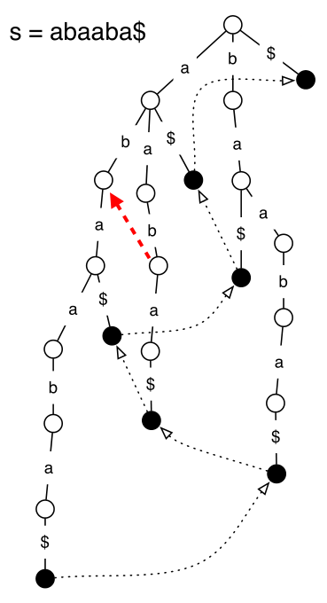<!-- .element: style="width:280px" --> 

</hgroup>

<hgroup>

* Katra lapa ir kāds sufikss.
* Katrs mezgls ir kāda sufiksa prefikss.
* Mezgla "sufiksa links" norāda uz tāda sufiksa prefiksu, kuram 
pirmais burts ir nodzēsts. 

* Gan "aab", gan "ab" ir "abaaba" sufiksu prefiksi. 
* "aab" sufiksa links rāda uz "ab". 

</hgroup>

-----

# <lo-theory/> Traju rekursīva veidošana

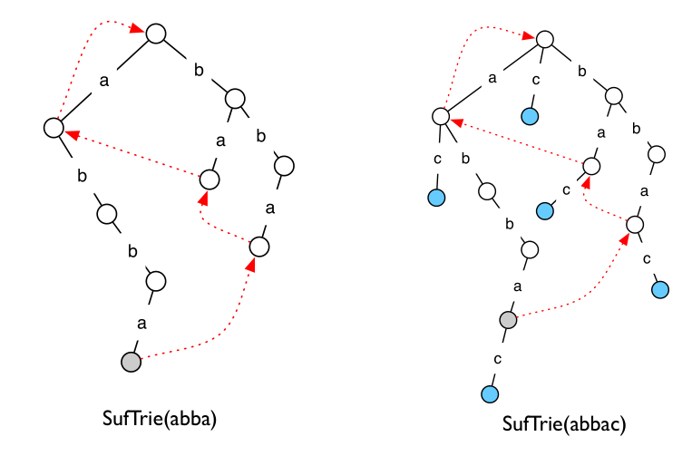<!-- .element: style="width:700px" --> 

--

# <lo-theory/> Robežas pavirzīšana tālāk

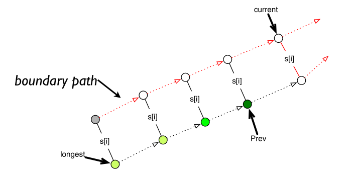<!-- .element: style="width:700px" --> 

--

# <lo-theory/> Viens pilns piemērs

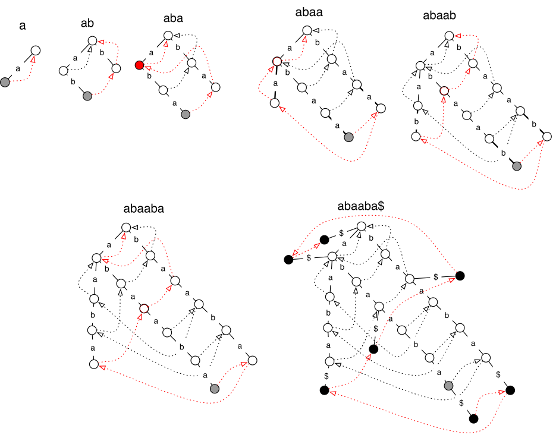<!-- .element: style="width:700px" --> 

-----

# Applications of Suffix Tries<!-- .element: style="visibility:hidden;" -->

<hgroup>

<h1 style="font-size:28pt">Lietišķie algoritmi</h1>

<blue>Stringi: Sufiksu koki</blue>

</hgroup><hgroup style="font-size:90%">

(1) [Ievads](#/introduction)  
(2) [Traji](#/tries)  
(3) [Sufiksu traji](#/suffix-tries)  
**(4) Sufiksu traju lietojumi**  
(5) [Sufiksu koki](#/suffix-trees)  
(6) [Kopsavilkums](#/summary)

</hgroup>

-----

# <lo-theory/> Apakšstringa pārbaude

**Uzdevums:** Pārbaudīt vai strings $Q$ ir teksta $T$ apakšstrings. 

Sāk traja virsotnē, seko parauga $Q$ burtiem. Ja to visu var 
trajā nolasīt, "neizkrītot" no tā, tad $Q$ ir $T$ apakšstrings. 

--

## <lo-sample/> Apakšstringa piemērs

<hgroup> 

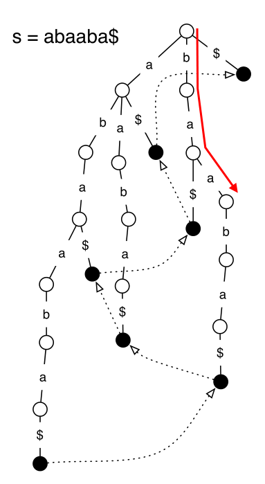<!-- .element: style="width:280px" --> 

</hgroup>

<hgroup>

* Vai $\mathtt{baa}$ ir $S$ apakšstrings. 

* Sekojam burtiem paraugā $\mathtt{baa}$. 

* Pēc sufiksu traja izveides, vaicājuma 
ilgums vienāds ar paša vaicājuma garumu
$O(|query|)$ pat ja teksts ir ļoti garš. 

</hgroup>

-----

# <lo-theory/> Sufiksa pārbaude

**Uzdevums:** Pārbaudīt, vai strings $Q$ ir teksta $T$ sufikss. 

Sāk traja virsotnē, seko parauga $Q$ burtiem. Ja to visu var 
trajā nolasīt un aiziet līdz lapai, tad tas ir sufikss. 

--

## <lo-sample/> Sufiksa piemērs

<hgroup>

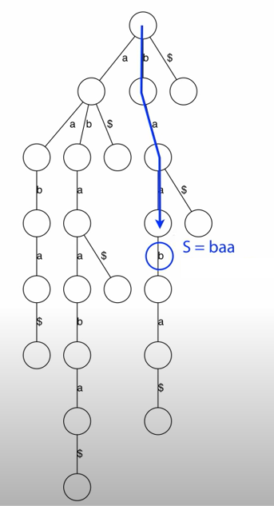<!-- .element: style="width:280px" --> 

</hgroup>

<hgroup>

* Pārbaudīt, vai "baa" ir "abaaba" sufikss? 
* No saknes meklējam uz leju (kamēr "nokrītam" no traja vai sasniedzam kādu mezglu). 
* Ja mezgls turklāt ir lapa, tad tas bija sufikss. 

</hgroup> 

-----

# <lo-theory/> Eksemplāru saskaitīšana

**Uzdevums:** Saskaitīt, cik reizes paraugs $Q$ ietilpst tekstā $T$. 

Sekot parauga $Q$ ceļam no saknes. Atkārtošanās reižu skaits
sakrīt ar lapu skaitu zem virsotnes, kurā nonāk. 

--

# <lo-sample/> Piemērs

<hgroup>

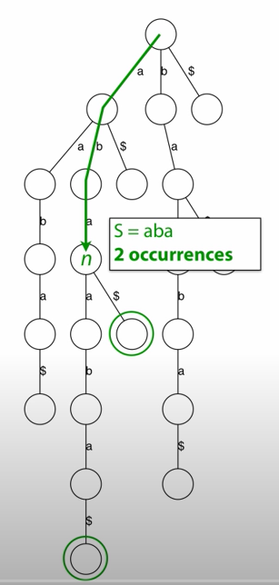<!-- .element: style="width: 300px" --> 

</hgroup>

<hgroup>

* Saskaitīt, cik reizes tekstā ietilpst "aba"
* Vai nu "nokrīt" no traja - tad atbilde ir $0$. 
* Vai arī atrod virsotni, zem kuras var saskaitīt lapas.

</hgroup> 

-----

# <lo-theory/> Garākais atkārtojums

**Uzdevums:** Atrast garāko paraugu $P$, kurš ietilpst tekstā $T$ 
atkārtoti.

Atrast dziļāko virsotni, zem kuras ir vismaz $2$ lapas.

-----

# <lo-theory/> Pirmais sufikss

**Uzdevums:** Atrast leksikogrāfiski (alfabētiski) mazāko sufiksu

Sāk saknē, ikreiz sekojot šķautnei, kas apzīmēta ar leksikogrāfiski 
mazāko burtu. 

-----

# Suffix Trees<!-- .element: style="visibility:hidden;" -->

<hgroup>

<h1 style="font-size:28pt">Lietišķie algoritmi</h1>

<blue>Stringi: Sufiksu koki</blue>

</hgroup><hgroup style="font-size:90%">

(1) [Ievads](#/introduction)  
(2) [Traji](#/tries)  
(3) [Sufiksu traji](#/suffix-tries)  
(4) [Sufiksu traju lietojumi](#/applications-of-suffix-tries)  
**(5) Sufiksu koki**  
(6) [Kopsavilkums](#/summary)

</hgroup>

-----

# <lo-theory/> Sliktākais Traja gadījums

<hgroup>

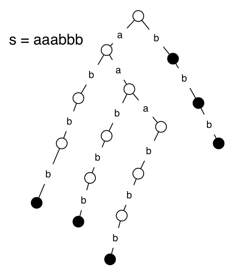<!-- .element: style="width: 300px" --> 

</hgroup>

<hgroup style="font-size:80%">

* Ja strings ir $S = \mathtt{a}^n\mathtt{b}^n$, tad 
iespējamo apakšstringu ir $n(n+1) + n+1$ jeb $O(n^2)$. 
* Stringam garumā $n$ vispār ir ne vairāk kā 
$O(n^2)$ apakšstringi, bet tie visi var parādīties. 
* Praksē sastopamiem tekstiem traja izmērs arī aug 
kvadrātiski (parasti drusku lēnāk nekā 
sliktākais gadījums), bet aizņemtā atmiņa ir milzīga.

</hgroup> 

-----

# <lo-theory/> Sufiksu koki

<hgroup>

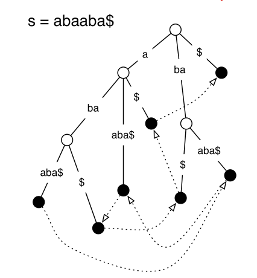<!-- .element: style="width: 350px" --> 

</hgroup>

<hgroup>

* Saspiež ceļus, kuros nav izvēles. 
* Lapu arvien ir $O(n)$, bet katrā iekšējā mezglā notiek zarošanās. 
* Tāpēc iekšējo mezglu skaits ir aptuveni vienāds ar lapu skaitu.
* Aizņemtā telpa ir $O(n)$. 
* Efektīvs Ukkonena algoritms $O(n)$. 

</hgroup>

-----

# <lo-theory/> Vispārinātie sufiksu koki

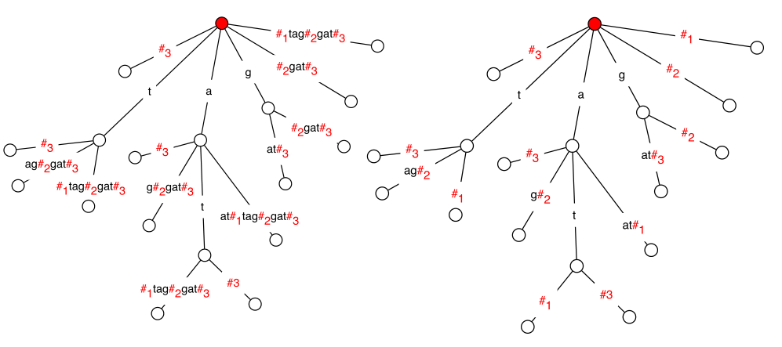<!-- .element: style="width: 700px" --> 

* at, tag, gat - 3 vārdi. Izveido konkatenāciju, būvē sufiksu koku
* Katrai lapai nomet tekstu aiz pēdējā # simbola.

</hgroup>

-----

# <lo-theory/> Garākais kopīgais apakšstrings

**Iespējamais lietojums:** Atrast garāko kopīgo apakšstringu $S$ un $T$. 

* Uzbūvē sufiksu koku $O(n_1 + n_2)$ laikā
* Atrod dziļāko mezglu, aiz kura seko gan tādas lapas, kas beidzas ar #1, gan arī tādas, 
kas beidzas ar #2. 
* Efektīvāk nekā naivais algoritms $O(n_1^2 \cdot n_2^2)$ un arī 
kā dinamiskā programmēšana $O(n_1 \cdot n_2)$. 

-----

# Summary<!-- .element: style="visibility:hidden;" -->

<hgroup>

<h1 style="font-size:28pt">Lietišķie algoritmi</h1>

<blue>Stringi: Sufiksu koki</blue>

</hgroup><hgroup style="font-size:90%">

(1) [Ievads](#/introduction)  
(2) [Traji](#/tries)  
(3) [Sufiksu traji](#/suffix-tries)  
(4) [Sufiksu traju lietojumi](#/applications-of-suffix-tries)  
(5) [Sufiksu koki](#/suffix-trees)  
**(6) Kopsavilkums**

</hgroup>

