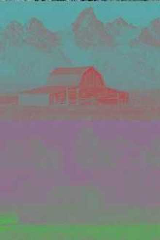
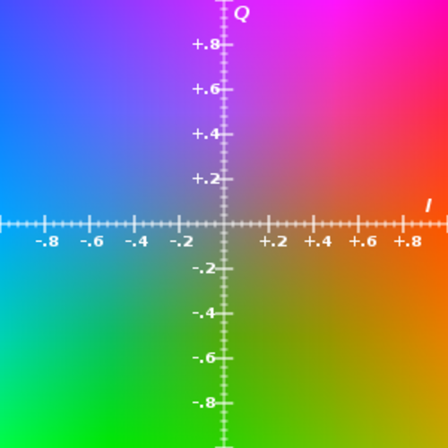
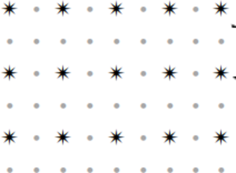
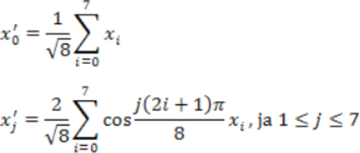

# &nbsp;

<hgroup>

<h1 style="font-size:28pt">Lietišķie algoritmi</h1>

<blue>Zudumradošā saspiešana - 1</blue>

</hgroup><hgroup>

**(1) Ievads**  
(2) [Kvantizācija](#section-1)  
(3) [Kosinusu transformācija](#section-2)  
(4) [JPEG apraksts](#section-3)  
(5) [Citas transformācijas](#section-4)  
(6) [Kopsavilkums](#section-5)

</hgroup>

# &nbsp;

<hgroup>

<h1 style="font-size:28pt">Lietišķie algoritmi</h1>

<blue>Bezzudumu saspiešana - 3</blue>

</hgroup><hgroup>

(1) [Ievads](#section)  
(2) [Kvantizācija](#section-1)  
(3) [Kosinusu transformācija](#section-2)  
(4) [JPEG apraksts](#section-3)  
(5) [Citas transformācijas](#section-4)  
(6) [Kopsavilkums](#section-5)

</hgroup>

# <lo-theory/> Skalārā kvantizācija 

Piemērs: melnbalti attēli.

* Attēlā skaitlis $0-255$ apzı̄mē krāsu (no melnas līdz baltai).
* Visus $256$ toņus acs neatšķir, tāpēc var attēlot $256$ krāsas uz mazāku skaitu.
* Vienkāršākais attēlojums, piemēram
$f(x) = \left\lfloor\frac{x}{4}$. Tad $f\,:\,\{0,\ldots,255\} \rightarrow \{0,\ldots,63\}$. 
* Praksē lieto sarežǧı̄tāku funkciju, kas kopā sagrupē krāsas, kuras acs sliktāk atšķir.

## <lo-theory/> Vektoru kvantizācija (melnbalti attēli)

* Krāsainu punktu nosaka $3$ vērtı̄bas $(\text{Red}, \text{Green}, \text{Blue})$. Telpa $\{ 0,\ldots,255\}^3$.
* $f(x_1, x_2, x_3 ) = (y_1,y_2,y_3)$, tā, lai dažādi trijnieki 
$(x_1, x_2, x_3)$, kas attēlojas par vienu $(y_1,y_2,y_3)$, būtu grūti atšķirami.

Piemērs: [Browser-safe color palette](https://whatis.techtarget.com/definition/216-color-browser-safe-palette)

* Visas krāsu koordinātes, kam abi hex cipariņi ir vienādi un dalās ar $3$: 
(`00,33,66,99,CC,FF`). 
* Trīs baitus jeb $2^{24} = 16777216$ saspiež par $6^3 = 216$
vērtībām. 
* Cik liels ietaupījums sakaru kanālā?

# <lo-summary/> Citi krāsu kvantizācijas veidi

Voronoja diagrammas - ap dotajiem punktiem izveidojas (bieži vien sešstūra formas)
šūnas ar koda punktu centrā.

## <lo-yellow/> Proporcionālās vēlēšanu sistēmas

Donta (D'Hondt) sistēmas piemērs $5$ krēsliem.

Sk. [Ungārijas 2018.g. vēlēšanas](https://en.wikipedia.org/wiki/2018_Hungarian_parliamentary_election)

## <lo-yellow/> Senlaga sistēma

# &nbsp;

<hgroup>

<h1 style="font-size:28pt">Lietišķie algoritmi</h1>

<blue>Bezzudumu saspiešana - 3</blue>

</hgroup><hgroup>

(1) [Ievads](#section)  
(2) [Kvantizācija](#section-1)  
(3) [Kosinusu transformācija](#section-2)  
(4) [JPEG apraksts](#section-3)  
(5) [Citas transformācijas](#section-4)  
(6) [Kopsavilkums](#section-5)

</hgroup>

# <lo-theory/> Kas ir transformācija

$$\left( \begin{array} \text{x'_1} \\ x'_2 \\ \cdots \\ x'_n \end{array} \right)
\approx
\left( \begin{array}
\text{a_{11}} &  a_{12} & \cdots & a_{1n} \\
a_{21} & a_{22} & \cdots & a_{2n} \\
\vdots & \vdots & \vdots & \vdots \\
a_{n1} & a_{n2} & \cdots & a_{nn} 
\end{array} \right)
\left( \begin{array} \text{x_1} \\ x_2 \\ \cdots \\ x_n \end{array} \right)$$

# &nbsp;

<hgroup>

<h1 style="font-size:28pt">Lietišķie algoritmi</h1>

<blue>Bezzudumu saspiešana - 3</blue>

</hgroup><hgroup>

(1) [Ievads](#section)  
(2) [Kvantizācija](#section-1)  
(3) [Kosinusu transformācija](#section-2)  
(4) [JPEG apraksts](#section-3)  
(5) [Citas transformācijas](#section-4)  
(6) [Kopsavilkums](#section-5)

</hgroup>

# <lo-theory/> JPEG algoritma uzdevums

* JPEG ir algoritms. Arī formāts attēlu glabāšanai.
* Ievade:  punktu attēls, katra punkta krāsu apraksta 
trīs $8$ bitu skaitļi (robežās no $0$ līdz $255$) – 
R, G, B, kur R – sarkanā krāsa (red), 
G – zaļā krāsa (green), B – zilā krāsa (blue).
* Mērķis – iegūt saspiestu failu, no kura var atjaunot attēlu, 
kas ir līdzīgs sākotnējam. Saspiešana notiek ar zudumiem.
* Soļi ir saistīti ar to, kā cilvēks uztver krāsu.

# <lo-theory/> JPEG 1.solis: RGB-to-YIQ

Y,I,Q vērtības iegūst no R,G,B vērtībām, pareizinot tās ar koeficientu matricu. 
Šis pārveidojums ir atgriezenisks (bezzudumu), t.i., zinot YIQ 
vērtības, var atjaunot RGB vērtības.

## <lo-summary/> YIQ krāsu telpa

<hgroup>

</hgroup>
<hgroup>

</hgroup>

## <lo-summary/> Kas ir YIQ?

<hgroup width="60%">

</hgroup>
<hgroup width="40%">

* "Y" - Luma informācija (melnbaltās televīzijas attēliem)
* "I" - *in-phase*, "Q" - *quadrature* (NTSC - analogās krāsu televīzijas žargons)

Redze precīzāk uztver "I" (pāreju no oranžā uz zilo) nevis
"Q" (pāreju no zaļā uz violeto) - tāpēc Q var vairāk saspiest.

</hgroup>

## <lo-summary/> Pārveido YIQ koordinātēs

$$\left( \begin{array} \text{Y} \\ I \\ Q \end{array} \right)
\approx
\left( \begin{array}
\text{0.299} &  0.587 &  0.114 \\
0.5959 & -0.2746 & -0.3213 \\
0.2115 & -0.5227 &  0.3112
\end{array} \right)
\left( \begin{array} \text{R} \\ G \\ B \end{array} \right)$$

**Pārveido atpakaļ uz RGB:**

$$\left( \begin{array} \text{R} \\ G \\ B \end{array} \right)
\approx
\left( \begin{array}
\text{1} &  0.956 &  0.619 \\
1 & -0.272 & -0.647 \\
1 & -1.106 &  1.703
\end{array} \right)
\left( \begin{array} \text{Y} \\ I \\ Q \end{array} \right)$$

# <lo-theory/> JPEG 2.solis

<hgroup>

</hgroup>
<hgroup>

Patur visas "Y" vērtības (melnbalto/gaišuma komponenti), 
taču katrā virzienā atstāj tikai katru otro "I" un "Q" vērtību 
(datu punktu skaits samazinās $4$ reizes). 
Redze pārmaiņas gaišumā uztver daudz labāk nekā pārmaiņas nokrāsā.

</hgroup>

# <lo-theory/> JPEG 3.solis

YIQ vērtības sadala $8 \times 8$ blokos. Tā kā tika atstāta tikai katra 
otrā "I" un "Q" vērtība, tad šo bloku izmērs sākotnējā attēlā ir 
$16 \times 16$. Katrs bloks tiek apstrādāts atsevišķi.

# <lo-theory/> JPEG 4.solis

Katram  blokam pielieto diskrēto kosinusu transformāciju - turklāt divas reizes.

Vispirms diskrēto kosinusu transformāciju pielieto katrai matricas  kolonnai, 
domās sadalot matricu astoņās mazākās matricās (pa vienai kolonnai katrā).

Pēc tam to pašu izdara katrai iegūtās matricas rindai.

# <lo-theory/> JPEG 5.solis

Elementu $x''_{ij}$ noapaļojam līdz precizitātei $a_{ij}$ (dala 
ar $a_{ij}$ un apaļo uz leju ar $\lfloor x \rfloor$). 
Elementu atšķirības, kas ir mazākas par $a_{ij}$, ir nebūtiskas. 
Galvenā viltība ir tā, ka skaitļi  atšķiras dažādiem matricas elementiem. 
Tās komponentes, kuras acs uztver vājāk, tiek noapaļotas ar 
zemāku precizitāti. Mazākā vērtība $a_{13} = 10$, lielākā – $a_{65} = 121$.

# <lo-theory/> JPEG 6.solis

* Visu $8 \times 8$ matricu kreisos augšējos elementus saliek 
kopīgā virknē. Šādi tiks iegūtas trīs virknes – 
katrai no trim krāsu telpas YIQ komponentēm. 

* Raksta starpības $a_1, a_2-a_1, a_3 - a_2,\ldots$. 

# <lo-theory/> JPEG 7.solis

Iegūtajai starpību virknei lieto 
Hofmana vai aritmētisko kodēšanu.

# &nbsp;

<hgroup>

<h1 style="font-size:28pt">Lietišķie algoritmi</h1>

<blue>Bezzudumu saspiešana - 3</blue>

</hgroup><hgroup>

(1) [Ievads](#section)  
(2) [Kvantizācija](#section-1)  
(3) [Kosinusu transformācija](#section-2)  
(4) [JPEG apraksts](#section-3)  
(5) [Citas transformācijas](#section-4)  
(6) [Kopsavilkums](#section-5)

</hgroup>

# &nbsp;

<hgroup>

<h1 style="font-size:28pt">Lietišķie algoritmi</h1>

<blue>Bezzudumu saspiešana - 3</blue>

</hgroup><hgroup>

(1) [Ievads](#section)  
(2) [Kvantizācija](#section-1)  
(3) [Kosinusu transformācija](#section-2)  
(4) [JPEG apraksts](#section-3)  
(5) [Citas transformācijas](#section-4)  
(6) [Kopsavilkums](#section-5)

</hgroup>

