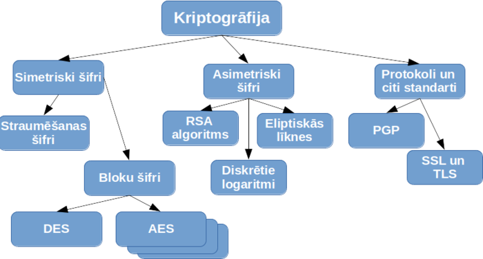

# &nbsp;

<hgroup>

<h1 style="font-size:28pt">Lietišķie algoritmi</h1>

<blue>Asimetriska kriptogrāfija</blue>

</hgroup><hgroup>

**(1) Ievads**  
(2) [Simetriska šifrēšana](#section-1)  
(3) [Asimetriska šifrēšana](#section-2)  
(4) [RSA algoritmi](#section-3)  
(5) [Par skaitļu teoriju](#section-4)  
(6) [Difī-Helmana atslēgu apmaiņa](#section-5)  
(7) [PGP programmatūra](#section-6)  
(8) [(P) Epastu drošība](#section-7)  
(9) [Kopsavilkums](#section-8)

</hgroup>

# <lo-why/> why

Kāpēc dažādi drošas komunikācijas uzdevumi noved pie līdzīgām 
veselu skaitļu manipulācijām?

* Simetrisku atslēgu apmaiņa ar asimetriskām atslēgām. 
* Digitāli paraksti, to nenoliedzamība.
* Digitālu sertifikātu apstiprināšana (Certificate Authorities)

# &nbsp;

<hgroup>

<h1 style="font-size:28pt">Lietišķie algoritmi</h1>

<blue>Asimetriska kriptogrāfija</blue>

</hgroup><hgroup>

(1) [Ievads](#section)  
**(2) Simetriska šifrēšana**  
(3) [Asimetriska šifrēšana](#section-2)  
(4) [RSA algoritmi](#section-3)  
(5) [Par skaitļu teoriju](#section-4)  
(6) [Difī-Helmana atslēgu apmaiņa](#section-5)  
(7) [PGP programmatūra](#section-6)  
(8) [(P) Epastu drošība](#section-7)  
(9) [Kopsavilkums](#section-8)

</hgroup>

# <lo-theory/> Kriptoloģijas apakštēmas

* Kriptogrāfija un kriptoanalīze ir pretējas nodarbes (kopīgā nozare ir kriptoloģija). 

 

## <lo-summary/> Vienreiz lietojamās atslēgas

* "One-time pad" - ļoti ātrs un neatšifrējams, bet tajā ir garas atslēgas.
* Vajadzīgs nejaušo skaitļu ģenerators; garas atslēgas grūti pārraidīt.
* Pseidonejaušu skaitļu ģeneratori bieži ir apšaubāmi.

$$ \left\{ \begin{array}{l}
s_0 = 12345\\
s_{i+1} = 1103515245s_i + 12345\;(\text{mod}\,2^{31})
\end{array} \right.
$$

  
<small>(c) [Dilbert.com](https://dilbert.com/strip/2001-10-25)</small>

# <lo-summary/> AES: Pazīstamākais simetriskais šifrs

* AES (*Advanced Encryption Standard*) ap 2002.g. tika izraudzīts 
kā standarts ASV valdības dokumentu (tostarp konfidenciālo) 
drošai pārraidei. To ieviesa US National Institute of Standards and Technology (NIST). 
* AES ir bloku šifrs - visi šifrējamie bloki ir 128 bitus gari; 
* AES atslēgas var būt 128, 192, 256 bitus garas.

# &nbsp;

<hgroup>

<h1 style="font-size:28pt">Lietišķie algoritmi</h1>

<blue>Asimetriska kriptogrāfija</blue>

</hgroup><hgroup>

(1) [Ievads](#section)  
(2) [Simetriska šifrēšana](#section-1)  
**(3) Asimetriska šifrēšana**  
(4) [RSA algoritmi](#section-3)  
(5) [Par skaitļu teoriju](#section-4)  
(6) [Difī-Helmana atslēgu apmaiņa](#section-5)  
(7) [PGP programmatūra](#section-6)  
(8) [(P) Epastu drošība](#section-7)  
(9) [Kopsavilkums](#section-8)

</hgroup>

# &nbsp;

<hgroup>

<h1 style="font-size:28pt">Lietišķie algoritmi</h1>

<blue>Asimetriska kriptogrāfija</blue>

</hgroup><hgroup>

(1) [Ievads](#section)  
(2) [Simetriska šifrēšana](#section-1)  
(3) [Asimetriska šifrēšana](#section-2)  
**(4) RSA algoritmi**  
(5) [Par skaitļu teoriju](#section-4)  
(6) [Difī-Helmana atslēgu apmaiņa](#section-5)  
(7) [PGP programmatūra](#section-6)  
(8) [(P) Epastu drošība](#section-7)  
(9) [Kopsavilkums](#section-8)

</hgroup>

# &nbsp;

<hgroup>

<h1 style="font-size:28pt">Lietišķie algoritmi</h1>

<blue>Asimetriska kriptogrāfija</blue>

</hgroup><hgroup>

(1) [Ievads](#section)  
(2) [Simetriska šifrēšana](#section-1)  
(3) [Asimetriska šifrēšana](#section-2)  
(4) [RSA algoritmi](#section-3)  
**(5) Par skaitļu teoriju**  
(6) [Difī-Helmana atslēgu apmaiņa](#section-5)  
(7) [PGP programmatūra](#section-6)  
(8) [(P) Epastu drošība](#section-7)  
(9) [Kopsavilkums](#section-8)

</hgroup>

# &nbsp;

<hgroup>

<h1 style="font-size:28pt">Lietišķie algoritmi</h1>

<blue>Asimetriska kriptogrāfija</blue>

</hgroup><hgroup>

(1) [Ievads](#section)  
(2) [Simetriska šifrēšana](#section-1)  
(3) [Asimetriska šifrēšana](#section-2)  
(4) [RSA algoritmi](#section-3)  
(5) [Par skaitļu teoriju](#section-4)  
**(6) Difī-Helmana atslēgu apmaiņa**  
(7) [PGP programmatūra](#section-6)  
(8) [(P) Epastu drošība](#section-7)  
(9) [Kopsavilkums](#section-8)

</hgroup>

# &nbsp;

<hgroup>

<h1 style="font-size:28pt">Lietišķie algoritmi</h1>

<blue>Asimetriska kriptogrāfija</blue>

</hgroup><hgroup>

(1) [Ievads](#section)  
(2) [Simetriska šifrēšana](#section-1)  
(3) [Asimetriska šifrēšana](#section-2)  
(4) [RSA algoritmi](#section-3)  
(5) [Par skaitļu teoriju](#section-4)  
(6) [Difī-Helmana atslēgu apmaiņa](#section-5)  
**(7) PGP programmatūra**  
(8) [(P) Epastu drošība](#section-7)  
(9) [Kopsavilkums](#section-8)

</hgroup>

# <lo-theory/> PGP vēsture

* Fils Cimermans (*Phil Zimmermann*), 1991.gads. 
* OpenPGP standarts
* Šifrē epastu saturu (nevis SMTP hederus!), 
var izmantot citiem failiem, ko glabā nedrošās vietās - 
uz mobilām ierīcēm vai mākonī.

## <lo-theory/> PGP programmatūra

* PGP spraudņi
* Ciphermail u.c. epasta vārtejas, kuras pielieto 
PGP šifrēšanu, izmantojot sūtītāja atslēgu.

## <lo-theory/> Atslēgu pāra ģenerēšana 

* Kā lietotājs var izveidot privātas/publiskas atslēgas pāri
* Kā manuāli eksportēt un importēt šādas atslēgas

# <lo-theory/> PKI un "Web of trust"

* Atslēgu apmaiņai jābūt mērogojamai
* PKI veido hierarhiju, sākot ar "Saknes sertifikātu", 
ar kuru paraksta zemāku līmeņu sertifikātus u.c.
* "Web of trust" nozīmē transitīvu uzticēšanos: 
Ja $A$ uzticas $B$ sertifikātiem, tad $A$ uzticas arī
sertifikātiem, kuriem uzticas $B$. 

# &nbsp;

<hgroup>

<h1 style="font-size:28pt">Lietišķie algoritmi</h1>

<blue>Asimetriska kriptogrāfija</blue>

</hgroup><hgroup>

(1) [Ievads](#section)  
(2) [Simetriska šifrēšana](#section-1)  
(3) [Asimetriska šifrēšana](#section-2)  
(4) [RSA algoritmi](#section-3)  
(5) [Par skaitļu teoriju](#section-4)  
(6) [Difī-Helmana atslēgu apmaiņa](#section-5)  
(7) [PGP programmatūra](#section-6)  
**(8) (P) Epastu drošība**  
(9) [Kopsavilkums](#section-8)

</hgroup>

# <lo-theory/> Epastu infrastruktūra

<hgroup>

TODO: Attēls ar pamata topoloģiju

</hgroup>
<hgroup>

* MUA (*Mail User Agent*) jeb klienta epasta 
programma.
* MDA (*Mail Delivery Agent*) jeb epasta serveris.
* MTA (*Mail Transfer Agent*) jeb epasta maršrutētājs.

Atšķirībā no HTTP, SMTP ieejošās un izejošās epastu ķēdītes var
būt pilnīgi atšķirīgas un savstarpēji nesaistītas.
Biežas situācijas, kad domēna izsūtīšanas adrese(s) ir pavisam citas
nekā saņemšanas adrese(s).

</hgroup>

## <lo-theory/> 

## <lo-theory/> Epastu vārtejas

<hgroup>

TODO: Attēls ar 4 virzieniem

</hgroup>
<hgroup>

Epasta 4 virzieni

* Iekšējs (no aizsargāta domēna uz to pašu vai citu aizsargātu)
* Ienākošs (no neaizsargāta domēna uz aizsargātu)
* Izejošs (no aizsargāta domēna uz neaizsargātu)
* "Atvērtais relejs" (abi domēni neaizsargāti - šim 
virzienam jābūt aizliegtam!)

</hgroup>

## <lo-summary/> SMTP pieprasījumi

TODO: Attēls ar SMTP hederiem un 
vēstules satura paraugu.

# 

# &nbsp;

<hgroup>

<h1 style="font-size:28pt">Lietišķie algoritmi</h1>

<blue>Asimetriska kriptogrāfija</blue>

</hgroup><hgroup>

(1) [Ievads](#section)  
(2) [Simetriska šifrēšana](#section-1)  
(3) [Asimetriska šifrēšana](#section-2)  
(4) [RSA algoritmi](#section-3)  
(5) [Par skaitļu teoriju](#section-4)  
(6) [Difī-Helmana atslēgu apmaiņa](#section-5)  
(7) [PGP programmatūra](#section-6)  
(8) [(P) Epastu drošība](#section-7)  
**(9) Kopsavilkums**

</hgroup>

