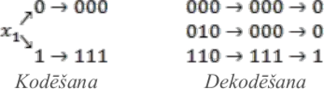

# &nbsp;

<hgroup>

<h1 style="font-size:28pt">Lietišķie algoritmi</h1>

<blue>Kļūdu korekcija - 1</blue>

</hgroup><hgroup>

**(1) Ievads**  
(2) [Kļūdu detekcija un korekcija](#section-1)  
(3) [Kļūdu korekcijas kodi](#section-2)  
(4) [Heminga kodi](#section-3)  
(5) [Citi lineāri kodi](#section-4)  
(6) [Rīda-Solomona kodi](#section-5)  
(7) [Kopsavilkums](#section-6)

</hgroup>

## <lo-theory/> Mērķi

* Definēt kļūdu detekcijas un korekcijas atšķirības
* Pamatot apgalvojumu par divu kļūdu korekcijas kodu attālumu.
* Lietot un pamatot Heminga kodus. 

# &nbsp;

<hgroup>

<h1 style="font-size:28pt">Lietišķie algoritmi</h1>

<blue>Kļūdu korekcija - 1</blue>

</hgroup><hgroup>

(1) [Ievads](#section)  
**(2) Kļūdu detekcija un korekcija**  
(3) [Kļūdu korekcijas kodi](#section-2)  
(4) [Heminga kodi](#section-3)  
(5) [Citi lineāri kodi](#section-4)  
(6) [Rīda-Solomona kodi](#section-5)  
(7) [Kopsavilkums](#section-6)

</hgroup>

# <lo-theory/> Kļūdu detekcija

## <lo-summary/> Bitu paritātes metode

**Situācija:** Pārraida $n$ bitu virkni 
$x_1,x_2,\ldots,x_n \in \{ 0; 1\}$. 
Lai konstatētu iespējamu kļūdu $1$ bitā (kas var gan 
iestāties, gan neiestāties), pārraida $n+1$ bitus:  
Visus $x_1,x_2,\ldots,x_n$ un arī pēdējo bitu
$$\left( x_1 + x_2 + \ldots + x_n \left)\,\text{mod}\,2.$$

Pēdējais bits glabā visu iepriekšējo bitu paritāti. 
Tāpēc visu $n+1$ bitu paritāte ir $0$. Ja pārraidē rodas viena
kļūda, tad paritāte būs $1$, un kļūdu varēs konstatēt. 

## <lo-summary/> CRC kontrolsumma

TODO

# <lo-theory/> Kļūdu korekcija

Ideja visās metodēs - papildināt pārraidāmos datus ar 
papildinformāciju, cerot, ka papildinformācija ļaus pamanīt 
kļūdas. 

## <lo-summary/> Triviāls kods: 3x atkārtošana

Katru pārraidāmo bitu atkārto trīs reizes. Saņēmējs 
atrod, kādu
bitu ir vairāk – nuļļu vai vieninieku.
Šāds kods var izlabot kļūdu vienā bitā.

# &nbsp;

<hgroup>

<h1 style="font-size:28pt">Lietišķie algoritmi</h1>

<blue>Kļūdu korekcija - 1</blue>

</hgroup><hgroup>

(1) [Ievads](#section)  
(2) [Kļūdu detekcija un korekcija](#section-1)  
**(3) Kļūdu korekcijas kodi**  
(4) [Heminga kodi](#section-3)  
(5) [Citi lineāri kodi](#section-4)  
(6) [Rīda-Solomona kodi](#section-5)  
(7) [Kopsavilkums](#section-6)

</hgroup>

# <lo-theory/> Korekcijas koda jēdziens

**Definīcija:** Par $[n,k,d]$-kodu sauc kļūdu korekcijas kodu, kurā  
$n$ – bitu skaits, kurus kodējums faktiski pārraida,  
$k$ – kodējamo bitu skaits,  
$d$ – kļūdu skaits, ko iespējams koriģēt.

**Piemērs:** Atkārtošanas metodei $n=3$, $k=1$, $d=1$, tāpēc tas ir
$[3,1,1]$-kods.

## <lo-summary/> Negatīvs piemērs

Vēlamies veidot kļūdu korekcijas kodu alfabētam, kurā ir 
$3$ ziņojumi: $A = \{ a,b,c \}$. (Ziņojumu skaits nav divnieka
pakāpe; informācijas saturs vienam ziņojumam ir $\log_2 3 \aprox 1.585$ biti.)

Piedāvājam kodēt ziņojumus $a,b,c$ attiecīgi ar kodiem 
$S = \{ 1000,0101,1101 \}$.  
Šāds kods nespēj koriģēt vienu kļūdu, jo,
saņemot virkni `0101`, nav skaidrs, vai tika pārraidīta virkne `0101`
(bez kļūdām) vai arī virkne `1101`
(ar vienu kļūdu – pirmajā bitā).  
Divdomīgs ir arī `1001` u.c.

## <lo-theory/> 

**Teorēma:** Kopa $S$ ir
$[n,k,d]$-kods tad un tikai tad, ja  
(1) $S$ sastāv no virknēm garumā $n$,  
(2) $|S| \geq 2^k$, lai visām $k$-bitu virknēm pietiktu kodu.  
(3) katras divas virknes no $S$ atšķiras vismaz $2d+1$ vietās.

**Pierādījums:** 
Kods nespēj koriģēt $d$ kļūdas, ja eksistē virkne $z = z_1z_2\ldots{}z_n$
un divas kopas virknes $x=x_1x_2\ldots{}x_n$ un $y=y_1y_2\ldots{}y_n$, 
kas katra atšķiras no $z$ ne vairāk kā $d$ vietās. 
Līdz ar to virknes $x$ un $y$ atšķiras ne vairāk kā $2d$
vietās. Tāpēc, lai kods spētu koriģēt
kļūdas, katrām divām kopas $S$ virknēm ir
jāatšķiras vismaz $2d+1$ vietā. $\blacksquare$

# &nbsp;

<hgroup>

<h1 style="font-size:28pt">Lietišķie algoritmi</h1>

<blue>Kļūdu korekcija - 1</blue>

</hgroup><hgroup>

(1) [Ievads](#section)  
(2) [Kļūdu detekcija un korekcija](#section-1)  
(3) [Kļūdu korekcijas kodi](#section-2)  
**(4) Heminga kodi**  
(5) [Citi lineāri kodi](#section-4)  
(6) [Rīda-Solomona kodi](#section-5)  
(7) [Kopsavilkums](#section-6)

</hgroup>

# &nbsp;

<hgroup>

<h1 style="font-size:28pt">Lietišķie algoritmi</h1>

<blue>Kļūdu korekcija - 1</blue>

</hgroup><hgroup>

(1) [Ievads](#section)  
(2) [Kļūdu detekcija un korekcija](#section-1)  
(3) [Kļūdu korekcijas kodi](#section-2)  
(4) [Heminga kodi](#section-3)  
**(5) Citi lineāri kodi**  
(6) [Rīda-Solomona kodi](#section-5)  
(7) [Kopsavilkums](#section-6)

</hgroup>

# &nbsp;

<hgroup>

<h1 style="font-size:28pt">Lietišķie algoritmi</h1>

<blue>Kļūdu korekcija - 1</blue>

</hgroup><hgroup>

(1) [Ievads](#section)  
(2) [Kļūdu detekcija un korekcija](#section-1)  
(3) [Kļūdu korekcijas kodi](#section-2)  
(4) [Heminga kodi](#section-3)  
(5) [Citi lineāri kodi](#section-4)  
**(6) Rīda-Solomona kodi**  
(7) [Kopsavilkums](#section-6)

</hgroup>

# &nbsp;

<hgroup>

<h1 style="font-size:28pt">Lietišķie algoritmi</h1>

<blue>Kļūdu korekcija - 1</blue>

</hgroup><hgroup>

(1) [Ievads](#section)  
(2) [Kļūdu detekcija un korekcija](#section-1)  
(3) [Kļūdu korekcijas kodi](#section-2)  
(4) [Heminga kodi](#section-3)  
(5) [Citi lineāri kodi](#section-4)  
(6) [Rīda-Solomona kodi](#section-5)  
**(7) Kopsavilkums**

</hgroup>

