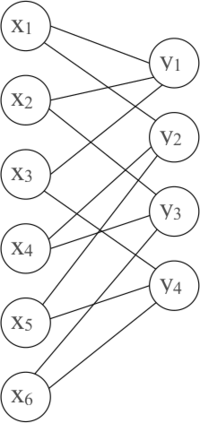

# &nbsp;

<hgroup>

<h1 style="font-size:28pt">Lietišķie algoritmi</h1>

<blue>Kļūdu korekcija - 2</blue>

</hgroup><hgroup>

**(1) Ievads**  
(2) [Kļūdu korekcijas piemēri](#section-1)  
(3) [Rīda-Solomona kodi](#section-2)  
(4) [Galīgi lauki](#section-3)  
(5) [R-S kodu atkodēšana](#section-4)  
(6) [Berlekampa-Velča atkodēšana](#section-5)  
(7) [Tornado kodi](#section-6)  
(8) [Kopsavilkums](#section-7)

</hgroup>

# <lo-why/> why

Kāpēc kļūdu korekcijas algoritma izvēle (un pat atkodēšana) 
atkarīga no situācijas?

* Kā vienkārši atkodēt Heminga kodus? 
* Kādu skaitļu pasaulē darbojas Rīda-Solomona kodi?

# &nbsp;

<hgroup>

<h1 style="font-size:28pt">Lietišķie algoritmi</h1>

<blue>Kļūdu korekcija - 2</blue>

</hgroup><hgroup>

(1) [Ievads](#section)  
**(2) Kļūdu korekcijas piemēri**  
(3) [Rīda-Solomona kodi](#section-2)  
(4) [Galīgi lauki](#section-3)  
(5) [R-S kodu atkodēšana](#section-4)  
(6) [Berlekampa-Velča atkodēšana](#section-5)  
(7) [Tornado kodi](#section-6)  
(8) [Kopsavilkums](#section-7)

</hgroup>

# <lo-sample/> Piemērs #1

Izmantojot Heminga kodu $[7,4,1]$, nokodēt virkni 0110.

## <lo-soln/> Piemērs #1

<hgroup style="font-size:70%">

Ņemam $x_1 = 0$, $x_2 = 1$, $x_3 = 1$, $x_4 = 0$.  
Aprēķinot $y_1$, $y_2$, $y_3$ saskaņā ar
formulām:
$$\left\{
\begin{array}{l}
y_1 = x_1 \oplus x_2 \oplus x_3\\
y_2 = x_1 \oplus x_2 \oplus x_4\\
y_3 = x_1 \oplus x_3 \oplus x_4\\
\end{array} \right.$$
Iegūst $y_1 = 0$, $y_2 = 1$, $y_3 = 1$.  
Tātad kodētais ziņojums būs: `0110011`.

</hgroup>
<hgroup>

Ar $x_1 \oplus x_2$ apzīmējam 
$\left(x_1+x_2\right)\,\text{mod}\,2$.  
Saskaitīšana pēc moduļa $2$ jeb XOR, jeb 
"izslēdzošais VAI". 

<table>
<tr>
<td>$x_1 \oplus x_2$</td>
<th>$x_1=\mathtt{0}$</th>
<th>$x_1=\mathtt{1}$</th>
</tr>
<tr>
<th>$x_2 = \mathtt{0}$</th>
<td>0</td>
<td>1</td>
</tr>
<tr>
<th>$x_2 = \mathtt{1}$</th>
<td>1</td>
<td>0</td>
</tr>
</table>

</hgroup>

# <lo-sample/> Piemērs #2

Izmantojot Heminga kodu $[7,4,1]$, atkodēt virkni `0111101`.

## <lo-soln/> Piemērs #2

<hgroup style="font-size:70%">

$$\left\{
\begin{array}{l}
y_1 = x_1 \oplus x_2 \oplus x_3,\\
y_2 = x_1 \oplus x_2 \oplus x_4,\\
y_3 = x_1 \oplus x_3 \oplus x_4.\\
\end{array} \right.$$

* $y_1$ nesakrīt $\Rightarrow$ kļūda ir kādā no bitiem, kas ietekmē $y_1$ ($y_1, x_1, x_2, x_3$). 
* $y_2$ sakrīt $\Rightarrow$ kļūda ir kādā no bitiem, kas neietekmē $y_2$ ($y_1, y_3, x_3$).
* $y_3$ nesakrīt $\Rightarrow$ kļūda ir kādā no bitiem, kas ietekmē $y_3$ ($x_1, x_3, x_4, y_3$).
* Vienīgais bits, kas ir atzīmēts visās rindās ir $x_3$. Tātad tas ir kļūdainais bits. 

Sākotnējais ziņojums bija $\mathtt{01}\color{#F00}{\mathtt{0}}\mathtt{1101}$ 
(un $x_1x_2x_3x_4 = \mathtt{0101}$).

</hgroup>
<hgroup style="font-size:70%">

"X" $i$-tajā rindiņā nozīmē, ka kontrolbits $y_i$ 
pieļauj iespēju, ka attiecīgajā bitā ir kļūda.

<table>
<tr>
<th style="border-bottom: 0px !important;">$x_1$</th>
<th style="border-bottom: 0px !important;">$x_2$</th>
<th style="border-bottom: 0px !important;">$x_3$</th>
<th style="border-bottom: 0px !important;">$y_1$</th>
<th style="border-bottom: 0px !important;">$x_4$</th>
<th style="border-bottom: 0px !important;">$y_2$</th>
<th style="border-bottom: 0px !important;">$y_3$</th>
</tr>
<tr>
<th>`0`</th>
<th>`1`</th>
<th>`1`</th>
<th>`1`</th>
<th>`1`</th>
<th>`0`</th>
<th>`1`</th>
</tr>
<tr><td>X</td><td>X</td><td>X</td><td>X</td><td>&nbsp;</td><td>&nbsp;</td><td>&nbsp;</td></tr>
<tr><td>&nbsp;</td><td>&nbsp;</td><td>X</td><td>X</td><td>&nbsp;</td><td>&nbsp;</td><td>X</td></tr>
<tr><td>X</td><td>&nbsp;</td><td>X</td><td>&nbsp;</td><td>X</td><td>&nbsp;</td><td>X</td></tr>
<tr>
<th>`0`</th>
<th>`1`</th>
<th><red>`0`</red></th>
<th>`1`</th>
<th>`1`</th>
<th>`0`</th>
<th>`1`</th>
</tr>
</table>

</hgroup>

# <lo-sample/> Piemērs #3

Izmantojot Heminga kodu $[7,4,1]$, atkodēt virkni `1010010`.

## <lo-soln/> Piemērs #3

Pārbaudot katru no $y_1, y_2, y_3$ saskaņā ar formulām, 
konstatējam, ka visas saņemtās vērtības sakrīt ar tām, 
kas aprēķinātas pēc formulas. Tātad kļūdu nav un šī ir
pareiza Heminga koda virkne.

# <lo-sample/> Piemērs #4

Izmantojot Heminga kodu $[7,4,1]$, atkodēt virkni `1101110`.

## <lo-soln/> Piemērs #4

<hgroup style="font-size:70%">

$$\left\{
\begin{array}{l}
y_1 = x_1 \oplus x_2 \oplus x_3,\\
y_2 = x_1 \oplus x_2 \oplus x_4,\\
y_3 = x_1 \oplus x_3 \oplus x_4.\\
\end{array} \right.$$

* $y_1$ nesakrīt $\Rightarrow$ kļūda ir kādā no bitiem, kas ietekmē $y_1$ ($y_1, x_1, x_2, x_3$). 
* $y_2$ sakrīt $\Rightarrow$ kļūda ir kādā no bitiem, kas neietekmē $y_2$ ($y_1, y_3, x_3$).
* $y_3$ sakrīt $\Rightarrow$ kļūda ir kādā no bitiem, kas neietekmē $y_3$ ($x_2, y_1, y_2$).
* Vienīgas bits, kas ir atzīmēts visās rindās ir $y_1$. Tātad tas ir kļūdainais bits. 

Tāpēc nosūtītais ziņojums bija $\mathtt{110}\color{#F00}{\mathtt{0}}\mathtt{110}$
(un $x_1x_2x_3x_4 = \mathtt{1101}$).

</hgroup>
<hgroup style="font-size:70%">

"X" $i$-tajā tabulas rindiņā nozīmē, ka kontrolbits $y_i$ 
pieļauj iespēju, ka attiecīgajā bitā ir kļūda.

<table>
<tr>
<th style="border-bottom: 0px !important;">$x_1$</th>
<th style="border-bottom: 0px !important;">$x_2$</th>
<th style="border-bottom: 0px !important;">$x_3$</th>
<th style="border-bottom: 0px !important;">$y_1$</th>
<th style="border-bottom: 0px !important;">$x_4$</th>
<th style="border-bottom: 0px !important;">$y_2$</th>
<th style="border-bottom: 0px !important;">$y_3$</th>
</tr>
<tr>
<th>`1`</th>
<th>`1`</th>
<th>`0`</th>
<th>`1`</th>
<th>`1`</th>
<th>`1`</th>
<th>`0`</th>
</tr>
<tr><td>X</td><td>X</td><td>X</td><td>X</td><td>&nbsp;</td><td>&nbsp;</td><td>&nbsp;</td></tr>
<tr><td>&nbsp;</td><td>&nbsp;</td><td>X</td><td>X</td><td>&nbsp;</td><td>&nbsp;</td><td>X</td></tr>
<tr><td>&nbsp;</td><td>X</td><td>&nbsp;</td><td>X</td><td>&nbsp;</td><td>X</td><td>&nbsp;</td></tr>
<tr>
<th>`1`</th>
<th>`1`</th>
<th>`0`</th>
<th><red>`0`</red></th>
<th>`1`</th>
<th>`1`</th>
<th>`0`</th>
</tr>
</table>

</hgroup>

# &nbsp;

<hgroup>

<h1 style="font-size:28pt">Lietišķie algoritmi</h1>

<blue>Kļūdu korekcija - 2</blue>

</hgroup><hgroup>

(1) [Ievads](#section)  
(2) [Kļūdu korekcijas piemēri](#section-1)  
**(3) Rīda-Solomona kodi**  
(4) [Galīgi lauki](#section-3)  
(5) [R-S kodu atkodēšana](#section-4)  
(6) [Berlekampa-Velča atkodēšana](#section-5)  
(7) [Tornado kodi](#section-6)  
(8) [Kopsavilkums](#section-7)

</hgroup>

# <lo-summary/> Rīda-Solomona koda analīze

Ja ir $2$ ziņojumi: $a_1,\ldots,a_k$ un 
$b_1, \ldots, b_k$, tad 
$$f(x) = a_1x^{k-1} + a_2x^{k-2}+\ldots+a_{k-1}x + a_k,$$
$$g(x) = b_1x^{k-1} + b_2x^{k-2}+\ldots+b_{k-1}x + b_k.$$

* Tā kā katram no šiem polinomiem pakāpe nepārsniedz $k-1$, 
tad $f(x)$ un $g(x)$ sakrīt ne vairāk kā $k-1$ vietās. (Tās
ir otrās sekas no algebras pamatteorēmas.)
* Ja nosūta $s$ polinoma vērtības, tad 
viņi atšķiras pārējās $s - (k-1)$ vietās. 

## <lo-summary/> Cik no pārraidītajām drīkst būt kļūdas?

Augstāk redzējām, ka ja divi kodētie ziņojumi atšķiras vismaz 
$2c+1$ vietās, tad kods spēj labot jebkuras $c$ kļūdas. 

$$s-(k-1) \geq 2c+1 \;\;\Rightarrow\;\; s - k \geq 2c \;\;\Rightarrow$$
$$\Rightarrow\;\;c \leq (s-k)/2$$

* Rīda-Solomona kods spēj labot līdz $(s-k)/2$ kļūdām. 
* Ja $s=2k$, tad var labot $c \leq (2k-k)/2 = k/2$ kļūdas.
* Ja $\leq 1/4$ no ziņojuma garumā $2k$ saņem nepareizi, tad 
iespējams atgūt sākotnējo tekstu.

## <lo-sample/> Vingrinājums

* Cik kļūdas var labot, ja $k=4$, $s=9$, tad 
$c \leq (s-k)/2 = 2.5$. **Tātad varēs labot $2$ kļūdas.**

* Kāpēc nevaram labot $3$ kļūdas. Lai tās labotu, 
katriem diviem pārraidītajiem ziņojumiem jāatšķiras $2c+1$ 
vietās ($2\cdot 3 + 1 = 7$ vietās). 
* No algebras pamatteorēmas seko, ka $f(x)$ un $g(x)$ 
sakrīt ne vairāk kā $k-1$ vietās un atšķiras vismaz
$s - (k-1)$ vietās. 
* Tātad tieši $s-(k-1)=6$ vietās var atšķirties. Tā ir pretruna: 
Ja mēģinātu labot $3$ kļūdas, tad $2$ kodus, kas atšķiras
$6$ vietās, nevarētu atšķirt. 

## <lo-sample/> Piemērs ar polinomiem. 

$$f(x) = x(x-1)(x-2) = x^3 - 3x^2 + 2x + 0.$$
$$g(x) = 2x(x-1)(x-2) = 2x^3 - 6x^2 + 4x + 0.$$

Ja sākotnējās virknes ir $(1;-3;2;0)$ un $(2;-6;4;0)$, 
tad pārraida ziņojumu argumentu vērtībām $(0,1,2,3,4,5,6,7,8)$: 
$$0,0,0,f(3),f(4),f(5),g(6),g(7),g(8).$$

Tas var rasties gan pārraidot $f$ (ar kļūdām pēdējās $3$ vietās), 
gan arī pārraidot $g$ (ar kļūdām ziņojumos $f(3),f(4),f(5)$). 

# &nbsp;

<hgroup>

<h1 style="font-size:28pt">Lietišķie algoritmi</h1>

<blue>Kļūdu korekcija - 2</blue>

</hgroup><hgroup>

(1) [Ievads](#section)  
(2) [Kļūdu korekcijas piemēri](#section-1)  
(3) [Rīda-Solomona kodi](#section-2)  
**(4) Galīgi lauki**  
(5) [R-S kodu atkodēšana](#section-4)  
(6) [Berlekampa-Velča atkodēšana](#section-5)  
(7) [Tornado kodi](#section-6)  
(8) [Kopsavilkums](#section-7)

</hgroup>

# <lo-theory/> Galuā lauki un Rīds-Solomons

* Ja polinomus rēķina parastiem veseliem skaitļiem, tad to 
vērtības ātri kļūst lielas. 
* Rīda-Solomona kodiem veselo skaitļu vietā izmanto 
polinomu koeficientus un vērtības no galīga lauka,
piemēram $\text{GF}\!\left(2^{12}\right)$ (Galuā lauks 
ar $2^{12}$ elementiem).

[Sk. primitīvo polinomu sarakstu](https://www.partow.net/programming/polynomials/index.html), 
lai konstruētu $\text{GF}\!\left(2^n\right)$ pakāpēm līdz $2^{32}$.

## <lo-theory/> Lauka jēdziens

**Definīcija:** Par <blue>*lauku*</blue> (*field*) sauc kopu $L$, 
kurā definētas operācijas $+$ un $\ast$ ar šādām īpašībām:

* Visurdefinētība: jebkuriem $a$ un $b$ ir definēts gan $a+b$, gan $a \ast b$.
* Komutativitāte: $a + b = b + a$,   
$a \ast b = b \ast a$.
* Asociativitāte: $(a + b) + c = a + (b + c)$,   
$(a \ast b) \ast c = a \ast (b \ast c)$.
* Distributivitāte: $a \ast (b + c) = a \ast b + a \ast c$.
* $0$ elements: Eksistē elements $0$ ar īpašību, ka $0 + a = a$ jebkuram $a$.
* $1$ elements: Eksistē elements $1$ ar īpašību, ka $1 \ast a = a$ jebkuram $a$.
* Apgriezto elementu eksistence:  
*saskaitīšanai:* Katram $a$ eksistē $-a$, ka $a + (-a) = 0$,  
*reizināšanai:* Ja $a \neq 0$, tad eksistē $a^{-1}$, kuram $a \ast a^{-1} = 1$.

# <lo-summary/> Bezgalīgi lauki

Lauks ir jebkura skaitļu vai citu objektu kopa, kurā var izpildīt visas četras aritmētiskās darbības
pēc parastajiem likumiem. 

* Racionālo skaitļu kopa $\mathbb{Q}$ ir lauks (katrai racionālai daļai $a/b$ eksistē pretējā: $-a/b$ un 
apgrieztā: $b/a$). 
* Reālo skaitļu kopa $\mathbb{R}$ ir lauks
* Komplekso skaitļu kopa $\mathbb{C}$ (vai arī tikai 
to komplekso skaitļu kopa $a+bi$, kur $a,b \in \mathbb{Q}$) ir lauks. 
* Visu to nogriežņu garumu attiecību kopa, ko var uzkonstruēt ar cirkuli un lineālu (pievienojas 
kvadrātsaknes operācija, bet ne augstāku pakāpju saknes). 
* Visu racionālu daļu $\frac{P(x)}{Q(x)}$ kopa ir lauks.

## <lo-summary/> Galīgi lauki

**Apgalvojums:** (1) Galīgs lauks ar elementu skaitu $q$ (šo skaitu sauc arī par <blue>*kārtu*</blue> jeb *order*) eksistē
tad un tikai tad, ja $q$ ir izsakāms kā pakāpe $p^k$, kur $p$ ir pirmskaitlis, bet $k=1,2,3,\ldots$.  
(2) Ja ${\displaystyle q=p^{k}}$, tad visi lauki ar kārtu $q$ ir <blue>*izomorfi*</blue> (*isomorphic*) - 
to struktūra attiecībā pret saskaitīšanas un reizināšanas 
operācijām ir vienāda, atšķiras tikai elementu apzīmējumi. 

**Definīcija:** Galīgu lauku ar $q = p^k$ elementiem sauc par <blue>*Galuā lauku*</blue> (*Galois field*); apzīmē $\text{GF}(q)$ jeb
$\text{GF}(p^k)$. 

## <lo-summary/> GF pirmskaitļiem

<hgroup>

$\text{GF}(2)$: saskaitīšana
un reizināšana pēc moduļa $2$. 

<table class="optable">
<tr>
<td>$a+b$</td>
<th>$0$</th>
<th>$1$</th>
</tr>
<tr>
<th>$0$</th>
<td>$0$</td>
<td>$1$</td>
</tr>
<tr>
<th>$1$</th>
<td>$1$</td>
<td>$0$</td>
</tr>
</table>

&nbsp;

<table class="optable">
<tr>
<td>$a \ast b$</td>
<th>$0$</th>
<th>$1$</th>
</tr>
<tr>
<th>$0$</th>
<td>$0$</td>
<td>$0$</td>
</tr>
<tr>
<th>$1$</th>
<td>$0$</td>
<td>$1$</td>
</tr>
</table>

</hgroup>
<hgroup>

$\text{GF}(3)$: saskaitīšana
un reizināšana pēc moduļa $3$. 

<table class="optable">
<tr>
<td>$a+b$</td>
<th>$0$</th>
<th>$1$</th>
<th>$2$</th>
</tr>
<tr>
<th>$0$</th>
<td>$0$</td>
<td>$1$</td>
<td>$2$</td>
</tr>
<tr>
<th>$1$</th>
<td>$1$</td>
<td>$2$</td>
<td>$0$</td>
</tr>
<tr>
<th>$2$</th>
<td>$2$</td>
<td>$0$</td>
<td>$1$</td>
</tr>
</table>

&nbsp;

<table class="optable">
<tr>
<td>$a \ast b$</td>
<th>$0$</th>
<th>$1$</th>
<th>$2$</th>
</tr>
<tr>
<th>$0$</th>
<td>$0$</td>
<td>$0$</td>
<td>$0$</td>
</tr>
<tr>
<th>$1$</th>
<td>$0$</td>
<td>$1$</td>
<td>$2$</td>
</tr>
<tr>
<th>$2$</th>
<td>$0$</td>
<td>$2$</td>
<td>$1$</td>
</tr>
</table>

</hgroup>

## <lo-sample/> Ja q nav pirmskaitlis

* Aplūkojam $\text{GF}(8)$. Nevar
izmantot saskaitīšanu un reizināšanu pēc $8$ moduļa, jo 
$2 \cdot 0 = 2 \cdot 4 = 0$  un $2 \cdot 1 = 2 \cdot 5 = 2$.
* Neeksistēs $2^{-1}$, jo skaitlis $2 \neq 0$ reizināšanā $(\text{mod} 8)$ salipina rezultātus: 
Var gadīties, ka $a \neq b$, bet $2a = 2b$. 
* Atlikumus pēc moduļiem $q$, kas **nav** pirmskaitļi var aplūkot
(piemēram, paturot tikai tos, kas ir savstarpēji pirmskaitļi ar $q$), bet
tie veido tikai multiplikatīvu grupu, nevis lauku. 

<red>**Svarīga piezīme:**</red> Modulārā aritmētika $(\text{mod}\,q)$ veido 
laukus tad un tikai tad, ja $q$ ir pirmskaitlis. Ja $q = p^k$ ($k > 1$), 
$\text{GF}(q)$ jākonstruē ar citu metodi. 

* [Multiplikatīvas grupas pēc jebkura moduļa](https://en.wikipedia.org/wiki/Multiplicative_group_of_integers_modulo_n)
* [Galīgi lauki](https://en.wikipedia.org/wiki/Finite_field)

## <lo-sample/> Piemērs: GF(8)

* $p(x) = x^3 + x + 1$ ir <blue>*nereducējams*</blue> (*irreducible*) 
polinoms; citiem vārdiem - to nevar sadalīt reizinātājos tā, lai 
reizinātāju koeficienti būtu veseli skaitļi.
* Veidojam visus iespējamos "atlikumus", dalot ar polinomu $p(x)$, 
turklāt šo polinomu koeficientus visur saskaitām un reizinām pēc moduļa $2$. 
* Tad visi $8$ iespējamie atlikumi veido Galuā lauku $\text{GF}\!\left(2^3\right)$: 
$$0,\;1,\;x,\;x+1,\;x^2,\;x^2+1,\;x^2+x,\;x^2+x+1.$$

## <lo-sample/> Saskaitīšana un reizināšana GF(8)

<table class="optable">
<tr>
<td>$P(x)+Q(x)$</td>
<th>$0$</th>
<th>$1$</th>
<th>$x$</th>
<th>$x+1$</th>
<th>$x^2$</th>
<th>$x^2+1$</th>
<th>$x^2+x$</th>
<th>$x^2+x+1$</th>
</tr>
<tr>
<th>$0$</th>
<td>$0$</td>
<td>$1$</td>
<td>$x$</td>
<td>$x+1$</td>
<td>$x^2$</td>
<td>$x^2+1$</td>
<td>$x^2+x$</td>
<td>$x^2+x+1$</td>
</tr>
<tr>
<th>$1$</th>
<td>$1$</td>
<td>$0$</td>
<td>$x+1$</td>
<td>$x$</td>
<td>$x^2+1$</td>
<td>$x^2$</td>
<td>$x^2+x+1$</td>
<td>$x^2+x$</td>
</tr>
<tr>
<th>$x$</th>
<td>$x$</td>
<td>$x+1$</td>
<td>$0$</td>
<td>$1$</td>
<td>$x^2+x$</td>
<td>$x^2+x+1$</td>
<td>$x^2$</td>
<td>$x^2+1$</td>
</tr>
<tr>
<th>$x+1$</th>
<td>$x+1$</td>
<td>$x$</td>
<td>$1$</td>
<td>$0$</td>
<td>$x^2+x+1$</td>
<td>$x^2+x$</td>
<td>$x^2+1$</td>
<td>$x^2$</td>
</tr>
<tr>
<th>$x^2$</th>
<td>$x^2$</td>
<td>$x^2+1$</td>
<td>$x^2+x$</td>
<td>$x^2+x+1$</td>
<td>$0$</td>
<td>$1$</td>
<td>$x$</td>
<td>$x+1$</td>
</tr>
<tr>
<th>$x^2+1$</th>
<td>$x^2+1$</td>
<td>$x^2$</td>
<td>$x^2+x+1$</td>
<td>$x^2+x$</td>
<td>$1$</td>
<td>$0$</td>
<td>$x+1$</td>
<td>$x$</td>
</tr>
<tr>
<th>$x^2+x$</th>
<td>$x^2+x$</td>
<td>$x^2+x+1$</td>
<td>$x^2$</td>
<td>$x^2+1$</td>
<td>$x$</td>
<td>$x+1$</td>
<td>$0$</td>
<td>$1$</td>
</tr>
<tr>
<th>$x^2+x+1$</th>
<td>$x^2+x+1$</td>
<td>$x^2+x$</td>
<td>$x^2+1$</td>
<td>$x^2$</td>
<td>$x+1$</td>
<td>$x$</td>
<td>$1$</td>
<td>$0$</td>
</tr>
</table>

&nbsp;

<table class="optable">
<tr>
<td>$P(x) \ast Q(x)$</td>
<th style="width:11%">$0$</th>
<th>$1$</th>
<th>$x$</th>
<th>$x+1$</th>
<th>$x^2$</th>
<th>$x^2+1$</th>
<th>$x^2+x$</th>
<th>$x^2+x+1$</th>
</tr>
<tr>
<th>$0$</th>
<td>$0$</td>
<td>$0$</td>
<td>$0$</td>
<td>$0$</td>
<td>$0$</td>
<td>$0$</td>
<td>$0$</td>
<td>$0$</td>
</tr>
<tr>
<th>$1$</th>
<td>$0$</td>
<td>$1$</td>
<td>$x$</td>
<td>$x+1$</td>
<td>$x^2$</td>
<td>$x^2+1$</td>
<td>$x^2+x$</td>
<td>$x^2+x+1$</td>
</tr>
<tr>
<th>$x$</th>
<td>$0$</td>
<td>$x$</td>
<td>$x^2$</td>
<td>$x^2+x$</td>
<td>$x+1$</td>
<td>$1$</td>
<td>$x^2+x+1$</td>
<td>$x^2+1$</td>
</tr>
<tr>
<th>$x+1$</th>
<td>$0$</td>
<td>$x+1$</td>
<td>$x^2+x$</td>
<td>$x^2+1$</td>
<td>$x^2+x+1$</td>
<td>$x^2$</td>
<td>$1$</td>
<td>$x$</td>
</tr>
<tr>
<th>$x^2$</th>
<td>$0$</td>
<td>$x^2$</td>
<td>$x+1$</td>
<td>$x^2+x+1$</td>
<td>$x^2+x$</td>
<td>$x$</td>
<td>$x^2+1$</td>
<td>$1$</td>
</tr>
<tr>
<th>$x^2+1$</th>
<td>$0$</td>
<td>$x^2+1$</td>
<td>$1$</td>
<td>$x^2$</td>
<td>$x$</td>
<td>$x^2+x+1$</td>
<td>$x+1$</td>
<td>$x^2+x$</td>
</tr>
<tr>
<th>$x^2+x$</th>
<td>$0$</td>
<td>$x^2+x$</td>
<td>$x^2+x+1$</td>
<td>$1$</td>
<td>$x^2+1$</td>
<td>$x+1$</td>
<td>$x$</td>
<td>$x^2$</td>
</tr>
<tr>
<th>$x^2+x+1$</th>
<td>$0$</td>
<td>$x^2+x+1$</td>
<td>$x^2+1$</td>
<td>$x$</td>
<td>$1$</td>
<td>$x^2+x$</td>
<td>$x^2$</td>
<td>$x+1$</td>
</tr>

</table>

# &nbsp;

<hgroup>

<h1 style="font-size:28pt">Lietišķie algoritmi</h1>

<blue>Kļūdu korekcija - 2</blue>

</hgroup><hgroup>

(1) [Ievads](#section)  
(2) [Kļūdu korekcijas piemēri](#section-1)  
(3) [Rīda-Solomona kodi](#section-2)  
(4) [Galīgi lauki](#section-3)  
**(5) R-S kodu atkodēšana**  
(6) [Berlekampa-Velča atkodēšana](#section-5)  
(7) [Tornado kodi](#section-6)  
(8) [Kopsavilkums](#section-7)

</hgroup>

# <lo-theory> Galīgie lauki R-S kodos

$\text{GF}(p^k)$ elementus (kuri paši bieži izskatās kā polinomi!) izmanto kā koeficientus Solomona-Rīda
algoritmā esošajos polinomos - viņi tur ir gan argumenti, gan vērtības.

Izvēlamies galīgu lauku $\text{GF}(q)$. Datus pārveidojam par šī lauka elementu virkni.
Virknes elementus sadalām blokos garumā $k$:  
$a_0, a_1, \ldots, a_{k-1}$ (kur $k < q$). Definējam polinomu
$$f(x) = a_{k-1} x^{k-1} + \ldots + a_1 x + a_0.$$
Izrēķinām vērtības $f(a_0), f(a_1), \ldots, f(a_{s-1})$ galīgā lauka elementiem $a_0, a_1, \ldots, a_{s-1} \in \text{GF}(q)$,
par darbībām izmantojot $+$ un $\ast$, kas definētas šajā galīgajā laukā.

## <lo-theory/> R-S kodēšana un atkodēšana

Atkodēšanas algoritms un izlabojamo kļūdu skaits nemainās, 
jo pierādījumā par kļūdu korekcijas spējām neizmanto neko
tādu, kas neizpildās patvaļīgam laukam. 
Galīgi lauki toties ļauj izvairīties 
no darbībām ar lieliem skaitļiem.

**Piemēri ar $\text{GF}(5)$:** Turpmākajos trijos piemēros izmantojam galīgu lauku 
$$\text{GF}(5) = \{0, 1, 2, 3, 4\},$$ 
kur aritmētiskās darbības notiek pēc moduļa $5$.   
Informāciju kodē ar $2$ pakāpes polinomu
$f(x) = a \cdot x^2 + b \cdot x + c$,
ņemot 5 polinoma vērtības: 
$f(0)$, $f(1)$, $f(2)$, $f(3)$ un $f(4)$.

# <lo-sample/> Piemērs Nr.1

Nokodēt $3, 2, 1$.  
Izmantot polinomus ar koeficientiem, argumentiem un vērtībām no $\text{GF}(5)$. 

## <lo-soln/> Piemērs Nr.1: Risinājums

Ņemam polinomu
$f(x) = 3\cdot{}x^2 + 2\cdot{}x + 1$.

Izrēķinām vērtības

$$\left\{ \begin{array}{l}
f(0) = 3\cdot{}0^2 + 2\cdot{}0 + 1 = 1,\\
f(1) = \left(3\cdot{}1^2 + 2\cdot{}1 + 1\right)\;\text{mod}\;5 = 6\;\text{mod}\;5 = 1,\\
f(2) = \left(3\cdot{}2^2 + 2\cdot{}2 + 1\right)\;\text{mod}\;5 = 17\;\text{mod}\;5 = 2,\\
f(3) = \left(3\cdot{}3^2 + 2\cdot{}3 + 1\right)\;\text{mod}\;5 = 34\;\text{mod}\;5 = 4,\\
f(4) = \left(3\cdot{}4^2 + 2\cdot{}4 + 1\right)\;\text{mod}\;5 = 57\;\text{mod}\;5 = 2.
\end{array} \right.$$

Tātad, tiek pārraidītas vērtības $1, 1, 2, 4, 2$.

# <lo-sample/> Piemērs Nr.2

Atkodēt $1, 1, \ast, 4, \ast$.  
Izmantot polinomus ar koeficientiem, argumentiem un vērtībām no $\text{GF}(5)$. 

## <lo-soln/> Piemērs Nr.2: Risinājums

Sastādām vienādojumu sistēmu (pēc mod $5$):

$$\left\{ \begin{array}{l}
0^2\cdot{}a + 0\cdot{}b + c \equiv 1\;(\text{mod}\,5),\\
1^2\cdot{}a + 1\cdot{}b + c \equiv 1\;(\text{mod}\,5),\\
3^2\cdot{}a + 3\cdot{}b + c \equiv 4\;(\text{mod}\,5).
\end{array} \right.$$

Tā kā $3^2 = 9 \equiv 4\;(\text{mod}\,5)$: 

$$\left\{ \begin{array}{l}
c \equiv 1\;(\text{mod}\,5),\\
a + b + c \equiv 1\;(\text{mod}\,5),\\
4 a + 3 b + c \equiv 4\;(\text{mod}\,5).
\end{array} \right.$$

Ievietojam $c=1$ otrajā un trešajā vienādojumā:

$$\left\{ \begin{array}{l}
a + b = 1 - 1 = 0\;(\text{mod}\,5),\\
4 a + 3 b = 4 - 1 = 3\;(\text{mod}\,5).
\end{array} \right.$$

## <lo-soln/> Piemērs Nr.2: Risinājums (turpinājums)

$$\left\{ \begin{array}{l}
a + b = 1 - 1 = 0\;(\text{mod}\,5),\\
4 a + 3 b = 4 - 1 = 3\;(\text{mod}\,5).
\end{array} \right.$$

Atrisinām šo divu vienādojumu sistēmu ar izslēgšanas metodi. Pareizinot pirmo
vienādojumu ar $3$ un atņemot no otrā vienādojuma iegūst
$$(4a+3b) - 3(a+b) = a = 3 - 3\cdot{}0 \equiv 3\;(\text{mod}\,5).$$

No vienādojuma $a + b \equiv 0\;(\text{mod}\,5)$ iegūstam, ka
$b = 0 - 3 = -3 = 2\;(\text{mod}\,5)$.

Tātad polinoms bija
$$f(x)=3x^2 + 2x + 1.$$

# <lo-theory/> Lagranža interpolācija

Vēl viens veids, kā veikt atkodēšanu ir interpolācija 
(labi strādā pie neliela polinomu skaita un pakāpēm). 

Ja zinām, ka
$$f(x_1)=r_1;\;\;f(x_2)=r_2;\;\;\ldots,\;\;f(x_k)=r_k,$$
tad definējam polinomus:

$$f_i (x) = \frac{(x-r_1)\cdot\ldots\cdot(x-r_{i-1})\cdot(x-r_{i+1})\cdot\ldots\cdot(x-r_k)}
{(r_i-r_1)\cdot\ldots\cdot(r_i-r_{i-1})\cdot(r_i-r_{i+1})\cdot\ldots\cdot(r_i-r_k)}.$$

Šiem polinomem $f_i(x)$ ir šādas īpašības:  
(1) Ja $x=r_i$, tad $f_i(x) = 1$,  
(2) Ja $x=r_j$, ($i= \neq j$), tad $f_i(x)=0$, jo kaut kur polinomā ir reizinātājs 
$(x-r_j)=0$, kas visu reizinājumu padara par $0$.

## <lo-theory/> Interpolāciju lietošana atkodēšanai

Meklētais polinoms ir:
$$f(x) = r_1 \cdot f_1(x) + r_2 \cdot f_2 (x) + \ldots + r_k *f_k (x).$$

Kāpēc šis polinoms dod pareizu rezultātu?
Ja $x = r_i$, tad visi $f_j(x)$ ($i \neq j$) vienādi ar $0$, 
un vienīgi $f_i (r_i) = 1$. 

Tātad $f(r_i) = r_i  \cdot f_i(r_i) = r_i$.   
Ja vienīgais kļūdu veids ir dažu vērtību pazušana, tad pietiek ar šo pieeju.

## <lo-summary/> Interpolācija, ja var būt citas kļūdas

Ja ir kļūdas, kurās vienas vērtības vietā ir saņemta cita, tad ir grūtāk:  
$k$: sākotnējie skaitļi; $s$: pārraidītās vērtības $(f(0), f(1), \ldots, f(s-1))$.

* $c \leq (s-k)/2$: maksimālais pieļaujamais kļūdu skaits, 
* Vismaz $s-c$ vērtības ir pareizas.

Rezultātā ir pietiekami daudz pareizo vērtību, lai atrastu kļūdas, taču nezinām
tieši kuras ir pareizas, lai tās varētu izmantot kļūdu meklēšanā.

# &nbsp;

<hgroup>

<h1 style="font-size:28pt">Lietišķie algoritmi</h1>

<blue>Kļūdu korekcija - 2</blue>

</hgroup><hgroup>

(1) [Ievads](#section)  
(2) [Kļūdu korekcijas piemēri](#section-1)  
(3) [Rīda-Solomona kodi](#section-2)  
(4) [Galīgi lauki](#section-3)  
(5) [R-S kodu atkodēšana](#section-4)  
**(6) Berlekampa-Velča atkodēšana**  
(7) [Tornado kodi](#section-6)  
(8) [Kopsavilkums](#section-7)

</hgroup>

# &nbsp;

<hgroup>

<h1 style="font-size:28pt">Lietišķie algoritmi</h1>

<blue>Kļūdu korekcija - 2</blue>

</hgroup><hgroup>

(1) [Ievads](#section)  
(2) [Kļūdu korekcijas piemēri](#section-1)  
(3) [Rīda-Solomona kodi](#section-2)  
(4) [Galīgi lauki](#section-3)  
(5) [R-S kodu atkodēšana](#section-4)  
(6) [Berlekampa-Velča atkodēšana](#section-5)  
**(7) Tornado kodi**  
(8) [Kopsavilkums](#section-7)

</hgroup>

# <lo-theory/> Tornado kodu ievads

* Tornado kodi izstrādāti 1990-to gadu beigās. 
* Datu pārraide, ja liela datu daļa var tikt pazaudēta, 
bet saņemtie dati ir pareizi. (Piemēram, ja 
datu pakete tiek saņemta, tad tās dati ir pareizi, bet
pakešu pazušana ir bieža.) 
* Var lietot arī Rīda-Solomona kodus. Taču to atkodēšanai jārisina 
vai nu lineāras vienādojumu sistēmas vai arī interpolācija. 
Abi aprēķini ir diezgan darbietilpīgi. 
* Tornado kodi ļauj koriģēt (datu pazušanas) kļūdu apjomu līdzīgu 
Rīda-Solomona kodiem, izmantojot tikai XOR operāciju.

## <lo-theory/> Tornado kodi un XOR

Vienkāršākais Tornado kodu speciālgadījums ir šāds. 
Kods sastāv no ziņojuma bitiem $x_1, x_2, \ldots$ un 
kontrolbitiem $y_1, y_2, \ldots$. Katrs kontrolbits ir vairāku ziņojuma bitu XOR 
(summa pēc moduļa $2$). 

Šādu kodu var attēlot ar divdaļīgu grafu, kur virsotnes kreisajā pusē 
atbilst ziņojuma bitiem $x_1, x_2, \ldots$, bet virsotnes labajā pusē - 
kontrolbitiem $y_1, y_2, \ldots$. Ja kontrolbits 
$y_i$ ir kaut kādu ziņojuma bitu $x_j$ XOR, tad $y_i$ atbilstošā virsotne 
tiek savienota ar katram $x_j$ atbilstošo virsotni. 

## <lo-summary/> Hemings kā atsevišķs gadījums

<hgroup>

Piemēram, Heminga kodam $[7,4,1]$, 
kur kontrolbiti definēti kā

$$\left\{
\begin{array}{l}
y_1 = x_1 \oplus x_2 \oplus x_3\\
y_2 = x_1 \oplus x_2 \oplus x_4\\
y_3 = x_1 \oplus x_3 \oplus x_4\\
\end{array} \right.$$

atbilst šāds grafs:

</hgroup>
<hgroup>

</hgroup>

## <lo-summary/> Tornado atkodēšana

Pieņemsim, ka mums ir situācija, kad visi kontrolbiti $y_i$ saņemti, 
bet trūkst dažu ziņojuma bitu. Tad atkodēšanu var veikt šādi:

1. Atrodam kontrolbitu $y_i$, kuram ir zināmi visi $x_j$, 
kas izmantoti tā aprēķinā, atskaitot vienu.
2. Izmantojot zināmās vērtības, aprēķinam trūkstošo $x_j$.
3. Ja vēl nav atrasti visi $x_j$, atgriežamies pie 1.soļa un meklējam nākošo $y_i$,
kuram ir zināmi visi tajā ietilpstošie $x_j$, atskaitot vienu.

# <lo-sample/> Piemērs

<hgroup>

</hgroup>
<hgroup>

Kļūdas koriģējošs kods uzdots ar 
zīmējumā redzamo grafu.  
Zināms, ka $x_1 = 1$, $x_2 = 0$, 
$x_5 = 1$, $y_1 = 0$, $y_2 = 1$, $y_3 = 1$, $y_4 = 0$. 
Noteikt pazaudētos ziņojuma bitus.

</hgroup>

## <lo-soln/> Piemēra atrisinājums

<hgroup style="font-size:70%">

$(x_1,x_2,\color{#F00}{x_3},\color{#F00}{x_4},x_5,\color{#F00}{x_6}) = (1,0,?,?,1,?)$,  
$(y_1,y_2,y_3,y_4) = (0,1,1,0)$.

</hgroup>
<hgroup>

* Pēc $y_1 = x_1 \oplus x_2 \oplus x_3$ nosakām, ka $0 = 1 \oplus 0 \oplus x_3$, kas nozīmē, ka $x_3 = 1$.
* Pēc $y_3 = x_1 \oplus x_4 \oplus x_5$ nosakām, ka $1 = 1 \oplus x_4 \oplus 1$, kas nozīmē, ka $x_4 = 1$.
* Pēc $y_4 = x_3 \oplus x_5 \oplus x_6$ nosakām, ka $0 = 1 \oplus 1 \oplus x_6$, kas nozīmē, ka $x_6 = 0$.

</hgroup>

# &nbsp;

<hgroup>

<h1 style="font-size:28pt">Lietišķie algoritmi</h1>

<blue>Kļūdu korekcija - 2</blue>

</hgroup><hgroup>

(1) [Ievads](#section)  
(2) [Kļūdu korekcijas piemēri](#section-1)  
(3) [Rīda-Solomona kodi](#section-2)  
(4) [Galīgi lauki](#section-3)  
(5) [R-S kodu atkodēšana](#section-4)  
(6) [Berlekampa-Velča atkodēšana](#section-5)  
(7) [Tornado kodi](#section-6)  
**(8) Kopsavilkums**

</hgroup>

# <lo-theory/> Ko darījām nodarbībā

* Nokodējām un atkodējām Heminga kodus
* Definējām Rīda-Solomona kodus
* Saskaitījām un reizinājām galīgu lauku elementus
* Aplūkojām dažas Rīda-Solomona kodu atkodēšanas metodes, t.sk. Berlekampa-Velča algoritmu.
* Aplūkojām dažus vienkāršus Tornado kodu piemērus.

