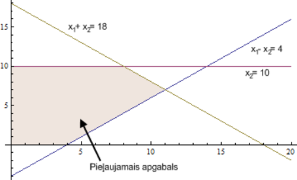
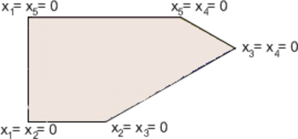

# &nbsp;

<hgroup>

<h1 style="font-size:28pt">Lietišķie algoritmi</h1>

<blue>Lineārā optimizācija - 1</blue>

</hgroup><hgroup style="font-size:90%">

**(1) Ievads**  
(2) [Optimizācijas uzdevumi](#section-1)  
(3) [Grafiskā interpretācija](#section-2)  
(4) [Simpleksa algoritma piemērs](#section-3)  
(5) [Simpleksa algoritma tabula](#section-4)  
(6) [(P) LP lietojumi](#section-5)  
(7) [Kopsavilkums](#section-6)

</hgroup>

<!--
P2.
Simpleksu metodes atkārtojums
Dualitāte
Simpleksu sarežģītība
Elipsoīdu  metode

P3.
Visādas iekšējo punktu metodes

https://www.abacademies.org/articles/an-application-of-linear-programming-in-performance-evaluation-6723.html
--> 

# <lo-why/> why

Kāpēc lineāru izteiksmju maksimizēšana  ir praktiski svarīga?

* Kāpēc risinām lineārās programmēšanas uzdevumus noteiktā formā? 
* Kāpēc simpleksu metode LP uzdevumu risināšanā 
ir praktiska un intuitīvi saprotama?

 
## <lo-theory/> Sasniedzamie rezultāti

1. Definēt dažus optimizācijas uzdevumu veidus (ar vai bez nosacījumiem).
2. Uzrakstīt lineārās programmēšanas uzdevumu vispārīgā formā.
3. Izveidot grafisku interpretāciju LP uzdevumam nelielam dimensiju skaitam.
4. Risināt LP uzdevumus ar simpleksu metodi. 

# &nbsp;

<hgroup>

<h1 style="font-size:28pt">Lietišķie algoritmi</h1>

<blue>Lineārā optimizācija - 1</blue>

</hgroup><hgroup style="font-size:90%">

(1) [Ievads](#section)  
**(2) Optimizācijas uzdevumi**  
(3) [Grafiskā interpretācija](#section-2)  
(4) [Simpleksa algoritma piemērs](#section-3)  
(5) [Simpleksa algoritma tabula](#section-4)  
(6) [(P) Lineārās programmēšanas lietojumi](#section-5)  
(7) [Kopsavilkums](#section-6)

</hgroup>

# <lo-theory/> Optimizācijas uzdevumu veidi

Optimizācijas uzdevumos mērķis ir maksimizēt (vai minimizēt) noteiktu funkciju 
(piemēram, peļņu vai izmaksas) pie kaut kādiem dotiem nosacījumiem. 

* Optimizācija bez nosacījumiem: Minimizēt $f(x_1, x_2, \ldots, x_n)$.
* Optimizācija ar nosacījumiem: Minimizēt $f(x_1, x_2, \ldots, x_n)$ pie nosacījumiem
$$c_1(x_1, x_2, \ldots, x_n) \geq 0, \ldots, c_k(x_1, x_2, \ldots, x_n) \geq 0,$$
$$d_1(x_1, x_2, \ldots, x_n) = 0, \ldots, d_{\ell}(x_1, x_2, \ldots, x_n) = 0.$$

## <lo-summary/> Piemērs: Kvadrātiskā programmēšana

Ja ievieš nosacījumus attiecībā uz funkciju $f$, 
tad iegūst šādus optimizācijas uzdevumu paveidus:

**Kvadrātiskā programmēšana:** Minimizēt
${\displaystyle \sum\limits_{i,j=1}^{n} a_{ij}x_ix_j +  \sum\limits_{i=1}^{n} b_ix_i }$
pie nosacījumiem
$$c_{11} x_1 + c_{12} x_1 + \ldots + c_{1n} x_n \leq d_1,$$
$$\ldots,$$
$$c_{m1} x_1 + c_{m2} x_1 + \ldots + c_{mn} x_n \leq dm$$,

Šajā gadījumā minimizējamā funkcija ir kvadrātiska, bet nosacījumi ir lineāri. 

## <lo-summary/> Piemērs: Lineārā programmēšana

**Lineārā programmēšana:** Minimizēt ${\displaystyle \sum\limits_{i=1}^{n} b_ix_i }$  pie nosacījumiem
$$c_{11} x_1 + c_{12} x_2 + \ldots + c_{1n} x_n \leq d_1,$$
$$\ldots,$$
$$c_{m1} x_1 + c_{m2} x_2 + \ldots + c_{mn} x_n \leq d_m,$$

*Piezīme:* Vārds "programmēšana" lietots nozīmē "plānošana". 
Dažus optimizācijas uzdevumu veidus sauc par programmēšanu jau 
kopš 1920.-tajiem gadiem. 

## <lo-summary/> Piemērs: Lineārā programmēšana

**Veselo skaitļu programmēšana:** 
Jeb lineārā programmēšana veselos skaitļos (*Integer Linear Programming* jeb 
*Integer Programming*): uzdevums tāds pats kā lineārā programmēšanā, 
tikai klāt nāk nosacījums, ka visi $x_1, x_2, \ldots, x_n$ visiem jābūt veseliem skaitļiem.

## <lo-summary/> Veseli vai reāli skaitļi?

Ar lineārajām programmām veselos skaitļos 
var aprakstīt daudzus interesantus un praktiski svarīgus uzdevumus, 
bet tām nav zināms algoritms, kas ātri (polinomiālā laikā) atrisina 
patvaļīgu veselo skaitļu programmu. 

**Apgalvojujums:** Veselo skaitļu programmēšanas uzdevums ir $NP$-pilns: 
tas pieder labi pazīstamai uzdevumu saimei, kurus var visus citu uz citu reducēt.  
(Efektīvs algoritms nav zināms, bet, ja tāds būtu, tad varētu efektīvi atrisināt uzreiz
$21$ slavenus uzdevumus un vēl daudzus simtus citu.)

Lineārām programmām reālos skaitļos efektīvi polinomiāli algoritmi ir. 
Tāpēc šajā kursā mēs tālāk apskatīsim tikai lineāras programmas, 
kuru mainīgie ir reāli skaitļi.

# <lo-sample/> LP Piemērs: Pārtikas iepirkšana

Ir zināmi produkti $1,\ldots, n$ ar cenām $p_1,\ldots, p_n$.
Ir $k$ uzturvielu tipi un vienā dienā cilvēkam vajadzīgs daudzums $c_i$ ar
uzturvielu $i$. Atrast lētāko produktu
kombināciju, kas nodrošina pietiekami daudz katras uzturvielas.

**Leonīds Kantorovičs (1912-1986)** (*Леонид Канторович*, 
*Leonid Kantorovich*):  
Optimāla izejvielu izmantošana finiera 
rūpniecībā (1939.g.). Agrīni optimizācijas uzdevumi bieži saistīti ar
ražošanas plānošanu, it īpaši situācijās, kurās nav brīvā tirgus.

## <lo-summary/> Pārtikas iepirkšanas lineārais modelis 

Ar $x_i$ apzīmējam $i$-tā produkta daudzumu, 
ko iegādāsimies. Tad jāminimizē kopējās izmaksas
$$p_1 x_1 + p_2 x_2 + \ldots + p_n x_n$$
pie nosacījumiem
$$x_1 \geq 0,\;\; x_2 \geq 0,\;\; \ldots,\;\; x_n \geq 0,$$
$$a_{11} x_1 + a_{12} x_2 + \ldots + a_{1n} x_n \geq c1,$$
$$\ldots,$$
$$a_{k1} x_1 + a_{k2} x_2 + \ldots + a_{kn} x_n \geq ck,$$
kur aij apzīmē $i$-tās uzturvielas daudzumu produktā $j$.

Ja produktu daudzumi ir mērāmi veselos skaitļos 
(piemēram, veselā skaitā 1L paku), 
tad iegūstam lineāro programmēšanu veselos skaitļos. 
Ja dažiem mainīgajiem jābūt veseliem, 
bet citi drīkst būt patvaļīgi reāli skaitļi, 
tad tā ir jauktā veselo skaitļu programmēšana 
(*mixed integer programming*).

# &nbsp;

<hgroup>

<h1 style="font-size:28pt">Lietišķie algoritmi</h1>

<blue>Lineārā optimizācija - 1</blue>

</hgroup><hgroup style="font-size:90%">

(1) [Ievads](#section)  
(2) [Optimizācijas uzdevumi](#section-1)  
**(3) Grafiskā interpretācija**  
(4) [Simpleksa algoritma piemērs](#section-3)  
(5) [Simpleksa algoritma tabula](#section-4)  
(6) [(P) Lineārās programmēšanas lietojumi](#section-5)  
(7) [Kopsavilkums](#section-6)

</hgroup>

# <lo-theory/> Vispārīgais un 2-dimensiju LP uzdevums

Daudzas reālās pasaules problēmas ir risināmas, 
izmantojot lineāro programmēšanu un eksistē efektīvs 
algoritms, kurš atrisina jebkuru LP uzdevumu.
Meklējam maksimumu funkcijai, ievērojot dotos ierobežojumus. 

Vispārīgā veidā maksimizēšanas uzdevums ir šāds:  
Atrast $\max(c_1x_1 + \ldots + c_nx_n)$  
ar nosacījumiem:
$$\left\{
\begin{array}{l}
a_{11}x_1 + a_{12}x_2 + \ldots + a_{1n}x_n \leq b_1\\
\ldots\\
a_{m1}x_1 + a_{m2}x_2 + \ldots + a_{mn}x_n \leq b_m
\end{array} \right.$$

## <lo-summary/> Mazs 2D piemērs

Atrast $\max(2x_1 + 3x_2)$.
$$\left\{ \begin{array}{l}
x_1 - 2x_2 \leq 4,\\
x_1 + x_2 \leq 18,\\
x_2 \leq 10,\\
x_1,x_2 \geq 0.
\end{array} \right.$$

*Piezīme.* Katrs maksimizācijas uzdevums ekvivalents kādam 
minimizācijas uzdevumam (un otrādi). Piemēram:
$$\max(2x_1 + 3x_2) = -\min(-2x_1 - 3x_2).$$ 
Turpmāk apskatīsim tikai maksimizācijas uzdevumus.

# <lo-theory/> Grafiskā reprezentācija

Lineārās programmēšanas uzdevumu var reprezentēt grafiski. 
Iepriekšējā piemērā doto uzdevumu var attēlot sekojoši:

No grafika viegli nolasīt uzdevuma atrisinājumu – tas ir punkts 
$(8,10)$.  Vairāku dimensiju gadījumā, var rasties grūtības 
uzkonstruēt attēlu. Ērtības labad pieņemam, ka pieļaujamais apgabals 
ir galīgs. Pretējā gadījumā izteiksme var pieņemt patvaļīgi 
lielas vērtības. Strikti runājot, jāliek pārbaudes, ka apgabals ir galīgs.

## <lo-summary/> Optimuma atrašanās

No attēla var pamanīt divus nozīmīgus faktus:

**Fakts 1:** Mērķfunkcija savu maksimumu sasniedz pieļaujamā apgabala stūrī.  
**Fakts 2:** Ja kādā stūri $a_1x_1 + \ldots + a_nx_n$ 
nesasniedz maksimumu, tad vienā no blakus stūriem 
$a_1x_1 + \ldots + a_nx_n$ ir lielāka vērtība.
 
Divu dimensiju gadījumā, piemēram, par 2.faktu var pārliecināties, 
lietojot ģeometrisko interpretāciju. 

## <lo-summary/> Kur atrodas maksimums

1.gadījumā iegūstam vienu no diviem rezultātiem:  
**(a)** $c_1x_1 + c_2x_2 \leq c$ visā pieļaujamajā apgabalā – stūris ir maksimums.  
**(b)** $c_1x_1+c_2x_2 \geq c$ visā pieļaujamajā apgabalā – stūris ir minimums.

2.gadījumā stūris nav nedz maksimums, nedz minimums un redzams, 
ka ir gan blakus stūris ar lielāku $c_1x_1+c_2x_2$ vērtību, gan blakus 
stūris ar mazāku vērtību.

# &nbsp;

<hgroup>

<h1 style="font-size:28pt">Lietišķie algoritmi</h1>

<blue>Lineārā optimizācija - 1</blue>

</hgroup><hgroup style="font-size:90%">

(1) [Ievads](#section)  
(2) [Optimizācijas uzdevumi](#section-1)  
(3) [Grafiskā interpretācija](#section-2)  
**(4) Simpleksa algoritma piemērs**  
(5) [Simpleksa algoritma tabula](#section-4)  
(6) [(P) Lineārās programmēšanas lietojumi](#section-5)  
(7) [Kopsavilkums](#section-6)

</hgroup>

# <lo-theory/> Simpleksa metode

Simpleksalgoritma pamatideja:

1. $v$ - patvaļīgs stūris
2. Kamēr $v$ ir blakus stūris $u$, kurā 
$c_{11}x_1+\ldots+c_nx_n$ lielāka, $v=u$.
 
Atkārtojam otro soli tik ilgi, kamēr nevar atrast blakus stūri, 
kurā mērķa funkcijai ir lielāka vērtība. 
 
Otrā fakta dēļ, ja tāda blakus stūra nav, tad mērķa funkcija 
sasniedz maksimālo vērtību visā pieļaujamajā apgabalā.

## <lo-summary/> Pārveidojuma piemērs

<hgroup>

Par uzdevuma standartformu sauc uzdevumu tādā formā, 
ka nosacījumi ir nevienādības formā $x_i \geq 0$ vai vienādības. 

Piemēram, lai nosacījumu $x_1 - 2x_2 \leq 4$ pārvērstu standartformā, 
ievieš papildus mainīgo $x_3 \geq 0$. Tātad:
$$x_1-2x_2 \leq 4\;\; \Leftrightarrow \;\; x_1-2x_2+x_3=4,\;x_3 \geq 0$$
Tādā veidā var iegūt ekvivalentu uzdevumu, kurā vienīgās nevienādības ir formā 
$x_i \geq 0$.

</hgroup>

<hgroup style="font-size:70%">

Piemēram: 
$$\max 2x_1 + 3x_2,\;\;\text{kur}$$
$$\left\{ \begin{array}{l} 
x_1-2x_2 \leq 4,\\
x_1+x_2 \leq 18,\\
x_2 \leq 10,\\
x_1,x_2 \geq 0. 
\end{array} \right.$$
 
Pārveidojot iegūst:
$$\max 2x_1 + 3x_2,\;\;\text{kur}$$
$$\left\{ \begin{array}{l}
x_1-2x_2+x_3=4,\\
x_1+x_2+x_4=18,\\
x_2+x_5=10,\\
x_1,x_2,x_3,x_4,x_5 \geq 0.
\end{array}$$

</hgroup>

## <lo-sample/> Nosacījumiem atbilstošais apgabals

Stūris - punkts, kur krustojas $2$ taisnes, kas atbilst nosacījumam - 
ir punkts, kurā divi no $x_1,\ldots,x_n= 0$. 
No iepriekšējā piemēra.

## <lo-sample/> Attēls ar stūriem

Plaknes gadījumā stūri var aprakstīt, pasakot kuri 
divi mainīgie ir vienādi ar $0$. Vairāku dimensiju gadījumā ir līdzīgi. 
Trīs dimensiju gadījumā stūris ir punkts, kurā $3$ mainīgie ir $0$.

Ja ir $k$ dimensijas $(\max a_1x_1 + \ldots + a_kx_k)$ stūris ir punkts, 
kur sastopas $k$ plaknes, t.i. $k$ mainīgie ir vienādi ar $0$.

# &nbsp;

<hgroup>

<h1 style="font-size:28pt">Lietišķie algoritmi</h1>

<blue>Lineārā optimizācija - 1</blue>

</hgroup><hgroup style="font-size:90%">

(1) [Ievads](#section)  
(2) [Optimizācijas uzdevumi](#section-1)  
(3) [Grafiskā interpretācija](#section-2)  
(4) [Simpleksa algoritma piemērs](#section-3)  
**(5) Simpleksa algoritma tabula**  
(6) [(P) Lineārās programmēšanas lietojumi](#section-5)  
(7) [Kopsavilkums](#section-6)

</hgroup>

# <lo-theory/> Simpleksalgoritms

Simpleksalgoritms tiks vispirms apskatīts ar piemēra palīdzību. 
Tiek apskatīts iepriekšējais piemērs:

$$\max 2x_1+3x_2$$
$$\left\{ \begin{array}{l}
x_1-2x_2+x_3=4\\
x_1+x_2+x_4=18\\
x_2+x_5=10\\
x_1,x_2,x_3,x_4,x_5 \geq 0 
\end{array} \right.$$

## <lo-summary/> Simpleksalgoritma tabulas

Simpleksalgoritma soļus ērti pierakstīt ar tabulas palīdzību. 
Sākotnējo tabulu sastāda tabulas rindiņās ierakstot uzdevuma ierobežojumus. 
Tabulas pēdējā rindiņa raksta funkciju, kuru maksimizēt. 

<table>
<tr>
<th>$x_1$</th>
<th>$x_2$</th>
<th>$x_3$</th>
<th>$x_4$</th>
<th>$x_5$</th>
<th>$b_i$</th>
<th>Atbilstošā izteiksme</th>
</tr>
<tr> 
<td>1</td>
<td>-2</td>
<td>1</td>
<td>0</td>
<td>0</td>
<td>4</td>
<td>$x_1-2x_2+x_3=4$</td>
</tr>
<tr>
<td>1</td>
<td>1</td>
<td>0</td>
<td>1</td>
<td>0</td>
<td>18</td>
<td>$x_1+x_2+x_4=18$</td>
</tr>
<tr>
<td>0</td>
<td>1</td>
<td>0</td>
<td>0</td>
<td>1</td>
<td>10</td>
<td>$x_2+x_5=10$</td>
</tr>
<tr style="color:blue;">
<td>2</td>
<td>3</td>
<td>0</td>
<td>0</td>
<td>0</td>
<td>&nbsp;</td>
<td>$\max\left(2x_1+3x_2\right)$</td>
</tr>
<tr>
<td colspan="2" style="background-color:#DAEEF3;">brīvie mainīgie</td>
<td colspan="3" style="background-color:#E5DFEC;">pamatmainīgie</td>
<td colspan="2">&nbsp;</td>
</tr>
</table>

$x_i = 0$ - brīvie mainīgie,  
$x_i \neq 0$ - pamatmainīgie.

## <lo-sample/> Tabula vispārīgā gadījumā

<table>
<tr>
<th>&nbsp;</th>
<th>&nbsp;</th>
<th>&nbsp;</th>
<th>&nbsp;</th>
<th>&nbsp;</th>
<th>&nbsp;</th>
<th>&nbsp;&nbsp;&nbsp;&nbsp;&nbsp;&nbsp;&nbsp;&nbsp;</th>
</tr>
<tr> 
<td>&nbsp;</td>
<td>$1$</td>
<td>$0$</td>
<td>$\ldots$</td>
<td>$0$</td>
<td>$b_1$</td>
<td>&nbsp;</td>
</tr>
<tr>
<td>&nbsp;</td>
<td>$0$</td>
<td>$1$</td>
<td>$\ldots$</td>
<td>$0$</td>
<td>$b_2$</td>
<td>&nbsp;</td>
</tr>
<tr>
<td>&nbsp;</td>
<td>$\ldots$</td>
<td>$\ldots$</td>
<td>$\ldots$</td>
<td>$\ldots$</td>
<td>$\ldots$</td>
<td>&nbsp;</td>
</tr>
<tr>
<td>&nbsp;</td>
<td>$0$</td>
<td>$0$</td>
<td>$\ldots$</td>
<td>$1$</td>
<td>$b_m$</td>
<td>&nbsp;</td>
</tr>
<tr style="color:blue;">
<td>$y_1\ldots{}y_k$</td>
<td>$0$</td>
<td>$0$</td>
<td>$\ldots$</td>
<td>$0$</td>
<td>&nbsp;</td>
<td>&nbsp;</td>
</tr>
<tr>
<td colspan="2" style="background-color:#DAEEF3;">$x_i = 0$</td>
<td colspan="3" style="background-color:#E5DFEC;">$x_i \neq 0$</td>
<td colspan="2">&nbsp;</td>
</tr>
</table>

Iepriekšējā piemērā tabula jau ir standartformā.

## <lo-sample/> Simpleksalgoritma solis

Esam stūrī, kuru apraksta iepriekšējā tabula. 
Pārbauda, vai blakus stūrī vērtība nav lielāka

1. Atrod brīvo mainīgo, kuru palielinot pieaug mērķfunkcija
2. Palielina šo mainīgo. Tas bija $0$, tagad pozitīvs, 
vienlaikus mainot pamatmainīgos tā, lai visi nosacījumi paliktu patiesi.
3. Ja kāds no pamatmainīgajiem ir $0$, apstājas.

Jāatrod mainīgais, kuru palielinot funkcijas vērtība pieaug. 
Der abi mainīgie. Piemēram, palielinām  $x_2$.
 
Ja $x_2$ pieaug par $d$:  
$x_1-2x_2+x_3$ samazinās par $2d$. Pēc nosacījumiem izteiksmei 
jābūt vienādai ar $4$. Lai to panāktu $x_3$ palielina par $2d$.  
$x_1+x_2+x_4$ pieaug par $d$. Lai saglabātu vienādību, 
$x_4$ samazina par $d$; $x_2+x_5$ pieaug par $d$. Jāsamazina $x_5$ par $d$.

# <lo-summary/> Piemēra turpinājums

Cik daudz var palielināt $x_2$, nepadarot citu mainīgo negatīvu?  
$x_3=4$, $x_4=18$, $x_5=10$.

Palielinot $x_2$:  
$x_3= 4 + 2d$
$x_4=18 - d$
$x_5=10 - d$.  
Ja $d = 10$, tad $x_5 = 0$. Ja $d > 10$, $x_5 < 0$. 
Tātad maksimālais palielinājums ir $10$.
 
Tādā gadījumā mēs būsim pārgājuši no stūra, 
kurā $x_1 = x_2 = 0$ uz stūri, kurā $x_1 = x_5 = 0$.

<table>
<tr>
<th>$x_1$</th>
<th>$x_5$</th>
<th>$x_3$</th>
<th>$x_4$</th>
<th>$x_2$</th>
<th>$b_i$</th>
<th>Atbilstošā izteiksme</th>
</tr>
<tr> 
<td>1</td>
<td>0</td>
<td>1</td>
<td>0</td>
<td>-2</td>
<td>4</td>
<td>$x_1-2x_2+x_3=4$</td>
</tr>
<tr>
<td>1</td>
<td>0</td>
<td>0</td>
<td>1</td>
<td>1</td>
<td>18</td>
<td>$x_1+x_2+x_4=18$</td>
</tr>
<tr>
<td>0</td>
<td>1</td>
<td>0</td>
<td>0</td>
<td>1</td>
<td>10</td>
<td>$x_2+x_5=10$</td>
</tr>
<tr style="color:blue;">
<td>2</td>
<td>0</td>
<td>0</td>
<td>0</td>
<td>3</td>
<td>&nbsp;</td>
<td>$\max\left(2x_1+3x_2\right)$</td>
</tr>
<tr>
<td colspan="2" style="background-color:#DAEEF3;">brīvie mainīgie</td>
<td colspan="3" style="background-color:#E5DFEC;">pamatmainīgie</td>
<td colspan="2">&nbsp;</td>
</tr>
</table>

## <lo-summary/> 2.solis

Lai izdarītu nākamo soli, tabula jāpārveido par ekvivalentu tabulu standartformā: 

1. Pareizina 3.rindu ar $2$, pieskaita 1.rindai
2. Atņem 3.rindu no 2.rindas

1.rinda: $x_1-2x_2+x_3=4$.  
3.rinda: $x_2+x_5=10$.
 
Jaunā 1.rinda $(x_1+x_3-2x_2)+2(x_5+x_2)=4 + 2 \cdot 10$. 

<table>
<tr>
<th>$x_1$</th>
<th>$x_5$</th>
<th>$x_3$</th>
<th>$x_4$</th>
<th>$x_2$</th>
<th>$b_i$</th>
<th>Atbilstošā izteiksme</th>
</tr>
<tr> 
<td>1</td>
<td>2</td>
<td>1</td>
<td>0</td>
<td>0</td>
<td>24</td>
<td>$x_1+2x_5+x_3=24$</td>
</tr>
<tr>
<td>1</td>
<td>-1</td>
<td>0</td>
<td>1</td>
<td>0</td>
<td>8</td>
<td>$x_1-x_5+x_4=8$</td>
</tr>
<tr>
<td>0</td>
<td>1</td>
<td>0</td>
<td>0</td>
<td>1</td>
<td>10</td>
<td>$x_2+x_5=10$</td>
</tr>
<tr style="color:blue;">
<td>2</td>
<td>0</td>
<td>0</td>
<td>0</td>
<td>3</td>
<td>&nbsp;</td>
<td>$\max\left(2x_1+3x_2\right)$</td>
</tr>
<tr>
<td colspan="2" style="background-color:#DAEEF3;">brīvie mainīgie</td>
<td colspan="3" style="background-color:#E5DFEC;">pamatmainīgie</td>
<td colspan="2">&nbsp;</td>
</tr>
</table>

## <lo-summary/> 3.solis

Jātiek vaļā arī no nenulles koeficienta pēdējā rindā:

<table>
<tr>
<th>$x_1$</th>
<th>$x_5$</th>
<th>$x_3$</th>
<th>$x_4$</th>
<th>$x_2$</th>
<th>$b_i$</th>
<th>Atbilstošā izteiksme</th>
</tr>
<tr> 
<td>1</td>
<td>2</td>
<td>1</td>
<td>0</td>
<td>0</td>
<td>24</td>
<td>$x_1+2x_5+x_3=24$</td>
</tr>
<tr>
<td>1</td>
<td>-1</td>
<td>0</td>
<td>1</td>
<td>0</td>
<td>8</td>
<td>$x_1-x_5+x_4=8$</td>
</tr>
<tr>
<td>0</td>
<td>1</td>
<td>0</td>
<td>0</td>
<td>1</td>
<td>10</td>
<td>$x_2+x_5=10$</td>
</tr>
<tr style="color:blue;">
<td>2</td>
<td>-3</td>
<td>0</td>
<td>0</td>
<td>3</td>
<td>-30</td>
<td>$\max\left(2x_1-3x_5\right)$</td>
</tr>
<tr>
<td colspan="2" style="background-color:#DAEEF3;">brīvie mainīgie</td>
<td colspan="3" style="background-color:#E5DFEC;">pamatmainīgie</td>
<td colspan="2">&nbsp;</td>
</tr>
</table>

## <lo-summary/> 4.solis

Iegūta tabula standartformā. 
Tā kā palielinot $x_5$ mērķa funkcija samazinātos, atliek palielināt $x_1$.

$x_1 = x_1 + d$,  
$x_3 = x_3 - d$,  
$x_3 = 24 - d$,  
$x_4 = x_4 - d$,   
$x_4 = 8 - d$,   
Ja $d=8$, tad $x_4=0$.

<table>
<tr>
<th>$x_4$</th>
<th>$x_5$</th>
<th>$x_3$</th>
<th>$x_1$</th>
<th>$x_2$</th>
<th>$b_i$</th>
<th>Atbilstošā izteiksme</th>
</tr>
<tr> 
<td>0</td>
<td>2</td>
<td>1</td>
<td>1</td>
<td>0</td>
<td>24</td>
<td>$x_1+2x_5+x_3=24$</td>
</tr>
<tr>
<td>1</td>
<td>-1</td>
<td>0</td>
<td>1</td>
<td>0</td>
<td>8</td>
<td>$x_1-x_5+x_4=8$</td>
</tr>
<tr>
<td>0</td>
<td>1</td>
<td>0</td>
<td>0</td>
<td>1</td>
<td>10</td>
<td>$x_2+x_5=10$</td>
</tr>
<tr style="color:blue;">
<td>0</td>
<td>-3</td>
<td>0</td>
<td>2</td>
<td>0</td>
<td>-30</td>
<td>$\max\left(2x_1-3x_5\right)$</td>
</tr>
<tr>
<td colspan="2" style="background-color:#DAEEF3;">brīvie mainīgie</td>
<td colspan="3" style="background-color:#E5DFEC;">pamatmainīgie</td>
<td colspan="2">&nbsp;</td>
</tr>
</table>

## <lo-summary/> 5.solis

Pārveidojam standartformā. 

<table>
<tr>
<th>$x_4$</th>
<th>$x_5$</th>
<th>$x_3$</th>
<th>$x_1$</th>
<th>$x_2$</th>
<th>$b_i$</th>
<th>Atbilstošā izteiksme</th>
</tr>
<tr> 
<td>-1</td>
<td>3</td>
<td>1</td>
<td>0</td>
<td>0</td>
<td>16</td>
<td>$-x_4+3x_5+x_3=16$</td>
</tr>
<tr>
<td>1</td>
<td>-1</td>
<td>0</td>
<td>1</td>
<td>0</td>
<td>8</td>
<td>$x_1-x_5+x_4=8$</td>
</tr>
<tr>
<td>0</td>
<td>1</td>
<td>0</td>
<td>0</td>
<td>1</td>
<td>10</td>
<td>$x_2+x_5=10$</td>
</tr>
<tr style="color:blue;">
<td>-2</td>
<td>-1</td>
<td>0</td>
<td>0</td>
<td>0</td>
<td>-30</td>
<td>$\max\left(-2x_4-x_5\right)$</td>
</tr>
<tr>
<td colspan="2" style="background-color:#DAEEF3;">brīvie mainīgie, $x_i = 0$</td>
<td colspan="3" style="background-color:#E5DFEC;">pamatmainīgie, $x_i \neq 0$</td>
<td colspan="2">&nbsp;</td>
</tr>
</table>

Brīvos mainīgos nevar palielināt tā, lai izteiksmes 
vērtība palielinātos. Sasniegts maksimums.

# &nbsp;

<hgroup>

<h1 style="font-size:28pt">Lietišķie algoritmi</h1>

<blue>Lineārā optimizācija - 1</blue>

</hgroup><hgroup style="font-size:90%">

(1) [Ievads](#section)  
(2) [Optimizācijas uzdevumi](#section-1)  
(3) [Grafiskā interpretācija](#section-2)  
(4) [Simpleksa algoritma piemērs](#section-3)  
(5) [Simpleksa algoritma tabula](#section-4)  
**(6) (P) Lineārās programmēšanas lietojumi**  
(7) [Kopsavilkums](#section-6)

</hgroup>

# &nbsp;

<hgroup>

<h1 style="font-size:28pt">Lietišķie algoritmi</h1>

<blue>Lineārā optimizācija - 1</blue>

</hgroup><hgroup style="font-size:90%">

(1) [Ievads](#section)  
(2) [Optimizācijas uzdevumi](#section-1)  
(3) [Grafiskā interpretācija](#section-2)  
(4) [Simpleksa algoritma piemērs](#section-3)  
(5) [Simpleksa algoritma tabula](#section-4)  
(6) [(P) Lineārās programmēšanas lietojumi](#section-5)  
**(7) Kopsavilkums**

</hgroup>

