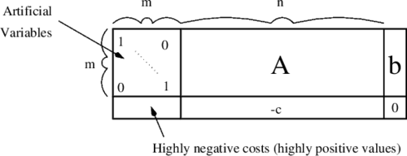
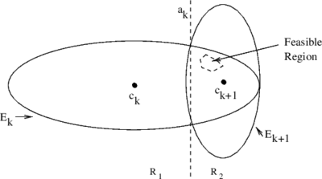
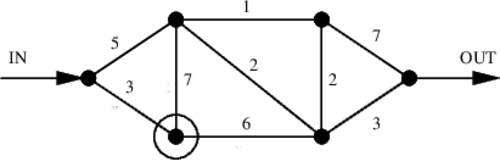
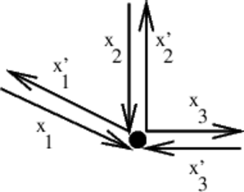

# &nbsp;

<hgroup>

<h1 style="font-size:28pt">Lietišķie algoritmi</h1>

<blue>Lineārā optimizācija - 2</blue>

</hgroup><hgroup style="font-size:90%">

**(1) Ievads**  
(2) [Vispārīgais simpleksalgoritms](#section-1)  
(3) [Duālā lineārā programma](#section-2)  
(4) [Sākotnējā stūra izvēle](#section-3)  
(5) [Elipsoīda algoritms](#section-4)  
(6) [(P) Plūsmu uzdevumi](#section-5)  
(7) [Kopsavilkums](#section-6)

</hgroup>

# <lo-why/> why

Kāpēc ar simpleksalgoritmu nepietiek?

* Simpleksalgoritma varianti (sākotnējā un duālā problēma,
pirmā stūra izvēle, pārejas izvēle un randomizācija). 
* Var būt slikta sarežģītība (īpaši uzkonstruētem piemēriem). 
* Polinomiāla laika algoritms ir standarts visam, ko lieto praksē.

 
## <lo-theory/> Sasniedzamie rezultāti

1. Definēt duālo uzdevumu. 
2. Formulēt dualitātes teorēmu. 
3. Noskaidrot simpleksalgoritma izvēles.
4. Formulēt Elipsoīda algoritmu (Khachiyan). 
5. LP lietojumi plūsmu maksimizēšanā un 
"operāciju pētīšanā". 

# &nbsp;

<hgroup>

<h1 style="font-size:28pt">Lietišķie algoritmi</h1>

<blue>Lineārā optimizācija - 2</blue>

</hgroup><hgroup style="font-size:90%">

(1) [Ievads](#section)  
**(2) Vispārīgais simpleksalgoritms**  
(3) [Duālā lineārā programma](#section-2)  
(4) [Sākotnējā stūra izvēle](#section-3)  
(5) [Elipsoīda algoritms](#section-4)  
(6) [(P) Plūsmu uzdevumi](#section-5)  
(7) [Kopsavilkums](#section-6)

</hgroup>

# <lo-theory/> Kāpēc LP ir svarīgas?

* (Reālo skaitļu) LP ir pirmais solis, lai risinātu 
veselo skaitļu problēmas (*Integer Programming, IP*) un 
jauktās LP problēmas (*Mixed Integer Linear Programs, MIP*). 
* Kā optimāli izvēlēties komplektu (izejvielas, akciju portfeļus), 
kā vislabāk sadalīt kādu resursu.
* Plūsmas maksimizēšana grafā (skatīsimies šajā lekcijā).

Veselie skaitļi kā nezināmie (*Integer Programming*) 
labāk modelē Yes/No lēmumu pieņemšanu (0 un 1 vērtības), 
bet šādus uzdevumus ir grūtāk risināt. 

## <lo-summary/> LP algoritmi 

* Simpleksalgoritmi (Kantorovičs, 1939; Dantzig, 1947).
* Elipsoīda algoritms (Khachian, 1979)
* Iekšējo punktu metodes (*Interior Point methods*).
    - Projektīvā metode (Karmarkar, 1984).
    - Afīnā metode (Dikin, 1967).
    - Log Barrier Method. 

Simpleksalgoritms parasti ir ļoti ātrs, bet īpaši uzkonstruēti
piemēri var būt sarežģīti.   
Matricām var būt ap 100 tūkstošiem rindiņu/kolonnu; ap miljons
skaitļu šajās matricās nav nulles. 

## <lo-summary/> Hamiltona cikli

<hgroup style="font-size:70%">

**Definīcija:** Par Hamiltona ciklu neorientētā grafā 
sauc virsotņu virknīti $A_0,A_1,\ldots,A_n$, kur
katra grafa virsotne piedalās tieši vienreiz (izņemot 
$A_0=A_n$ - pirmā visotne sakrīt ar pēdējo) un katras 
divas blakusesošas virsotnes savieno šķautne. 

</hgroup>
<hgroup>

**Jautājums:** Dots neorientēts grafs. Kā uzrakstīt 
lineāru vienādību vai nevienādību sistēmu, kuru atrisinot 
(vai pamatojot, ka atrisinājuma nav), var atrast Hamiltona ciklu 
grafā (vai pierādīt, ka šāda cikla nav)?

</hgroup>

# &nbsp;

<hgroup>

<h1 style="font-size:28pt">Lietišķie algoritmi</h1>

<blue>Lineārā optimizācija - 2</blue>

</hgroup><hgroup style="font-size:90%">

(1) [Ievads](#section)  
(2) [Vispārīgais simpleksalgoritms](#section-1)  
**(3) Duālā lineārā programma**  
(4) [Sākotnējā stūra izvēle](#section-3)  
(5) [Elipsoīda algoritms](#section-4)  
(6) [(P) Plūsmu uzdevumi](#section-5)  
(7) [Kopsavilkums](#section-6)

</hgroup>

# <lo-theory/> Primārā lineārā programma

Pieņemsim, ka ir lineāra programma (sauksim par <blue>*primāro LP*</blue>):

Maksimizēt $c_1 x_1 + c_2 x_2 + \ldots + c_n x_n$ pie šādiem nosacījumiem:
$$ \left\{ \begin{array}{l}
a_{11} x_1 + a_{12} x_2 + \ldots + a_{1n} x_n  \;\;\color{#F00}{?}\;\; b_1,\\
\ldots\\
a_{k1} x_1 + a_{k2} x_2 + \ldots + a_{kn} x_n \;\;\color{#F00}{?}\;\; b_k,\\
x_1 \geq 0,\; x_2 \geq 0,\;\ldots 
\end{array} \right.$$

LP var nebūt standartformā: 

* Nosacījumiem $a_{i1} x_1 + a_{i2} x_2 + \ldots + a_{in} x_n \;\;\color{#F00}{?}\;\; b_i$,  
jautājuma zīmes vietā var būt jebkura zīme ($\geq$, $\leq$, $=$). 
* Attiecībā uz mainīgajiem $x_i$ var būt nosacījumi $x_i \geq 0$, $x_i \leq 0$, 
vai vispār nebūt nosacījuma attiecībā uz $x_i$.

# <lo-theory/> Duālā LP uzdevuma definīcija

Par <blue>*duālo programmu*</blue> sauc tādu lineāro programmu, kur jāminimizē izteiksme:
$$b_1 y_1 + b_2 y_2 + \ldots + b_k y_k,$$
pie nosacījumiem
$a_{11} y_1 + a_{21} y_2 + \ldots + a_{k1} y_k \;\;\color{#F00}{?}\;\; c_k,$
kur simbols jautājuma zīmes vietā tiek noteikts šādi:

* Ja primārajā LP bija nosacījums $x_i \geq 0$, tad jautājuma zīmes vietā ir $\geq$.
* Ja primārajā LP bija nosacījums $x_i \leq 0$, tad jautājuma zīmes vietā ir $\leq$.
* Ja primārajā LP nebija nosacījuma attiecībā uz $x_i$, tad jautājuma zīmes vietā ir $=$.

Attiecībā uz mainīgajiem $y_1, y_2, \ldots, y_k$, nosacījumi ir atkarīgi no tā, 
kāda zīme bija primārās LP nosacījumā $a_{i1} x_1 + a_{i2} x_2 + \ldots + a_{in} x_n \;\;\color{#F00}{?}\;\; b_i$:

* Ja $?$ vietā bija $\geq$, tad mums tagad ir nosacījums $y_i \leq 0$.
* Ja $?$ vietā bija $\leq$, tad mums tagad ir nosacījums $y_i \geq 0$.
* Ja $?$ vietā bija $=$, tad mums tagad nav nosacījuma attiecībā uz $y_i$.

# <lo-sample/> LP Piemērs #1

<hgroup style="font-size:70%">

**Primārais LP uzdevums:**  
<blue>Maksimizēt</blue> $\color{#00F}{5x_1 + 16x_2}$ pie nosacījumiem
$$ \left\{ \begin{array}{l}
x_1 + x_2 \leq 1,\\
2x_1 + 7x_2 \leq 9,\\
x_1 \geq 0,\;\; x_2 \geq 0,
\end{array} \right.$$

</hgroup>
<hgroup style="font-size:70%">

**Duālais LP uzdevums:**  
<red>Minimizēt</red> $\color{#F00}{y_1+ 9y_2}$ pie nosacījumiem:
$$ \left\{ \begin{array}{l}
y_1 + 2y_2 \geq 5,\\
y_1 + 7y_2 \geq 16,\\
y_1 \geq 0,\;\; y_2 \geq 0.
\end{array} \right.$$

</hgroup>

## <lo-sample/> Duālās programmas nozīme

Duālo programmu var interpretēt šādi: katrs duālās programmas atrisinājums 
dod novērtējumu no augšas priekš primārās programmas atrisinājuma. 
Piemēram, ja mums ir duālās programmas atrisinājums $y_1 = y_2 = 2$, 
tad no duālās programmas nosacījumiem seko, ka
$$5x_1 + 16x_2 \leq  2(x_1 + x_2) + 2(2x_1 + 7x_2).$$
Apvienojot to ar primārās programmas nosacījumiem, mēs iegūstam, ka 
$$5x_1 + 16x_2  \leq  2 \cdot 1 + 2 \cdot 9 = 20,$$
tas ir, primārās LP mērķfunkcija jebkurā punktā ir mazāka 
par duālās programmas mērķfunkciju (arī jebkurā punktā, 
jo augstāk minētajā spriedumā $y_1 = y_2 = 2$ var aizstāt ar jebkuru 
citu punktu, kur izpildās visi duālās programmas nosacījumi). 

# <lo-theory/> Dualitātes teorēma

1. Ja primārajai LP eksistē maksimums, tad duālajai LP arī eksistē 
atrisinājums un primārās LP maksimums sakrīt ar duālās LP minimumu.
2. Ja primārajai LP neeksistē atrisinājums (nosacījumi ir pretrunīgi), 
tad duālajai LP mērķfunkcija var sasniegt patvaļīgi mazas vērtības.
3. Ja primārajai LP mērķfunkcija var sasniegt patvaļīgi lielas vērtības, 
tad duālajai LP atrisinājums neeksistē (nosacījumi ir pretrunīgi).

## <lo-theory/> Primārās un duālās LP apvienošana

Ja dotas primārā LP un duālā LP, varam uzrakstīt jaunu LP, 
kas satur visus mainīgos (gan $x_1, x_2, \ldots, x_n$, 
gan $y_1, y_2, \ldots, y_k$), 
gan visus nosacījumus no abām programmām un pievienot tai vēl vienu nosacījumu:
$$c_1 x_1 + c_2 x_2 + \ldots + c_n x_n = b_1 y_1 + b_2 y_2 + \ldots + b_k y_k.$$

Tad vienīgais gadījums, kad izpildās visi nosacījumi ir, ja 
$x_1, x_2, \ldots, x_n$ sasniedz primārās LP maksimums, bet 
$y_1, y_2, \ldots, y_k$ sasniedz duālās LP minimumu.

**Secinājums:** Ja mums ir algoritms, kas prot patvaļīgai LP atrast 
vienu punktu, kas apmierina visus nosacījumus, tad šo algoritmu 
var izmantot arī maksimuma atrašanai.

# <lo-sample/> LP Piemērs #2

<hgroup style="width:40%; font-size:70%;">

**Primārais LP uzdevums:** <blue>Maksimizēt:</blue> $\color{#00F}{4x_1 + 2x_2 - x_3}$, kur 
$$\left\{
\begin{array}{l}
x_1 + x_2 + x_3 = 20\\
2x_1 - x_2 \geq 6\\
3x_1 + 2x_2 + x_3 \leq 40\\
x_1,x_2 \geq 0
\end{array} \right.$$

</hgroup>
<hgroup style="width:10%; font-size:70%;">
&nbsp;
</hgroup>
<hgroup style="font-size:70%">

**Matricu pieraksts**

<blue>Maksimizēt skalāro reizinājumu:</blue>
$\color{#00F}{(4, 2, -1) \cdot (x_1,x_2,x_3)}$, kur 
$$A = \left(
\begin{array}{ccc}
1 & 1 & 1\\
2 & -1 & 0\\
3 & 2 & 1
\end{array} \right) \left(
\begin{array}{c}
x_1\\
x_2\\
x_3 \end{array} \right) 
\begin{array}{c}
=\\
\geq \\
\leq
\end{array}
\left(
\begin{array}{c}
20\\
6 \\
40
\end{array} \right).$$
un 
$$x_1 \geq 0,\;\;x_2 \geq 0,\;\;x_3\;\text{bez nosac.}.$$

</hgroup>

## <lo-sample/> LP Piemērs #2

<hgroup style="width:50%; font-size:65%;">

**Primārais LP uzdevums:**

<blue>Maksimizēt skalāro reizinājumu:</blue>
$\color{#00F}{(4, 2, -1) \cdot (x_1,x_2,x_3)}$, kur 
$$\left(
\begin{array}{ccc}
1 & 1 & 1\\
2 & -1 & 0\\
3 & 2 & 1
\end{array} \right) \left(
\begin{array}{c}
x_1\\
x_2\\
x_3 \end{array} \right) 
\begin{array}{c}
=^{\color{#080}{(a)}}\\
\geq^{\color{#080}{(b)}} \\
\leq^{\color{#080}{(c)}}
\end{array}
\left(
\begin{array}{c}
20\\
6 \\
40
\end{array} \right).$$
un  
$x_1 \geq^{\color{#080}{(d)}} 0$, $x_2 \geq^{\color{#080}{(e)}} 0$, $x_3\;\text{bez nosac.}^{\color{#080}{(f)}}$

</hgroup>
<hgroup style="width:50%; font-size:65%;">

**Duālais LP uzdevums:**  

<red>Minimizēt skalāro reizinājumu:</red> $\color{#F00}{(20,6,-40) \cdot \left( y_1, y_2, y_3 \right)}$, kur 
$$\left(
\begin{array}{ccc}
1 & 2 & 3\\
1 & -1 & 2\\
1 & 0 & 1
\end{array} \right) \left(
\begin{array}{c}
y_1\\
y_2\\
y_3 \end{array} \right) 
\begin{array}{c}
\geq^{\color{#080}{(d)}}\\
\geq^{\color{#080}{(e)}} \\
=^{\color{#080}{(f)}}
\end{array}
\left(
\begin{array}{c}
4\\
2 \\
-1
\end{array} \right).$$
un   
$$y_1\;\text{bez nosac.}^{\color{#080}{(a)}},\;y_2 \leq^{\color{#080}{(b)}} 0,\;\;y_3 \geq^{\color{#080}{(c)}} 0.$$

</hgroup>

::: notes

* Koeficientus iegūst, transponējot $A$. 
* Vienādību un nevienādību tipus nosaka atbilstoši 
augšminētajiem noteikumiem: Piemēram, ja $x_1 \geq 0$ primārajā 
problēmā, tad $x_1$ mainīgajam atbilstošais duālais vienādojums 
$y_1 + 2y_2 + 3y_3 \geq 4$. 

:::

# <lo-summary/> Duālais uzdevums (tikai nevienādības)

Dualitāte izsakāma īpaši vienkārši, ja visi nosacījumi ir nevienādības.

<hgroup>

**Primārais LP uzdevums:**  
Maksimizēt skalāro reizinājumu $z = \mathbb{c} \cdot \mathbb{x}$, kur 
$$\left\{ \begin{array}{l}
A\mathbb{x} \leq \mathbb{b}\\
\mathbb{x} \geq \mathbb{0} 
\end{array} \right.$$

</hgroup>
<hgroup>

**Duālais LP uzdevums:**  
Minimizēt skalāro reizinājumu $Z = \mathbb{y} \cdot \mathbb{b}$, kur
$$\left\{ \begin{array}{l}
A^{T}\mathbb{y} \geq \mathbb{c}\\
\mathbb{y} \geq \mathbb{0} 
\end{array} \right.$$

</hgroup>

## <lo-summary/> Dualitātes teorēma - 1

**Dualitātes teorēma:** 
(1) Ja $\mathbb{x}^{\ast}$ ir pieļaujams vektors primārajai problēmai 
(apmierina nevienādības $A\mathbb{x}^{\ast} \leq \mathbb{b}$ un 
$\mathbb{x}^{\ast} \geq \mathbb{0}$),  
(2) Un ja $\mathbb{y}^{\ast}$ ir 
pieļaujams risinājums duālajai problēmai 
(apmierina nevienādības 
$A^{T}\mathbb{y} \geq \mathbb{c}$ un $\mathbb{y} \geq \mathbb{0}$,  
TAD  
$\mathbb{c}\cdot \mathbb{x}^{\ast} \leq \mathbb{b} \cdot \mathbb{y}^{\ast}$.  

# <lo-summary/> Dualitātes teorēma - 2

**Dualitātes teorēma (turpinājums):** 
Ja turklāt $\mathbb{x}^{\ast}$ un $\mathbb{y}^{\ast}$ ir optimālie 
atrisinājumi attiecīgi primārajai un duālajai lineārajām programmām, tad 
$$\mathbb{c}\cdot \mathbb{x}^{\ast} = \mathbb{b} \cdot \mathbb{y}^{\ast}$$

**Definīcija:** Atšķirību $\mathbb{b} \cdot \mathbb{y}^{\ast} - \mathbb{c} \cdot \mathbb{x}^{\ast}$
sauc par <blue>*dualitātes atstarpi*</blue> 
(*duality gap*). Šīs atstarpes lielums palīdz noteikt, cik tālu 
pašreizējais atrisinājums (neoptimāls, bet pieļaujams vektors $\mathbb{x}$ 
vai attiecīgi $\mathbb{y}$) ir no optimālā.

# &nbsp;

<hgroup>

<h1 style="font-size:28pt">Lietišķie algoritmi</h1>

<blue>Lineārā optimizācija - 2</blue>

</hgroup><hgroup style="font-size:90%">

(1) [Ievads](#section)  
(2) [Vispārīgais simpleksalgoritms](#section-1)  
(3) [Duālā lineārā programma](#section-2)  
**(4) Sākotnējā stūra izvēle**  
(5) [Elipsoīda algoritms](#section-4)  
(6) [(P) Plūsmu uzdevumi](#section-5)  
(7) [Kopsavilkums](#section-6)

</hgroup>

# <lo-theory/> Mākslīgu mainīgo pievienošana - 1

**Gadījums Nr.1:** Dots LP uzdevums šādā formā:
$$A\mathbb{x} \color{#F00}{\leq} \mathbb{b},\;\;x \geq 0,\;\; \mathbb{b} \geq 0.$$

Var pievienot <blue>*nokares mainīgos*</blue> (*slack variables*), 
kas nosaka sākumstāvokli: visi vektora $\mathbb{x}$ mainīgie ir $0$, 
bet visi nokares mainīgie $\mathbb{y}$ vienādi ar attiecīgajām 
vērtībām $\mathbb{b}$. 

## <lo-summary/> Mākslīgu mainīgo pievienošana - 2

**Gadījums Nr.2:** Dots LP uzdevums, kur nevienādības vietā ir vienādība:
$$A\mathbb{x} \color{#F00}{\leq} \mathbb{b},\;\;x \geq 0,\;\; \mathbb{b} \geq 0,$$
tad pirmo tuvinājumu vispirms ir jāatrod. 

Viens no veidiem - sākt risināt nedaudz izmainītu uzdevumu. 

Katram mākslīgajam mainīgajam piekārtojam ļoti negatīvu $c_i$, 
lai noteikti nebūtu izdevīgi tam piešķirt nekādu pozitīvu vērtību.

## <lo-summary/> Mākslīgu mainīgo pievienošana - 3

Sākotnēji visi mākslīgie mainīgie ir "pamata mainīgie" (ja izmaksu 
vektora vērtības $c_i$ zem tiem var pataisīt par 0, izmantojot 
Gausa izslēgšanas metodi). 

Pēc tam simpleksa algoritms tos citu pēc cita padara par brīvajiem 
mainīgajiem.

1. Ja visi mākslīgie mainīgie kļūst brīvi, tad tiem atbilstošās kolonnas 
var turpmāk ignorēt (aprēķini šajās kolonnās vairs neiespaidos LP atrisinājumu), 
jo neviens no tiem nebūs pozitīvs.
2. Ja mākslīgie mainīgie saglabājas pie pamatmainīgajiem un tos izslēgt 
gājienu skaitā, kas sakristu ar šo mainīgo skaitu, neizdodas, tad nosacījumi ir 
pretrunīgi.

# &nbsp;

<hgroup>

<h1 style="font-size:28pt">Lietišķie algoritmi</h1>

<blue>Lineārā optimizācija - 2</blue>

</hgroup><hgroup style="font-size:90%">

(1) [Ievads](#section)  
(2) [Vispārīgais simpleksalgoritms](#section-1)  
(3) [Duālā lineārā programma](#section-2)  
(4) [Sākotnējā stūra izvēle](#section-3)  
**(5) Elipsoīda algoritms**  
(6) [(P) Plūsmu uzdevumi](#section-5)  
(7) [Kopsavilkums](#section-6)

</hgroup>

# <lo-summary/> Elipsoīda algoritma ievads

Šo algoritmu izgudroja Hačijans (Khachiyan) 1979. gadā.  
Elipsoīda algoritms pazīstams kā pirmais lineārās programmēšanas algoritms, 
kuram tika pierādīts, ka tas atrod atrisinājumu polinomiālā laikā ($O(n^4L)$),
kur $n$ - dimensiju skaits, $L$ – ar cik bitu precizitāti jāatrod atrisinājums. 

Lai gan teorētiski darbības laiks ir polinomiāls, praksē algoritms ir 
lēns un netiek lietots. Tāpēc šajā kursā mēs ierobežosimies ar īsu šī algoritma aprakstu.

## <lo-summary/> Elipsoīda algoritma pārskats

Dualitātes teorēmas (un redukcijas uz primāro+duālo) dēļ 
pietiek ar algoritmu, kas atrod punktu, kur izpildās visi nosacījumi. To meklē šādi:

Sāk ar elipsoīdu $E_0$, kas noteikti ietver LP pieļaujamo apgabalu.  
Pilda sekojošus soļus līdzkamēr sasniegta vajadzīgā precizitāte:

1. Ņem iepriekšējā elipsoīda $E_i$ centru $c_i$.
2. Ja $c_i$ neapmierina visus LP nosacījumus, tad atrod nosacījumu 
$a_k$, kas tiek pārkāpts visvairāk.
3. Ar plakni, kas sastāv no visiem punktiem, kur nosacījuma $a_k$ 
izteiksmei ir vienāda vērtība $c$ (kur $c$ ir pa vidu starp vērtību punktā 
$c_i$ un pieļaujamajām izteiksmes vērtībām) pārdala telpu divās daļās. 
Ar $R_1$ apzīmējam daļu, kur nonāk $c_i$ un ar $R_2$ apzīmējam daļu, 
kur nonāk pieļaujamais apgabals.
4. Uzkonstruē jaunu elipsoīdu $E_{i+1}$, tā lai izpildītos
$$E_i \cap R_2 \subseteq E_{i+1}.$$

## <lo-summary/> Apgalvojums par elipsoīdu

<hgroup>

</hgroup>
<hgroup>

Hačjana konstrukcijā (*barycentric coordinate descent*) elipsoīdi ir tādi, ka 
$$\frac{\text{Volume}(E_{k+1})}{\text{Volume}(E_{k})} = \frac{1}{2^{\frac{1}{2n+1}}}$$
veido konstantu attiecību, kas atkarīga no dimensiju skaita $n$. 

</hgroup>

# &nbsp;

<hgroup>

<h1 style="font-size:28pt">Lietišķie algoritmi</h1>

<blue>Lineārā optimizācija - 2</blue>

</hgroup><hgroup style="font-size:90%">

(1) [Ievads](#section)  
(2) [Vispārīgais simpleksalgoritms](#section-1)  
(3) [Duālā lineārā programma](#section-2)  
(4) [Sākotnējā stūra izvēle](#section-3)  
(5) [Elipsoīda algoritms](#section-4)  
**(6) (P) Plūsmu uzdevumi**  
(7) [Kopsavilkums](#section-6)

</hgroup>

# <lo-sample/> Maksimālās plūsmas atrašana grafā

Aplūkotajā grafā katrai šķautnei ir pierakstīta skaitliska vērtība - maksimālā 
atļautā plūsma, kuru pa šo šķautni var sūtīt (vai nu vienā, vai otrā virzienā). 
Var sūtīt arī mazāku plūsmu.   
**Uzdevums:** Atrast lielāko plūsmu no virsotnes "IN" uz virsotni "OUT". 

Šim uzdevumam 1956.g. tika izveidots [Forda-Falkersona algoritms](https://en.wikipedia.org/wiki/Ford%E2%80%93Fulkerson_algorithm) (*Ford-Fulkerson algorithm*), ko kursā neaplūkojam. 
Uzdevumu var arī reducēt uz Lineāro programmēšanu. 

# <lo-soln/> Lineārā programma

<hgroup style="font-size:70%">

Katrai (neorientētai) šķautnei ieviešam divus mainīgos, piemēram, $x_1$ un 
$x'_1$ (nenegatīvas plūsmas katrā no iespējamajiem virzieniem). 

</hgroup>
<hgroup style="font-size:70%">

1. Katrai virsotnei grafā rakstām "plūsmas saglabāšanās" ("flow preservation") 
vienādojumus. Piemēram, 
$$x_1 + x_2 + x'_3 = x'_1 + x'_2 + x_3.$$
2. Katrai šķautnei grafā rakstām divas nevienādības caurlaidībai ("edge capacity"). 
Piemēram, 
$$x_1 \leq 3,\;\;x'_1 \leq 3.$$
(Ja šķautne, kas atbilst $x_1$ un $x'_1$ ir ar caurlaidību $3$.)
3. Visas plūsmas ir nenegatīvas. Piemēram, 
$$x_1 \geq 0,\;\;x'_1 \geq 0.$$

</hgroup>

# <lo-soln/> Maksimizējamā funkcija

<hgroup>

</hgroup><hgroup>

1. Var maksimizēt plūsmu summu visām no "IN" izejošajām virsotnēm. 
2. Biežāk izmanto triku: pievieno fiktīvu šķautni no "OUT" atpakaļ uz "IN" - un maksimizē
plūsmu uz šīs vienas šķautnes.

</hgroup>

# <lo-theory/> Dualitātes lietošana max plūsmai

Sk. [Max Flow to Linear Programming](http://www.cs.cmu.edu/~odonnell/toolkit13/lecture14.pdf)

**Tipiska ideja:** No reālās dzīves nākušam Lineārās Programmēšanas 
uzdevumam formulējam duālo uzdevumu un mēģinām atrast šī uzdevuma interpretāciju. 

# &nbsp;

<hgroup>

<h1 style="font-size:28pt">Lietišķie algoritmi</h1>

<blue>Lineārā optimizācija - 2</blue>

</hgroup><hgroup style="font-size:90%">

(1) [Ievads](#section)  
(2) [Vispārīgais simpleksalgoritms](#section-1)  
(3) [Duālā lineārā programma](#section-2)  
(4) [Sākotnējā stūra izvēle](#section-3)  
(5) [Elipsoīda algoritms](#section-4)  
(6) [(P) Plūsmu uzdevumi](#section-5)  
**(7) Kopsavilkums**

</hgroup>

# <lo-theory/> Ko darījām šajā nodarbībā

1. Aplūkojām Hamiltona ciklus kā piemēru, kur veselo skaitļu programmēšana
atšķiras no lineārās programmēšanas.
2. Aprakstījām vispārīgo simpleksa algoritma iteratīvo soli.
3. Veidojām dotajam LP uzdevumam duālo. 
4. Formulējām dualitātes teorēmu. 
5. Minējām metodi sākotnējā tuvinājuma atrašanai (un pārbaudei, vai LP uzdevums
ir atrisināms un nav pretrunīgs). 
6. Aprakstījām elipsoīda algoritmu. 
7. Aprakstījām, kā maksimālo plūsumu grafā var formulēt kā LP uzdevumu.

