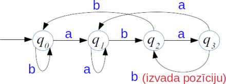
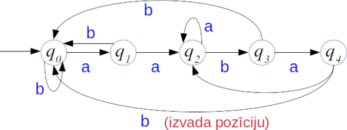
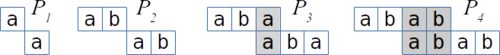
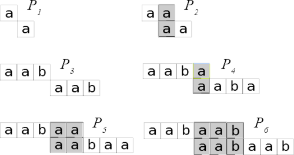

# &nbsp;

<hgroup>

<h1 style="font-size:28pt">Lietišķie algoritmi</h1>

<blue>Virkņu meklēšana - 1</blue>

</hgroup><hgroup style="font-size:90%">

**(1) Ievads**  
(2) [Pamatfakti un naivais algoritms](#section-1)  
(3) [Rabina-Karpa algoritms](#section-2)  
(4) [Meklēšana ar automātu](#section-3)  
(5) [Knuta-Morisa-Prata algoritms](#section-4)  
(6) [(P) Plaģiāta atrašana](#section-5)  
(7) [Kopsavilkums](#section-6)

</hgroup>

<!--
Meklēšana virknēs - 2
------
Ievads
Galīgi automāti
Bojera-Mūra algoritms
BM algoritma pareizība
(P) Regulāru izteiksmju atrašana
Kopsavilkums

Meklēšana virknēs - 3
------------
Ievads
Rekursīvu algoritmu sarežģītība
Dinamiskā programmēšana
Sufiksu koku jēdziens
Ukkonena algoritms
(P) Failu digitālnospiedumi (fingerprinting) un Blūma filtri
Kopsavilkums
-->

# <lo-why/> why

Kāpēc nepieciešami ātri un daudzveidīgi 
virkņu/stringu meklēšanas algoritmi?

* Teksta redaktori un dokumentu skatītāji
* Datu noplūdes novēršana, *Data Leak Prevention (DLP)*
* Dokumentu atrašana *Document retrieval*, Lucene/Elasticsearch.
* Plaģiāta meklēšana.

## <lo-summary/> Nodarbības mērķi 

* Lietot naivo stringu meklēšanas algoritmu. 
* Analizēt naivā algoritma sarežģītību.
* Analizēt Rabina-Karpa algoritmu, tā sarežģītību.
* Veidot KMP algoritma starprezultātu struktūras.
* Pamatot KMP algoritma pareizību un sarežģītību.

## <lo-summary/> Stringu meklēšanas lietojumi

* Teksta redaktori: 1 vārds, 1 dokuments
* Datu noplūdes novēršana (DLP): daudzi paraugi (vārdi, reg.izteiksmes), 
1 pārbaudāmais dokuments.
* Dokumentu atrašana (*Document retrieval*): nedaudzi paraugi, daudzi dokumenti, kam 
drīkst veikt priekšapstrādi/indeksāciju.
* Plaģiāta meklēšana: Daudzi dokumenti, 1 pārbaudāmais dokuments, atrast 
"kopētos-ielīmētos" (*Copy-Paste*) gabalus vai "kopētos-ielīmētos" un drusku parediģētos.

# &nbsp;

<hgroup>

<h1 style="font-size:28pt">Lietišķie algoritmi</h1>

<blue>Meklēšana virknēs - 1</blue>

</hgroup><hgroup style="font-size:90%">

(1) [Ievads](#section)  
**(2) Pamatfakti un naivais algoritms**  
(3) [Rabina-Karpa algoritms](#section-2)  
(4) [Meklēšana ar automātu](#section-3)  
(5) [Knuta-Morisa-Prata algoritms](#section-4)  
(6) [(P) Plaģiāta atrašana](#section-5)  
(7) [Kopsavilkums](#section-6)

</hgroup>

# <lo-theory/> Uzdevuma nostādne

Dots <blue>*teksts*</blue> (*text*) - virkne no $n$ simboliem:
$$T = T[0], \ldots, T[n-1]$$
Dots arī <blue>*paraugs*</blue> (*pattern*) - virkne no $m$ simboliem:
$$P = P[0], \ldots, P[m-1]$$

Vai virknē $T$ ir atrodama apakšvirkne $P$ (algoritms izvada vai nu tikai 1.pozīciju, kur $P$ ieiet virknē $T$, 
vai arī tas izvada visas pozīcijas).

**Definīcija:** Pozīciju tekstā $T$ (skaitli no $0$ līdz $n-1$), kur var sākties meklējamais
paraugs sauc par <blue>*nobīdi*</blue> (*shift*). 

## <lo-theory/> Apakšstringi un apakšvirknes

<blue>*Virkne*</blue> ir gan *sequence* (galīga vai bezgalīga, 
no jebkāda veida objektiem), gan *string* (galīga virkne ar galīga alfabēta burtiem). 
Parasti <blue>*virkni*</blue> var droši lietot kā sinonīmu vārdam <blue>*strings*</blue>, 
bet ir daži izņēmumi. 

**Definīcija:** Par virknes $T[0],T[1],\ldots,T[n-1]$ <blue>*apakšstringu*</blue> (*substring*) sauc 
simbolu virkni no $T[i]$ (ieskaitot virknes garumā $0,1,2,\ldots$), kur $i$ vērtības seko pēc kārtas.  
(Apakšstringu iegūst, sākotnējai virknei nosvītrojot (varbūt tukšus) gabalus sākumā un beigās.)

**Definīcija:** Par virknes $T[0],T[1],\ldots,T[n-1]$ <blue>*apakšvirkni*</blue> (*subsequence*) sauc 
simbolu virkni no $T[i]$ (ieskaitot virknes garumā $0,1,2,\ldots$), kur $i$ vērtības aug, bet var nebūt pēc kārtas.  
(Apakšvirkni iegūst, sākotnējā virknē nosvītrojot $0$ vai vairāk simbolus jebkurās vietās.)

## <lo-theory/> Apakšstringu, apakšvirkņu piemēri

<hgroup style="font-size:80%">

Virknes `"APPLE"` apakšstringi ir šīs $15$ virknes:  
`""` (tukšā virkne), `"A"`, `"E"`, `"L"`, `"P"`, `"AP"`, `"LE"`, `"PL"`, `"PP"`, 
`"APP"`, `"PLE"`, `"PPL"`, `"APPL"`, `"PPLE"` un `"APPLE"`.

$n$ simbolu virknei ir ne vairāk kā ${\displaystyle 1 + \frac{n(n+1)}{2}}$ apakšstringi
(to sasniedz, ja visi burti dažādi).

</hgroup>
<hgroup style="font-size:80%">

Virknes `"APPLE"` apakšvirknes ir šīs $24$ virknes:  
`""` (tukšā virkne), `"A"`, `"E"`, `"L"`, `"P"`, 
`"AE"`, `"AL"`, `"AP"`, `"LE"`, `"PE"`, `"PL"`, `"PP"`,
`"ALE"`, `"APE"`, `"APL"`, `"APP"`,  `"PLE"`, `"PPE"`, `"PPL"`, 
`"APLE"`, `"APPE"`, `"APPL"`, `"PPLE"`, `"APPLE"`.

$n$ simbolu virknei ir ne vairāk kā ${\displaystyle 2^n}$ apakšvirknes
(to sasniedz, ja visi burti dažādi).

</hgroup>

# <lo-theory/> Naivā algoritma pseidokods

<table class="pseudocode">
<tr><th colspan="2"><tt>Naive_String_Matcher</tt>($T$, $P$)</th></tr>
<tr>
<td>1</td>
<td>$n = T.\mathit{length}$</td>
</tr>
<tr>
<td>2</td>
<td>$m = P.\mathit{length}$</td>
</tr>
<tr>
<td>3</td>
<td><b>for</b> $i=0$ <b>to</b> $n-m$</td>
</tr>
<tr>
<td>4</td>
<td class="ind1"><b>if</b> ($P[0],\ldots,P[m-1]) == (T[i],\ldots,T[i+m-1]])$</td>
</tr>
<tr>
<td>5</td>
<td class="ind2">print "Paraugs parādās ar nobīdi" $i$</td>
</tr>
</table>

Novietojam vienu virkni zem otras un sākam salīdzināt:
$$ \begin{array}{llllll}
\ldots, & T[i], & T[i + 1], & \ldots, & T[i+m-1], & \ldots \\
& P[0], & P[1], & \ldots, & P[m-1] & 
\end{array}$$
Ja sakrīt visi $m$ elementi, kas ir paraugā, tad apakšstringu esam atraduši. 

# <lo-theory/> Naivā algoritma ātrdarbība

<hgroup style="font-size:70%;">

**Apgalvojums:** Naivā apakšstringu meklēšanas algoritma laika sarežģītība ir $O(n \cdot m)$ sliktākajā gadījumā.

Ir $n - m + 1$ iespējamās vērtības mainīgajam $s$. Katrai no tām var gadīties salīdzināt līdz $m$ simboliem. Laiks
$$(n - m + 1) \cdot m \approx n \cdot m.$$

**Piezīme:** Parasti pieņemam, ka meklējamais paraugs ir daudz īsāks par pašu tekstu: $m << n$.

</hgroup>
<hgroup style="font-size:70%;">

**Piemērs 1:** Uzlabot to nevar: 

$$T = \underbrace{\mathtt{aa}\ldots\mathtt{a}}_{n\;\text{burti}}$$
$$P = \underbrace{\mathtt{aa}\ldots\mathtt{a}}_{m\;\text{burti}}$$

**Piemērs 2:** Cits sliktākais gadījums (pat ja meklētu 
tikai vienu apakšstringu):

$$T = \underbrace{\mathtt{aa}\ldots\mathtt{a}}_{n\;\text{burti}}$$
$$P = \underbrace{\mathtt{aa}\ldots\mathtt{a}}_{m-1\;\text{burti}}\mathtt{b}$$

</hgroup>

# &nbsp;

<hgroup>

<h1 style="font-size:28pt">Lietišķie algoritmi</h1>

<blue>Meklēšana virknēs - 1</blue>

</hgroup><hgroup style="font-size:90%">

(1) [Ievads](#section)  
(2) [Pamatfakti un naivais algoritms](#section-1)  
**(3) Rabina-Karpa algoritms**  
(4) [Meklēšana ar automātu](#section-3)  
(5) [Knuta-Morisa-Prata algoritms](#section-4)  
(6) [(P) Plaģiāta atrašana](#section-5)  
(7) [Kopsavilkums](#section-6)

</hgroup>

# <lo-summary/> Stringu meklēšanas vietā skaitļi

Uztveram gan tekstu $T$, gan meklējamo paraugu $P$ kā 
(lielus) veselus skaitļus.

* Alfabētu (kurā pierakstīti $T$ un $P$) varbūt veido 
decimālcipari: $S = \{ 0,1,2,\ldots,9 \}$.
* Ja alfabēts ir lielāks, tad pieraksta $T$ un $P$ skaitīšanas sistēmā ar citu bāzi
(*radix-$d$ notation*), kur $d$ - burtu skaits alfabētā.

**Piemērs:** Dots strings `"pt"`. Ievērojam, ka burtu "p" un "t" ASCII 
baiti ir attiecīgi `x70` un `x74` (heksadecimālajā pierakstā). 
Tātad to decimālās vērtības ir attiecīgi $112$ un $116$. 
Un ASCII alfabētā ir pavisam $128$ simboli. 

Iegūstam, ka stringa `"pt"` vērtība bāzes-$128$ (*radix*-$128$) 
pierakstā būs $112 \cdot 128 + 116 = 14452$. 

## <lo-summary/> Rabina-Karpa algoritma pamatideja

1. Tekstā $T$ meklēsim ciparu virknes garumā $m$ (parauga $P$ garums), 
kas skaitliski vienādas ar $P$. 
2. Ar $t_s$ apzīmējam (decimālajā sistēmā pārveidotu) skaitli, 
ko veido skaitīšanas bāzē-$d$ (*radix*-$d$) cipari: 
$T[s],T[s+1],\ldots,T[s+m-1]$, kur nobīde
$s$ var būt $0,1,\ldots,n-m$.
3. Ja zināms $t_s$, tad $t_{s+1}$ var iegūt 
ar algebrisku triku:
$$t_{s+1} = \left( t_s - d^{m-1}T[s] \right) \cdot d + T[s+m].$$
    - No $t_s$ atņem kreisā/vecākā cipara vērtību $d^{m-1}T[s]$, 
    - Pabīda citus ciparus vienu pozīciju uz augšu (piereizina ar $d$),
    - Visbeidzot pieskaita jaunāko ciparu $T[s+m]$. 

## <lo-summary/> Pamatidejas piemērs

* Dots "teksts" 10-ciparu alfabētā: $T=\mathtt{31415926}$ 
(garums $n=8$); paraugs $P = \mathtt{14159}$ (garums $m=5$).
* Aplūkojam visus $T$ apakšstringus garumā $m=5$:
$$t_0 = 31415,\;t_1 = 14159,\,t_2=41592,\;t_3 = 15926.$$
* Pirmo skaitli $t_0 = \color{#F00}{\mathtt{31415}}$ iegūst ar <blue>*Hornera shēmu*</blue>:
$$t_0 = 10 \cdot (10 \cdot (10 \cdot (10 \cdot \color{#F00}{\mathtt{3}} + \color{#F00}{\mathtt{1}}) + \color{#F00}{\mathtt{4}}) + \color{#F00}{\mathtt{1}}) + \color{#F00}{\mathtt{5}} = 31415.$$
* $t_1$ iegūst no $t_0$ konstantā laikā (tāpat $t_2$ no $t_1$ utt.):
$$t_1 = (t_0 - 10^4 \cdot T[0])\cdot 10 + T[5] = (\color{#F00}{\mathtt{3}}\color{#0C0}{\mathtt{1415}} - 10000 \cdot \color{#F00}{\mathtt{3}}) \cdot 10 + \color{#F00}{\mathtt{9}} = \color{#0C0}{\mathtt{1415}}\color{#F00}{\mathtt{9}}.$$

## <lo-summary/> Ko dara ar ļoti lieliem skaitļiem

Meklējamie paraugi mēdz būt gari, polinomu vērtības, kas iegūstamas
ar Hornera shēmu, var būt lieli skaitļi. Lai algoritma ātrdarbība
no tā neciestu, pārbaudām nevis vienādību pašiem $t_s$ (teksta $T$ gabals
garumā $m$ nobīdīts par $s$ simboliem) ar paraugam $P$ atbilstošo 
bāzes-$d$ pieraksta skaitli $p$, bet gan kongruenci: 
$$t_s \equiv p\;(\text{mod}\,q),$$
kur $q$ izvēlas pietiekami lielu, lai bieži neparādītos 
<blue>*viltus trāpījumi*</blue> (*spurious hits*). 

# <lo-summary/> Rabina-Karpa pseidokods

<table class="pseudocode" style="font-size:70%">
<tr><th colspan="2"><tt>Rabin_Karp_Matcher</tt>($T$, $P$,$d$,$q$)</th></tr>
<tr>
<td>1</td>
<td>$n = T.\mathit{length}$</td>
</tr>
<tr>
<td>2</td>
<td>$m = P.\mathit{length}$</td>
</tr>
<tr>
<td>3</td>
<td>$h = d^{m-1}\,\text{mod}\,q$</td>
</tr>
<tr>
<td>4</td>
<td>$p = 0$</td>
</tr>
<tr>
<td>5</td>
<td>$t_0 = 0$</td>
</tr>
<tr>
<td>6</td>
<td><b>for</b> $i = 0$ <b>to</b> $m-1$&nbsp;&nbsp;<green>// saskaita pēc Hornera shēmas</green></td> 
</tr>
<tr>
<td>7</td>
<td class="ind1">$p = (d \cdot p + P[i])\,\text{mod}\,q$</td>
</tr>
<tr>
<td>8</td>
<td class="ind1">$t_0 = (d \cdot t_0 + T[i])\,\text{mod}\,q$</td>
</tr>
<tr>
<td>9</td>
<td><b>for</b> $s=0$ <b>to</b> $n-m$</td>
</tr>
<tr>
<td>10</td>
<td class="ind1"><b>if</b> $p==t_s$</td>
</tr>
<tr>
<td>11</td>
<td class="ind2"><b>if</b> $(P[0],\ldots,P[m-1]) == (T[s],\ldots,T[s+m-1])$</td>
</tr>
<tr>
<td>12</td>
<td class="ind3">print "Paraugs parādās ar nobīdi" $s$</td>
</tr>
<tr>
<td>13</td>
<td class="ind1"><b>if</b> $s < n-m$</td>
</tr>
<tr>
<td>14</td>
<td class="ind2">$t_{s+1} = (d(t_s - T[s]\cdot{}h) + T[s+m])\,\text{mod}\,q$</td>
</tr>
</table>

## <lo-summary/> Cik liela ir q vērtība

* Ja $q$ ir pārāk mazs, tad aritmētika pēc $q$ moduļa ir ļoti ātra, 
bet bieži rodas viltus trāpījumi. 
* Ja $q$ ir pārāk liels, tad reizināšanas tabulas uzbūvēšana modulārajai 
aritmētikai iznāk laikietilpīga.

# &nbsp;

<hgroup>

<h1 style="font-size:28pt">Lietišķie algoritmi</h1>

<blue>Meklēšana virknēs - 1</blue>

</hgroup><hgroup style="font-size:90%">

(1) [Ievads](#section)  
(2) [Pamatfakti un naivais algoritms](#section-1)  
(3) [Rabina-Karpa algoritms](#section-2)  
**(4) Meklēšana ar automātu**  
(5) [Knuta-Morisa-Prata algoritms](#section-4)  
(6) [(P) Plaģiāta atrašana](#section-5)  
(7) [Kopsavilkums](#section-6)

</hgroup>

# <lo-theory/> Ievadvirkni lasām tikai vienreiz

Pieņemsim, ka lietojam naivo meklēšanas algoritmu un nobīdes (shift) 
pašreizējā vērtība ir $i$, bet salīdzināšanu esam veikuši līdz 
pozīcijai $j$.

Ja izrādās, ka 
$$T[i] = P[0], \ldots, T[i + j - 1] = P[j - 1],$$
bet $T[i + j] \neq P[j]$, tad to izmanto, lai izvēlētos nākamo pāri $(i^{\ast},j^{\ast})$. 

Nav obligāti izvēlēties $(i^{\ast},j^{\ast}) = (i+1,0)$  kā naivajā algoritmā.

## <lo-theory/> Automāta pamatideja

<hgroup>

Apakšstringa meklēšana ar galīgu automātu:  
Automāta stāvokļi $q_0, q_1, \ldots, q_{m-1}$. 

**Prefiksu īpašība:** Stāvoklī $q_i$ atrodamies tad un tikai tad, ja 
"pēdējie $i$ simboli no $T$ sakrīt ar pirmajiem $i$ simboliem no $P$”. 

</hgroup>
<hgroup style="font-size:80%">

**Piemērs:** Parauga $P = \mathtt{abab}$ meklēšanas automāts:

*Piezīme.* Pēc $P = \mathtt{abab}$ atrašanas pārejam 
uz $q_2$ (nevis $q_0$), jo paraugi var pārklāties.

$$\mathtt{...ababab...}$$

</hgroup>

# <lo-sample/> Automāta konstrukcijas piemērs

**Uzdevums:** Uzzīmēt galīgu automātu, kas meklē `aabab` kā apakšvirkni 
ievadāmajā tekstā.

**Atrisinājums:**

# <lo-summary/> Laiks meklēšanai ar automātu

<hgroup>

**Teksta lasīšanas laiks:** Gatava automāta darbināšanai vajag $O(n)$ laiku: katram teksta burtam viena operācija.

**Parauga priekšapstrādes laiks:** Lai izveidotu automātu, 
jānosaka nākošais stāvoklis $q’$ jebkurai pašreizējā stāvokļa $q$ un pašreizējā burta kombinācijai.

</hgroup>
<hgroup style="font-size:70%">

Pavisam ir $m$ stāvokļi. Ar $|S|$ apzīmējam alfabēta $S$ burtu skaitu. 
Veidojas tabula ar $m \cdot |S|$ elementiem. Tam vajadzīgas vismaz $O(m \cdot |S|)$ operācijas.  
**Pilnais laiks:** $O(n + m \cdot |S|)$.

*Piezīme:* Priekšapstrādes laiks ir pārāk liels; praksē tā cenšas nedarīt - par to ir KMP algoritms. 
Pat pieņemot, ka $n >> m$, arī $m \cdot |S|$ var būt liels.

</hgroup>

# &nbsp;

<hgroup>

<h1 style="font-size:28pt">Lietišķie algoritmi</h1>

<blue>Meklēšana virknēs - 1</blue>

</hgroup><hgroup style="font-size:90%">

(1) [Ievads](#section)  
(2) [Pamatfakti un naivais algoritms](#section-1)  
(3) [Rabina-Karpa algoritms](#section-2)  
(4) [Meklēšana ar automātu](#section-3)  
**(5) Knuta-Morisa-Prata algoritms**  
(6) [(P) Plaģiāta atrašana](#section-5)  
(7) [Kopsavilkums](#section-6)

</hgroup>

# <lo-summary/> KMP pamatideja

* Izveidojam tabuliņu ar <blue>*prefiksu funkciju*</blue> (*prefix function*)
$\pi$ dotajam <blue>*paraugam*</blue> (*pattern*). 
Šī funkcija ietver zināšanas par to, kā paraugs $P$ sakrīt pats ar savām nobīdēm. 
    - Izvairāmies no 
nevajadzīgām nobīdēm naivajā meklēšanas algoritmā. 
    - Nav jāveido automāta stāvokļu diagramma ar atsevišķu bultiņu 
katram iespējamajam ievades simbolam $s \in S$. 

1. Ievade tiek lasīta tikai vienreiz: $O(n)$, nevis $O(n \cdot m)$, kā naivajam algoritmam.
2. Parauga $P$ priekšapstrāde notiks laikā $O(m)$, nevis $O(m\cdot|S|)$, kā pilnīgi izveidotam automātam.

# <lo-summary/> Prefiksu funkcija

Prefiksu funkcija ir atkarīga no meklējamā parauga. 
Turpmāk pieņemsim, ka ir dots $P$ - 

**Definīcija:** Katram $j$ ($j = 1,\ldots,m$) atrod maksimālo $k$, 
kam $k < j$ un izpildās šādi nosacījumi:
$$\left\{ \begin{array}{l}
P[0] = P[j - k]\\
P[1] = P[j - k + 1]\\
\ldots\\
P[k - 1] = P[j - 1]
\end{array} \right.$$

Atrasto $k$ ieraksta $\pi$ vērtību tabulā: $\pi[j]=k$.  
Ja nosacījumi neizpildās nevienam $k<j$, tad $\pi[j]=0$.

## <lo-summary/> Prefiksu funkcija (alternatīva definīcija)

**Apzīmējums:** Ja parauga $P$ garums ir $m$ simboli, tad ar 
$P_k$ apzīmējam vārda $P$ prefiksu garumā $k$:
$$P_0 = \mathtt{""},\;P_1=P[0],\;\ldots,\;P_m = P[0]\ldots{}P[m-1].$$

**Alternatīva $\pi(j)$ definīcija:** Dota meklējamā virkne jeb paraugs $P$ 
(tā garums ir $m$ simboli). Par paraugam atbilstošo 
prefiksu funkciju sauc funkciju $\pi(j)=k$, kas 
katram $j$ ($1 \leq j \leq m$) atrod to $k$ ($0 \leq k \leq m-1$), 
kur $k$ ir parauga $P$ $j$-tā 
prefiksa visgarākā sufiksa garums.

$\pi(j) = \max \left\{ k\,:\,k<j\;\text{un}\;P_k\;\text{ir vārda}\;P_j\;\text{sufikss} \right\}$

## <lo-sample/> Piemērs Nr.1

**Uzdevums:** Atrast prefiksu funkciju, kas atbilst 
meklējamajam paraugam $P = \mathtt{abab}$. 

**Risinājums ar sabīdīšanu:**

## <lo-sample/> Piemērs Nr.2

**Uzdevums:** Atrast prefiksu funkciju, kas atbilst 
meklējamajam paraugam $P = \mathtt{aabaab}$. 

**Risinājums ar sabīdīšanu:**

## <lo-sample/> Piemērs Nr.3

**Uzdevums:** Atrast prefiksu funkciju, kas atbilst
meklējamajam paraugam $P = \mathtt{ababaca}$.

## <lo-summary/> pi(j) sniegtā informācija

**Apzīmējums:** $i \in \{ 0,\ldots,n-m\}$ ir tekošā nobīde/*shift* 
tekstā $T$: pašreiz ceram, ka paraugs $P$ atradīsies tekstā $T$, sākot ar $i$-to pozīciju. 

Ja kārtējais $T$ simbols nesakrīt ar $P[j]$ 
(kādam $j \in \{ 0,\ldots,m-1\}$), tad ir spēkā:

$$\left\{ \begin{array}{lll}
T[i] & =P[j-k] & =P[0]\\
T[i+1] & =P[j-k+1] & =P[1]\\
\ldots & \ldots & \ldots\\
T[i+k+1] & =P[j-1] & =P[k-1]
\end{array} \right.$$

Tad mēs zināsim, ka nākošā pozīcija tekstā $T$, 
kur var parādīties apakšvirkne $P$, ir, sākot ar pēdējiem $k$ 
burtiem no jau nolasītā $T$ gabala. 

# <lo-summary/> KMP pseidokods

<table class="pseudocode">
<tr><th colspan="2">KMP_Matcher($T$, $P$)</th></tr>
<tr>
<td>1</td>
<td>$n = T.\mathit{length}$</td>
</tr>
<tr>
<td>2</td>
<td>$m = P.\mathit{length}$</td>
</tr>
<tr>
<td>3</td>
<td>$\pi =$Compute_Prefix_Function($P$)</td>
</tr>
<tr>
<td>4</td>
<td>$k=0$</td>
</tr>
<tr>
<td>5</td>
<td><b>for</b> $i=0$ <b>to</b> $n-1$</td>
</tr>
<tr>
<td>6</td>
<td class="ind1"><b>while</b> $k>0$ <b>and</b> $P[k+1] \neq T[i]$</td>
</tr>
<tr>
<td>7</td>
<td class="ind2">$k = \pi(k)$</td>
</tr>
<tr>
<td>8</td>
<td class="ind1"><b>if</b> $P[k+1] == T[i]$</td>
</tr>
<tr>
<td>9</td>
<td class="ind2">$k = k+1$</td>
</tr>
<tr>
<td>10</td>
<td class="ind1"><b>if</b> $k == m$</td>
</tr>
<tr>
<td>11</td>
<td class="ind2">print <tt style="font-family:'Courier New'">"Paraugs parādās ar nobīdi"</tt> $i-m$</td>
</tr>
<tr>
<td>12</td>
<td class="ind2">$k = \pi(k)$</td>
</tr>
</table>

# <lo-summary/> Prefiksu funkcijas veidošana

<table class="pseudocode">
<tr><th colspan="2">Compute_Prefix_Function($P$)</th></tr>
<tr>
<td>1</td>
<td>$m = P.\mathit{length}$</td>
</tr>
<tr>
<td>2</td>
<td>Rezervē tukšu tabulu $(\pi[0],\ldots,\pi[m-1])$</td>
</tr>
<tr>
<td>3</td>
<td>$\pi[0]=-1$</td>
</tr>
<tr>
<td>4</td>
<td>$k=0$</td>
</tr>
<tr>
<td>5</td>
<td><b>for</b> $q=1$ <b>to</b> $m-1$</td>
</tr>
<tr>
<td>6</td>
<td class="ind1"><b>while</b> $k>0$ <b>and</b> $P[k]\neq{}P[q]$</td>
</tr>
<tr>
<td>7</td>
<td class="ind2">$k=\pi[k]$</td>
</tr>
<tr>
<td>8</td>
<td class="ind1"><b>if</b> $P[k]==P[q]$</td>
</tr>
<tr>
<td>9</td>
<td class="ind2">$k=k+1$</td>
</tr>
<tr>
<td>10</td>
<td class="ind1">$\pi[q]=k$</td>
</tr>
<tr>
<td>11</td>
<td><b>return</b> $\pi$</td>
</tr>
</table>

<!--
k[0] = -1;
i = 0;
while (i < m) {
	k[i + 1] = k[i] + 1;
	while (k[i + 1] > 0 && P[i] != P[k[i + 1] - 1])
		k[i + 1] = k[k[i + 1] - 1] + 1;
	i = i + 1;
}

-->

## <lo-summary/> Prefiksu funkcijas veidošanas laiks

1. Ārējais cikls izpildās $m$ reizes. 
2. Katrā iekšējā cikla iterācijā $\pi[i+1]$ vērtība tiek samazināta. 
3. Tā kā šī vērtība tiek palielināta tikai katrā ārējā cikla iterācijā par $1$, 
tad tā var sasniegt ne vairāk kā $m$. Tā kā tā nevar būt negatīva, tad samazināties
var ne vairāk kā $m$ reizes, tātad iekšējais cikls kopumā izpildās ne vairāk kā $m$ reizes.

Tātad prefiksu funkcijas veidošanas laiks ir $O(m)$.

# &nbsp;

<hgroup>

<h1 style="font-size:28pt">Lietišķie algoritmi</h1>

<blue>Meklēšana virknēs - 1</blue>

</hgroup><hgroup style="font-size:90%">

(1) [Ievads](#section)  
(2) [Pamatfakti un naivais algoritms](#section-1)  
(3) [Rabina-Karpa algoritms](#section-2)  
(4) [Meklēšana ar automātu](#section-3)  
(5) [Knuta-Morisa-Prata algoritms](#section-4)  
**(6) (P) Plaģiāta atrašana**  
(7) [Kopsavilkums](#section-6)

</hgroup>

# <lo theory/> Daži tiešsaistes servisi

* **Turnitin** - komerciāls serviss, pārbauda studentu eseju līdzību ar 
tur jau esošiem darbiem. Abonēšanas modelis, darbojas kopš 1997.g.  
Vai ir ētiski gūt peļņu no studentu radītiem oriģināliem darbiem?
* **Plag.lv** - kaut kas līdzīgs. Sk. rakstu 
[Latvijā palaista programma...](https://www.tvnet.lv/4838652/latvija-palaista-programma-kas-atklaj-plagiatu-akademiskos-darbos). 
* **Symantec DLP**, **Forcepoint DLP** - organizāciju pasargāšana no 
konfidenciālu dokumentu noplūdes (pat ja dokumentu saturs ir izmainīts).

## <lo-summary/> Daži algoritmi

* Sufiksu koki 
* N-gramu algoritmi 
* [MinHash](https://en.wikipedia.org/wiki/MinHash); Andrei Broder (AltaVista, 1997).

# &nbsp;

<hgroup>

<h1 style="font-size:28pt">Lietišķie algoritmi</h1>

<blue>Meklēšana virknēs - 1</blue>

</hgroup><hgroup style="font-size:90%">

(1) [Ievads](#section)  
(2) [Pamatfakti un naivais algoritms](#section-1)  
(3) [Rabina-Karpa algoritms](#section-2)  
(4) [Meklēšana ar automātu](#section-3)  
(5) [Knuta-Morisa-Prata algoritms](#section-4)  
(6) [(P) Plaģiāta atrašana](#section-5)  
**(7) Kopsavilkums**

</hgroup>

# <lo-summary/> Ko darījām šajā nodarbībā

1. Apskatījām naivo virkņu meklēšanas algoritmu. 
2. Apskatījām Rabina-Karpa algoritmu. 
3. Apskatījām naivā algoritma uzlabojumu - meklēšanas automātu.
4. Veidojām KMP algoritmam vajadzīgo prefiksu funkciju.

