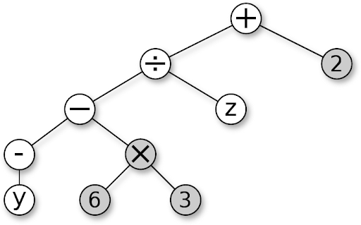
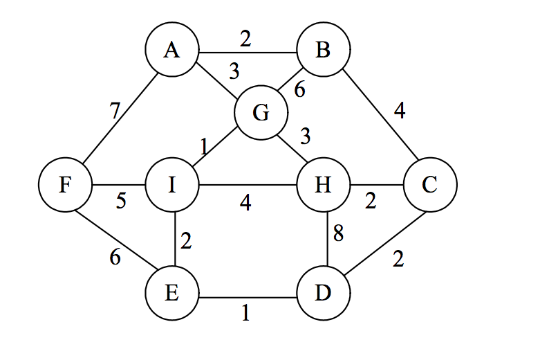
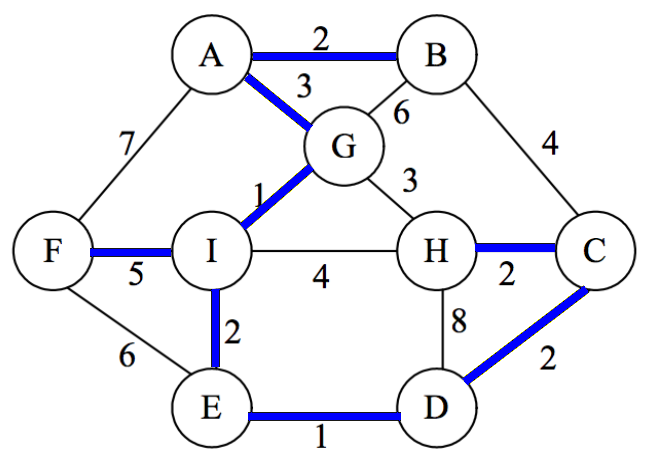

```{r setup, include=FALSE}
knitr::opts_chunk$set(echo = TRUE)
library(reticulate)
```


## Problem 1

By $U$ we denote the set of all positive integers 
between $1$ and $120$. This is our *universe* in which 
we define several subsets:
$$\left\{ \begin{array}{l}
A = \{ x \in U\;\mid\;2\mid{}x\},\\
B = \{ x \in U\;\mid\;3\mid{}x\},\\
C = \{ x \in U\;\mid\;5\mid{}x\},\\
X = \{ x \in U\;\mid\;2\mid{}x\;\vee\;3\mid{}x\},\\
Y = \{ x \in U\;\mid\;(3\mid{}x\;\wedge\;5\mid{}x)\;\vee\neg(2\mid{}x)\}.
\end{array} \right.$$

**(A)** Express $X$ using the sets $A,B,C$ (using set union $V \cup W$, 
set intersection $V \cap W$, set complement $\overline{V}$ operations).  
**(B)** Express $Y$ using the sets $A,B,C$ in a similar way.  
**(C)** Find $|X|$ - the size of the set $X$.  
**(D)** Find $|Y|$ - the size of the set $Y$.  


## Problem 2

Let $A$ and $B$ be sets with sizes $|A| = 8$ and $|B| = 5$
and $|A \cap B| = 3$. 

Calculate 
the largest and the smallest possible values 
for each of the following set sizes: 

**(A)** $|A \cup B|$.  
**(B)** $|A \times (B \times B)|$.  
**(C)** $\left| \mathcal{P}(\mathcal{P}(A \cap B)) \right|$ - the 
powerset of a powerset of $A \cap B$.  
**(D)** $|A \oplus B|$ - the symmetric difference of the sets $A$ and $B$.

 


## Problem 3

Consider the following recurrent sequence: 

$$\left\{ \begin{array}{l}
a_0 = 3\\
a_1 = 4\\
a_{n+2} = 5a_{n+1} - 6a_n,\;\text{if}\;n \geq 0 \\
\end{array}$$

Assume that $b_n$ is another sequence satisfying the 
recurrence rule
$$b_{n+2} = 5b_{n+1} - 6b_n,\;\text{if}\;n \geq 0$$
(The first two members $b_0,b_1$ are not known.)

**(A)** Write the first $6$ members of this sequence ($a_0,\ldots,a_5$).   
**(B)** Write the characteristic equation for this sequence.  
**(C)** Write the general expression for an arbirary sequence $b_n$
satisfying the recurrent expression as a sum of two geometric progressions (you can leave unknown coefficients in your answer; just explain which ones they are).  
**(D)** Write the formula to compute $a_n$ (that would satisfy 
the initial conditions $a_0 = 3$ and $a_1 = 4$).


## Problem 4

Consider this code snippet in Python:

```
n = 1000
sum = 0
for i in range(1, n*n+1):
    for j in range(1,i+1):
        sum += i % j
```

And a similar one in R:

```
n <- 1000
sum <- 0
for (i in 1:(n*n)) {
    for (j in 1:i) {
        sum <- sum + i %% j
    }
}

```

**(A)** Explain in human language what this algorithm does.   
**(B)** Denote by $f(n)$ the 
number of times the variable `sum` is incremented. 
Write the Big-O-Notation for $f(n)$. Find 
a function $g(n)$ such that 
$f(n)$ is in $O(g(n))$. (If there are multiple functions, 
pick the one with the slowest growth.)  
**(C)** Express the function $f(n)$ precisely - 
how many times `sum` is incremented in terms of variable $n$. 


## Problem 5

Let $A$ be the set of all positive divisors of the number $120$ 
(including $1$ and $120$ itself).  
**(A)** What is the multiplication of all 
numbers in the set $A$?  
**(B)** Express this number as the product of prime powers.


## Problem 6

Define the following binary relationship on the set of 
integer numbers $\mathbb{Z}$:   
We say that $aRb$ (numbers $a,b \in \mathbb{Z}$ are in the relation $R$) iff
$$\left\{ \begin{array}{l}
a - b \equiv 0\,(\text{mod}\;11)\\
a - b \equiv 0\,(\text{mod}\;12)\\
a - b \equiv 0\,(\text{mod}\;13)
\end{array} \right.$$


| Item  | Statement  |  True or False? |
|---------|-------------|:------:|
| **(A)** | $R$ is reflexive |    |
| **(B)** | $R$ is symmetric  |    |
| **(C)** | $R$ is antisymmetric |     |
| **(D)** | $R$ is transitive |     |
| **(E)** | $aRb$ iff $a=b$ |    |
    
For all items where you answered `FALSE`, specify a counterexample
(values for some numbers that would make the condition true, but the 
conclusion false). 
If the statement was true, write "none".


**(A)** counterexample ___  

**(B)** counterexample ___  

**(C)** counterexample ___  

**(D)** counterexample ___  

**(E)** counterexample ___  


        

## Problem 7

Four people $A,B,C,D$ each has his own hat. 
After the meeting they leave their 
building in a hurry, everyone grabs some hat at random 
so that all $4!$ permutations of the hats have equal probabilities. 

Let the random variable $X$ denote the number of hats that
were picked up correctly. (For example, if
the hat assignment is this: $(A \rightarrow A, 
B \rightarrow B, C \rightarrow D, D \rightarrow C)$, then 
$X = 2$, because two people got their own hats.)

**(A)** Find $E(X)$ - the expected value of $X$.  
**(B)** Find $V(X)$ - the variance of $X$. 


## Problem 8

There was a crooked man who had a crooked 1 euro coin. 
On lucky days it would flip the *heads* with probability $p=\frac{2}{3}$, 
and the *tails* with probability $p=\frac{1}{3}$, but on unlucky days
it was the opposite ($p(\mathtt{heads})=\frac{1}{3}$, but
$p(\mathtt{tails})=\frac{2}{3}$). 
There were equal probabilities of $\frac{1}{2}$ for lucky and unlucky days.

<!--
*Obverse/Heads is country specific; Reverse/Tails shows the value*
-->

One morning he flipped the coin $5$ times and altogether got three *heads* 
and two *tails*. 

Let us introduce the following events:

* $E$ (evidence): Five coin tosses result in three *heads* and two *tails*.
* $H$ (hypothesis): The current day is lucky. 

**(A)** Find $P(E|H)$ - the conditional probability of $E$ given that the 
day is lucky.  
**(B)** Find $P(E|H)\cdot P(H)$ - the probability that the day 
is lucky and $E$ happens.  
**(C)** Find $P(E|\overline{H})$ - the conditional probability of $E$
given that the day is not lucky.  
**(D)** Find $P(E|\overline{H})\cdot P(\overline{H})$ - the probability 
that the day is unlucky and $E$ happens.   
**(E)** Find $P(E)$ - as the sum of two probabilities ($E$ happened
on a lucky day and also $E$ happened on unlucky day).  
**(F)** Find the conditional probability $P(H|E)$ - 
the likelyhood that the croocked man has a lucky day, given 
that the event $E$ has happened.


## Problem 9


  
*Figure: A syntax tree for an expression*

The syntax tree describes an algebraic expression (please note
the difference between the unary minus that
flips the value of the variable $y$ and 
the binary minus that subtracts the 
two subexpressions: $-y$ and $6 \times 3$). 

**(A)** Write the preorder DFS traversal of
this tree.  
**(B)** Write the inorder DFS traversal of 
this tree.  
**(C)** Write the postorder DFS traversal of 
this tree.

*Note.* In all $3$ answers denote the unary 
minus with the tilde sign $\sim$, 
but the regular/binary minus with $-$. 


## Problem 10


  
*Figure: Graph with 9 vertices*

Run the Prim's algorithm on the following weighted graph, 
start growing the tree from the vertex $I$. 


| Step  | Newly Added Edge |
|---------|-------------|
| **Step 1** |          |
| **Step 2** |          |
| **Step 3** |          |
| **Step 4** |          |
| **Step 5** |          |
| **Step 6** |          |
| **Step 7** |          |
| **Step 8** |          |

What is the total weight of the obtained Minimum Spanning Tree? ______


# Answers


## Problem 1

**(A)** $X = A \cup B$ (Boolean OR means set union)  
**(B)** $Y = (B \cap C) \cup \overline{A}$ (Boolean and means set intersection; negation means set complement)  
**(C)** $|X| = |A| + |B| - |A \cap B| = 120+60-20 = 160$ (principle of inclusion-exclusion).  
**(D)** $|Y|$ is all odd numbers and also 
four even numbers divisible by $15$
($30, 60, 90, 120$). The total is $60 + 4 = 64$. 

## Problem 2

In all the answers the largest and the smallest value are equal, because
we know exactly how the two sets intersect; how many elements belong to just
one of the sets $A$, $B$, and how many elements belong to the both sets. 

**(A)** $|A \cup B| = |A| + |B| - |A \cap B| = 8+5-3 = 10$ (the principle of inclusion-exclusion).  
**(B)** $|A \times (B \times B)| = 8 \cdot 5 \cdot 5 = 200$ (Cartesian product has size that is the product of all participant sets: one can combine three elements from the sets $A$, $B$ and $B$ in this many ways).  
**(C)** $2^{2^3} = 2^8 = 256$ (the number of elements in the powerset of any set $X$ can be obtained by raising $2$ to the power $|X|$).  
**(D)** $|A \oplus B| = (8-3) + (5-3) = 7$ (we remove the common elements from both $A$ and $B$). 

## Problem 3

**(A)** $a_0 = 3$,  
$a_1 = 4$,  
$a_2 = 5\cdot 4 - 6 \cdot 3 = 2$,  
$a_3 = 5\cdot 2 - 6 \cdot 4 = -14$,  
$a_4 = 5\cdot(-14) - 6 \cdot 2 = -82$,  
$a_5 = 5\cdot(-82) - 6 \cdot (-14) = -326$,  
$a_6 = 5\cdot(-326) - 6 \cdot (-82) = -1138$.

**(B)** The characteristic equation is obtained, if we try to find $a_n$ 
in the form of a geometric progression $r^n$:   
$r^{n+2} = 5r^{n+1} - 6r^n,$ or  
$r^2 -5r + 6 = 0$.   
It has two roots: $r_1 = 2$, $r_2 = 3$. 

**(C)** The general form of the expression for any iterative
sequence $b_n$ satisfying the relationship $b_{n+2} = 5b_{n+1} - 6b_n$ is as follows:
$$b_n = A \cdot 2^n + B \cdot 3^n,$$
where $A,B$ are two constants that depend on the two initial values of the sequence $b_n$. 

**(D)** We need to solve a system of two equations, to ensure that the formula
$a_n = A \cdot 2^n + B \cdot 3^n$ has correct values for $n=0$ and $n=1$. 
We get the following system: 
$$\left\{ \begin{array}{l} 
A + B = 3,\\
2A + 3B = 4.\\
\end{array} \right.$$
Substitute $B = 3-A$ into the second equation. We get that 
$2A + 9 - 3A = 4$ and $A = 5$. We also get that $B = -2$. 
Therefore the exact formula to calculate the sequence $a_n$ is this:
$$a_n  = 5 \cdot 2^n - 2 \cdot 3^n,\;\text{where}\;n \geq 0.$$
This actually works, if we plug in the values calculated in **(A)** for $n = 0,\ldots,6$.


## Problem 4 

**(A)** The algorithm takes all numbers $i$ from $1$ to $n^2$ and
divides them by all the smaller numbers $j < i$, and adds up all the obtained remainders.

**(C)** The outer loop is repeated $n^2$ times. The inner loop is repeated
$1 + 2 + 3 + \ldots + n^2$ times. This is an arithmetic progression.
The sum of an arithmetic progression is the arithmetic mean of the first and the last 
member multiplied by the number of members: 
$$f(n) = \frac{1 + n^2}{2} \cdot n^2 = \frac{n^4 + n^2}{2}.$$

**(B)** $f(n)$ is in $O(n^4)$. Therefore we can take $g(n) = n^4$. We can
pick another $g(n)$ that is multiplied by some nonzero constant
(such as $\frac{n^4}{2}$ or $17n^4$ or anything else - that also counts
as a valid answer).  
Certainly, $f(n)$ is also in $O(n^k)$ for any $k > 4$, but the function $g(n) = n^4$ 
is the slowest growing. 


## Problem 5

**(A)** If expressed as a product of two positive integers $120 = ab$, 
one of the divisors $a$ or $b$ would be smaller than $\sqrt{120} \approx 11$, and the other
one would be bigger. We can easily list all the ways to express $120$ 
as a product of two integers: 
$$1 \cdot 120 = 2 \cdot 60 = 3 \cdot 40 = 4 \cdot 30 = 5 \cdot 24 = 6 \cdot 20 = 8 \cdot 15 = 10 \cdot 12,$$
and there are no other factorizations, since all the divisors less than $11$ are
already listed.  
Multiplying them all together would give 
$$(120)^8 = 42998169600000000$$

**(B)** As a product of prime factors:
$$(120)^8 = (2^3 \cdot 3 \cdot 5)^8 = 2^{24} \cdot 3^8 \cdot 5^8.$$


## Problem 6


| Item  | Statement  |  True or False? |
|---------|-------------|:------:|
| **(A)** | $R$ is reflexive | TRUE |
| **(B)** | $R$ is symmetric  | TRUE |
| **(C)** | $R$ is antisymmetric | FALSE |
| **(D)** | $R$ is transitive | TRUE |
| **(E)** | $aRb$ iff $a=b$ | FALSE |

**(A)** Counterexample: None  
**(B)** Counterexample: None  
**(C)** Consider counterexample $a=0$, $b = 11 \cdot 12 \cdot 13 = 1716$.  
While it is true that $aRb$ and $bRa$, nevertheless $a \neq b$.  
**(D)** Counterexample: None  
**(E)** Counterexample is same as in **(C)**: $a=0$, $b = 1716$.


## Problem 7

* For $1$ of $24$ permutations $X = 4$ (all hats stay in place),
* For $0$ permutations $X = 3$ (it is not possible for exactly three hats to stay in place, because
then the 4th hat also returns to its owner),
* For $6$ of $24$ permutations $X = 2$ (there are ${4 \choose 2} = 6$ ways how to pick $2$ hats
that stay in place; and the remaining two hats can switch places only in one way),
* For $8$ of $24$ permutations $X = 1$ (there are ${4 \choose 1} = 4$ ways how to pick $1$ hat
that stays in place; and the remaining three hats can rotate in two ways). 
* For the remaining $24 - (1 + 6 + 8) = 9$ permutations $X = 0$ (no hats stay in place).

**(A)** $E(X) = \frac{1}{24} \cdot 4 + \frac{6}{24} \cdot 2 + \frac{8}{24} \cdot 1 = 1$. 
This means that the expected number of hats that stay in place is exactly $1$.  
**(B)** For all $24$ permutations, subtract the value $E(X) = 1$ from 
every hat experiment outcome. To make addition faster, we group the terms
by their value (one value $X=4$, six values $X=2$ and so on):
$$V(X) = \frac{(4 - E(X))^2 + 6 \cdot (2-E(X))^2 + 8 \cdot (1 - E(X))^2 + 9 \cdot (0 - E(X))^2 }{24} = \frac{3^2 + 6 \cdot 1^2 + 8 \cdot 0^2 + 9 \cdot (-1)^2}{24} = \frac{24}{24} = 1.$$
Therefore, $V(X) = 1$ (variance also equals $1$, but the unit of measurement 
is not hats but ``hats squared''). 


## Problem 8

**(A)** $P(E|H)$ is the outcome of the Binomial distribution: 
There are $n=5$ coin-toss experiments; the probability of success for any single experiment 
is $p = \frac{2}{3}$ (since we know that the day is lucky and hypothesis $H$ holds). 
Therefore, 
$$P(E|H) = {5 \choose 3} p^3 (1-p)^2 = 10 \left( \frac{2}{3} \right)^3 \left( \frac{1}{3} \right)^2 = 
\frac{80}{243}$$

**(B)** $P(E|H)\cdot P(H) = \frac{80}{243}\cdot\frac{1}{2}= \frac{40}{243}$, 
since $P(H) = \frac{1}{2}$ (the *a priori* probability of a lucky day is exactly $1/2$). 

**(C)** $P(E|\overline{H})$ is the outcome of the Binomial distribution: 
Again, there are $n=5$ coin-toss experiments, but now the probability of a single
experiment is just $p = \frac{1}{3}$. Therefore, 
$$P(E|\overline{H}) = {5 \choose 3} p^3 (1-p)^2 = 10 \left( \frac{1}{3} \right)^3 \left( \frac{2}{3} \right)^2 = 
\frac{40}{243}$$

**(D)** $P(E|\overline{H}) \cdot P(\overline{H}) = \frac{40}{243}\cdot\frac{1}{2} = \frac{20}{243}$. 

**(E)** We can compute $P(E)$ as the sum of two mutually incompatible events: 
event $E$ can happen either on a lucky day or on an unlucky day: 
$$P(E) = P(E|H)\cdot P(H) + P(E|\overline{H}) \cdot P(\overline{H}) = 
\frac{40}{243} + \frac{20}{243} = \frac{60}{243}.$$

**(F)** Use Bayes formula: 
$$P(H|E) = \frac{P(E|H) \cdot P(H)}{P(E|H) \cdot P(H) + P(E|\overline{H}) \cdot P(\overline{H})}  = \frac{P(E|H) \cdot P(H)}{P(E)} = \frac{ \frac{40}{243}}{ \frac{60}{243}} = \frac{2}{3}.$$

Bayes formula is intuitive: It shows the proportion of the 
subcase $P(E|H) \cdot P(H)$ (i.e. event $E$ hapens on a lucky day) out of the
whole probability $P(E) = P(E|H)\cdot P(H) + P(E|\overline{H}) \cdot P(\overline{H})$
(i.e. event $E$ happens either on a lucky or unlucky day). 


## Problem 9

**(A)** $\mathtt{+:-\sim{}y\times6\;3\;z\;2}$,  
**(B)** $\mathtt{y\sim{}-\,6\,\times3:z\,+\,2}$,  
**(C)** $\mathtt{y\sim{}6\;3\,\times-\,z\,:2\,+}$.

Note: In inorder traversal (**(B)**) we first visit 
the first subtree (e.g., $\mathtt{y}$), and only then the 
parent node (e.g., unary minus $\sim$). 
See (Rosen2019, p.811).


## Problem 10

We start from vertex $I$. At every step we 
grow the tree by a single edge (so that it stays connected
and the newly added edge has the smallest possible weight). 


| Step  | Newly Added Edge |
|---------|----------------|
| **Step 1** | $IG$, $w=1$ |
| **Step 2** | $IE$, $w=2$ |
| **Step 3** | $ED$, $w=1$ |
| **Step 4** | $DC$, $w=2$ |
| **Step 5** | $CH$, $w=2$ |
| **Step 6** | $GA$, $w=3$ |
| **Step 7** | $AB$, $w=2$ |
| **Step 8** | $IF$, $w=5$ |

The total weight of all added edges (same as the total weight of the MST) is $18$. 

  
*Figure: MST edges shown in blue*