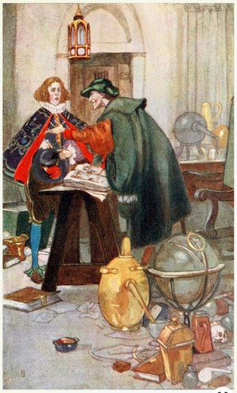

# &nbsp;

<hgroup>

<h1 style="font-size:28pt">Discrete Structures</h1>

<blue>Logic and Proofs - 1   
(Propositional Logic)</blue>

</hgroup><hgroup style="font-size:90%">

**(1) Course Introduction**  
(2) [APA Style and LaTeX](#section-1)  
(3) [Statements and Propositions](#section-2)  
(4) [Boolean Operations](#section-3)  
(5) [Rules of Reasoning](#section-4)  
(6) [Truth Tables](#section-5)  
(7) [Some Proof Techniques](#section-6)  
(8) [Proposition Handling in Coq](#section-7)  
(9) [References](#section-8)

</hgroup>

# <lo-why/> why

(The Overal Course): Why you should study discrete mathematics?  

* Write proofs and communicate accurately.
* Implement various datatypes ("discrete structures") and algorithms.
* Count, classify and organize sets objects.
* Use them in real-world and computer-based modelling.

[See Simon Sinek in Vegas "Start with Why"](https://www.youtube.com/watch?v=MNSAolUgFYQ).

::: notes

* Why students should not just try to pass the course, but actually join the instructor 
learning "Discrete Structures"?
* Many worthwhile subjects could be taught in RBS. How about Ancient Greek literature?
[The Management Myth](https://www.theatlantic.com/magazine/archive/2006/06/the-management-myth/304883/) - 
how philosophy and literature is related to management science. 

:::

# <lo-summary/> Goals vs. Tools/Activities

<hgroup>

**Goals:**

* Explain certain important things unambiguously (to humans and computers alike). 
* Being part of the community (sometimes called "nerds").
* **WHILE** also having interdisciplinarity. When does the genereal population 
like and enjoy mathematical culture?

</hgroup>
<hgroup style="font-size:70%">

Syllabus balances these <blue>*goals*</blue> with 
certain <blue>*tools*</blue> and <blue>*activities*</blue>.

* Writing proofs (4 Homeworks + 2 Exams - 20%+30% of the grade).
* Discussing proofs (Reading/Presentation + Participation - 10%+10% of the grade).
* Functional programming, Scala/Coq (Computations and Proof Checking - 20% of the grade).
* Discrete math. techniques (Automated Tests - 10% of the grade).

Tools include the typesetting system **LaTeX**, 
proof assistant **Coq**, some coding exercises in **Scala**, 
**Git** versioning, **Jenkins** (just for grading) 
as well as online tests.

</hgroup>

::: notes

Examples how "nerd culture" is being adopted by mainstream people:
Wikipedia, some data visualization and other IT systems, computer games.

:::

## <lo-summary/> Know WHY you do what you do

<hgroup style="font-size:70%">

[Curse of the Chocolate-Covered Broccoli by Nicky Case](https://blog.ncase.me/curse-of-the-chocolate-covered-broccoli-or-emotion-in-learning/)  
*"So earlier this year, I learnt my whole career was based on a lie. As one does.  
...  
I need to season and roast those veggies, to bring out the 
natural tastiness that's *already* in the broccoli."*

</hgroup>
<hgroup style="font-size:90%">

* Can you eat lunch once per day? Can you eat lunch 20 times per day?
* Math as a set of skills. Math as a communications tool.
Math as a source of beauty.
* "ARS" - a polite word in Latin (means **both** science and art).

Estimate how much time an average "non-mathematical person" spends to learn mathematics
during his/her lifetime? How much is really needed, what is their ROI?

</hgroup>

# <lo-summary/> Main Inspirations

<dl>
<dt>Theory topics and proofs</dt>
<dd>Course Textbook: K. Rosen. Discrete Mathematics and its Applications.</dd>
<dt>Coq proof assistant</dt>
<dd>[
<dd>[CSE 191 at SUNY Buffalo](https://cse.buffalo.edu/~knepley/classes/cse191/Syllabus.html) by M.Knepley.  
[Nahas Tutorial](https://mdnahas.github.io/doc/nahas_tutorial.html)
</dd>
</dl>

# <lo-summary/> Inspiration for Tasks

* Course Textbook. K. Rosen. Discrete Mathematics and its Applications. (Homework problems.)
* [Archive for Latvian Math Olympiads](http://nms.lu.lv/uzdevumu-arhivs/latvijas-olimpiades/). 
(Proofs that require only high school math knowledge. In particular, problems in 
Number theory and Counting/Combinatorics.)
* [Мендельсон, Э. Введение в математическую логику. Москва, Наука, 1971.](http://ikfia.ysn.ru/wp-content/uploads/2018/01/Mendelson1971ru.pdf) (Propositional and Predicate Logic - statements and axioms).

::: notes

See also https://ikfia.ysn.ru/news/matematicheskaya-logika/

::: 

# <lo-black/> Stories and Surprises

<hgroup style="font-size:70%">

Management and engineering have opposite view of surprises. 
Here is what prof. Jānis Bārzdiņš had to say about a related subject:

> *Theory of Algorithms* is **not** about the existence of this or that
> useful algorithm. (The rest of Computer Science cares about that.) 
> *Theory of Algorithms* shows that it is impossible to solve certain problems
> or when any attempt becomes prohibitively slow or otherwise infeasible.

</hgroup>
<hgroup style="font-size:70%">

* Non-constructive proofs that something exists (*Law of Excluded Middle*)
* Some infinities are more infinite than others (*Set cardinality*)
* Naturally defined multiplication, where AB differs from BA (*Matrices, group theory*)
* Well-defined (and even useful) tasks that are unsolvable by **any** algorithm (*Halting problem*)
* Easy-to-compute functions where the inverse function is very messy (*Asymmetric cryptography*)
* Laws defining structures in programming languages leading to misunderstandings (*Ambiguous grammars*)

</hgroup>

# <lo-su

# <lo-why/> why

How combinatorial manipulation with
`true` and `false` is related with logic and thinking?

* Not all the logical operations match our intuition.
* Truth tables are not always efficient. 
* Formalized proofs are not same as proofs in regular mathematics.
* May need both - to communicate with rule-based AI systems 
and also to find out what is true.

 
# <lo-summary/> Objectives for this Session

*Logic and Proofs - 1 (Propositional Logic)*

1. Use LaTeX to create APA compliant papers.
2. Identify propositions among English sentences.
3. Define basic Boolean operations on propositions.
4. Identify some propositional rules and equivalences.
5. Build truth tables for Boolean expressions.
6. Use contradictions (LNC, EFQ). Identify non-constructive proofs. 
7. Use Coq to prove statements of propositional logic.
8. Write human-readable proofs, identify proof patterns.

# &nbsp;

<hgroup>

<h1 style="font-size:28pt">Discrete Structures</h1>

<blue>Logic and Proofs - 1   
(Propositional Logic)</blue>

</hgroup><hgroup style="font-size:90%">

(1) [Course Introduction](#section)  
**(2) APA Style and LaTeX**  
(3) [Statements and Propositions](#section-2)  
(4) [Boolean Operations](#section-3)  
(5) [Rules of Reasoning](#section-4)  
(6) [Truth Tables](#section-5)  
(7) [Some Proof Techniques](#section-6)  
(8) [Proposition Handling in Coq](#section-7)  
(9) [References](#section-8)

</hgroup>

# &nbsp;

<hgroup>

<h1 style="font-size:28pt">Discrete Structures</h1>

<blue>Logic and Proofs - 1   
(Propositional Logic)</blue>

</hgroup><hgroup style="font-size:90%">

(1) [Course Introduction](#section)  
(2) [APA Style and LaTeX](#section-1)  
**(3) Statements and Propositions**  
(4) [Boolean Operations](#section-3)  
(5) [Rules of Reasoning](#section-4)  
(6) [Truth Tables](#section-5)  
(7) [Some Proof Techniques](#section-6)  
(8) [Proposition Handling in Coq](#section-7)  
(9) [References](#section-8)

</hgroup>

# &nbsp;

<hgroup>

<h1 style="font-size:28pt">Discrete Structures</h1>

<blue>Logic and Proofs - 1   
(Propositional Logic)</blue>

</hgroup><hgroup style="font-size:90%">

(1) [Course Introduction](#section)  
(2) [APA Style and LaTeX](#section-1)  
(3) [Statements and Propositions](#section-2)  
**(4) Boolean Operations**  
(5) [Rules of Reasoning](#section-4)  
(6) [Truth Tables](#section-5)  
(7) [Some Proof Techniques](#section-6)  
(8) [Proposition Handling in Coq](#section-7)  
(9) [References](#section-8)

</hgroup>

# &nbsp;

<hgroup>

<h1 style="font-size:28pt">Discrete Structures</h1>

<blue>Logic and Proofs - 1   
(Propositional Logic)</blue>

</hgroup><hgroup style="font-size:90%">

(1) [Course Introduction](#section)  
(2) [APA Style and LaTeX](#section-1)  
(3) [Statements and Propositions](#section-2)  
(4) [Boolean Operations](#section-3)  
**(5) Rules of Reasoning**  
(6) [Truth Tables](#section-5)  
(7) [Some Proof Techniques](#section-6)  
(8) [Proposition Handling in Coq](#section-7)  
(9) [References](#section-8)

</hgroup>

# &nbsp;

<hgroup>

<h1 style="font-size:28pt">Discrete Structures</h1>

<blue>Logic and Proofs - 1   
(Propositional Logic)</blue>

</hgroup><hgroup style="font-size:90%">

(1) [Course Introduction](#section)  
(2) [APA Style and LaTeX](#section-1)  
(3) [Statements and Propositions](#section-2)  
(4) [Boolean Operations](#section-3)  
(5) [Rules of Reasoning](#section-4)  
**(6) Truth Tables**  
(7) [Some Proof Techniques](#section-6)  
(8) [Proposition Handling in Coq](#section-7)  
(9) [References](#section-8)

</hgroup>

# &nbsp;

<hgroup>

<h1 style="font-size:28pt">Discrete Structures</h1>

<blue>Logic and Proofs - 1   
(Propositional Logic)</blue>

</hgroup><hgroup style="font-size:90%">

(1) [Course Introduction](#section)  
(2) [APA Style and LaTeX](#section-1)  
(3) [Statements and Propositions](#section-2)  
(4) [Boolean Operations](#section-3)  
(5) [Rules of Reasoning](#section-4)  
(6) [Truth Tables](#section-5)  
**(7) Some Proof Techniques**  
(8) [Proposition Handling in Coq](#section-7)  
(9) [References](#section-8)

</hgroup>

# &nbsp;

<hgroup>

<h1 style="font-size:28pt">Discrete Structures</h1>

<blue>Logic and Proofs - 1   
(Propositional Logic)</blue>

</hgroup><hgroup style="font-size:90%">

(1) [Course Introduction](#section)  
(2) [APA Style and LaTeX](#section-1)  
(3) [Statements and Propositions](#section-2)  
(4) [Boolean Operations](#section-3)  
(5) [Rules of Reasoning](#section-4)  
(6) [Truth Tables](#section-5)  
(7) [Some Proof Techniques](#section-6)  
**(8) Proposition Handling in Coq**  
(9) [References](#section-8)

</hgroup>

# &nbsp;

<hgroup>

<h1 style="font-size:28pt">Discrete Structures</h1>

<blue>Logic and Proofs - 1   
(Propositional Logic)</blue>

</hgroup><hgroup style="font-size:90%">

(1) [Course Introduction](#section)  
(2) [APA Style and LaTeX](#section-1)  
(3) [Statements and Propositions](#section-2)  
(4) [Boolean Operations](#section-3)  
(5) [Rules of Reasoning](#section-4)  
(6) [Truth Tables](#section-5)  
(7) [Some Proof Techniques](#section-6)  
(8) [Proposition Handling in Coq](#section-7)  
**(9) References**

</hgroup>

# <lo-summary/> What we covered in this class

1. Compiled a document from LaTeX into PDF.
2. 

# <lo-summary/> General References

1. [CSE 191, Spring 2019 in Buffalo](https://cse.buffalo.edu/~knepley/classes/cse191/Syllabus.html) - 
inspiration for the current course.

## <lo-theory/> References on LaTeX

## <lo-theory/> References on Coq

1. [Coq Documentation Homepage](https://coq.inria.fr/documentation)
2. [The Logic of Coq](https://github.com/coq/coq/wiki/The-Logic-of-Coq)
3. [A tutorial by Nahas](https://coq.inria.fr/tutorial-nahas)
4. [Coq in a Hurry](https://cel.archives-ouvertes.fr/inria-00001173v5/document)
5. [Notes on Logic Operations](http://flint.cs.yale.edu/cs430/lectureNotes/terse/Logic.html)
6. [Coq in Group Theory](https://people.debian.org/~schepler/coqtut.v.html)
7. [Using CoqIDE](https://youtu.be/z861PoZPGqk)
8. [Why do we care about Coq?](https://www.openaccessgovernment.org/the-coq-proof-assistant/69396/)
9. [Coq packages](http://coq.io/opam/)

::: notes

More training videos:
https://youtu.be/7sk8hPWAMSw
https://youtu.be/ngM2N98ppQE

:::

# <lo-yellow/> Logic in Literature - 1

<hgroup style="font-size:70%">

[Goethe. Faust, Der Tragödie. Erster Teil](https://de.wikisource.org/wiki/Faust_-_Der_Trag%C3%B6die_erster_Teil)

Gebraucht der Zeit, sie geht so schnell von hinnen,  
Doch Ordnung lehrt euch Zeit gewinnen.  
Mein theurer Freund, ich rath’ euch drum  
Zuerst *Collegium Logicum*.  
Da wird der Geist euch wohl dressiert,  
In spanische Stiefeln eingeschnürt,  
Daß er bedächtiger so fort an  
Hinschleiche die Gedankenbahn,  
Und nicht etwa, die Kreuz’ und Quer,  
Irlichtelire hin und her.

</hgroup>
<hgroup style="font-size:60%">

[Goethe. Faust. Part 1, Scene 4](https://www.poetryintranslation.com/PITBR/German/FaustIScenesIVtoVI.php)

My dear friend, I’d advise, in sum,  
First, the *Collegium Logicum*.  
There your mind will be trained,   
As if in Spanish boots, constrained,  
So that painfully, as it ought,  
It creeps along the way of thought.  
Not flitting about all over,  
Wandering here and there. [Audio](https://www.youtube.com/watch?v=OzMejWGirJs&feature=youtu.be&t=5962)

[Gēte. Fausts. 1.daļa, 4.skats.](http://www.korpuss.lv/klasika/Senie/Rainis/Fausts/4.html)

Mans mīļais draugs, es padomu jums dotu  
*Collegium logicum* ņemt no sākuma.  
Tur garu nodīda jums stingri  
Un it kā spaidu klučos liek,  
Ka turpmāk tas vairs ne tik vingri   
Pa domu teku tālāk tiek.  
Lai krustām un šķērsām tas nešaudās,  
Kā maldu uguns, kas šur tur parādās.

</hgroup>

## <lo-yellow/> Logic in Literature - 1

<hgroup style="font-size:70%">

*Mephistopheles and the Student, by [Willy Pogany](https://www.pinterest.com/7marilyn4/willy-pogany-faust-by-johann-wolfgang-von-goethe/).*

</hgroup>
<hgroup style="font-size:70%">

Career advisor discussing 4 areas of study typical in ancient
universities - Philosophy, Jurisprudence, Theology, Medicine.
The advice ultimately comes to this:

*Grau, theurer Freund, ist alle Theorie,*  
*Und grün des Lebens goldner Baum.*  
&nbsp;  
*Grey, dear friend, is all theory,*  
*And green the golden tree of life.*

</hgroup>

::: notes

:::

# <lo-yellow/> Logic in Literature - 2

<hgroup style="font-size:65%">

* [Dostoyevsky, Notes from the Underground, Parts 8 and 9](http://www.klassika.ru/read.html?proza/dostoevskij/podpole.txt&page=5)

Good heavens, gentlemen, what sort of free will is left when we come to
tabulation and arithmetic, when it will all be a case of twice two make
four?  Twice two makes four without my will.  As if free will meant
that! ...  
And to go to the root of the matter, why are you so positively convinced that 
not to act against his real normal interests guaranteed by the 
conclusions of reason and arithmetic is certainly always advantageous
for man and must always be a law for mankind?  So far, you know, this
is only your supposition.  It may be the law of logic, but not the law
of humanity.

</hgroup>
<hgroup style="font-size:65%">

* [Достоевский. Записки из подполья, части 8 и 9](http://www.klassika.ru/read.html?proza/dostoevskij/podpole.txt&page=5)

Эх, господа, какая уж тут своя воля будет, когда дело доходит до таблички 
и до арифметики, когда будет одно только дважды два четыре в ходу?
Дважды два и без моей воли четыре будет. Такая ли своя воля бывает! ...  
И, если уж все говорить, почему вы так наверно убеждены, что не идти против 
настоящих, нормальных выгод, гарантированных доводами разума и арифметикой, 
действительно для человека всегда выгодно и есть закон для всего человечества? 
Ведь это покамест еще только одно ваше предположение. Положим, что 
это закон логики, но, может быть, вовсе не человечества.

</hgroup>

