# &nbsp;

<hgroup>

<h1 style="font-size:28pt">Valodas R ievads</h1>

<blue>Valodas un vides uzstādīšana</blue>

</hgroup><hgroup>

<span style="color:darkgreen">**(1) Valoda un vide**</span>  
<span>(2) [Vektori/Vectors](#section-1)</span>  
<span>(3) [Datu tabulas/Data Frames](#section-2)</span>  
<span>(4) [Funkciju grafiki](#section-3)</span>  
<span>(5) [Vienkāršas diagrammas](#section-4)</span>  
<span>(6) [ggplot2 diagrammas](#section-5)</span>  
<span>(7) [Ģeogrāfiski dati](#section-6)</span>  
<span>(8) [Pārskatu veidošana](#section-7)</span>

</hgroup>


# <lo-theory/> "Zinātnisks kalkulators"

Valodas R iespējas mācību priekšmetos:

<table>
<tr><th>Matemātika</th><td style="text-align:left">Skaitļošanas un vizualizāciju piemēri statistikā u.c.</td></tr>
<tr><th>Dabaszinātnes</th><td style="text-align:left">Laboratorijas darbu kļūdu intervāli u.c.</td></tr>
<tr><th>Ģeogrāfija un ekonomika</th><td style="text-align:left">Infografikas un kartes</td></tr>
<tr><th>Informātika</th><td style="text-align:left">Nedaudz programmēšanas</td></tr>
</table>

Informātikas olimpiādēs lieto citas
valodas (Pascal, C/C++, Java, Python).

## <lo-summary/> R alternatīvas

* **Izklājlapas:** <blue>MS Excel</blue>, <blue>LibreOffice Calc</blue>. Labi piemērotas datu *ievadei* un 
arī "gudrai" pārlūkošanai - iespējamas formiņas, atklikšķināmas hierarhijas, filtri, u.c.
Zīmē diagrammas, to uzvedību var arī mainīt ar programmām 
(VBA - Visual Basic for Applications).
* **Maksas produkti:** <blue>IBM SPSS</blue>, <blue>STATA</blue>. Arī <blue>MATLAB</blue>, 
<blue>Mathematica</blue>, <blue>Maple</blue>. Sk. 
[ComputerBasedMath](https://www.computerbasedmath.org).
* **Universālas programmēšanas valodas:** Python, Java/Scala, JavaScript/D3.
[PYPL - Programmēšanas valodu salīdzinājums](http://pypl.github.io/PYPL.html)


## <lo-summary/> Ko satur R programmēšanas vide

* R ir <blue>programmēšanas valoda</blue>; nav atkarīga 
no tā, kur to raksta (RStudio, Notepad++, u.c.).
* RStudio ir <blue>*integrētā vide*</blue> (*IDE*), 
kur programmēt valodā R. 
* R ir daudz bezmaksas <blue>*pakotņu*</blue> (*packages*), 
kas veic sarežģītus aprēķinus, zīmē bildes, u.c.

Valodas izvēle skolā atkarīga no **(A)** piemērotas integrētās vides (IDE); 
**(B)** ērtas licencēšanas; **(C)** lietotāju "kopienas" - cik viegli meklēt
atbildes ar Google.

Sk. [Microsoft acquires Revolution Analytics (2015)](https://www.cio.com/article/2906456/microsoft-closes-aquisition-of-r-software-and-services-provider.html). 


# <lo-sample/> Lab.Darbs: R/RStudio uzstādīšana

**Soļi:**

1. Vispirms uzstāda R, 
2. Tad uzstāda RStudio. 
3. Pārbauda, vai RStudio pareizi strādā
4. Instalē dažas pakotnes. 
5. Pārbauda pakotni GMP
6. Apskata iebūvētās lietotāju pamācības


## <lo-soln/> 1.solis: Uzstāda R

<hgroup>

* Apciemo kādu [CRAN Mirror - R lejupielādes "spoguli"](https://cran.r-project.org/mirrors.html). 
* Izvēlas serveri, piemēram, Vācijā, atver linku. 
* Atver linku savai operētājsistēmai (teiksim, Windows). 
* Lejupielādē uzstādītāju (piemēram EXE failu). 
* Darbina šo failu - var dzēst ķeksi pie 32-bitu versija (nezkāpēc uzstādītājs 
piedāvā uzstādīt GAN 32-bitu, GAN 64-bitu).

</hgroup>
<hgroup>

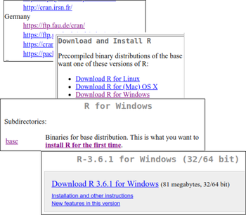

</hgroup>

## <lo-soln/> 2.solis: Uzstāda RStudio

<hgroup>

* Apciemo [RStudio mājaslapu](https://www.rstudio.com/products/rstudio/download/)
* Izvēlas "RStudio Desktop FREE". 
* Savāc operētājsistēmai piemērotu instalētāju.
* Darbina šo failu.

</hgroup>
<hgroup>

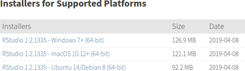

</hgroup>


## <lo-soln/> 3.solis: Pārbauda RStudio (1)

Kreisajā panelī, lodziņā **Console** ieraksta šādu kodu:

```r
pie(rep(1,24), col=rainbow(24))
# Var pārbaudīt arī pa daļām:
# (1) Izvada 24 vieniniekus:
rep(1,24)
# (2) Izvada 24 piesātinātas "varavīksnes" krāsas
raibow(24)
```

## <lo-soln/> 3.solis: Pārbauda RStudio (2)

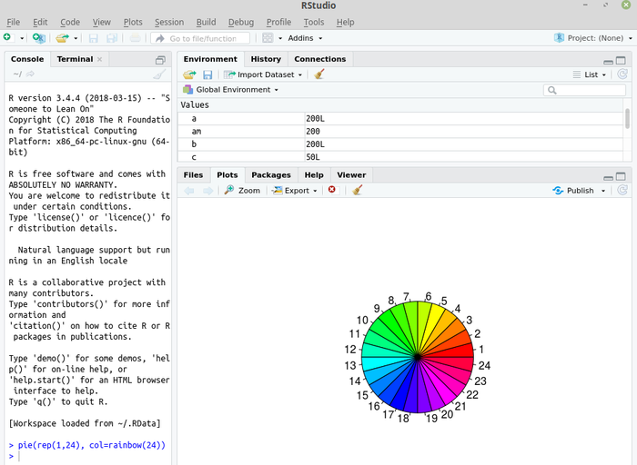


## <lo-soln/> 4.solis: Uzstāda dažas pakotnes

```r
install.packages("knitr")
install.packages("ggplot2")
install.packages("gmp")
```

*Piezīme 1:* Ja pirmo reizi lieto kādu pakotni, tā jāinstalē (jāsavāc no Interneta).  
**KnitR** - pārskatu ģenerēšanas bibliotēka. **GGPlot2** - 
diagrammu zīmēšana. **GMP** - Ļoti lielu skaitļu aritmētika.

*Piezīme 2:* Uz 32 bitu datoriem iet vecāka RStudio versija (v1.1 nevis v1.2).


## <lo-soln/> 5.solis: Pārbauda pakotni GMP

```r
require(gmp)

xx <- as.bigz(1)
for (i in 1:99) {
  # Pielipina masīvam elementu, 
  # kas par 1 lielāks par iepriekšējo
  xx <- c(xx,xx[i]+1)
}
# Atrod reizinājumu 1*2*...*100 = 100!
prod(xx)
# Atlikums, dalot 100! ar 101
xx %% 101
```

*Piezīme:* Ir spēkā Vilsona teorēma: Katram pirmskaitlim $p$, skaitlis $(p-1)!$ 
dod atlikumu $p-1$, dalot ar $p$.

## <lo-soln/> 6.solis: Apskata iebūvētās pamācības

```r
?ggplot2::geom_point
?plot
```

To pašu var arī meklēt internetā. Piemēram, Google meklētājā ierakstīt  
`r package gmp filetype:pdf`

* Katrai R pakotnei ir standartizēta dokumentācija (pieejama kā PDF un arī
RStudio **Help** sadaļā), kur 
aprakstītas visas pakotnē ietilpstošās funkcijas, daži izsaukšanas piemēri.


# &nbsp;

<hgroup>

<h1 style="font-size:28pt">Valodas R ievads</h1>

<blue>"Vektori" (1-dimensionālas datu struktūras) valodā R</blue>

</hgroup><hgroup>

<span>(1) [Valoda un vide](#section)</span>  
<span style="color:darkgreen">**(2) Vektori/Vectors**</span>  
<span>(3) [Datu tabulas/Data Frames](#section-2)</span>  
<span>(4) [Funkciju grafiki](#section-3)</span>  
<span>(5) [Vienkāršas diagrammas](#section-4)</span>  
<span>(6) [ggplot2 diagrammas](#section-5)</span>  
<span>(7) [Ģeogrāfiski dati](#section-6)</span>  
<span>(8) [Pārskatu veidošana](#section-7)</span>

</hgroup>


# <lo-theory/> Vektori ir gandrīz tie paši masīvi

Vektori valodā R pilda apmēram to lomu, ko citās valodās masīvi. 
Ir dažas atšķirības:

* R vektorus var "salipināt", pieaudzēt lielākus, u.c.
* R valodā arī skaitļi un virknes/stringi ir "vektori" (ar garumu $1$)
* R vektoros elementus sāk numurēt no $1$ (nevis no $0$).


## <lo-summary/> Vektora summa un garums

<hgroup>

```r
## Vektors ar 5 elementiem
xx <- c(31,33,36,41,34)
## Garums (jābūt 5)
length(xx)
## Summa (jābūt 175)
sum(xx)
## Aritm. vidējais (būs 35)
sum(xx)/length(xx)
## Tikai 5. elements (būs 34)
xx[5]
## No 3. līdz 5. elementam
sum(xx[3:5])
```

</hgroup>
<hgroup>

* Skaitļu vektora visu elementu summu atrod ar `sum(...)`. 
* Vektora garumu atrod ar funkciju `length(...)`. 
* Var rēķināt aritmētisko vidējo. 

</hgroup>


## <lo-summary/> Vidējā vērtība

<hgroup> 

**Definīcija:** Ja $x_1,x_2,\ldots,x_n$ ir $n$ skaitliski novērojumi, tad
par šo lielumu *vidējo vērtību* sauc aritmētisko vidējo: 
$$\mu = \frac{\sum_{i=1}^n x_i}{n}.$$

*Piezīme:* Vārds "mean" nozīmē gan "nejauks", gan "vidējais".
<blue>*Aritmētiskais vidējais*</blue> (*arithmetic mean*).

</hgroup>


```r
xx <- c(3,2,4,7)
a <- mean(xx)
a
# Vai uzreiz vienā izteiksmē:
mean(c(3,2,4,7))
```

</hgroup>


## <lo-summary/> Dispersija un standartnovirze

<div style="font-size:70%">

**Definīcija:** Par <blue>*dispersiju*</blue> (*variance*) skaitliskiem 
novērojumiem $x_1,x_2,\ldots,x_n$ sauc izteiksmi: 
$$\sigma^2 = \frac{\sum_{i=1}^n (x_i - \mu)^2}{n}.$$

Par <blue>*standartnovirzi*</blue> (*standard deviation*) 
sauc kvadrātsakni no variances:
$$\sigma = \sqrt{\frac{\sum_{i=1}^n (x_i - \mu)^2}{n}}.$$

Ja $x_i$ ir mērvienības (piemēram, centimetri), tad arī $\sigma$ 
mēra centimetros. 

</div>


## <lo-summary/> Dispersija un standartnovirze iztvērumam

<hgroup style="font-size:70%">

Socioloģijā, fizikā un citur 
bieži jāsecina par ģenerālkopu 
no <blue>*iztvēruma*</blue> (*sample*). 
Tad formulā jādala ar $n-1$ (nevis ar $n$):

$$s = \sqrt{\frac{\sum_{i=1}^n (x_i - \mu)^2}{n-1}}.$$

Šādu standartnovirzi (kur dala ar $n-1$) rēķina R funkcija `sd(...)`.  
Visas populācijas standartnovirzei $\sigma$ 
var uzrakstīt savu funkciju `fullSD(...)`.

</hgroup>

```r
xx <- c(31,33,36,41,34)
# Dala ar 4, sanāk 3.807887
sd(xx)

fullSD <- function(x) {
  n <- length(x)
  return(sqrt( 
    sum((x-mean(x))^2)/n
  ))
}

# Dala ar 5, sanāk 3.405877
fullSD(xx)
```

<hgroup>


</hgroup>


# <lo-sample/> LD: Rēķinām KhanAcademy vingrinājumus

**Soļi:**

1. Apciemo KhanAcademy lapu, ieiet kā "Learner". Autentificējas ar Gmail vai Facebook kontu. 
2. Aiziet uz statistikas testiem. 
3. Atvērt testa uzdevumu
3. Aprēķināt vidējo vērtību un standartnovirzi, ierakstīt rezultātus, nosūtīt.

## <lo-soln/> 1.solis: Ieiet KhanAcademy

* Atver [https://www.khanacademy.org](https://www.khanacademy.org). 
* Spiež pogu **Learner** un tad **Login**. 
* Spiež pogu **Continue with Google**. (Ja pārlūkprogrammas sesijā jau esat ielogojušies
Google Epastā, tad pogai vajadzētu strādāt).
* No izvēlnes paņemt **Courses** > **Statistics & Probability**
(Tur ir arī **AP Statistics** - "Advanced Placement" nozīmē padziļinātais).

## <lo-soln/> 2.solis: Atlasīt testus par statistiku

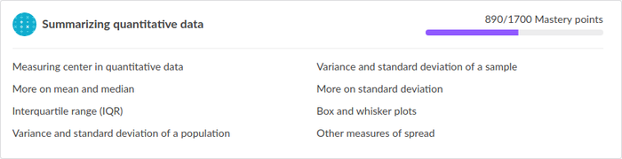

* Ritināt līdz sadaļai **Summarizing quantitative data**. 
* Izvēlēties *Variance and standard deviation of a population*
* VAI arī *Variance and standard deviation of a sample*

## <lo-soln/> 3.solis: Atvērt testa uzdevumu

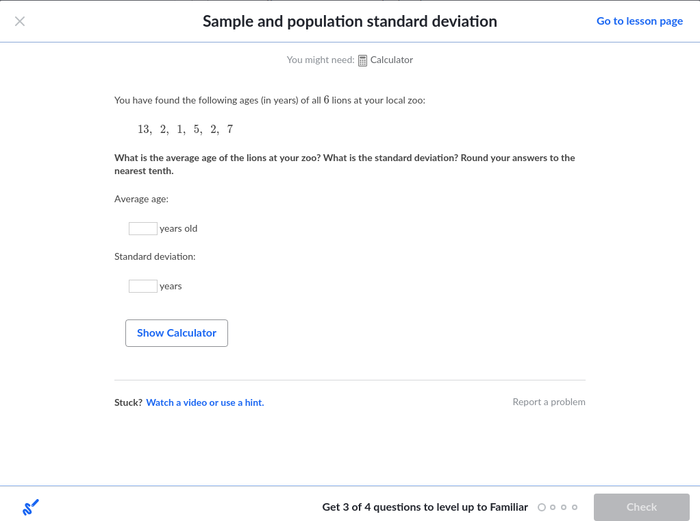

## <lo-soln/> Aprēķināt vid.vērtību un standartnovirzi

```r
xx <- c(13,2,1,5,2,7)
mean(xx)
[1] 5
sqrt(sum((xx - mean(xx))^2)/6)
[1] 4.123106
```

Ierakstīt lodziņos noapaļotas vērtības $5$ un $4.1$, nospiest **Check**.


## <lo-soln/> 3.solis: Atvērt citu testa uzdevumu

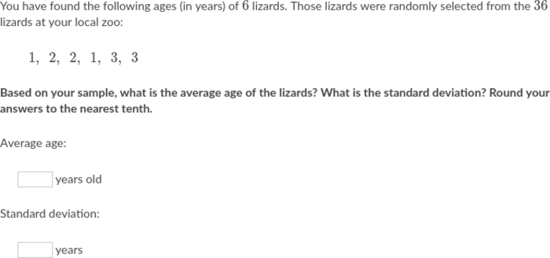

## <lo-soln/> Aprēķināt vid.vērtību un standartnovirzi

```r
> xx <- c(1,2,2,1,3,3)
> mean(xx)
[1] 2
> sd(xx)
[1] 0.8944272
> round(sd(xx), digits=1)
[1] 0.9
```

Šoreiz mums bija slinkums noapaļot, to dara funkcija `round()`


# &nbsp;

<hgroup>

<h1 style="font-size:28pt">Valodas R ievads</h1>

<blue>Datu tabulas valodā R</blue>

</hgroup><hgroup>

<span>(1) [Valoda un vide](#section)</span>  
<span>(2) [Vektori/Vectors](#section-1)</span>  
<span style="color:darkgreen">**(3) Datu tabulas/Data Frames**</span>  
<span>(4) [Funkciju grafiki](#section-3)</span>  
<span>(5) [Vienkāršas diagrammas](#section-4)</span>  
<span>(6) [ggplot2 diagrammas](#section-5)</span>  
<span>(7) [Ģeogrāfiski dati](#section-6)</span>  
<span>(8) [Pārskatu veidošana](#section-7)</span>

</hgroup>


# <lo-theory/> Kaut kas līdzīgs izklājlapām

<hgroup>

* Datu tabula ir līdzīga izklājlapai - katra rindiņa
parasti apraksta vienu faktu par kādu objektu. 
* Datu tabulas vieglāk apstrādāt, ja tajā neatkārto līdzīgas
kolonnas. Piemēram, ja skolēns saņēmis atzīmes piecos kontroldarbos, tad
labākas kolonnas ir "SkolenaID", "KDnum", "Atzīme". 
(Nevis "SkolenaID", "KD1", "KD2", "KD3", "KD4", "KD5".)

</hgroup>
<hgroup>

```r
class(cars)
head(cars)
nrow(cars)
colnames(cars)
```

*Piezīme:* `cars` ir R "iebūvēta" datu tabuliņa.

</hgroup>


## <lo-summary/> Datu tabulas no kolonnām

```r
> city.names <- c("Tallinn", "Riga", "Vilnius")
> city.pop <- c(435000,615000, 571000)
> cities <- data.frame(names=city.names,population=city.pop)
> 
> cities
    names population
1 Tallinn     435000
2    Riga     615000
3 Vilnius     571000
> 
```


## <lo-summary/> Ielasīšana no CSV faila

```r 
setwd(dirname(rstudioapi::getActiveDocumentContext()$path))
df <- read.table(file="matematikas-centralizetais.csv", 
                 sep=",", header=TRUE)
```

Komanda `setwd(...)` uzstāda tekošo direktoriju. Mūsu gadījumā 
`rstudioapi` (pakotne, kuru vajag pirms lietošanas instalēt)
parāda RStudio tekošo direktoriju, kurā dzīvo izpildāmais scenārijs.  

Var rakstīt arī: `setwd("c:/temp/")` utml.


# <lo-sample/> VISC eksāmenu tabula

**Soļi:** 

1. Saprast VISC eksāmena datus
2. Ielasīt VISC eksāmena datus tabulā (*data frame*)
3. Pielipināt jaunu kolonnu "Part23" - 
cik procentus no maksimuma skolēns 
saņēmis eksāmena 2. un 3. daļā kopā.
4. Izveidot Pīrsona korelāciju starp Part1 un Part23
4. Saskaitīt datus dažādos šķērsgriezumos

Sk. ZIP apakšdirektoriju: **data-analysis-course/chapters/LD-data-frames**


## <lo-soln/> 1.solis: Saprast eksāmena datus


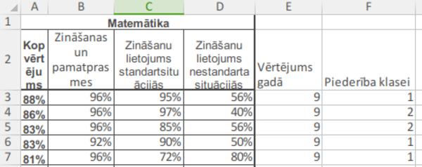

* Eksāmenam 3 daļas (1.daļā 25 jautājumi (kopā 25 punkti); 2.daļā ir 
10 jautājumi (kopā 40 punkti); 3.daļā ir 3 jautājumi (kopā 15 punkti)).
* To svari ir attiecīgi $31.25\%$, $50\%$ un $18.75\%$ no kopējā.


## <lo-soln/> 2./3.solis: Ielasa datus, pievieno kolonnu

```r 
setwd(dirname(rstudioapi::getActiveDocumentContext()$path))
df <- read.table(file="matematikas-centralizetais.csv", 
                 sep=",", header=TRUE)
df$Part23 <- (0.50*df$Part2+(0.1875)*df$Part3)/(0.50+0.1875)
```

Tad ieraksta konsolē šādas komandas:

```r
# Cik kāda veida gada atzīmes
table(df$Annual)
# Cik pavisam skolēnu
nrow(df)
# Cik skolēnu katrā klasē
table(df$Class)
```

## <lo-soln/> 4.solis: Pīrsona korelācija

```r
res <- cor.test(df$Part1, df$Part23, method = "pearson")
res
```

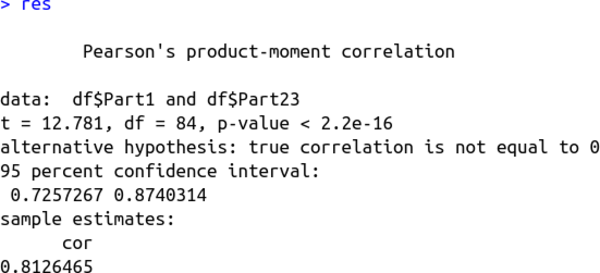


## <lo-soln/> 4.solis: Datu filtrēšana

```r
# Vidējais VISC eksāmena vērtējums
> mean(df$Total)
# Vidējā atzīme klasē Nr.4
> mean(df$Annual[df$Class=='4'])
# Vidējie procenti par testa 3.daļu klasē Nr.1
> mean(df$Part3[df$Class=='1'])
# Dažādi vidējie pa klasēm
> aggregate(cbind(Annual,Total) ~ Class, data = df, mean)
  Class Annual  Total
1     1 6.4500 54.050
2     2 7.1600 62.960
3     3 5.6875 39.875
4     4 5.0000 31.360
> 
```


# &nbsp;

<hgroup>

<h1 style="font-size:28pt">Valodas R ievads</h1>

<blue>"Vektori" valodā R</blue>

</hgroup><hgroup>

<span>(1) [Valoda un vide](#section)</span>  
<span>(2) [Vektori/Vectors](#section-1)</span>  
<span>(3) [Datu tabulas/Data Frames](#section-2)</span>  
<span style="color:darkgreen">**(4) Funkciju grafiki**</span>  
<span>(5) [Vienkāršas diagrammas](#section-4)</span>  
<span>(6) [ggplot2 diagrammas](#section-5)</span>  
<span>(7) [Ģeogrāfiski dati](#section-6)</span>  
<span>(8) [Pārskatu veidošana](#section-7)</span>

</hgroup>

# <lo-theory/> Punktu un līniju zīmēšana

* Dekarta koordinātu sistēma pielāgojas lielākajām 
un mazākajām $x$ un $y$ vērtībām (bet var "izstaipīt"
citādi). 
* Zīmēšana pa punktiem, to savienošana ar līnijām, 
noklusēto aplīšu aizstāšana ar citām figūriņām.

Sk. [Plotting discontinuous functions](http://www.cfm.brown.edu/people/dobrush/am33/R/discount.html)

## <lo-summary/> Tangensa funkcijas grafiks

<hgroup>

```r
xx <- seq(-3,3,by=0.01)
yy <- tan(xx)
plot(xx,yy,type="l", col="red")
```

Funkcija pieņem ļoti lielas vērtības, 
iziet ārpus saprātīgiem mērogiem.

</hgroup>
<hgroup>

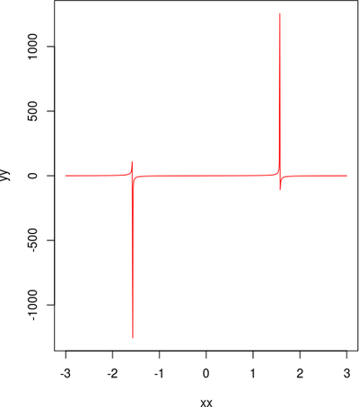

</hgroup>


## <lo-summary/> Citas pārtrauktas funkcijas

```r
a <- function(x) { 
  ifelse((x < 1),x^2-1,
    ifelse((1<x & x<2),x^3-5, 
      ifelse((x>2.1),5 - 2*x, NA)
    )
  ) 
} 
plot(a,xlim=c(-3,5), ylim = c(-4,7), col="red") 
abline(v=0, h=0)
```

## <lo-summary/> Izlabots tangenss

*Ideja:* Izmetam no vektoriem xx un yy tās vērtības, kurām 
tangenss ir pārāk liels (aizstājam ar `NA` - Not a number).

```r
xx <- seq(-3,3,by=0.01)
yy <- tan(xx)
xx[which(yy > 10)] = NA
yy[which(yy > 10)] = NA
plot(xx,yy,type="l", col="red",xlim=c(-3,3),ylim=c(-3,3))
# asimptotas
abline(v=c(-pi/2,pi/2), lty=3,col="blue")
grid()
abline(v=0, h=0)
```


## <lo-summary/> Vienkāršu animāciju veidošana

* Animētas un interaktīvas bildes parasti veido ar JavaScript;
tā ir cita programmēšanas valoda, ko saprot vairums pārlūkprogrammu (*browsers*). 
* R/RStudio var sagatavot JSON datus JavaScript programmai. 
* R/RStudio var arī veidot animētu GIF, kur animācija ir "iebūvēta" 
pašā attēla failā. 

**Ko darīt ar izveidoto grafiku?**

* Var saglabāt <blue>*starpliktuvē*</blue> (*clipboard*)
* Var saglabāt failā ar dialogu **Export** > **Save as Image**
* Var saglabāt scenārijā norādītajā failā

# <lo-sample/> Izveidot animētu Teilora rindu

**Soļi:** 

1. Izveidot funkciju, kas rēķina $y=sin(x)$ Teilora rindas parciālsummu
līdz $k$-tajam loceklim:
$$\sum_{i=0}^{k} \frac{(-1)^k x^{2k+1}}{(2k+1)!}.$$
2. Izveidot bildītes, kurās šos grafikus var noglabāt.
3. Sašūt bildītes ar GIF veidotāju "convert"

Sk. ZIP apakšdirektoriju: **data-analysis-course/chapters/LD-animated-gifs**


# &nbsp;

<hgroup>

<h1 style="font-size:28pt">Valodas R ievads</h1>

<blue>"Vektori" valodā R</blue>

</hgroup><hgroup>

<span>(1) [Valoda un vide](#section)</span>  
<span>(2) [Vektori/Vectors](#section-1)</span>  
<span>(3) [Datu tabulas/Data Frames](#section-2)</span>  
<span>(4) [Funkciju grafiki](#section-3)</span>  
<span style="color:darkgreen">**(5) Vienkāršas diagrammas**</span>  
<span>(6) [ggplot2 diagrammas](#section-5)</span>  
<span>(7) [Ģeogrāfiski dati](#section-6)</span>  
<span>(8) [Pārskatu veidošana](#section-7)</span>

</hgroup>

# <lo-theory/> Vienkāršu diagrammu veidi

* Lai būtu, ko zīmēt, var sākt ar "datu ģenerēšanu". 
* Varam apskatīt dažus diagrammu veidus: `barplot`, `pie`, `hist`.


# <lo-theory/> Sadalījumu funkcijas

<div style="font-size:75%">

<table>
<tr><th>Sadalījums</th><th>Blīvumfunkcija</th><th>Sadalījumfunkcija</th><th>Kvantiļu funkcija</th><th>Ģenerators</th></tr>
<tr><th>Normālais</th><td>`dnorm()`</td><td>`pnorm()`</td><td>`qnorm()`</td><td>`rnorm()`</td></tr>
<tr><th>Vienmērīgais</th><td>`dunif()`</td><td>`punif()`</td><td>`qunif()`</td><td>`runif()`</td></tr>
<tr><th>Binomiālais</th><td>`dbinom()`</td><td>`pbinom()`</td><td>`qbinom()`</td><td>`rbinom()`</td></tr>
<tr><th>Eksponenciālais</th><td>`dexp()`</td><td>`pexp()`</td><td>`qexp()`</td><td>`rexp()`</td></tr>
<tr><th>Puasona</th><td>`dpois()`</td><td>`ppois()`</td><td>`qpois()`</td><td>`rpois()`</td></tr>
</table>

</div>


# <lo-sample/> Lab.darbs: Empīriska gadījumlieluma attēlošana

**Soļi:**

1. Atrod M.Bendika (lietotājs "mbendiks") Twitter ierakstus 2018.g., kur minēts vārds "rozīnes".
2. Izveido varbūtisku eksperimentu $1000$ sausiņu (vai saldējumu) izgatavošanai tā, 
lai katrā saldējumā būtu vidēji $10$ rozīnes. (Izmantot Puasona sadalījumu 
ar $\lambda = 10$.) 
3. Attēlo eksperimenta rezultātu histogrammā. Saskaitīt, cik sausiņos/saldējumos
būs (A) mazāk kā $5$ rozīnes; (B) neviena rozīne.


## <lo-soln/> 1.solis: Atrod tvītus par rozīnēm

* Apciemo www.twitter.com. Ievada meklēšanas lodziņā:  
`from:mbendiks rozīnes since:2018-01-01 until:2018-12-31`

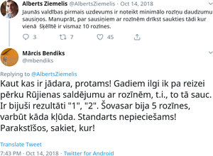

## <lo-soln/> 2.solis: Varbūtisks eksperiments

<hgroup>

```r
# Apskata rpois dokumentāciju
?rpois
# Izsauc ar parametriem
xx <- rpois(n=1000,lambda=10)
# Saskaita TRUE (kam rozīņu < 5)
sum(xx < 5)
# Saskaita TRUE (kam rozīņu nav)
sum(xx == 0)
# Tabula pa rozīņu skaitiem
table(xx)
```

</hgroup>

<hgroup>

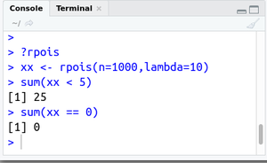

</hgroup>


## <lo-soln/> 3.solis: Joslu diagramma

<hgroup>

```r
# Citi Puasona nejaušie skaitļi
xx <- rpois(n=1000,lambda=10)
# Tabula ar kopsavilkumu
tt <- table(xx)
# Joslu diagramma
barplot(height=as.vector(tt),
  names.arg=names(tt))
grid()
```

*Piezīme.* Nepārtrauktiem sadalījumiem atbilst histogrammas, 
diskrētiem - joslu diagrammas (stabiņiem ir atstarpes).

</hgroup>

<hgroup>

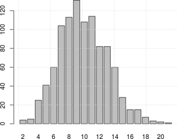

</hgroup>


# <lo-sample/> Citi laboratorijas darbi...

1. Izmantojot [Vikipēdijas datus par vidējo garumu vīriešiem un sievietēm Somijā](https://en.wikipedia.org/wiki/List_of_average_human_height_worldwide), atrast varbūtību, ka nejauši izvēlēta vīrieša (attiecīgi 
sievietes) garums ir intervālā $[180;190]$ centimetri. Pieņemt, ka garuma
standartnovirze sievietēm ir $\sigma_s = 6\,\text{cm}$ un vīriešiem $\sigma_v = 7\,\text{cm}$. 
2. Veikt randomizētus eksperimentus spēlei "Cirks", kur katru gājienu nosaka metamā 
kauliņa rezultāts un, nonākot noteiktās pozīcijās, lauciņa numuram pieskaita vai 
atņem kaut ko. Atrast vidējo kauliņa metienu skaitu, lai nonāktu beigu lauciņā "100". 

* Viens metamā kauliņa metiena rezultāts: `sample(1:6,1)`
* Divu metienu summa: `sum(sample(1:6,2,replace=TRUE))` vai `sample(1:6,1)+sample(1:6,1)`


# &nbsp;

<hgroup>

<h1 style="font-size:28pt">Valodas R ievads</h1>

<blue>"Vektori" valodā R</blue>

</hgroup><hgroup>

<span>(1) [Valoda un vide](#section)</span>  
<span>(2) [Vektori/Vectors](#section-1)</span>  
<span>(3) [Datu tabulas/Data Frames](#section-2)</span>  
<span>(4) [Funkciju grafiki](#section-3)</span>  
<span>(5) [Vienkāršas diagrammas](#section-4)</span>  
<span style="color:darkgreen">**(6) ggplot2 diagrammas**</span>  
<span>(7) [Ģeogrāfiski dati](#section-6)</span>  
<span>(8) [Pārskatu veidošana](#section-7)</span>

</hgroup>

# <lo-theory/> Diagrammas ar ggplot2

* Funkcijām `plot()`, `points()`, `barplot()`, `pie()` 
ir neskaitāmi parametri dažādām dzīves situācijām. 
* Vai var kombinēt vizualizācijas elementus tā, kā nevienā 
bibliotēkā tas "nav paredzēts". 
   * Var zīmēt attēlus ar vektorgrafikas elementiem (līnijām, 
taisnstūriem, teksta gabaliņiem, utml.), teiksim, 
ar pakotni `grid`. Kaut ko līdzīgu dara arī JavaScript
bibliotēka D3. 
   * Var zīmēt attēlus ar pakotni `ggplot2`, kas 
izmanto "diagrammu algebru".


## <lo-summary/> Diagrammu algebra

* Diagrammu pamazām pieaudzē, tai "pieskaitot" jaunas
izteiksmes, kas apraksta kādas koordinātu asis zīmēt, 
kādus objektus uzlikt diagrammai, u.c.
* Diagrammu var piešķirt mainīgajam, atgriezt kā funkcijas vērtību. 
* Zīmēšanas brīdī diagramma pārvēršas par rastra (PNG) vai 
vektorgrafikas (SVG) attēlu, noteiktā izšķirtspējā 
attēlo burtiņus.


# <lo-sample/> Centralizēto eksāmenu dati

**Soļi**

1. Ielasīt tabulu ar eksāmena datiem.
2. Pakāpeniski uzaudzēt ggplot2 diagrammu
3. Ar scenārija komandu noglabāt diagrammu PNG failā


## <lo-soln/> Pilns atrisinājums

```r
require(ggplot2)
require(RColorBrewer)
setwd(dirname(rstudioapi::getActiveDocumentContext()$path))
df <- read.table(file="matematikas-centralizetais.csv", 
                 sep=",", header=TRUE)
df$Part23 = 0.50*df$Part2 + (0.1875)*df$Part3
ggplot(df, aes(x=Part1, y=Part23, color=as.factor(Class))) + 
  geom_point() + 
  scale_color_manual(values=brewer.pal(4,"Set1")) + 
  geom_smooth(method='lm', se = FALSE)
```

## <lo-soln/> Attēls (Izkliedes diagramma)

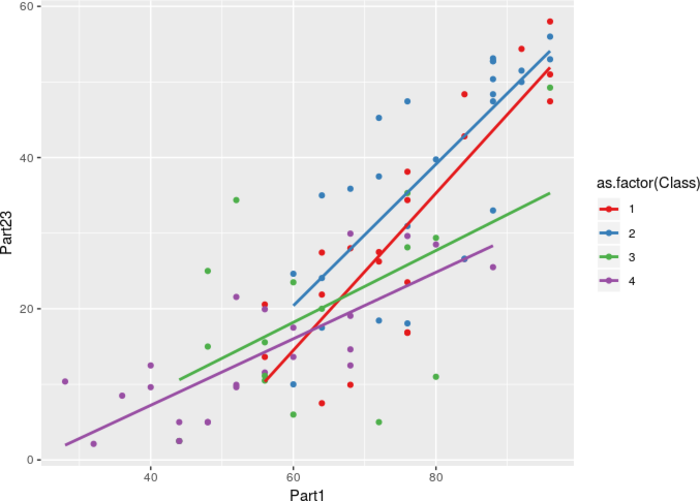


# &nbsp;

<hgroup>

<h1 style="font-size:28pt">Valodas R ievads</h1>

<blue>"Vektori" valodā R</blue>

</hgroup><hgroup>

<span>(1) [Valoda un vide](#section)</span>  
<span>(2) [Vektori/Vectors](#section-1)</span>  
<span>(3) [Datu tabulas/Data Frames](#section-2)</span>  
<span>(4) [Funkciju grafiki](#section-3)</span>  
<span>(5) [Vienkāršas diagrammas](#section-4)</span>  
<span>(6) [ggplot2 diagrammas](#section-5)</span>  
<span style="color:darkgreen">**(7) Ģeogrāfiski dati**</span>  
<span>(8) [Pārskatu veidošana](#section-7)</span>

</hgroup>

# <lo-sample/> Izveidot krāsainu karti

1. Instalēt trūkstošās pakotnes
2. Darbināt scenāriju, lai veidotu karti

Sk. ZIP apakšdirektoriju: **data-analysis-course/chapters/LD-kartes**

## <lo-soln/> 1.solis: Instalēt trūkstošās pakotnes

```r
install.packages("rgeos")
install.packages("maptools")
install.packages("sp")
install.packages("classInt")
install.packages("RColorBrewer")
```

## <lo-soln/> 2.solis: Darbināt scenāriju

* Atvērt direktoriju **data-analysis-course/chapters/LD-kartes**
* Atvērt ar RStudio failu `krasaina-karte.R`
* Ar **Ctrl+A** iezīmēt visu scenārija tekstu
* Spiestu pogu **Run**
* Pārliecināties, ka rodas attēls **krasaina-karte-2018-01-01.png**


# &nbsp;

<hgroup>

<h1 style="font-size:28pt">Valodas R ievads</h1>

<blue>"Vektori" valodā R</blue>

</hgroup><hgroup>

<span>(1) [Valoda un vide](#section)</span>  
<span>(2) [Vektori/Vectors](#section-1)</span>  
<span>(3) [Datu tabulas/Data Frames](#section-2)</span>  
<span>(4) [Funkciju grafiki](#section-3)</span>  
<span>(5) [Vienkāršas diagrammas](#section-4)</span>  
<span>(6) [ggplot2 diagrammas](#section-5)</span>  
<span>(7) [Ģeogrāfiski dati](#section-6)</span>  
<span style="color:darkgreen">**(8) Pārskatu veidošana**</span>

</hgroup>

# <lo-theory/> KnitR bibliotēka

KnitR ir viena cilvēka (Yi Huei) projekts, kas ir tik populārs,
ka ir "iebūvēts" rīkā RStudio. Tajā apvienotas vairākas tehnoloģijas:

* RStudio vide
* R diagrammas (parastās, ggplot2, jebkādas citas)
* Markdown - ļoti vienkāršs wiki-stila marķējums; ar to var rakstīt
<blue>*dekorētu tekstu*</blue> (*rich text*) - teksta izcēlumi, linki, tabulas.
* LaTeX - matemātikas formulas un smuka PDF veidošana.
* Paša KnitR marķējums (lai tekstā iekļautu attēlus, formulas, u.c.). 


