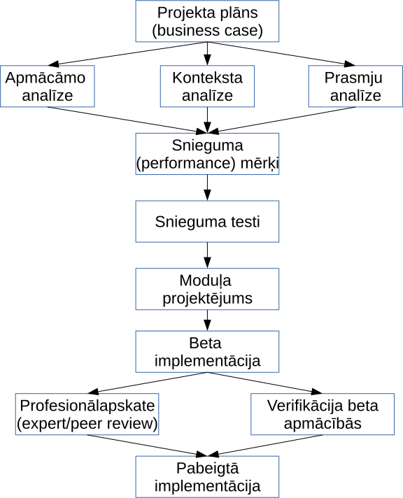
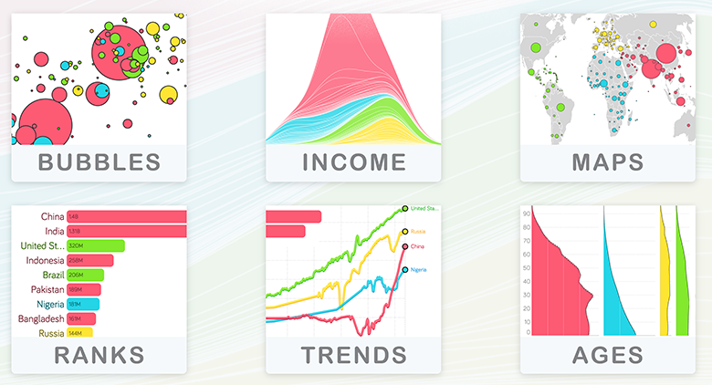
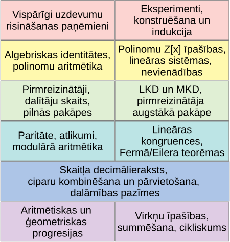

# &nbsp;

<hgroup>

<h1 style="font-size:28pt">LU kursu piedāvājums</h1>

<blue>Apmācību projektēšana un digitālie mācību līdzekļi   
*Instructional Systems Design and Courseware Development*</blue>

</hgroup><hgroup>

**(1) E-apmācību projektēšana**  
(2) [IT drošība](#section-1)  
(3) [Lielo datu pārvaldība](#section-2)  
(4) [Pārskati un vizualizācijas](#section-3)  
(5) [Lietišķie algoritmi](#section-4)  
(6) [Diskrētās struktūras (BITL)](#section-5)  
(7) [Skaitļu teorija olimpiādēs (NMS)](#section-6)

</hgroup>

# <lo-summary/> Kas ir ISD

**Definīcija:** Apmācību projektēšana (*Instructional Systems Design*, ISD) 
ir nozare, kas māca sistemātiski projektēt, veidot un *prognozējami* pasniegt 
apmācību produktus dažādās vidēs. 
Apmācība neaizstāj citus efektīva darba faktorus - 
personāla atlasi, motivāciju, sadarbību, 
uzziņu informāciju, u.c.

* RTU Tālmācības studiju centrs (Atis Kapenieks u.c.).
* Skola2030 projekta vadītāji (Zane Oliņa, Dace Namsone, Jānis Vilciņš).

# <lo-summary/> Idejas LU: Mikromoduļa gatavošana

Arī tiem, kuri ar apmācību parasti nenodarbojas, var būt jāgatavo
apmācība par konkrētu jautājumu. 

* 20-30 minūšu "nedalāms" mācību gabals
* Skaidrs apmācību mērķis
* Praktiski vingrinājumi
* Vairāki pasniegšanas veidi (multimodalitāte)
* Atgriezeniskā saite un *follow-up*
* Māca kursabiedram "beta versiju" un labo kļūdas

Var arī sākt ar eksistējošu LU kursu un pārtaisīt to par MOOC.

# <lo-summary/> Apmācību projektēšanas process

<hgroup>

</hgroup><hgroup>

* Apmācāmo/auditorijas analīze, prasmju analīze
* "Test-driven development" - testi pirms projektējuma un satura
* Projektējums pirms satura veidošanas (reizēm arī *storyboarding*, precīzs aktivitāšu plāns ar minūtēm)
* Beta-produkcija un kļūdu labošana

</hgroup>

# <lo-summary/> Saprātīga PPT lietošana

<hgroup>

* Sāk un beidz ar mērķiem, dažiem "kāpēc" jautājumiem
* Stāstījuma loks: ekspozīcija, kulminācija, atrisinājums
* Ritms starp informāciju un praktiskiem vingrinājumiem
* Ritms starp attēlu un paskaidrojumiem
* Nodalīti informācijas tipi: jēdzieni, fakti un principi, procesi un struktūras, procedūras, u.c.

</hgroup><hgroup>

*Information mapping:*

* Dalīšana gabalos (Chunking) 
* Hierarhiska sakārtošana
* Apzīmēšana ar virsrakstiem (Labeling)
* Katram informācijas tipam konsekvents vizuālais attēlojums 
* Iespēja detalizēt 
* Teksts integrēts ar vizualizācijām

</hgroup>

# <lo-summary/> Kursa mācīšanas konteksts

Līdzīgi kursi: 

* DatZ2028: Dators mācību procesā (Māris Vītiņš). 
Kurss apskata līdzīgu, bet citu jautājumu - dažāda veida datortehnikas izmantošanu mācību procesā). 
* DatZP000: Biroja lietotņu mācību metodika (Māris Vītiņš).
Ir daži līdzīgi mērķi (prot adaptēt gatavu mācību priekšmeta programmas paraugu un patstāvīgi izveidot jaunu; 
Spēj patstāvīgi izstrādāt mācību stundas konspektu un realizēt to). 

M.Vītiņa kursi (īpaši DatZP000) ir vairāk pedagoģijas/informātikas skolotāju sagatavošanai. 
Mūsu gadījumā vairāk projektēšanas, citi konteksti.

# &nbsp;

<hgroup>

<h1 style="font-size:28pt">LU kursu piedāvājums</h1>

<blue>Datu drošības principi un risinājumi:   
*InfoSec: Principles and Solutions*</blue>

</hgroup><hgroup>

(1) [E-apmācību projektēšana](#section)  
**(2) IT drošība**  
(3) [Lielo datu pārvaldība](#section-2)  
(4) [Pārskati un vizualizācijas](#section-3)  
(5) [Lietišķie algoritmi](#section-4)  
(6) [Diskrētās struktūras (BITL)](#section-5)  
(7) [Skaitļu teorija olimpiādēs (NMS)](#section-6)

</hgroup>

# <lo-summary/> IT drošības principi

Students dotajā virtuālu mašīnu vidē konfigurē kaut kādu tīklu drošības risinājumu vai apdraudējumu.  (vienkāršu ugunsmūri, Web/Epasta vārteju, 
autentifikācijas mehānismu, PKI hierarhiju, klienta puses SSH sertifikātu, Linux rootkit-u, mākslīgi izraisītu masveida kredītkaršu datu noplūdi u.c.), 
pēc tam darbina Wireshark vai citus diagnostikas rīkus, atbild uz jautājumiem (teiksim, vai autentifikāciju var uzlauzt ar "replay attack", kas jādara, 
lai varētu pamanīt interesantās datu noplūdes, atfiltrējot "troksni", u.c.) Kursa laikā ir kādi 3 praktiskie darbi.

# <lo-summary/> Kursa mācīšanas konteksts

Līdzīgi kursi:

* DatZ3037: Informācijas sistēmu drošība (Leo Trukšāns)
* DatZ1172: Datoru tīkli I, II, III, IV (Guntis Bārzdiņš)

DatZ3037 iedvesmojies no CISA (Computer Security Handbook, Seymour Bosworth, u.c.) - IS drošība un audita procedūras.

* InfoSec uzmanības centrā - organizāciju vajadzības un darbinieku uzvedība
* Perimetra aizsardzība vs. mākoņdatu aizsardzība
* Datu redzamība organizācijas tīklā, integrēšanās ar datu apstrādes procesiem

# <lo-summary/> InfoSec praktisko darbu idejas

1. Datortīklu elementi un to drošības "politikas" (ugunsmūri, Web proxies - tīmekļa starpniekserveri, 
epasta vārtejas, ICAP servisi, HTTPS pārtveršana).
2. Datu noplūdes (klasifikatori, kas atšķir "interesantus" datus - teksta izvilkšana, 
vārdnīcas, pattern-matching, kredītkaršu u.c. privātas informācijas pazīšana, 
strukturēti/nestrukturēti "fingerprint" dati, mašīnmācīšanās (SVM, Bayes, u.c.)
3. Lietotāju direktorijas un autentifikācija (SAML 2.0, deleģētā autentifikācija, u.c.)
4. Žurnālfailu u.c. lielo datu analīze.

</hgroup>

# &nbsp;

<hgroup>

<h1 style="font-size:28pt">LU kursu piedāvājums</h1>

<blue>Datu pārvaldības un analīzes ietvari  
*Data Management and Analysis Frameworks*</blue>

</hgroup><hgroup>

(1) [E-apmācību projektēšana](#section)  
(2) [IT drošība](section-1)  
**(3) Lielo datu pārvaldība**  
(4) [Pārskati un vizualizācijas](#section-3)  
(5) [Lietišķie algoritmi](#section-4)  
(6) [Diskrētās struktūras (BITL)](#section-5)  
(7) [Skaitļu teorija olimpiādēs (NMS)](#section-6)

</hgroup>

# <lo-summary/> Datu analīzes ietvars/steks

1. Standartizēta konfigurācijas pārvaldība (Docker, Ansible, Jenkins) un 
servisi (Jenkins, Elastic, Lucene, NiFi, Kafka, RabbitMQ, Graphite/Grafana).
2. Integrācija ar RESTful API.
3. Domēnspecifiskas vaicājumu valodas.
4. Dažādi lietojumi: sociālie tīkli, sensori un laikrindas, uzvedības analīze (UEBA), 
lieli grafi, mašīnmācīšanās.

# <lo-summary/> Idejas LU: Platformu attīstība

1. Ap 1995.g. students lieto failu serveri, taisa mājaslapu, lieto epastu.
2. Ap 2000.g. tam pievieno CSS, JavaScript, Web 1.0. 
3. Ap 2005.g. LAMP steks (Linux, Apache, MySQL, PHP).
4. Ap 2010.g. saturpārvaldības platformas WordPress, Moodle, MediaWiki, Web 2.0.
5. Ap 2015.g. sociālo tīklu API, "mobile first", Android lietotnes.
6. Ap 2019.g. reālā laikā integrē "lielus" strukturētus un nestrukturētus (teksta)
datus.

# <lo-summary/> Kursa mācīšanas konteksts

* Accenture u.c. "sistēmu integrētāji" - viņu intereses, vajadzības, 
iespējas palīdzēt ar tehnisko nodrošinājumu. 
* Esošie kursi:
   - Datorlingvistika (G.Bārzdiņš, N.Grūzītis, Tildes grupa u.c.)
   - Semantiskais tīmeklis (U.Bojārs)
   - Statistika (J.Valeinis)
   - Datu noliktavas (K.Podnieks)

# &nbsp;

<hgroup>

<h1 style="font-size:28pt">LU kursu piedāvājums</h1>

<blue>Pārskati un datu vizualizācijas  
*Reporting and Data Visualizations*</blue>

</hgroup><hgroup>

(1) [E-apmācību projektēšana](#section)  
(2) [IT drošība](section-1)  
(3) [Lielo datu pārvaldība](#section-2)  
**(4) Pārskati un vizualizācijas**  
(5) [Lietišķie algoritmi](#section-4)  
(6) [Diskrētās struktūras (BITL)](#section-5)  
(7) [Skaitļu teorija olimpiādēs (NMS)](#section-6)

</hgroup>

# <lo-summary/> Datu vizualizācijas

* Ģeogrāfiskās informācijas sistēmas, Shapefile dati
* Gapminder.org, epidemiologs Hanss Roslings (burbuļu diagrammas). 
* "Infogr.am", easyBI (Raimonds Simanovskis), "Datu skola", u.c. 
* Leland Wilkinson. The Grammar of Graphics (ggplot2, valoda R). 
* NumPy, Pandas, matplotlib (Python)

# <lo-summary/> Idejas LU: Komunicēšana

Taustāmais rezultāts: datu žurnālistika, "hakatoni", pārskatu un infografiku integrēšana ar datu 
avotiem, CSV vai JSON ielasīšana R vai Python datu struktūrās, manipulācijas, attēlojums ar `ggplot2` vai `D3`.

# <lo-summary/> Kursa mācīšanas konteksts

Daži līdzīgi priekšmeti:

* DatZ1109: Lietotāja saskarnes grafiskais dizains (Jurģis Šķilters, u.c. Viena no apakštēmām - "Infografiku un elektronisko reklāmu dizains." u.c.).
Ir līdzīgas iezīmes, tomēr tur primāri ikonu dizains, zīmolu identitāte, programmatūras lietojamību.
* DatZ1031	Tīmekļa tehnoloģijas I un II (Audris Kalniņš u.c. HTML un JavaScript, DOM manipulācijas ar jQuery u.c.). Aplūkoti rīki, 
lai veidotu daļu no vizualizācijām. 

# &nbsp;

<hgroup>

<h1 style="font-size:28pt">LU kursu piedāvājums</h1>

<blue>Lietišķie algoritmi  
*Algorithms in the Real World*</blue>

</hgroup><hgroup>

(1) [E-apmācību projektēšana](#section)  
(2) [IT drošība](section-1)  
(3) [Lielo datu pārvaldība](#section-2)  
(4) [Pārskati un vizualizācijas](#section-3)  
**(5) Lietišķie algoritmi**  
(6) [Diskrētās struktūras (BITL)](#section-5)  
(7) [Skaitļu teorija olimpiādēs (NMS)](#section-6)

</hgroup>

# <lo-summary/> Eksistējošs kurss

* [Kurss LU kursu katalogā](https://www.lu.lv/lv/nc/studijas/studiju-celvedis/programmu-un-kursu-katalogi/kursu-katalogs/?tx_lustudycatalogue_pi1%5Bcourse%5D=DatZ4020&tx_lustudycatalogue_pi1%5Baction%5D=detail&tx_lustudycatalogue_pi1%5Bcontroller%5D=Course&cHash=c3ba047ba1e7775b94f0d291e49368ef)
* [Guy Blelloch Algorithms in real world](http://www-2.cs.cmu.edu/~guyb/rwc/)

# <lo-summary/> Idejas LU: Daži jauni lietojumi

<hgroup>

* Saspiešanas algoritmi (GIF, JPEG, MP3 u.c.), kļūdu korekcija 
    - algoritmu patentēšana
    - saistība ar ES Autortiesību direktīvu (Article 13, augšupielādes filtri)
    - saistība ar steganogrāfiju
* Kriptogrāfija
    - MD5 vs. SHA256
    - TLS vs. SSL v3
    - "Fully Homomorphic Encryption"
    - Blockchain

</hgroup><hgroup>

* Indeksācija un meklēšana
    - Pilnā teksta un jauktā meklēšana (Lucene, Elastic)
* Lineārā programmēšana, Google "Page Rank"
    - Rezultātu kārtošana pēc "interesantuma"

</hgroup>

# <lo-summary/> Kursa mācīšanas konteksts

Radniecīgi kursi

* DatZ3168: Datu struktūras un algoritmi
* DatZ3150: Lietišķā kriptogrāfija

# &nbsp;

<hgroup>

<h1 style="font-size:28pt">LU kursu piedāvājums</h1>

<blue>Diskrētās struktūras   
*Discrete Structures*</blue>

</hgroup><hgroup>

(1) [E-apmācību projektēšana](#section)  
(2) [IT drošība](section-1)  
(3) [Lielo datu pārvaldība](#section-2)  
(4) [Pārskati un vizualizācijas](#section-3)  
(5) [Lietišķie algoritmi](#section-4)  
**(6) Diskrētās struktūras (BITL)**  
(7) [Skaitļu teorija olimpiādēs (NMS)](#section-6)

</hgroup>

# <lo-summary/> Par BITL programmu

* [bitl.lv - Par programmu](https://www.bitl.lv/par-programmu/)
* [SUNY: Buffalo - CSE 191](https://cse.buffalo.edu/~rapaport/191/) - Katru gadu kursam 
var mainīties pasniedzējs un materiāli
* Parastās "Diskrētās matemātikas" sadaļas
    - Izteikumu un predikātu loģika
    - Kopas, relācijas, funkcijas
    - Vienkāršu apgalvojumu pierādīšana
    - Modulārā aritmētika
    - Kombinatorika - variantu skaitīšana
    - Grafu teorija

# <lo-summary/> Idejas LU: Pirms grūtākiem kursiem...

* Augstskolās nonāk studenti ar ļoti atšķirīgu sagatavotību un 
priekšzināšanām. 
* Diskrētā matemātika (līdzīgi "obligātajām klavierēm" mūzikas skolās) rada
vienojošu profesionālo kultūru.
* 1.gada 2.semestris - vēl nav par vēlu novērst studentu masveida atbirumu.
* Diskrētā matemātika iespējami agri jāparāda studētgribētājiem.

# &nbsp;

<hgroup>

<h1 style="font-size:28pt">LU kursu piedāvājums</h1>

<blue>Skaitļu teorija olimpiādēs   
*Number Theory in Competition Mathematics*</blue>

</hgroup><hgroup>

(1) [E-apmācību projektēšana](#section)  
(2) [IT drošība](section-1)  
(3) [Lielo datu pārvaldība](#section-2)  
(4) [Pārskati un vizualizācijas](#section-3)  
(5) [Lietišķie algoritmi](#section-4)  
(6) [Diskrētās struktūras (BITL)](#section-5)  
**(7) Skaitļu teorija olimpiādēs (NMS)**

</hgroup>

# <lo-summary/> Modernā elementārā matemātika

<hgroup>

</hgroup><hgroup>

1. Skaitļu teorija kā akadēmiska disciplīna
    * Grupu un lauku teorija
    * Skaitļu teorijas algoritmi
    * Kriptogrāfija un kriptovalūtas
    * Dažādi CPU-intensīvi uzdevumi
2. Skaitļu teorija olimpiāžu uzdevumos (vienkāršāka teorija, 
bet grūtāki uzdevumi)

</hgroup>

# <lo-summary/> Idejas LU: Skolotāji un abiturenti

<hgroup>

</hgroup><hgroup>

* Skolotāji, kuri var gatavot matemātikas un informātikas olimpiādēm  
(kombinatorikas un skaitļu teorijas uzdevumi). 
* Priekšnoteikums diskrētajai matemātikai, algoritmu analīzei 
"Datu Struktūru" kursā.

</hgroup>

# Esošie materiāli

* [Olimpiāžu uzdevumi ar prasmju analīzi](http://85.254.250.28/training/)
* [NMS izlases nodarbību materiāli](http://www.dudajevagatve.lv/nt/index.html)
* [Kurss NMSa mājaslapā](http://nms.lu.lv/izlases-nodarbibas/)

