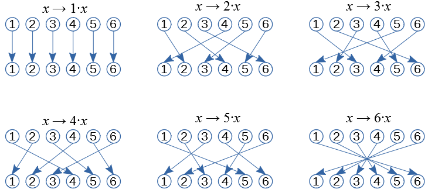
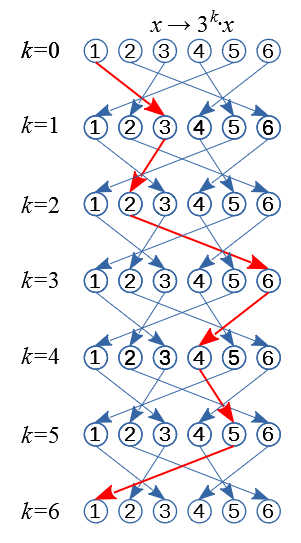
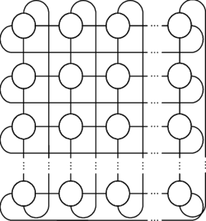

# Introduction<!-- .element: style="visibility:hidden" -->

<hgroup>

<h1 style="font-size:32pt">Skaitļu teorija: 
NMS Juniori</h1>

<blue>Ķīniešu atlikumu teorēma</blue>

</hgroup><hgroup style="font-size:70%">

**(1) Ievads**  
(2) [Bezū identitāte kā vienādojums](#/bezout-identity)  
(3) [Lineāra kongruence ar 1 mainīgo](#/linear-congruences)  
(4) [Ķīniešu atlikumu teorēma](#/crt-theorem)  
(5) [Kongruenču atrisināšana](#/solving-congruences)  
(6) [Skaitļi ar speciālām īpašībām](#/special-numbers)  
(7) [Reducēšana uz p pakāpēm](#/reducing-to-prime-powers)  
(8) [Tipisks piemērs](#/typical-examples)  
(9) [Mājasdarba uzdevumi](#/homework-tasks)  
(10) [Kopsavilkums](#/summary)

</hgroup>

Note:

Šajā nodaļā aplūkojam vairāku periodisku procesu pārklāšanos, 
ja to periodi ir dažādi (tās ir kongruenču sistēmas).
Risinām kongruenču sistēmas pa daļām; 
ievietojam agrāk atrastus risinājumus nākamajās. 
Šos periodiskos procesus izskaidro ķīniešu 
atlikumu teorēma.

-----

# <lo-why/> why

Kāpēc vienlaikus jāapmierina kongruences pēc dažādiem moduļiem?

* Kāpēc reizēm pietiek zināt, ka skaitlis eksistē, pat neatrodot to?
* Kāpēc daudzās teorēmās aplūko kongruences vienīgi pēc pirmskaitļu 
vai to pakāpju moduļiem?

Note:

Ķīniešu atlikumu teorēma ļauj konstruēt (bieži vien ļoti lielos) skaitļus, kas rodas, 
apvienojot vairākas kongruences vienā. 

--

## <lo-theory/> Sasniedzamie rezultāti

* Risināt Bezū identitāti pret `$x,y$`. 
* Risināt jebkuru lineāru kongruenci. 
* Vispārināt 1 mainīgā kongruenci uz kongruenču sistēmu. 
* Aprakstīt tās atrisinājumus, ja moduļi ir 
savstarpēji pirmskaitļi (un apzināties, kas mainās, ja nav). 
* Lietot Ķīniešu atlikumu teorēmu, pamatojot skaitļu 
eksistenci, kam ir speciālas īpašības. 
* Lietot Ķīniešu atlikumu teorēmu saliktu moduļu dekonstrukcijai.

-----

# Bezout Identity<!-- .element: style="visibility:hidden" -->

<hgroup>

<h1 style="font-size:32pt">Skaitļu teorija: 
NMS Juniori</h1>

<blue>Ķīniešu atlikumu teorēma</blue>

</hgroup><hgroup style="font-size:70%">

(1) [Ievads](#/introduction)  
**(2) Bezū identitāte kā vienādojums**  
(3) [Lineāra kongruence ar 1 mainīgo](#/linear-congruences)  
(4) [Ķīniešu atlikumu teorēma](#/crt-theorem)  
(5) [Kongruenču atrisināšana](#/solving-congruences)  
(6) [Skaitļi ar speciālām īpašībām](#/special-numbers)  
(7) [Reducēšana uz p pakāpēm](#/reducing-to-prime-powers)  
(8) [Tipisks piemērs](#/typical-examples)  
(9) [Mājasdarba uzdevumi](#/homework-tasks)  
(10) [Kopsavilkums](#/summary)

</hgroup>

-----

# <lo-theory/> Inversie elementi: Pirmskaitļa modulis

**Teorēma:** Dots pirmskaitlis `$p$` un kāds skaitlis `$a$`, kurš ar `$p$` nedalās. 
Tad eksistē tieši viena kongruenču klase `$x$` (`$x \in \{ 1,\ldots,p-1 \}$`)
kongruenču vienādojumam: 

`$$ax \equiv 1\,(\text{mod}\,p)$$`

Tad `$x$` sauc par `$a$` inverso: `$x = a^{-1}\,(\text{mod}\,p)$`. 
(Parasti neraksta `$x = 1/a$`, jo dalīšana kongruenču klasēm ir pārprotama.)

**Piemērs:** `$3 \cdot 5 \equiv 1\,(\text{mod}\,7)$`, tāpēc `$5 = 3^{-1}\,(\text{mod}\,7)$`.  
Arī otrādi: `$3 = 5^{-1}\,(\text{mod}\,7)$`. 

--

# <lo-summary/> Reizināšana (mod 7)

 

<!-- .element: width="600px" -->

**Apgalvojums:** `$x \rightarrow a \cdot x\;(\text{mod}\,7)$` ir injektīva.  
`$a \cdot x_1 \equiv a \cdot x_2$` nozīmētu `$a \cdot (x_1 - x_2) \equiv 0\;(\text{mod}\,7)$`. 

**Sekas:** Visi nenulles atlikumi `$r \not\equiv 0$` saņem kādu `$a \cdot x\;(\text{mod}\,7)$`
vērtību. Tostarp arī atlikums $r = 1$. Tātad eksistē inversais `$a^{-1}$`.  
(Ja kādu no vērtībām neizmanto - pretruna ar Dirihlē principu.)

--

# <lo-summary/> Mazās Fermā teorēmas pierādījums

<hgroup>

<!-- .element: width="280px" -->

</hgroup><hgroup style="font-size:70%">

**Teorēma:** Ja `$a$` nedalās ar pirmskaitli `$p$`, tad `$a^{p-1} \equiv 1\;(\text{mod}\,p)$`. 

`$$\left\{ \begin{array}{l}
3 \cdot 1 \equiv 3\;(\text{mod}\,7)\\
3 \cdot 2 \equiv 6\;(\text{mod}\,7)\\
3 \cdot 3 \equiv 2\;(\text{mod}\,7)\\
3 \cdot 4 \equiv 5\;(\text{mod}\,7)\\
3 \cdot 5 \equiv 1\;(\text{mod}\,7)\\
3 \cdot 6 \equiv 4\;(\text{mod}\,7)\\
\end{array} \right.$$`

Sareizinām kongruences:  
`$3^6 (1\cdot{}2\cdot{}3\cdot{}4\cdot{}5\cdot{}6) \equiv 
(3\cdot{}6\cdot{}2\cdot{}5\cdot{}1\cdot{}4)$`. 

</hgroup>

Note: Mazā Fermā teorēma nav atkarīga no skaitļu reizināšanas utml. īpašībām, bet
tikai no tā, ka sešiem elementiem vienu un to pašu permutāciju pielieto 
tieši sešas reizes.

-----

## <lo-theory/> Inversie elementi: Vispārīgais gadījums

**Teorēma:** Doti savstarpēji pirmskaitļi `$a$` un `$b$` (`$\text{LKD}(a,b)=1$`).
Eksistē atrisinājums kongruenču vienādojumam
`$$ax \equiv 1\;(\text{mod}\,b).$$`
Tā atrisinājumu `$x$` apzīmēsim ar `$a^{-1}$` (to sauc par `$a$` inverso 
pēc `$b$` moduļa). 

**Pierādījums:** Skaitļu (`$x \in 0,\ldots,b-1$`) 
reizināšana ar `$a$` (pēc `$b$` moduļa) ir injektīva. Nekādi 
divi `$ax_1$` un `$ax_2$` nevar attēloties par to pašu atlikumu.   
**Tātad** kāds no tiem attēlosies par atlikumu `$1$`.

--

## <lo-soln/> Piemērs: Inversie pēc 16 moduļa

<hgroup>

`$$\begin{array}
\mbox{}1^{-1} \equiv 1\\
3^{-1} \equiv 11\\
5^{-1} \equiv 13\\
7^{-1} \equiv 7\\
9^{-1} \equiv 9\\
11^{-1} \equiv 3\\
13^{-1} \equiv 5\\
15^{-1} \equiv 15
\end{array}$$`

</hgroup>
<hgroup>

* Katru no šīm sakarībām var pārbaudīt. Piemēram 
`$$3^{-1} \cdot 3 \equiv 11 \cdot 3 \equiv$$`
`$$\equiv 33 \equiv 1\;(\text{mod}\,16).$$`
* Nav jēgas jautāt, cik ir `$2^{-1}$` pēc `$16$` moduļa, 
jo `$2,16$` nav savstarpēji pirmskaitļi; neeksistē 
tāds `$a$`, kuram `$a\cdot 2$` dod atlikumu `$1$`, dalot ar `$16$`.

</hgroup>

-----

# <lo-theory/> Bezū identitāte

**Apgalvojums:** Dotiem veseliem skaitļiem `$a$` un `$b$` lielākais kopīgais
dalītājs ir `$d$`. Tad eksistē veseli skaitļi `$\color{#F00}{x}$` un `$\color{#F00}{y}$`, 
kas ir atrisinājumi vienādojumam:
`$$a\color{#F00}{x} + b\color{#F00}{y} = d.$$`

**Piezīme 1:** Šie atrisinājumi `$(x,y)$` nav unikāli, vērtību `$d$` var iegūt bezgalīgi daudz veidos.  
**Piezīme 2:** Izteiksmes `$ax+by$` (pie dažādiem `$x,y \in \mathbb{Z}$`) pieņem vērtības, kas ir
visi skaitļa `$d$` daudzkārtņi:
`$$\{ d \cdot z \,\mid\, z \in \mathbb{Z} \}.$$`

--

## <lo-summary/> Bezū identitātes piemērs

**Piemērs:** `$a = 18$`, `$b = 42$`, `$\text{LKD}(18,42) = 6$`.  
Der atrisinājumi `$(x,y) = (\color{#F00}{-2},\color{#F00}{1})$`, 
`$(\color{#F00}{5},\color{#F00}{-2}),\;(\color{#F00}{12},\color{#F00}{-5}), \ldots$`. 
`$$18 \cdot (\color{#F00}{-2}) + 42 \cdot \color{#F00}{1} = 
18 \cdot \color{#F00}{5} + 42 \cdot (\color{#F00}{-2}) = $$`
`$$ = 18 \cdot (\color{#F00}{12}) + 42 \cdot (\color{#F00}{-5}) = 6.$$`
Atrisinājumi `$(x_1,y_1),(x_2,y_2),\ldots$` veido aritmētiskas progresijas ar diferencēm 
`$d_x = 7$`, `$d_y = -3$`.

--

## <lo-summary/> Bezū identitātes pierādījuma ideja

**Pierādījuma ideja:** Aplūkojam naturālu skaitļu kopu:
`$$S=\{ax+by \,\mid\, x,y\in\mathbb{Z} \text{ un } ax+by>0\}.$$`
Šajā kopā eksistē minimālais elements `$d^{\ast} = ax^{\ast} + by^{\ast}$` kaut 
kādām optimālām vērtībām `$(x^{\ast},y^{\ast})$`.

Jāpamato divas lietas:  
**(A)** `$d^{\ast}$` ir skaitļu `$a$` un `$b$` kopīgs dalītājs.  
**(B)** Ja `$c$` ir cits `$a$` un `$b$` kopīgs dalītājs, tad `$c < d^{\ast}$`. 

No **(A)** un **(B)** sekotu, ka šādi definētais `$d^{\ast}$` ir lielākais 
no visiem kopīgajiem dalītājiem, tātad vienāds ar `$d = \text{LKD}(a,b)$`.

--

## <lo-summary/> Bezū identitātes pierādījums 

**(A)** Ja pieņemam, ka `$a$` nedalās ar `$d^{\ast}$`, tad varētu izdalīt, iegūstot pozitīvu atlikumu: 
`$a = d \cdot q + r$`, kur `$q$` ir kāds vesels skaitlis, bet `$0 < r < d^{\ast}$`.  
Bet šādā gadījumā arī `$r = a - d^{\ast} \cdot q = a - (ax^{\ast}+by^{\ast}) \cdot q$`
varētu izteikt formā `$ax+by$`, kur `$r$` arī ir pozitīvs skaitlis un vēl mazāks par `$d^{\ast}$`. 
Bet mēs bijām pieņēmuši, ka `$d^{\ast}$` ir vismazākais. Pretruna. `$\blacksquare$`

**(B)** Ja `$c$` ir dalītājs skaitļiem `$a$` un `$b$`, tad izsakām 
`$a = cu$` un `$b = cv$`, un ievietojam tos `$d^{\ast}$` izteiksmē:
`$$d^{\ast} = ax^{\ast}+by^{\ast} = cux^{\ast} + cvy^{\ast} = c(ux^{\ast} + vy^{\ast}).$$`
Esam ieguvuši, ka `$d^{\ast}$` dalās ar `$c$`, t.i. `$d^{\ast} \geq c$`. Tātad `$d^{\ast}$` ir 
lielākais no kopīgajiem dalītājiem. `$\blacksquare$`

**Piezīme:** Ievērojam, ka `$(x^{\ast},y^{\ast})$`, lai iegūtu mazāko `$d^{\ast} = ax^{\ast}+by^{\ast}$` 
noteikti ir, bet mums nav nekāda algoritma, lai šos nezināmos skaitļus iegūtu. Šis ir 
<blue>*nekonstruktīvs eksistences pierādījums*</blue>.

-----

# <lo-sample/> LV.VO.2001.9.1

Sienāža lēciena garums ir `$5$`. Viņš sākotnēji atrodas punktā ar koordinātām `$(0;0)$` 
un var pārvietoties tikai pa punktiem, kam abas koordinātas ir veseli skaitļi.
1. Pierādīt, ka sienāzis var nokļūt punktā ar koordinātām `$(1;0)$`,  
2. Vai sienāzis var nokļūt jebkurā punktā ar veselām koordinātām?

Note: 
TODO (Atbilžu iesūtīšana), ja kāds gribētu risināt šo uz rūtiņu papīra.

-----

# <lo-summary/> Blankinšipa algoritms

Sk. [Blankinship Algorithm](http://mathworld.wolfram.com/BlankinshipAlgorithm.html)

Sāk ar <blue>*matricu*</blue> (taisnstūrveida tabuliņu ar skaitļiem):
`$$A = \left(
\begin{array}{ccc}
a & 1 & 0 \\
b & 0 & 1 
\end{array} \right).$$`

No vienas rindiņas skaitļiem var atņemt otras rindiņas skaitļus
(un arī otrādi). Cenšamies panākt, lai matrica pārveidotos kādā no formām:

`$$\left(
\begin{array}{ccc}
d & x & y \\
0 & x' & y'
\end{array} \right)\;\;\text{vai}\;\;\left(
\begin{array}{ccc}
0 & x' & y' \\
d & x & y
\end{array} \right)$$`

-----

## <lo-summary/> Monētas {21} un {34}

`$$\left( \begin{array}{c|cc}
21 & 1 & 0 \\
34 & 0 & 1 \end{array} \right) 
\leadsto
\left( \begin{array}{c|cc}
21 & 1 & 0 \\
13 & -1 & 1 \end{array} \right) 
\leadsto
\left( \begin{array}{c|cc}
8 & 2 & -1 \\
13 & -1 & 1 \end{array} \right) 
\leadsto$$`

`$$\leadsto \left( \begin{array}{c|cc}
8 & 2 & -1 \\
5 & -3 & 2 \end{array} \right) 
\leadsto
\left( \begin{array}{c|cc}
3 & 5 & -3 \\
5 & -3 & 2 \end{array} \right) 
\leadsto
\left( \begin{array}{c|cc}
3 & 5 & -3 \\
2 & -8 & 5 \end{array} \right) 
\leadsto
$$`

`$$\leadsto
\left( \begin{array}{c|cc}
1 & 13 & -8 \\
2 & -8 & 5 \end{array} \right) 
\leadsto
\left( \begin{array}{c|cc}
\color{#F00}{1} & \color{#F00}{13} & \color{#F00}{-8} \\
0 & -34 & 21 \end{array} \right).$$`

`$$\left\{ \begin{array}{l}
21 = 1 \cdot \{21\} + 0 \cdot \{34\} \\
34 = 0 \cdot \{21\} + 1 \cdot \{34\} \\
\end{array} \right. 
\;\;\Rightarrow\;\;
\color{#F00}{1} = \color{#F00}{13} \cdot \{21\} + \color{#F00}{(-8)} \cdot \{34\}.$$`

-----

# <lo-theory/> Bezū identitātes vispārinājums

**Apgalvojums:** Ja `$a_1,\ldots,a_n$` ir veseli skaitļi (`$n \geq 3$`):
`$\text{LKD}(a_1, a_2, \ldots, a_n) = d,$`
tad eksistē veseli skaitļi `$x_{1},x_{2},\ldots ,x_{n}$`, kuriem
`$$d=a_{1}x_{1}+a_{2}x_{2}+\cdots +a_{n}x_{n}$$`

--

## <lo-summary/> Blankinšipa vispārinājums - 1

`$$\left( \begin{array}{c|ccc}
187 & 1 & 0 & 0 \\
221 & 0 & 1 & 0 \\
323 & 0 & 0 & 1 \\ \end{array} \right) 
\xrightarrow{\color{#00F}{R_3 \;:=\; (R_3 - R_2)}}
\left( \begin{array}{c|ccc}
187 & 1 & 0 & 0 \\
221 & 0 & 1 & 0 \\
102 & 0 & -1 & 1 \\ \end{array} \right) 
\xrightarrow{\color{#00F}{R_2 \;:=\; (R_2 - 2R_3)}}$$`

`$$\rightarrow \left( \begin{array}{c|ccc}
187 & 1 & 0 & 0 \\
17 & 0 & 3 & -2 \\
102 & 0 & -1 & 1 \\ \end{array} \right) 
\xrightarrow{\color{#00F}{R_1 \;:=\; (R_1 - 11R_2)}}
\left( \begin{array}{c|ccc}
0 & 1 & -33 & 22 \\
17 & 0 & 3 & -2 \\
102 & 0 & -1 & 1 \\ \end{array} \right) 
\xrightarrow{\color{#00F}{R_3 \;:=\; (R_3 - 6R_2)}}$$`

`$$\rightarrow \left( \begin{array}{c|ccc}
0 & 1 & -33 & 22 \\
\color{#F00}{17} & \color{#F00}{0} & \color{#F00}{3} & \color{#F00}{-2} \\
0 & 0 & -19 & 13 \\ \end{array} \right).$$`

--

## <lo-summary/> Blankinšipa vispārinājums - 2

* Šajā piemērā `$a_1 = 187$`, `$a_2 = 221$` un 
`$a_3 = 323$`. 
* Matrica $A$ ir `$3 \times 4$` (3 rindas, 4 kolonnas).
* Rindu pārveidojumi iegūst pirmajā kolonnā tikai vienu nenulles skaitli `$d$`. 
* Tad `$17 = \text{LKD}(187,221,323)$`. 

`$$\left\{ \begin{array}{l}
187 = 1 \cdot \{187\} + 0 \cdot \{221\} + 0 \cdot \{323\} \\
221 = 0 \cdot \{187\} + 1 \cdot \{221\} + 0 \cdot \{323\} \\
323 = 0 \cdot \{187\} + 0 \cdot \{221\} + 1 \cdot \{323\} \\
\end{array} \right. 
\;\;\Rightarrow$$`

`$$\Rightarrow \color{#F00}{17} = \color{#F00}{0} \cdot \{187\} + \color{#F00}{3} \cdot \{221\} + \color{#F00}{(-2)} \cdot \{323\}.$$`

<emblue>Gausa izslēgšana</emblue> (*Gaussian elimination*) pretējā virzienā.

-----

# Linear Congruences<!-- .element: style="visibility:hidden" -->

<hgroup>

<h1 style="font-size:32pt">Skaitļu teorija: 
NMS Juniori</h1>

<blue>Ķīniešu atlikumu teorēma</blue>

</hgroup><hgroup style="font-size:70%">

(1) [Ievads](#/introduction)  
(2) [Bezū identitāte kā vienādojums](#/bezout-identity)  
**(3) Lineāra kongruence ar 1 mainīgo**  
(4) [Ķīniešu atlikumu teorēma](#/crt-theorem)  
(5) [Kongruenču atrisināšana](#/solving-congruences)  
(6) [Skaitļi ar speciālām īpašībām](#/special-numbers)  
(7) [Reducēšana uz p pakāpēm](#/reducing-to-prime-powers)  
(8) [Tipisks piemērs](#/typical-examples)  
(9) [Mājasdarba uzdevumi](#/homework-tasks)  
(10) [Kopsavilkums](#/summary)

</hgroup>

-----

# <lo-theory/> Lineāras kongruences

**Algoritmisks uzdevums:** Atrisināt šādu kongruenču vienādojumu:
`$ax \equiv m\;(\text{mod}\,b)$`, kur `$a,b$` ir veseli skaitļi un 
`$m$` dalās ar `$a,b$` lielāko kopīgo dalītāju `$d = \text{LKD}(a,b)$`.

**Piezīme 1:** Ja `$m$` nedalās ar `$d$`, tad 
kongruenču vienādojumam atrisinājuma nav vispār.
Piemēram, `$6x \equiv 7\;(\text{mod}\,16)$` nevar atrisināt, 
jo `$6x$` nevar dot nepāru atlikumu, dalot ar `$16$`. 

**Piezīme 2:** Ja `$a$` un `$b$` nav savstarpēji pirmskaitļi, 
tad kongruenču vienādojumam var būt vairāki atrisinājumi. 
Piemēram, `$6x \equiv 2\;(\text{mod}\,16)$` eksistē divi 
atrisinājumi:
`$$\left\{ \begin{array}{l}
x \equiv 3\;(\text{mod}\,16)\\
x \equiv 11\;(\text{mod}\,16)
\end{array} \right.$$`

--

## <lo-theory/> Kāpēc eksistē vairāki atrisinājumi?

Risinot kongruenču vienādojumus `$ax \equiv m\;(\text{mod}\,b)$` 
ir iespējami vairāki gadījumi:

1. Ja `$b$` ir pirmskaitlis, tad katram `$a \not\equiv 0\;(\text{mod}\,b)$` 
kongruenču vienādojumam `$ax \equiv m\;(\text{mod}\,b)$` eksistē 
viens noteikts atrisinājums. 
`$$3x \equiv 4\;(\text{mod}\,7)\;\;\Rightarrow\;\;x \equiv 6\;(\text{mod}\,7).$$`
2. Ja `$b$` nav pirmskaitlis, bet `$a$`, `$m$` ir savstarpēji 
pirmskaitļi ar `$b$`, arī tad kongruenču vienādojumam 
`$a \not\equiv 0\;(\text{mod}\,b)$` eksistē viens vienīgs atrisinājums. 
3. Situācijas, kad `$a$` nav savstarpējs pirmskaitlis ar `$b$` 
(jau redzētais `$6x \equiv 2\;(\text{mod}\,16)$` u.c.) <red>pirms risināšanas
ir jāpārveido</red>. Piemēram, jānoīsina ar `$2$`, lai iegūtu viennozīmīgi risināmu 
`$$3x \equiv 1\;(\text{mod}\,8).$$`

--

## <lo-theory/> Lineāra kongruence

Kāpēc lineārai kongruencei 
`$ax \equiv c\;(\text{mod}\,b)$` (kur `$a,b$` ir veseli skaitļi un `$c$`
dalās ar `$d = \text{LKD}(a,b)$`) eksistē atrisinājums?

**Pierādījums:** Tās ir sekas no Bezū identitātes. Var atrisināt `$ax+by=d$`, kam
`$ax - d$` dalās ar `$b$` (tātad `$ax$` un `$d$` ir kongruenti pēc
`$b$` moduļa). 

Pēc tam šādi atrastu `$x$` reizina ar `$c/d$`, ja `$c$` ir kāds lielāks skaitlis par LKD.

-----

## <lo-sample/> Lineāras kongruences

1. Atrisināt kongruenci `$16x \equiv 14\,(\text{mod}\,40)$`.
2. Atrisināt kongruenci `$26x \equiv 14\,(\text{mod}\,42)$`.
3. Dots, ka `$x \equiv 7\,(\text{mod}\,11)$` un `$x \equiv 2\,(\text{mod}\,7)$`. Atrast, ar ko 
kongruents `$x$` (mod 77). 
4. Atrisināt kongruenci `$x^2 \equiv 7\,(\text{mod}\,27)$`.

-----

# CRT Theorem<!-- .element: style="visibility:hidden" -->

<hgroup>

<h1 style="font-size:32pt">Skaitļu teorija: 
NMS Juniori</h1>

<blue>Ķīniešu atlikumu teorēma</blue>

</hgroup><hgroup style="font-size:70%">

(1) [Ievads](#/introduction)  
(2) [Bezū identitāte kā vienādojums](#/bezout-identity)  
(3) [Lineāra kongruence ar 1 mainīgo](#/linear-congruences)  
**(4) Ķīniešu atlikumu teorēma**  
(5) [Kongruenču atrisināšana](#/solving-congruences)  
(6) [Skaitļi ar speciālām īpašībām](#/special-numbers)  
(7) [Reducēšana uz p pakāpēm](#/reducing-to-prime-powers)  
(8) [Tipisks piemērs](#/typical-examples)  
(9) [Mājasdarba uzdevumi](#/homework-tasks)  
(10) [Kopsavilkums](#/summary)

</hgroup>

-----

# <lo-theory/> Ķīniešu atlikumu teorēma

**Teorēma:** 
Ja `$m_1,m_2,\ldots,m_k$` ir pa pāriem savstarpēji pirmskaitļi, 
bet `$a_1,a_2,\ldots,a_k$` ir jebkādi veseli skaitļi, tad eksistē
vesels atrisinājums `$x \in \mathbb{Z}$` šādai kongruenču 
sistēmai 
`$$\left\{ \begin{array}{l}
x \equiv a_1\;(\text{mod}\,m_1)\\
x \equiv a_2\;(\text{mod}\,m_2)\\
\vdots\\
x \equiv a_k\;(\text{mod}\,m_k)
\end{array} \right.$$`
Turklāt visi šīs sistēmas atrisinājumi ir kongruenti 
pēc moduļa `$M = m_1\cdot m_2 \cdot \ldots \cdot m_k$`.

--

## <lo-theory/> Piemērs

<hgroup>

</hgroup>
<hgroup>

`$$\left\{ \begin{array}{l}
x \equiv 1\;(\text{mod}\,3)\\
x \equiv 2\;(\text{mod}\,5)\\
x \equiv 3\;(\text{mod}\,7)
\end{array} \right.$$`

ir ekvivalents ar vienu kongruenci:

`$$x \equiv 52\;(\text{mod}\,105)$$`

</hgroup>

--

## <lo-theory/> Pierādījums (atrisinājuma unikalitāte)

**Pierādījums:**
Ja `$x_1$` un `$x_2$` ir divi atrisinājumi, 
tad to starpība `$x_1 - x_2$` dalās ar `$m_1,\ldots,m_k$`.  
Un tā kā visi `$m_i$` ir savstarpēji pirmskaitļi, tad 
`$x_1 - x_2$` dalās arī ar `$M$`. 

Tātad, atrisinājums, ja tāds vispār eksistē, ir viens vienīgs 
(ar precizitāti līdz `$M$` daudzkārtņa pieskaitīšanai).

--

## <lo-theory/> Pierādījums (atrisinājuma eksistence)

**Pierādījums:** Katru skaitli `$n$` no `$0$` līdz `$M-1$` dalām 
ar visiem skaitļiem `$m_1,\ldots,m_k$`. Iegūstam 
sarakstiņu ar k skaitļiem `$(n_1,n_2,\ldots,n_k)$`. 

Nupat (atrisinājuma unikalitāte) redzējām, ka 
attēlojums `$n \rightarrow (n_1,n_2,\ldots,n_k)$` ir 
*injektīvs* (nav iespējams, ka divām dažādām 
`$n$` vērtībām atbilst vienādi sarakstiņi).  
Bet tā kā iespējamo sarakstiņu ir `$m_1 \times \ldots \times m_k = M$`, 
tad to ir tikpat cik `$n$` vērtību. Tas nozīmē, ka
ikviens sarakstiņš ir iegūstams. Ja kāds nebūtu iegūstams, 
tad katrai `$n$` vērtībai nepietiktu sarakstiņa (Dirihlē princips).

--

## <lo-theory/> Par ķīniešu atlikumu teorēmu

> The Chinese Remainder Theorem is a "theorem" only in that it is useful
> and requires proof. When you ask a capable 15-year-old why an arithmetic
> progression with common difference 7 must contain multiples of 3, they will
> often say exactly the right thing.  
> (Dominic Yeo, "Eventually Almost Everywhere".)

-----

# <lo-sample/> Skaitlisks piemērs

<hgroup>

Atrast atrisinājumu kongruenču sistēmai 

`$$\left\{ \begin{array}{l}
x \equiv 4\;(\text{mod}\,5)\\
x \equiv 6\;(\text{mod}\,11)
\end{array} \right.$$`

Var risināt ar mēģinājumu/kļūdu metodi:

</hgroup>
<hgroup style="font-size:80%">

* Pārbaudīt atlikumus ar `$5$` ir vieglāk
nekā ar `$11$`.  
* Aprakstām aritmētisko progresiju ar diferenci `$11$`: 
`$$(a_n) = 6,17,28,39,50,61,\ldots$$`
* Gaidām brīdi, kad tajā ir loceklis, kura pēdējais
cipars ir `$4$` vai `$9$` (t.i. kongruents ar `$4$` pēc moduļa `$5$`). 

Der loceklis `$39$`. Tas arī ir sistēmas atrisinājums.  
Derēs arī visi citi `$39 + 55k$` (atrisinājumi veido aritmētisku 
progresiju ar diferenci `$55$`).

</hgroup>

--

## <lo-sample/> Pārveidojums par Bezū identitāti

<hgroup style="font-size:70%">

`$$\left\{ \begin{array}{l}
x \equiv 4\;(\text{mod}\,5)\\
x \equiv 6\;(\text{mod}\,11)
\end{array} \right.$$`

Pārrakstām kongruences kā skaitļu 
vienādojumus:

`$$\left\{ \begin{array}{l}
x - 4 = 5k\\
x - 6 = 11m
\end{array} \right.$$`

Atņemam no pirmā otro:

`$(-4) - (-6) = 5k - 11m$` jeb  
`$5k + (-11)m = 2$`.

</hgroup>
<hgroup style="font-size:70%">

`$$\left( \begin{array}{c|cc}
5 & 1 & 0 \\
-11 & 0 & 1 
\end{array} \right)$$`

`$$\xrightarrow{R_2 := R_2 + 2R_1} \left( \begin{array}{c|cc}
5 & 1 & 0 \\
-1 & \color{#F00}{2} & \color{#F00}{1} 
\end{array} \right)$$`

Esam ieguvuši: `$\color{#F00}{2} \cdot 5 + \color{#F00}{1} \cdot (-11) = -1$`
jeb, piereizinot ar `$-2$`:
`$$\color{#F00}{-4} \cdot 5 + \color{#F00}{-2} \cdot (-11) = 2.$$`

`$$x = 5\color{#F00}{k} + 4 = 5\cdot (\color{#F00}{-4}) + 4 = -16.$$`

Visbeidzot: `$-16 \equiv 39\;(\text{mod}\,55)$`. 

</hgroup>

--

## <lo-sample/> Ilustrācija ar tabulu

Ir pavisam `$55$` atlikumi, kas rodas, dalot ar `$55$`. 
Katram no šiem atlikumiem atbilst atlikums dalot ar `$11$` (no `$0$` līdz $10)  
<blue>**UN**</blue> atlikums dalot ar `$5$` (no `$0$` līdz `$4$`). Ierakstām skaitļus 
`$0,1,2,\ldots$` pa diagonāli (ar aptīšanos). 

<table>
<tr>
<th>&nbsp;</th><th>0</th><th>1</th><th>2</th><th>3</th><th>4</th><th>5</th><th>6</th><th>7</th><th>8</th><th>9</th><th>10</th>
</tr>
<tr>
<th>0</th><td>0</td><td>&nbsp;</td><td>35</td><td>25</td><td>15</td><td>5</td><td>&nbsp;</td><td>&nbsp;</td><td>30</td><td>20</td><td>10</td>
</tr>
<tr>
<th>1</th><td>11</td><td>1</td><td>&nbsp;</td><td>36</td><td>26</td><td>16</td><td>6</td><td>&nbsp;</td><td>&nbsp;</td><td>31</td><td>21</td>
</tr>
<tr>
<th>2</th><td>22</td><td>12</td><td>2</td><td>&nbsp;</td><td>37</td><td>27</td><td>17</td><td>7</td><td>&nbsp;</td><td>&nbsp;</td><td>32</td>
</tr>
<tr>
<th>3</th><td>33</td><td>23</td><td>13</td><td>3</td><td>&nbsp;</td><td>38</td><td>28</td><td>18</td><td>8</td><td>&nbsp;</td><td>&nbsp;</td>
</tr>
<tr>
<th>4</th><td>&nbsp;</td><td>34</td><td>24</td><td>14</td><td>4</td><td>&nbsp;</td><td><red>39</red></td><td>29</td><td>19</td><td>9</td><td>&nbsp;</td>
</tr>
</table>

--

## <lo-sample/> Tora topoloģija

<hgroup style="font-size:80%">

Tabulas aizpildīšanā "pa diagonāli" izmantojām "tora topoloģiju". (Tors - barankas formas objekts; topoloģija - 
definīcija par to, kuri punkti atrodas "blakus"). 

</hgroup>
<hgroup style="font-size:80%">

Katram laukumiņam uz tora atbilst šūna kvadrātveida tabulā. Bet topoloģija jeb kaimiņattiecības ir tās pašas:

</hgroup>

-----

# <lo-sample/> LT.VUMIF.2016.10.3

Atrodiet mazāko naturālo skaitli `$n$`, kuram skaitļi 
`$\sqrt[5]{5n}$`, `$\sqrt[6]{6n}$`, `$\sqrt[7]{7n}$`
ir naturāli. 

Sk. [Viļņas universitātes Matemātikas un informātikas fakultātes rīkotā olimpiāde skolēniem](http://mif.vu.lt/matematikos-olimpiados/mif/)

--

## <lo-soln/> LT.VUMIF.2016.10.3 (pirmreizinātāji)

Apzīmējam `$n = 2^a3^b5^c7^d$` ir `$n$` sadalījums pirmreizinātājos. 
Citus pirmreizinātājus neieviešam
(aizdomas, ka tie nebūs vajadzīgi - citi kāpinātāji būs `$0$`). 

* `$\sqrt[5]{5n} \in \mathbb{N}$` nozīmē, ka `$a, b, c-1, d$` dalās ar `$5$`
* `$\sqrt[6]{6n} \in \mathbb{N}$` nozīmē, ka `$a-1, b-1, c, d$` dalās ar `$6$`
* `$\sqrt[7]{7n} \in \mathbb{N}$` nozīmē, ka `$a,b,c,d-1$` dalās ar `$7$`

--

## <lo-soln/> LT.VUMIF.2016.10.3 (atrod atsevišķi a,b,c,d)

* `$a$` un `$b$` dalās ar `$5$` un `$7$`, dod atlikumu `$5$`, dalot ar `$6$`. 
Mazākais tāds skaitlis ir `$a=b=35$`.
* `$c$` dalās ar `$6$` un `$7$`, dod atlikumu `$4$`, dalot ar `$5$`. 
Mazākais tāds skaitlis ir `$c=84$`.
* `$d$` dalās ar `$5$` un `$6$`, dod atlikumu `$6$`, dalot ar `$7$`. 
Mazākais tāds skaitlis ir `$90$`. 

`$$n = 2^{35}\cdot{}3^{35}\cdot{}5^{84}\cdot{}7^{90}.$$`

--

## <lo-soln/> LT.VUMIF.2016.10.3 (alternatīvs pieraksts)

<hgroup>

Ķīniešu atlikumu teorēma var būt netieši/apslēpti izmantota (kā iepriekšējā slaidā).  
Bet to var arī izcelt, uzrakstot kongruenču sistēmu.

> `$c$` dalās ar `$6$` un `$7$`, dod atlikumu `$4$`, dalot ar `$5$`. 

</hgroup>
<hgroup>

`$$\left\{ \begin{array}{l}
x \equiv 0\;(\text{mod}\,6)\\
x \equiv 0\;(\text{mod}\,7)\\
x \equiv 4\;(\text{mod}\,5)
\end{array} \right.$$`

ir ekvivalenta vienai kongruencei:

`$$x \equiv 84\;(\text{mod}\,210),$$`

(*Šeit `$210 = 6 \cdot 7 \cdot 5$`.*)

</hgroup>

-----

# Solving Congruences<!-- .element: style="visibility:hidden" -->

<hgroup>

<h1 style="font-size:32pt">Skaitļu teorija: 
NMS Juniori</h1>

<blue>Ķīniešu atlikumu teorēma</blue>

</hgroup><hgroup style="font-size:70%">

(1) [Ievads](#/introduction)  
(2) [Bezū identitāte kā vienādojums](#/bezout-identity)  
(3) [Lineāra kongruence ar 1 mainīgo](#/linear-congruences)  
(4) [Ķīniešu atlikumu teorēma](#/crt-theorem)  
**(5) Kongruenču atrisināšana**  
(6) [Skaitļi ar speciālām īpašībām](#/special-numbers)  
(7) [Reducēšana uz p pakāpēm](#/reducing-to-prime-powers)  
(8) [Tipisks piemērs](#/typical-examples)  
(9) [Mājasdarba uzdevumi](#/homework-tasks)  
(10) [Kopsavilkums](#/summary)

</hgroup>

-----

# <lo-sample/> Piemērs

Pierādīt, ka eksistē bezgalīgi daudz pozitīvu pāra skaitļu `$k$`, ka 
visiem pirmskaitļiem `$p$`, skaitlis `$p^2 + k$` būs salikts skaitlis. 

--

# <lo-soln/> Risināšanas plāns

Atradīsim tādu `$k$`, kuram izpildās vairākas kongruences:

`$$\left\{ \begin{array}{l}
k \equiv 0\;(\text{mod}\,2)\\
k \equiv 2\;(\text{mod}\,3)\\
k \equiv 1\;(\text{mod}\,5)
\end{array} \right.$$`

Kuriem pirmskaitļiem `$p$` kalpo katra rindiņa šajā sistēmā? 
Kuriem `$p$` attiecīgā kongruence padara `$p^2 + k$` par saliktu skaitli?

Note: 
Atrisinājums ir x = 26 (mod 30).

-----

# Special Numbers<!-- .element: style="visibility:hidden" -->

<hgroup>

<h1 style="font-size:32pt">Skaitļu teorija: 
NMS Juniori</h1>

<blue>Ķīniešu atlikumu teorēma</blue>

</hgroup><hgroup style="font-size:70%">

(1) [Ievads](#/introduction)  
(2) [Bezū identitāte kā vienādojums](#/bezout-identity)  
(3) [Lineāra kongruence ar 1 mainīgo](#/linear-congruences)  
(4) [Ķīniešu atlikumu teorēma](#/crt-theorem)  
(5) [Kongruenču atrisināšana](#/solving-congruences)  
**(6) Skaitļi ar speciālām īpašībām**  
(7) [Reducēšana uz p pakāpēm](#/reducing-to-prime-powers)  
(8) [Tipisks piemērs](#/typical-examples)  
(9) [Mājasdarba uzdevumi](#/homework-tasks)  
(10) [Kopsavilkums](#/summary)

</hgroup>

-----

# <lo-theory/> Konstruēšanas uzdevumi

**Stratēģija:** Lai pamatotu, ka eksistē skaitļi ar noteikta veida 
neparastu īpašību, sadalām šo īpašību daudzās lineārās kongruencēs 
(pēc moduļiem, kuri ir savstarpēji pirmskaitļi)
un risinām šo sistēmu. 

-----

# <lo-sample> USAMO.2008.1

Pierādīt, ka jebkuram naturālam `$n$`, eksistē `$n+1$` 
savstarpēji pirmskaitļi `$k_0,k_1,\ldots,k_n$`, kas visi lielāki par `$1$`, kuriem 
`$k_0 \cdot k_1 \cdot \ldots \cdot k_n - 1$`
ir divu pēc kārtas sekojošu naturālu skaitļu reizinājums.

--

## <lo-hints/> USAMO.2008.1

<hgroup>

Pierādīt, ka jebkuram naturālam `$n$`, eksistē `$n+1$` 
savstarpēji pirmskaitļi `$k_0,k_1,\ldots,k_n$`, kas visi lielāki par `$1$`, kuriem 
`$k_0 \cdot k_1 \cdot \ldots \cdot k_n - 1$`
ir divu pēc kārtas sekojošu naturālu skaitļu reizinājums.

</hgroup>
<hgroup>

> Izsakām ekvivalentu apgalvojumu, sākot no teikuma beigām.
> Mērķis: samazināt "kustīgo gabalu" skaitu.

</hgroup>

--

## <lo-hints/> USAMO.2008.1

**Lemma 1:** Ja `$t_i^2 + t_i+ 1$` dalās ar pirmskaitli `$p_i$` (`$i = 0,\ldots,n$`), 
tad eksistēs arī tāds `$t^{\ast}$`, kuram `$(t^{\ast})^2 + t^{\ast} + 1$` dalās
ar visu šo pirmskaitļu reizinājumu?

**Lemma 2:** Vai eksistē bezgalīgi daudz pirmskaitļu `$p_i$`, kuriem 
var atrisināt `$t^2 + t + 1 \equiv 0$` pēc `$p_i$` moduļa? (T.i. polinoma
`$P(t) = t^2 + t + 1$` vērtība kaut kādam `$t$` dalās ar `$p_i$`)?

-----

# Reducing to Prime Powers<!-- .element: style="visibility:hidden" -->

<hgroup>

<h1 style="font-size:32pt">Skaitļu teorija: 
NMS Juniori</h1>

<blue>Ķīniešu atlikumu teorēma</blue>

</hgroup><hgroup style="font-size:70%">

(1) [Ievads](#/introduction)  
(2) [Bezū identitāte kā vienādojums](#/bezout-identity)  
(3) [Lineāra kongruence ar 1 mainīgo](#/linear-congruences)  
(4) [Ķīniešu atlikumu teorēma](#/crt-theorem)  
(5) [Kongruenču atrisināšana](#/solving-congruences)  
(6) [Skaitļi ar speciālām īpašībām](#/special-numbers)  
**(7) Reducēšana uz p pakāpēm**  
(8) [Tipisks piemērs](#/typical-examples)  
(9) [Mājasdarba uzdevumi](#/homework-tasks)  
(10) [Kopsavilkums](#/summary)

</hgroup>

-----

# <lo-sample/> US.MPGO.2010.2

**Uzdevums:** Pierādīt, ka jebkuram naturālam `$n$`, eksistē veseli skaitļi `$a$` un `$b$`, kuriem 
`$4a^2 + 9b^2 - 1$` dalās ar `$n$`. 

[Math Prize for Girls Olympiad, 2010, P2](https://artofproblemsolving.com/community/c952032_2010_math_prize_for_girls_olympiad)

--

## <lo-hints/> US.MPGO.2010.2 (destrukcija)

> Izmantojam Ķīniešu atlikumu teorēmu, lai iespējami samazinātu 
> aplūkojamo `$n$` vērtību kopumu.

* "Destrukcija" - patvaļīgā `$n$` vietā aplūkojam vienīgi pirmskaitļu pakāpes `$p^k$`. 

--

## <lo-soln/> US.MPGO.2010.2

Aplūkosim divus gadījumus, kad `$n$` ir pirmskaitļu pakāpe. 

**1.gadījums:** Ja `$n= 2^k$`, izvēlamies `$a \equiv 0\;(\text{mod}\,2^k)$` un 
`$b \equiv 3^{-1}\;(\text{mod}\,2^k)$`. 

--

## <lo-soln/> US.MPGO.2010.2

**2.gadījums:** Ja `$n = p^k$` (`$p \neq 2$`), tad izvēlamies `$a \equiv 2^{-1}\;(\text{mod}\,p^k)$` 
un `$b \equiv 0\;(\text{mod}\,p^k)$`.

-----

# <lo-sample/> Piemērs - Fibonači virknes atlikumi

**Uzdevums:**  Vai eksistē bezgalīgi daudzi Fibonači skaitļi, kuri:  
**(a)** Dalās ar `$1001$` bez atlikuma (atlikums `$0$`),  
**(b)** Dod atlikumu `$900$`, dalot ar `$1001$`,  
**(c)** Dod atlikumu `$1000$`, dalot ar `$1001$`.

**Piezīme:** Fibonači virkni (`$0,1,1,2,3,5,8,13,21,\ldots$`) definē šādi:  
`$F_0 = 0$`, `$F_1 = 1$` un `$F_{k+1} = F_{k-1}+F_{k}$` visiem `$k \geq 1$`. (Katrs nākamais
loceklis ir divu iepriekšējo locekļu summa.)

--

## <lo-soln/> Piemērs - Fibonači virknes atlikumi (a)

**(a)** Bezgalīgi daudzi `$F_n$` dalās ar `$1001$`. Vispārīgs apgalvojums ir šāds:

**Apgalvojums:** Jebkuram `$k$`, eksistē bezgalīgi daudzi `$F_n$`, kas dalās ar `$k$`. 

**Pierādījums:** `$F_0 = 0$` dalās ar `$k$`.  
Ievērosim, ka atlikumi, dalot ar `$k$`, pēc kāda laika kļūst periodiski: Katru 
nākamo atlikumu nosaka iepriekšējie divi atlikumi, un iespējamo 
atlikumu pārīšu ir ne vairāk kā `$k \cdot k$` - galīgs skaits. Tātad 
virknē pēc kāda laika tas pats blakusesošu atlikumu pārītis parādīsies
atkārtoti (un no šīs vietas sāksies cikls). 

Fibonači virknes atlikumi nevar veidot nekādus "priekšperiodus", tāpēc, ka
`$F_{k-1} = F_{k+1} - F_{k}$` (no diviem nākamajiem atlikumiem var viennozīmīgi 
izrēķināt iepriekšējo). 

--

## <lo-soln/> Piemērs - Fibonači virknes atlikumi (a)

`$1001 = 7 \cdot 11 \cdot 13$`. Tāpēc apskatāmies tikai atlikumus pēc pirmskaitļiem `$7, 11, 13$`: 

* Dalot `$F_n$` ar `$7$`, periodiski atkārtojas `$16$` atlikumi: `$0, 1, 1, 2, 3, 5, 1, 6, 0, 6, 6, 5, 4, 2, 6, 1$`
* Dalot `$F_n$` ar `$11$`, periodiski atkārtojas `$10$` atlikumi: `$0, 1, 1, 2, 3, 5, 8, 2, 10, 1$`
* Dalot `$F_n$` ar `$13$`, periodiski atkārtojas `$28$` atlikumi: 
`$$0, 1, 1, 2, 3, 5, 8, 0, 8, 8, 3, 11, 1, 12, 0, 12, 12, 11, 10, 8, 5, 0, 5, 5, 10, 2, 12, 1$$`

Aprēķinām kopīgā cikla garumu: `$\text{LKD}(16,10,28) = 560$`.  
Tātad periods (atlikumiem pēc `$1001$` moduļa) iestāsies pēc `$560$` soļiem:
`$$F_0 \equiv F_{560} \equiv F_{1120} \equiv \ldots \equiv 0\;(\text{mod}\,1001).$$`

--

## <lo-soln/> Piemērs - Fibonači virknes atlikumi (b)

**(b)** Atlikums `$900$` nav iespējams, jo, dalot ar `$11$`, nevar panākt, lai `$F_n$` dotu atlikumu `$9$`.
Atlikuma `$9$` periodiskajā virknē `$0, 1, 1, 2, 3, 5, 8, 2, 10, 1$` vienkārši nav.

--

## <lo-soln/> Piemērs - Fibonači virknes atlikumi (c)

**(c)** Atlikumu `$1000$`, dalot ar `$1001$` dod tie `$x$`, kam izpildās kongruences:

`$$\left\{
\begin{array}{l}
x \equiv -1 \equiv 6 \;(\text{mod}\,7)\\
x \equiv -1 \equiv 10 \;(\text{mod}\,11)\\
x \equiv -1 \equiv 12 \;(\text{mod}\,13)
\end{array} \right.$$`

Atlikumu `$6$`, dalot ar `$7$` var panākt, 
ja Fibonači virknes numurs `$n$` ir kongruents ar `$(-2)$` pēc moduļa `$16$`. Jo sešpadsmit periodiski atkārtojošos atlikumu 
virknē (`$0, 1, 1, 2, 3, 5, 1, 6, 0, 6, 6, 5, 4, 2, \color{#F00}{6}, 1$`)
skaitlis `$6$` ir, piemēram, otrais no beigām.   
Arī, aplūkojot `$F_n$` pēc `$11$` un `$13$` moduļiem, der priekšpēdējie atlikumi.

Skaitlis `$558$` ir kongruents ar `$(-2)$` gan pēc `$16$`, gan pēc `$10$`, gan pēc `$28$` moduļa. Tātad 
tas dos vajadzīgos atlikumus dalot ar `$7,11,13$` un tādēļ
`$$F_{558} \equiv F_{558+560} \equiv F_{558 + 2\cdot 560} \equiv \ldots \equiv 1000\;(\text{mod}\,1001).$$`

Skaitli `$560$` var pieskaitīt, jo jau agrāk noskaidrojām, ka pēc `$1001$` moduļa, atlikumu 
atkārtošanās periods ir `$\text{LKD}(16,10,28) = 560$`.

-----

# Typical Examples<!-- .element: style="visibility:hidden" -->

<hgroup>

<h1 style="font-size:32pt">Skaitļu teorija: 
NMS Juniori</h1>

<blue>Ķīniešu atlikumu teorēma</blue>

</hgroup><hgroup style="font-size:70%">

(1) [Ievads](#/introduction)  
(2) [Bezū identitāte kā vienādojums](#/bezout-identity)  
(3) [Lineāra kongruence ar 1 mainīgo](#/linear-congruences)  
(4) [Ķīniešu atlikumu teorēma](#/crt-theorem)  
(5) [Kongruenču atrisināšana](#/solving-congruences)  
(6) [Skaitļi ar speciālām īpašībām](#/special-numbers)  
(7) [Reducēšana uz p pakāpēm](#/reducing-to-prime-powers)  
**(8) Tipisks piemērs**  
(9) [Mājasdarba uzdevumi](#/homework-tasks)  
(10) [Kopsavilkums](#/summary)

</hgroup>

<!-- andreescu-andrica-problems-on-number-theory.pdf, p52 -->

-----

# <lo-sample/> BW.2016.2

Pierādīt vai apgāzt sekojošus apgalvojumus:  
**(a)** Jebkuram `$k \geq 2$`, un jebkuriem `$k$` pēc kārtas sekojošiem naturāliem 
skaitļiem atradīsies skaitlis, kurš nedalās ne ar vienu pirmskaitli, kas mazāks par `$k$`.   
**(b)** Jebkuram `$k \geq 2$`, un jebkurai `$k$` pēc kārtas sekojošu naturālu skaitļu virknei atradīsies skaitlis, kas ir savstarpējs pirmskaitlis ar visiem citiem virknes locekļiem. 

*Iedomāsimies, ka abi šie apgalvojumi ir patiesi...
Kurš no tiem šķiet interesantāks? Vai kāds no apgalvojumiem seko no otra?*

--

## <lo-reading/> BW.2016.2 (a)

> **(a)** Jebkuram `$k \geq 2$`, un jebkuriem `$k$` pēc kārtas sekojošiem naturāliem 
> skaitļiem atradīsies skaitlis, kurš nedalās ne ar vienu pirmskaitli, kas mazāks par `$k$`.

Apgalvojums **(a)** izteikts ar kvantoriem:

`$$(\forall k \geq 2)(\forall n \in \mathbb{N})(\exists i \in \{ n,\ldots,n+(k-1) \})$$`
`$$(\forall p < k)(i\;\text{NEdalās ar}\;p).$$`

Apgalvojuma **(a)** noliegums izteikts ar kvantoriem:

`$$(\exists k \geq 2)(\exists n \in \mathbb{N})(\forall i \in \{ n,\ldots,n+(k-1) \})$$`
`$$(\exists p < k)(i\;\text{dalās ar}\;p).$$` 

--

## <lo-hints/> BW.2016.2 (a)

Apgalvojumu **(a)** var sākt apgāzt ar šādu telegrammu/tvītu:

> Skaitlis `$1$` neder (ne ar ko nedalās). 
> Tādēļ, sākot ar `$2$`, izrakstām skaitļus līdz `$k+1$`. 
> Vēlamies, lai jebkurš `$2,\ldots,k+1$` dalās ar kādu `$p<k$`.

--

## <lo-soln/> BW.2016.2

Pietiek izvēlēties `$k=8$` un aplūkot `$8$` pēc kārtas sekojošus skaitļus:
`$$2,3,4,5,6,7,8,9.$$`
Katrs no tiem dalās ar kādu pirmskaitli `$p < 8$`.

Atliek pierādīt vai apgāzt **(b)**

--

## <lo-summary/> Liriska atkāpe - pirms BW.2016.2 (b)

**Apgalvojums 1:** Saskaitām visus apgrieztos pirmskaitļus līdz `$n$`-tajam pirmskaitlim:
`$$\frac{1}{2} + \frac{1}{3} + \frac{1}{5} + \ldots + \frac{1}{p_n} = \sum\limits_{i=1}^{n} \frac{1}{p_i},$$`
Šī summa *diverģē*: tā pārsniedz patvaļīgi lielu dotu skaitli `$M$`:
`$$(\forall M \in \mathbb{R})(\exists n\in \mathbb{N})
\left( \frac{1}{p_1} + \frac{1}{p_2} + \ldots + \frac{1}{p_n} > M \right).$$`

**Apgalvojums 2:** Eratostēna režģis (tiesa, ar daļēju pārklāšanos) izsvītro 
vispirms pusi, tad trešdaļu, tad piektdaļu no visiem naturālajiem skaitļiem.  
<blue>**BET**</blue> šo konstrukciju var turpināt neierobežoti 
ilgi. Izsvītroto skaitļu īpatsvars vienmēr nedaudz mazāks par `$1$`. 

**BW.2016.2 (b):** Vai iespējams izveidot 
Eratostena režģim līdzīgu konstrukciju (izsvītrojot katru otro, 
trešo, piekto, septīto - ar brīvi izraudzītām nobīdēm), lai katra no 
svītrošanām skartu vismaz divus skaitļus no visu `$k$` skaitļu 
virknes; turklāt būtu izsvītroti visi?

--

## <lo-reading/> BW.2016.2 (b)

> **(b)** Jebkuram `$k \geq 2$`, un jebkurai `$k$` pēc kārtas sekojošu naturālu skaitļu virknei 
> atradīsies skaitlis, kas ir savstarpējs pirmskaitlis ar visiem citiem virknes locekļiem.

Apgalvojums **(b)** izteikts ar kvantoriem (var izvēlēties `$i$` no pēc kārtas sekojošu skaitļu virknītes tā, 
lai visiem `$j$` no tās pašas virknītes, ja `$j$` atšķiras no `$i$`, tad tie ir savstarpēji pirmskaitļi):

`$$(\forall k \geq 2)(\forall n \in \mathbb{N})(\exists i \in \{ n,\ldots,n+(k-1) \})$$`
`$$(\forall  j \in \{ n,\ldots,n+(k-1) \})(i \neq j \Rightarrow \text{LKD}(i,j)=1).$$`

Apgalvojuma **(b)** noliegums izteikts ar kvantoriem (katram `$i$` no virknītes atradīsies
`$j$` no tās pašas virknītes, ka `$i$` atšķiras no `$j$` **un** tie NAV savstarpēji pirmskaitļi):

`$$(\exists k \geq 2)(\exists n \in \mathbb{N})(\forall i \in \{ n,\ldots,n+(k-1) \})$$`
`$$(\exists  j \in \{ n,\ldots,n+(k-1) \})(i \neq j \;\mathbb{un}\; \text{LKD}(i,j)>1).$$`

--

## <lo-hints/> BW.2016.2 (b)

<hgroup>

Ieteikums apgalvojuma **(b)** apgāšanai. 

> Atbilde ir `$17$`: Var atrast `$17$` intervālu `$[n;n+16]$`; 
> kuru var pārklāt ar aritmētiskām progresijām ar diferencēm 
> `$d = 2,3,5,7,11,13$` (un no katras progresijas virknē ir vismaz 
> divi locekļi).

(*Tika iegūts ar mēģinājumu/kļūdu metodi, pamazām pievienojot 
jaunas progresijas.*)

--

## <lo-soln/> BW.2016.2 (b)

Tie ir `$17$` pēc kārtas sekojoši naturāli skaitļi, kas visi ir pirmskaitļi.
(*Starp citu, arī `$17!+2,17!+3,\ldots,17!+18$` ir `$17$` pēc kārtas sekojoši salikti skaitļi, 
bet mūsu piemērā tie būs jūtami mazāki.*)

## <lo-soln/> BW.2016.2 (b)

<hgroup style="font-size:80%">

Lai iegūtu skaitli `$n$`, kurš apmierina iepriekšējā attēlā

-----

# <lo-sample> Piemērs

Sauksim režģa punktu `$X$` rūtiņu plaknē par *redzamu* no 
koordinātu sākumpunkta `$O$`, ja nogrieznis `$OX$` nesatur 
citus režģa punktus, izņemot `$O$` un `$X$`. 
Pierādīt, ka jebkuram naturālam `$n$` eksistē 
kvadrāts ar `$n^2$` režģa punktiem (kur kvadrāta malas ir 
paralēlas koordinātu asīm), ka neviens no kvadrātā ietilpstošajiem 
režģa punktiem nav redzams no koordinātu sākumpunkta.

-----

# Homework Tasks<!-- .element: style="visibility:hidden" -->

<hgroup>

<h1 style="font-size:32pt">Skaitļu teorija: 
NMS Juniori</h1>

<blue>Ķīniešu atlikumu teorēma</blue>

</hgroup><hgroup style="font-size:70%">

(1) [Ievads](#/introduction)  
(2) [Bezū identitāte kā vienādojums](#/bezout-identity)  
(3) [Lineāra kongruence ar 1 mainīgo](#/linear-congruences)  
(4) [Ķīniešu atlikumu teorēma](#/crt-theorem)  
(5) [Kongruenču atrisināšana](#/solving-congruences)  
(6) [Skaitļi ar speciālām īpašībām](#/special-numbers)  
(7) [Reducēšana uz p pakāpēm](#/reducing-to-prime-powers)  
(8) [Tipisks piemērs](#/typical-examples)  
**(9) Mājasdarba uzdevumi**  
(10) [Kopsavilkums](#/summary)

</hgroup>

-----

# <lo-sample/> NT.JUN02.MD1

Pierādīt, ka jebkuram naturālam skaitlim `$n$`, ir `$n$` pēc kārtas sekojoši 
naturāli skaitļi, ka jebkurm no tiem ir dalītājs, kas ir pilns kvadrāts, kas lielāks par `$1$`. 

-----

# <lo-sample/> NT.JUN02.MD2

Katram naturālam skaitlim `$n$`, ir `$n$` pēc kārtas sekojoši naturāli skaitļi, no kuriem neviens
nav *potents skaitlis*.  
*Piezīme:* Par *potentu* saucam naturālu skaitli `$n$`, ka jebkuram pirmskaitlim `$p$`: ja `$n$` dalās 
ar `$p$`, tad `$n$` dalās arī ar `$p^2$`. Sk. [Powerful number](https://en.wikipedia.org/wiki/Powerful\%5Fnumber).

-----

# <lo-sample/> NT.JUN02.MD3

Dotajam naturālam skaitlim `$n$`, ar `$f(n)$` apzīmējam mazāko naturālo skaitli, ka 
`${\displaystyle \sum\limits_{k=1}^{f(n)} k}$` dalās ar `$n$`. 
Pierādīt, ka `$f(n) = 2n-1$` tad un tikai tad, ja `$n$` ir skaitļa `$2$` pakāpe.

-----

# <lo-sample/> NT.JUN02.MD4

Ar `$n$` un `$k$` apzīmējam veselus skaitļus, ka `$n>0$` un skaitlis `$k(n-1)$` ir pāra skaitlis. 
Pierādīt, ka eksistē skaitļi `$x$` un `$y$`, ka `$\text{LKD}(x,n) = \text{LKD}(y,n) = 1$` un 
`$x + y \equiv k\;(\text{mod}\,n)$`. 

-----

# <lo-sample/> NT.JUN02.MD5

Dots naturāls skaitlis `$x$`. Pierādīt, ka ir `$n$` pēc kārtas sekojoši naturāli skaitļi, 
no kuriem neviens nav pirmskaitļa pakāpe. 

-----

# <lo-sample/> NT.JUN02.MD6

Ar `$m, n$` apzīmēti naturāli skaitļi, kas apmierina šādu īpašību:
`$$\text{LKD}(11k-1,m) = \text{LKD}(11k-1,n)$$`
ir spēkā visiem naturāliem skaitļiem `$k$`. Pierādīt, ka `$m = 11^r \cdot n$` kādam veselam skaitlim `$r$`. 

-----

# Summary<!-- .element: style="visibility:hidden" -->

<hgroup>

<h1 style="font-size:32pt">Skaitļu teorija: 
NMS Juniori</h1>

<blue>Ķīniešu atlikumu teorēma</blue>

</hgroup><hgroup style="font-size:70%">

(1) [Ievads](#/introduction)  
(2) [Bezū identitāte kā vienādojums](#/bezout-identity)  
(3) [Lineāra kongruence ar 1 mainīgo](#/linear-congruences)  
(4) [Ķīniešu atlikumu teorēma](#/crt-theorem)  
(5) [Kongruenču atrisināšana](#/solving-congruences)  
(6) [Skaitļi ar speciālām īpašībām](#/special-numbers)  
(7) [Reducēšana uz p pakāpēm](#/reducing-to-prime-powers)  
(8) [Tipisks piemērs](#/typical-examples)  
(9) [Mājasdarba uzdevumi](#/homework-tasks)  
**(10) Kopsavilkums**

</hgroup>

-----

# <lo-summary/> Ko apguvām šajā nodarbībā

* Atradām inversos atlikumus pēc pirmskaitļa moduļa
* Risinājām viena mainīgā lineāras kongruences (Bezū identitāte)
* Risinājām kongruenču sistēmas ar ķīniešu atlikumu teorēmu.
* Lietojām ķīniešu atlikumu teorēmu piemēru konstruēšanai
* Apvienojām ar citām tehnikām olimpiāžu uzdevumos.

