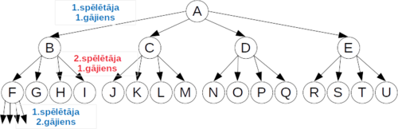
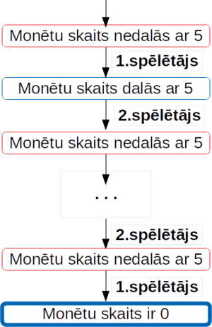
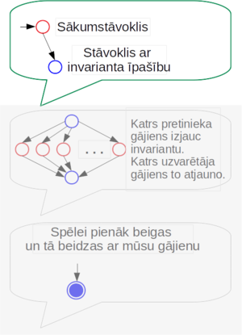
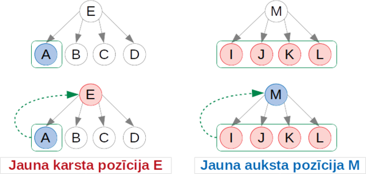
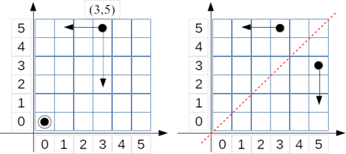
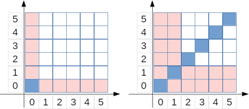

# &nbsp;

<hgroup>

<h1 style="font-size:32pt">Simetrija spēlēs</h1>

</hgroup><hgroup>

**(1) Ievads**  
(2) [Pamatfakti](#section-1)  
(3) [Aptauja](#section-2)  
(4) [Tipisks piemērs](#section-3)  
(5) [Patstāvīgie uzdevumi](#section-4)  
(6) [Kopsavilkums](#section-5)

</hgroup>

# <lo-theory/> Kurā nodaļā esam?

TBD. Spēles izmanto vairākas teorijas tēmas:

* Gadījumu skaitīšana; reizināšanas likums. (Novērtēt, cik gājieni ir iespējami, cik ilgi spēle var turpināties.) 
* Bijektīvi kopu attēlojumi un simetrijas. (Izveidot simetriskus attēlojumus starp spēles elementiem un pozīcijām.)
* Grafi un koki. (Analizēt spēles ar minimaksa jeb karsto/auksto stāvokļu aplūkošanu.)
* Invarianti. (Definēt "aukstos" spēles stāvokļus ar invariantu, ko spēlētājs atjauno pēc katra sava gājiena.)
* Skaitļa binārais pieraksts, Fibonači skaitļi u.c. (Izmantojami dažu sarežģītāku invariantu veidošanai, piemēram spēlei NIM.)

# <lo-why/> why

Kāpēc spēles gājienu un stāvokļu regularitāšu pamanīšana palīdz izveidot uzvarošu stratēģiju?

* Kāpēc daudzas spēles ar "pilnu informāciju" ir kombinatoriskas?
* Kāpēc katru kombinatorisku spēli (vismaz teorētiski) var pilnībā izanalizēt?
* Kāpēc analīzei un praktiskai uzvarošai stratēģijai ir jānosaka iespējamo gājienu un spēles 
stāvokļu simetrija? 

## <lo-why/> Spēļu analīzes lietojumi

* Kombinatorisku spēļu uzdevumu atrisinājums bieži ir *algoritms* - pamatota uzvarētāja stratēģija.
* Spēlēs viegli definēt noteikumus, bet uzvarošās stratēģijas un tajās izmantotie invarianti mēdz būt
negaidīti.
* Spēles liek risinātājam katrā gājienā mainīt perspektīvu - pārsēsties viena vai otra
spēlētāja lomā, lai pamatotu, ka eksistē ($\exists$) atbildes gājiens uz katru ($\forall$) pretinieka gājienu. 
Tajās var aprakstīt sarežģītus loģikas spriedumus. 

 
# <lo-theory/> Sasniedzamie rezultāti (1-2)

<hgroup style="font-size:70%">

1. Aprakstīt kombinatorisku spēļu pozīciju skaitu; novērtēt iespējamo gājienu skaitu.
2. Izmantot *minimax* analīzi jeb "karstos" un "aukstos" stāvokļus. 

3. Izmantot simetriju aritmētiskās spēlēs.
4. Izmantot simetriju kombinatoriskās un ģeometriskās spēlēs.

5. Pazīt gadījumus, kuros simetriskie gājieni nav viennozīmīgi vai nav atļauti.
6. Analizēt dažas skaitļu (vai kaudzīšu) samazināšanas spēles.

</hgroup>

<hgroup style="font-size:70%">

Kaut kādas bildes...

</hgroup>

# &nbsp;

<hgroup>

<h1 style="font-size:32pt">Simetrija spēlēs</h1>

</hgroup><hgroup>

(1) [Ievads](#section)  
**(2) Pamatfakti**  
(3) [Aptauja](#section-2)  
(4) [Tipisks piemērs](#section-3)  
(5) [Patstāvīgie uzdevumi](#section-4)  
(6) [Kopsavilkums](#section-5)

</hgroup>

# <lo-theory/> Kāpēc kombinatoriskas spēles?

<hgroup>

</hgroup>
<hgroup>

* Galīgs skaits pozīciju
* Katrā pozīcijā galīgs skaits iespējamo gājienu
* Dotajā sākumpozīcijā gājienu skaits ir ierobežots

</hgroup>

## <lo-summary/> Šahs kā kombinatoriska spēle

<hgroup>

</hgroup>

<hgroup>

* Vai šahā ir galīgs skaits pozīciju? (Mazāks par $(1+64)^{32}$)
* Vai šaha spēlētāja gājienu skaits konkrētajā pozīcijā ir ierobežots? (Ne lielāks par $8 + 27 + 
2\cdot{}13 + 2\cdot{}8+$ $+ 2\cdot{}14 + 8\cdot{}4=137$)
* Vai katra šaha partija reiz beidzas? ([Fifty-move rule](https://en.wikipedia.org/wiki/Fifty-move_rule) - Ja 50 šaha gājienos nenosit nevienu figūru un nepabīda nevienu bandinieku, ieskaita neizšķirtu.)

</hgroup>

# <lo-theory/> Citi ierobežojumi

<hgroup>

</hgroup>

<hgroup>

* Divi spēlētāji
* Gājienus izdara pārmaiņus, tos nedrīkst izlaist
* Zaudē tas, kurš nevar izdarīt kārtējo gājienu
* Pilna informācija
* Spēlei ir "nulles summa" - lai viens uzvarētu, otram jāzaudē
* Nav neizšķirtu

</hgroup>

# <lo-theory/>  Kā spēles analizēt?

* Uzdevuma mērķis: 
    - **Noskaidrot, kurš uzvar, pareizi spēlējot:** Pirmais vai otrais spēlētājs.
(*Kombinatoriskā spēlē, ja zināma sākumpozīcija, tajā 
viens no 2 spēlētājiem var nodrošināt sev uzvaru.*)
    - **Atrast uzvarošo stratēģiju:** Algoritmiski pierakstītu veidu, kā spēlēt, lai noteikti uzvarētu.

Uzvarētājam
jāvar atbildēt **visiem** pretinieka gājieniem.  
Risinājumā nedrīkst pieņemt, ka zaudētājs rīkosies noteiktā veidā.

# <lo-theory/>  Milzīgs variantu skaits

**Būtiska grūtība:** Kombinatoriskās spēlēs mēdz būt ārkārtīgi daudz spēles scenāriju. 
Parasti nevar atsevišķi pierakstīt, ko darīt katrā pozīcijā, atbildot uz katru pretinieka gājienu.

**Kā meklēt atrisinājumu?**  
Var aplūkot *invariantus* - spēles pozīciju īpašības, kas gājienu veikšanas laikā nemainās.

# <lo-sample/> Piemērs: Noņemšanas spēle

<hgroup>

(*Attēls no Paul Zeitz,
"The Art and Craft of Mathematical Problem Solving". 2010.*)

</hgroup>

<hgroup>

Sākumā uz galda ir $n=17$ monētas. Divi spēlētāji pārmaiņus izdara gājienus. 
Ar vienu gājienu atļauts paņemt $1$, $2$, $3$ vai $4$ monētas. Uzvar tas spēlētājs, 
kurš paņem pēdējo monētu. Kurš uzvar, pareizi spēlējot?

Kas notiek citām $n$ vērtībām?

</hgroup>

## <lo-soln/> Spēles analīze no beigām

1. Beigu pozīciju ($0$) krāso <blue>zilu</blue>.
2. Pozīcijas, kas ved uz $0$, krāso <red>sarkanas</red>.
3. Pozīcijas, kas ved **tikai** uz sarkanajām, krāso <blue>zilas</blue>. 
4. Pozīcijas, kas ved arī uz kādu zilo, krāso <red>sarkanas</red>.
5. Utt. 

## <lo-soln/> Invariants: Monētu skaita dalāmība ar 5

<hgroup>

 

</hgroup>

<hgroup>

**Apgalvojums:** Pareizi spēlējot, pie $n=17$ uzvar 1.spēlētājs. 

**Stratēģija:** Sākumā 1.spēlētājs no $17$ monētām noņem 2 monētas.   
Turpmāk 2.spēlētājs ikreiz dalāmību ar $5$ izjauc, bet 1.spēlētājs to atjauno.  

* <blue>Dalāmība ar $5$</blue> **pēc 1.spēlētāja gājiena** ir 
<blue>*invariants*</blue> - saglabājas visā spēles gaitā.
* Monētu skaits uz galda visu laiku samazinās. 
Tas reiz kļūs $0$ (turklāt tas notiks **pēc 1.spēlētāja gājiena**).

</hgroup>

## <lo-soln/> Vai 1.spēlētājs var kontrolēt šo invariantu?

*Uzvarētāja stratēģijai jāspēj atbildēt uz jebkuru pretinieka gājienu.*

1. Sākumā monētu skaits $n=17$ nedalās ar $5$. Ar pirmo gājienu 
var panākt, lai $n_1 = 17-2=15$ dalītos ar $5$.
2. Pēc $i$ gājieniem pretinieks no jebkuras $n_i$ vērtības var atņemt
$1$, $2$, $3$ vai $4$. Uzvarētājs tad atņem "pretējo skaitli". 

# <lo-theory/> Kas jāraksta atrisinājumā - 1

<hgroup>

</hgroup><hgroup style="font-size:70%">

**Ja uzvar 1.spēlētājs:**  
Jāuzraksta, kā ar pirmo gājienu nonākt stāvoklī, kas atbilst invariantam.  
<blue>**Piemērs:** Uzvarētājs sākumā panāk, ka monētu skaits uz galda dalās ar $5$.</blue>

(*Invariants jāizdomā patstāvīgi. Dažreiz palīdz spēles analīze "no beigām".*)

</hgroup>

## <lo-theory/> Kas jāraksta atrisinājumā - 2

<hgroup>

</hgroup>
<hgroup style="font-size:70%">

Turpmāk pretinieks katrā gājienā būs spiests invariantu izjaukt.  
<blue>**Piemērs:** Monētu skaits uz galda pēc zaudētāja gājiena nedalīsies ar $5$.
Savukārt uzvarētājs *pēc katra sava gājiena* atjauno
dalāmību ar $5$.</blue>

Jāuzraksta, kādēļ to var panākt atbildot uz katru pretinieka gājienu.  
<blue>**Piemērs:** Ja pretinieks atņēma $k$ monētas ($k=1,2,3,4$), tad
uzvarētājs atņem $5-k$ monētas.</blue>

</hgroup>

## <lo-theory/> Kas jāraksta atrisinājumā - 3

<hgroup>

</hgroup>
<hgroup style="font-size:70%">

**Jāpamato**, ka spēle reiz beidzas.
Citiem vārdiem, spēles pozīcijas nevar turpināties neierobežoti ilgi vai "iecikloties".
Jāpamato arī, ka spēles beigu stāvoklis arī pieder invariantam, ka to 
sasniegs uzvarētājs (tas, kurš kontrolē invariantu).  
<blue>**Piemērs:** Monētu skaits visu laiku samazinās, kādreiz tas kļūs $0$. 
Tas notiks pēc 1.spēlētāja gājiena, jo arī $0$ dalās ar $5$.</blue>

</hgroup>

## <lo-theory/> Ja uzvar otrais...

<hgroup>

</hgroup>
<hgroup style="font-size:70%">

**Ja uzvar 2.spēlētājs,**  
tad līdzīga atrisinājuma struktūra kā iepriekš. Nav pirmā soļa, nav jāraksta, kā 
nonākt invarianta stāvoklī. Spēles sākumstāvoklis **jau** apmierina invarianta īpašību, 2.spēlētājs to 
var saglabāt arī turpmāk, atbildot uz katru 1.spēlētāja gājienu.  
<blue>**Piemērs:** Ja sākumā ir $n=15$ monētas, tad, pareizi spēlējot, uzvar
2.spēlētājs - atbildot uz katru 1.spēlētāja gājienu, viņš allaž var 
atjaunot dalāmību ar $5$.</blue>

</hgroup>

# <lo-theory/> Kāpēc visas pozīcijas dala 2 grupās?

Uzvaroša stratēģija nozīmē spēju kontrolēt invariantu - 
pēc katra gājiena nokļūstot "aukstā pozīcijā".

(*Spēļu analīzē par [Hot game](https://en.wikipedia.org/wiki/Hot_game) sauc pozīcijas, 
kur ar kārtējo gājienu var uzlabot savas izredzes. 
“Cold game” ir otrādi - spēlētājs ar savu gājienu izredzes pasliktina.*)

## <lo-sample/> Dalītāju noņemšanas spēle

Sākumā uz galda ir $100$ monētas. Divi spēlētāji $A$ un $B$ pārmaiņus 
izdara gājienus. Ja uz galda ir $N$ monētas, tad ar kārtējo gājienu 
var paņemt tādu monētu skaitu, kas ir kāds no skaitļa $N$ dalītājiem, 
izņemot pašu $N$. (Piemēram, pirmajā gājienā $A$ var paņemt $1,2,4,5,10,20,25$ vai $50$ 
monētas, bet ne $100$ monētas.)  
Spēlē uzvar tas, kurš izdara pēdējo atļauto gājienu, 
un uz galda atstāj 1 monētu (tai vairs nav dalītāju, 
kas atšķirtos no paša skaitļa).  
Kurš uzvar, pareizi spēlējot?

## <lo-soln/> Kuras pozīcijas būs aukstas?

<hgroup>

</hgroup><hgroup style="font-size:70%">

* "1" ir auksta pozīcija
* "2" (tikai pāreja $2 \rightarrow 1$) ir karsta.
* "3" (tikai pāreja $3 \rightarrow 2$) ir auksta. utt.

**A:** "6" (pārejas uz "3", "4" vai "5") ir karsta, jo **eksistē** pāreja uz aukstu.  
**B:** "7" (pārejas tikai uz karstu "6") ir auksta, jo **katra**/**vienīgā** pāreja uz karstu.  
**C:** "9" (pārejas uz "6" un "8") ir auksta, jo **katra** pāreja uz karstu.

</hgroup>

# <lo-sample/> LV.AO.2002.7.4

Divi spēlētāji pamīšus raksta uz tāfeles pa vienam naturālam skaitlim no 
$1$ līdz $8$ ieskaitot. Nedrīkst rakstīt skaitļus, ar kuriem 
dalās kaut viens jau uzrakstīts skaitlis. Kas nevar izdarīt gājienu, zaudē. 
Parādiet, kā tas, kas izdara pirmo gājienu, var uzvarēt.

## <lo-soln/> Divu veidu pamatojumi

<hgroup style="font-size:70%">

**Nekonstruktīva stratēģija**

Vienmēr uzvar 1.spēlētājs.  
Aplūkojam 2 iespējas:

1. Uzrakstot skaitli “1”, nonākam “aukstā” pozīcijā.  
Tad 1.spēlētājs sāk ar "1" (un turpmāk 
ikreiz atgriežas aukstā pozīcijā).
2. Uzrakstot skaitli “1”, nonākam “karstā” pozīcijā, 
uz ko 2.spēlētājs atbild ar skaitli $N>1$.  
Šajā gadījumā 1.spēlētājs pats sāk ar skaitli $N$ un uzvar.

</hgroup> 

<hgroup style="font-size:70%">

**Konstruktīva stratēģija**  

* Sāk ar skaitli $2$ (kas izslēdz $1$).
* Atlikušos skaitļus sadala pāros: $(3,4)$, $(5,7)$, $(6,8)$.

</hgroup>

# <lo-sample/> 1.piemērs no NMS lapas

Vienā horizontālā rindā savilktas **(a)** $9$; **(b)** $10$ svītriņas.  
Divi spēlētāji pamīšus izdara gājienus. Vienā gājienā var par krustiņu pārvērst 
vai nu vienu svītriņu, vai arī divas blakus esošas svītriņas.
Zaudē tas spēlētājs, kurš nevar izdarīt gājienu, tas ir, nevar atbilstoši noteikumiem, 
svītriņu pārvērst par krustiņu. Kurš spēlētājs – pirmais vai otrais – vienmēr var uzvarēt?

## <lo-hints/> 1.piemērs no NMS lapas

1. Kurš uzvar līdzīgā (vienkāršākā) spēlē, kur arī $2$ svītriņas 
var pārkrustot *jebkādi* - ja tās nav noteikti jāizvēlas blakus?
2. Kas notiek, ja svītriņu skaits ir mazāks nekā $9$ vai $10$?
3. Vai var iet tā, lai <blue>*vienmēr* varētu atbildēt</blue> pretinieka gājienam?

## <lo-soln/> Pirmais gājiens vidū

* Uzvar 1.spēlētājs. <blue>**Invariants:**</blue> Pēc katra 1.spēlētāja gājiena konfigurācija simetriska pret vertikālo taisni.
* 1.gājiens sadala sērkociņu konfigurāciju divās simetriskās daļās.
* Katram pretinieka gājienam var atbildēt simetriski pret asi.
* Tā kā 1.spēlētājs vienmēr var atbildēt uz pretinieka gājienu, 
izsvītrojamo sērkociņu pietrūks 2.spēlētājam.

# &nbsp;

<hgroup>

<h1 style="font-size:32pt">Simetrija spēlēs</h1>

</hgroup><hgroup>

(1) [Ievads](#section)  
(2) [Pamatfakti](#section-1)  
(3) [Aptauja](#section-2)  
(4) [Tipisks piemērs](#section-3)  
**(5) Patstāvīgie uzdevumi**  
(6) [Kopsavilkums](#section-5)

</hgroup>

# <lo-sample/> 2.piemērs no NMS lapas

Uz galda ir divas konfekšu kaudzes. Divi spēlētāji pamīšus ņem konfektes. Vienā gājienā viens spēlētājs
drīkst paņemt jebkuru konfekšu skaitu no vienas kaudzes un apēst. Zaudē tas spēlētājs, kuram vairs nav
ko paņemt. Kurš spēlētājs – pirmais vai otrais – vienmēr var uzvarēt, ja sākumā  
**(a)** abās konfekšu kaudzēs ir pa $10$ konfektēm;  
**(b)** vienā kaudzē ir $12$ konfektes, bet otrā – $10$ konfektes?

## <lo-hints/> 2.piemērs no NMS lapas

1. Cik dažādi spēles stāvokļi ir sasniedzami, 
ja sākumstāvoklis $(10,10)$? Vai $(12,10)$? 
2. Kā vizualizēt visus šos stāvokļus un atļautos gājienus?

## <lo-soln/> Konfektes Dekarta koordinātu sistēmā

* Spēli var interpretēt ģeometriski, var būt vieglāk pamanīt simetriju. 
Faktiski simetrija ir starp konfekšu kaudzēm jeb 2 skaitlīšiem.
* Konfekšu ēšana no 1.kaudzes (virzība pa kreisi) ir simetriska
ēšanai no 2.kaudzes (virzība uz leju).

## <lo-soln/> "No beigām" - no kreisā apakšējā stūra

Analizējam šo spēli "no beigām":

* <blue>$(0,0)$</blue> ir auksta, bet $\color{#F00}{(0,n)}$, <red>$(n,0)$</red> (kur $n>0$) - karstas.
* Pirmā neiekrāsotā rūtiņa, kas ved tikai uz karstajām ir $\color{#F00}{(1,1)}$.
* Tātad visas $\color{#F00}{(1,n)}$ un <red>$\color{#F00}{(n,1)}$</red> (pie $n>1$) ir karstas.
* Pirmā neiekrāsotā, kas ved tikai uz karstajām ir <blue>$\color{#06C}{(2,2)}$</blue>, utt.

# &nbsp;

<hgroup>

<h1 style="font-size:32pt">Simetrija spēlēs</h1>

</hgroup><hgroup>

(1) [Ievads](#section)  
(2) [Pamatfakti](#section-1)  
(3) [Aptauja](#section-2)  
(4) [Tipisks piemērs](#section-3)  
(5) [Patstāvīgie uzdevumi](#section-4)  
**(6) Kopsavilkums**

</hgroup>

# <lo-summary/> Kopsavilkums

* **Universāla stratēģija:**  
Uzvarētājam pēc katra gājiena jāatgriežas aukstā pozīcijā.  
Var tomēr būt grūti noskaidrot, kura ir "auksta pozīcija". Arī - kurš, pareizi spēlējot, uzvar.
* Reizēm var pamatot, **kuram** no spēlētājiem būs uzvaroša stratēģija
(uzdevumā par dalītāju rakstīšanu), bet tā ir arī jākonstruē. 
* "Aukstās" pozīcijas reizēm izceļas ar lielāku regularitāti 
    - Monētu skaits dalās ar $5$
    - Abās kaudzītēs vienāds skaits konfekšu
    - Spēles pozīcija ir simetriska (piemēram, pret simetrijas asi). 
* Zaudētājs katrā gājienā simetriju izjauc, uzvarētājs - atjauno.

