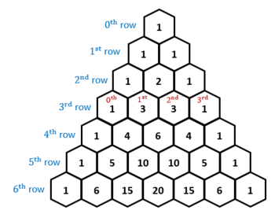
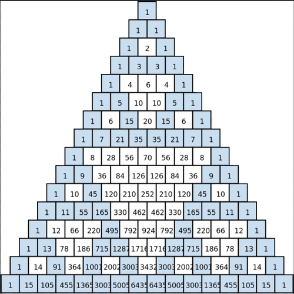
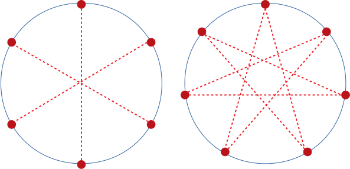
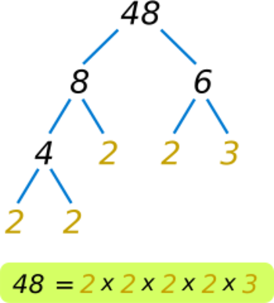

# &nbsp;

<hgroup>

<h1 style="font-size:32pt">Skaitļu teorija: 
10.kl. Teorija un algoritmi</h1>

</hgroup><hgroup>

* Algebras elementi
* Skaitļu dalāmība
* Modulārā aritmētika
* Decimālpieraksts
* Virknes

</hgroup>

---

# Ņūtona binomi

* $(a+b)^0 = 1$,
* $(a+b)^1 = a+b$,
* $(a+b)^2 = a^2 + 2ab + b^2$,
* $(a+b)^3 = a^3 + 3a^2b + 3ab^2 + b^3$,
* $(a+b)^4 = a^4 + 4a^3b + 6a^2b^2 + 4ab^3 + b^4$,
* $(a+b)^5 = a^5 + 5a^4b + 10a^3b^2 + 10a^2b^3 + 5ab^4 + b^5$.

Tāpat starpībām:

* $(a-b)^0 = 1$,
* $(a-b)^1 = a-b$,
* $(a-b)^2 = a^2 - 2ab + b^2$,
* $(a-b)^3 = a^3 - 3a^2b + 3ab^2 - b^3$,
* $(a-b)^4 = a^4 - 4a^3b + 6a^2b^2 - 4ab^3 + b^4$,
* $(a-b)^5 = a^5 - 5a^4b + 10a^3b^2 - 10a^2b^3 + 5ab^4 - b^5$.

---

# Ņūtona binoma koeficienti ir kombinācijas

<hgroup>

</hgroup>

<hgroup>

$(a+b)^4 = $
$=C_4^0a^4 + C_4^1a^3b + C_4^2a^2b^2 +$
$+C_4^3ab^3 + C_4^4b^4=$
$=a^4 + 4a^3b + 6a^2b^2 +$
$+4ab^3 + b^4$

</hgroup>

---

# Dalāmība Paskāla trijstūrī - 1

----

# Dalāmība Paskāla trijstūrī - 2

* $C_6^2 = \frac{6!}{2!4!} = \frac{5\cdot{}6}{1\cdot{}2} = 15$ (nedalās ar $6$)
* $C_7^2 = \frac{7!}{2!5!} = \frac{6\cdot{}7}{1\cdot{}2} = 21$ (dalās ar $7$)

----

# <lo-sample/> Piemērs: Dalāmība ar pakāpi

**Piemērs:** <blue>Ar kādu augstāko skaitļa $5$ pakāpi dalās $11^{10} - 1$?  
Ar $5$? Ar $25=5^2$? Ar $125 = 5^3$?</blue>

$$11^{10} - 1 = \left( 11^5 - 1 \right) \left( 11^5 + 1 \right),$$
kur $(11^5 + 1)$ ar $5$ nedalās vispār. Pārveidojam $11^5 - 1$:

$$(1 + 2\cdot{}5)^{5} - 1^{5} = $$
$$=1 + C_{5}^1(2\cdot{}5) + C_{5}^2(2\cdot{}5)^2 + \ldots + C_{5}^{5}(2\cdot{}5)^{5} - 1=$$
$$=5\cdot(2\cdot{}5) + 5^3(\ldots).$$

Starp citu, $N=11^{10} = 25937424601$ ($N-1$ dalās ar $25$).

----

# Citas algebriskas identitātes

* $a^2 - b^2 = (a-b)(a+b)$.
* $a^3 - b^3 = (a-b)(a^2 + ab + b^2)$.
* $a^n - b^n = (a-b)(a^{n-1} + a^{n-2}b + \ldots + ab^{n-2} + b^{n-1})$. 
* $q^{n} - 1 = (q-1)(q^{n-1} + q^{n-2} + \ldots + q + 1)$.

Ģeometriskas progresijas summa:

$$b_1 + b_2+\ldots+b_n = b_1 + b_1q + b_1q^2 + \ldots + b_1q^{n-1} =$$
$$=b_1(1+q+\ldots+q^{n-2}+q^{n-1}) = b_1\frac{q^{n}-1}{q-1}.$$

----

# <lo-sample/> Piemērs: Dalāmība ar pakāpi

**Piemērs:** <blue>Ar kādu augstāko skaitļa $3$ pakāpi dalās $10^{81} - 1$?  
(Citiem vārdiem - skaitlis, kura decimālpieraksts ir $81$ deviņnieki.)</blue>

$$(10^{81}-1) = (10^{27}-1)(10^{54}+10^{27}+1) =$$
$$=(10^9-1)(10^{18}+10^9+1)(10^{54}+10^{27}+1) =$$
$$=(10^3-1)(10^6+10^3+1)\times{}$$
$$\times{}(10^{18}+10^9+1)(10^{54}+10^{27}+1) =$$
$$=(10-1)(10^2+10^1+1)(10^6+10^3+1)\times{}$$
$$\times{}(10^{18}+10^9+1)(10^{54}+10^{27}+1).$$

Pirmā iekava ir $9$, katra nākamā dalās ar $3$ bet ne ar $9$ (jo ciparu summa ir $9$). 

----

# Polinomu dalīšana

Viena mainīgā polinomus var dalīt vienu ar otru, iegūstot dalījumu un atlikumu. 

**Piemērs:** Kādām veselām $n$ vērtībām $\frac{n^3+3}{n+3}$ ir vesels skaitlis? 

$$\frac{n^3+3}{n+3} = \frac{n^2(n+3) - 3n^2 + 3}{n+3}=$$
$$=n^2+\frac{-3n^2+3}{n+3}=n^2+\frac{-3n(n+3)+9n+3}{n+3}=$$
$$=n^2-3n+\frac{9n+3}{n+3}=n^2-3n+\frac{9(n+3)-27+3}{n+3}=$$
$$=n^2-3n+9+\frac{-24}{n+3}.$$

---

# <lo-sample/> Polinomi ar veseliem koeficientiem

**Piemērs (LV.VO.2011.10.4):** Dots polinoms $f(x)$ ar veseliem koeficientiem. Vai iespējams, ka
$f(2011) = 100$, bet $f(11) = 1000$?

Ja $f(x)$ būtu 1.pakāpes polinoms $f(x) = ax+b$, tad 
$$f(2011)-f(11)=(a\cdot{}2011 + b) + (a\cdot{}11 + b)=2000a.$$

Vai $2000a$ var būt vienāds ar $100-1000=-900$?  
Polinoma vērtību starpība $-900$ nedalās ar argumentu starpību $2000$. 

----

# Augstākas pakāpes polinomi

**Apgalvojums:** Ja $P(x)$ ir polinoms ar veseliem koeficientiem, 
$a \neq b$ ir veseli skaitļi, tad $P(a)-P(b)$ dalās ar $a-b$. 

**Pierādījums:** Ja $P(x) = c_nx^n + c_{n-1}x^{n-1} + c_1x + c_0$, tad
$$P(a)-P(b) = c_n(a^n - b^n) + c_{n+1}(a^{n-1} - b^{n-1}) + \ldots$$
$$\ldots + c_2(a^2-b^2) + c_1(a-b).$$

Viegli redzēt, ka ikviena iekava $(a^n-b^n)$ utt. dalās ar $(a-b)$:

$$\frac{a^n-b^n}{a-b}=a^{n-1}+a^{n-2}b^1+\ldots+a^1b^{n-2}+b^{n-1}.$$

-----

# Pārveidojums "no otra gala"

$$\frac{1}{n}-\frac{1}{n+1}=\frac{n+1}{n(n+1)} - \frac{n}{n(n+1)} = \frac{1}{n(n+1)}.$$

Pamatosim, ka $\frac{1}{1^2} + \frac{1}{2^2} + \frac{1}{3^2} + \ldots < 2.$

$$\frac{1}{1^2} + \frac{1}{2^2} + \frac{1}{3^2} + \frac{1}{4^2} + \ldots <$$
$$<1 + \frac{1}{1\cdot{}2} + \frac{1}{2\cdot{}3} + \frac{1}{3\cdot{}4} + \ldots =$$
$$=1 + \left( \frac{1}{1} - \frac{1}{2} \right) + \left( \frac{1}{2} - \frac{1}{3} \right) 
+ \left( \frac{1}{3} - \frac{1}{4} \right)+ \ldots = 2.$$

----

# Pirmreizinātāji un skaitļu dalāmība

<hgroup>

</hgroup>

<hgroup>

&nbsp;

&nbsp;

* Naturālu skaitli var vienā vienīgā veidā sadalīt pirmreizinātājos
(izteikt kā pirmskaitļu reizinājumu)
* Reizinātāju secību neņem vērā (un $1$ nav pirmskaitlis!)
* Izteiksme pirmreizinātājos ļauj 
    - ātri atrast visus dalītājus
    - divu skaitļu lielāko kopīgo dalītāju
    - pateikt, vai ir pilns kvadrāts (kubs, utt.)

</hgroup>

----

# 48 dalītāju skaits un summa

* $48 = 2^4\cdot3^1$
* $d(48) = (4+1)(1+1)=10$  
Skaitlim $48$ ir tieši $10$ pozitīvi dalītāji
* $\sigma(48) = (16+8+4+2+1)(3+1)=31\cdot{}4=124$  
Skaitļa $48$ visu dalītāju 
summa ir $124$
* Visi kāpinātāji nedalās ar $2$ - tātad $48$ nav pilns kvadrāts.

