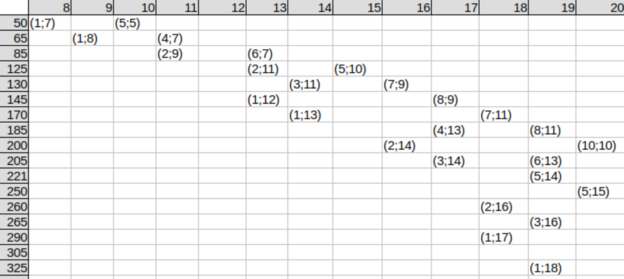

# &nbsp;

<hgroup>

<h1 style="font-size:32pt">Skaitļu teorija:<br/>
NMS Junioru ievadlekcija 2019-09-14</h1>

</hgroup><hgroup>

<span style="color:darkgreen">**(1) Ievads**</span>  
<span>(2) [Naturālo skaitļu kopa](#section-1)</span>  
<span>(3) [Spēles ar naturāliem skaitļiem](#section-2)</span>  
<span>(4) [Saistība ar citām nozarēm](#section-3)</span>  

</hgroup>


<!--
TODO: Sadalīt šo prezentāciju divās daļās. 
Vienā daļā stāsta par indukciju/dedukciju un 
uzdevumu par 3 matemātiķiem (VO.1985.9.5). 
Otrā daļā stāsta par skaitļu teorijas saistību 
ar citām matemātikas nozarēm un Mazo Fermā teorēmu.
--> 


# <lo-why/> why

<div class="bigWhy">
Kāpēc atsevišķi jāpēta naturālu/veselu skaitļu aritmētika?
</div>

<div class="smallWhy">

* Kāpēc tas pats vienādojums atšķiras kopā $\mathbb{Z}$ un $\mathbb{R}$? 
* Kāpēc naturālu skaitļu kopa ir "dabiska"?
* Kāpēc dziļāku skaitļu teorijas rezultātu lietojums parādījies tikai nesen?

</div>


## <lo-theory/> Sasniedzamie rezultāti

* Atpazīt $\mathbb{N}$ (reizēm $\mathbb{Z}$, $\mathbb{Q}$) aritmētikas īpatnības.
* Noskaidrot skaitļu teorijas izziņas īpatnības.
* Aplūkot naturālu skaitļu spēles piemēru.
* Minēt piemērus skaitļu teorijas saistībai ar citām nozarēm.


# &nbsp;

<hgroup>

<h1 style="font-size:32pt">Skaitļu teorija:<br/>
NMS Junioru ievadlekcija 2019-09-14</h1>

</hgroup><hgroup>

<span>(1) [Ievads](#section)</span>  
<span style="color:darkgreen">**(2) Naturālo skaitļu kopa**</span>  
<span>(3) [Spēles ar naturāliem skaitļiem](#section-2)</span>  
<span>(4) [Saistība ar citām nozarēm](#section-3)</span>  

</hgroup>


## <lo-theory/> Kopu "slēgtība" attiecībā pret operācijām

<table>
<tr><th>Naturālie skaitļi: $\mathbb{N}$</th><td>saskaitīšana: $2 + 3 \in \mathbb{N}$, reizināšana</td></tr>
<tr><th>Veselie skaitļi: $\mathbb{Z}$</th><td>slēgta arī pret atņemšanu</td></tr>
<tr><th>Racionālie skaitļi: $\mathbb{Q}$</th><td>slēgta pret dalīšanu</td></tr>
</table>

Reālie skaitļi ļauj vēl vairāk darbību; kompleksie - vēl vairāk.  
Kāda ir naturālo skaitļu nozīme?


## <lo-theory/> Datora atmiņā glabājas veseli skaitļi

<div style="70%">


```python
>>> 1 + 1 + 1 == 3
True
>>> 0.1 + 0.1 + 0.1 == 0.3
False
>>> 1.1 - 1
0.10000000000000009
```

Ja datorprogrammā
raksta `x = 0.1`, atmiņā rodas cits skaitlis, 
kura decimālpieraksts: 

```
>>> 0.1
0.1000000000000000055511151231257827021181583404541015625
```

$$\text{jeb}\;\frac{3602879701896397}{2^{55}}$$

</div>

## <lo-theory/> Kur skaitļu teoriju lieto industrijā? 

* Sakne "kripto-" - "crypto-analysis", "crypto-currency", "crypto-malware", "crypto-payments" (arī blokķēdes). 
* Daži kriptogrāfijas algoritmi vai protokoli (piemēram Transport Layer Security) 
izmanto eliptiskas līknes ($x^n + y^n = A$). 
* whiteCryption - Latvijā esošs programmēšanas uzņēmums (fiziski atrodas Sarkandaugavā), 
kurš ir daļa no Intertrust.
* RTU ir noķēruši studentus, kuri izmantojuši augstskolas serveru, elektrības, datortīklu
resursu, lai "raktu" bitkoinus. 

## <lo-theory/> Cik daudz skaitļu teorijas ir olimpiādēs

* Aptuveni 1/4 daļa no tipiskas olimpiādes komplekta. 
* [3 Baltijas valstis; 2000.-2019.g.](http://linen-tracer-682.appspot.com/problembase/problems.html) - 
pavisam atrasti ap 1100 uzdevumi skaitļu teorijā. 
* [Skaitļu teorijas prasmes](http://linen-tracer-682.appspot.com/problembase/tasks.html)
* [Nodarbību tēmas](http://linen-tracer-682.appspot.com/numtheory/index.html)


# &nbsp;

<hgroup>

<h1 style="font-size:32pt">Skaitļu teorija:<br/>
NMS Junioru ievadlekcija 2019-09-14</h1>

</hgroup><hgroup>

<span>(1) [Ievads](#section)</span>  
<span>(2) [Naturālo skaitļu kopa](#section-1)</span>  
<span style="color:darkgreen">**(3) Spēles ar naturāliem skaitļiem**</span>  
<span>(4) [Saistība ar citām nozarēm](#section-3)</span>  

</hgroup>


# <lo-sample/> VO.1985.9.5

<div style="font-size:70%;">

Ap galdu sēž matemātiķi Z, A un B. Matemātiķis Z saka: “Es esmu iedomājies
divus naturālus skaitļus (varbūt vienādus). To summa ir” (iečukst ausī matemātiķim
A), “bet to kvadrātu summa ir” (iečukst ausī matemātiķim B). Pēc tam starp B un A
notiek šāda saruna.  
B: “Es nezinu un nevaru zināt iedomātos skaitļus.”  
A: “Es nezinu un nevaru zināt iedomātos skaitļus.”  
B: “Es nezinu un nevaru zināt iedomātos skaitļus.”  
A: “Es nezinu un nevaru zināt iedomātos skaitļus.”  
B: “Es nezinu un nevaru zināt iedomātos skaitļus.”  
A: “Es nezinu un nevaru zināt iedomātos skaitļus.”  
B: “Tagad es zinu iedomātos skaitļus.”   
Kādus skaitļus Z iedomājies? (Visi sarunā izdarītie apgalvojumi ir patiesi.) 

</div>


## <lo-summary/> Empīriskā izziņa

<hgroup>

* Kuru izziņas metodi lietoja Šerloks Holmss? 
* Kas ir indukcija? Dedukcija?
* Ne visa indukcija ir matemātiskā indukcija. 
* Eksperimentālā/empīriskā matemātika 
(jeb nepilnā indukcija) - savācam faktus,
mēģinām tos vispārināt.

</hgroup>
<hgroup>


</hgroup>


## <lo-summary/> Kvadrātu summas līdz 14^2 + 14^2

<div style="font-size:80%">

<table>
<col style="width:6.2%"/>
<col style="width:6.7%"/>
<col style="width:6.7%"/>
<col style="width:6.7%"/>
<col style="width:6.7%"/>
<col style="width:6.7%"/>
<col style="width:6.7%"/>
<col style="width:6.7%"/>
<col style="width:6.7%"/>
<col style="width:6.7%"/>
<col style="width:6.7%"/>
<col style="width:6.7%"/>

<tr><th>&nbsp;</th><th>1</th><th>2</th><th>3</th><th>4</th><th>5</th><th>6</th><th>7</th><th>8</th><th>9</th><th>10</th><th>11</th><th>12</th><th>13</th><th>14</th></tr>
<tr><th>1</th><td>2</td><td>5</td><td>10</td><td>17</td><td>26</td><td>37</td><td><red>50</red></td><td><red>65</red></td><td>82</td><td>101</td><td>122</td><td><red>145</red></td><td><red>170</red></td><td>197</td></tr>
<tr><th>2</th><td>&nbsp;</td><td>8</td><td>13</td><td>20</td><td>29</td><td>40</td><td>53</td><td>68</td><td><red>85</red></td><td>104</td><td><red>125</red></td><td>148</td><td>173</td><td><red>200</red></td></tr>
<tr><th>3</th><td>&nbsp;</td><td>&nbsp;</td><td>18</td><td>25</td><td>34</td><td>45</td><td>58</td><td>73</td><td>90</td><td>109</td><td><red>130</red></td><td>153</td><td>178</td><td><red>205</red></td></tr>
<tr><th>4</th><td>&nbsp;</td><td>&nbsp;</td><td>&nbsp;</td><td>32</td><td>41</td><td>52</td><td><red>65</red></td><td>80</td><td>97</td><td>116</td><td>137</td><td>160</td><td><red>185</red></td><td>212</td></tr>
<tr><th>5</th><td>&nbsp;</td><td>&nbsp;</td><td>&nbsp;</td><td>&nbsp;</td><td><red>50</red></td><td>61</td><td>74</td><td>89</td><td>106</td><td><red>125</red></td><td>146</td><td>169</td><td>194</td><td><red>221</red></td></tr>
<tr><th>6</th><td>&nbsp;</td><td>&nbsp;</td><td>&nbsp;</td><td>&nbsp;</td><td>&nbsp;</td><td>72</td><td><red>85</red></td><td>100</td><td>117</td><td>136</td><td>157</td><td>180</td><td><red>205</red></td><td>232</td></tr>
<tr><th>7</th><td>&nbsp;</td><td>&nbsp;</td><td>&nbsp;</td><td>&nbsp;</td><td>&nbsp;</td><td>&nbsp;</td><td>98</td><td>113</td><td><red>130</red></td><td>149</td><td><red>170</red></td><td>193</td><td>218</td><td>245</td></tr>
<tr><th>8</th><td>&nbsp;</td><td>&nbsp;</td><td>&nbsp;</td><td>&nbsp;</td><td>&nbsp;</td><td>&nbsp;</td><td>&nbsp;</td><td>128</td><td><red>145</red></td><td>164</td><td><red>185</red></td><td>208</td><td>233</td><td>260</td></tr>
<tr><th>9</th><td>&nbsp;</td><td>&nbsp;</td><td>&nbsp;</td><td>&nbsp;</td><td>&nbsp;</td><td>&nbsp;</td><td>&nbsp;</td><td>&nbsp;</td><td>162</td><td>181</td><td>202</td><td>225</td><td>250</td><td>277</td></tr>
<tr><th>10</th><td>&nbsp;</td><td>&nbsp;</td><td>&nbsp;</td><td>&nbsp;</td><td>&nbsp;</td><td>&nbsp;</td><td>&nbsp;</td><td>&nbsp;</td><td>&nbsp;</td><td><red>200</red></td><td><red>221</red></td><td>244</td><td>269</td><td>296</td></tr>
<tr><th>11</th><td>&nbsp;</td><td>&nbsp;</td><td>&nbsp;</td><td>&nbsp;</td><td>&nbsp;</td><td>&nbsp;</td><td>&nbsp;</td><td>&nbsp;</td><td>&nbsp;</td><td>&nbsp;</td><td>242</td><td>265</td><td>290</td><td>317</td></tr>
<tr><th>12</th><td>&nbsp;</td><td>&nbsp;</td><td>&nbsp;</td><td>&nbsp;</td><td>&nbsp;</td><td>&nbsp;</td><td>&nbsp;</td><td>&nbsp;</td><td>&nbsp;</td><td>&nbsp;</td><td>&nbsp;</td><td>288</td><td>313</td><td>340</td></tr>
<tr><th>13</th><td>&nbsp;</td><td>&nbsp;</td><td>&nbsp;</td><td>&nbsp;</td><td>&nbsp;</td><td>&nbsp;</td><td>&nbsp;</td><td>&nbsp;</td><td>&nbsp;</td><td>&nbsp;</td><td>&nbsp;</td><td>&nbsp;</td><td>338</td><td>365</td></tr>
<tr><th>14</th><td>&nbsp;</td><td>&nbsp;</td><td>&nbsp;</td><td>&nbsp;</td><td>&nbsp;</td><td>&nbsp;</td><td>&nbsp;</td><td>&nbsp;</td><td>&nbsp;</td><td>&nbsp;</td><td>&nbsp;</td><td>&nbsp;</td><td>&nbsp;</td><td>392</td></tr>
</table>

</div>


## <lo-soln/> Ģeometriskā interpretācija


## <lo-summary/> Tabula ar sakritībām



No tabulas jau izdzēstas tās summas $x^2 + y^2$, kuras
ir pa vienai attiecīgajā rindiņā. (Šīm summām 
spēlētājs $B$ jau pirmajā solī zinās atbildi.)


## <lo-summary/> Attēlojums 2-krāsu grafā

<div style="font-size:70%">


1.solī nokrāso sarkanas tās šūnas, kas paliek vienīgās
savā **kolonnā**. Izsvītrojam tās.  
2.solī nokrāsojam oranžas tās šūnas, kas paliek vienīgās
savā **rindiņā**. Izsvītrojam tās.  
3.solī nokrāsojam dzeltenas tās šūnas, kas paliek vienīgās
savā **kolonnā**. Izsvītrojam tās. Utt. 

</div>

::: notes

Apzīmējums "B,A,B!" nozīmē, ka matemātiķis B 
sākumā nezin, kuri ir iedomātie skaitļi, matemātiķis
A arī nezin, bet B pēc tam zin (tā ir šūna (2;9), kas
nokrāsota dzeltena procedūras 3.solī. 

:::


# &nbsp;

<hgroup>

<h1 style="font-size:32pt">Skaitļu teorija:<br/>
NMS Junioru ievadlekcija 2019-09-14</h1>

</hgroup><hgroup>

<span>(1) [Ievads](#section)</span>  
<span>(2) [Naturālo skaitļu kopa](#section-1)</span>  
<span>(3) [Spēles ar naturāliem skaitļiem](#section-2)</span>  
<span>**(4) Saistība ar citām nozarēm**</span>

</hgroup>


# <lo-theory/> Skaitļu teorija un algebra

**Mazā Fermā teorēma:** Ja $p$ ir pirmskaitlis un $a$ nedalās ar $p$, tad
$$a^{p-1} \equiv 1\,(\text{mod}\;m).$$

**Algebras apgalvojums:** Ja grupā (ar operāciju "reizināšana") ir 
$n$ elementi, tad $a^n = e$, kur $e$ ir vienības elements (skaitļu reizināšanai
tas ir vieninieks.)


## <lo-yellow/> Algebrisks MFT pierādījums

Visus grupas elementus pareizinām ar $a$ no kreisās puses:  
$$\left\{ x_1,x_2,\ldots,x_n \right\} = \left\{ ax_1,ax_2,\ldots,ax_n \right\}.$$

Kreisajā un labajā pusē ir vieni un tie paši atlikumi, 
dalot ar skaitli $p$ - varbūt citādā secībā. Sareizinām
visus elementus kreisajā un labajā kopā:


$$\text{Tātad}\;x_1x_2 \ldots x_n = a^n x_1x_2 \ldots x_n\;\;\text{un}\;\;a^n = 1.$$

## <lo-theory/> Skaitļu teorija un kombinatorika

<hgroup style="font-size:70%">

  

$3^7 - 3 = 3(3^6 - 1)$ dalās ar $7$, jo 
krellītes var pagriezt $7$ dažādos veidos un 
iegūt $7$ dažādus izkārtojumus.

</hgroup>
<hgroup>

**Mazā Fermā teorēma:** Ja $p$ ir pirmskaitlis un $a$ nedalās ar $p$, tad
$$a^{p-1} \equiv 1\,(\text{mod}\;m).$$

Tas ir arī kombinatorikas rezultāts - 
no $a$ dažādu krāsu pērlītēm veido
virknes garumā $p$. 

</hgroup>


## <lo-theory/> Skaitļu teorijas aizguvumi citur?

* Vai ir olimpiādes uzdevums, kura "pamattēma" ir algebra, kombinatorika, 
ģeometrija vai analīze, bet tur jāizmanto kaut kādi 
dziļi skaitļu teorijas rezultāti? (Jā, citās nozarēs 
mēdz lietot paritāti, atlikumus. Bet vai ir kas vairāk?)
* Daudzi IMO uzdevumi nosedz vairākas tēmas. 

Skaitļu teorijas ietvaros iegūtas metodes
samērā reti izmanto ārpus pašas skaitļu teorijas.
Ir iespējami algebras, matemātiskās analīzes, 
kombinatorikas "instrumenti", 
bet nav skaitļu teorijas "instrumentu".

