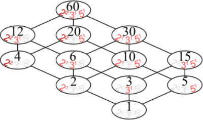
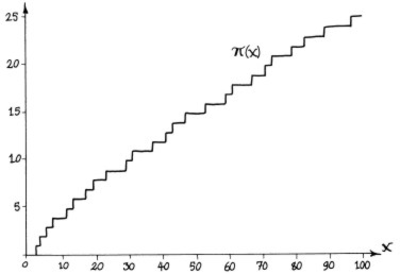
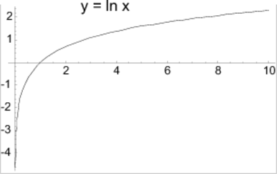

# &nbsp;

<hgroup>

<h1 style="font-size:32pt">Skaitļu teorija:<br/>
NMS Juniori 2019-09-28</h1>


<blue>Pirmskaitļi un dalāmība</blue>


</hgroup><hgroup>

<span style="color:darkgreen">**(1) Ievads**</span>  
<span>(2) [Dalāmība un dalīšana](#section-1)</span>  
<span>(3) [Dalītāju skaits](#section-2)</span>  
<span>(4) [Pirmskaitļu izvietojums](#section-3)</span>  
<span>(5) [Aritmētikas pamatteorēma](#section-4)</span>  
<span>(6) [LKD un MKD](#section-5)</span>  
<span>(7) [Kvantoru pieraksts](#section-6)</span>  
<span>(8) [Mājasdarba uzdevumi](#section-7)</span>  
<span>(9) [Kopsavilkums](#section-8)</span>


</hgroup>

::: notes

Ievērojama daļa skaitļu teorijas uzdevumu 
ir par dalāmības attiecību (viens skaitlis 
dalās/nedalās ar otru; pirmskaitlis kā skaitlis 
ar diviem naturāliem dalītājiem). Dalāmības 
attiecība ir interesanta, jo to ne vienmēr 
var izpildīt, joprojām paliekot veselo skaitļu kopā.
Dalāmības attiecība ļauj definēt pirmskaitļus 
(skaitļus, kam ir tieši divi dalītāji), dalīšanu
pirmreizinātājos, u.c.

*Par ko var veidot animācijas:*

1. Ūdens laistīšanas uzdevums un/vai "atstarošanās uzdevums" (kā ar 8L un 13L krūzēm nomērīt tieši 1L).
2. Skapīšu durvju vai slēdžu pārslēgšanas
animācija (sk. NT.JUN01.1).
3. Eratostena režģa animācija.
4. Eiklīda algoritma animācija jebkādiem skaitļiem.
5. Tipiska un vissliktākā Eiklīda algoritma ātrdarbība, rekursīvo izsaukumu skaits šajā algoritmā.
6. Dalītāju režģis 3 vai 4 dimensijās - kā lielam 
skaitlim, piemēram, formā $p^aq^br^c$
pamazām (augošā secībā) atklājas visu tā dalītāju kopums.

:::


# <lo-why/> why

<div class="bigWhy">
Kāpēc skaitļu dalāmībā ir praktiski izmantojamas struktūras?
</div>

<div class="smallWhy">

* Kāpēc dalāmību izmanto arī uzdevumos, kur dalīšanas nav?
* Kādas struktūras veido viena skaitļa dalītāji?   
Daudzu pēc kārtas sekojošu skaitļu dalītāji?

</div>

::: notes

* Pamatojam, ka skaitļu teoriju ir dabiski sākt ar dalāmības 
attiecības pētīšanu. 
* Viena skaitļa dalītājus viegli aprakstīt 
(galīga taisnstūrveida sistēma), bet daudzu skaitļu dalītājus
un pirmskaitļu izvietojumu krietni grūtāk raksturot.

:::


## <lo-theory/> Sasniedzamie rezultāti

* Iepazīties ar <blue>*attiecības*</blue> (*relation*) jēdzienu.
* Veidot naturālu skaitļa visu dalītāju simetriskus izkārtojumus.
* Saskaitīt naturāla skaitļa dalītājus un aprēķināt visu dalītāju
(arī dalītāju kvadrātu u.c.) summu.
* Veidot Eratostēna režģi. 
* Lietot aritmētikas pamatteorēmu un Eiklīda lemmu.
* Izmantot LKD un MKD īpašības. 
* Lietot Bezū lemmu.


# &nbsp;

<hgroup>

<h1 style="font-size:32pt">Skaitļu teorija:<br/>
NMS Juniori 2019-09-28</h1>


<blue>Pirmskaitļi un dalāmība</blue>


</hgroup><hgroup>

<span>(1) [Ievads](#section)</span>  
<span style="color:darkgreen">**(2) Dalāmība un dalīšana**</span>  
<span>(3) [Dalītāju skaits](#section-2)</span>  
<span>(4) [Pirmskaitļu izvietojums](#section-3)</span>  
<span>(5) [Aritmētikas pamatteorēma](#section-4)</span>  
<span>(6) [LKD un MKD](#section-5)</span>  
<span>(7) [Kvantoru pieraksts](#section-6)</span>  
<span>(8) [Mājasdarba uzdevumi](#section-7)</span>  
<span>(9) [Kopsavilkums](#section-8)</span>

</hgroup>

::: notes

**Kādēļ no visām darbībām jāstudē tieši dalāmība:**

* Veseli skaitļi ir datora aritmētikas pamats. 
* Veselus skaitļus vienmēr var saskaitīt, atņemt, reizināt (arī kāpināt veselās pozitīvās pakāpēs). 
* Dalīt ne vienmēr var – dalāmības attiecība ir "interesantāka".

:::


# <lo-theory/> Dalāmība un dalīšana

**Definīcija:** Vesels skaitlis $m$ 
<blue>*dalās ar*</blue> (*is divisible by*)
veselu skaitli $d \neq 0$, ja 
eksistē tāds vesels $k$, kuram 
$m = d \cdot k$.  
*Pieraksts:* $d \mid m$ (saki: "$d$ dala $m$".)  
Tad $d$ sauc par skaitļa $m$ <blue>*dalītāju*</blue>
(*divisor*). Skaitli $m$ sauc par 
skaitļa $d$ <blue>*daudzkārtni*</blue>
(*multiple*). 

::: notes

Skaitļu teorijā daudzi rezultāti tieši neatsaucas
uz skaitļu dalāmību. Piemēram, J.Lagranža 
(*Joseph-Louis Lagrange*) teorēma: 
Ikvienu naturālu skaitli var izteikt 
kā četru pilnu kvadrātu summu. 
Tomēr arī šādu rezultātu
pierādīšanai parasti lieto metodes,
kuras rodas, pētot skaitļu dalāmību. 
Interese par skaitļu dalāmību, 
par pirmskaitļiem tālu pārsniedz tiešo praktisko
lietojumu. Šī interese radījusi
svarīgus rezultātus, piemēram, par eliptiskajām līknēm
un kriptosistēmām.

Atšķirībā no saskaitīšanas, reizināšanas un 
(atļaujot negatīvos skaitļus) arī atņemšanas, 
dalīšanas operāciju ne vienmēr var izpildīt
veselos skaitļos. Par dalāmību vingrināsimies
pierakstīt arī loģiskus apgalvojumus:

* $(\forall a \in \mathbb{Z})\;a \neq 0 \Rightarrow a\;\mid\;0$.  
Saki: "Visiem $a$ no veselo skaitļu kopas: Ja $a$ nav $0$, tad $a$ dala $0$."
* $(\forall a \in \mathbb{Z})\;0 \nmid a$   
Saki: "Visiem $a$ no veselo skaitļu kopas: $0$ nedala $a$."

:::


## <lo-summary/> Dalāmības režģis

<hgroup>


</hgroup>
<hgroup style="font-size:70%">

* Ja ir augšupejošs ceļš no $a$ uz $b$, 
tad $b$ dalās ar $a$. 
* Dalāmības attiecībā "minimālais" elements ir $1$
(visi skaitļi dalās ar $1$). "Maksimālais" elements
ir $0$ (dalās ar jebkuru citu skaitli).

**Transitivitāte:** Ja $a$ dala $b$ un $b$ dala $c$, 
tad $a$ dala $c$. (Piemēram, no $15 \mid 60$ un 
$60 \mid 480$ var secināt, ka $15 \mid 480$.) 

"Transitīvais slēgums" - var zīmējumu saraibināt, 
savienojot arī izsecināmās attiecības ($1$ ar $4$ vai $8$ utt.).
Parasti tā nedara.

</hgroup>


::: notes

Dalāmības attiecība ievieš daļēju sakārtojuma 
attiecību veselo skaitļu kopā līdzīgi kā $\leq$. 
Pats "mazākais" veselais skaitlis 
šajā sakārtojumā ir $1$; 
visi pirmskaitļi ir līmeni augstāk, jo tie 
dalās ar $1$, bet $1$ ar tiem nē. 
Vēl līmeni augstāk ir visi iespējamie 
divu pirmskaitļu reizinājumi, 
ieskaitot pirmskaitļu kvadrātus. 
Starp šo līmeni un pirmskaitļu līmeni 
visur nepastāv sakārtojuma attiecība. 
Piemēram, $2 \times 3$ nav salīdzināms ar $5$ 
(tie savstarpēji cits ar citu nedalās). 
Sakārtojuma attiecību var turpināt arī 
augstākiem slāņiem (trīs, četru, utt. 
pirmskaitļu reizinājumam). Sakārtojuma attiecības 
pašā augšā atrodas skaitlis $0$, 
jo tas dalās ar jebkuru skaitli. 

Dotajā attēlā $1$ ir savienots ar $2$ un $2$ 
ir savienots ar $4$, bet nav novilkta 
šķautne no $1$ uz $4$ (kaut arī starp tiem 
pastāv sakārtojuma attiecība). Tas darīts 
vienīgi tādēļ, lai nesaraibinātu zīmējumu, 
jo dalāmības *transitivitātes* dēļ no 
$1 \mid 2$ un $2 \mid 4$ var secināt, 
ka $1 \mid 4$.

Sk. [Partially ordered sets](http://www.wikiwand.com/en/Partially_ordered_set)

:::


## <lo-summary/> Dalīšana nav dalāmība

<hgroup>

<blue>*Dalīšana*</blue> (*division*) ir 
aritmētiska operācija. Dalot divus 
veselus skaitļus, rezultāts ir 
vesels vai racionāls. 

**Piemērs:** Dalīšanas 
rezultāts $18/6$ ir skaitlis $3$, 
bet $17/6$ rezultāts ir $2\frac{5}{6}$. 

</hgroup>
<hgroup>

<blue>*Dalāmība*</blue> ir loģiska
attiecība - tās rezultāts ir 
patiesuma vērtība 
(`patiess` jeb `true` vai arī 
`aplams` jeb `false`). 

**Piemērs:** $18 \mid 6$ rezultāts ir
`true`. Bet $17 \mid 6$ rezultāts ir 
`false`. 

</hgroup>


::: notes

Dalīšanai kā aritmētiskai operācijai ir vairāki simboliski apzīmējumi. Pie tam veselu skaitļu dalīšanas rezultāts var parādīties vairākos veidos:

1. Dalīšana, iegūstot parasto vai jaukto daļskaitli: $17:3 = \frac{17}{3} = 5$
2. Dalīšana, iegūstot noapaļotu decimāldaļu: $17:3 = 5.6666667$
3. Dalīšana, iegūstot periodisku decimāldaļu: $17:3 = 5.(6)$ (lasa "pieci komats periodā seši")
4. Dalīšana, iegūstot dalījumu veselos skaitļos un atlikumu:  $17:3 = 5\;\;\mbox{atl.}\;\;2$

**Dalāmības īpašības:**

1. Ja $a \mid b$ un $a \mid c$, tad $a \mid b+c$ un $a \mid b - c$;
2. Ja $a \mid b$, tad $a \mid b \cdot k$;
3. Ja $a \mid b_1, a \mid b_2, \ldots, a \mid b_n$, tad $a \mid (b_1k_1 + b_2k_2 + \ldots + b_nk_n)$; 
4. Ja $a \mid b$ un $b \mid c$, tad $a \mid c$;
5. Ja $a \mid x$ un $b \mid y$, tad $ab \mid xy$; 
6. Ja $a \mid b$ un $b \mid a$, tad $a = b$.

::: 


## <lo-summary/> Dalīšana ar atlikumu

<hgroup>

**Definīcija:** Dalīt veselu skaitli $m$ ar $d$ 
ar atlikumu nozīmē izteikt $m = q\cdot d + r$, kur
dalījuma veselā daļa $q$
un atlikums $r$ ir veseli skaitļi, turklāt 
<blue>*atlikums*</blue> (*remainder*) 
pieņem kādu no vērtībām:
$r \in \{ 0, 1, \ldots, n-1 \}$. 

**Piemērs:** Dalot ar $3$ iespējamie atlikumi 
ir <red>$\{ 0,1,2 \}$</red>. 

</hgroup>
<hgroup>

<!--

-->

```console
Python 3.6.7 (...) 
>>> 15 % 3
0
>>> 17 % 3
2
>>> (-17) % 3
1
>>> (-17) // 3
-6
```

$$\left\{
\begin{array}{l}
15 = 5 \cdot 3 + \color{#F00}{0}\\
17 = 5 \cdot 3 + \color{#F00}{2}\\
-17 = (-6) \cdot 3 + \color{#F00}{1}
\end{array}
\right.$$


</hgroup>


::: notes

Arī negatīviem skaitļiem iespējama dalīšana ar atlikumu. 
Jāņem vērā, ka atlikumi nemēdz būt negatīvi. 

Diemžēl daudzās programmēšanas valodās 
*atlikuma operators*, ja to izmanto negatīviem skaitļiem,
dod negatīvus atlikumus. Ar to tas var 
atšķirties no atlikuma
matemātiskas definīcijas. 
Atlikums, dalot ar $n$, vienmēr ir skaitlis 
starp $0$ un $n-1$. 

:::


# <lo-sample/> Uzdevums NT.JUN01.1

Rindā novietoti $30$ slēdži ar numuriem no $1$ līdz $30$. 
Katrs slēdzis var būt ieslēgts vai izslēgts; sākumā tie visi ir izslēgti. 
Pirmajā solī pārslēdz pretējā stāvoklī visus slēdžus, kuru 
numuri dalās ar $1$. Otrajā solī pārslēdz visus tos, kuru 
numuri dalās ar $2$. Un tā tālāk - līdz 30.solī pārslēdz pretējā
stāvoklī slēdžus, kuru numuri dalās ar $30$.  
Cik daudzi slēdži kļūst ieslēgti pēc visu soļu pabeigšanas?

## <lo-reading/> Uzdevums NT.JUN01.1

<hgroup>

* Ko nozīmē "pārslēgt pretējā stāvoklī"?
* Cik daudzi soļi pārslēdz slēdzi ar konkrētu numuru $n$?
* Vai atbildē jānorāda slēdžu skaits, kas mainīja (vai arī kas nemainīja) 
savu stāvokli? 
* Tas iestājas pēc soļu skaita, kas ir pāra vai nepāra skaitlis?

</hgroup>
<hgroup>


</hgroup>


## <lo-soln/> Uzdevums NT.JUN01.1

<table>
<tr>
<th>1</th><th>2</th><th>3</th><th>4</th><th>5</th><th>6</th><th>7</th><th>8</th><th>9</th><th>10</th>
<th>11</th><th>12</th><th>13</th><th>14</th><th>15</th><th>16</th><th>...</th><th>30</th>
</tr>
<tr>
<td>1</td><td>1</td><td>1</td><td>1</td><td>1</td><td>1</td><td>1</td><td>1</td><td>1</td><td>1</td>
<td>1</td><td>1</td><td>1</td><td>1</td><td>1</td><td>1</td><td>...</td><td>1</td>
</tr>
<tr>
<td>&nbsp;</td><td>2</td><td>3</td><td>2</td><td>5</td><td>2</td><td>7</td><td>2</td><td>3</td><td>2</td>
<td>11</td><td>2</td><td>13</td><td>2</td><td>3</td><td>2</td><td>...</td><td>2</td>
</tr>
<tr>
<td>&nbsp;</td><td>&nbsp;</td><td>&nbsp;</td><td>4</td><td>&nbsp;</td>
<td>3</td><td>&nbsp;</td><td>4</td><td>9</td><td>5</td>
<td>&nbsp;</td><td>3</td><td>&nbsp;</td><td>7</td><td>5</td>
<td>4</td><td>...</td><td>3</td>
</tr>
<tr>
<td>&nbsp;</td><td>&nbsp;</td><td>&nbsp;</td><td>&nbsp;</td><td>&nbsp;</td>
<td>6</td><td>&nbsp;</td><td>8</td><td>&nbsp;</td><td>10</td>
<td>&nbsp;</td><td>4</td><td>&nbsp;</td><td>14</td><td>15</td>
<td>8</td><td>...</td><td>5</td>
</tr>
<tr>
<td>&nbsp;</td><td>&nbsp;</td><td>&nbsp;</td><td>&nbsp;</td><td>&nbsp;</td>
<td>&nbsp;</td><td>&nbsp;</td><td>&nbsp;</td><td>&nbsp;</td><td>&nbsp;</td>
<td>&nbsp;</td><td>6</td><td>&nbsp;</td><td>&nbsp;</td><td>&nbsp;</td>
<td>16</td><td>...</td><td>6</td>
</tr>
<tr>
<td>&nbsp;</td><td>&nbsp;</td><td>&nbsp;</td><td>&nbsp;</td><td>&nbsp;</td>
<td>&nbsp;</td><td>&nbsp;</td><td>&nbsp;</td><td>&nbsp;</td><td>&nbsp;</td>
<td>&nbsp;</td><td>12</td><td>&nbsp;</td><td>&nbsp;</td><td>&nbsp;</td>
<td>&nbsp;</td><td>...</td><td>10</td>
</tr>
<tr>
<td>&nbsp;</td><td>&nbsp;</td><td>&nbsp;</td><td>&nbsp;</td><td>&nbsp;</td>
<td>&nbsp;</td><td>&nbsp;</td><td>&nbsp;</td><td>&nbsp;</td><td>&nbsp;</td>
<td>&nbsp;</td><td>&nbsp;</td><td>&nbsp;</td><td>&nbsp;</td><td>&nbsp;</td>
<td>&nbsp;</td><td>...</td><td>15</td>
</tr>
<tr>
<td>&nbsp;</td><td>&nbsp;</td><td>&nbsp;</td><td>&nbsp;</td><td>&nbsp;</td>
<td>&nbsp;</td><td>&nbsp;</td><td>&nbsp;</td><td>&nbsp;</td><td>&nbsp;</td>
<td>&nbsp;</td><td>&nbsp;</td><td>&nbsp;</td><td>&nbsp;</td><td>&nbsp;</td>
<td>&nbsp;</td><td>...</td><td>30</td>
</tr>
</table>

Kuriem no skaitļiem ir nepāru skaits dalītāju?


::: notes

Mēģiniet izvirzīt hipotēzes un tās pamatot.

:::

# &nbsp;

<hgroup>

<h1 style="font-size:32pt">Skaitļu teorija:<br/>
NMS Juniori 2019-09-28</h1>


<blue>Pirmskaitļi un dalāmība</blue>


</hgroup><hgroup>

<span>(1) [Ievads](#section)</span>  
<span>(2) [Dalāmība un dalīšana](#section-1)</span>  
<span style="color:darkgreen">**(3) Dalītāju skaits**</span>  
<span>(4) [Pirmskaitļu izvietojums](#section-3)</span>  
<span>(5) [Aritmētikas pamatteorēma](#section-4)</span>  
<span>(6) [LKD un MKD](#section-5)</span>  
<span>(7) [Kvantoru pieraksts](#section-6)</span>  
<span>(8) [Mājasdarba uzdevumi](#section-7)</span>  
<span>(9) [Kopsavilkums](#section-8)</span>


</hgroup>

::: notes

Dalītāju izvietojums, skaits, režģis. Izrādās, ka fiksēta 
skaitļa dalītāji veido interesantu, simetrisku struktūru, 
kuru var attēlot kā režģi. Režģa aplūkošana ļauj ātri noskaidrot 
dalītāju skaitu un citas to kopīgās īpašības. Režģa struktūra noderēs arī, 
lai ģeometriski iztēlotos, teiksim, lielāko kopīgo dalītāju diviem skaitļiem.

:::


# <lo-summary/> Dalītāju virknes simetrija

<hgroup>


</hgroup>
<hgroup>


</hgroup>


::: notes

* Dalītāji režģī izvietoti centrālsimetriski attiecībā 
pret sarkano aplīti.
* Visas dalāmības attiecības nav attēlotas ar svītriņām 
(bet gan tikai minimāli nepieciešamās). 
* Pārējās attiecības ir jāsecina ar "transitīvo slēgumu", 
kad savelk visas citas bultiņas, ko var izsecināt:   
Ja $a \mid b$ un $b \mid c$, tad $a \mid c$.

Pilno kvadrātu starp visiem naturālajiem skaitļiem ir salīdzinoši 
nedaudz. Jebkurā pietiekami garā intervālā to būs krietni 
mazāk nekā, teiksim, pirmskaitļu.  Tādēļ lielajam vairumam 
naturālo skaitļu ir pāru skaits dalītāju.

:::


## <lo-summary/> Hases diagrammas

H.Hase (*Helmut Hasse*) spriedumos par daļēji sakārtotām 
kopām ieviesa diagrammas, kas attēlo
"transitīvo redukciju": 

* Vispirms savieno ar svītriņu 
visus aplīšus, kas atrodas attiecībā "mazāks". 
* Pēc tam izdzēš tās svītriņas, ko var izsecināt 
no citām, izmantojot transitivitāti. 


## <lo-summary/> Veidotājelementi: 2,3,5


::: notes

https://www.pinterest.com/pin/411586853439524717/?lp=true

::: 


# <lo-theory/> Dalītāju apkopojumu funkcijas

<div style="font-size:70%">

Skaitļa dalītājus mēdz dažādi apkopot, piemēram, 
uzzinot to skaitu, summu vai augstāku pakāpju summu.

**Definīcija:** Katram naturālam skaitlim $n$ definējam 
funkcijas $\sigma_0(n)$, $\sigma_1(n)$ un $\sigma_2(n)$ 
ar šādām vienādībām: 

$$\begin{array}{rcl}
\sigma_0(n) & = & \sum\limits_{d \mid n} 1 = \sum\limits_{d \mid n} d^0,\\
\sigma_1(n) & = & \sum\limits_{d \mid n} d,\\
\sigma_2(n) & = & \sum\limits_{d \mid n} d^2,
\end{array}$$

Apzīmējums $\sum\limits_{d \mid n}\ldots$ summē izteiksmi
visiem $d$, kuri ir $n$ dalītāji.

$\sigma_0(n)$ summē dalītāju $0$-tās
pakāpes jeb vieniniekus - skaitļa
$n$ dalītāju skaits.

</div>


## <lo-summamry/> Piemēri ar n=60

$$\sigma_0(60) = \left| \{ 1,2,3,4,5,6,10,12,15,20,30,60 \} \right| = 12.$$
$$\sigma_1(60) = 1 + 2 + 3 + 4 + 5 + 6 + 10 + 12 + $$
$$ + 15 + 20 + 30 + 60 = 168.$$
$$\sigma_2(60) = 1^2 + 2^2 + 3^2 + 4^2 + 5^2 + 6^2 + 10^2 + 12^2$$
$$ + 15^2 + 20^2 + 30^2 + 60^2  = 5460.$$


## <lo-summary/> Dalītāji skaitlim 60

<hgroup>



</hgroup>
<hgroup style="font-size:70%">

* Dalītāju skaitu var atrast, izmantojot *reizināšanas likumu*. 
* Zināms, ka $60 = 2^23^15^1$.
* Katrs skaitļa $60$ dalītājs izsakāms $2^a3^b5^c$, 
kur $a \in \{ 0,1,2\}$, $b \in \{ 0,1 \}$, $c \in \{ 0,1 \}$. 
* Sareizinām elementu skaitu: $3 \cdot 2 \cdot 2 = 12$.

$$\sigma_0 \left( 2^{\color{#F00}{2}}3^{\color{#F00}{1}}5^{\color{#F00}{1}} \right) = $$
$$ = (\color{#F00}{2}+1)\cdot (\color{#F00}{1}+1)(\color{#F00}{1}+1) = 12.$$

</hgroup>

## <lo-summary/> Dalītāju un to kvadrātu summas

<div style="font-size:70%">

$\sigma_1(60)$ un $\sigma_2(60)$ arī var ātri 
aprēķināt, izmantojot algebriskas identitātes:

$$\sigma_1(60) = \left( 2^2 + 2^1 + 2^0 \right)
\left( 3^1 + 3^0 \right) \left( 5^1 + 5^0 \right) = $$
$$ = (4+2+1)(3+1)(5+1) = 7 \cdot 4 \cdot 6 = 168.$$

$$\sigma_2(60) = \left( 2^4 + 2^2 + 2^0 \right)
\left( 3^2 + 3^0 \right) \left( 5^2 + 5^0 \right) = $$
$$ = (16+4+1)(9+1)(25+1) = 5460.$$

Visu šo var iegūt no sadalījuma pirmreizinātājos:
$60 = 2 \cdot 2 \cdot 3 \cdot 5 = 2^23^15^1$.

</div>


# <lo-quiz/> Jautājums Nr.3

Uz galda ir piecas kartiņas, uz katras uzrakstīts
cits pirmskaitlis (attiecīgi $2$, $3$, $5$, $7$
un $11$). Cik dažādos veidos var paņemt kaut kādas
kartiņas (drīkst ņemt arī visas vai neņemt nevienu)? 

*Ierakstīt veselu skaitli (variantu skaitu):* _____


# <lo-sample/> NT.JUN01.2

Atrast mazāko naturālo skaitli, kam ir tieši 
$16$ dalītāji. 

## <lo-reading/> NT.JUN01.2

Uzdevumā netieši pateikts, ka naturāls skaitlis 
ar tieši $16$ dalītājiem vispār eksistē. 
Vienīgi tad ir jēga meklēt mazāko no šādiem 
skaitļiem.

**Apgalvojums:** Katram naturālam $n$ eksistē 
bezgalīgi daudzi skaitļi $M$, kuriem ir tieši 
$n$ pozitīvi dalītāji.  

*Ieteikums:* Var izvēlēties $M = p^{n-1}$, kur 
$p$ ir jebkurš pirmskaitlis.

::: notes

Apgalvojums ir triviāls: Lai atrastu skaitli, 
kuram ir tieši $n$ pozitīvi dalītāji, izvēlamies
skaitli $p^{n-1}$, kur $p$ ir jebkurš pirmskaitlis.
Protams, varētu būt citi atrisinājumi, 
kuri nav pirmskaitļu pakāpes. 
Uzdevums ir atrast vismazāko no tiem.

::: 

## <lo-hints/> NT.JUN01.2

Ja $M = p_1^ap_2^bp_3^cp_4^d$, tam ir 
$(a+1)(b+1)(c+1)(d+1)=16$ reizinātāji.
Līdzīgi arī mazākam pirmreizinātāju skaitam.  
(Ja dažādu pirmskaitļu, kas dala $M$, 
ir vairāk kā četri, tad $M$ būtu vismaz $2^5 = 32$ 
dalītāji, jo $M$ dalītājus var veidot, sareizinot 
jebkuru tā pirmreizinātāju apakškopu - varbūt pat tukšu).

**Stratēģija:** Gadījumu pārlase.  
Meklējam visus veidus, kā $16$ var izteikt
ne vairāk kā četru dažādu 
pirmskaitļu (vai to pakāpju) reizinājumu. 

::: notes

Katram veidam, kā pašu dalītāju skaitu (t.i. skaitli $16$) 
var izteikt kā reizinājumu, atbilst paraudziņš ar pirmeizinātājiem, 
kuri nodrošina attiecīgo dalītāju skaitu. Piemēram, ja 16 
izsaka kā 4 reiz 4, tad tam atbilst divu pirmskaitļu kubu 
reizinājums. Šādam skaitlim (mūsu piemērā $216$, bet tas 
varētu būt arī $1000$ vai jebkāds cits kubs), būs tieši 
$16$ dalītāji, jo katrā dalītājā katrs no pirmskaitļiem 
var tikt kāpināts jebkurā pakāpē ($0,1,2,3$). 

:::


## <lo-soln/> NT.JUN01.2 (1 pirmskaitlis)

<hgroup>


</hgroup>
<hgroup>

* $16 = (15+1)$.
* Tieši $16$ dalītāji ir skaitlim formā $p^{15}$, 
kur $p$ ir jebkurš pirmskaitlis. 
* Mazāko $M$ var iegūt mazākajam pirmskaitlim $p=2$. 
* Šajā gadījumā $M = 2^{15} = 32768$.

</hgroup>

## <lo-soln/> NT.JUN01.2 (2 pirmskaitļi - A)

<hgroup>


</hgroup>
<hgroup>

* $16 = (7+1)(1+1)$. 
* Tieši $16$ dalītāji ir skaitlim formā 
$p^7q$, kur $p,q$ ir pirmskaitļi. 
* Mazākais šāds skaitlis ir $2^7\cdot{} 3 = 
128 \cdot 3 = 384$. 

</hgroup>


## <lo-soln/> NT.JUN01.2 (2 pirmskaitļi - B)

<hgroup>


</hgroup>
<hgroup>

* $16 = (3+1)(3+1)$. 
* Tieši $16$ dalītāji ir skaitlim formā 
$p^3q^3$, kur $p,q$ ir pirmskaitļi. 
* Mazākais šāds skaitlis ir $2^3\cdot{} 3^3 = 
216$.

</hgroup>


## <lo-soln/> NT.JUN01.2 (3 pirmskaitļi)

<hgroup>


</hgroup>
<hgroup>

$(3+1)(1+1)(1+1)$. 

* Tieši $16$ dalītāji ir skaitlim formā 
$p^3qr$, kur $p,q,r$ ir pirmskaitļi. 
* Mazākais šāds skaitlis ir $2^3\cdot{} 3 \cdot 5 = 
120$.

</hgroup>


## <lo-soln/> NT.JUN01.2 (4 pirmskaitļi)

<hgroup>


</hgroup>
<hgroup>

$(1+1)(1+1)(1+1)(1+1)$.  

* Tieši $16$ dalītāji ir skaitlim 
formā $pqrs$, kur $pqrs$. 
* Mazākais šāds skaitlis ir $2 \cdot 3 \cdot 5 \cdot 7 = 210$. 

**Atbilde:** Optimāls atrisinājums (mazākais skaitlis) 
ir $120$ (trīs dažādi pirmreizinātāji, viens no 
tiem celts trešajā pakāpē).


</hgroup>


# <lo-quiz/> Jautājums Nr.1

Naturālam skaitlim $n$ ir tieši $125$ naturāli 
dalītāji (ieskaitot $1$ un pašu $n$). 
Kādu visaugstākās pakāpes sakni noteikti var izvilkt no 
$n$, iegūstot naturālu rezultātu? 

*Ierakstīt naturālu skaitli (saknes pakāpi) vai 
skaitli $1$, ja neviena augstākas pakāpes sakne 
$\sqrt[k]{n}$ ($k>1$) nav garantēti vesela:* _____

<!--

## <lo-quiz/> Jautājums Nr.1: Atrisinājums

<div style="font-size:100%">

$125$ var izteikt kā reizinājumu 
vairākiem skaitļiem (kas
pārsniedz $1$) sekojošos veidos:

* $125 = 124+1$.
* $125 = 25 \cdot 5 = (24 + 1) \cdot (4+1)$.
* $125 = 5 \cdot 5 \cdot 5 = (4+1) \cdot (4+1) \cdot (4+1)$.

Tādēļ skaitli $n$ var sadalīt pirmreizinātājos 
vienā no sekojošiem veidiem: 

$$n = p^{124},\;\;n = p^{24}q^4\;\;\text{vai}\;\;n = p^{4}q^4r^4,$$

kur $p,q,r$ ir pirmskaitļi. Visos gadījumos var izvilkt 4.pakāpes sakni.

</div>

-->


# &nbsp;

<hgroup>

<h1 style="font-size:32pt">Skaitļu teorija:<br/>
NMS Juniori 2019-09-28</h1>


<blue>Pirmskaitļi un dalāmība</blue>


</hgroup><hgroup>

<span>(1) [Ievads](#section)</span>  
<span>(2) [Dalāmība un dalīšana](#section-1)</span>  
<span>(3) [Dalītāju skaits](#section-2)</span>  
<span style="color:darkgreen">**(4) Pirmskaitļu izvietojums**</span>  
<span>(5) [Aritmētikas pamatteorēma](#section-4)</span>  
<span>(6) [LKD un MKD](#section-5)</span>  
<span>(7) [Kvantoru pieraksts](#section-6)</span>  
<span>(8) [Mājasdarba uzdevumi](#section-7)</span>  
<span>(9) [Kopsavilkums](#section-8)</span>


</hgroup>

::: notes

Šajā tēmā pamatojam, ka pirmskaitļu ir bezgalīgi daudz, apsveram iespējas tos algoritmiski atrast (Eratostena režģis, daži mūsdienu algoritmi). Un arī apskatām dažus sacensību uzdevumus, kuri nepārprotami iedvesmojušies no šīs pirmskaitļu teorijas.


Pirmskaitļu izvietojums nelielos intervālos 
var izskatīties juceklīgs. Tomēr garākos 
intervālos to blīvums labi tuvināms ar 
varbūtisku modeli. Vienkāršoti sakot, 
lieliem naturāliem $n$, varbūtība, ka $n$ 
ir pirmskaitlis, ir apgriezti 
proporcionāla skaitļa $n$ naturālajam logaritmam.

:::


# <lo-theory/> Pirmskaitļu jēdziens

<hgroup style="font-size:90%">

**Definīcija:** Naturālu skaitli $p>1$ 
sauc par <blue>*pirmskaitli*</blue>
(*prime number*), ja vienīgie tā dalītāji ir 
$1$ un $p$. 

Naturālus skaitļus $n>1$, kas nav 
pirmskaitļi, sauc par <blue>*saliktiem
skaitļiem*</blue> (*composite
number*). 

Skaitlis $1$ nav ne pirmskaitlis, ne 
salikts skaitlis.

</hgroup>
<hgroup>

Intervālā $[1;100]$ ir $25$ pirmskaitļi:

<table>
<tr>
<td>2</td><td>3</td><td>5</td><td>7</td><td>11</td>
</tr>
<tr>
<td>13</td><td>17</td><td>19</td><td>23</td><td>29</td>
</tr>
<tr>
<td>31</td><td>37</td><td>41</td><td>43</td><td>47</td>
</tr>
<tr>
<td>53</td><td>59</td><td>61</td><td>67</td><td>71</td>
</tr>
<tr>
<td>73</td><td>79</td><td>83</td><td>89</td><td>97</td>
</tr>
</table>

::: notes

Skaitlis $1$ nav ne pirmskaitlis, ne arī salikts skaitlis. Tas ir *vienības elements* naturālu skaitļu reizināšanā. (Veselo skaitļu pasaulē $-1$ ir otrs vienības elements.)

:::

## <lo-summary/> Eratostena režģis

<hgroup>


</hgroup>
<hgroup style="font-size:70%">

Eratostena process notiek vairākos soļos. 

* Skaitļu tabuliņā atzīmē mazāko skaitli 
(<red>pirmskaitli $2$</red>) un visus
tā dalāmos/daudzkārtņus izsvītro. 
* Atzīmē mazāko neizsvītroto 
(<green>pirmskaitli $3$</green>) un 
visus tā daudzkārtņus izsvītro.
* Atzīmē mazāko neizsvītroto 
(<blue>pirmskaitli $5$</blue>) un 
visus tā daudzkārtņus izsvītro.

**Apgalvojums:** Minētais process nekad 
nebeigsies; pēc katra soļa paliks 
neizsvītroti skaitļi. 

</hgroup>

::: notes

Vai Eratostena režģis ir efektīvs algoritms, 
ja jāatrod visi pirmskaitļi intervālā $[1,N]$? 

Eratostens (276. g. p.m.ē –194. g. p.m.ē) 
pazīstams arī ar to, ka diezgan precīzi 
noteicis Zemeslodes apkārtmēru. 
Viņa eksperiments balstījās uz novērojumu, 
ka divās Ēģiptes pilsētās, kas abas atrodas 
uz tā paša meridiāna (mūsdienās tās 
sauc Asuāna un Aleksandrija), 
ir atšķirīgs Saules augstums virs horizonta 
vasaras saulgriežos. Asuāna atrodas 
uz Ziemeļu tropiskā loka – Saule tur 
nonāk tieši zenītā, savukārt Aleksandrijā 
tā pat saulgriežos atrodas 
noteiktā leņķī no zenīta – un leņķi var izmērīt, 
piemēram, kā vertikāla staba ēnas garumu. 
Attālums no Asuānas līdz Aleksandrijai 
Eratostenam bija zināms; Zemeslodes apkārtmēru 
tad noteica ar trigonometrisku sakarību

Eratostena režģis ir dinamiskās programmēšanas 
piemērs. Šie algoritmi aizpilda apjomīgas 
datu struktūras (piemēram, masīvus, tabulas). 
Dinamiskā programmēšana ir efektīva, piemēram, 
kāpinot skaitļus lielās pakāpēs (atceroties agrāk 
iegūtus starprezultātus), vai arī, aprēķinot 
Fibonači skaitļus. 

Lai noskaidrotu, vai konkrēts skaitlis $n$
ir pirmskaitlis, Eratostena režģis nav praktisks
algoritms (jo tas meklē visus pirmskaitļus, kas
par to mazāki).

:::


# <lo-quiz/> Jautājums Nr.2

Kādā no Eratostena režģa veidošanas 
soļiem tiek izsvītroti visi pirmskaitļa $13$
daudzkārtņi. Kurš no šajā solī 
izsvītrotajiem skaitļiem ir pirmais starp tiem, 
kuru izsvītro pirmoreiz (kurš nav izsvītrots kādā 
no agrākiem soļiem).

*Ierakstīt naturālu skaitli:* _____

<!--

## <lo-quiz/> Jautājums Nr.2: Atrisinājums

Skaitļa $13$ daudzkārtņi, kas tiek izsvītroti 
ir $26,39,52,\ldots$. Mazākais no šiem skaitļiem, 
kas nedalās ar nevienu citu pirmskaitli $p < 13$
ir $13^2 = 169$. Tam seko arī $13 \cdot 17$ un 
daudzi citi piemēri, kurus šajā solī izsvītro
pirmoreiz.

-->


# <lo-theory/> Pirmskaitļu ir bezgalīgi daudz

**Teorēma:** Pirmskaitļu ir bezgalīgi daudz.

**Pierādījums:** No pretējā. Ja pirmskaitļu būtu 
galīgs skaits, tad eksistētu lielākais pirmskaitlis 
$p_K$. Sareizinām visus pirmskaitļus, pieskaitām $1$:
$$P = p_1 \cdot p_2 \cdot p_3 \cdot \ldots \cdot p_K + 1.$$ 

$P$ nedalās ne ar vienu no pirmskaitļiem, kuri ir galīgajā 
sarakstā: vienmēr atlikums $1$. Vai nu $P$ pats ir pirmskaitlis 
vai kādu (sarakstā neesošu) pirmskaitļu reizinājums. Pretruna. 
$\blacksquare$


## <lo-sample/> Pārlase līdz kvadrātsaknei

<hgroup>

```python
import math 

def isPrime(n):
    result = True
    ROOT = int(math.sqrt(n))
    for d in range(2,ROOT+1):
        if n % d == 0:
            result = False
            break
    return result

print(isPrime(10000000019))
```

</hgroup>
<hgroup>

Pilnā pārlase ir ļoti neefektīva 
(slikti strādā jau pie $n = 10^{30}$). 

Labāki algoritmi: 

1. [Miller-Rabin primality test](https://en.wikipedia.org/wiki/Miller%E2%80%93Rabin_primality_test) - ap 1980.g.
2. [Agrawal-Kayal-Saxena test](https://en.wikipedia.org/wiki/AKS_primality_test) - ap 2002.g.

</hgroup>


# <lo-sample/> NT.JUN01.3

Vai eksistē $1000$ pēc kārtas sekojoši skaitļi, kuri visi ir salikti?

::: notes

Ja izvēlamies $N = 1000!+2$, tad iegūsim, ka $1000!+a$ dalās ar $a$ katram $a \in \{2,\ldots 1000 \}$. Arī $1000! + 1001$ ir salikts skaitlis, jo abi saskaitāmie dalās, teiksim, ar $11$ (dalāmības pazīme ar $11$). 

Viegli redzēt, ka var izveidot vēl garākus intervālus bez pirmskaitļiem – piemēram, izvēloties ļoti lielu skaitļu faktoriālus. Vienīgi skaitļi šajos intervālos parasti ir ļoti lieli. Pirmskaitļu blīvums, skaitļiem pieaugot, samazinās, bet dara to ļoti pakāpenski. 

:::


## <lo-hints/> NT.JUN01.3

* Jāatrod intervāls $[N, N+1, \ldots, N+999]$, 
kurā visi skaitļi ir salikti. 
* Vai $N$ var izvēlēties tā, lai tas dalītos ar $2,3,\ldots,999$?
* Varētu izvēlēties $N = 1000!$, bet neskaidrs par $N+1$.


## <lo-soln/> NT.JUN01.3

$p=997$ ir lielākais pirmskaitlis, kam $p \leq 1001$
($999$ un $1001$ nav pirmskaitļi - dalās ar $9$ un $11$).  
Dalāmības pazīme ar $11$?  
$1001 = 11 \cdot 91 = 11 \cdot 7 \cdot 13$. 

Tad der $N = 997! + 2$. Piemēram: 
$$N + 999 = 997! + 2 + 999 = 997! + 1001 = $$
$$ = 1001 \cdot \left\( \frac{1}{7 \cdot 11 \cdot 13} 997! + 1 \right)$$


# <lo-sample> NT.JUN01.4

Pierādīt, ka ir bezgalīgi daudz nepāru pirmskaitļu, kas
izsakāmi formā $4k+3$ (dod atlikumu $3$, dalot ar $4$). 

## <lo-soln/> NT.JUN01.4

TODO: Pamatot līdzīgi kā pierādījumā par bezgalīgo pirmskaitļu skaitu. 

## <lo-theory/> Dirihlē teorēma par pirmskaitļiem

**Dirihlē teorēma:** Ja $a$ un $d$ ir savstarpēji pirmskaitļi, 
tad bezgalīgā aritmētiskā progresijā
$$a, a+d, a+2d, a+3d, \ldots$$
ir bezgalīgi daudz pirmskaitļu. 

Dažām $a$ un $d$ vērtībām šo teorēmu var pierādīt ar elementārām 
metodēm (nupat redzējām pie $a=3$ un $d=4$). Bet vispārīgajā 
gadījumā ir piemērotākas matemātiskās analīzes metodes, 
kas izietu ārpus mūsu kursa.


# <lo-yellow/> Ulama spirāle

<hgroup>


</hgroup>
<hgroup>

Ulama spirāli veido, uz rūtiņu papīra zīmējot 
attinošos spirāli, sākot ar skaitli $1$. 
Pirmskaitļus, atzīmē ar melniem punktiņiem. 

Pirmskaitļi, kaut arī neveido viegli 
paredzamas likumsakarības, sablīvējas
uz dažām taisnēm.

</hgroup>

## <lo-yellow/> Formula pirmskaitļu iegūšanai

<hgroup>

Bijuši vairāki mēģinājumi uzrakstīt 
kompaktu formulu (bez `for` cikliem 
vai citiem programmēšanas paņēmieniem), kuras
visas vērtības ir pirmskaitļi. 

**Definīcija:** Par $n$-to Fermā skaitli 
($n \geq 0$) sauc $F_n = 2^{2^n}+1$. 

P.Fermā (*Pierre de Fermat*, 1607-1665) 
izteica hipotēzi, ka visi $F_n$ ir pirmskaitļi.

</hgroup>
<hgroup style="font-size:70%">

$F_0,F_1,F_2,F_3,F_4$ ir vienīgie
zināmie pirmskaitļi: 

* $F_0 = 2^{2^0} + 1 = 2^1 + 1 = 3$,
* $F_1 = 2^{2^1} + 1 = 2^2 + 1 = 5$,
* $F_2 = 2^{2^2} + 1 = 2^4 + 1 = 17$,
* $F_3 = 2^{2^3} + 1 = 2^8 + 1 = 257$,
* $F_4 = 2^{2^4} + 1 = 2^{16} + 1 = 65537$.

Jau $F_5 = 2^{2^5} + 1 = 2^{32} + 1 =$
$=4\,294\,967\,297 = 641 \cdot 6\,700\,417$ nav pirmskaitlis.  
(Leonards Eilers (Leonhard Euler), 1707-1783). 

::: notes

Izņemot pirmos 5 Fermā skaitļus 
(no $F_0$ līdz $F_4$), nav zināms neviens cits
pirmskaitlis. Ir pilnībā sadalīti pirmreizinātājos 
pirmie 12 šādi skaitļi – no $F_0$ līdz $F_11$. 
Daudziem citiem ir zināmi daži dalītāji; 
atklāto/zināmo dalītāju skaits tiek 
regulāri papildināts.

Skaitļi formā $2^k + 1$ nevar būt pirmskaitļi, 
ja kāpinātājam $k$ ir kāds nepāru dalītājs, kas lielāks par $1$, jo 
šajā gadījumā var dalīt reizinātājos, izmantojot
algebriskas identitātes $a^3 + 1^3$, $a^5 + 1^5$ utml.
Tātad pats kāpinātājs $k$ (lai sanāktu kaut kas interesants, 
kas nedalās reizinātājos pavisam triviāli)
noteikti ir divnieka pakāpe.

:::


# <lo-sample/> Andreescu2006.1.77

Pierādīt, ka naturāliem skaitļiem $m$ un $n$, 
kam $m > n$, Fermā skaitlis $F_m - 2$ noteikti 
dalās ar $F_n$. 

## <lo-soln/> Andreescu2006.1.77

Atkārtoti lietojam kvadrātu starpības formulu dalīšanai 
reizinātājos: 
$$F_m - 2 = 2^{2^m} + 1 - 2 = 2^{2^m} - 1 = $$
$$=\left( 2^{2^{m-1}} - 1 \right) \left( 2^{2^{m-1}} + 1 \right) = 
\left( F_{m-1} - 2 \right) F_{m-1}.$$

Ja arī $m - 1 > n$, tad līdzīgu spriedumu atkārto vēlreiz, 
dalot reizinātājos $F_{m-1} - 2$ utt. Katrā 
solī redzam, ka uzrodas reizinātāji $F_{m-1}$, $F_{m-2}$ utt. 
Kāds no šiem reizinātājiem būs tieši $F_n$. $\blacksquare$

## <lo-sample/> Andreescu2006.1.78

Dažādiem naturāliem $m$ un $n$, skaitļi $F_m$ un $F_n$ ir
savstarpēji pirmskaitļi.  
(Piemēram, $F_5$ dalās ar $641$. Tātad neviens cits Fermā 
skaitlis nevar dalīties ar $641$.)

## <lo-soln/>  Andreescu2006.1.78

Pieņemsim, ka $m>n$. Tad $F_m - 2$ dalās ar $F_n$. 
Iegūstam: 
$$\text{LKD}(F_m,F_n) = \text{LKD}((F_m -2) + 2,F_n) = $$
$$\text{LKD}(2,F_n) = 1.$$

$\blacksquare$


## <lo-summary/> Perfektie skaitļi

**Definīcija:** Skaitli sauc par <blue>*perfektu*</blue>, 
ja tas vienāds ar visu savu dalītāju summu (izņemot sevi pašu). 

**Piemēri:** $6 = 1+2+3$; $28 = 1 + 2 + 4 + 7 + 14$. 

**Teorēma (Eiklīds):** Ja $2^p - 1$ ir pirmskaitlis, tad
$2^{p-1}(2^p - 1)$ ir perfekts. 

**Teorēma (Eilers):** Visi pāru perfektie skaitļi izsakāmi 
formā $2^{p-1}(2^p - 1)$. 


## <lo-summary/> Perfektie skaitļi - 2

<table>
<tr><th>Pirmskaitlis $p$</th><th>$2^{p-1}(2^p - 1)$ vērtība</th></tr>
<tr><td>$p = 2$</td><td>$6_{10} = 110_{2}$</td></tr>
<tr><td>$p = 3$</td><td>$28_{10} = 11100_{2}$</td></tr>
<tr><td>$p = 5$</td><td>$496_{10} = 111110000_{2}$</td></tr>
<tr><td>$p = 7$</td><td>$8128_{10} = 1111111000000_{2}$</td></tr>
<tr><td>$p = 13$</td><td>$33550336_{10} = 1111111111111000000000000_{2}$</td></tr>
</table>

Ar $p=11$ nesanāk, jo $2^{11} - 1 = 2047 = 23 \cdot 89$. 


# <lo-yellow/> Nenopietns piemērs

Polinoms $f(x) = x^2 + x + 41$ 
visiem argumentiem $x = 0,1,\ldots,39$
pieņem vērtības, kas ir pirmskaitļi.

Šī polinoma vērtību vidū arī lielākiem $x$
ir neparasti  daudz pirmskaitļu. 
Ar modulāro aritmētiku iespējams
pamatot, ka $x^2 + x + 41$ (kur $x \in \mathbb{N}$) 
nevar dalīties
ne ar vienu pirmskaitli $p < 41$. 


::: notes

Joprojām nepastāv viegli uzrakstāma formula
(piemēram, izmantojot elementārās funkcijas, 
veselās daļas u.c.), kuras vērtību 
kopa būtu bezgalīga un saturētu tikai pirmskaitļus. 

Protams, nav jēgas meklēt tādas starp polinomiem. 
Tomēr izrādās, ka daži polinomi 
starp savām vērtībām satur neparasti daudz pirmskaitļu.


::: 

## <lo-yellow/> Kvadrātfunkcijas vērtības

TODO: Vizualizācija, kur $x^2 + x + 41$ vērtības
atliktas uz Ulama spirāles.


# <lo-theory/> Pirmskaitļu skaitīšanas funkcija

<hgroup>




</hgroup>
<hgroup style="font-size:70%">

**Definīcija:** Ar $\pi(x)$ apzīmējam 
<blue>*pirmskaitļu skaitīšanas funkciju*</blue>
(*prime-counting function*): Katram 
reālam skaitlim $x \in \mathbb{R}$, 
$\pi(x)$ izsaka pirmskaitļu $p_i$ skaitu, 
kuriem $p_i \leq x$. 

$\pi(x)$ definīcijas apgabals ir $\mathbb{R}$, 
vērtību apgabals ir $\mathbb{Z}_{0+}$ - visi 
veselie nenegatīvie skaitļi. 

$\pi(1.99) = 0$, $\pi(2) = 1$.  
$\pi(3) = \pi(3.14) = \pi(4.99) = 2$.  
$\pi(100) = 25$. 

</hgroup>


## <lo-theory/> Skaitlis e

**Definīcija:** Par <blue>*naturālo 
logaritmu bāzi*</blue> jeb skaitli $e$ sauksim 
konstanti $e = 2.7182818284\ldots$, uz kuru 
tiecas bezgalīgā summa:
$$e = \frac{1}{0!} + \frac{1}{1!} + \frac{1}{2!} +
\frac{1}{3!} + \frac{1}{4!} + \ldots = $$
$$= 1 + 1 + \frac{1}{2} + \frac{1}{6} + \frac{1}{24} + 
\ldots.$$

## <lo-theory/> Naturālais logaritms

<hgroup>



</hgroup>
<hgroup>

**Definīcija:** Par <blue>*naturālo logaritmu*</blue>
saucam logaritma funkciju ar bāzi $e = 2.7182818284\ldots$:
$$\ln x = \log_{e} x.$$

$y = \ln x$ ir 
augoša funkcija, definēta visiem $x > 0$.   
Naturālais logaritms ir īpašs ar to, ka 
tā grafiks $x$ asi krusto $45^{\circ}$ leņķī.

</hgroup>


## <lo-summary/> Mazākie 101-ciparu pirmskaitļi

<div style="font-size:70%">


Ja saldējumu ar rozīnēm (vidēji $5$ rozīnes
uz vienu saldējuma masas vienību) vienmērīgi izmaisa, 
tad rozīņu skaits saldējuma vienībā pakļaujas
<blue>*Puasona sadalījumam*</blue>
(*Poisson distribution*) ar parametru $\lambda=5$). 

Ja aplūkojam skaitļu porcijas pa $100$, tad 
pie $N=e^{20} \approx 485\,165\,195$ 
šim skaitlim $N$ tuvajos $100$ skaitļu komplektos
būs vidēji $5$ pirmskaitļi (bet mēdz būt arī vairāk 
vai mazāk).

</div>

## <lo-summary/> Vizualizācija ar simtniekiem

TODO: Uzzīmēt tabuliņā $5 \times 10$ režģi
ar visiem nepāru skaitļiem. Iekrāsot tajā pirmskaitļus. 


## <lo-yellow/> Mazākie 101-ciparu pirmskaitļi

* "Varbūtība", ka skaitlis, kas tuvu $10^{100}$ ir 
pirmskaitlis, apgriezti proporcionāla 
naturālajam logaritmam: $\frac{1}{\ln 10^{100}}$. 

* Vidēji $1000$ skaitļu intervālā 
netālu no $10^{100}$ pirmskaitļu skaits:
$$1000 \cdot \frac{1}{\ln 10^{100}} = 
1000 \cdot \frac{1}{100 \ln 10} \approx 
\frac{10}{\ln 10} = 4.34.$$


## <lo-yellow/> Mazākie 101-ciparu pirmskaitļi

*Piemērs:* Intervālā 
${\displaystyle \left[ 10^{100},10^{100} + 1000 \right)}$
ir tikai $2$ pirmskaitļi: 
$10^{100} + 267$ un $10^{100} + 949$.

Garākos intervālos pirmskaitļu īpatsvars
maz atšķiras no prognozes ar apgriezto naturālo 
logaritmu (t.i. vidēji 4.34 pirmskaitļi
uz katru tūkstoti): 

<table>
<tr><th>Intervāls</th><th>Pirmskaitļu skaits</th><th>Prognoze</th></tr>
<tr><td>$[10^{100},10^{100} + 10^5)$</td>
<td>407</td><td>434.2945</td></tr>
<tr><td>$[10^{100},10^{100} + 10^6)$</td>
<td>4248</td><td>4342.945</td></tr>
<tr><td>$[10^{100},10^{100} + 10^7)$</td>
<td>43271</td><td>43429.45</td></tr>
</table>

::: notes

Intervālā $[x,x + \Delta x)$ ir svarīgi, 
ka intervāla garums $\Delta x$
ir daudz mazāks par $x$ (citādi 
pirmskaitļu blīvums intervāla iekšienē būtiski mainās). 
No otras puses, $\Delta x$ jābūt pietiekoši 
lielam, lai pirmskaitļu skaitu 
mazāk iespaidotu nejaušības.

:::


# &nbsp;

<hgroup>

<h1 style="font-size:32pt">Skaitļu teorija:<br/>
NMS Juniori 2019-09-28</h1>


<blue>Pirmskaitļi un dalāmība</blue>


</hgroup><hgroup>

<span>(1) [Ievads](#section)</span>  
<span>(2) [Dalāmība un dalīšana](#section-1)</span>  
<span>(3) [Dalītāju skaits](#section-2)</span>  
<span>(4) [Pirmskaitļu izvietojums](#section-3)</span>  
<span style="color:darkgreen">**(5) Aritmētikas pamatteorēma**</span>  
<span>(6) [LKD un MKD](#section-5)</span>  
<span>(7) [Kvantoru pieraksts](#section-6)</span>  
<span>(8) [Mājasdarba uzdevumi](#section-7)</span>  
<span>(9) [Kopsavilkums](#section-8)</span>


</hgroup>

# <lo-theory/> Aritmētikas pamatteorēma - 1

**Teorēma:** Katrs naturāls skaitlis $n > 1$ ir vai nu pirmskaitlis, 
vai arī ir izsakāms pirmskaitļu reizinājumā, pie tam šis reizinājums
ir viens vienīgs (ja neņem vērā reizinātāju secību). 

**Eksistence:** Ar indukciju:  
Ja $n=2$, tad apgalvojums ir spēkā, jo $2$ ir pirmskaitlis.  
Pieņemam, ka apgalvojums ir spēkā visiem $k < n$. Pamatosim, ka
tas izpildās arī skaitlim $n$.  
Ja $n$ ir pirmskaitlis, tad tas jau ir šādi izteikts. Savukārt, ja
$n = ab$ (kur $a,b > 1$), tad abus $a$ un $b$ jau protam izteikt. 
$\square$  
(Vai sadalījums ir viens vienīgs - sk. tālāk.)


## <lo-summary/> Sadalīšanas piemēri

<hgroup>


Kāpēc neatkarīgi no <blue>*factorizēšanas*</blue>
secības, vienmēr sanāk tas pats?  
(Par faktorizēšanu sauc dalīšanu reizinātājos.)

</hgroup>
<hgroup>

$$12 = 2 \cdot 6= 2 \cdot 2 \cdot 3.$$
$$12 = 3 \cdot 4 = 3 \cdot 2 \cdot 2.$$
$$3 \cdot 2 \cdot 2 \cdot \color{#F00}{1} \cdot \color{#F00}{1} \cdot \color{#F00}{1}.$$

$$3 \cdot 2 \cdot 2 \cdot \color{#F00}{(-1)} \cdot \color{#F00}{(-1)}.$$


</hgroup>

::: notes

Lielu skaitļu (100 un vairāk ciparu) dalīšana reizinātājos 
ir datoram grūti veicams uzdevums. 

Pirmskaitļi te līdzinās atomiem ķīmijā. Ķīmiski tīra viela 
(neatkarīgi no sadalīšanas veida un soļiem) 
dod elementu atomus, kuru skaits attiecas kā 
nelieli veseli skaitļi. Līdzīgi kā ūdens 
molekulu veido divi ūdeņraža un viens skābekļa
atoms, skaitli $12$ veido divi pirmskaitļa $2$ 
atomi un viens pirmskaitļa $3$ atoms. 

::: 


## <lo-summary/> Skaitļa 90 faktorizācija


Ļoti dažādi veidi, kā nonākt līdz pirmskaitļu reizinājumam.


::: notes

Fakts, ka ikvienu naturālu skaitli var tieši vienā veidā izteikt kā (viena vai vairāku) pirmskaitļu reizinājumu, nav triviāls vai pašsaprotams. Tas izriet no vairākām naturālu skaitļu aritmētikā esošām īpašībām (kas tieši **neizriet** no reizināšanas vai dalīšanas attiecības). Pierādījums izmanto naturālu skaitļu sakārtojumu (starp skaitļiem var atrast vismazāko), izmanto iespēju dalīt ar atlikumu. Ir iespējamas tādas īpatnēju "skaitļu" kopas, kurās aritmētikas pamatteorēma neizpildās.

Sk. [Factor trees](http://donsteward.blogspot.dk/2012/04/factor-trees.html).

:::


## <lo-theory/> Aritmētikas pamatteorēma - 2

<div style="font-size:70%">

**Viennozīmība:** Pieņemsim, ka $s > 1$ izsakāms divos 
dažādos veidos:
$$s = p_1p_2\cdots{}p_m,$$
$$s = q_1q_2\cdots{}q_n.$$
Jāparāda, ka $m=n$ un $q_j$ ir tie paši, kas $p_j$
(iespējams, citā secībā). Pēc 
<blue>*Eiklīda lemmas*</blue> $p_1$ dala vienu no $q_j$. 
Pārnumurējam tā, lai $p_1$ dalītu $q_1$. 

Tā kā $q_1$ arī ir pirmskaitlis, tad $p_1 = q_1$. 
Dalām abas vienādības ar $p_1$. Iegūstam:

$$s_1 = p_2\cdots{}p_m,$$
$$s_1 = q_2\cdots{}q_n.$$

Tagad tāpat var pamatot, ka $p_2 = q_2$, utt. $\blacksquare$

</div>


## <lo-theory/> Eiklīda lemma

**Eiklīda lemma:** Ja pirmskaitlis $p$ dala divu veselu skaitļu 
reizinājumu $ab$, tad $p$ dala vismaz vienu no skaitļiem $a$ vai $b$. 

**Pierādījums:** Pieņemsim, ka $p$ un $a$ ir savstarpēji pirmskaitļi. 
(Ja $\text{LKD}(p,a)>1$, tad $p$ dalītu $a$). Pēc 
<blue>Eiklīda algoritma
jebkuriem savstarpējiem pirmskaitļiem 
$p,a$ var atrast tādus veselus $x$ un $y$, ka   
$px + ay = 1$.

Tā kā $pxb$ dalās ar $p$
un $ayb = (ab)y$ dalās ar $p$, tad arī summa 
$pxb + ayb = (px+ay)b = 1 \cdot b = b$ dalās ar $p$. 
$\blacksquare$

::: notes

Sakarību $px+ay=1$ (katriem diviem savstarpējiem pirmskaitļiem $p$ un $a$ var izveidot lineāru kombināciju, kas vienāda ar $1$) sauc par Bezū (Bézout's) identitāti.

:::


# <lo-theory/> Patoloģisks piemērs

<div style="font-size:70%">

Ieviešam skaitļu kopu $a + b\sqrt{-5}$, kur $a,b$ ir veseli skaitļi.  
Divu skaitļu $a_1 + b_1\sqrt{-5}$ un $a_2 + b_2\sqrt{-5}$ reizinājums
atkal ir skaitlis no šīs kopas. Tātad arī šajā kopā var
dalīt skaitļus reizinātājos; definēt "pirmskaitļus" $p$ (kuriem 
vienīgie dalītāji ir $1$,$-1$,$p$,$-p$).

$$6 = 2 \cdot 3.$$
$$6 = (1 - \sqrt{-5})(1 + \sqrt{-5}) = 1^2 - (\sqrt{5})^2 = 1-(-5)=6.$$

Skaitli $6$ var sadalīt pirmreizinātājos divos dažādos veidos!

*Šajā komplekso skaitļu apakškopā var nodarboties ar skaitļu reizināšanu 
un pat definēt "pirmskaitļus". Bet tajā nepastāv iespēja skaitļus 
salīdzināt ar $<$ un $>$, nevar dalīt ar atlikumu, nepastāv arī Eiklīda lemma.* 

</div>


# <lo-sample/> NT.JUN01.4

Pamatot, ka skaitļi $p_1 = 2$, $p_2 = 3$, $p_3 = 1 - \sqrt{-5}$ un 
$p_4 = 1 + \sqrt{-5}$ 
ir "pirmskaitļi" skaitļu kopā
$$\left\{ a + b\sqrt{-5}\,\mid\,a,b \in \mathbb{Z} \right\}.$$

Citiem vārdiem: Ja kādu no šiem $p_i$ ($i=1,2,3,4$) var izteikt kā reizinājumu:
$$p_i = (a + b\sqrt{-5})(c + d\sqrt{-5}),$$
tad vai nu viens, vai otrs reizinātājs ir $+1$ vai $-1$.


# &nbsp;

<hgroup>

<h1 style="font-size:32pt">Skaitļu teorija:<br/>
NMS Juniori 2019-09-28</h1>


<blue>Pirmskaitļi un dalāmība</blue>


</hgroup><hgroup>

<span>(1) [Ievads](#section)</span>  
<span>(2) [Dalāmība un dalīšana](#section-1)</span>  
<span>(3) [Dalītāju skaits](#section-2)</span>  
<span>(4) [Pirmskaitļu izvietojums](#section-3)</span>  
<span>(5) [Aritmētikas pamatteorēma](#section-4)</span>  
<span style="color:darkgreen">**(6) LKD un MKD**</span>  
<span>(7) [Kvantoru pieraksts](#section-6)</span>  
<span>(8) [Mājasdarba uzdevumi](#section-7)</span>  
<span>(9) [Kopsavilkums](#section-8)</span>


</hgroup>


# <lo-summary/> Intuīcija par MKD


Aplūkojot visus divu skaitļu kopīgos dalītājus (vai dalāmos), izrādās, ka 
starp tiem vienmēr ir noteiktas sakarības, 
ko var ļoti kompakti aprakstīt, atrodot lielāko kopīgo dalītāju
(attiecīgi mazāko kopīgo dalāmo).


# &nbsp;

<hgroup>

<h1 style="font-size:32pt">Skaitļu teorija:<br/>
NMS Juniori 2019-09-28</h1>


<blue>Pirmskaitļi un dalāmība</blue>


</hgroup><hgroup>

<span>(1) [Ievads](#section)</span>  
<span>(2) [Dalāmība un dalīšana](#section-1)</span>  
<span>(3) [Dalītāju skaits](#section-2)</span>  
<span>(4) [Pirmskaitļu izvietojums](#section-3)</span>  
<span>(5) [Aritmētikas pamatteorēma](#section-4)</span>  
<span>(6) [LKD un MKD](#section-5)</span>  
<span style="color:darkgreen">**(7) Kvantoru pieraksts**</span>  
<span>(8) [Mājasdarba uzdevumi](#section-7)</span>  
<span>(9) [Kopsavilkums](#section-8)</span>


</hgroup>


<!--

Ja viens dalītājs lielāks par sqrt(n), tad citi noteikti ir mazāki par sqrt(n). 

Ģeometriska progresija - galīgas summas formula

Vidējais aritmētiskais/vidējais ģeometriskais


-->

# <lo-theory/> Predikāti

<div style="font-size:70%">

Skaitļu teorijas apgalvojumus var īsi pierakstīt ar 
predikātu loģikas formulām. Šīs formulas sastāv no divām daļām:   
(1) "predikāta" - izteikuma, kurā ietilpst parametri,  
(2) viena vai vairākiem "kvantoriem" (vai apgalvojums
attiecas uz kaut kādu parametra vērtību, vai arī - uz visām parametra
iespējamām vērtībām).

**Definīcija:** Par <blue>*predikātu*</blue> sauc tādu apgalvojumu, kura patiesums var 
būt atkarīgs no mainīgo vērtībām. 

* $a \mid b$ ir predikāts, kas definēts pie $a,b \in \mathbb{N}$ (dažreiz dalās, citreiz nedalās)
* $\text{mirstīgs}(x)$ ir predikāts, kas definēts, ja $x$ pieder cilvēku kopai.  
(Tā kā visi cilvēki ir mirstīgi, tad vērtība ir konstante `True`.)

</div>


## <lo-theory/> Universālais kvantors

<div style="font-size:70%">

**Definīcija:** 
Pieraksts $(\forall a \in A)(P(a))$ apgalvo, ka predikāts $P(a)$ ir 
spēkā visiem $a \in A$. 
Izteiksmes daļu $(\forall a \in A)$ sauc par 
<blue>**universālo kvantoru**</blue> (*universal quantifier*) 
mainīgajam $a$. 

Ja $P(a,b)$ ir predikāts ar diviem mainīgajiem, tad 
pieraksts $(\forall a \in A)(P(a,b))$ ir apgalvojums, kura 
patiesums atkarīgs tikai no parametra $b$. Parametrs $a$ formulā joprojām 
ietilpst, bet tas ir "saistīts" mainīgais - tas (līdzīgi kā indekss `i` programmēšanas
ciklā) pārskrien visas iespējamās vērtības $a \in A$. 

* $(\forall c \in C)(\text{mirstīgs}(c))$ ir patiess, ja $C$ ir visu cilvēku kopa.
* $(\forall n \in \mathbb{N})\left( (2n+1)^2 \equiv 1\,(\text{mod}\;8) \right)$ ir patiess, 
jo visu nepāru skaitļu kvadrāti $(2n+1)^2$ tiešām dod atlikumu $1$, dalot ar $8$.
* $(\forall n \in \mathbb{N})(a\,\mid\,n)$ ir patiess apgalvojums tad, 
ja $a=1$ ($1$ ir jebkura naturāla skaitļa dalītājs), bet aplams, ja $a=2$,
jo visi $n \in \mathbb{N}$ nav pāra skaitļi.

</div>

## <lo-theory/> Eksistences kvantors

**Definīcija:** 
Pieraksts $(\exists a \in A)(P(a))$ apgalvo, ka predikāts $P(a)$ ir 
spēkā vismaz vienai vērtībai $a \in A$. 
Izteiksmes daļu $(\exists a \in A)$ sauc par 
<blue>**eksistences kvantoru**</blue> (*existential quantifier*) 
mainīgajam $a$. 

**Piemērs:** Naturālu skaitļu virkni $a_1,a_2,\ldots$ sauc par ierobežotu, ja
$$(\exists M \in \mathbb{N})(\forall n \in \mathbb{N})(a_n \leq M).$$ 
Saki: Eksistē naturāls $M$ (virknes augšējā robeža), ka visiem $n$ 
$a_n$ nepārsniedz $M$.


## <lo-theory/> Kopu apzīmējumi

<div style="font-size:70%">

Var ieviest arī pierakstu kopām, kas definēta ar predikātu.

**Piemērs:** Skaitlis $p$ ir pirmskaitlis, ja izpildās: 

$$(\forall n \in \mathbb{N})\left( 1 < n < p\,\Rightarrow\, p \not\equiv 0\,(\text{mod}\;n) \right).$$
**Saki:** Visiem naturāliem $n$, ja $n$ ir starp $1$ un $p$, tad $p$ nedalās ar $n$ bez atlikuma.

Tālāk definējam $\mathbb{P}$ - visu pirmskaitļu kopu. 

$$\mathbb{P} = \left\{ p \in \mathbb{N}\,\mid\, \color{#F00}{(\forall n \in \mathbb{N})\left( 1 < n < p\,\Rightarrow\, p \not\equiv 0\,(\text{mod}\;n) \right)} \right\}.$$
**Saki:** $\mathbb{P}$ ir visu tādu naturālo $p$ kopa, ka - 
visiem naturāliem $n$, ja $n$ ir starp $1$ un $p$, tad $p$ nedalās ar $n$ bez atlikuma.

</div>

## <lo-summary/> Tēvu kopa

Definējam apzīmējumu: $\text{hasFather(x,y)}$ ir predikāts, kas apgalvo, 
ka $x$'am ir tēvs $y$. Šeit $x,y \in C$, kur $C$ - visu jebkad dzīvojušo 
cilvēku kopa.

Pārtulkosim par latviski šādas predikātu loģikas formulas:

* $(\forall x \in C)(\exists y \in C)(\text{hasFather}(x,y))$.
* $(\forall y \in C)(\exists x \in C)(\text{hasFather}(x,y))$.
* $(\exists y \in C)(\forall x \in C)(\text{hasFather}(x,y))$.


# <lo-sample/> NT.JUN01.5

<div style="font-size:70%">

**Uzdevums:** Nerisinot pašu uzdevumu, pierakstīt uzdevumā meklējamo kopu šādi: 
$$\{ a_0 \in \mathbb{N}\,\mid\,\color{#F00}{\ldots\;\ldots\;\ldots} \}.$$

> **IMO.2017.1:** Katram veselam skaitlim $a_0 > 1$, 
> definē virkni $a_0, a_1, a_2, \ldots$ visiem $n \geq 0$ ar šādu vienādību
> $$a_{n+1} = 
> \begin{cases}
> \sqrt{a_n} & \text{ja } \sqrt{a_n} \text{ ir vesels,} \\
> a_n + 3 & \text{citos gadījumos.}
> \end{cases}$$
> Noteikt visas tās $a_0$ vērtības, kurām eksistē 
> skaitlis $A$, ka $a_n = A$ bezgalīgi daudzām $n$ vērtībām. 

*Piezīme:* Virkne $a_n$ jau ir definēta; jāraksta predikātu izteiksme, 
kurā apzīmējumu $a_n$ drīkst izmantot. 

</div>


## <lo-soln/> NT.JUN01.5

$$\{ a_0 \in \mathbb{N}\,\mid\,\color{#F00}{ (\exists A \in \mathbb{N} )(\forall M \in \mathbb{N})(\exists m \in \mathbb{N}) }$$
$$\color{#F00}{n > M \;\text{&}\;a_n = A) }\;\}.$$
**Saki:** Visu to naturālo $a_0$ kopa, kuriem eksistē tāds naturāls $A$, 
ka jebkuram (t.i. cik patīk lielam) naturālam $M$ atradīsies $n$, ka $n>M$ un $a_n = A$. 

Ar kvantoriem var pierakstīt izteikumu "eksistē bezgalīgi daudzi $a_n$, kam ...".  
Virknītes no $3$ vai vairāk kvantoriem, kuri turklāt mijas ($\exists\forall\exists$ - sk. augstāk), 
parasti norāda uz vajadzību rūpīgāk izlasīt un saprast uzdevuma nosacījumu.

::: notes

Sarežģītību nosaka nevis pats kvantoru skaits, bet tas, cik reizes
tie pārslēdzas uz pretējo. Piemēram, kvantoru virknīte 
($\exists\forall\exists$) norāda uz lielāku sarežģītību nekā $(\forall\forall\forall)$
vai ($\exists\exists\exists$).

:::


# &nbsp;

<hgroup>

<h1 style="font-size:32pt">Skaitļu teorija:<br/>
NMS Juniori 2019-09-28</h1>


<blue>Pirmskaitļi un dalāmība</blue>


</hgroup><hgroup>

<span>(1) [Ievads](#section)</span>  
<span>(2) [Dalāmība un dalīšana](#section-1)</span>  
<span>(3) [Dalītāju skaits](#section-2)</span>  
<span>(4) [Pirmskaitļu izvietojums](#section-3)</span>  
<span>(5) [Aritmētikas pamatteorēma](#section-4)</span>  
<span>(6) [LKD un MKD](#section-5)</span>  
<span>(7) [Kvantoru pieraksts](#section-6)</span>  
<span style="color:darkgreen">**(8) Mājasdarba uzdevumi**</span>  
<span>(9) [Kopsavilkums](#section-8)</span>


</hgroup>


# <lo-sample/> NT.JUN01.MD1

Dota kopa $S = \{ 105,106,\ldots,210 \}$. Noteikt mazāko 
naturālo $n$ vērtību, ka, izvēloties jebkuru $n$ skaitļu 
apakškopu $T$ no kopas $S$, tajā būs vismaz divi skaitļi, kuri nav 
savstarpēji pirmskaitļi.


## <lo-reading/> NT.JUN01.MD1

* Kurā kopā meklējam skaitļus, kuri nav savstarpēji pirmskaitļi? 
* Kas notiek, ja izraudzītā kopa satur ļoti nedaudzus skaitļus 
(divus, trīs, četrus)? Ja tā satur gandrīz visus kopas $S$ elementus?
* Ja $n$ ir mazākā vērtība, kas apmierina uzdevuma nosacījumu, 
ko var apgalvot par vēl mazāku skaitli: $n-1$? Kādu īpašību tas apmierina?


## <lo-strategies/> NT.JUN01.MD1

TODO: Monotonas funkcijas starp divām vērtībām. 
Līdz kādai vietai eksistēs arvien lielākas kopas, kurās savstarpēju pirmskaitļu nav.  
Sākot ar noteiktu mazāko $n$ (kurš uzdevumā jāatrod) - 
savstarpēji pirmskaitļi būs neatkarīgi no $T$ izvēles, 
ja vien $|T|=n$.


# <lo-sample/> NT.JUN01.MD2

Visiem veseliem pozitīviem skaitļiem $m > n$ pierādīt, ka 
$$\mbox{MKD}(m,n) + \mbox{MKD}(m+1,n+1) > \frac{2mn}{\sqrt{m-n}}.$$


## <lo-strategies/> NT.JUN01.MD2

* Vai prasība $m > n$ ir būtiska? Vai bez tās šāda veida nevienādība pārstāj
būt spēkā?
* Kas notiek robežgadījumos: Ja viens no skaitļiem ir $1$? Ja $n, m$ 
un arī $m+1,n+1$ ir savstarpēji pirmskaitļi? Ja $m = 2n$?
* Kuras nevienādības mums atgādina nevienādība ar kvadrātsakni?


## <lo-hints/> NT.JUN01.MD2

Sākam zīmēt $\text{MKD}(m,n)$ tabuliņā ($m$ ass pa labi, $n$ ass uz leju).  
Mums interesē divu MKD summa pa diagonāli. 
Var tai vietā skatīties 
$$\mbox{MKD}(m,n) + \mbox{MKD}(m,n+1),$$
ja $m >> n$.


# <lo-sample/> NT.JUN01.MD3

Vai eksistē bezgalīga 
stingri augoša naturālu skaitļu virkne $a_1 < a_2 < a_3 <\ldots$, 
ka jebkuram fiksētam naturālam skaitlim $a$ virknē $a_1+a < a_2+a < a_3 + a,\ldots$ 
ir tikai galīgs skaits pirmskaitļu? 


## <lo-reading/> NT.JUN01.MD3

TODO: Attēlot neregulāru virkni, kuru nobīda pa $a$ (kur $a$ pieņem dažādas
vērtības).  
Izskaidrot vārdkopu "ne vairāk kā galīgs skaits" - drīkst būt arī $0$ pirmskaitļu. 


## <lo-hints/> NT.JUN01.MD3

* Vai eksistē bezgalīgi gari gabali bez pirmskaitļiem? 
* Vai faktoriālu var lietot tīrā veidā? 


# <lo-sample/> NT.JUN01.MD4

Pierādīt, ka virkne $1,11,111,\ldots$ satur bezgalīgu apakšvirkni, 
kuras katri divi locekļi ir savstarpēji pirmskaitļi.

## <lo-yellow/> Par daudziem vieniniekiem

Virkne $1,11,111,\ldots$ jebkuram skaitlim $a$ (kurš nedalās 
ar $3$) ļauj atrast īsāko periodu, ja $1/a$ pieraksta
kā bezgalīgu decimāldaļu. 

* $111111$ dalās ar $7$. Tātad $1/7$ būs $6$-ciparu periods.
$$1/7 = 0.(142857) = 0.142857142857142857\ldots.$$
* $111\ldots{}111$ (tieši $40$ vieninieki) dalās ar $41$. 
(Tas izriet no Mazās Fermā teorēmas, ko skatīsimies nākamreiz.)  
Bet jau $11111$ dalās ar $41$. Tātad $1/41$ decimālpierakstā ir 
daudz īsāks - $5$-ciparu periodds. 
$$1/41 = 0.(02439) = 0.024390243902439\ldots.$$


# &nbsp;

<hgroup>

<h1 style="font-size:32pt">Skaitļu teorija:<br/>
NMS Juniori 2019-09-28</h1>


<blue>Pirmskaitļi un dalāmība</blue>


</hgroup><hgroup>

<span>(1) [Ievads](#section)</span>  
<span>(2) [Dalāmība un dalīšana](#section-1)</span>  
<span>(3) [Dalītāju skaits](#section-2)</span>  
<span>(4) [Pirmskaitļu izvietojums](#section-3)</span>  
<span>(5) [Aritmētikas pamatteorēma](#section-4)</span>  
<span>(6) [LKD un MKD](#section-5)</span>  
<span>(7) [Kvantoru pieraksts](#section-6)</span>  
<span>(8) [Mājasdarba uzdevumi](#section-7)</span>  
<span style="color:darkgreen">**(9) Kopsavilkums**</span>


</hgroup>

# <lo-theory/> Ko darījām šajā nodarbībā?

1. Lietojām dalāmības attiecības īpašības un atradām naturālu skaitļu dalītāju skaitu. 
2. Izmantojām skaitļa viennozīmīgu dalījumu pirmreizinātājos. 
3. Definējām lielāko kopīgo dalītāju (LKD) un mazāko kopīgo dalāmo (MKD), 
to īpašības un atrašanas metodes.


# <lo-theory/> Atsauces

1. T.Andreescu, D.Andrica, Z.Feng. 104 Number Theory Problems. Birkhäuser. 


