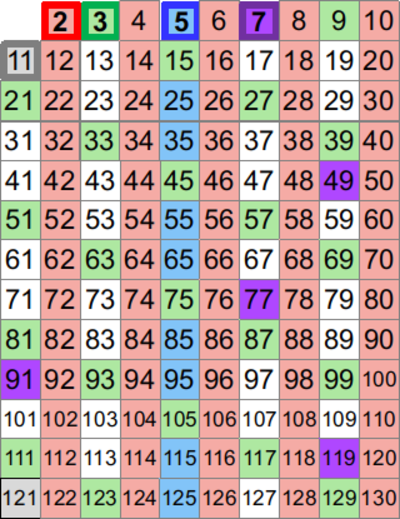

# &nbsp;

<hgroup>

<h1 style="font-size:32pt">Skaitļu teorija:<br/>
NMS Juniori 2019-09-28</h1>


<blue>Pirmskaitļi un dalāmība</blue>


</hgroup><hgroup>

<span style="color:darkgreen">**(1) Ievads**</span>  
<span>(2) [Dalāmība un dalīšana](#section-1)</span>  
<span>(3) [Dalītāju skaits](#section-2)</span>  
<span>(4) [Pirmskaitļu izvietojums](#section-3)</span>  
<span>(5) [Aritmētikas pamatteorēma](#section-4)</span>  
<span>(6) [LKD un MKD](#section-5)</span>  
<span>(7) [Bezū lemma](#section-6)</span>  
<span>(8) [Mājasdarba uzdevumi](#section-7)</span>  
<span>(9) [Kopsavilkums](#section-8)</span>


</hgroup>

::: notes

Ievērojama daļa skaitļu teorijas uzdevumu 
ir par dalāmības attiecību (viens skaitlis 
dalās/nedalās ar otru; pirmskaitlis kā skaitlis 
ar diviem naturāliem dalītājiem). Dalāmības 
attiecība ir interesanta, jo to ne vienmēr 
var izpildīt, joprojām paliekot veselo skaitļu kopā.
Dalāmības attiecība ļauj definēt pirmskaitļus 
(skaitļus, kam ir tieši divi dalītāji), dalīšanu
pirmreizinātājos, u.c.

*Par ko var veidot animācijas:*

1. Ūdens laistīšanas uzdevums un/vai "atstarošanās uzdevums" (kā ar 8L un 13L krūzēm nomērīt tieši 1L).
2. Skapīšu durvju vēršanas animācija (sk. Piemēru nr.2 jeb 19.slaidu).
3. Eratostena režģa animācija.
4. Eiklīda algoritma animācija jebkādiem skaitļiem.
5. Tipiska un vissliktākā Eiklīda algoritma ātrdarbība, rekursīvo izsaukumu skaits šajā algoritmā.


:::


# <lo-why/> why

<div class="bigWhy">
Kāpēc skaitļu dalāmībā ir praktiski izmantojamas struktūras?
</div>

<div class="smallWhy">

* Kāpēc dalāmību izmanto arī uzdevumos, kur dalīšanas nav?
* Kādas struktūras veido viena skaitļa dalītāji?   
Daudzu pēc kārtas sekojošu skaitļu dalītāji?

</div>

::: notes

* Pamatojam, ka skaitļu teoriju ir dabiski sākt ar dalāmības 
attiecības pētīšanu. 
* Viena skaitļa dalītājus viegli aprakstīt 
(galīga taisnstūrveida sistēma), bet daudzu skaitļu dalītājus
un pirmskaitļu izvietojumu krietni grūtāk raksturot.

:::


## <lo-theory/> Sasniedzamie rezultāti

* Iepazīties ar <blue>*attiecības*</blue> (*relation*) jēdzienu.
* Veidot naturālu skaitļa visu dalītāju simetriskus izkārtojumus.
* Saskaitīt naturāla skaitļa dalītājus un aprēķināt visu dalītāju
(arī dalītāju kvadrātu u.c.) summu.
* Veidot Eratostēna režģi. 
* Lietot aritmētikas pamatteorēmu un Eiklīda lemmu.
* Izmantot LKD un MKD īpašības. 
* Lietot Bezū lemmu.


# &nbsp;

<hgroup>

<h1 style="font-size:32pt">Skaitļu teorija:<br/>
NMS Juniori 2019-09-28</h1>


<blue>Pirmskaitļi un dalāmība</blue>


</hgroup><hgroup>

<span>(1) [Ievads](#section)</span>  
<span style="color:darkgreen">**(2) Dalāmība un dalīšana**</span>  
<span>(3) [Dalītāju skaits](#section-2)</span>  
<span>(4) [Pirmskaitļu izvietojums](#section-3)</span>  
<span>(5) [Aritmētikas pamatteorēma](#section-4)</span>  
<span>(6) [LKD un MKD](#section-5)</span>  
<span>(7) [Bezū lemma](#section-6)</span>  
<span>(8) [Mājasdarba uzdevumi](#section-7)</span>  
<span>(9) [Kopsavilkums](#section-8)</span>

</hgroup>

::: notes

**Kādēļ no visām darbībām jāstudē tieši dalāmība:**

* Veseli skaitļi ir datora aritmētikas pamats. 
* Veselus skaitļus vienmēr var saskaitīt, atņemt, reizināt (arī kāpināt veselās pozitīvās pakāpēs). 
* Dalīt ne vienmēr var – dalāmības attiecība ir "interesantāka".

:::


# <lo-theory/> Dalāmība un dalīšana

**Definīcija:** Vesels skaitlis $m$ 
<blue>*dalās ar*</blue> (*is divisible by*)
veselu skaitli $d \neq 0$, ja 
eksistē tāds vesels $k$, kuram 
$m = d \cdot k$.  
*Pieraksts:* $d \mid m$ (saki: "$d$ dala $m$".)  
Tad $d$ sauc par skaitļa $m$ <blue>*dalītāju*</blue>
(*divisor*). Skaitli $m$ sauc par 
skaitļa $d$ <blue>*daudzkārtni*</blue>
(*multiple*). 

::: notes

Skaitļu teorijā daudzi rezultāti tieši neatsaucas
uz skaitļu dalāmību. Piemēram, J.Lagranža 
(*Joseph-Louis Lagrange*) teorēma: 
Ikvienu naturālu skaitli var izteikt 
kā četru pilnu kvadrātu summu. 
Tomēr arī šādu rezultātu
pierādīšanai parasti lieto metodes,
kuras rodas, pētot skaitļu dalāmību. 
Interese par skaitļu dalāmību, 
par pirmskaitļiem tālu pārsniedz tiešo praktisko
lietojumu. Šī interese radījusi
svarīgus rezultātus, piemēram, par eliptiskajām līknēm
un kriptosistēmām.

Atšķirībā no saskaitīšanas, reizināšanas un 
(atļaujot negatīvos skaitļus) arī atņemšanas, 
dalīšanas operāciju ne vienmēr var izpildīt
veselos skaitļos. Par dalāmību vingrināsimies
pierakstīt arī loģiskus apgalvojumus:

* $(\forall a \in \mathbb{Z})\;a \neq 0 \Rightarrow a\;\mid\;0$.  
Saki: "Visiem $a$ no veselo skaitļu kopas: Ja $a$ nav $0$, tad $a$ dala $0$."
* $(\forall a \in \mathbb{Z})\;0 \nmid a$   
Saki: "Visiem $a$ no veselo skaitļu kopas: $0$ nedala $a$."

:::


## <lo-summary/> Dalāmības režģis

<hgroup>


</hgroup>
<hgroup style="font-size:70%">

* Ja ir augšupejošs ceļš no $a$ uz $b$, 
tad $b$ dalās ar $a$. 
* Dalāmības attiecībā "minimālais" elements ir $1$
(visi skaitļi dalās ar $1$). "Maksimālais" elements
ir $0$ (dalās ar jebkuru citu skaitli).

**Transitivitāte:** Ja $a$ dala $b$ un $b$ dala $c$, 
tad $a$ dala $c$. (Piemēram, no $15 \mid 60$ un 
$60 \mid 480$ var secināt, ka $15 \mid 480$.) 

"Transitīvais slēgums" - var zīmējumu saraibināt, 
savienojot arī izsecināmās attiecības ($1$ ar $4$ vai $8$ utt.).
Parasti tā nedara.

</hgroup>


::: notes

Dalāmības attiecība ievieš daļēju sakārtojuma 
attiecību veselo skaitļu kopā līdzīgi kā $\leq$. 
Pats "mazākais" veselais skaitlis 
šajā sakārtojumā ir $1$; 
visi pirmskaitļi ir līmeni augstāk, jo tie 
dalās ar $1$, bet $1$ ar tiem nē. 
Vēl līmeni augstāk ir visi iespējamie 
divu pirmskaitļu reizinājumi, 
ieskaitot pirmskaitļu kvadrātus. 
Starp šo līmeni un pirmskaitļu līmeni 
visur nepastāv sakārtojuma attiecība. 
Piemēram, $2 \times 3$ nav salīdzināms ar $5$ 
(tie savstarpēji cits ar citu nedalās). 
Sakārtojuma attiecību var turpināt arī 
augstākiem slāņiem (trīs, četru, utt. 
pirmskaitļu reizinājumam). Sakārtojuma attiecības 
pašā augšā atrodas skaitlis $0$, 
jo tas dalās ar jebkuru skaitli. 

Dotajā attēlā $1$ ir savienots ar $2$ un $2$ 
ir savienots ar $4$, bet nav novilkta 
šķautne no $1$ uz $4$ (kaut arī starp tiem 
pastāv sakārtojuma attiecība). Tas darīts 
vienīgi tādēļ, lai nesaraibinātu zīmējumu, 
jo dalāmības *transitivitātes* dēļ no 
$1 \mid 2$ un $2 \mid 4$ var secināt, 
ka $1 \mid 4$.

Sk. [Partially ordered sets](http://www.wikiwand.com/en/Partially_ordered_set)

:::


## <lo-summary/> Dalīšana nav dalāmība

<hgroup>

<blue>*Dalīšana*</blue> (*division*) ir 
aritmētiska operācija. Dalot divus 
veselus skaitļus, rezultāts ir 
vesels vai racionāls. 

**Piemērs:** Dalīšanas 
rezultāts $18/6$ ir skaitlis $3$, 
bet $17/6$ rezultāts ir $2\frac{5}{6}$. 

</hgroup>
<hgroup>

<blue>*Dalāmība*</blue> ir loģiska
attiecība - tās rezultāts ir 
patiesuma vērtība 
(`patiess` jeb `true` vai arī 
`aplams` jeb `false`). 

**Piemērs:** $18 \mid 6$ rezultāts ir
`true`. Bet $17 \mid 6$ rezultāts ir 
`false`. 

</hgroup>


::: notes

Dalīšanai kā aritmētiskai operācijai ir vairāki simboliski apzīmējumi. Pie tam veselu skaitļu dalīšanas rezultāts var parādīties vairākos veidos:

1. Dalīšana, iegūstot parasto vai jaukto daļskaitli: $17:3 = \frac{17}{3} = 5$
2. Dalīšana, iegūstot noapaļotu decimāldaļu: $17:3 = 5.6666667$
3. Dalīšana, iegūstot periodisku decimāldaļu: $17:3 = 5.(6)$ (lasa "pieci komats periodā seši")
4. Dalīšana, iegūstot dalījumu veselos skaitļos un atlikumu:  $17:3 = 5\;\;\mbox{atl.}\;\;2$

**Dalāmības īpašības:**

1. Ja $a \mid b$ un $a \mid c$, tad $a \mid b+c$ un $a \mid b - c$;
2. Ja $a \mid b$, tad $a \mid b \cdot k$;
3. Ja $a \mid b_1, a \mid b_2, \ldots, a \mid b_n$, tad $a \mid (b_1k_1 + b_2k_2 + \ldots + b_nk_n)$; 
4. Ja $a \mid b$ un $b \mid c$, tad $a \mid c$;
5. Ja $a \mid x$ un $b \mid y$, tad $ab \mid xy$; 
6. Ja $a \mid b$ un $b \mid a$, tad $a = b$.

::: 


## <lo-summary/> Dalīšana ar atlikumu

<hgroup>

**Definīcija:** Dalīt veselu skaitli $m$ ar $d$ 
ar atlikumu nozīmē izteikt $m = q\cdot d + r$, kur
dalījuma veselā daļa $q$
un atlikums $r$ ir veseli skaitļi, turklāt 
<blue>*atlikums*</blue> (*remainder*) 
pieņem kādu no vērtībām:
$r \in \{ 0, 1, \ldots, n-1 \}$. 

**Piemērs:** Dalot ar $3$ iespējamie atlikumi 
ir <red>$\{ 0,1,2 \}$</red>. 

</hgroup>
<hgroup>

<!--

-->

```console
Python 3.6.7 (...) 
>>> 15 % 3
0
>>> 17 % 3
2
>>> (-17) % 3
1
>>> (-17) // 3
-6
```

$$\left\{
\begin{array}{l}
15 = 5 \cdot 3 + \color{#F00}{0}\\
17 = 5 \cdot 3 + \color{#F00}{2}\\
-17 = (-6) \cdot 3 + \color{#F00}{1}
\end{array}
\right.$$


</hgroup>


::: notes

Arī negatīviem skaitļiem iespējama dalīšana ar atlikumu. 
Jāņem vērā, ka atlikumi nemēdz būt negatīvi. 

Diemžēl daudzās programmēšanas valodās 
*atlikuma operators*, ja to izmanto negatīviem skaitļiem,
dod negatīvus atlikumus. Ar to tas var 
atšķirties no atlikuma
matemātiskas definīcijas. 
Atlikums, dalot ar $n$, vienmēr ir skaitlis 
starp $0$ un $n-1$. 

:::


# <lo-sample/> Uzdevums NT.JUN01.1

Rindā novietoti $30$ slēdži ar numuriem no $1$ līdz $30$. 
Katrs slēdzis var būt ieslēgts vai izslēgts; sākumā tie visi ir izslēgti. 
Pirmajā solī pārslēdz pretējā stāvoklī visus slēdžus, kuru 
numuri dalās ar $1$. Otrajā solī pārslēdz visus tos, kuru 
numuri dalās ar $2$. Un tā tālāk - līdz 30.solī pārslēdz pretējā
stāvoklī slēdžus, kuru numuri dalās ar $30$.  
Cik daudzi slēdži kļūst ieslēgti pēc visu soļu pabeigšanas?

## <lo-reading/> Uzdevums NT.JUN01.1

<hgroup>

* Ko nozīmē "pārslēgt pretējā stāvoklī"?
* Cik daudzi soļi pārslēdz slēdzi ar konkrētu numuru $n$?
* Vai atbildē jānorāda slēdžu skaits, kas mainīja (vai arī kas nemainīja) 
savu stāvokli? 
* Tas iestājas pēc soļu skaita, kas ir pāra vai nepāra skaitlis?

</hgroup>
<hgroup>


</hgroup>


## <lo-soln/> Uzdevums NT.JUN01.1

<table>
<tr>
<th>1</th><th>2</th><th>3</th><th>4</th><th>5</th><th>6</th><th>7</th><th>8</th><th>9</th><th>10</th>
<th>11</th><th>12</th><th>13</th><th>14</th><th>15</th><th>16</th><th>...</th><th>30</th>
</tr>
<tr>
<td>1</td><td>1</td><td>1</td><td>1</td><td>1</td><td>1</td><td>1</td><td>1</td><td>1</td><td>1</td>
<td>1</td><td>1</td><td>1</td><td>1</td><td>1</td><td>1</td><td>...</td><td>1</td>
</tr>
<tr>
<td>&nbsp;</td><td>2</td><td>3</td><td>2</td><td>5</td><td>2</td><td>7</td><td>2</td><td>3</td><td>2</td>
<td>11</td><td>2</td><td>13</td><td>2</td><td>3</td><td>2</td><td>...</td><td>2</td>
</tr>
<tr>
<td>&nbsp;</td><td>&nbsp;</td><td>&nbsp;</td><td>4</td><td>&nbsp;</td>
<td>3</td><td>&nbsp;</td><td>4</td><td>9</td><td>5</td>
<td>&nbsp;</td><td>3</td><td>&nbsp;</td><td>7</td><td>5</td>
<td>4</td><td>...</td><td>3</td>
</tr>
<tr>
<td>&nbsp;</td><td>&nbsp;</td><td>&nbsp;</td><td>&nbsp;</td><td>&nbsp;</td>
<td>6</td><td>&nbsp;</td><td>8</td><td>&nbsp;</td><td>10</td>
<td>&nbsp;</td><td>4</td><td>&nbsp;</td><td>14</td><td>15</td>
<td>8</td><td>...</td><td>5</td>
</tr>
<tr>
<td>&nbsp;</td><td>&nbsp;</td><td>&nbsp;</td><td>&nbsp;</td><td>&nbsp;</td>
<td>&nbsp;</td><td>&nbsp;</td><td>&nbsp;</td><td>&nbsp;</td><td>&nbsp;</td>
<td>&nbsp;</td><td>6</td><td>&nbsp;</td><td>&nbsp;</td><td>&nbsp;</td>
<td>16</td><td>...</td><td>6</td>
</tr>
<tr>
<td>&nbsp;</td><td>&nbsp;</td><td>&nbsp;</td><td>&nbsp;</td><td>&nbsp;</td>
<td>&nbsp;</td><td>&nbsp;</td><td>&nbsp;</td><td>&nbsp;</td><td>&nbsp;</td>
<td>&nbsp;</td><td>12</td><td>&nbsp;</td><td>&nbsp;</td><td>&nbsp;</td>
<td>&nbsp;</td><td>...</td><td>10</td>
</tr>
<tr>
<td>&nbsp;</td><td>&nbsp;</td><td>&nbsp;</td><td>&nbsp;</td><td>&nbsp;</td>
<td>&nbsp;</td><td>&nbsp;</td><td>&nbsp;</td><td>&nbsp;</td><td>&nbsp;</td>
<td>&nbsp;</td><td>&nbsp;</td><td>&nbsp;</td><td>&nbsp;</td><td>&nbsp;</td>
<td>&nbsp;</td><td>...</td><td>15</td>
</tr>
<tr>
<td>&nbsp;</td><td>&nbsp;</td><td>&nbsp;</td><td>&nbsp;</td><td>&nbsp;</td>
<td>&nbsp;</td><td>&nbsp;</td><td>&nbsp;</td><td>&nbsp;</td><td>&nbsp;</td>
<td>&nbsp;</td><td>&nbsp;</td><td>&nbsp;</td><td>&nbsp;</td><td>&nbsp;</td>
<td>&nbsp;</td><td>...</td><td>30</td>
</tr>
</table>

Kuriem no skaitļiem ir nepāru skaits dalītāju?


::: notes

Mēģiniet izvirzīt hipotēzes un tās pamatot.


# &nbsp;

<hgroup>

<h1 style="font-size:32pt">Skaitļu teorija:<br/>
NMS Juniori 2019-09-28</h1>


<blue>Pirmskaitļi un dalāmība</blue>


</hgroup><hgroup>

<span>(1) [Ievads](#section)</span>  
<span>(2) [Dalāmība un dalīšana](#section-1)</span>  
<span style="color:darkgreen">**(3) Dalītāju skaits**</span>  
<span>(4) [Pirmskaitļu izvietojums](#section-3)</span>  
<span>(5) [Aritmētikas pamatteorēma](#section-4)</span>  
<span>(6) [LKD un MKD](#section-5)</span>  
<span>(7) [Bezū lemma](#section-6)</span>  
<span>(8) [Mājasdarba uzdevumi](#section-7)</span>  
<span>(9) [Kopsavilkums](#section-8)</span>


</hgroup>

::: notes

Dalītāju izvietojums, skaits, režģis. Izrādās, ka fiksēta 
skaitļa dalītāji veido interesantu, simetrisku struktūru, 
kuru var attēlot kā režģi. Režģa aplūkošana ļauj ātri noskaidrot 
dalītāju skaitu un citas to kopīgās īpašības. Režģa struktūra noderēs arī, 
lai ģeometriski iztēlotos, teiksim, lielāko kopīgo dalītāju diviem skaitļiem.

:::


# <lo-theory/> Dalītāju apkopojumu funkcijas

Skaitļa dalītājus mēdz dažādi apkopot, piemēram, 
uzzinot to skaitu, summu vai augstāku pakāpju summu.

**Definīcija:** Katram naturālam skaitlim $n$ definējam 
funkcijas $\sigma_0(n)$, $\sigma_1(n)$ un $\sigma_2(n)$ 
ar šādām vienādībām: 

$$\begin{array}{rcl}
\sigma_0(n) & = & \sum\limits_{d \mid n} 1,\\
\sigma_1(n) & = & \sum\limits_{d \mid n} d,\\
\sigma_2(n) & = & \sum\limits_{d \mid n} d^2,
\end{array}$$

## <lo-summamry/> Piemēri ar n=60

$$\sigma_0(60) = \left| \{ 1,2,3,4,5,6,10,12,15,20,30,60 \} \right| = 12.$$
$$\sigma_1(60) = 1 + 2 + 3 + 4 + 5 + 6 + 10 + 12 + $$
$$ + 15 + 20 + 30 + 60 = 168.$$
$$\sigma_2(60) = 1^2 + 2^2 + 3^2 + 4^2 + 5^2 + 6^2 + 10^2 + 12^2$$
$$ + 15^2 + 20^2 + 30^2 + 60^2  = 5460.$$


## <lo-summary/> Dalītāji skaitlim 60

<hgroup>


</hgroup>
<hgroup>

* Dalītāju skaitu var atrast, izmantojot *reizināšanas likumu*. 
* Zināms, ka $60 = 2^23^15^1$.
* Katrs skaitļa $60$ dalītājs izsakāms $2^a3^b5^c$, 
kur $a \in \{ 0,1,2\}$, $b \in \{ 0,1 \}$, $c \in \{ 0,1 \}$. 
* Sareizinām elementu skaitu: $3 \cdot 2 \cdot 2 = 12$.

</hgroup>


## <lo-sample/> NT.JUN01.2

Atrast mazāko naturālo skaitli, kam ir tieši 
$16$ dalītāji. 

## <lo-reading/> NT.JUN01.2

Uzdevumā netieši pateikts, ka naturāls skaitlis 
ar tieši $16$ dalītājiem vispār eksistē. 
Vienīgi tad ir jēga meklēt mazāko no šādiem 
skaitļiem.

**Apgalvojums:** Katram naturālam $n$ eksistē 
bezgalīgi daudzi skaitļi $M$, kuriem ir tieši 
$n$ pozitīvi dalītāji.  

*Ieteikums:* Var izvēlēties $M = p^{n-1}$, kur 
$p$ ir jebkurš pirmskaitlis.

::: notes

Apgalvojums ir triviāls: Lai atrastu skaitli, 
kuram ir tieši $n$ pozitīvi dalītāji, izvēlamies
skaitli $p^{n-1}$, kur $p$ ir jebkurš pirmskaitlis.
Protams, varētu būt citi atrisinājumi, 
kuri nav pirmskaitļu pakāpes. 
Uzdevums ir atrast vismazāko no tiem.

::: 


# <lo-quiz/> Jautājums Nr.1

Naturālam skaitlim $n$ ir tieši $125$ naturāli 
dalītāji (ieskaitot $1$ un pašu $n$). 
Kādu visaugstākās pakāpes sakni noteikti var izvilkt no 
$n$, iegūstot naturālu rezultātu? 

*Ierakstīt naturālu skaitli (saknes pakāpi) vai 
skaitli $1$, ja neviena augstākas pakāpes sakne 
$\sqrt[k]{n}$ ($k>1$) nav garantēti vesela:* _____


## <lo-quiz/> Jautājums Nr.1: Atrisinājums

<div style="font-size:100%">

$125$ var izteikt kā reizinājumu 
vairākiem skaitļiem (kas
pārsniedz $1$) sekojošos veidos:

* $125 = 124+1$.
* $125 = 25 \cdot 5 = (24 + 1) \cdot (4+1)$.
* $125 = 5 \cdot 5 \cdot 5 = (4+1) \cdot (4+1) \cdot (4+1)$.

Tādēļ skaitli $n$ var sadalīt pirmreizinātājos 
vienā no sekojošiem veidiem: 

$$n = p^{124},\;\;n = p^{24}q^4\;\;\text{vai}\;\;n = p^{4}q^4r^4,$$

kur $p,q,r$ ir pirmskaitļi. Visos gadījumos var izvilkt 4.pakāpes sakni.

</div>


# &nbsp;

<hgroup>

<h1 style="font-size:32pt">Skaitļu teorija:<br/>
NMS Juniori 2019-09-28</h1>


<blue>Pirmskaitļi un dalāmība</blue>


</hgroup><hgroup>

<span>(1) [Ievads](#section)</span>  
<span>(2) [Dalāmība un dalīšana](#section-1)</span>  
<span>(3) [Dalītāju skaits](#section-2)</span>  
<span style="color:darkgreen">**(4) Pirmskaitļu izvietojums**</span>  
<span>(5) [Aritmētikas pamatteorēma](#section-4)</span>  
<span>(6) [LKD un MKD](#section-5)</span>  
<span>(7) [Bezū lemma](#section-6)</span>  
<span>(8) [Mājasdarba uzdevumi](#section-7)</span>  
<span>(9) [Kopsavilkums](#section-8)</span>


</hgroup>

::: notes

Šajā tēmā pamatojam, ka pirmskaitļu ir bezgalīgi daudz, apsveram iespējas tos algoritmiski atrast (Eratostena režģis, daži mūsdienu algoritmi). Un arī apskatām dažus sacensību uzdevumus, kuri nepārprotami iedvesmojušies no šīs pirmskaitļu teorijas.


Pirmskaitļu izvietojums nelielos intervālos 
var izskatīties juceklīgs. Tomēr garākos 
intervālos to blīvums labi tuvināms ar 
varbūtisku modeli. Vienkāršoti sakot, 
lieliem naturāliem $n$, varbūtība, ka $n$ 
ir pirmskaitlis, ir apgriezti 
proporcionāla skaitļa $n$ naturālajam logaritmam.

:::


# <lo-theory/> Pirmskaitļu jēdziens

<hgroup style="font-size:90%">

**Definīcija:** Naturālu skaitli $p>1$ 
sauc par <blue>*pirmskaitli*</blue>
(*prime number*), ja vienīgie tā dalītāji ir 
$1$ un $p$. 

Naturālus skaitļus $n>1$, kas nav 
pirmskaitļi, sauc par <blue>*saliktiem
skaitļiem*</blue> (*composite
number*). 

Skaitlis $1$ nav ne pirmskaitlis, ne 
salikts skaitlis.

</hgroup>
<hgroup>

Intervālā $[1;100]$ ir $25$ pirmskaitļi:

<table>
<tr>
<td>2</td><td>3</td><td>5</td><td>7</td><td>11</td>
</tr>
<tr>
<td>13</td><td>17</td><td>19</td><td>23</td><td>29</td>
</tr>
<tr>
<td>31</td><td>37</td><td>41</td><td>43</td><td>47</td>
</tr>
<tr>
<td>53</td><td>59</td><td>61</td><td>67</td><td>71</td>
</tr>
<tr>
<td>73</td><td>79</td><td>83</td><td>89</td><td>97</td>
</tr>
</table>

::: notes

Skaitlis $1$ nav ne pirmskaitlis, ne arī salikts skaitlis. Tas ir *vienības elements* naturālu skaitļu reizināšanā. (Veselo skaitļu pasaulē $-1$ ir otrs vienības elements.)

:::

## <lo-summary/> Eratostena režģis

<hgroup>



</hgroup>
<hgroup style="font-size:70%">

Eratostena process notiek vairākos soļos. 

* Skaitļu tabuliņā atzīmē mazāko skaitli 
(<red>pirmskaitli $2$</red>) un visus
tā dalāmos/daudzkārtņus izsvītro. 
* Atzīmē mazāko neizsvītroto 
(<green>pirmskaitli $3$</green>) un 
visus tā daudzkārtņus izsvītro.
* Atzīmē mazāko neizsvītroto 
(<blue>pirmskaitli $5$</blue>) un 
visus tā daudzkārtņus izsvītro.

**Apgalvojums:** Minētais process nekad 
nebeigsies; pēc katra soļa paliks 
neizsvītroti skaitļi. 

</hgroup>

::: notes

Vai Eratostena režģis ir efektīvs algoritms, 
ja jāatrod visi pirmskaitļi intervālā $[1,N]$? 

Eratostens (276. g. p.m.ē –194. g. p.m.ē) 
pazīstams arī ar to, ka diezgan precīzi 
noteicis Zemeslodes apkārtmēru. 
Viņa eksperiments balstījās uz novērojumu, 
ka divās Ēģiptes pilsētās, kas abas atrodas 
uz tā paša meridiāna (mūsdienās tās 
sauc Asuāna un Aleksandrija), 
ir atšķirīgs Saules augstums virs horizonta 
vasaras saulgriežos. Asuāna atrodas 
uz Ziemeļu tropiskā loka – Saule tur 
nonāk tieši zenītā, savukārt Aleksandrijā 
tā pat saulgriežos atrodas 
noteiktā leņķī no zenīta – un leņķi var izmērīt, 
piemēram, kā vertikāla staba ēnas garumu. 
Attālums no Asuānas līdz Aleksandrijai 
Eratostenam bija zināms; Zemeslodes apkārtmēru 
tad noteica ar trigonometrisku sakarību

Eratostena režģis ir dinamiskās programmēšanas 
piemērs. Šie algoritmi aizpilda apjomīgas 
datu struktūras (piemēram, masīvus, tabulas). 
Dinamiskā programmēšana ir efektīva, piemēram, 
kāpinot skaitļus lielās pakāpēs (atceroties agrāk 
iegūtus starprezultātus), vai arī, aprēķinot 
Fibonači skaitļus. 

Lai noskaidrotu, vai konkrēts skaitlis $n$
ir pirmskaitlis, Eratostena režģis nav praktisks
algoritms (jo tas meklē visus pirmskaitļus, kas
par to mazāki).

:::


# <lo-quiz/> Jautājums Nr.2

Kādā no Eratostena režģa veidošanas 
soļiem tiek izsvītroti visi pirmskaitļa $13$
daudzkārtņi. Kurš no šajā solī 
izsvītrotajiem skaitļiem ir pirmais starp tiem, 
kuru izsvītro pirmoreiz (kurš nav izsvītrots kādā 
no agrākiem soļiem).

*Ierakstīt naturālu skaitli:* _____

## <lo-quiz/> Jautājums Nr.2: Atrisinājums

Skaitļa $13$ daudzkārtņi, kas tiek izsvītroti 
ir $26,39,52,\ldots$. Mazākais no šiem skaitļiem, 
kas nedalās ar nevienu citu pirmskaitli $p < 13$
ir $13^2 = 169$. Tam seko arī $13 \cdot 17$ un 
daudzi citi piemēri, kurus šajā solī izsvītro
pirmoreiz.


# <lo-yellow/> Ulama spirāle

<hgroup>


</hgroup>
<hgroup>

Ulama spirāli veido, uz rūtiņu papīra zīmējot 
attinošos spirāli, sākot ar skaitli $1$. 
Pirmskaitļus, atzīmē ar melniem punktiņiem. 

Pirmskaitļi, kaut arī neveido viegli 
paredzamas likumsakarības, sablīvējas
uz dažām taisnēm.

</hgroup>

## <lo-yellow/> Formula pirmskaitļu iegūšanai

<hgroup>

Bijuši vairāki mēģinājumi uzrakstīt 
kompaktu formulu (bez `for` cikliem 
vai citiem programmēšanas paņēmieniem), kuras
visas vērtības ir pirmskaitļi. 

**Definīcija:** Par $n$-to Fermā skaitli 
($n \geq 0$) sauc $F_n = 2^{2^n}+1$. 

</hgroup>
<hgroup style="font-size:70%">

$F_0,F_1,F_2,F_3,F_4$ ir vienīgie
zināmie pirmskaitļi: 

* $F_0 = 2^{2^0} + 1 = 2^1 + 1 = 3$,
* $F_1 = 2^{2^1} + 1 = 2^2 + 1 = 5$,
* $F_2 = 2^{2^2} + 1 = 2^4 + 1 = 17$,
* $F_3 = 2^{2^3} + 1 = 2^8 + 1 = 257$,
* $F_4 = 2^{2^4} + 1 = 2^{16} + 1 = 65537$.

Bet jau $F_5 = 2^{2^5} + 1 = 2^{32} + 1 =$
$=4\,294\,967\,297 = 641 \cdot 6\,700\,417$ nav pirmskaitlis.

::: notes

Izņemot pirmos 5 Fermā skaitļus 
(no $F_0$ līdz $F_4$), nav zināms neviens cits
pirmskaitlis. Ir pilnībā sadalīti pirmreizinātājos 
pirmie 12 šādi skaitļi – no $F_0$ līdz $F_11$. 
Daudziem citiem ir zināmi daži dalītāji; 
atklāto/zināmo dalītāju skaits tiek 
regulāri papildināts.

:::

## <lo-yellow/> Nenopietns piemērs

Polinoms $f(x) = x^2 + x + 41$ 
visiem argumentiem $x = 0,1,\ldots,39$
pieņem vērtības, kas ir pirmskaitļi.

Šī polinoma vērtību vidū arī lielākiem $x$
ir neparasti  daudz pirmskaitļu. 
Ar modulāro aritmētiku iespējams
pamatot, ka $x^2 + x + 41$ (kur $x \in \mathbb{N}$) 
nevar dalīties
ne ar vienu pirmskaitli $p < 41$. 


# <lo-theory/> Pirmskaitļu skaitīšanas funkcija

<hgroup>


</hgroup>
<hgroup style="font-size:70%">

**Definīcija:** Ar $\pi(x)$ apzīmējam 
<blue>*pirmskaitļu skaitīšanas funkciju*</blue>
(*prime-counting function*): Katram 
reālam skaitlim $x \in \mathbb{R}$, 
$\pi(x)$ izsaka pirmskaitļu $p_i$ skaitu, 
kuriem $p_i \leq x$. 

$\pi(x)$ definīcijas apgabals ir $\mathbb{R}$, 
vērtību apgabals ir $\mathbb{Z}_{0+}$ - visi 
veselie nenegatīvie skaitļi. 

$\pi(1.99) = 0$, $\pi(2) = 1$.  
$\pi(3) = \pi(3.14) = \pi(4.99) = 2$.  
$\pi(100) = 25$. 

</hgroup>


## <lo-theory/> Skaitlis e

**Definīcija:** Par <blue>*naturālo 
logaritmu bāzi*</blue> jeb skaitli $e$ sauksim 
konstanti $e = 2.7182818284\ldots$, uz kuru 
tiecas bezgalīgā summa:
$$e = \frac{1}{0!} + \frac{1}{1!} + \frac{1}{2!} +
\frac{1}{3!} + \frac{1}{4!} + \ldots = $$
$$= 1 + 1 + \frac{1}{2} + \frac{1}{6} + \frac{1}{24} + 
\ldots.$$

## <lo-theory/> Naturālais logaritms

<hgroup>


</hgroup>
<hgroup>

**Definīcija:** Par <blue>*naturālo logaritmu*</blue>
saucam logaritma funkciju ar bāzi $e = 2.7182818284\ldots$:
$$\ln x = \log_{e} x.$$

$y = \ln x$ ir 
augoša funkcija, definēta visiem $x > 0$.   
Naturālais logaritms ir īpašs ar to, ka 
tā grafiks $x$ asi krusto $45^{\circ}$ leņķī.

</hgroup>


## <lo-summary/> Mazākie 101-ciparu pirmskaitļi


* "Varbūtība", ka skaitlis, kas tuvu $10^{100}$ ir 
pirmskaitlis, apgriezti proporcionāla 
naturālajam logaritmam: $\frac{1}{\ln 10^{100}}$. 

* Vidēji $1000$ skaitļu intervālā 
netālu no $10^{100}$ pirmskaitļu skaits:
$$1000 \cdot \frac{1}{\ln 10^{100}} = 
1000 \cdot \frac{1}{100 \ln 10} \approx 
\frac{10}{\ln 10} = 4.34.$$

## <lo-summary/> Mazākie 101-ciparu pirmskaitļi

*Piemērs:* Intervālā 
${\displaystyle \left[ 10^{100},10^{100} + 1000 \right)}$
ir tikai $2$ pirmskaitļi: 
$10^{100} + 267$ un $10^{100} + 949$.

Garākos intervālos pirmskaitļu īpatsvars
maz atšķiras no prognozes ar apgriezto naturālo 
logaritmu (t.i. vidēji 4.34 pirmskaitļi
uz katru tūkstoti): 

<table>
<tr><th>Intervāls</th><th>Pirmskaitļu skaits</th><th>Prognoze</th></tr>
<tr><td>$[10^{100},10^{100} + 10^5)$</td>
<td>407</td><td>434.2945</td></tr>
<tr><td>$[10^{100},10^{100} + 10^6)$</td>
<td>4248</td><td>4342.945</td></tr>
<tr><td>$[10^{100},10^{100} + 10^7)$</td>
<td>43271</td><td>43429.45</td></tr>
</table>

::: notes

Intervālā $[x,x + \Delta x)$ ir svarīgi, 
ka intervāla garums $\Delta x$
ir daudz mazāks par $x$ (citādi 
pirmskaitļu blīvums intervāla iekšienē būtiski mainās). 
No otras puses, $\Delta x$ jābūt pietiekoši 
lielam, lai pirmskaitļu skaitu 
mazāk iespaidotu nejaušības.

:::


# &nbsp;

<hgroup>

<h1 style="font-size:32pt">Skaitļu teorija:<br/>
NMS Juniori 2019-09-28</h1>


<blue>Pirmskaitļi un dalāmība</blue>


</hgroup><hgroup>

<span>(1) [Ievads](#section)</span>  
<span>(2) [Dalāmība un dalīšana](#section-1)</span>  
<span>(3) [Dalītāju skaits](#section-2)</span>  
<span>(4) [Pirmskaitļu izvietojums](#section-3)</span>  
<span style="color:darkgreen">**(5) Aritmētikas pamatteorēma**</span>  
<span>(6) [LKD un MKD](#section-5)</span>  
<span>(7) [Bezū lemma](#section-6)</span>  
<span>(8) [Mājasdarba uzdevumi](#section-7)</span>  
<span>(9) [Kopsavilkums](#section-8)</span>


</hgroup>


# &nbsp;

<hgroup>

<h1 style="font-size:32pt">Skaitļu teorija:<br/>
NMS Juniori 2019-09-28</h1>


<blue>Pirmskaitļi un dalāmība</blue>


</hgroup><hgroup>

<span>(1) [Ievads](#section)</span>  
<span>(2) [Dalāmība un dalīšana](#section-1)</span>  
<span>(3) [Dalītāju skaits](#section-2)</span>  
<span>(4) [Pirmskaitļu izvietojums](#section-3)</span>  
<span>(5) [Aritmētikas pamatteorēma](#section-4)</span>  
<span style="color:darkgreen">**(6) LKD un MKD**</span>  
<span>(7) [Bezū lemma](#section-6)</span>  
<span>(8) [Mājasdarba uzdevumi](#section-7)</span>  
<span>(9) [Kopsavilkums](#section-8)</span>


</hgroup>


# &nbsp;

<hgroup>

<h1 style="font-size:32pt">Skaitļu teorija:<br/>
NMS Juniori 2019-09-28</h1>


<blue>Pirmskaitļi un dalāmība</blue>


</hgroup><hgroup>

<span>(1) [Ievads](#section)</span>  
<span>(2) [Dalāmība un dalīšana](#section-1)</span>  
<span>(3) [Dalītāju skaits](#section-2)</span>  
<span>(4) [Pirmskaitļu izvietojums](#section-3)</span>  
<span>(5) [Aritmētikas pamatteorēma](#section-4)</span>  
<span>(6) [LKD un MKD](#section-5)</span>  
<span style="color:darkgreen">**(7) Bezū lemma**</span>  
<span>(8) [Mājasdarba uzdevumi](#section-7)</span>  
<span>(9) [Kopsavilkums](#section-8)</span>


</hgroup>


# &nbsp;

<hgroup>

<h1 style="font-size:32pt">Skaitļu teorija:<br/>
NMS Juniori 2019-09-28</h1>


<blue>Pirmskaitļi un dalāmība</blue>


</hgroup><hgroup>

<span>(1) [Ievads](#section)</span>  
<span>(2) [Dalāmība un dalīšana](#section-1)</span>  
<span>(3) [Dalītāju skaits](#section-2)</span>  
<span>(4) [Pirmskaitļu izvietojums](#section-3)</span>  
<span>(5) [Aritmētikas pamatteorēma](#section-4)</span>  
<span>(6) [LKD un MKD](#section-5)</span>  
<span>(7) [Bezū lemma](#section-6)</span>  
<span style="color:darkgreen">**(8) Mājasdarba uzdevumi**</span>  
<span>(9) [Kopsavilkums](#section-8)</span>


</hgroup>


# <lo-sample/> NT.JUN01.MD1

Dota kopa $S = \{ 105,106,\ldots,210 \}$. Noteikt mazāko 
naturālo $n$ vērtību, ka, izvēloties jebkuru $n$ skaitļu 
apakškopu $T$ no kopas $S$, tajā būs vismaz divi skaitļi, kuri nav 
savstarpēji pirmskaitļi.


## <lo-reading/> NT.JUN01.MD1

* Kurā kopā meklējam skaitļus, kuri nav savstarpēji pirmskaitļi? 
* Kas notiek, ja izraudzītā kopa satur ļoti nedaudzus skaitļus 
(divus, trīs, četrus)? Ja tā satur gandrīz visus kopas $S$ elementus?
* Ja $n$ ir mazākā vērtība, kas apmierina uzdevuma nosacījumu, 
ko var apgalvot par vēl mazāku skaitli: $n-1$? Kādu īpašību tas apmierina?


# <lo-sample/> NT.JUN01.MD2

Visiem veseliem pozitīviem skaitļiem $m > n$ pierādīt, ka 
$$\mbox{MKD}(m,n) + \mbox{MKD}(m+1,n+1) > \frac{2mn}{\sqrt{m-n}}.$$


## <lo-strategies/> NT.JUN01.MD2

* Vai prasība $m > n$ ir būtiska? Vai bez tās šāda veida nevienādība pārstāj
būt spēkā?
* Kas notiek robežgadījumos: Ja viens no skaitļiem ir $1$? Ja $n, m$ 
un arī $m+1,n+1$ ir savstarpēji pirmskaitļi? Ja $m = 2n$?
* Kuras nevienādības mums atgādina nevienādība ar kvadrātsakni?


# <lo-sample/> NT.JUN01.MD3

Vai eksistē bezgalīga 
stingri augoša naturālu skaitļu virkne $a_1 < a_2 < a_3 <\ldots$, 
ka jebkuram fiksētam naturālam skaitlim $a$ virknē $a_1+a < a_2+a < a_3 + a,\ldots$ 
ir tikai galīgs skaits pirmskaitļu? 


# <lo-sample/> NT.JUN01.MD4

Pierādīt, ka virkne $1,11,111,\ldots$ satur bezgalīgu apakšvirkni, 
kuras katri divi locekļi ir savstarpēji pirmskaitļi.


# &nbsp;

<hgroup>

<h1 style="font-size:32pt">Skaitļu teorija:<br/>
NMS Juniori 2019-09-28</h1>


<blue>Pirmskaitļi un dalāmība</blue>


</hgroup><hgroup>

<span>(1) [Ievads](#section)</span>  
<span>(2) [Dalāmība un dalīšana](#section-1)</span>  
<span>(3) [Dalītāju skaits](#section-2)</span>  
<span>(4) [Pirmskaitļu izvietojums](#section-3)</span>  
<span>(5) [Aritmētikas pamatteorēma](#section-4)</span>  
<span>(6) [LKD un MKD](#section-5)</span>  
<span>(7) [Bezū lemma](#section-6)</span>  
<span>(8) [Mājasdarba uzdevumi](#section-7)</span>  
<span style="color:darkgreen">**(9) Kopsavilkums**</span>


</hgroup>

# <lo-theory/> Ko darījām šajā nodarbībā?

1. Lietojām dalāmības attiecības īpašības un atradām naturālu skaitļu dalītāju skaitu. 
2. Izmantojām skaitļa viennozīmīgu dalījumu pirmreizinātājos. 
3. Definējām lielāko kopīgo dalītāju (LKD) un mazāko kopīgo dalāmo (MKD), 
to īpašības un atrašanas metodes.


# <lo-theory/> Atsauces

1. T.Andreescu, D.Andrica, Z.Feng. 104 Number Theory Problems. Birkhäuser. 


