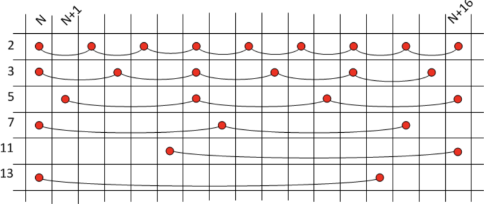
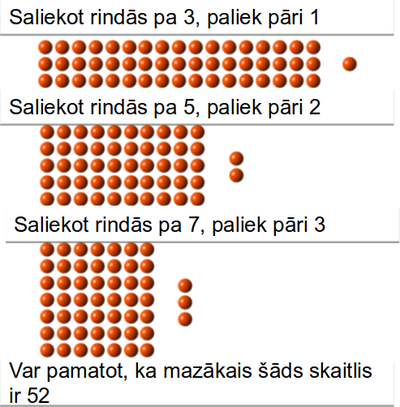

# &nbsp;

<hgroup>

<h1 style="font-size:32pt">Skaitļu teorija: 
NMS Juniori 2019-12-14</h1>

<blue>3.nodaļa: Ķīniešu atlikumu teorēma</blue>

</hgroup><hgroup style="font-size:70%">

**(1) Ievads**  
(2) [Bezū identitāte kā vienādojums](#section-1)  
(3) [Lineāra kongruence ar 1 mainīgo](#section-2)  
(4) [Ķīniešu atlikumu teorēma](#section-3)  
(5) [Algoritms moduļa atrašanai](#section-4)  
(6) [Skaitļi ar speciālām īpašībām](#section-5)  
(7) [Reducēšana uz p pakāpēm](#section-6)  
(8) [Fibonači virknes atlikumu periodi](#section-7)  
(9) [Tipisks piemērs](#section-8)  
(10) [Mājasdarba uzdevumi](#section-9)  
(11) [Kopsavilkums](#section-10)

</hgroup>

::: notes

Šajā nodaļā aplūkojam vairāku periodisku procesu pārklāšanos, 
ja to periodi ir dažādi.
Risinām kongruenču sistēmas pa daļām; 
ievietojam agrāk atrastus risinājumus nākamajās. 
Šos periodiskos procesus izskaidro ķīniešu 
atlikumu teorēma.

:::

# <lo-why/> why

Kāpēc vienlaikus jāapmierina kongruences pēc dažādiem moduļiem?

* Kāpēc reizēm pietiek zināt, ka skaitlis eksistē, pat neatrodot to?
* Kāpēc daudzās teorēmās aplūko kongruences vienīgi pēc pirmskaitļu 
vai to pakāpju moduļiem?

::: notes

Nekonstruktīvi eksistences pierādījumi bieži ir pietiekami. Kaut arī ķīniešu 
atlikumu teorēma ļauj konstruēt (bieži vien ļoti lielos) skaitļus, kas rodas, 
apvienojot vairākas kongruences vienā. 

:::

## <lo-theory/> Sasniedzamie rezultāti

* Risināt Bezū identitāti pret $x,y$. 
* Risināt jebkuru lineāru kongruenci. 
* Vispārināt 1 mainīgā kongruenci uz kongruenču sistēmu. 
* Aprakstīt tās atrisinājumus, ja moduļi ir 
savstarpēji pirmskaitļi (un apzināties, kas mainās, ja nav). 
* Lietot Ķīniešu atlikumu teorēmu, pamatojot skaitļu 
eksistenci, kam ir speciālas īpašības. 
* Lietot Ķīniešu atlikumu teorēmu saliktu moduļu dekonstrukcijai.
* Aplūkot lietojumus rekurenti definētām virknēm
(eksponentfunkcija, Fibonači virkne u.c.)

# &nbsp;

<hgroup>

<h1 style="font-size:32pt">Skaitļu teorija: 
NMS Juniori 2019-12-14</h1>

<blue>3.nodaļa: Ķīniešu atlikumu teorēma</blue>

</hgroup><hgroup style="font-size:70%">

(1) [Ievads](#section)  
**(2) Bezū identitāte kā vienādojums**  
(3) [Lineāra kongruence ar 1 mainīgo](#section-2)  
(4) [Ķīniešu atlikumu teorēma](#section-3)  
(5) [Algoritms moduļa atrašanai](#section-4)  
(6) [Skaitļi ar speciālām īpašībām](#section-5)  
(7) [Reducēšana uz p pakāpēm](#section-6)  
(8) [Fibonači virknes atlikumu periodi](#section-7)  
(9) [Tipisks piemērs](#section-8)  
(10) [Mājasdarba uzdevumi](#section-9)  
(11) [Kopsavilkums](#section-10)

# <lo-theory/> Bezū identitāte

**Apgalvojums:** Veselu skaitļu $a$ un $b$ lielākais kopīgais dalītājs ir $d$
(tie abi vienlaikus nav $0$). Tad eksistē veseli skaitļi $x$ un $y$, kuriem 
$$ax + by = d.$$
Pie tam veselie skaitļi formā $ax+by$ sakrīt ar visu skaitļa $d$ daudzkārtņu kopu
($\{ d \cdot z \,\mid\, z \in \mathbb{Z} \}$). 

**Piemērs:** Ja $a = 18$ un $b = 42$, tad $\text{LKD}(18,42) = 6$.  
Der, piemēram, vērtības $(x,y) = (-2,1)$, $(x,y) = (5,-2)$, utt. 
(Var pamanīt, ka $(x,y)$ veido aritmētiskas progresijas ar diferencēm 
$7$, $-3$.) 

## <lo-theory/> Bezū identitātes pierādījums

**Pierādījuma ideja:** Aplūkojam naturālu skaitļu kopu:
$$S=\{ax+by \,\mid\, x,y\in\mathbb{Z} \text{ un } ax+by>0\}.$$
Šajā kopā eksistē minimālais elements $d^{\ast}$. Jāpamato divas lietas:  
(A) $d^{\ast}$ ir skaitļu $a$ un $b$ *kopīgs dalītājs*.  
(B) Ja $c$ ir cits $a$ un $b$ kopīgs dalītājs, tad $c < d$. 

* (A) - pamato no pretējā, ka $a$ dalās ar $d$. (Ja nedalās, tad
dalot $a$ ar $d$ rodas atlikums $r$ utt.)
* (B) - izsakām $a = cu$ un $b = cv$, ievietojam izteiksmē $d = ax+by$.

## <lo-theory/> Kvalitatīvi vs. kvantitatīvi apgalvojumi

<table> 
<tr><th>Kvalitatīvs apgalvojums</th><th>Kvantitatīvs apgalvojums</th></tr>
<tr><td>$n$ ir nepāru skaitlis</td><td>Var izteikt $n=2k+1$</td></tr>
<tr><td>$a$ nedalās ar $d$</td><td>Var izteikt $a = dq + r$, kur $0 < r < d$</td></tr>
<tr><td>$a$ dalās ar $c$</td><td>Var izteikt $a = cu$</td></tr>
</table>

Līdzīgi ģeometrijā, kur kvalitatīvus apgalvojumus
(ap četrstūri var apvilkt riņķa līniju) pārtaisa par kvantitatīviem 
(pretējo leņķu summas; ievilktie leņķi u.c.). 

## <lo-theory/> Bezū identitātes vispārinājums

**Apgalvojums:** Ja $a_1,\ldots,a_n$ ir veseli skaitļi ($n \geq 3$):
$\text{LKD}(a_1, a_2, \ldots, a_n) = d,$
tad eksistē veseli skaitļi $x_{1},x_{2},\ldots ,x_{n}$, kuriem
$$d=a_{1}x_{1}+a_{2}x_{2}+\cdots +a_{n}x_{n}$$

# <lo-sample/> Piemēri

**NT.JUN01.04:** Pierādīt, ka virkne $1,11,111,\ldots$ satur bezgalīgu apakšvirkni, 
kuras katri divi locekļi ir savstarpēji pirmskaitļi.

**Jautājums:** Vai skaitļu $a^m - 1$ un $a^n - 1$ lielākais kopīgais dalītājs ir
skaitlis $a^{\text{LKD}(m,n)} - 1$?

# &nbsp;

<hgroup>

<h1 style="font-size:32pt">Skaitļu teorija: 
NMS Juniori 2019-12-14</h1>

<blue>3.nodaļa: Ķīniešu atlikumu teorēma</blue>

</hgroup><hgroup style="font-size:70%">

(1) [Ievads](#section)  
(2) [Bezū identitāte kā vienādojums](#section-1)  
**(3) Lineāra kongruence ar 1 mainīgo**  
(4) [Ķīniešu atlikumu teorēma](#section-3)  
(5) [Algoritms moduļa atrašanai](#section-4)  
(6) [Skaitļi ar speciālām īpašībām](#section-5)  
(7) [Reducēšana uz p pakāpēm](#section-6)  
(8) [Fibonači virknes atlikumu periodi](#section-7)  
(9) [Tipisks piemērs](#section-8)  
(10) [Mājasdarba uzdevumi](#section-9)  
(11) [Kopsavilkums](#section-10)

# <lo-theory/> Tipveida uzdevumi

Ja skaitļu teoriju mācās kā augstskolas priekšmetu, tad tur
aplūko virkni "tipveida uzdevumu": 

* Algoritmi, kas pārbauda, vai skaitlis ir pirmskaitlis.  
(Naivais/pārlases algoritms; Rabina-Millera algoritms.)
* Algoritmi, kas atrod $2$ skaitļu LKD.  
(Eiklīda algoritms.)
* Kā atrisināt kongruenci $ax + b \equiv 0$ pēc $m$ moduļa.  
(Bezū identitāte un dažas līdzīgas idejas.)
* Kā atrisināt kvadrātisku kongruenci $x^2 = a$ pēc $m$ moduļa.   
(Stāsts par kvadrātiskajiem atlikumiem.) 
* Kā atrisināt lineāru kongruenču sistēmu.  
(Ķīniešu atlikumu teorēma.)

# <lo-theory/> Lineāra kongruence

**Uzdevums:** Doti veseli $a,b$, kam $\text{LKD}(a,b) = d$.  
Atrast algoritmisku metodi, kā
atrast veselu skaitļu atrisinājumu $x,y$ 
vienādojumam $ax + by = d$. 

**Ekvivalents uzdevums:** Atrisināt šādu kongruenču vienādojumu:
$ax \equiv d\;(\text{mod}\,b)$, kur $a,b$ ir veseli skaitļi un 
$d = \text{LKD}(a,b)$.  
(Līdzīgu vienādojumu var atrisināt arī, ja $d$ vietā ieliktu 
kādu $d$ daudzkārtni - var attiecīgu skaitu reižu palielināt sakni $x$.)

## <lo-theory/> Lineāra kongruence

Kāpēc lineārai kongruencei 
$ax \equiv d\;(\text{mod}\,b)$ (kur $a,b$ ir veseli skaitļi un 
$d = \text{LKD}(a,b)$) eksistē atrisinājums?

**Pierādījums:** Tās ir sekas no Bezū identitātes. Ja jau $ax+by=d$, tad 
$ax - d$ dalās ar $b$ (tātad $ax$ un $d$ ir kongruenti pēc
$b$ moduļa). 

## <lo-theory/> Atsevišķs gadījums

**Apgalvojums:** Pieņemsim, ka $a$ un $b$ ir savstarpēji 
pirmskaitļi. Tad eksistē atrisinājums kongruenču vienādojumam
$$ax \equiv 1\;(\text{mod}\,b).$$
Tā atrisinājumu $x$ apzīmēsim ar $a^{-1}$ (to sauc par $a$ inverso 
pēc $b$ moduļa). 

**Pierādījums:** Var izmantot Bezū identitāti, bet var arī vienkārši 
atsaukties uz to, ka skaitļu ($x \in 0,\ldots,b-1$) 
reizināšana ar $a$ (pēc $b$ moduļa) ir injektīva. Nekādi 
divi $ax_1$ un $ax_2$ nevar attēloties par to pašu atlikumu.   
**Tātad** kāds no tiem attēlosies par atlikumu $1$.

## <lo-sample/> Inversie pēc 16 moduļa

Atrast inversos elementus, ja $b=16$. T.i. atrisināt visas
iespējamās kongruences $ax \equiv 1$ (pēc $16$ moduļa).

$$\begin{array}
1^{-1} \equiv ?\\
3^{-1} \equiv ?\\
5^{-1} \equiv ?\\
7^{-1} \equiv ?\\
9^{-1} \equiv ?\\
11^{-1} \equiv ?\\
13^{-1} \equiv ?\\
15^{-1} \equiv ?
\end{array}$$

# <lo-summary/> Blankinšipa algoritms

Sk. [Blankinship Algorithm](http://mathworld.wolfram.com/BlankinshipAlgorithm.html)

Izveidojam šādu <blue>*matricu*</blue> (taisnstūrveida tabuliņu ar skaitļiem):
$$A = \left(
\begin{array}{ccc}
a & 1 & 0 \\
b & 0 & 1 
\end{array} \right).$$

Vienā gājienā atļauts no vienas rindiņas skaitļiem atņemt otras rindiņas skaitļus
(un arī otrādi). Cenšamies panākt, lai matrica pārveidotos kādā no formām:

$$\left(
\begin{array}{ccc}
d & x & y \\
0 & x' & y'
\end{array} \right)\;\;\text{vai}\;\;\left(
\begin{array}{ccc}
0 & x' & y' \\
d & x & y
\end{array} \right)$$

# &nbsp;

<hgroup>

<h1 style="font-size:32pt">Skaitļu teorija: 
NMS Juniori 2019-12-14</h1>

<blue>3.nodaļa: Ķīniešu atlikumu teorēma</blue>

</hgroup><hgroup style="font-size:70%">

(1) [Ievads](#section)  
(2) [Bezū identitāte kā vienādojums](#section-1)  
(3) [Lineāra kongruence ar 1 mainīgo](#section-2)  
**(4) Ķīniešu atlikumu teorēma**  
(5) [Algoritms moduļa atrašanai](#section-4)  
(6) [Skaitļi ar speciālām īpašībām](#section-5)  
(7) [Reducēšana uz p pakāpēm](#section-6)  
(8) [Fibonači virknes atlikumu periodi](#section-7)  
(9) [Tipisks piemērs](#section-8)  
(10) [Mājasdarba uzdevumi](#section-9)  
(11) [Kopsavilkums](#section-10)

# <lo-sample/> BW.2016.2

Pierādīt vai apgāzt sekojošus apgalvojumus:  
**(a)** Jebkuram $k \geq 2$, un jebkuriem $k$ pēc kārtas sekojošiem naturāliem 
skaitļiem atradīsies skaitlis, kurš nedalās ne ar vienu pirmskaitli, kas mazāks par $k$.   
**(b)** Jebkuram $k \geq 2$, un jebkurai $k$ pēc kārtas sekojošu naturālu skaitļu virknei atradīsies skaitlis, kas ir savstarpējs pirmskaitlis ar visiem citiem virknes locekļiem. 

*Iedomāsimies, ka abi šie apgalvojumi ir patiesi...
Kurš no tiem šķiet interesantāks? Vai kāds no apgalvojumiem seko no otra?*

## <lo-summary/> Liriska atkāpe - 1

Pirmais apgalvojums par pirmskaitļu izvietojumu:

**Apgalvojums 1:** Eratostēna režģis (tiesa, ar daļēju pārklāšanos) izsvītro 
vispirms pusi, tad trešdaļu, tad piektdaļu no visiem naturālajiem skaitļiem.  
<blue>**BET**</blue> Eratostēna režģa konstrukciju var turpināt neierobežoti 
ilgi. Izsvītroto skaitļu īpatsvars nekad nesasniedz vērtību $1$. 

## <lo-summary/> Liriska atkāpe - 2

**Apgalvojums 2:** Pirmskaitļiem apgriezto lielumu summa *diverģē*, t.i. 
saskaitot daļskaitļus līdz n-tajam pirmskaitlim:
$$\frac{1}{2} + \frac{1}{3} + \frac{1}{5} + \ldots = \sum\limits_{i=1}^{n} \frac{1}{p_i},$$
summa pārsniegs patvaļīgi lielu dotu skaitli $M$.

$$(\forall M \in \mathbb{R})(\exists n\in \mathbb{N})
\left( \frac{1}{p_1} + \frac{1}{p_2} + \ldots + \frac{1}{p_n} > M \right).$$

## <lo-reading/> BW.2016.2

"Jebkuram $k \geq 2$, un jebkuriem $k$ pēc kārtas sekojošiem naturāliem 
skaitļiem atradīsies skaitlis, kurš nedalās ne ar vienu pirmskaitli, kas mazāks par $k$."

Spēles ar kvantoriem:

$$(\forall k \geq 2)(\forall n \in \mathbb{N})(\exists i \in \{ n,\ldots,n+(k-1) \})$$
$$(\forall p < k)(n+i\;\text{NEdalās ar}\;p).$$

Noliegums/negācija šim apgalvojumam izskatās šādi:

$$(\exists k \geq 2)(\exists n \in \mathbb{N})(\forall i \in \{ n,\ldots,n+(k-1) \})$$
$$(\exists p < k)(n+i\;\text{dalās ar}\;p).$$ 

## <lo-reading/> BW.2016.2

Apgalvojumu **(a)** var sākt apgāzt ar šādu telegrammu/tvītu:

> Sākot ar skaitli $2$, izrakstām skaitļus līdz $k+1$. 
> Atrodas $k$, kuram jebkuram $2,\ldots,k+1$ atrodas dalītājs-pirmskaitlis, 
> kas mazāks par $k$.

## <lo-soln/> BW.2016.2

Apgalvojumu **(b)** var apgāzt ar šādu telegrammu/tvītu:

> Ir sešas aritm. progresijas ar diferencēm $2,3,5,7,11,13$, 
> kas kopā pārklāj intervālu $n,\ldots,n+(k-1)$ un
> no katras progresijas šajā intervālā ir vismaz divi skaitļi.

## <lo-soln/> BW.2016.2

Būtu $17$ pēc kārtas sekojoši naturāli skaitļi, kas visi ir pirmskaitļi.

# <lo-theory/> Ķīniešu atlikumu teorēma

**Teorēma:** 
Ja $m_1,m_2,\ldots,m_k$ ir pa pāriem savstarpēji pirmskaitļi, 
bet $a_1,a_2,\ldots,a_k$ ir jebkādi veseli skaitļi, tad eksistē
vesels atrisinājums $x \in \mathbb{Z}$ šādai kongruenču 
sistēmai 
$$\left\{ \begin{array}{l}
x \equiv a_1\;(\text{mod}\,m_1)\\
x \equiv a_2\;(\text{mod}\,m_2)\\
\vdots\\
x \equiv a_k\;(\text{mod}\,m_k)
\end{array} \right.$$
Turklāt visi šīs sistēmas atrisinājumi ir kongruenti 
pēc moduļa $M = m_1\cdot m_2 \cdot \ldots \cdot m_k$.

## <lo-theory/> Piemērs

<hgroup>

</hgroup>
<hgroup>

$$\left\{ \begin{array}{l}
x \equiv 1\;(\text{mod}\,3)\\
x \equiv 2\;(\text{mod}\,5)\\
x \equiv 3\;(\text{mod}\,7)
\end{array} \right.$$

ir ekvivalents ar vienu kongruenci:

$$x \equiv 52\;(\text{mod}\,105)$$

</hgroup>

## <lo-theory/> Pierādījums (atrisinājuma unikalitāte)

**Pierādījums:**
Ja $x_1$ un $x_2$ ir divi atrisinājumi, 
tad to starpība $x_1 - x_2$ dalās ar $m_1,\ldots,m_k$.  
Un tā kā visi $m_i$ ir savstarpēji pirmskaitļi, tad 
$x_1 - x_2$ dalās arī ar $M$. 

Tātad, atrisinājums, ja tāds vispār eksistē, ir viens vienīgs 
(ar precizitāti līdz $M$ daudzkārtņa pieskaitīšanai).

## <lo-theory/> Pierādījums (atrisinājuma eksistence)

**Pierādījums:** Katru skaitli $n$ no $0$ līdz $M-1$ dalām 
ar visiem skaitļiem $m_1,\ldots,m_k$. Iegūstam 
sarakstiņu ar k skaitļiem $(n_1,n_2,\ldots,n_k)$. 

Nupat (atrisinājuma unikalitāte) redzējām, ka 
attēlojums $n \rightarrow (n_1,n_2,\ldots,n_k)$ ir 
*injektīvs* (nav iespējams, ka divām dažādām 
$n$ vērtībām atbilst vienādi sarakstiņi).  
Bet tā kā iespējamo sarakstiņu ir $m_1 \times \ldots \times m_k = M$, 
tad to ir tikpat cik $n$ vērtību. Tas nozīmē, ka
ikviens sarakstiņš ir iegūstams. Ja kāds nebūtu iegūstams, 
tad katrai $n$ vērtībai nepietiktu sarakstiņa (Dirihlē princips).

## <lo-theory/> Par ķīniešu atlikumu teorēmu

> The Chinese Remainder Theorem is a "theorem" only in that it is useful
> and requires proof. When you ask a capable 15-year-old why an arithmetic
> progression with common difference 7 must contain multiples of 3, they will
> often say exactly the right thing.  
> (Dominic Yeo, "Eventually Almost Everywhere".)

# &nbsp;

<hgroup>

<h1 style="font-size:32pt">Skaitļu teorija: 
NMS Juniori 2019-12-14</h1>

<blue>3.nodaļa: Ķīniešu atlikumu teorēma</blue>

</hgroup><hgroup style="font-size:70%">

(1) [Ievads](#section)  
(2) [Bezū identitāte kā vienādojums](#section-1)  
(3) [Lineāra kongruence ar 1 mainīgo](#section-2)  
(4) [Ķīniešu atlikumu teorēma](#section-3)  
**(5) Algoritms moduļa atrašanai**  
(6) [Skaitļi ar speciālām īpašībām](#section-5)  
(7) [Reducēšana uz p pakāpēm](#section-6)  
(8) [Fibonači virknes atlikumu periodi](#section-7)  
(9) [Tipisks piemērs](#section-8)  
(10) [Mājasdarba uzdevumi](#section-9)  
(11) [Kopsavilkums](#section-10)

# &nbsp;

<hgroup>

<h1 style="font-size:32pt">Skaitļu teorija: 
NMS Juniori 2019-12-14</h1>

<blue>3.nodaļa: Ķīniešu atlikumu teorēma</blue>

</hgroup><hgroup style="font-size:70%">

(1) [Ievads](#section)  
(2) [Bezū identitāte kā vienādojums](#section-1)  
(3) [Lineāra kongruence ar 1 mainīgo](#section-2)  
(4) [Ķīniešu atlikumu teorēma](#section-3)  
(5) [Algoritms moduļa atrašanai](#section-4)  
**(6) Skaitļi ar speciālām īpašībām**  
(7) [Reducēšana uz p pakāpēm](#section-6)  
(8) [Fibonači virknes atlikumu periodi](#section-7)  
(9) [Tipisks piemērs](#section-8)  
(10) [Mājasdarba uzdevumi](#section-9)  
(11) [Kopsavilkums](#section-10)

# <lo-theory/> Konstruēšanas uzdevumi

**Stratēģija:** Lai pamatotu, ka eksistē skaitļi ar noteikta veida 
neparastu īpašību, sadalām šo īpašību daudzās lineārās kongruencēs 
(pēc moduļiem, kuri ir savstarpēji pirmskaitļi)
un risinām šo sistēmu. 

# <lo-sample> USAMO.2008.1

Pierādīt, ka jebkuram naturālam $n$, eksistē $n+1$ 
savstarpēji pirmskaitļi $k_0,k_1,\ldots,k_n$, kas visi lielāki par $1$, kuriem 
$k_0 \cdot k_1 \cdot \ldots \cdot k_n - 1$
ir divu pēc kārtas sekojošu naturālu skaitļu reizinājums.

## <lo-hints/> USAMO.2008.1

<hgroup>

Pierādīt, ka jebkuram naturālam $n$, eksistē $n+1$ 
savstarpēji pirmskaitļi $k_0,k_1,\ldots,k_n$, kas visi lielāki par $1$, kuriem 
$k_0 \cdot k_1 \cdot \ldots \cdot k_n - 1$
ir divu pēc kārtas sekojošu naturālu skaitļu reizinājums.

</hgroup>
<hgroup>

> Izsakām ekvivalentu apgalvojumu, sākot no teikuma beigām.
> Mērķis: samazināt "kustīgo gabalu" skaitu.

</hgroup>

## <lo-hints/> USAMO.2008.1

**Lemma 1:** Ja $t_i^2 + t_i+ 1$ dalās ar pirmskaitli $p_i$ ($i = 0,\ldots,n$), 
tad eksistēs arī tāds $t^{\ast}$, kuram $(t^{\ast})^2 + t^{\ast} + 1$ dalās
ar visu šo pirmskaitļu reizinājumu?

**Lemma 2:** Vai eksistē bezgalīgi daudz pirmskaitļu $p_i$, kuriem 
var atrisināt $t^2 + t + 1 \equiv 0$ pēc $p_i$ moduļa? (T.i. polinoma
$P(t) = t^2 + t + 1$ vērtība kaut kādam $t$ dalās ar $p_i$)?

# &nbsp;

<hgroup>

<h1 style="font-size:32pt">Skaitļu teorija: 
NMS Juniori 2019-12-14</h1>

<blue>3.nodaļa: Ķīniešu atlikumu teorēma</blue>

</hgroup><hgroup style="font-size:70%">

(1) [Ievads](#section)  
(2) [Bezū identitāte kā vienādojums](#section-1)  
(3) [Lineāra kongruence ar 1 mainīgo](#section-2)  
(4) [Ķīniešu atlikumu teorēma](#section-3)  
(5) [Algoritms moduļa atrašanai](#section-4)  
(6) [Skaitļi ar speciālām īpašībām](#section-5)  
**(7) Reducēšana uz p pakāpēm**  
(8) [Fibonači virknes atlikumu periodi](#section-7)  
(9) [Tipisks piemērs](#section-8)  
(10) [Mājasdarba uzdevumi](#section-9)  
(11) [Kopsavilkums](#section-10)

# <lo-sample/> Piemērs ar "destrukciju"

**Uzdevums:** Pierādīt, ka jebkuram naturālam $n$, eksistē veseli skaitļi $a$ un $b$, kuriem 
$4a^2 + 9b^2 - 1$ dalās ar $n$. 

## <lo-hints/> Piemērs ar "destrukciju"

*Slinkums aplūkot visas iespējamās $n$ vērtības.
Mērķis - izmantot Ķīniešu atlikumu teorēmu, lai iespējami samazinātu 
aplūkojamo $n$ vērtību kopumu.*

# &nbsp;

<hgroup>

<h1 style="font-size:32pt">Skaitļu teorija: 
NMS Juniori 2019-12-14</h1>

<blue>3.nodaļa: Ķīniešu atlikumu teorēma</blue>

</hgroup><hgroup style="font-size:70%">

(1) [Ievads](#section)  
(2) [Bezū identitāte kā vienādojums](#section-1)  
(3) [Lineāra kongruence ar 1 mainīgo](#section-2)  
(4) [Ķīniešu atlikumu teorēma](#section-3)  
(5) [Algoritms moduļa atrašanai](#section-4)  
(6) [Skaitļi ar speciālām īpašībām](#section-5)  
(7) [Reducēšana uz p pakāpēm](#section-6)  
**(8) Fibonači virknes atlikumu periodi**  
(9) [Tipisks piemērs](#section-8)  
(10) [Mājasdarba uzdevumi](#section-9)  
(11) [Kopsavilkums](#section-10)

# <lo-sample/> Fibonači skaitļu virknes atlikumi

**Jautājums:** Vai eksistē bezgalīgi daudzi Fibonači 
skaitļi, kuri dalās ar $2019$?

# &nbsp;

<hgroup>

<h1 style="font-size:32pt">Skaitļu teorija: 
NMS Juniori 2019-12-14</h1>

<blue>3.nodaļa: Ķīniešu atlikumu teorēma</blue>

</hgroup><hgroup style="font-size:70%">

(1) [Ievads](#section)  
(2) [Bezū identitāte kā vienādojums](#section-1)  
(3) [Lineāra kongruence ar 1 mainīgo](#section-2)  
(4) [Ķīniešu atlikumu teorēma](#section-3)  
(5) [Algoritms moduļa atrašanai](#section-4)  
(6) [Skaitļi ar speciālām īpašībām](#section-5)  
(7) [Reducēšana uz p pakāpēm](#section-6)  
(8) [Fibonači virknes atlikumu periodi](#section-7)  
**(9) Tipisks piemērs**  
(10) [Mājasdarba uzdevumi](#section-9)  
(11) [Kopsavilkums](#section-10)

<!-- andreescu-andrica-problems-on-number-theory.pdf, p52 -->

# <lo-sample> Piemērs

Sauksim režģa punktu $X$ rūtiņu plaknē par *redzamu* no 
koordinātu sākumpunkta $O$, ja nogrieznis $OX$ nesatur 
citus režģa punktus, izņemot $O$ un $X$. 
Pierādīt, ka jebkuram naturālam $n$ eksistē 
kvadrāts ar $n^2$ režģa punktiem (kur kvadrāta malas ir 
paralēlas koordinātu asīm), ka neviens no kvadrātā ietilpstošajiem 
režģa punktiem nav redzams no koordinātu sākumpunkta.

# &nbsp;

<hgroup>

<h1 style="font-size:32pt">Skaitļu teorija: 
NMS Juniori 2019-12-14</h1>

<blue>3.nodaļa: Ķīniešu atlikumu teorēma</blue>

</hgroup><hgroup style="font-size:70%">

(1) [Ievads](#section)  
(2) [Bezū identitāte kā vienādojums](#section-1)  
(3) [Lineāra kongruence ar 1 mainīgo](#section-2)  
(4) [Ķīniešu atlikumu teorēma](#section-3)  
(5) [Algoritms moduļa atrašanai](#section-4)  
(6) [Skaitļi ar speciālām īpašībām](#section-5)  
(7) [Reducēšana uz p pakāpēm](#section-6)  
(8) [Fibonači virknes atlikumu periodi](#section-7)  
(9) [Tipisks piemērs](#section-8)  
**(10) Mājasdarba uzdevumi**  
(11) [Kopsavilkums](#section-10)

</hgroup>

# <lo-sample/> NT.JUN02.MD1

Pierādīt, ka jebkuram naturālam skaitlim $n$, ir $n$ pēc kārtas sekojoši 
naturāli skaitļi, ka jebkurm no tiem ir dalītājs, kas ir pilns kvadrāts, kas lielāks par $1$. 

# <lo-sample/> NT.JUN02.MD2

Katram naturālam skaitlim $n$, ir $n$ pēc kārtas sekojoši naturāli skaitļi, no kuriem neviens
nav *potents skaitlis*.  
*Piezīme:* Par *potentu* saucam naturālu skaitli $n$, ka jebkuram pirmskaitlim $p$: ja $n$ dalās 
ar $p$, tad $n$ dalās arī ar $p^2$. Sk. [Powerful number](https://en.wikipedia.org/wiki/Powerful\%5Fnumber).

# <lo-sample/> NT.JUN02.MD3

Dotajam naturālam skaitlim $n$, ar $f(n)$ apzīmējam mazāko naturālo skaitli, ka 
${\displaystyle \sum\limits_{k=1}^{f(n)} k}$ dalās ar $n$. 
Pierādīt, ka $f(n) = 2n-1$ tad un tikai tad, ja $n$ ir skaitļa $2$ pakāpe.

# <lo-sample/> NT.JUN02.MD4

Ar $n$ un $k$ apzīmējam veselus skaitļus, ka $n>0$ un skaitlis $k(n-1)$ ir pāra skaitlis. 
Pierādīt, ka eksistē skaitļi $x$ un $y$, ka $\text{LKD}(x,n) = \text{LKD}(y,n) = 1$ un 
$x + y \equiv k\;(\text{mod}\,n)$. 

# <lo-sample/> NT.JUN02.MD5

Dots naturāls skaitlis $x$. Pierādīt, ka ir $n$ pēc kārtas sekojoši naturāli skaitļi, 
no kuriem neviens nav pirmskaitļa pakāpe. 

# <lo-sample/> NT.JUN02.MD6

Ar $m, n$ apzīmēti naturāli skaitļi, kas apmierina šādu īpašību:
$$\text{LKD}(11k-1,m) = \text{LKD}(11k-1,n)$$
ir spēkā visiem naturāliem skaitļiem $k$. Pierādīt, ka $m = 11^r \cdot n$ kādam veselam skaitlim $r$. 

# &nbsp;

<hgroup>

<h1 style="font-size:32pt">Skaitļu teorija: 
NMS Juniori 2019-12-14</h1>

<blue>3.nodaļa: Ķīniešu atlikumu teorēma</blue>

</hgroup><hgroup style="font-size:70%">

(1) [Ievads](#section)  
(2) [Bezū identitāte kā vienādojums](#section-1)  
(3) [Lineāra kongruence ar 1 mainīgo](#section-2)  
(4) [Ķīniešu atlikumu teorēma](#section-3)  
(5) [Algoritms moduļa atrašanai](#section-4)  
(6) [Skaitļi ar speciālām īpašībām](#section-5)  
(7) [Reducēšana uz p pakāpēm](#section-6)  
(8) [Fibonači virknes atlikumu periodi](#section-7)  
(9) [Tipisks piemērs](#section-8)  
(10) [Mājasdarba uzdevumi](#section-9)  
**(11) Kopsavilkums**

</hgroup>

# <lo-summary/> Ko apguvām šajā nodarbībā

* Lietojām ķīniešu atlikumu teorēmu piemēru konstruēšanai
* Lietojām ķīniešu atlikumu teorēmu reducēšanai uz pirmskaitļu pakāpēm

