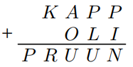

# &nbsp;

<h1 style="font-size:28pt">Skaitļu teorija: Igaunijas olimpiādes, 10.kl.</h1>

* **EE.PK** - Eesti Piirkonnavoor (Igaunijas reģionu kārta)
* **EE.LO** - Eesti Lõppvoor (Igaunijas gala/valsts kārta)
* <blue>**EE.LVS** - **Eesti Sügisene lahtine võistlus** (Igaunijas rudens atvērtais konkurss)</blue>
* <blue>**EE.LVT** - **Eesti Talvine lahtine võistlus** (Igaunijas ziemas atvērtais konkurss)</blue>

[Matemaatikaolümpiaadid ](http://www.math.olympiaadid.ut.ee/html/index.php)

# <lo-sample/> EE.LVS.2009.noorem.1

Atrast visus naturālos skaitļus $n$, kuriem 
$1 + 2^2 + 3^3 + 4^n$
ir vesela skaitļa kvadrāts.

<small>

* [alg.tra.pow.nest](#)
* [seq.gaps.squares](#)
* [alg.ineq.equations](#)
* [comb.full](#)

</small>

<!--
ru=
Найти все положительные целые числа $n$, при которых 
$1 + 2^2 + 3^3 + 4^n$
является квадратом некоторого целого числа.
-->

<!--
questionType=Find.All
genre=integer-equation
-->

## Attālumi starp pilniem kvadrātiem

* Arī $4^n = (2^n)^2$ ir pilns kvadrāts. 
* Tad $(2^n)^2 + 1 + 2^2 + 3^3 = (2^n)^2 +32$ vērtībām
$N = 2^n \geq 16$ noteikti nav pilns kvadrāts, jo nākamais
pilnais kvadrāts:
$$(N+1)^2 = N^2 + 2N+ 1 \geq N^2 + 33.$$
* Piemēram $4^4 = 16^2 = 256$. Bet jau nākamais 
pilnais kvadrāts $17^2 = 289$. Atstarpe ir $33$. 

## Ievietojam n=1,2,3

* Vērtība $n=4$ neder, kā jau redzējām, jo $288$ nav pilns kvadrāts.
* Vērtībām $n>4$ attālumi starp $4^n$ un nākamo pilno kvadrātu 
vēl vairāk pieaug (un ir vairāk par $33$). 
* Ievietojam visas $n=1,2,3$:
$$4^1 + 32 = 36;\;4^2 + 32 = 48;\;4^3 + 32 = 96.$$
* Secinām, ka tikai pie $n=1$ skaitlis $1 + 2^2 + 3^3 + 4^n = 36$ 
ir pilns kvadrāts.

# <lo-sample/> EE.LVS.2009.vanem.1

Vai eksistē pirmskaitlis $p$, kuram
$p^3 + 2008$ un $p^3 + 2010$ arī
ir pirmskaitļi?

<small>

* [mod.eq.contradict](#)

</small>

<!--
ru=
Найдётся ли простое число $p$, при котором 
$p^3 + 2008$ и $p^3 + 2010$ также
являются простыми числами?
-->

<!--
questionType=ProveDisprove.Exists
concepts=primes
-->

## Atlikumi

Kubiskām funkcijām $p^3$ mēdz būt izdevīgi aplūkot 
atlikumus, dalot ar $7$ vai $9$. Ir zināms, ka 

$$\left\{ \begin{array}{ll}
p^3 \equiv 0,1,6 & (\mbox{mod}\,7)\\
p^3 \equiv 0,1,8 & (\mbox{mod}\,9)\\
\end{array} \right.$$

## Pretrunas modulis

* Pieskaitāmie skaitļi $2008, 2010$ dod atlikumus $6$ un $1$, 
dalot ar $7$. 
* Lai neviena no summām $p^3 + 2008$, $p^3 + 2010$ nedalītos ar $7$, 
jābūt $p^3 \equiv 0$ jeb $p$ jādalās ar $7$. 
* Vienīgais pirmskaitlis, kas dalās ar $7$, ir pats $7$. 
* $7^3 + 2010 = 2353$. Šis skaitlis dalās ar $13$. 

*Secinājums.* Tāda pirmskaitļa $p$ nav.

# <lo-sample/> EE.LVT.2009.noorem.1

Atrast visus vienādojuma $xy-3x+7y = 2030$ atrisinājumus 
naturālos skaitļos.

<!--
ru=
Найти все решения уравнения $xy-3x+7y = 2030$ в положительных целых
числах.
-->

<!--
questionType=Find.All
genre=integer-equation
-->

# <lo-sample/> EE.LVT.2009.noorem.5

Sauksim naturālu skaitli $n$ par *pirmskaittiecīgu*, ja 
eksistē vismaz trīs tādi pirmskaitļi, kuriem nodzēšot pēdējo 
ciparu, iegūst skaitli $n$. Pierādīt, ka jebkuri 
divi naturāli pirmskaittiecīgi skaitļi atšķiras vismaz par $3$. 

<!--
ru=
Назовём положительное целое число n простолюбивым, если найдутся
по крайней мере три таких простых числа, при стирании последней 
цифры которых получается число n. Доказать, что любые два простолюбивых
положительных целых числа различаются по крайней мере на $3$.
-->

<!--
questionType=Prove.ForAll
genre=digit-manipulation
concepts=primes
-->

# <lo-sample/> EE.LVT.2009.vanem.3

Sauksim naturālu skaitli $n$ par *tīru*, ja tas neietilpst nevienā
veselu skaitļu virknē
$c_0, c_1, c_2, \ldots$ , kur $0 < c_0 < n$,
un ko visiem $i > 0$ definē šādi:
$$c_i = \left\{
\begin{array}{ll}
\frac{c_{i-1}}{2}, & \mbox{ja $c_{i−1}$ ir pāru,}\\
3c_{i-1} - 1, & \mbox{ja $c_{i-1}$ ir nepāru.}
\end{array} \right.$$
Piemēram, skaitlis $10$ nav tīrs, jo tas ietilpst virknē 
$5, 14, 7, 20, 10, \ldots$, kas apmierina virknes nosacījumus.  
a) Vai katrs naturāls skaitlis, kurš dalās ar $3$, ir tīrs?  
b) Pierādīt, ka, ja $n > 1$ ir tīrs, bet nedalās ar $3$, tad
skaitlis $n + 1$ dalās ar $6$.

<!--
ru=
Назовём положительное целое число $n$ чистым, если оно не содержится
ни в какой последовательности целых чисел 
$c_0, c_1, c_2, \ldots$ , где $0 < c_0 < n$,
и при каждом $i > 0$
$$c_i = \left\{ 
\begin{array}{ll}
\frac{c_{i-1}}{2}, & \mbox{если $c_{i−1}$ чётно,} \\
$3c_{i-1} - 1, & \mbox{если $c_{i-1}$ нечётно.}
\end{array} \right.$$
Например, число $10$ не является чистым, так как оно содержится в последовательности 
$5, 14, 7, 20, 10, \ldots$, удовлетворяющей условиям задачи.  
а) Является ли каждое делящееся на $3$ положительное целое число чистым?  
б) Доказать, что если целое число $n > 1$ чистое, но не делится на $3$, то
число $n + 1$ делится на $6$.
-->

<!--
questionType=ProveDisprove.ForAll,Prove.ForAll
genre=sequence-properties
-->

# <lo-sample/> EE.LVS.2010.noorem.1

Atrast visus naturālos skaitļus $n$, kuriem 
visu viņu pozitīvo dalītāju reizinājums nav skaitļa $n$
pakāpe ar veselu kāpinātāju. 

<!--
ru=
Найти все положительные целые числа $n$, 
произведение всех положительных делителей которых не 
является степенью числа $n$ с целочисленным
показателем.
-->

<!--
questionType=Find.All
concepts=divisors
-->

# <lo-sample/> EE.LVS.2010.noorem.5

Atrast visus naturālu skaitļu pārus $(n,k)$, kuriem
$n! + (n + 1)! = k! + 120$.  
*Piezīme. Pieraksts $x!$ apzīmē reizinājumu $1 \cdot 2 \cdot \ldots \cdot x$.*

<!--
ru=
Найти все пары положительных целых чисел $(n, k)$, при которых
$n! + (n + 1)! = k! + 120$.  
Замечание. Запись $x!$ обозначает произведение $1 \cdot 2 \cdot \ldots \cdot x$.
-->

<!--
questionType=Find.All
concepts=factorial
-->

# <lo-sample/> EE.LVS.2010.vanem.1

Pierādīt, ka nevienu naturālu skaitli, starp kura cipariem pa 
vienai reizei atrodami cipari $2$ un $1$, bet visi pārējie cipari ir
nulles, nevar izteikt kā divu veselu skaitļu kvadrātu summu 
vai divu veselu skaitļu kubu summu. 

<!--
ru=
Доказать, что ни одно натуральное число, среди цифр которого 
встречаются по одному разу $2$ и $1$, а остальные все цифры нули, 
нельзя представить в виду суммы квадратов или суммы кубов двух целых чисел.
-->

<!--
questionType=Prove.NotExists
concepts=power-sums
-->

# <lo-sample/> EE.LVS.2010.vanem.2

Ar $P(x)$ apzīmēts polinoms ar veseliem koeficientiem, 
kas apmierina nosacījumu $P(2010) = P(201) = 2010$.  
a) Vai ir iespējams, ka $P(2011) = 2011$?  
b) Kāda ir mazākā iespējamā $P(2011)$ pozitīvā vērtība?

<!--
ru=
Пусть $P(x)$ –– многочлен с целочисленными коэффициентами, 
удовлетворяющий условию $P(2010) = P(201) = 2010$.  
а) Возможно ли, что $P(2011) = 2011$?  
б) Каково наименьшее возможное положительное значение $P(2011)$?
-->

<!--
questionType=ProveDisprove.Exists,Find.Min
concepts=integer-polynomial
-->

# <lo-sample/> EE.LVT.2010.noorem.1

Atrast visus naturālos skaitļus, kuru pierakstā nav vairāk par četriem
cipariem, un kuri, nodzēšot pirmo ciparu, samazinās tieši $25$ reizes
(pēc nodzēšanas skaitlis var sākties arī ar ciparu $0$). 

<!--
ru=
Найти все не более чем четырёхзначные положительные целые числа, 
которые при стирании первой цифры уменьшаются ровно в 25 раз 
(оставшееся число может начинаться и на цифру 0).
-->

<!--
questionType=Find.All
genre=digit-manipulation
-->

# <lo-sample/> EE.LVT.2010.noorem.1

Aplūkosim naturālus skaitļus $N$, kuriem ir tieši $6$ 
pozitīvi dalītāji - apzīmēsim šos dalītājus ar 
$d_1,\ldots,d_6$, turklāt
$1 = d_1 < d_2 < d_3 < d_4 < d_5 < d_6 = N$. 
Sauksim skaitli $N$ par *labu*, ja summa
$d_4 + d_5$ dalās ar summu $d_2 + d_3$.  
a) Atrast mazāko naturālo skaitli $N$, kuram ir tieši
$6$ pozitīvi dalītāji un kurš nav labs.  
b) Pierādīt, ka atradīsies bezgalīgi daudz naturālu skaitļu
$N$, kuriem ir tieši $6$ pozitīvi dalītāji un kuri nav labi.

<!--
ru=
Рассмотрим положительные целые числа $N$, у которых ровно 
$6$ положительных делителей − обозначим эти делители через 
$d_1,\ldots,d_6$, причём
$1 = d_1 <d_2 <d_3 <d_4 <d_5 <d_6 = N$. 
Назовём число $N$ хорошим, если сумма
$d_4 + d_5$ делится на сумму $d_2 + d_3$.  
а) Найти наименьшее положительное целое число $N$, у которого ровно
$6$ положительных делителей и которое не является хорошим.  
б) Доказать, что найдётся бесконечно много положительных 
целых чисел $N$, у которых ровно $6$ положительных делителей и которые не
являются хорошими.
-->

<!--
questionType=Find.Min,Prove.Other
concepts=divisors
-->

# <lo-sample/> EE.LVT.2010.vanem.5

Cik ir tādu naturālu skaitļu, kas dalās ar $2010$, kuriem ir 
tieši $2010$ pozitīvu dalītāju (ieskaitot $1$ un pašu skaitli)? 

<!--
ru=
Сколько найдётся таких положительных целых чисел, делящихся на $2010$,
у которых ровно $2010$ положительных делителей (включая $1$ и само это
число)?
-->

<!--
questionType=Find.Count
concepts=divisors
-->

# <lo-sample/> EE.LVS.2011.noorem.1

Atrast visus četrciparu skaitļus, kam, nodzēšot
jebkuru ciparu, rodas trīsciparu skaitlis, kurš ir 
sākotnējā skaitļa dalītājs. 

<!--
ru=
Найти все четырёхзначные числа, при стирании любой 
цифры которых получается трёхзначное число, 
являющееся делителем изначального числа.
-->

<!--
questionType=Find.All
genre=digit-manipulation
-->

# <lo-sample/> EE.LVS.2011.vanem.1

Katram naturālam skaitlim $n$ apzīmēsim ar simbolu 
$a_n$ lielāko skaitļa $2$ pakāpi, ar ko dalās skaitlis $n$
(piemēram, $a_{2011} = 1$,
$a_{2012} = 4$). Pierādīt, ka patvaļīgiem naturāliem skaitļiem
$i$ un $j$, kur $i < j$, summa
$$\frac{1}{a_i} + \frac{1}{a_{i+1}} + \ldots + \frac{1}{a_j}$$
nav vesels skaitlis.

<small>

* [div.valu.change](#)

</small>

<!--
ru=
Для каждого положительного числа $n$ обозначим символом 
$a_n$ наибольшую степень числа $2$, на которую делится 
число $n$ (например, $a_{2011} = 1$,
$a_{2012} = 4$). Доказать, что для произвольных положительных 
целых чисел $i$ и $j$ , где $i < j$, сумма
$$\frac{1}{a_i} + \frac{1}{a_{i+1}} + \ldots + \frac{1}{a_j}$$
не является целым числом.
-->

<!--
questionType=Prove.ForAll
concepts=valuations
-->

# <lo-sample/> EE.LVT.2011.noorem.1

Pierādīt, ka vienādojumam
$$2x^3 − y^2 = 3$$
nav atrisinājumu veselos skaitļos.

<!--
ru=
Доказать, что уравнение
$$2x^3 − y^2 = 3$$
не имеет целочисленных решений.
-->

<!--
questionType=Prove.NotExists
genre=integer-equation
-->

# <lo-sample/> EE.LVT.2011.noorem.5

Vai var gadīties, ka trijstūrim ar veseliem malu garumiem
perimetrs dalās ar divkāršotu trijstūra pašas garākās malas garumu. 

<!--
ru=
Может ли быть так, что периметр треугольника 
с целочисленными длинами сторон делится на удвоенную длину 
самой длинной стороны этого треугольника?
-->

<!--
questionType=ProveDisprove.Exists
genre=integer-geometry
-->

# <lo-sample/> EE.LVT.2011.vanem.1

Pierādīt, ka jebkuram pozitīvam skaitlim $n$ pirmo $n$ 
pirmskaitļu summa ir lielāka par $n^2$. 

<!--
ru=
Доказать, что при любом положительном целом числе n сумма первых n
простых чисел больше, чем n^2.
-->

<!--
questionType=Prove.ForAll
concepts=primes
-->

# <lo-sample/> EE.LVT.2011.vanem.2

Atrast visus naturālu skaitļu trijniekus $(a,b,c)$, 
kuriem izpildās vienādība
$$a^{bc} + b^{ca} + c^{ab} = 3abc.$$

<!--
ru=
Найти все тройки положительных целых чисел $(a,b,c)$, 
при которых выполняется равенство
$$a^{bc} + b^{ca} + c^{ab} = 3abc.$$
-->

<!--
questionType=Find.All
genre=integer-equation
-->

# <lo-sample/> EE.LVS.2012.noorem.1

Cik ir tādu sešciparu naturālu skaitļu, kuru pierakstā ir 
cipari $0$, $1$, $2$, $3$, $4$ un $5$ katrs vienu reizi un 
kuri dalās ar katru savu ciparu, kas nav nulle.

<!--
ru=
Сколько всего таких шестизначных натуральных чисел, в записи которых
присутствуют цифры 0, 1, 2, 3, 4 и 5 каждая по одному разу, и которые
делятся на каждую свою цифру, отличную от нуля?
-->

<!--
questionType=Find.Count
-->

# <lo-sample/> EE.LVS.2012.noorem.2

No nulles atšķirīgi veseli skaitļi $a$, $b$ un $c$ apmierina nosacījumu
$\frac{1}{a}+\frac{1}{b}+\frac{1}{c}=0$.
Pierādīt, ka starp skaitļiem $a$, $b$, $c$ var atrast divus tādus
skaitļus, kuriem ir kopīgs dalītājs, kas lielāks par $1$.

<!--
ru=
Отличные от нуля целые числа $a$, $b$ и $c$ удовлетворяют условию
$\frac{1}{a}+\frac{1}{b}+\frac{1}{c}=0$.
Доказать, что среди чисел $a$, $b$, $c$ можно найти два таких числа, 
у которых найдётся общий делитель, который больше числа $1$.
-->

<!--
questionType=Prove.Exists
concepts=coprimes
-->

# <lo-sample/> EE.LVS.2012.noorem.3

Skolotājs pateica Jüri divus veselus skaitļus $a$ un $b$, kas nav nulles, 
turklāt $b$ dalās ar $a$. Jüri ir jāatrod tādu nenulles veselu 
skaitli $c$, ka $c$ dalās ar $b$, un visi kvadrātvienādojuma
$ax^2+bx+c=0$ atrisinājumi ir veseli skaitļi. Vai Jüri vienmēr 
var atrisināt šo uzdevumu?

<!--
ru=
Учитель сказал Юре два отличных от нуля целых числа $a$ и $b$, причём
$b$ делится на $a$. Юра должен найти такое отличное от нуля целое число
$c$, что $c$ делилось бы на $b$, и чтобы все решения квадратного уравнения
$ax^2+bx+c=0$ являлись целыми числами. Всегда ли у Юры есть 
возможность верно решить это задание?
-->

<!--
questionType=ProveDisprove.Other
concepts=quadratic-equation
-->

# <lo-sample/> EE.LVS.2012.vanem.1

Atrast visus naturālos skaitļus, kuri ir tieši $2013$ reizes lielāki 
par savu ciparu summu. 

<!--
ru=
Найти все положительные целые числа, которые ровно в $2013$ раз больше
суммы своих цифр.
-->

<!--
questionType=Find.All
concepts=sum-of-digits
-->

# <lo-sample/> EE.LVS.2012.vanem.2

Atrast visus atlikumus, kurus, dalot ar $6$, dod vesels
skaitlis $n$, kurš kādam veselam $m$ apmierina vienādību 
$n^3 = m^2 + m + 1$.

<!--
ru=
Найти все остатки, которые при делении на число $6$ может 
дать целое число $n$, которое для некоторого 
целого числа $m$ удовлетворяет равенству
$n^3 = m^2 + m + 1$.
-->

<!--
questionType=Find.All
concepts=remainder
-->

# <lo-sample/> EE.LVS.2012.vanem.3

Pierādīt, ka $(2n)! < n^{2n}$
katram veselam skaitlim $n \geq 3$.
*Piezīme. Par naturāla skaitļa $x$ faktoriālu $x!$ 
sauc reizinājumu $1\cdot{}2\cdot\ldots\cdot{}x$.*

<!--
Доказать, что $(2n)! < n^{2n}$
для каждого целого числа $n \geq 3$.
*Замечание. Факториалом $x!$ положительного целого числа $x$ называется
произведение $1\cdot{}2\cdot\ldots\cdot{}x$.*
-->

<!--
questionType=Prove.ForAll
concepts=factorial
genre=proving-inequality
-->

# <lo-sample/> EE.LVT.2012.noorem.1

Kärt's uzraksta uz tāfeles daļas $\frac{1}{2}$
un $\frac{1}{3}$, bet Märt's uzraksta uz papīra $10$ 
naturālus skaitļus pēc savas izvēles, turklāt tos nerāda Kärt'am.
Pēc tam Kärt's sāk pa vienai rakstīt klāt jaunas daļas
sekojošā veidā: katrā solī viņš izvēlas kādas uz tāfeles jau 
esošas daļas $\frac{a}{b}$ un $\frac{c}{d}$, 
un pievieno uz tāfeles daļu $\frac{a + c}{b + d}$ saīsinātā veidā.
(Piemēram, ja Kärt's izvēlējās daļas
$\frac{1}{3}$ un $\frac{3}{5}$, tad viņš pievienos tām
daļu $\frac{1}{2}$, jo
$\frac{1 + 3}{3 + 5} = \frac{4}{8} = \frac{1}{2}$.)
Vai vienmēr Kärt's spēs izvēlēties daļas tā, lai pēc kaut kāda soļu skaita
uz tāfeles parādītos daļa, kuras saucējs ir savstarpējs pirmskaitlis ar
visiem Märt'a uzrakstītajiem skaitļiem?

<!--
ru=
Карен записывает на доске дроби $\frac{1}{2}$
и $\frac{1}{3}$, а Маша записывает на бумаге
$10$ положительных целых чисел по своему выбору, причём Карену она их
не показывает. Затем Карен начинает по одной добавлять дроби на доску следующим образом: на каждом шагу он выбирает какие-то две уже
имеющиеся на доске дроби $\frac{a}{b}$ и $\frac{c}{d}$
и записывает на доску дробь $\frac{a + c}{b + d}$
в несократимом виде. (Например: если Карен выбрал дроби 
$\frac{1}{3}$ и $\frac{3}{5}$, то он
дописывает дробь $\frac{1}{2}$, потому что
$\frac{1 + 3}{3 + 5} = \frac{4}{8} = \frac{1}{2}$.)
Всегда ли Карен сможет выбрать дроби так, что после некоторого числа
шагов он запишет на доске дробь, знаменатель которой окажется взаимно
простым со всеми числами, записанными Машей?
-->

<!--
questionType=ProveDisprove.Other
genre=game
-->

# <lo-sample/> EE.LVT.2012.noorem.5

Atrast visus tos veselu skaitļu pārus $(a, b)$, kuriem
$(a + 1)(b − 1) = a^2b^2$.

<!--
ru=
Найти все такие пары целых чисел $(a, b)$, что 
$(a + 1)(b − 1) = a^2b^2$.
-->

<!--
questionType=Find.All
genre=integer-equation
-->

# <lo-sample/> EE.LVT.2012.vanem.1

Ar $a$ un $b$ apzīmējam tādus naturālus skaitļus, ka $b$ dalās ar $a$, bet
pierakstot skaitļus $a$ un $b$ vienu aiz otra šajā secībā, 
iegūsim skaitli 
$(a + b)^2$. Pierādīt, ka $\frac{b}{a}=6$.

<!--
ru=
Пусть $a$ и $b$ такие положительные целые числа, что $b$ делится на $a$, а
записывая числа $a$ и $b$ друг за другом в этом порядке, получим число
$(a + b)^2$. Доказать, что $\frac{b}{a}=6$.
-->

<!--
questionType=Prove.ForAll
genre=digit-manipulation
-->

# <lo-sample/> EE.LVT.2012.vanem.2

Ar $x$ un $y$ ir dažādi naturāli skaitļi. Pierādīt, ka 
$$\frac{x^2 + 4xy + y^2}{x^3 − y^3}$$
nav vesels skaitlis.

<!--
ru=
Пусть $x$ и $y$ различные положительные целые числа. Доказать, что
$$\frac{x^2 + 4xy + y^2}{x^3 − y^3}$$
не является целым числом
-->

<!--
questionType=Prove.ForAll
-->

# <lo-sample/> EE.LVT.2012.vanem.5

Atrast visas funkcijas $f$, kas definēta naturāliem skaitļiem
un pieņem naturālas vērtības, kas apmierina nosacījumu: 
Katriem naturāliem skaitļiem $k$ un
$a_1,\ldots,a_k$ skaitlis $f(a_1)+\ldots+f(a_k)$ dalās
ar skaitli $a_1 + \ldots + a_k$.

<!--
ru=
Найти все такие функции $f$ из множества положительных целых чисел в
это же самое множество, которые удовлетворяют условию: 
при любых положительных целых числах $k$ и 
$a_1,\ldots,a_k$ число $f(a_1)+\ldots+f(a_k)$ делится
на число $a_1 + \ldots + a_k$.
-->

<!--
questionType=Find.All
genre=functional-equation
-->

# <lo-sample/> EE.LVS.2013.noorem.1

Volli grib no naturāliem skaitļiem
$1, 2, 3, \ldots, 100$ izvēlēties $x$ skaitļus tā, 
lai tieši četri no tiem dalītos ar $4$, tieši 
četri dalītos ar $5$ un tieši trīs skaitļi dalītos ar $6$. 
Atrast mazāko skaitļa $x$ vērtību. 

<!--
ru=
Витя желает выбрать среди натуральных чисел 
$1, 2, 3, \ldots, 100$ всего $x$ чисел так, 
чтобы ровно четыре из них делились на число $4$, 
ровно четыре из них делились на число $5$ и ровно 
три из них делились на число $6$. Найти
наименьшее возможное значение числа $x$.
-->

<!--
questionType=Find.Min
-->

# <lo-sample/> EE.LVS.2013.noorem.2

Vienādiem burtiem atbilst vienādi cipari, 
bet dažādiem burtiem - dažādi cipari. 
Atrast visus veidus, kā aizstāt burtus ar cipariem tā, 
lai darbība izrādītos pareiza.

<!--
ru=
Одинаковым буквам соответствуют одинаковые цифры, 
а различным буквам − различные цифры. 
Найти все возможные способы замены букв цифрами так, 
чтобы данное действие было верным.
-->

<!--
questionType=Find.All
genre=cryptarithm
-->

# <lo-sample/> EE.LVS.2013.noorem.3

Doti naturāli skaitļi $a, b, c$, 
to lielākais kopīgais dalītājs ir $1$. 
Zināms, ka skaitļi $a+2b$ un $a^2 − b^2$
dalās ar $c$.
Pierādīt, ka arī $a-b$ dalās ar $c$.

<!--
ru=
Даны положительные целые числа $a, b, c$, 
наибольший общий делитель которых равен 1. 
Известно, что числа $a+2b$ и $a^2 − b^2$
делятся на число $c$.
Доказать, что на число $c$ делится также число $a − b$.
-->

<!--
questionType=Find.All
concepts=gcd
-->

# <lo-sample/> EE.LVS.2013.vanem.1

Atrast veselo daļu skaitlim 
$$A = \sqrt{2013 + \sqrt{2012 + \sqrt{2011 + \ldots \sqrt{2 +\sqrt{1}}}}}.$$
*Piezīme:* Par skaitļa $x$ veselo daļu sauc lielāko veselo skaitli, 
kurš nepārsniedz $x$.

<!--
ru=
Найти целую часть числа 
$$A = \sqrt{2013 + \sqrt{2012 + \sqrt{2011 + \ldots \sqrt{2 +\sqrt{1}}}}}.$$
Замечание: целой частью числа называется наибольшее 
целое число, которое не превышает данное число.
-->

<!--
questionType=Find.Only
concepts=square-root
-->

# <lo-sample/> EE.LVS.2013.vanem.2

Atrast visus naturālos skaitļus $n$, kuriem atradīsies tādi 
pirmskaitļi $p$ un $q$, ka 
$$p(p + 1) + q(q + 1) = n(n + 1).$$

<!--
ru=
Найти все натуральные числа $n$, при которых найдутся такие простые
числа $p$ и $q$, что
$$p(p + 1) + q(q + 1) = n(n + 1).$$
-->

<!--
questionType=Find.All
concepts=primes
-->

# <lo-sample/> EE.LVT.2013.noorem.1

Sauksim naturālu skaitli par *interesantu*, ja 
skaitlis, kuru veido jebkuri divi
blakusesoši cipari šajā skaitlī, dalās ar $19$ vai ar $21$. 
Piemēram, skaitlis $7638$ ir interesants, jo $76$ ir 
daudzkārtnis skaitlim $19$, 
$63$ ir daudzkārtnis skaitlim $21$, 
$38$ ir daudzkārtnis skaitlim $19$. 
Cik pavisam ir interesantu skaitļu, kuru 
pierakstā ir $2013$-cipari.

<!--
ru=
Назовём натуральное число интересным, если число, 
состоящее из любых двух рядом стоящих цифр этого числа, 
является кратным числу $19$ или числу $21$. 
Например, число $7638$ интересное, так как $76$ кратно числу 
$19$, $63$ кратно числу $21$, а $38$ кратно числу $19$. 
Сколько всего существует $2013$-значных интересных чисел?
-->

<!--
questionType=Find.Count
genre=string-counting
-->

# <lo-sample/> EE.LVT.2013.noorem.3

Par naturāla skaitļa $n$ *nepāra daļu* sauksim lielāko 
nepāra naturālo skaitli, ar kuru dalās $n$.
Vai atradīsies tāds nepāru naturāls skaitlis, kuru 
nevar izteikt kā divu pēc kārtas sekojošu naturālu 
skaitļu nepāru daļu reizinājumu.

<!--
ru=
Нечётной частью положительного целого числа n назовём наибольшее
нечётное положительное целое число, на которое число n делится.
Найдётся ли такое нечётное положительное целое число, 
которое невозможно представить в виде произведения нечётных частей 
двух последовательных положительных целых чисел?
-->

<!--
questionType=ProveDisprove.Exists
-->

# <lo-sample/> EE.LVT.2013.vanem.1

Atrast visus tos pozitīvu racionālu skaitļu pārus, 
kuriem pārī ietilpstošo skaitļu summa ir vesels skaitlis, 
un arī šo skaitļu apgriezto lielumu summa ir vesels skaitlis. 

<!--
ru=
Найти все такие пары положительных рациональных чисел, при которых
сумма входящих в пару чисел является целым числом, 
а также сумма обратных им чисел является целым числом.
-->

<!--
questionType=Find.All
-->

# <lo-sample/> EE.LVT.2013.vanem.5

(a) Vai atradīsies tāds vesels skaitlis $c$ un polinoms $P(x)$ 
ar veseliem koeficientiem, kam $P(c) \neq c$, bet $P(P(c)) = c$?  
(b) Vai atradīsies tāds vesels skaitlis $c$ un polinoms $P(x)$ 
ar veseliem koeficientiem, kam $P(c) \neq c$ un $P(P(c)) \neq c$, 
bet $P(P(P(c))) = c$?  
*Piezīme:* Par polinomu ar veseliem koeficientiem sauc
no $x$ atkarīgu izteiksmi
$P(x) = a_0 + a_1x + a_2x^2 +\ldots+ a_n x^n$,
kur $n$ − naturāls skaitlis un $a_0,a_1,a_2,\ldots,a_n$ - veseli skaitļi.

<!--
ru=
a) Найдётся ли такое целое число $c$ и многочлен $P(x)$ с целочисленными
коэффициентами, при которых $P(c) \neq c$, но $P(P(c)) = c$?  
b) Найдётся ли такое целое число c и многочлен $P(x)$ с целочисленными
коэффициентами, при которых $P(c) \neq c$ и $P(P(c)) \neq c$, 
но $P(P(P(c))) = c$?  
*Замечание:* многочленом с целочисленными коэффициентами называется
зависящее от переменной $x$ выражение 
$P(x) = a_0 + a_1x + a_2x^2 +\ldots+ a_n x^n$,
где $n$ − натуральное число и $a_0,a_1,a_2,\ldots,a_n$ − целые числа.
-->

<!--
questionType=ProveDisprove.Exists
concepts=integer-polynomials
-->

# <lo-sample/> EE.LVS.2014.noorem.1

Atrast tādu vismazāko naturālo $n$, kuram katrs no cipariem 
no $0$ līdz $9$ būtu decimālpierakstā kaut vienam no 
sešiem pēc kārtas sekojošiem skaitļiem
$n+1$, $n+2$, $n+3$, $n+4$, $n+5$ 
un $n+6$.

<!--
ru=
Найти такое наименьшее натуральное число $n$, при котором каждая из
цифр от $0$ до $9$ присутствовала бы в записи хотя бы одного 
из шести последовательных чисел $n+1$, $n+2$, $n+3$, $n+4$, $n+5$ 
и $n+6$.
-->

<!--
questionType=Find.Min
genre=digit-manipulation
-->

# <lo-sample/> EE.LVS.2014.noorem.3

Vispirms uz lapiņas uzraksta skaitli $1$. 
Katrā solī zem pēdējā uzrakstītā skaitļa uzraksta 
vai nu skaitli, kurš par to tieši divreiz lielāks, 
vai arī skaitli, kuru iegūst pēdējā uzrakstītajā skaitlī 
mainot vietām ciparus (ņemot vērā, ka skaitļi 
nevar sākties ar ciparu $0$). Vai var gadīties, ka 
pēc galīga skaita šādu soļu uz lapiņas būs uzrakstīts  
a) skaitlis $1000000000$?  
b) skaitlis $9876543210$?

<!--
ru=
Сначала на листок бумаги записывают число 1. 
Каждым шагом под последним записанным числом записывают 
либо число, которое ровно в два
раза больше этого числа, либо число, полученное 
перестановкой цифр записанного последним числа 
(учитывая, что числа не могут начинаться с
цифры 0). Возможно ли после конечного числа таких шагов записать на
этом листке бумаги  
а) число $1000000000$?  
б) число $9876543210$?
-->

<!--
questionType=ProveDisprove.Exists
genre=digit-manipulation
-->

# <lo-sample/> EE.LVS.2014.noorem.4

Kurš no skaitļiem lielāks: $2^{2014}$ vai
$3^{303} \cdot 4^{404} \cdot 5^{505}$?

<!--
ru=
Какое из чисел больше, $2^{2014}$ или 
$3^303 \cdot 4^{404} \cdot 5^{505}$?
-->

<!--
questionType=Find.Only
genre=proving-inequality
-->

# <lo-sample/> EE.LVS.2014.vanem.1

Atrast visus tos naturālos skaitļus $n$, kuriem 
vienādojumam 
$(x^2+y^2)^n = (xy)^{2014}$ 
ir atrisinājums naturālos skaitļos.

<!--
ru=
Найти все такие положительные целые числа $n$, 
при которых уравнение
$(x^2+y^2)^n = (xy)^{2014}$ имеет решение в положительных целых числах.
-->

<!--
questionType=Find.All
genre=integer-equation
-->

# <lo-sample/> EE.LVT.2014.noorem.1

Pēc kārtas sekojoši naturāli skaitļi, sākot
ar $1$, sadalīti grupās pa desmit tā, ka 
1.grupā atrodas skaitļi no $1$
līdz $10$, 2.grupā skaitļi no $11$ līdz $20$, 
3.grupā skaitļi no $21$ līdz $30$ utt.
Vai eksistē tāds vesels pozitīvs skaitlis, ka,
skaitli saskaitot ar viņa grupas numuru, iegūst 
$2014$?

<!--
ru=
Последовательные положительные целые числа, 
начиная с числа $1$, разбиты на группы по десять так, 
что в 1-ой группе находятся числа от $1$
до $10$, во 2-ой от $11$ до $20$, в 3-ой от $21$ до $30$ и т. д. 
Существует ли такое
положительное целое число, что сумма его 
самого с номером его группы равна $2014$?
-->

<!--
questionType=ProveDisprove.Exists
-->

# <lo-sample/> EE.LVT.2014.noorem.2

Ar $d_n$ apzīmējam skaitli vai skaitļa daļu, 
ko veido $n$ pēc kārtas sekojoši cipari $d$. 
Piemēram, pieraksts $4_3$ apzīmē skaitli $444$, bet $1_25_38_29_1$
apzīmē skaitli $11555889$. Zināms, ka ir spēkā vienādība
$3_a2_b5_c + 2_c5_a3_b = 5_38_17_d5_28_3$, 
kur $a$, $b$, $c$ un $d$ ir kaut kādi pozitīvi 
veseli skaitļi. Atrast $a$, $b$, $c$ un $d$.

<!--
ru=
Пусть $d_n$ обозначает число или часть числа, 
состоящюю из $n$ последовательных цифр $d$. 
Например, запись $4_3$ обозначает число $444$, а $1_25_38_29_1$
обозначает число $11555889$. Известно, что имеет место равенство
$3_a2_b5_c + 2_c5_a3_b = 5_38_17_d5_28_3$, 
где $a$, $b$, $c$ и $d$ какие-то положительные
целые числа. Найти числа $a$, $b$, $c$ и $d$.
-->

<!--
genre=decimal-manipulation
questionType=Find.Only
-->

# <lo-sample/> EE.LVT.2014.noorem.3

Pierādīt, ka patvaļīgu naturālu skaitļu $n$ un $m$
mazākā kopīgā dalāmā kvadrāts dalās ar to 
reizinājumu $nm$, bet 
$nm$ savukārt dalās ar skaitļu $n$ un $m$ 
lielākā kopīgā dalītāja kvadrātu.

<!--
ru=
Доказать, что квадрат наименьшего общего 
кратного произвольных положительных целых 
чисел $n$ и $m$ делится на их произведение $nm$, а $nm$ в
свою очередь делится на квадрат 
наибольшего общего делителя чисел $n$ и $m$.
-->

<!--
concepts=lcm,gcd
questionType=Prove.ForAll
-->

# <lo-sample/> EE.LVT.2014.vanem.1

Vai eksistē tāds vesels skaitlis $x$, ka 
$2 \leq x \leq m-1$, un $x^2 - x$ dalās ar $m$, ka  
a) $m = 2014$;  
b) $m = 2015$?

<!--
ru=
Существует ли такое целое число $x$, что $2 \leq x \leq m-1$, и 
$x^2 − x$ делится на $m$, если  
а) $m = 2014$;  
б) $m = 2015$?
-->

<!--
questionType=ProveDisprove.Exists
-->

# <lo-sample/> EE.LVT.2014.vanem.3

Atrast visus tos četrciparu naturālos skaitļus, kuru
dalījums ar savu ciparu summu ir mazākais iespējamais. 

<!--
ru=
Найти все такие четырёхзначные натуральные числа, результат деления
которых на сумму своих цифр будет наименьшим возможным.
-->

<!--
questionType=Find.All
genre=optimization
-->

# <lo-sample/> EE.LVS.2015.noorem.1

Skaitlī 
$$0,123456789101112\;\ldots\;998999$$
pēc komata ir visi pozitīvie skaitļi no $1$ līdz $999$.
Atrast šī skaitļa $2015$-to ciparu pēc komata.

<!--
ru=
В числе
$$0,123456789101112\;\ldots\;998999$$
после запятой идут подряд все положительные целые числа от $1$ до $999$.
Найти $2015$-ую после запятой цифру этого числа.
-->

<!--
questionType=Find.Only
-->

# <lo-sample/> EE.LVS.2015.noorem.2

Nosauksim naturālu skaitli $n$ par interesantu, ja eksistē 
naturāls skaitlis $m$ un naturāli skaitļi $a$ un $b$, kas
mazāki par $m$, kuriem $\frac{m^2}{ab}=n$. Piemēram, skaitlis $10$ ir interesants, 
jo $\frac{20^2}{4\cdot{}10}=10$.  
Atrast vismazāko interesanto skaitli.

<!--
ru=
Назовём положительное целое число $n$ интересным, если существуют 
положительное целое число $m$ и положительные целые числа $a$ и $b$ меньшие
чем $m$, при которых $\frac{m^2}{ab}=n$. Например, число $10$ интересное, так как
$\frac{20^2}{4\cdot{}10}=10$.  
Найти наименьшее интересное число.
-->

<!--
questionType=Find.Min
-->

# <lo-sample/> EE.LVS.2015.noorem.3

Katrā no trim gadījumiem, noskaidrot, vai 
eksistē divciparu skaitlis $n$, kurš nebeidzas ar nulli un apmierina attiecīgo nosacījumu:  
a) visi skaitļi, ko iegūst, ievietojot vienu vai dažas nulles starp tā cipariem, 
dalās ar sākotnējo skaitli.  
b) neviens skaitlis, ko iegūst, ievietojot vienu vai dažas nulles starp tā cipariem, 
nedalās ar sākotnējo skaitli.  
c) daži no skaitļiem, ko iegūst, ievietojot vienu vai dažas nulles starp tā cipariem, 
dalās, bet daži nedalās ar sākotnējo skaitli.

<!--
ru=
Существует ли не оканчивающееся на нуль двузначное число n такое, что  
а) все числа, получаемые при добавлении одного или нескольких нулей
между его цифрами, делятся на него?  
б) ни одно число, получаемое при добавлении одного или нескольких
нулей между его цифрами, не делится на него?  
в) какие-то из чисел, получаемых при добавлении одного или нескольких 
нулей между его цифрами, делятся, а какие-то не делятся на него?
-->

<!--
genre=digit-manipulation
questionType=ProveDisprove.Exists
-->

# <lo-sample/> EE.LVS.2015.noorem.6

Cik ir piecciparu skaitļu, kas dalās ar $8$ un nesatur savā pierakstā ciparu nulle?

<!--
ru=
Сколько пятизначных делящихся на 8 чисел не имеют в своей записи цифры нуль?
-->

<!--
questionType=Find.Count
-->

# <lo-sample/> EE.LVS.2015.vanem.1

a) Atrast lielāko skaitli, kurš ir četru dažādu divciparu skaitļu lielākais kopīgais dalītājs.  
b) Atrast lielāko skaitli, kurš ir četru dažādu divciparu skaitļu mazākais kopīgais dalāmais.

<!--
ru=
а) Найти наибольшее число, являющееся наибольшим общим делителем
каких-то четырёх различных двузначных чисел.  
б) Найти наибольшее число, являющееся наименьшим общим кратным
каких-то четырёх различных двузначных чисел.
-->

<!--
concepts=lcm,gcd
questionType=Find.Max
-->

# <lo-sample/> EE.LVS.2015.vanem.3

Dots naturāls skaitlis $n$, kam gan $n+1$, $n+3$, $n+7$ un $n+9$, gan arī
$n+31$, $n+33$, $n+37$ un $n+39$ - ir pirmskaitļi. Atrast atlikumu, dalot
skaitli $n$ ar $210$.

<!--
ru=
Дано натуральное число $n$ такое, что как $n+1$, $n+3$, $n+7$ и $n+9$, так и
$n+31$, $n+33$, $n+37$ и $n+39$ − простые числа. Найти остаток от деления
числа $n$ на $210$.
-->

<!--
concepts=primes,remainder
questionType=Find.Only
-->

# <lo-sample/> EE.LVT.2015.noorem.1

Kertu pieder viens cipars $4$ un cik patīk daudz ciparu $3$. 
Izvietojot šos ciparus kaut kādā secībā, Kertu nolēma izveidot skaitli, 
kurš dalītos ar iespējami daudziem skaitļiem no $1$ līdz $9$. 
Kāds ir mazākais šāds skaitlis, kuru viņa var izveidot, ja  
a) Kertu aplūko tikai tos skaitļus, kas satur abus ciparus?  
b) Skaitļiem nav noteikti jāsatur abi cipari?

<!--
ru=
У Карины есть одна цифра $4$ и сколько угодно цифр $3$. Располагая эти
цифры одну за другой, Карина решила составить число, 
которое бы делилось на как можно больше чисел от $1$ до $9$. 
Каково наименьшее такое число, если
а) Карина учитывает только те числа, которые содержат обе цифры?
б) числа не обязаны содержать обе цифры?
-->

<!--
questionType=Find.Min
-->

# <lo-sample/> EE.LVT.2015.noorem.3

Veseli skaitļi $a,b,c,d,e,f$ apmierina nosacījumu $a+c+e=b+d+f$.
Pierādīt, ka $100000a + 10000b + 1000c + 100d + 10e + f$ dalās ar $11$.

<!--
ru=
Целые числа $a,b,c,d,e,f$ удовлетворяют условию $a+c+e=b+d+f$.
Доказать, что $100000a + 10000b + 1000c + 100d + 10e + f$ делится на $11$.
-->

<!--
questionType=Prove.ForAll
-->

# <lo-sample/> EE.LVT.2015.vanem.1

Vai eksistē tāds nepāru naturāls skaitlis $p$, ka 
no $p$ atšķirīgu skaitļa $p$ dalītāju summa ir lielāka par skaitli $p$? 

<!--
ru=
Существует ли такое нечётное положительное число $p$, 
что сумма отличных от $p$ положительных делителей числа $p$ больше числа $p$?
-->

<!--
concepts=divisors
questionType=ProveDisprove.Exists
-->

# <lo-sample/> EE.LVT.2015.vanem.4

Izgudrotājs iepazīstināja karali ar savu jauno spēli uz rūtiņu laukuma ar
izmēru $9\times{}10$. Karalis apsolīja viņam par pirmo rūtiņu vienu 
rīsu graudiņu, par otru rūtiņu - arī vienu graudiņu, bet 
par katru nākamo rūtiņu - tik daudz graudiņu, cik ir iepriekšējās divās rūtiņās kopā.
Pierādīt, ka par pēdējo rūtiņu izgudrotājs, saskaņā ar karaļa solījumu, 
nopelnīs vairāk kā $2015^4$
rīsa graudiņu.

<!--
ru=
Мудрец представил королю свою новую интересную игру на клетчатом
поле размером $9\times{}10$. Король пообещал заплатить ему за первую 
клетку одно рисовое зёрнышко, за вторую клетку также одно зёрнышко, а за
каждую последующую клетку столько же зёрен, сколько за предыдущие
две клетки вместе. Доказать, что за последнюю клетку мудрец, согласно
обещанию короля, заработает более чем $2015^4$
рисовых зёрен.
-->

<!--
questionType=Find.Only
genre=prove-inequality
-->

# <lo-sample/> EE.LVS.2016.noorem.2

Uz tāfeles uzrakstītas $11$ daļas, kuru skaitītāji un saucēji ir
visi naturālie skaitļi no $1$ līdz $22$. Kāds lielākais iespējamais
skaits no šīm daļām var būt veseli skaitļi? 

<!--
ru=
На доске записано $11$ дробей, числителями и знаменателями которых 
являются все целые числа от $1$ до $22$. Каково наибольшее возможное 
количество дробей, значения которых являются целыми числами?
-->

<!--
questionType=Find.Max
-->

# <lo-sample/> EE.LVS.2016.noorem.3

Juku izvirzīja matemātiskā pulciņā šādu hipotēzi: Vienmēr, 
ja divu savstarpēju pirmskaitļu $x$ un $y$ reizinājums 
dalās ar citu divu savstarpēju pirmskaitļu $a$ un $b$ reizinājumu, 
tad vismaz viens no skaitļiem $x$ un $y$ dalās ar $a$ vai ar $b$. 
Vai Juku hipotēze ir patiesa?  
*Piezīme:* Divus veselus skaitļus $a$ un $b$ sauc par savstarpējiem 
pirmskaitļiem, ja to lielākais kopīgais dalītājs $\mbox{LKD}(a, b) = 1$.

<!--
ru=
Юра выдвинул на математическом кружке следующую гипотезу: всегда,
когда произведение двух взаимно простых целых чисел $x$ и $y$ делится на
произведение двух взаимно простых целых чисел $a$ и $b$, то хотя бы одно
из чисел $x$ и $y$ делится на $a$ или на $b$. Выполняется ли гипотеза Юры?
Примечание. Говорят, что целые числа $a$ и $b$ взаимно просты, если
$\mbox{НОД}(a, b) = 1$.
-->

<!--
concepts=coprimes
questionType=ProveDisprove.ForAll
-->

# <lo-sample/> EE.LVS.2016.noorem.6

Vai eksistē tāds naturāls skaitlis $n$, kuram ir tieši $9$ pozitīvi 
dalītāji, bet visus tā dalītājus var novietot tabulā 
$3\times{}3$ tā, lai katrā rindiņā, katrā kolonnā un abās diagonālēs 
skaitļu reizinājums būtu viens un tas pats?

<!--
ru=
Найдётся ли такое положительное целое число $n$, у которого ровно 
$9$ положительных делителей, а все его делители можно расположить 
в таблице $3\times{}3$ таким образом, что произведение чисел каждой строки, каждого
столбца и обеих диагоналей будет одинаковым?
-->

<!--
genre=magic-configuration
questionType=ProveDisprove.Exists
-->

# <lo-sample/> EE.LVS.2016.vanem.2

Definējam virkni $a_1=1$ un $a_n = n \cdot a_{\lfloor{}n/2\rfloor}$, 
visiem $n>1$. Pierādīt, ka $a_n>n^2$ katram $n \geq 12$.  
*Piezīme:* Skaitļa $x$ veselā daļa $\lfloor x \rfloor$ 
ir lielākais veselais skaitlis, kas 
nepārsniedz $x$. Piemēram, $\lfloor 4,6 \rfloor = 4$. Tātad $a_2 = 2 \cdot a_1$, 
$a_3 = 3 \cdot a_1$, $a_4 = 4 \cdot a_2$, 
$a_5 = 5 \cdot a_2$ utt.

<!--
ru=
Зададим $a_1=1$ и $a_n = n \cdot a_{\lfloor{}n/2\rfloor}$
для каждого $n>1$. Доказать, что $a_n>n^2$
для каждого $n \geq 12$.
*Примечание.* Целая часть $\lfloor x \rfloor$ числа $x$ − это наибольшее целое число, не
превышающее числа $x$. Например, $\lfloor 4,6 \rfloor = 4$. Т.е. $a_2 = 2 \cdot a_1$, 
$a_3 = 3 \cdot a_1$, $a_4 = 4 \cdot a_2$, 
$a_5 = 5 \cdot a_2$ и т.д.
-->

<!--
concepts=floor
genre=prove-inequality
questionType=Prove.ForAll
-->

# <lo-sample/> EE.LVS.2016.vanem.3

Kati un Peeter spēlē sekojošu spēli. Vispirms Kati uzraksta uz tāfeles
kādu naturālu skaitli $a > 2016$. Pēc tam Peeter pieraksta jaunus skaitļus: 
katrā solī viņš pievieno skaitli $2016b + 1$, kur $b$
− lielākais skaitlis, kas tobrīd ir uz tāfeles. Peeter uzvar, 
ja viņš kādā solī uzraksta uz tāfeles skaitli, kas dalās ar $2017$. Ja viņš to nevar izdarīt, 
tad uzvar Kati. Vai Kati var uzvarēt, un ja jā, tad kāds ir mazākais skaitlis $a$, kas
viņai jāuzraksta uz tāfeles, lai uzvarētu? 

<!--
ru=
Катя и Петя играют в следующую игру. Вначале Катя записывает на доске
какое-то целое положительное число $a > 2016$. Затем Петя дописывает
на доску числа, на каждом шаге добавляя туда число $2016b + 1$, где $b$
− наибольшее на данный момент число на доске. Петя выиграет, если на
каком-то шаге запишет на доске число, делящееся на $2017$. Если он это
сделать не может, то выигрывает Катя. Может ли Катя выиграть игру и
если да, то каково наименьшее число $a$, которое она должна записать на
доске, чтобы выиграть?
-->

<!--
genre=game
questionType=Algorithm,Find.Min
-->

# <lo-sample/> EE.LVS.2016.vanem.6

Atrast visus naturālos skaitļus $n$, kuriem visus $n$ pozitīvos dalītājus
var bez atkārtošanās izrakstīt taisnstūrveida tabulā tā, lai katrā tabulas 
šūnā būtu tieši viens dalītājs, skaitļu summas visās tabulas rindiņās ir vienādas, 
un arī skaitļu summas visās tabulas kolonnās ir vienādas. 

<!--
ru=
Найти все целые положительные числа $n$, при которых все 
положительные делители числа $n$ можно без повторений расположить 
в прямоугольную таблицу так, что в каждой ячейке находится ровно один делитель,
сумма чисел в каждой строке одинакова, а также сумма чисел в каждом
столбце одинакова.
-->

<!--
genre=magic-configuration
concepts=divisors
questionType=Find.All
-->

# <lo-sample/> EE.LVT.2016.noorem.2

Juku iedomājās trīsciparu skaitli. Ja šī skaitļa ciparus pieraksta pretējā secībā, 
tad iegūst to pašu trīsciparu skaitli. Juku ievēroja, ka, pieskaitot iedomātajam 
skaitlim $2016$, iegūsim četrciparu skaitli, kurš arī nemainās, pierakstot
tā ciparus pretējā secībā. Kādu skaitli iedomājās Juku? 

<!--
ru=
Костя задумал трёхзначное число. Если записать цифры этого числа в обратном порядке, 
то получим то же самое трёхзначное число. Костя заметил, что если прибавить к 
задуманному числу $2016$, то получим четырёхзначное число, 
которое не изменится, если записать его цифры в обратном
порядке. Какое число задумал Костя?
-->

<!--
genre=digit-manipulation
questionType=Find.All
-->

# <lo-sample/> EE.LVT.2016.noorem.3

Ar $n$ apzīmēts naturāls skaitlis. Pierādīt, ka mazākais kopīgais dalāmais 
jebkuriem $n$ pēc kārtas sekojošiem naturāliem skaitļiem dalās ar mazāko kopīgo 
dalāmo skaitļiem $1,2,\ldots,n$.  
*Piezīme:* Par jebkura skaitļu daudzuma mazāko kopīgo dalāmo sauc mazāko naturālo skaitli, 
kurš dalās ar visiem šiem skaitļiem. 

<!--
ru=
Пусть $n$ − положительное целое число. Доказать, что наименьшее общее
кратное любых $n$ последовательных положительных целых чисел делится
на наименьшее общее кратное чисел $1,2,\ldots,n$.  
*Примечание.* Наименьшим общим кратным любого количества положительных 
целых чисел называют наименьшее положительное целое число,
которое делится на все эти числа.
--> 

<!--
concepts=lcm,gcd
questionType=Prove.ForAll
-->

# <lo-sample/> EE.LVT.2016.noorem.4

a) Vai jebkuriem diviem vienādas paritātes skaitļiem $a$ un $b$ var atrast 
tādus daļskaitļus $x$ un $y$, ka gan $x+y$, gan $ax+by$ ir veseli skaitļi?  
b) Tas pats jautājums, ja $a$ un $b$ ir dažādas paritātes skaitļi.  
*Piezīme:* Par daļskaitli saucam skaitli, kas nav nav vesels.  
Paritāte izsaka, vai skaitlis dalās ar $2$. Tādējādi divi veseli skaitļi 
ar vienādu paritāti būs abi pāru vai abi nepāru. Bet no diviem dažādas paritātes
skaitļiem viens ir pāru un otrs ir nepāru.

<!--
ru=
а) Можно ли при любых заданных целых числах одинаковой чётности $a$
и $b$ найти такие дробные числа $x$ и $y$, что как $x+y$, так и $ax+by$
будут целыми числами?  
б) Тот же вопрос, если $a$ и $b$ разной чётности.  
*Примечание.* Дробным числом называют число, которое не является целым. 
Чётность показывает, делится ли число на $2$. Таким образом, два
целых числа одинаковой чётности либо оба чётные, либо оба нечётные, а
среди двух целых чисел разной чётности одно чётное и одно нечётное.
-->

<!--
concepts=parity
questionType=ProveDisprove.ForAll
-->

# <lo-sample/> EE.LVT.2016.vanem.1

Sniegpārsliņas aplīšos ierakstīti visi naturālie skaitļi no $1$ līdz $13$ tā, 
ka piecu skaitļu summa uz katras no taisnēm un arī septiņu centrālo 
skaitļu summa visas ir vienādas savā starpā. Atrast šo summu, ja
zināms, ka tā ir mazākā iespējamā.

<!--
ru=
В снежинке в кружках записаны все натуральные
числа от 1 до 13 так, что суммы пяти чисел, находящихся на каждой из прямых, 
а также сумма семи центральных чисел, все равны между собой. 
Найти эту сумму, если известно, что она наименьшая из возможных.
-->

<!--
genre=magic-configuration
questionType=Find.Min
-->

# <lo-sample/> EE.LVT.2016.vanem.2

Cik veidos var aizstāt burtus ar cipariem tā, lai iegūtu pareizu 
saskaitīšanas darbību? Vienādiem burtiem visur atbilst vienādi cipari, 
dažādiem burtiem - dažādi cipari. 

<!--
ru=
Сколькими способами можно заменить буквы на цифры так, чтобы получилось 
корректное сложение? Одинаковым буквам везде соответствуют одинаковые цифры, 
разным буквам разные цифры.
-->

<!--
genre=cryptarithm
questionType=Find.Count
-->

# <lo-sample/> EE.LVT.2016.vanem.3

Mašai dārzā ir elektriskais karuselis, kurā viņa katru dienu vizinās. 
Viņai patīk kārtība, tādēļ pēc lietošanas vienmēr atstāj karuseli 
vienā un tanī pašā stāvoklī. Tomēr katru nakti dārzā iezogas trīs lāči
un ķeras pie karuseļa griešanas. Lāču tēvs vienā solī pagriež karuseli 
tieši par $\frac{1}{7}$ no pilna apgrieziena. 
Lāču māte vienā solī pagriež karuseli tieši par 
$\frac{1}{9}$ no pilna apgrieziena. Mazais lācītis vienā solī pagriež karuseli 
tieši par $\frac{1}{32}$ no pilna apgrieziena. Katrs no lāčiem var griezt
karuseli tik reižu, cik vēlas. Cik dažādus karuseļa stāvokļus Maša var
ieraudzīt nākamajā rītā?

<!--
ru=
У Маши в саду есть электрическая карусель, на которой она катается
каждый день. Она любит порядок и поэтому после использования всегда
оставляет карусель в одном и том же положении. Однако каждую ночь
в сад прокрадываются три медведя и принимаются вращать карусель.
Мишка-папа за раз поворачивает карусель ровно на
$\frac{1}{7}$
оборота. Мишка-мама за раз поворачивает карусель ровно на
$\frac{1}{9}$ оборота. Медвежёнок за
раз поворачивает карусель ровно на
$\frac{1}{32}$ оборота. Каждый из медведей может вращать 
карусель столько раз, сколько захочет. Сколько различных
вариантов положения карусели может обнаружить Маша утром?
-->

<!--
questionType=Find.Count
-->

# <lo-sample/> EE.LVS.2017.noorem.3

Mari ieraksta burtnīcā $8$ pirmskaitļus, kas mazāki par $200$ (starp 
šiem pirmskaitļiem var būt arī atkārtojumi). Pirmajam 
pirmskaitlim viņa pieskaita $1$, otrajam $2$, trešajam $3$, utt., pēdējam $8$. 
Pēc tam visas $8$ summas sareizina. Atrast lielāko $2$ pakāpi, ar kuru var 
dalīties iegūtais reizinājums.

<!--
ru=
Маша записывает в тетради $8$ простых чисел, меньших чем $200$ (среди
простых чисел могут быть повторяющиеся). Далее к первому простому
числу она прибавляет $1$, ко второму $2$, к третьему $3$ и т.д. 
пока не прибавит к последнему $8$, затем перемножает все полученные $8$ сумм. Найти
наибольшую степень числа $2$, на которую может делится полученное произведение.
-->

<!--
concepts=primes,valuations
questionType=Find.Max
-->

# <lo-sample/> EE.LVS.2017.noorem.4

Cik veidos zīmējumā var aizstāt burtus ar cipariem tā, 
lai rastos pareiza darbība? 
Vienādus burtus jāaizstāj ar vienādiem cipariem, 
dažādus burtus - ar dažādiem cipariem.

<!--
ru=
Сколькими способами можно на рисунке заменить буквы цифрами так, 
чтобы получилось корректное действие? Одну и ту же букву нужно заменять на ту же
цифру, разные буквы на разные цифры.
-->

<!--
genre=cryptarithm
questionType=Find.Count
-->

# <lo-sample/> EE.LVS.2017.vanem.2

Atrast lielāko naturālo skaitli, kas nepārsniedz $500$ un kuram 
nevar atrast citu naturālu skaitli, kas ir mazāks par $500$ un kurš
dalītos ar vairāk dažādiem pirmskaitļiem.

<!--
ru=
Найти наибольшее целое положительное число меньше чем 500, 
для которого не найдётся ни одного целого положительного числа меньше чем
$500$, имеющего больше различных простых делителей.
-->

<!--
concepts=divisors,primes
questionType=Find.Max
-->

# <lo-sample/> EE.LVS.2017.vanem.3

Par racionālu skaitļu $u$ un $v$ mediānu sauc skaitli $x = \frac{a + c}{b + d}$, kur
$\frac{a}{b}$ un $\frac{c}{d}$ Ir attiecīgi skaitļu $u$ un $v$ izteiksmes nesaīsināmu daļu veidā. 
Pierādīt, ka jebkuriem dažādiem pozitīviem racionāliem skaitļiem $u$ un $x$ var atrast
bezgalīgi daudzus pozitīvus racionālus skaitļus $v$, kam $x$ ir $u$ un $v$ mediāna.

<!--
ru=
Медианта рациональных чисел $u$ и $v$ − это число $x = \frac{a + c}{b + d}$, где
$\frac{a}{b}$ и
$\frac{c}{d}$
являются соответственно представлениями чисел $u$ и $v$ в виде несократимых дробей.
Доказать, что для любых различных положительных рациональных чисел
$u$ и $x$ можно найти бесконечно много положительных рациональных чисел 
$v$ таких, что $x$ будет медиантой $u$ и $v$.
-->

<!--
concepts=mediant-of-fractions
questionType=Prove.Other
-->

# <lo-sample/> EE.LVT.2017.noorem.2

Pierakstā
$$0\;\;1\;\;2\;\;3\;\;4\;\;5\;\;6\;\;7\;\;8\;\;9$$
starp katriem diviem pēc kārtas sekojošiem cipariem liek zīmi "plus" vai "mīnuss".  
a) Atrast mazāko pozitīvo nepāru skaitli, kuru nevar iegūt kā šādas izteiksmes vērtību.  
b) Atrast mazāko pozitīvo pāru skaitli, kuru nevar iegūt kā šādas izteiksmes vērtību. 

<!--
ru=
В записи
$$0\;\;1\;\;2\;\;3\;\;4\;\;5\;\;6\;\;7\;\;8\;\;9$$
между каждыми двумя идущими подряд цифрами ставят знак "плюс" или
"минус".  
а) Найти наименьшее положительное нечётное число, которое невозможно получить как значение такого выражения.  
б) Найти наименьшее положительное чётное число, которое невозможно
получить как значение такого выражения.
-->

<!--
genre=build-expression
questionType=Find.Min
-->

# <lo-sample/> EE.LVT.2017.noorem.3

Vai var atrast tādus četrus dažādus pirmskaitļus, 
no kuriem izvēloties jebkurus trīs, to summa arī ir pirmskaitlis. 

<!--
ru=
Найдутся ли четыре различных простых числа, сумма любых трёх из которых будет также простым числом?
-->

<!--
concepts=primes
questionType=ProveDisprove.Exists
-->

# <lo-sample/> EE.LVT.2017.vanem.2

Taisnleņka trijstūrī visi malu garumi ir veseli skaitļi. 
Vienas katetes garums ir nepāru pirmskaitlis $p$. Atrast divu 
pārējo šī trijstūra malu garumus. 

<!--
ru=
В прямоугольном треугольнике длины всех сторон целочисленны. Длина
одного катета − нечётное простое число $p$. Найти длины других двух
сторон этого треугольника.
--> 

<!--
genre=integer-geometry
questionType=Find.All
-->

# <lo-sample/> EE.LVT.2017.vanem.3

Vai eksistē pieci dažādi pirmskaitļi, no kuriem izvēloties 
jebkurus trīs, to summa arī ir pirmskaitlis?

<!--
ru=
Найдутся ли пять различных простых чисел, сумма каждых трёх из которых также является простым числом?
-->

<!--
concepts=primes
questionType=ProveDisprove.Exists
-->

# <lo-sample/> EE.LVS.2018.noorem.1

Skaitļus $1,2,\ldots,2018$ pieraksta vienu pēc otra bez atstarpēm, 
turklāt no pieraksta izlaiž visus ciparus $8$. Vai iegūtais skaitlis
dalās ar $3$?

<!--
ru=
Числа $1,2,\ldots,2018$ записываются одно за другим без промежутков,
причём все цифры $8$ при записи пропускаются. Делится ли полученное число
на $3$?
-->

<!--
questionType=Find.Only
-->

# <lo-sample/> EE.LVS.2018.noorem.3

Naturāli skaitļi $n$, $m$ un $k$ ir tādi, ka $\mbox{MKD}(m,k)$ dalās ar
$n$, bet $\mbox{MKD}(n,k)$ dalās ar $m$. Pierādīt, ka
$n\cdot\mbox{LKD}(m,k) = m\cdot\mbox{LKD}(n,k)$.  
*Piezīme.* $\mbox{LDK}(a,b)$ apzīmē skaitļu $a$ un $b$ lielāko kopīgo dalītāju, bet
$\mbox{MKD}$ apzīmē skaitļu $a$ un $b$ mazāko kopīgo dalāmo. 

<!--
ru=
Целые положительные числа $n$, $m$ и $k$ таковы, что $\mbox{НОК}(m,k)$ делится на
$n$, а $\mbox{НОК}(n,k)$ делится на $m$. Доказать, что 
$n\cdot\mbox{НОД}(m,k) = m\cdot\mbox{НОД}(n,k)$.  
*Примечание.* $\mbox{НОД}(a,b)$ обозначает наибольший общий делитель чисел $a$
и $b$, а $\mbox{НОК}(a,b)$ – наименьшее общее кратное чисел $a$ и $b$.
-->

<!--
concepts=lcm,gcd
questionType=Prove.ForAll
-->

# <lo-sample/> EE.LVS.2018.noorem.4

Brālim Jüri ir māsa Mari. Viņu māte gaida dvīņus. Ja piedzimtu
abi puisīši, tad Jüri būs tieši $k$ reizes vairāk brāļu nekā māsu. 
Ja piedzimtu abas meitenītes, tad Mari būs $l$ reizes mazāk māsu nekā brāļu. 
Tomēr piedzima viens puisītis un viena meitenīte. Cik reizes piedzimušajam 
puisītim ir vairāk brāļu nekā māsu? Un cik reizes piedzimušajai meitenītei
mazāk māsu kā brāļu?

<!--
ru=
Мама Юры и Маши ждёт двойняшек. Если родятся мальчики, то у Юры
будет ровно в $k$ раз больше братьев, чем сестёр. Если родятся девочки, то
у Маши будет ровно в $l$ раз меньше сестёр, чем братьев. Однако подходит
время и рождаются мальчик и девочка. Во сколько раз у родившегося
мальчика больше братьев, чем сестёр, и во сколько раз у родившейся
девочки меньше сестёр, чем братьев?
-->

<!--
genre=word-problem
questionType=Find.All
-->

# <lo-sample/> EE.LVS.2018.noorem.6

Skaitļus no $1$ līdz $9$ ieraksta tabulā $3 \times 3$ rūtiņas tā, ka
ikvienā rūtiņā ir viens skaitlis un skaitļi neatkārtojas.
Atrast lielāko iespējamo skaitu ar tādu rūtiņu pāriem, kam ir 
kopīga mala un kur skaitlis no vienas rūtiņas dalās ar skaitli no otras rūtiņas.

<!--
ru=
Числа от $1$ до $9$ записываются в ячейки таблицы $3 \times 3$ 
так, что в каждой ячейке ровно одно число, причём числа не повторяются. 
Найти наибольшее возможное число пар имеющих общую сторону ячеек, 
где число из первой ячейки делится на число из второй ячейки.
-->

<!--
genre=fill-in-table
questionType=Find.Max
-->

# <lo-sample/> EE.LVS.2018.vanem.3

Bēniņos atrastam kalkulatoram ir taustiņi no $1$ līdz $9$ 
un viens darbības taustiņš $\otimes$, kur 
$x \otimes y$ apzīmē skaitli $x+\frac{x\cdot{}y}{x-y}$. 
Pirmoreiz nospiežot darbības taustiņu, uz ekrāna paliek 
līdz tam ievadītais skaitlis, bet pēc katras nākamās 
šī taustiņa nospiešanas uz ekrāna parādās skaitlis $x \otimes y$, 
kur $y$ - vesels skaitlis, kurš ievadīts tieši pirms iepriekšējās darbības 
taustiņa nospiešanas, bet $x$ - skaitlis, kurš bija uz ekrāna 
līdz skaitļa $y$ ievadīšanai. Piemēram, ja lietotājs nospiež taustiņus 
secībā $2$, $2$, $\otimes$, 
$3$, $3$, $\otimes$, $4$, $4$, $\otimes$, 
tad uz ekrāna būs attiecīgi redzami skaitļi $2$, $22$, $22$, $3$, $33$, $-44$
(darbības $22 \otimes 33$ rezultāts), $4$, $44$, $-22$ 
(darbības $(-44) \otimes 44$ rezultāts).
Ja lietotājs nospiež darbības taustiņu pašā sākumā, nospiež to divreiz pēc 
kārtas vai pieļauj tādas darbības izpildi, kuras vērtība nav vesels skaitlis, 
tad kalkulators salūst. Vai uz šī kalkulatora var uz ekrāna iegūt skaitli $2018$? 

<!--
ru=
У найденного на чердаке калькулятора есть клавиши от $1$ до $9$ и клавиша
действия $\otimes$, где $x \otimes y$ обозначает число $x+\frac{x\cdot{}y}{x-y}$. 
При первоначальном
нажатии клавиши действия на экране остаётся введённое до этого число,
а после каждого следующего нажатия на экране появляется число $x \otimes y$,
где $y$ – целое число, введённое непосредственно перед нажатием клавиши
действия, а $x$ – число, бывшее на экране до ввода числа $y$. Например,
если пользователь нажимает клавиши в порядке $2$, $2$, $\otimes$, 
$3$, $3$, $\otimes$, $4$, $4$, $\otimes$, 
то на экране соответственно будут видны числа $2$, $22$, $22$, $3$, $33$, $-44$
(результат действия $22 \otimes 33$), $4$, $44$, $-22$ 
(результат действия $(-44) \otimes 44$).
Если пользователь нажимает клавишу действия в самом начале, нажимает
её два раза подряд или допускает выполнение действия, значения которого
не является целым числом, то калькулятор выходит из строя. Можно ли
на этом калькуляторе получить на экране число $2018$?
-->

<!--
genre=procedure
questionType=Algorithm,ProveDisprove.Exists
-->

# <lo-sample/> EE.LVT.2018.noorem.1

a) Vai eksistē divi dažādi naturāli skaitļi, kuru kvadrātu summa ir 
kāda vesela skaitļa kubs?  
b) Tas pats jautājums, ja kuba vietā ir ceturtā pakāpe. 

<!--
ru=
а) Найдутся ли два различных положительных целых числа, сумма
квадратов которых является кубом какого-то целого числа?
б) Тот же вопрос, если вместо куба четвёртая степень.
-->

<!--
questionType=ProveDisprove.Exists
-->

# <lo-sample/> EE.LVT.2018.noorem.3

Nerātnais Juku nodzēsa desmitciparu skaitlim uz tāfeles 
divus ciparus tā, ka palika pieraksts 
$$\ast\,2\,0\,1\,8\ast2\,0\,1\,9$$ 
(zvaigznītes apzīmē nodzēstos ciparus). Atrast visas iespējas, 
kāds varēja būt sākotnējais skaitlis, ja zināms, ka tas
dalījās ar $99$. 

<!--
ru=
Шаловливый Юра стёр в написанном на доске десятизначном числе две
цифры так, что осталась запись $\ast{}2018\ast{}2019$ (звёздочки обозначают 
стёртые цифры). Найти все возможности, чему могло равняться изначальное
число, если известно, что оно делилось на $99$.
-->

<!--
genre=digit-manipulation
questionType=Find.All
-->

# <lo-sample/> EE.LVT.2018.noorem.4

Uz datora ekrāna cits zem cita parādās skaitļi. 
Vienmēr, ja pēc kārtas parādījās skaitļi $a$ un $b$, 
tad nākamais tur parādīsies skaitlis $ab-1$. 
Pirmie uz ekrāna parādījās skaitļi $1$ un $2$. 
Atrast skaitli, kurš tur parādīsies kā $2018$-tais.

<!--
ru=
На экране компьютера одно под другим поочерёдно появляются числа.
Всегда, когда друг за другом появляются числа $a$ и $b$, 
следующим появляется число $ab-1$. 
Первыми на экране появились числа $1$ и $2$. Найти
число, которое появилось $2018$-м.
-->

<!--
genre=procedure
questionType=Find.Only
-->

# <lo-sample/> EE.LVT.2018.vanem.1

Sauksim skaitli par *skaistu*, ja tas atšķiras
no kāda vesela skaitļa kvadrāta mazāk nekā par $10\%$. 
Pierādīt, ka vienādojumam 
$$x^3 + y^3 = z^2$$
ir bezgalīgi daudz risinājumu, 
kur $x$, $y$ un $z$ ir skaisti naturāli skaitļi. 

<!--
ru=
Назовём число красивым, если оно отличается 
от квадрата какого-то целого числа меньше, 
чем на $10\%$. Доказать, что у уравнения
$$x^3 + y^3 = z^2$$
есть бесконечно много решений, 
где $x$, $y$ и $z$ – красивые целые положительные числа.
-->

<!--
questionType=Prove.Other
-->

# <lo-sample/> EE.LVT.2018.vanem.3

Naturāli skaitļi $a$ un $b$ ir tādi, 
ka daļas 
$$\frac{5a^4 + a^2}{b^4 + 3b^2 + 4}$$
vērtība ir vesels skaitlis. Pierādīt, ka $a$ ir salikts
skaitlis. 

<!--
ru=
Целые положительные числа $a$ и $b$ таковы, что значение дроби
$$\frac{5a^4 + a^2}{b^4 + 3b^2 + 4}$$
целочисленно. Доказать, что $a$ – составное число.
-->

<!--
concepts=primes,composite-numbers
questionType=Prove.ForAll
-->

