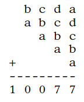

# &nbsp;

<h1 style="font-size:28pt">Skaitļu teorija: Igaunijas olimpiādes, 10.kl.</h1>

* **EE.PK** - Eesti Piirkonnavoor (Igaunijas reģionu kārta)
* **EE.LO** - Eesti Lõppvoor (Igaunijas gala/valsts kārta)
* <blue>**EE.LVS** - **Eesti Sügisene lahtine võistlus** (Igaunijas rudens atvērtais konkurss)</blue>
* **EE.LVT** - Eesti Talvine lahtine võistlus (Igaunijas ziemas atvērtais konkurss)

[Matemaatikaolümpiaadid ](http://www.math.olympiaadid.ut.ee/html/index.php)

# <lo-sample/> EE.LVS.2009.9_10.1

Atrast visus naturālos skaitļus $n$, kuriem 
$1 + 2^2 + 3^3 + 4^n$
ir vesela skaitļa kvadrāts.

<small>

* [alg.tra.pow.nest](#)
* [seq.gaps.squares](#)
* [alg.ineq.equations](#)
* [comb.full](#)

</small>

<!--
ru=
Найти все положительные целые числа $n$, при которых 
$1 + 2^2 + 3^3 + 4^n$
является квадратом некоторого целого числа.
-->

<!--
questionType=Find.All
genre=integer-equation
-->

## Attālumi starp pilniem kvadrātiem

* Arī $4^n = (2^n)^2$ ir pilns kvadrāts. 
* Tad $(2^n)^2 + 1 + 2^2 + 3^3 = (2^n)^2 +32$ vērtībām
$N = 2^n \geq 16$ noteikti nav pilns kvadrāts, jo nākamais
pilnais kvadrāts:
$$(N+1)^2 = N^2 + 2N+ 1 \geq N^2 + 33.$$
* Piemēram $4^4 = 16^2 = 256$. Bet jau nākamais 
pilnais kvadrāts $17^2 = 289$. Atstarpe ir $33$. 

## Ievietojam n=1,2,3

* Vērtība $n=4$ neder, kā jau redzējām, jo $288$ nav pilns kvadrāts.
* Vērtībām $n>4$ attālumi starp $4^n$ un nākamo pilno kvadrātu 
vēl vairāk pieaug (un ir vairāk par $33$). 
* Ievietojam visas $n=1,2,3$:
$$4^1 + 32 = 36;\;4^2 + 32 = 48;\;4^3 + 32 = 96.$$
* Secinām, ka tikai pie $n=1$ skaitlis $1 + 2^2 + 3^3 + 4^n = 36$ 
ir pilns kvadrāts.

# <lo-sample/> EE.LVS.2009.11_12.1

Vai eksistē pirmskaitlis $p$, kuram
$p^3 + 2008$ un $p^3 + 2010$ arī
ir pirmskaitļi?

<small>

* [mod.eq.contradict](#)

</small>

<!--
ru=
Найдётся ли простое число $p$, при котором 
$p^3 + 2008$ и $p^3 + 2010$ также
являются простыми числами?
-->

<!--
questionType=ProveDisprove.Exists
concepts=primes
-->

## Atlikumi

Kubiskām funkcijām $p^3$ mēdz būt izdevīgi aplūkot 
atlikumus, dalot ar $7$ vai $9$. Ir zināms, ka 

$$\left\{ \begin{array}{ll}
p^3 \equiv 0,1,6 & (\mbox{mod}\,7)\\
p^3 \equiv 0,1,8 & (\mbox{mod}\,9)\\
\end{array} \right.$$

## Pretrunas modulis

* Pieskaitāmie skaitļi $2008, 2010$ dod atlikumus $6$ un $1$, 
dalot ar $7$. 
* Lai neviena no summām $p^3 + 2008$, $p^3 + 2010$ nedalītos ar $7$, 
jābūt $p^3 \equiv 0$ jeb $p$ jādalās ar $7$. 
* Vienīgais pirmskaitlis, kas dalās ar $7$, ir pats $7$. 
* $7^3 + 2010 = 2353$. Šis skaitlis dalās ar $13$. 

*Secinājums.* Tāda pirmskaitļa $p$ nav.

# <lo-sample/> EE.LVS.2010.9_10.1

Atrast visus naturālos skaitļus $n$, kuriem 
visu viņu pozitīvo dalītāju reizinājums nav skaitļa $n$
pakāpe ar veselu kāpinātāju. 

<!--
ru=
Найти все положительные целые числа $n$, 
произведение всех положительных делителей которых не 
является степенью числа $n$ с целочисленным
показателем.
-->

<!--
questionType=Find.All
concepts=divisors
-->

# <lo-sample/> EE.LVS.2010.9_10.5

Atrast visus naturālu skaitļu pārus $(n,k)$, kuriem
$n! + (n + 1)! = k! + 120$.  
*Piezīme. Pieraksts $x!$ apzīmē reizinājumu $1 \cdot 2 \cdot \ldots \cdot x$.*

<!--
ru=
Найти все пары положительных целых чисел $(n, k)$, при которых
$n! + (n + 1)! = k! + 120$.  
Замечание. Запись $x!$ обозначает произведение $1 \cdot 2 \cdot \ldots \cdot x$.
-->

<!--
questionType=Find.All
concepts=factorial
-->

# <lo-sample/> EE.LVS.2010.11_12.1

Pierādīt, ka nevienu naturālu skaitli, starp kura cipariem pa 
vienai reizei atrodami cipari $2$ un $1$, bet visi pārējie cipari ir
nulles, nevar izteikt kā divu veselu skaitļu kvadrātu summu 
vai divu veselu skaitļu kubu summu. 

<!--
ru=
Доказать, что ни одно натуральное число, среди цифр которого 
встречаются по одному разу $2$ и $1$, а остальные все цифры нули, 
нельзя представить в виду суммы квадратов или суммы кубов двух целых чисел.
-->

<!--
questionType=Prove.NotExists
concepts=power-sums
-->

# <lo-sample/> EE.LVS.2010.11_12.2

Ar $P(x)$ apzīmēts polinoms ar veseliem koeficientiem, 
kas apmierina nosacījumu $P(2010) = P(201) = 2010$.  
a) Vai ir iespējams, ka $P(2011) = 2011$?  
b) Kāda ir mazākā iespējamā $P(2011)$ pozitīvā vērtība?

<!--
ru=
Пусть $P(x)$ –– многочлен с целочисленными коэффициентами, 
удовлетворяющий условию $P(2010) = P(201) = 2010$.  
а) Возможно ли, что $P(2011) = 2011$?  
б) Каково наименьшее возможное положительное значение $P(2011)$?
-->

<!--
questionType=ProveDisprove.Exists,Find.Min
concepts=integer-polynomial
-->

# <lo-sample/> EE.LVS.2011.9_10.1

Atrast visus četrciparu skaitļus, kam, nodzēšot
jebkuru ciparu, rodas trīsciparu skaitlis, kurš ir 
sākotnējā skaitļa dalītājs. 

<!--
ru=
Найти все четырёхзначные числа, при стирании любой 
цифры которых получается трёхзначное число, 
являющееся делителем изначального числа.
-->

<!--
questionType=Find.All
genre=digit-manipulation
-->

# <lo-sample/> EE.LVS.2011.11_12.1

Katram naturālam skaitlim $n$ apzīmēsim ar simbolu 
$a_n$ lielāko skaitļa $2$ pakāpi, ar ko dalās skaitlis $n$
(piemēram, $a_{2011} = 1$,
$a_{2012} = 4$). Pierādīt, ka patvaļīgiem naturāliem skaitļiem
$i$ un $j$, kur $i < j$, summa
$$\frac{1}{a_i} + \frac{1}{a_{i+1}} + \ldots + \frac{1}{a_j}$$
nav vesels skaitlis.

<small>

* [div.valu.change](#)

</small>

<!--
ru=
Для каждого положительного числа $n$ обозначим символом 
$a_n$ наибольшую степень числа $2$, на которую делится 
число $n$ (например, $a_{2011} = 1$,
$a_{2012} = 4$). Доказать, что для произвольных положительных 
целых чисел $i$ и $j$ , где $i < j$, сумма
$$\frac{1}{a_i} + \frac{1}{a_{i+1}} + \ldots + \frac{1}{a_j}$$
не является целым числом.
-->

<!--
questionType=Prove.ForAll
concepts=valuations
-->

# <lo-sample/> EE.LVS.2012.9_10.1

Cik ir tādu sešciparu naturālu skaitļu, kuru pierakstā ir 
cipari $0$, $1$, $2$, $3$, $4$ un $5$ katrs vienu reizi un 
kuri dalās ar katru savu ciparu, kas nav nulle.

<!--
ru=
Сколько всего таких шестизначных натуральных чисел, в записи которых
присутствуют цифры 0, 1, 2, 3, 4 и 5 каждая по одному разу, и которые
делятся на каждую свою цифру, отличную от нуля?
-->

<!--
questionType=Find.Count
-->

# <lo-sample/> EE.LVS.2012.9_10.2

No nulles atšķirīgi veseli skaitļi $a$, $b$ un $c$ apmierina nosacījumu
$\frac{1}{a}+\frac{1}{b}+\frac{1}{c}=0$.
Pierādīt, ka starp skaitļiem $a$, $b$, $c$ var atrast divus tādus
skaitļus, kuriem ir kopīgs dalītājs, kas lielāks par $1$.

<!--
ru=
Отличные от нуля целые числа $a$, $b$ и $c$ удовлетворяют условию
$\frac{1}{a}+\frac{1}{b}+\frac{1}{c}=0$.
Доказать, что среди чисел $a$, $b$, $c$ можно найти два таких числа, 
у которых найдётся общий делитель, который больше числа $1$.
-->

<!--
questionType=Prove.Exists
concepts=coprimes
-->

# <lo-sample/> EE.LVS.2012.9_10.3

Skolotājs pateica Jüri divus veselus skaitļus $a$ un $b$, kas nav nulles, 
turklāt $b$ dalās ar $a$. Jüri ir jāatrod tādu nenulles veselu 
skaitli $c$, ka $c$ dalās ar $b$, un visi kvadrātvienādojuma
$ax^2+bx+c=0$ atrisinājumi ir veseli skaitļi. Vai Jüri vienmēr 
var atrisināt šo uzdevumu?

<!--
ru=
Учитель сказал Юре два отличных от нуля целых числа $a$ и $b$, причём
$b$ делится на $a$. Юра должен найти такое отличное от нуля целое число
$c$, что $c$ делилось бы на $b$, и чтобы все решения квадратного уравнения
$ax^2+bx+c=0$ являлись целыми числами. Всегда ли у Юры есть 
возможность верно решить это задание?
-->

<!--
questionType=ProveDisprove.Other
concepts=quadratic-equation
-->

# <lo-sample/> EE.LVS.2012.11_12.1

Atrast visus naturālos skaitļus, kuri ir tieši $2013$ reizes lielāki 
par savu ciparu summu. 

<!--
ru=
Найти все положительные целые числа, которые ровно в $2013$ раз больше
суммы своих цифр.
-->

<!--
questionType=Find.All
concepts=sum-of-digits
-->

# <lo-sample/> EE.LVS.2012.11_12.2

Atrast visus atlikumus, kurus, dalot ar $6$, dod vesels
skaitlis $n$, kurš kādam veselam $m$ apmierina vienādību 
$n^3 = m^2 + m + 1$.

<!--
ru=
Найти все остатки, которые при делении на число $6$ может 
дать целое число $n$, которое для некоторого 
целого числа $m$ удовлетворяет равенству
$n^3 = m^2 + m + 1$.
-->

<!--
questionType=Find.All
concepts=remainder
-->

# <lo-sample/> EE.LVS.2012.11_12.3

Pierādīt, ka $(2n)! < n^{2n}$
katram veselam skaitlim $n \geq 3$.
*Piezīme. Par naturāla skaitļa $x$ faktoriālu $x!$ 
sauc reizinājumu $1\cdot{}2\cdot\ldots\cdot{}x$.*

<!--
Доказать, что $(2n)! < n^{2n}$
для каждого целого числа $n \geq 3$.
*Замечание. Факториалом $x!$ положительного целого числа $x$ называется
произведение $1\cdot{}2\cdot\ldots\cdot{}x$.*
-->

<!--
questionType=Prove.ForAll
concepts=factorial
genre=proving-inequality
-->

# <lo-sample/> EE.LVS.2013.9_10.1

Volli grib no naturāliem skaitļiem
$1, 2, 3, \ldots, 100$ izvēlēties $x$ skaitļus tā, 
lai tieši četri no tiem dalītos ar $4$, tieši 
četri dalītos ar $5$ un tieši trīs skaitļi dalītos ar $6$. 
Atrast mazāko skaitļa $x$ vērtību. 

<!--
ru=
Витя желает выбрать среди натуральных чисел 
$1, 2, 3, \ldots, 100$ всего $x$ чисел так, 
чтобы ровно четыре из них делились на число $4$, 
ровно четыре из них делились на число $5$ и ровно 
три из них делились на число $6$. Найти
наименьшее возможное значение числа $x$.
-->

<!--
questionType=Find.Min
-->

# <lo-sample/> EE.LVS.2013.9_10.2

Vienādiem burtiem atbilst vienādi cipari, 
bet dažādiem burtiem - dažādi cipari. 
Atrast visus veidus, kā aizstāt burtus ar cipariem tā, 
lai darbība izrādītos pareiza.

<!--
ru=
Одинаковым буквам соответствуют одинаковые цифры, 
а различным буквам − различные цифры. 
Найти все возможные способы замены букв цифрами так, 
чтобы данное действие было верным.
-->

<!--
questionType=Find.All
genre=cryptarithm
-->

# <lo-sample/> EE.LVS.2013.9_10.3

Doti naturāli skaitļi $a, b, c$, 
to lielākais kopīgais dalītājs ir $1$. 
Zināms, ka skaitļi $a+2b$ un $a^2 − b^2$
dalās ar $c$.
Pierādīt, ka arī $a-b$ dalās ar $c$.

<!--
ru=
Даны положительные целые числа $a, b, c$, 
наибольший общий делитель которых равен 1. 
Известно, что числа $a+2b$ и $a^2 − b^2$
делятся на число $c$.
Доказать, что на число $c$ делится также число $a − b$.
-->

<!--
questionType=Find.All
concepts=gcd
-->

# <lo-sample/> EE.LVS.2013.11_12.1

Atrast veselo daļu skaitlim 
$$A = \sqrt{2013 + \sqrt{2012 + \sqrt{2011 + \ldots \sqrt{2 +\sqrt{1}}}}}.$$
*Piezīme:* Par skaitļa $x$ veselo daļu sauc lielāko veselo skaitli, 
kurš nepārsniedz $x$.

<!--
ru=
Найти целую часть числа 
$$A = \sqrt{2013 + \sqrt{2012 + \sqrt{2011 + \ldots \sqrt{2 +\sqrt{1}}}}}.$$
Замечание: целой частью числа называется наибольшее 
целое число, которое не превышает данное число.
-->

<!--
questionType=Find.Only
concepts=square-root
-->

# <lo-sample/> EE.LVS.2013.11_12.2

Atrast visus naturālos skaitļus $n$, kuriem atradīsies tādi 
pirmskaitļi $p$ un $q$, ka 
$$p(p + 1) + q(q + 1) = n(n + 1).$$

<!--
ru=
Найти все натуральные числа $n$, при которых найдутся такие простые
числа $p$ и $q$, что
$$p(p + 1) + q(q + 1) = n(n + 1).$$
-->

<!--
questionType=Find.All
concepts=primes
-->

# <lo-sample/> EE.LVS.2014.9_10.1

Atrast tādu vismazāko naturālo $n$, kuram katrs no cipariem 
no $0$ līdz $9$ būtu decimālpierakstā kaut vienam no 
sešiem pēc kārtas sekojošiem skaitļiem
$n+1$, $n+2$, $n+3$, $n+4$, $n+5$ 
un $n+6$.

<!--
ru=
Найти такое наименьшее натуральное число $n$, при котором каждая из
цифр от $0$ до $9$ присутствовала бы в записи хотя бы одного 
из шести последовательных чисел $n+1$, $n+2$, $n+3$, $n+4$, $n+5$ 
и $n+6$.
-->

<!--
questionType=Find.Min
genre=digit-manipulation
-->

# <lo-sample/> EE.LVS.2014.9_10.3

Vispirms uz lapiņas uzraksta skaitli $1$. 
Katrā solī zem pēdējā uzrakstītā skaitļa uzraksta 
vai nu skaitli, kurš par to tieši divreiz lielāks, 
vai arī skaitli, kuru iegūst pēdējā uzrakstītajā skaitlī 
mainot vietām ciparus (ņemot vērā, ka skaitļi 
nevar sākties ar ciparu $0$). Vai var gadīties, ka 
pēc galīga skaita šādu soļu uz lapiņas būs uzrakstīts  
a) skaitlis $1000000000$?  
b) skaitlis $9876543210$?

<!--
ru=
Сначала на листок бумаги записывают число 1. 
Каждым шагом под последним записанным числом записывают 
либо число, которое ровно в два
раза больше этого числа, либо число, полученное 
перестановкой цифр записанного последним числа 
(учитывая, что числа не могут начинаться с
цифры 0). Возможно ли после конечного числа таких шагов записать на
этом листке бумаги  
а) число $1000000000$?  
б) число $9876543210$?
-->

<!--
questionType=ProveDisprove.Exists
genre=digit-manipulation
-->

# <lo-sample/> EE.LVS.2014.9_10.4

Kurš no skaitļiem lielāks: $2^{2014}$ vai
$3^{303} \cdot 4^{404} \cdot 5^{505}$?

<!--
ru=
Какое из чисел больше, $2^{2014}$ или 
$3^303 \cdot 4^{404} \cdot 5^{505}$?
-->

<!--
questionType=Find.Only
genre=proving-inequality
-->

# <lo-sample/> EE.LVS.2014.11_12.1

Atrast visus tos naturālos skaitļus $n$, kuriem 
vienādojumam 
$(x^2+y^2)^n = (xy)^{2014}$ 
ir atrisinājums naturālos skaitļos.

<!--
ru=
Найти все такие положительные целые числа $n$, 
при которых уравнение
$(x^2+y^2)^n = (xy)^{2014}$ имеет решение в положительных целых числах.
-->

<!--
questionType=Find.All
genre=integer-equation
-->

# <lo-sample/> EE.LVS.2015.9_10.1

Skaitlī 
$$0,123456789101112\;\ldots\;998999$$
pēc komata ir visi pozitīvie skaitļi no $1$ līdz $999$.
Atrast šī skaitļa $2015$-to ciparu pēc komata.

<!--
ru=
В числе
$$0,123456789101112\;\ldots\;998999$$
после запятой идут подряд все положительные целые числа от $1$ до $999$.
Найти $2015$-ую после запятой цифру этого числа.
-->

<!--
questionType=Find.Only
-->

# <lo-sample/> EE.LVS.2015.9_10.2

Nosauksim naturālu skaitli $n$ par interesantu, ja eksistē 
naturāls skaitlis $m$ un naturāli skaitļi $a$ un $b$, kas
mazāki par $m$, kuriem $\frac{m^2}{ab}=n$. Piemēram, skaitlis $10$ ir interesants, 
jo $\frac{20^2}{4\cdot{}10}=10$.  
Atrast vismazāko interesanto skaitli.

<!--
ru=
Назовём положительное целое число $n$ интересным, если существуют 
положительное целое число $m$ и положительные целые числа $a$ и $b$ меньшие
чем $m$, при которых $\frac{m^2}{ab}=n$. Например, число $10$ интересное, так как
$\frac{20^2}{4\cdot{}10}=10$.  
Найти наименьшее интересное число.
-->

<!--
questionType=Find.Min
-->

# <lo-sample/> EE.LVS.2015.9_10.3

Katrā no trim gadījumiem, noskaidrot, vai 
eksistē divciparu skaitlis $n$, kurš nebeidzas ar nulli un apmierina attiecīgo nosacījumu:  
a) visi skaitļi, ko iegūst, ievietojot vienu vai dažas nulles starp tā cipariem, 
dalās ar sākotnējo skaitli.  
b) neviens skaitlis, ko iegūst, ievietojot vienu vai dažas nulles starp tā cipariem, 
nedalās ar sākotnējo skaitli.  
c) daži no skaitļiem, ko iegūst, ievietojot vienu vai dažas nulles starp tā cipariem, 
dalās, bet daži nedalās ar sākotnējo skaitli.

<!--
ru=
Существует ли не оканчивающееся на нуль двузначное число n такое, что  
а) все числа, получаемые при добавлении одного или нескольких нулей
между его цифрами, делятся на него?  
б) ни одно число, получаемое при добавлении одного или нескольких
нулей между его цифрами, не делится на него?  
в) какие-то из чисел, получаемых при добавлении одного или нескольких 
нулей между его цифрами, делятся, а какие-то не делятся на него?
-->

<!--
genre=digit-manipulation
questionType=ProveDisprove.Exists
-->

# <lo-sample/> EE.LVS.2015.9_10.6

Cik ir piecciparu skaitļu, kas dalās ar $8$ un nesatur savā pierakstā ciparu nulle?

<!--
ru=
Сколько пятизначных делящихся на 8 чисел не имеют в своей записи цифры нуль?
-->

<!--
questionType=Find.Count
-->

# <lo-sample/> EE.LVS.2015.11_12.1

a) Atrast lielāko skaitli, kurš ir četru dažādu divciparu skaitļu lielākais kopīgais dalītājs.  
b) Atrast lielāko skaitli, kurš ir četru dažādu divciparu skaitļu mazākais kopīgais dalāmais.

<!--
ru=
а) Найти наибольшее число, являющееся наибольшим общим делителем
каких-то четырёх различных двузначных чисел.  
б) Найти наибольшее число, являющееся наименьшим общим кратным
каких-то четырёх различных двузначных чисел.
-->

<!--
concepts=lcm,gcd
questionType=Find.Max
-->

# <lo-sample/> EE.LVS.2015.11_12.3

Dots naturāls skaitlis $n$, kam gan $n+1$, $n+3$, $n+7$ un $n+9$, gan arī
$n+31$, $n+33$, $n+37$ un $n+39$ - ir pirmskaitļi. Atrast atlikumu, dalot
skaitli $n$ ar $210$.

<!--
ru=
Дано натуральное число $n$ такое, что как $n+1$, $n+3$, $n+7$ и $n+9$, так и
$n+31$, $n+33$, $n+37$ и $n+39$ − простые числа. Найти остаток от деления
числа $n$ на $210$.
-->

<!--
concepts=primes,remainder
questionType=Find.Only
-->

# <lo-sample/> EE.LVS.2016.9_10.2

Uz tāfeles uzrakstītas $11$ daļas, kuru skaitītāji un saucēji ir
visi naturālie skaitļi no $1$ līdz $22$. Kāds lielākais iespējamais
skaits no šīm daļām var būt veseli skaitļi? 

<!--
ru=
На доске записано $11$ дробей, числителями и знаменателями которых 
являются все целые числа от $1$ до $22$. Каково наибольшее возможное 
количество дробей, значения которых являются целыми числами?
-->

<!--
questionType=Find.Max
-->

# <lo-sample/> EE.LVS.2016.9_10.3

Juku izvirzīja matemātiskā pulciņā šādu hipotēzi: Vienmēr, 
ja divu savstarpēju pirmskaitļu $x$ un $y$ reizinājums 
dalās ar citu divu savstarpēju pirmskaitļu $a$ un $b$ reizinājumu, 
tad vismaz viens no skaitļiem $x$ un $y$ dalās ar $a$ vai ar $b$. 
Vai Juku hipotēze ir patiesa?  
*Piezīme:* Divus veselus skaitļus $a$ un $b$ sauc par savstarpējiem 
pirmskaitļiem, ja to lielākais kopīgais dalītājs $\mbox{LKD}(a, b) = 1$.

<!--
ru=
Юра выдвинул на математическом кружке следующую гипотезу: всегда,
когда произведение двух взаимно простых целых чисел $x$ и $y$ делится на
произведение двух взаимно простых целых чисел $a$ и $b$, то хотя бы одно
из чисел $x$ и $y$ делится на $a$ или на $b$. Выполняется ли гипотеза Юры?
Примечание. Говорят, что целые числа $a$ и $b$ взаимно просты, если
$\mbox{НОД}(a, b) = 1$.
-->

<!--
concepts=coprimes
questionType=ProveDisprove.ForAll
-->

# <lo-sample/> EE.LVS.2016.9_10.6

Vai eksistē tāds naturāls skaitlis $n$, kuram ir tieši $9$ pozitīvi 
dalītāji, bet visus tā dalītājus var novietot tabulā 
$3\times{}3$ tā, lai katrā rindiņā, katrā kolonnā un abās diagonālēs 
skaitļu reizinājums būtu viens un tas pats?

<!--
ru=
Найдётся ли такое положительное целое число $n$, у которого ровно 
$9$ положительных делителей, а все его делители можно расположить 
в таблице $3\times{}3$ таким образом, что произведение чисел каждой строки, каждого
столбца и обеих диагоналей будет одинаковым?
-->

<!--
genre=magic-configuration
questionType=ProveDisprove.Exists
-->

# <lo-sample/> EE.LVS.2016.11_12.2

Definējam virkni $a_1=1$ un $a_n = n \cdot a_{\lfloor{}n/2\rfloor}$, 
visiem $n>1$. Pierādīt, ka $a_n>n^2$ katram $n \geq 12$.  
*Piezīme:* Skaitļa $x$ veselā daļa $\lfloor x \rfloor$ 
ir lielākais veselais skaitlis, kas 
nepārsniedz $x$. Piemēram, $\lfloor 4,6 \rfloor = 4$. Tātad $a_2 = 2 \cdot a_1$, 
$a_3 = 3 \cdot a_1$, $a_4 = 4 \cdot a_2$, 
$a_5 = 5 \cdot a_2$ utt.

<!--
ru=
Зададим $a_1=1$ и $a_n = n \cdot a_{\lfloor{}n/2\rfloor}$
для каждого $n>1$. Доказать, что $a_n>n^2$
для каждого $n \geq 12$.
*Примечание.* Целая часть $\lfloor x \rfloor$ числа $x$ − это наибольшее целое число, не
превышающее числа $x$. Например, $\lfloor 4,6 \rfloor = 4$. Т.е. $a_2 = 2 \cdot a_1$, 
$a_3 = 3 \cdot a_1$, $a_4 = 4 \cdot a_2$, 
$a_5 = 5 \cdot a_2$ и т.д.
-->

<!--
concepts=floor
genre=prove-inequality
questionType=Prove.ForAll
-->

# <lo-sample/> EE.LVS.2016.11_12.3

Kati un Peeter spēlē sekojošu spēli. Vispirms Kati uzraksta uz tāfeles
kādu naturālu skaitli $a > 2016$. Pēc tam Peeter pieraksta jaunus skaitļus: 
katrā solī viņš pievieno skaitli $2016b + 1$, kur $b$
− lielākais skaitlis, kas tobrīd ir uz tāfeles. Peeter uzvar, 
ja viņš kādā solī uzraksta uz tāfeles skaitli, kas dalās ar $2017$. Ja viņš to nevar izdarīt, 
tad uzvar Kati. Vai Kati var uzvarēt, un ja jā, tad kāds ir mazākais skaitlis $a$, kas
viņai jāuzraksta uz tāfeles, lai uzvarētu? 

<!--
ru=
Катя и Петя играют в следующую игру. Вначале Катя записывает на доске
какое-то целое положительное число $a > 2016$. Затем Петя дописывает
на доску числа, на каждом шаге добавляя туда число $2016b + 1$, где $b$
− наибольшее на данный момент число на доске. Петя выиграет, если на
каком-то шаге запишет на доске число, делящееся на $2017$. Если он это
сделать не может, то выигрывает Катя. Может ли Катя выиграть игру и
если да, то каково наименьшее число $a$, которое она должна записать на
доске, чтобы выиграть?
-->

<!--
genre=game
questionType=Algorithm,Find.Min
-->

# <lo-sample/> EE.LVS.2016.11_12.6

Atrast visus naturālos skaitļus $n$, kuriem visus $n$ pozitīvos dalītājus
var bez atkārtošanās izrakstīt taisnstūrveida tabulā tā, lai katrā tabulas 
šūnā būtu tieši viens dalītājs, skaitļu summas visās tabulas rindiņās ir vienādas, 
un arī skaitļu summas visās tabulas kolonnās ir vienādas. 

<!--
ru=
Найти все целые положительные числа $n$, при которых все 
положительные делители числа $n$ можно без повторений расположить 
в прямоугольную таблицу так, что в каждой ячейке находится ровно один делитель,
сумма чисел в каждой строке одинакова, а также сумма чисел в каждом
столбце одинакова.
-->

<!--
genre=magic-configuration
concepts=divisors
questionType=Find.All
-->

# <lo-sample/> EE.LVS.2017.9_10.3

Mari ieraksta burtnīcā $8$ pirmskaitļus, kas mazāki par $200$ (starp 
šiem pirmskaitļiem var būt arī atkārtojumi). Pirmajam 
pirmskaitlim viņa pieskaita $1$, otrajam $2$, trešajam $3$, utt., pēdējam $8$. 
Pēc tam visas $8$ summas sareizina. Atrast lielāko $2$ pakāpi, ar kuru var 
dalīties iegūtais reizinājums.

<!--
ru=
Маша записывает в тетради $8$ простых чисел, меньших чем $200$ (среди
простых чисел могут быть повторяющиеся). Далее к первому простому
числу она прибавляет $1$, ко второму $2$, к третьему $3$ и т.д. 
пока не прибавит к последнему $8$, затем перемножает все полученные $8$ сумм. Найти
наибольшую степень числа $2$, на которую может делится полученное произведение.
-->

<!--
concepts=primes,valuations
questionType=Find.Max
-->

# <lo-sample/> EE.LVS.2017.9_10.4

Cik veidos zīmējumā var aizstāt burtus ar cipariem tā, 
lai rastos pareiza darbība? 
Vienādus burtus jāaizstāj ar vienādiem cipariem, 
dažādus burtus - ar dažādiem cipariem.

<!--
ru=
Сколькими способами можно на рисунке заменить буквы цифрами так, 
чтобы получилось корректное действие? Одну и ту же букву нужно заменять на ту же
цифру, разные буквы на разные цифры.
-->

<!--
genre=cryptarithm
questionType=Find.Count
-->

# <lo-sample/> EE.LVS.2017.11_12.2

Atrast lielāko naturālo skaitli, kas nepārsniedz $500$ un kuram 
nevar atrast citu naturālu skaitli, kas ir mazāks par $500$ un kurš
dalītos ar vairāk dažādiem pirmskaitļiem.

<!--
ru=
Найти наибольшее целое положительное число меньше чем 500, 
для которого не найдётся ни одного целого положительного числа меньше чем
$500$, имеющего больше различных простых делителей.
-->

<!--
concepts=divisors,primes
questionType=Find.Max
-->

# <lo-sample/> EE.LVS.2017.11_12.3

Par racionālu skaitļu $u$ un $v$ mediānu sauc skaitli $x = \frac{a + c}{b + d}$, kur
$\frac{a}{b}$ un $\frac{c}{d}$ Ir attiecīgi skaitļu $u$ un $v$ izteiksmes nesaīsināmu daļu veidā. 
Pierādīt, ka jebkuriem dažādiem pozitīviem racionāliem skaitļiem $u$ un $x$ var atrast
bezgalīgi daudzus pozitīvus racionālus skaitļus $v$, kam $x$ ir $u$ un $v$ mediāna.

<!--
ru=
Медианта рациональных чисел $u$ и $v$ − это число $x = \frac{a + c}{b + d}$, где
$\frac{a}{b}$ и
$\frac{c}{d}$
являются соответственно представлениями чисел $u$ и $v$ в виде несократимых дробей.
Доказать, что для любых различных положительных рациональных чисел
$u$ и $x$ можно найти бесконечно много положительных рациональных чисел 
$v$ таких, что $x$ будет медиантой $u$ и $v$.
-->

<!--
concepts=mediant-of-fractions
questionType=Prove.Other
-->

# <lo-sample/> EE.LVS.2018.9_10.1

Skaitļus $1,2,\ldots,2018$ pieraksta vienu pēc otra bez atstarpēm, 
turklāt no pieraksta izlaiž visus ciparus $8$. Vai iegūtais skaitlis
dalās ar $3$?

<!--
ru=
Числа $1,2,\ldots,2018$ записываются одно за другим без промежутков,
причём все цифры $8$ при записи пропускаются. Делится ли полученное число
на $3$?
-->

<!--
questionType=Find.Only
-->

# <lo-sample/> EE.LVS.2018.9_10.3

Naturāli skaitļi $n$, $m$ un $k$ ir tādi, ka $\mbox{MKD}(m,k)$ dalās ar
$n$, bet $\mbox{MKD}(n,k)$ dalās ar $m$. Pierādīt, ka
$n\cdot\mbox{LKD}(m,k) = m\cdot\mbox{LKD}(n,k)$.  
*Piezīme.* $\mbox{LDK}(a,b)$ apzīmē skaitļu $a$ un $b$ lielāko kopīgo dalītāju, bet
$\mbox{MKD}$ apzīmē skaitļu $a$ un $b$ mazāko kopīgo dalāmo. 

<!--
ru=
Целые положительные числа $n$, $m$ и $k$ таковы, что $\mbox{НОК}(m,k)$ делится на
$n$, а $\mbox{НОК}(n,k)$ делится на $m$. Доказать, что 
$n\cdot\mbox{НОД}(m,k) = m\cdot\mbox{НОД}(n,k)$.  
*Примечание.* $\mbox{НОД}(a,b)$ обозначает наибольший общий делитель чисел $a$
и $b$, а $\mbox{НОК}(a,b)$ – наименьшее общее кратное чисел $a$ и $b$.
-->

<!--
concepts=lcm,gcd
questionType=Prove.ForAll
-->

# <lo-sample/> EE.LVS.2018.9_10.4

Brālim Jüri ir māsa Mari. Viņu māte gaida dvīņus. Ja piedzimtu
abi puisīši, tad Jüri būs tieši $k$ reizes vairāk brāļu nekā māsu. 
Ja piedzimtu abas meitenītes, tad Mari būs $l$ reizes mazāk māsu nekā brāļu. 
Tomēr piedzima viens puisītis un viena meitenīte. Cik reizes piedzimušajam 
puisītim ir vairāk brāļu nekā māsu? Un cik reizes piedzimušajai meitenītei
mazāk māsu kā brāļu?

<!--
ru=
Мама Юры и Маши ждёт двойняшек. Если родятся мальчики, то у Юры
будет ровно в $k$ раз больше братьев, чем сестёр. Если родятся девочки, то
у Маши будет ровно в $l$ раз меньше сестёр, чем братьев. Однако подходит
время и рождаются мальчик и девочка. Во сколько раз у родившегося
мальчика больше братьев, чем сестёр, и во сколько раз у родившейся
девочки меньше сестёр, чем братьев?
-->

<!--
genre=word-problem
questionType=Find.All
-->

# <lo-sample/> EE.LVS.2018.9_10.6

Skaitļus no $1$ līdz $9$ ieraksta tabulā $3 \times 3$ rūtiņas tā, ka
ikvienā rūtiņā ir viens skaitlis un skaitļi neatkārtojas.
Atrast lielāko iespējamo skaitu ar tādu rūtiņu pāriem, kam ir 
kopīga mala un kur skaitlis no vienas rūtiņas dalās ar skaitli no otras rūtiņas.

<!--
ru=
Числа от $1$ до $9$ записываются в ячейки таблицы $3 \times 3$ 
так, что в каждой ячейке ровно одно число, причём числа не повторяются. 
Найти наибольшее возможное число пар имеющих общую сторону ячеек, 
где число из первой ячейки делится на число из второй ячейки.
-->

<!--
genre=fill-in-table
questionType=Find.Max
-->

# <lo-sample/> EE.LVS.2018.11_12.3

Bēniņos atrastam kalkulatoram ir taustiņi no $1$ līdz $9$ 
un viens darbības taustiņš $\otimes$, kur 
$x \otimes y$ apzīmē skaitli $x+\frac{x\cdot{}y}{x-y}$. 
Pirmoreiz nospiežot darbības taustiņu, uz ekrāna paliek 
līdz tam ievadītais skaitlis, bet pēc katras nākamās 
šī taustiņa nospiešanas uz ekrāna parādās skaitlis $x \otimes y$, 
kur $y$ - vesels skaitlis, kurš ievadīts tieši pirms iepriekšējās darbības 
taustiņa nospiešanas, bet $x$ - skaitlis, kurš bija uz ekrāna 
līdz skaitļa $y$ ievadīšanai. Piemēram, ja lietotājs nospiež taustiņus 
secībā $2$, $2$, $\otimes$, 
$3$, $3$, $\otimes$, $4$, $4$, $\otimes$, 
tad uz ekrāna būs attiecīgi redzami skaitļi $2$, $22$, $22$, $3$, $33$, $-44$
(darbības $22 \otimes 33$ rezultāts), $4$, $44$, $-22$ 
(darbības $(-44) \otimes 44$ rezultāts).
Ja lietotājs nospiež darbības taustiņu pašā sākumā, nospiež to divreiz pēc 
kārtas vai pieļauj tādas darbības izpildi, kuras vērtība nav vesels skaitlis, 
tad kalkulators salūst. Vai uz šī kalkulatora var uz ekrāna iegūt skaitli $2018$? 

<!--
ru=
У найденного на чердаке калькулятора есть клавиши от $1$ до $9$ и клавиша
действия $\otimes$, где $x \otimes y$ обозначает число $x+\frac{x\cdot{}y}{x-y}$. 
При первоначальном
нажатии клавиши действия на экране остаётся введённое до этого число,
а после каждого следующего нажатия на экране появляется число $x \otimes y$,
где $y$ – целое число, введённое непосредственно перед нажатием клавиши
действия, а $x$ – число, бывшее на экране до ввода числа $y$. Например,
если пользователь нажимает клавиши в порядке $2$, $2$, $\otimes$, 
$3$, $3$, $\otimes$, $4$, $4$, $\otimes$, 
то на экране соответственно будут видны числа $2$, $22$, $22$, $3$, $33$, $-44$
(результат действия $22 \otimes 33$), $4$, $44$, $-22$ 
(результат действия $(-44) \otimes 44$).
Если пользователь нажимает клавишу действия в самом начале, нажимает
её два раза подряд или допускает выполнение действия, значения которого
не является целым числом, то калькулятор выходит из строя. Можно ли
на этом калькуляторе получить на экране число $2018$?
-->

<!--
genre=procedure
questionType=Algorithm,ProveDisprove.Exists
-->

