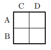
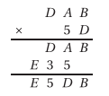

# &nbsp;

<h1 style="font-size:28pt">Skaitļu teorija: Igaunijas olimpiādes, 10.kl.</h1>

* <blue>**EE.PK** - **Eesti Piirkonnavoor** (Igaunijas reģionu kārta)</blue>
* **EE.LO** - Eesti Lõppvoor (Igaunijas gala/valsts kārta)
* **EE.LVS** - Eesti Sügisene lahtine võistlus (Igaunijas rudens atvērtais konkurss)
* **EE.LVT** - Eesti Talvine lahtine võistlus (Igaunijas ziemas atvērtais konkurss)

[Matemaatikaolümpiaadid ](http://www.math.olympiaadid.ut.ee/html/index.php)

# <lo-sample/> EE.PK.1994.7B.2 

Atrast mazāko naturālo skaitli, kura pierakstā ir tikai cipari $5$ un $9$, 
kurš satur tos vienādā skaitā un dalās ar $5$ un $9$. 

<small>

* [notation.divrules.3or9.divides](#)
* [notation.divrules.pow2or5.divides](#)

</small>

<!--
concepts=divisibility,decimal-notation
questionType=Find.Min
-->

## Skaitļa īpašības

* Skaitlis ir nepāru, jo tajā nav pāru ciparu
* Skaitlim jābeidzas ar $5$, jo tas dalās ar $5$
* Skaitļa ciparu summai jādalās ar $9$, jo tas dalās ar $9$. 
Tātad tajā jābūt vismaz deviņiem cipariem "5". 
* Cipari "5", kur iespējams, jāliek skaitļa sākumā, lai 
būtu iespējami mazāks.

Atbilde: `555555559999999995`.

# <lo-sample/> EE.PK.1994.8B.2 

Atrast visus veselos skaitļus $n$, kuriem skaitlis 
${\displaystyle \frac{n^2 - 4}{n^2 - 1}}$ ir vesels.

<!--
concepts=integer-polynomials,divisibility
questionType=Find.All
-->

# <lo-sample/> EE.PK.1995.7B.2

Atrast mazāko pirmskaitli, kas dod atlikumu $1$, dalot
ar katru no skaitļiem $3$, $4$, $5$ un $8$. 

<!--
concepts=primes,remainder
questionType=Find.Min
-->

# <lo-sample/> EE.PK.1995.8B.3

Vai var aizpildīt tabulu, kas satur

1. $4 \times 4$ rūtiņas
2. $5 \times 5$ rūtiņas

ar veseliem skaitļiem tā, lai skaitļu reizinājums katrā kolonnā 
būtu pozitīvs, bet katrā rindiņā – negatīvs?

<!--
genre=fill-in-table
questionType=ProveDisprove.Exists
-->

# <lo-sample/> EE.PK.1996.7B.3

Kādus ciparus jāieraksta piecciparu skaitlim $517\ast\ast$ 
zvaigznīšu vietā, lai iegūtais skaitlis dalītos vienlaikus
ar skaitļiem $6$, $7$ un $9$?

<!--
concepts=divisibility
genre=digit-manipulation
questionType=Find.All
-->

# <lo-sample/> EE.PK.1996.8B.3

Trīs skolnieku vecumi ir veseli skaitļi, kuru reizinājums ir $1872$. 
Pie tam pēc vecuma vidējais skolēns ir vecāks par jaunāko 
par tikpat daudz gadiem, par cik viņš jaunāks par pašu vecāko. 
Atrast skolēnu vecumus. 

<!--
concepts=arithmetic-progression
genre=word-problem
questionType=Find.All
-->

# <lo-sample/> EE.PK.1996.9B.2

Atrast skaitli $c$, ja 
$(a+b):(b+c):(c+a)=6:7:8$ un $a+b+c=14$. 

<!--
concepts=proportion
questionType=Find.All
-->

# <lo-sample/> EE.PK.1997.7B.1

Atrast naturālus skaitļus $x$, $y$ un $z$, lai izpildītos vienādība
$$x + \frac{1}{y + \frac{1}{z}} = 1\frac{3}{7}.$$

<!--
genre=integer-equation
questionType=Find.All
-->

# <lo-sample/> EE.PK.1997.8B.1

Veselam pozitīvam skaitlim $a$ visi cipari ir dažādi. 
No šī skaitļa cipariem var izveidot sešus dažādus divciparu skaitļus, 
kuriem desmitu cipars atšķiras no vienu cipara. 
Visu šo sešu skaitļu summa ir divreiz lielāka nekā skaitlis $a$. 
Atrast skaitli $a$. 

<!--
concepts=combinations
genre=digit-manipulation
questionType=Find.All
-->

# <lo-sample/> EE.PK.1997.8B.1

Dalot veselu skaitli $N \geq 5$ ar $3$, 
rodas atlikums $2$. Pierādīt, ka skaitļa $N$
kvadrātu nevar izteikt kā pirmskaitļa un 
kāda vesela skaitļa kvadrāta summu.

<!--
concepts=primes,remainder,square
questionType=Prove.Other
-->

# <lo-sample/> EE.PK.1998.7B.2

Trīsciparu skaitļa pēdējo ciparu pārliek pirmajā vietā, nemainot
pārējo ciparu secību. Šādi iegūtais skaitlis ir lielāks par $400$ 
par tikpat daudz, par cik sākotnējais skaitlis ir mazāks par $400$. 
Atrast sākotnējo skaitli, ja zināms, ka tas beidzas ar ciparu $4$. 

<!--
concepts=arithmetic-progression
genre=digit-manipulation
questionType=Find.All
-->

# <lo-sample/> EE.PK.1998.7B.3

Nošu krājuma lapas ir nesastiprinātas; visas tā lappuses,
sākot ar pirmo, sanumurētas ar skaitļiem $1,2,3,4,\ldots$. 
Juku saskaitīja nejauši izraudzītām $15$ lapām visus
$30$ lappušu numurus un ieguva skaitli $1998$. 
Pēc tam Juku saskaitīja numurus pirmo $10$ krājuma lapu 
lappusēm un ieguva $210$. 

1. Vai Juku saskaitīja pareizi pirmajā reizē? 
2. Vai Juku saskaitīja pareizi otrajā reizē?

<!--
concepts=arithmetic-progression
questionType=ProveDisprove.Exists
-->

# <lo-sample/> EE.PK.1998.8B.1

Trīsciparu skaitlī nodzēsa simtu ciparu un ieguva divciparu skaitli, kurš 
septiņas reizes mazāks par sākotnējo skaitli. Atrast visus šādus 
trīsciparu skaitļus. 

<!--
genre=digit-manipulation
questionType=Find.All
-->

# <lo-sample/> EE.PK.1998.9B.1

Atrast visus pirmskaitļus, ar kuriem dalās starpība
$$6 \cdot 66 \cdot 666 \cdot 6666 - 
4 \cdot 44 \cdot 444 \cdot 4444.$$

<!--
concepts=primes
questionType=Find.All
-->

# <lo-sample/> EE.PK.1999.7B.1

No viena mēneša tabulkalendāra (datumi attēloti pa vienai nedēļai katrā rindiņā)
izgrieza kvadrātu ar izmēriem $2 \times 2$ dienas.
Šo četru skaitļu summa dalījās ar $16$. Kāds skaitlis var 
būt labajā apakšējā kvadrāta stūrī?

<!--
genre=fill-in-table
questionType=Find.All
-->

# <lo-sample/> EE.PK.1999.7B.3

Kivisillu (*Kivisilla*) ģimene satiekas pirmajā jūlijā - reizi trijos gados. 
Nesenākajā tikšanās reizē ģimenes locekļi teica par savu vecumu sekojošo:  
Marija (*Mari*): Man šobrīd ir tik gadu, cik bija Jurim iepriekšējā tikšanās reizē.  
Juris (*Jüri*): Nākamajā tikšanās reizē man būs tik gadu, cik tagad Pēterim.  
Pēteris (*Peeter*): Iepriekšējā tikšanās reizē Kārlis bija par mani tieši trīs 
reizes vecāks.  
Kārlis (*Karl*) Tagad esmu tieši divreiz jaunāks par mūsu pašu vecāko radinieci, 
tanti Lēnu (*Leena*).  
Cik gadu bija Marijai, Jurim, Pēterim, Kārlim un tantei Lēnai nesenākajā tikšanās reizē, 
ja viņu vecumu summa ir $165$? (Vecumu nosaka pilnos gados.)

<!--
genre=word-problem
questionType=Find.All
-->

# <lo-sample/> EE.PK.1999.8B.3

Pazīstamais matemātiķis-izgudrotājs $N$ uzrakstīja uz vienas 
kartītes vienu trīsciparu skaitli, bet uz otras kartītes citu 
trīsciparu skaitli. Novietojot šīs kartītes blakus, viņš 
ieguva sešciparu skaitli. Samainot kartītes vietām, $N$ pārsteigts
ievēroja, ka šādi iegūtais sešciparu skaitlis ir lielāks par pirmo 
tieši sešas reizes. Kādus divus trīsciparu skaitļus uzrakstīja $N$? 

<!--
genre=digit-manipulation
questionType=Find.All
-->

# <lo-sample/> EE.PK.1999.9B.3

Vai eksistē skaitlis, kura pierakstā ir 
$138$ cipari "1", $24$ cipari "6" 
un $11$ cipari "9", un kas ir kāda vesela 
skaitļa kvadrāts?

<!--
concepts=full-square,decimal-notation
questionType=ProveDisprove.Exists
-->

# <lo-sample/> EE.PK.2000.7B.3

Pirms Annika (*Annika*), Tomijs (*Tommy*) 
un Pepija (*Pipi*) aizbrauca no Kurunuruvutisāres 
(*Kurrunurruvutisaare*), 
kapteinis Garzeķe (*Pikksukk*) lika iznest no bagātību alas
$35$ kastes ar kārtas numuriem $1,2,3,\ldots,35$, 
kur katras kastes kārtas numurs atbilda pērļu skaitam kastē. 
Tomijs ieguva visas kastes, kuru numurs dalījās ar trīs, 
bet nedalījās ne ar četri, ne ar pieci. 
Annika ieguva visas kastes, kuru numurs dalījās ar četri, 
bet nedalījās ne ar trīs, ne ar pieci. Pepija ieguva visas
kastes, kuru numurs dalījās ar pieci, bet nedalījās ne ar 
trīs, ne ar četri. Pēc tam kapteinis Garzeķe iztukšoja atlikušās
kastes, kuru numurs dalījās ar kādu no skaitļiem: 
trīs, četri vai pieci, un to saturu izdalīja bērniem tā, lai 
beigās katram būtu vienāds pērļu skaits. Cik pērļu kapteinis
pielika klāt katram no bērniem? 

<!--
concepts=divisibility
genre=word-problem
questionType=Find.All
-->

# <lo-sample/> EE.PK.2000.8B.1

Atrast visus tos naturālos skaitļus, kuriem ciparu reizinājums 
ir $2000$, starp cipariem nav cipara $1$ un jebkuriem 
diviem blakus cipariem, cipars pa kreisi nepārsniedz ciparu pa labi. 

<!--
concepts=monotonic-sequence
genre=string-counting
questionType=Find.All
-->

# <lo-sample/> EE.PK.2000.9B.1

Atrast visus pirmskaitļu četriniekus $(p,q,s,t)$, 
kas apmierina vienādojumu sistēmu:
$$\left\{
\begin{array}{l}
p + q = s\\
2p + q = t.
\end{array} \right.$$

<!--
concepts=primes,system-of-equations
questionType=Find.All
-->

# <lo-sample/> EE.PK.2001.7B.3

Zināms, ka $a$, $b$ un $10a+b$ ir pirmskaitļi un $a \leq b < 10$. 
Atrast visas iespējamās reizinājuma $ab \cdot (10+b)$ vērtības. 

<!--
concepts=primes
questionType=Find.All
-->

# <lo-sample/> EE.PK.2001.8B.1

Ja Tāvi (*Taavi*) datorā ievada naturālu skaitli $n$, tad
dators sareizinās visus naturālos skaitļus no $1$ līdz $n$ 
un parādīs rezultātu uz ekrāna. Piemēram, ievadot skaitli $6$ 
dators aprēķinās reizinājumu $1 \cdot 2 \cdot 3 \cdot 4 \cdot 5 \cdot 6$
un parādīs uz ekrāna skaitli $720$. Ja atrastais reizinājums 
dalās ar $2001$, tad dators turklāt atskaņos mūziku. 
Kādu mazāko naturālo skaitli jāievada Tāvi datorā, lai dators atskaņotu mūziku? 

<!--
concepts=factorial
genre=procedure
questionType=Find.Min
-->

# <lo-sample/> EE.PK.2001.9B.1

Rēķinvedis Juris ievērojis, ka 2001.gadā viņa 
vecums kļūs vienāds ar viņa dzimšanas gada 
divkāršotu ciparu summu. Pārdomājot tālāk, viņš
izbrīnīts ievēroja, ka tas pats notiks ar viņa
māsu Jūliju, kura ir par viņu vairākus gadus jaunāka. 
Cik gadu šogad (2001.gadā) paliks Jurim un Jūlijai?

<!--
genre=word-problem
questionType=Find.All
-->

# <lo-sample/> EE.PK.2001.9B.3

Dots vesels skaitlis $k$. Pierādīt, ka, ja 
$k^2 -k$ nedalās ar $6$, tad $k^2 - k - 2$ 
dalās ar $18$. 

<!--
concepts=divisibility,power,quadratic-equation
questionType=Prove.ForAll
-->

# <lo-sample/> EE.PK.2002.7B.1 

Trīs draugi Reins, Madis un Ahto apmeklē bibliotēkas kafejnīcu 
vienmēr 14:00, bet Reins to dara katru ceturto, Madis –
katru piekto, bet Ahto – katru sesto dienu. 
Pēdējo reizi viņi visi satikās šajā kafejnīcā pirmdien, 
2002.\ gada 7.\ janvārī. Pēc cik dienām, kurā datumā un kurā 
nedēļas dienā viņi visi satiksies kafejnīcā nākamajā reizē? 

<!--
concepts=arithmetic-progression
genre=word-problem
questionType=Find.Only
-->

# <lo-sample/> EE.PK.2002.8B.1 

Skaitli $15$ var izteikt gan kā trīs, gan kā piecu 
pēc kārtas sekojošu naturālu skaitļu summu: 
$15 = 4+5+6$ un $15 = 1+2+3+4+5$.
Atrast visus tādus naturālos skaitļus, kas mazāki par $100$, 
kurus var izteikt gan kā trīs, gan kā piecu pēc kārtas sekojošu 
naturālu skaitļu summu. Pamatot, kāpēc šo skaitļu nav vairāk. 

<!--
concepts=arithmetic-progression
questionType=Find.All,NoteOnProof
-->

# <lo-sample/> EE.PK.2003.7B.3 

Uzvarošie numuri loterijā ir četri divciparu pirmskaitļi 
$\overline{AB}$, $\overline{BC}$, $\overline{CD}$ un 
$\overline{DA}$. Atrast šos uzvarošos numurus, ja 
dažādiem burtiem $A$, $B$, $C$, $D$ atbilst dažādi cipari. 

<!--
genre=digit-manipulation
questionType=Find.All
-->

# <lo-sample/> EE.PK.2003.8B.1 

Doti trīs skaitļi, kuru summa ir $49$. Ja vienam no tiem 
pieskaita $3$, no otra atņem $3$, bet trešo reizina ar $3$, 
tad rezultāts katru reizi ir tas pats skaitlis $n$. 
Atrast trīs dotos skaitļus. 

<!--
questionType=Find.All
-->

# <lo-sample/> EE.PK.2003.8B.3 

Dārgumu krātuvē bija $N$ lādītes, kurās kopā bija pavisam 
$462$ dārgakmeņi, pie tam katrā lādītē dārgakmeņu skaits bija 
vienāds. Dārgumu krātuves kasierim vajadzēja četras tukšas
lādītes un viņš varēja izvietot četru lādīšu dārgakmeņus pa 
atlikušajām lādītēm tā, lai katrā lādītē atkal būtu vienāds skaits
dārgakeņu. Atrast visas iespējamās lādīšu skaita $N$ vērtības. 

<!--
genre=word-problem
questionType=Find.All
-->

# <lo-sample/> EE.PK.2004.7B.1 

Atrast visus tādus trīsciparu nepāru naturālus skaitļus $a$, 
kuru reizinājums ar skaitli $748$ beidzas ar cipariem $2004$.

<!--
questionType=Find.All
-->

# <lo-sample/> EE.PK.2004.8B.1 

Atrast visus tos trīsciparu naturālos skaitļus, kuri 
paši ir kāda naturāla skaitļa kvadrāti, un kuriem, 
nodzēšot simtu ciparu, paliek divciparu skaitlis, kurš 
arī ir naturāla skaitļa kvadrāts.

<!--
concepts=full-square
genre=digit-manipulation
questionType=Find.All
-->

# <lo-sample/> EE.PK.2004.8B.3 

Juris (*Jüri*) un Marija (*Mari*) dzīvo tajā pašā daudzdzīvokļu ēkā. 
Katrā ēkas stāvā atrodas $10$ dzīvokļi $1, 2, \ldots, 10$, 
otrajā stāvā dzīvokļi $11, 12, \ldots, 20$, utt. 
Zināms, ka Jura dzīvokļa stāva numurs sakrīt ar Marijas 
dzīvokļa numuru, turklāt Jura un Marijas dzīvokļu numuru summa ir $239$. 
Atrast Jura dzīvokļa numuru. 

<!--
genre=word-problem
questionType=Find.All
-->

# <lo-sample/> EE.PK.2005.7B.1 

<hgroup>

Ierakstīt katrā rūtiņā pa vienam ciparam tā, lai iegūtie divciparu 
skaitļi nesāktos ar nulli un izpildītu zemāk izklāstītos nosacījumus. 
Paskaidrot, kādē secībā tika aizpildītas rūtiņas un pamatot, 
kādēļ citu iespēju aizpildīt rūtiņas, izņemot jūsu atrastās, nav. 

</hgroup>

<hgroup>

Pa labi:  
(A) Skaitļa $3$ daudzkārtnis.  
(B) Trīskāršots pirmskaitlis.  

Uz leju:  
(C) Skaitļa $25$ daudzkārtnis.  
(D) Naturāla skaitļa kvadrāts.

</hgroup>

<!--
concepts=square,primes,multiple
genre=fill-in-table
questionType=Find.All
-->

# <lo-sample/> EE.PK.2005.8B.1 

<hgroup style="font-size:80%">

Ierakstīt katrā rūtiņā pa vienam ciparam tā, lai iegūtie trīsciparu 
skaitļi nesāktos ar nulli un izpildītu zemāk izklāstītos nosacījumus. 
Paskaidrot, kādē secībā tika aizpildītas rūtiņas un pamatot, 
kādēļ citu iespēju aizpildīt rūtiņas, izņemot jūsu atrastās, nav.

</hgroup>

<hgroup style="font-size:80%">

Pa labi:  
(A) Naturāla skaitļa kvadrāts, kas dalās ar $5$.   
(B) Skaitlis, kas dalās ar $5$ un ar $6$.   
(C) Skaitlis, kura visi cipari ir nepāru, un ciparu summa vienāda ar $11$. 

Uz leju:  
(D) Skaitlis, kurš par $222$ lielāks par vienīgo trīsciparu dalītāju skaitlim $2005$.  
(E) Skaitlis, kura divi cipari ir pāru, un kurš, dalot ar $4$, dod atlikumu $1$.  
(F) Skaitlis, kas dalās ar $3$. 

</hgroup>

<!--
genre=fill-in-table
concepts=full-square,sum-of-digits,remainder,divisibility
questionType=Find.All
-->

# <lo-sample/> EE.PK.2006.7B.3 

Paroles izveidošanai Keita (*Keit*) paņēma divus pēdējos 
ciparus savam dzimšanas gadam $1992$ un pievienoja tiem sākumā 
kā pirmo ciparu savas dzimšanas datumu, bet beigās kā 
pēdējo ciparu - savas dzimšanas mēneša numuru. 
Iegūtais četrciparu skaitlis dalījās ar viņas abu brāļu 
vecumiem, bet nedalījās ar māsas vecumu. 
Vienam Keitas brālim ir $2$ gadi, otram $9$ gadi, bet māsai $7$ gadi. 
Atrast visas iespējas, kāds var būt Keitas dzimšanas mēnesis un datums. 

<!--
concepts=divisibility
genre=string-counting
questionType=Find.All
-->

# <lo-sample/> EE.PK.2006.8B.3 

Līa (*Liia*) izvēlējusies paroli, kas sastāv no četriem 
dažādiem cipariem; un, saskaitot katrus trīs no tiem, 
iegūst pirmskaitli. No kādiem cipariem sastāv Līas parole? 

<!--
genre=string-counting
concepts=primes,combinations
questionType=Find.All
-->

# <lo-sample/> EE.PK.2007.7B.1 

Ozoliņu (*Tammel*) ģimenē šis gads ir īpašs sekojošā nozīmē: 
gada beigu brīdī katra ģimenes locekļa vecums ir divciparu 
vesels skaitlis, kurš tieši $7$ reizes lielāks par savu ciparu summu. 
Atrast visu ģimenes locekļu dzimšanas gadus [pieņemot, ka pašreizējais
gads ir 2007.g.], ja ģimenes locekļu vecumi ir visi skaitļi 
ar minēto īpašību. 

<!--
concepts=sum-of-digits
genre=word-problem
questionType=Find.All
-->

# <lo-sample/> EE.PK.2007.8B.1 

Voldemārs (*Volli*) uzrakstīja uz tāfeles naturālu skaitli. 
Viņš to pareizināja ar $9$ un nodzēsa reizinājuma pēdējo ciparu. 
Iegūto skaitli viņš pareizināja ar $5$ un atkal nodzēsa 
reizinājuma pēdējo ciparu. Atrast visus naturālos skaitļus, 
ko Voldemārs varēja uzrakstīt pašā sākumā. 

<!--
genre=digit-manipulation
questionType=Find.All
-->

# <lo-sample/> EE.PK.2008.7B.2 

Atrast visus tos skaitļus, kuriem gan pats skaitlis, gan arī skaitlis, 
kas iegūts samainot ciparu secību uz pretējo, ir trīsciparu un 
dalās gan ar $4$, gan ar $9$. 

<!--
concepts=divisibility
genre=digit-manipulation
questionType=Find.All
-->

# <lo-sample/> EE.PK.2008.8B.2 

Perts (*Pärt*) uzrakstīja uz papīra $5$ pozitīvus veselus skaitļus, 
kas visi mazāki par $150$. Izrādījās, ka katrs skaitlis ir pusotru reizi lielāks 
par iepriekšējo. Kādus skaitļus Perts uzrakstīja uz papīra?

<!--
concepts=geometric-progression
questionType=Find.All
-->

# <lo-sample/> EE.PK.2009.7B.2 

Skaitļi $\overline{ab4}$, $\overline{b03}$, $\overline{b3c}$ un $\overline{ba1}$
– ir četri trīsciparu skaitļi augošā secībā, 
turklāt jebkuru divu blakusesošu skaitļu starpība ir viena un tā pati. 
Atrast ciparus $a$, $b$ un $c$.  
*Piezīme.* Pieraksts $\overline{xyz}$ apzīmē skaitli, kura cipari, lasot no 
kreisās uz labo pusi, ir $x$, $y$, un $z$.

<!--
concepts=arithmetic-progression
genre=digit-manipulation
questionType=Find.All
-->

# <lo-sample/> EE.PK.2009.8B.2 

Doti $a$, $b$, $c$, $d$, $e$ un $f$ – dažādi skaitļi 
no saraksta $0$, $1$, $2$, $3$, $4$, $5$, $6$, $7$, $8$, $9$. 
Zināms, ka $a \cdot b = c \cdot d \cdot e \cdot f$. Atrast iespējamās 
vērtības summai $a + b + c + d + e + f$.

<!--
concepts=combinations
questionType=Find.All
-->

# <lo-sample/> EE.PK.2010.7B.1 

Divciparu skaitlim pieskaitīja trīsciparu skaitli un rezultātā 
ieguva četrciparu skaitli. Visi šie trīs skaitļi ir ar šādu īpašību:
tos nolasot no kreisās uz labo pusi, kā arī no labās uz kreiso pusi, 
iegūstam vienu un to pašu skaitli. Atrast visus šādus skaitļu trijniekus. 

<!--
concept=palindrome
genre=digit-manipulation
questionType=Find.All
-->

# <lo-sample/> EE.PK.2010.8B.1 

Nodzēšot vienu ciparu trīsciparu skaitlī, iegūst divciparu skaitli, 
kuru saskaitot ar sākotnējo trīsciparu skaitli, summa ir $221$. 
Atrast visus trīsciparu skaitļus ar šo īpašību. 

<!--
genre=digit-manipulation
questionType=Find.All
-->

# <lo-sample/> EE.PK.2010.10.5

Pierādīt, ka jebkuram veselam $n \geq 3$ atradīsies tāds $n$-ciparu
skaitlis, kurš ir vesela skaitļa kvadrāts, un, pierakstot tam sākumā 
ciparu 1, arī rodas kāda vesela skaitļa kvadrāts.

<small>

* [misc.try](#)
* [notation.algor.square5](#)
* [notation.dec.numdigits.square](#)
* [alg.tra.factor.sqdiff](#)

</small>

<!--
ru=
Доказать, что для каждого целого числа $n \geq 3$ найдётся такое $n$-значное
число, которое является квадратом целого числа и при добавлении в его
начало цифры 1 также получится квадрат некоторого целого числа.
-->

<!--
genre=digit-manipulation
concepts=full-square
questionType=Prove.ForAll
strategy=begin-at-the-end
-->

## Vienādojumu sistēmas

* Ja $n=3$, var aplūkot pilnus kvadrātus, kas satur četrus ciparus un
sākas ar "1": $32^2=1024$, $33^2 = 1089$, $34^2 = 1156$ un 
$35^2 = 1225$. Tas arī ir pirmais skaitlis, kuram nometot pirmo ciparu 
iegūst kvadrātu: $225 = 15^2$. 
* Redzam arī, ka $35^2 - 15^2 = (35-15)(35+15)=20\cdot 50 = 1000$. 
* Nākamā sistēmiņa: $a+b=200$, $a-b=50$. Tātad 
$$a = 125,\;\; b = 75,\;\;125^2 - 75^2=10000.$$

## Algebriskās identitātes

* Skaitļus $15$, $35$, $75$, $125$ u.c. var ātri kāpināt kvadrātā:

$75^2 = 5625$, jo $7 \cdot 8 = 56$.  
$125^2 = 15625$, jo $12 \cdot 13 = 156$.

# <lo-sample/> EE.PK.2011.7B.1 

Aplūkosim naturālus skaitļus, kuriem izpildās sekojoši nosacījumi:

1. visi skaitļa cipari ir atšķirīgi un novietoti augošā secībā
no kreisās uz labo pusi;
2. skaitlis nesatur ciparu $5$;
3. skaitļa ciparu summa dalās ar $5$. 

Vai eksistē šos noteikumus apmierinoši 

1. sešciparu skaitļi;
2. septiņciparu skaitļi?

Ja tādi eksistē, tad atrast mazāko un lielāko tādu skaitli; 
ja neeksistē, tad pamatot, kāpēc. 

<!--
concepts=monotonic-sequence,divisibility,sum-of-digits
questionType=Find.Min,Find.Max,Prove.NotExists
-->

# <lo-sample/> EE.PK.2011.8B.3 

Vienu cipars naturālu skaitļu $n$ un $n+2$ reizinājumā vienāds ar $4$. 

1. Atrast šī reizinājuma visas iespējamās desmitu cipara vērtības.
2. Atrast mazāko un lielāko skaitli $n$, kuram izpildās uzdevuma nosacījums, 
un kuram skaitļu $n$ un $n+2$ reizinājums ir četrciparu skaitlis. 

<!--
concepts=decimal-notation
questionType=Find.All,Find.Min,Find.Max
-->

# <lo-sample/> EE.PK.2011.10.3

Matemātikas stundā Jüri dalīja naturālu skaitli $n$ ar naturālu 
skaitli $m$, iegūstot dalījumu un atlikumu.  
a) Pierādīt, ka, ja dalījums un atlikums ir savā starpā vienādi, 
tad $n$ dalās ar $m+1$.  
b) Vai izpildās arī apgrieztais apgalvojums: Vienmēr, kad skaitlis
$n$ dalās ar $m+1$, tad dalījums un atlikums, ja $n$ dala ar $m$, ir 
savā starpā vienādi? 

<small>

* [mod.congr](#)
* [mod.congr.classes](#)

</small>

<!--
ru=
На уроке математики Юра должен был поделить положительное целое
число $n$ на положительное целое число $m$, чтобы найти частное и остаток.
а) Доказать, что если найденные частное и остаток равны между собой,
то число n делится на число m + 1.
б) Выполняется ли обратное утверждение: всегда, когда число n делится 
на число m + 1, частное и остаток при делении числа n на число
m равны между собой?
-->

<!--
questionType=Prove.ForAll,ProveDisprove.ForAll
concepts=remainder
-->

## Algebriski pateikts apgalvojums par atlikumu

Ja $n$ dalot ar $m$ rezultāts ir $a$ un atlikums ir $a$, tad
$$n = am + a$$
jeb $n = a(m+1)$. Redzam, ka $n$ dalās ar $(m+1)$. 

Otrā virzienā secināt nevar, jo var gadīties, ka $a\geq m$, bet
atlikumi, dalot ar $m$ var būt tikai no kopas $\{ 0,\ldots,m-1 \}$.

Teiksim, $n = 100$, $m=4$. Tad $100$ dalās ar $m+1= 5$. 
Bet dalījums ($100$ dalot ar $4$) ir $25$, bet atlikums ir $0$
un $0 \neq 25$. 

# <lo-sample/> EE.PK.2012.7B.3 

Saskaitīšanas piemērā 
$$KAKS + KOLM = VIIS$$
dažādiem burtiem atbilst dažādi cipari, bet vienādiem burtiem – 
vienādi cipari. Atrast lielāko četrciparu skaitli, kurš var atbilst 
vārdam $VIIS$. 

<!--
genre=cryptarithm
questionType=Find.Max
-->

# <lo-sample/> EE.PK.2012.8B.2 

Atrast visus trīsciparu naturālos skaitļus, kuri dalās ar $4$, $5$ un $6$, 
bet nedalās ar skaitļiem $7$, $8$ un $9$. 

<!--
concepts=divisibility
questionType=Find.All
-->

# <lo-sample/> EE.PK.2012.10.4

Cik ir veselu skaitļu komplektu $(a, b, c)$, 
kuri apmierina vienādojumu $(a + b)(b + c)(c + a) = 123456789$?

<small>

* [notation.divrules.2or5or10.divides](#)
* [mod.fix.parity](#)

</small>

<!--
ru=
Сколько существует комплектов целых чисел $(a, b, c)$, 
которые удовлетворяют уравнению $(a + b)(b + c)(c + a) = 123456789$?
-->

<!--
genre=integer-equation
questionType=Find.Count
-->

## Dalāmības pazīmes

* $123456789$ ir nepāru skaitlis (pēdējais cipars)
* $123456789$  arī dalās ar $9$ (ciparu summa)

Ko var secināt par reizinājumu $(a+b)(b+c)(c+a)$? 

* Izdevīgāk lietot pazīmes, ka reizinājums ar kaut ko *nedalās* 
(jo tad neviens reizinātājs nedalās). 

## Paritāte

Ja $(a + b)(b + c)(c + a)$ ir nepāru skaitlis, tad 

* $a$ un $b$ ir atšķirīga paritāte
* $b$ un $c$ ir atšķirīga paritāte
* $c$ un $a$ ir atšķirīga paritāte

Iegūta pretruna: Ja $a$ ir pāru, tad $b$ ir nepāru, tad $c$ ir pāru, tad $a$ ir nepāru utml.

# <lo-sample/> EE.PK.2013.8B.1 

Doti seši pirmskaitļi $a$, $b$, $c$, $d$, $e$ un $f$, kuru reizinājums 
ir pāru skaitlis. Zināms, ka skaitlis $c$ lielāks par skaitli $d$, bet
mazāks par skaitli $b$. Skaitlis $e$ ir lielāks par skaitli $d$, bet 
skaitlis $f$ ir mazāks par skaitli $a$. Skaitlis $c$ ir lielāks par skaitli $e$, 
bet skaitlis $b$ ir mazāks par skaitli $f$. Atrast visus šos skaitļus, ja 
lielākais no tiem vienāds ar $23$, bet skaitļi $a+d$ un $a-d$ nedalās ne ar 
vienu no dotajiem pirmskaitļiem. 

<!--
concepts=primes,inequality,divisibility
questionType=Find.All
-->

# <lo-sample/> EE.PK.2013.10.3

Atrast mazāko naturālo skaitli $n$, kuram starp jebkuriem $n$
veselu skaitļu kvadrātiem atradīsies divi tādi, kuru starpība
dalās ar $10$. 

<small>

* [mod.congr.pow](#)
* [comb.full](#)
* [misc.extr.pigeon](#)

</small>

<!--
ru=
Найти наименьшее натуральное число $n$, при котором среди любых n
квадратов целых чисел найдутся два таких, разность которых делится
на $10$.
-->

<!--
concepts=full-square,divisibility
questionType=Find.Min
-->

## Dirihlē princips

* Ievērojam, ka skaitļa kvadrāta atlikums, dalot ar $10$, atkarīgs tikai no paša skaitļa atlikuma.
* Pārbaudām pilno kvadrātu atlikumus:

<table>
<tr><th>$x$</th><td>1</td><td>2</td><td>3</td><td>4</td><td>5</td><td>6</td><td>7</td><td>8</td><td>9</td><td>10</td></tr>
<tr><th>$x^2$</th><td>1</td><td>4</td><td>9</td><td>16</td><td>25</td><td>36</td><td>49</td><td>64</td><td>81</td><td>100</td></tr>
<tr><th>$x^2\;\mbox{mod}\;10$</th><td>1</td><td>4</td><td>9</td><td>6</td><td>5</td><td>6</td><td>9</td><td>4</td><td>1</td><td>0</td></tr>
</table>

* Starp šiem atlikumiem ir seši atšķirīgi: $1,4,9,6,5,0$.
* Ja izvēlas septiņus, tad divi sakritīs (Dirihlē princips). 

# <lo-sample/> EE.PK.2014.7B.1 

Dotajā reizināšanas piemērā atrast burtiem atbilstošos ciparus, 
ja dažādiem burtiem atbilst dažādi cipari. 

<!--
genre=cryptarithm
questionType=Find.All
-->

# <lo-sample/> EE.PK.2014.8B.1 

Uz tāfeles uzrakstīta izteiksme $m(m + n)(m + 3n)$.

1. Vai dotās izteiksmes vērtība vienmēr būs pāru skaitlis, 
ja $m$ un $n$ ir veseli pozitīvi skaitļi? 
2. $17$-gadīgā Pille šorīt ievēroja, ka ievietojot skaitļu 
$m$ un $n$ vietā kaut kādā secībā viņas vecumu un viņas jaunākā 
brāļa vecumu pilnos gados, tad izteiksmes vērtība būs vienāda 
ar to gadu, kurā jaunākais brālis iemācījās peldēt. Cik šobrīd 
gadu jaunākajam Pilles brālim?

<!--
genre=word-problem
questionType=ProveDisprove.ForAll,Find.All
-->

# <lo-sample/> EE.PK.2014.10.3

Vienādmalu trijstūra virsotnēs ierakstīti naturāli skaitļi $14$, $20$ un $n$. 
Jebkuru divu virsotņu skaitļu reizinājums dalās ar skaitli trešajā virsotnē. 
Atrast visas iespējamās $n$ vērtības.

<small>

* [div.common.lcm](#)
* [div.common.lcm.mult](#)
* [comb.full](#)

</small>

<!--
ru=
В вершины равностороннего треугольника записаны положительные целые числа 14, 20 и $n$. 
Произведение чисел любых двух вершин делится на
число в третьей вершине. Найти все возможные значения числа $n$.
-->

<!--
concepts=divisibility
questionType=Find.All
-->

## Par mazāko kopīgo dalāmo

* Prasības: $14 \cdot 20$ dalās ar $n$, $14n$ dalās ar $20$, $20n$ dalās ar $14$
* $n$ ir $280$ dalītājs, vienlaikus $n$ dalās ar $2$, $5$, $7$. 
* Tātad $n = 2 \cdot 5 \cdot 7 k = 70k$, kas ir $280$ dalītājs.
* Trīs $n$ vērtības: $(70, 140, 280)$. 

# <lo-sample/> EE.PK.2015.8B.1 

Skaitli $2015$ var izteikt kā divu tādu naturālu skaitļu summu, 
no kuriem pirmo skaitli iegūst, ja otrajā skaitlī nodzēš pēdējo ciparu. Atrast visus 
šādus naturālu skaitļu pārus. 

<!--
genre=digit-manipulation
questionType=Find.All
-->

# <lo-sample/> EE.PK.2015.10.3

(а) Zināms, ka $x^2 − y^2 = 100$, kur $x$ un $y$ ir naturāli skaitļi. Atrast izteiksmes 
$x − y$ mazāko iespējamo vērtību.  
(b) Tas pats jautājums, ja $x$ un $y$ ir veseli skaitļi.

<small>

* [alg.tra.factor.sqdiff](#)
* [mod.fix.parity](#)
* [comb.full](#)
* [alg.linear.equations](#)

</small>

<!--
ru=
а) Известно, что $x^2 − y^2 = 100$, где $x$ и $y$ − натуральные числа. Найти
наименьшее возможное значение выражения $x − y$.  
б) Тот же вопрос, при условии, что $x$ и $y$ − целые числа
-->

<!--
genre=optimization
questionType=Find.Min
-->

## Dalīšana reizinātājos

1. $x^2 - y^2$ dalās reizinātājos: $(x-y)(x+y)$. Lai iegūtu $100$, 
gan $x-y$, gan $x+y$ ir $100$ dalītāji.
2. $x-y$ un $x+y$ ir vienāda paritāte; lai reizinājums būtu $100$, 
tie abi ir pāru skaitļi. 
3. Aplūkojam visus gadījumus, kā $100$ var izteikt kā divu pāru 
skaitļu reizinājumu: 
$$2 \cdot 50 = 10 \cdot 10 = (-2) \cdot (-50) = (-10) \cdot (-10)$$
4. Citi veidi: $1 \cdot 100$, $4 \cdot 25$ vai $5 \cdot 20$ neder, 
jo reizinātāju paritātes ir dažādas - neeksistēs veselos skaitļos atrisinājumi
lineāru vienādojumu sistēmai  $x-y=1$ un $x+y=100$ utml.

# <lo-sample/> EE.PK.2015.10.6

Vai eksistē tāds naturāls skaitlis $n$, ka vairāk nekā pusei 
veselo skaitļu no $1$ līdz $n$ ciparu summa ir pāru skaitlis?

<small>

* [seq.define](#)
* [misc.try](#)
* [misc.ind](#)

</small>

<!--
ru=
Существует ли такое положительное целое число $n$, что у более половины
из целых чисел от $1$ до $n$ сумма цифр чётна?
-->

<!--
concepts=sum-of-digits
questionType=ProveDisprove.Exists
-->

## Eksperimentēšana

Definējam funkcijas:

* $N(n)$ - cik daudziem skaitļiem no $1$ līdz $n$ ciparu summa ir nepāru skaitlis
* $P(n)$ - cik daudziem skaitļiem no $1$ līdz $n$ ciparu summa ir pāru skaitlis
* $f(n) = N(n) - P(n)$ - par cik nepāru ciparu summu bija vairāk nekā
pāru ciparu summu skaitļiem intervālā $[1;n]$.

**Apgalvojums:** Visiem $n$ ir spēkā $f(n) \geq 0$. T.i. vienmēr $N(n) \geq P(n)$. 

## Induktīvā pāreja

Aplūkojam $f(n)$ vērtības dažiem pirmajiem $n$: 

<table>
<tr>
<th>$n$</th><td>1</td><td>2</td><td>3</td><td>4</td></tr>
</tr>
<tr>
<th>$f(n)$</th><td>1</td><td>0</td><td>1</td><td>0</td></tr>
</tr>
</table>

Tālāk - tiem $n$, kas dalās ar $10$.

<table>
<tr>
<th>$n$</th><td>10</td><td>20</td><td>30</td><td>40</td></tr>
</tr>
<tr>
<th>$f(n)$</th><td>2</td><td>0</td><td>2</td><td>0</td></tr>
</tr>
</table>

# <lo-sample/> EE.PK.2016.7B.3 

Par četriem veseliem skaitļiem $a$, $b$, $c$ un $d$ zināms, ka 

1. Reizinājums $abc$ dalās ar $9$, bet ne ar $27$. 
2. Reizinājums $bcd$ dalās ar $3$, bet ne ar $9$. 
3. Reizinājums $acd$ dalās ar $9$, bet ne ar $27$. 

Kuri no dotajiem četriem skaitļiem $a$, $b$, $c$ un $d$ dalās ar $3$?

<!--
concepts=divisibility
questionType=Find.All
-->

# <lo-sample/> EE.PK.2016.8B.2 

Uzņēmējam bankas kontā bija $x$ eiro un $y$ eirocenti, turklāt 
$x$ dalījās ar $7$, bet $y$ dalījās ar $3$. Pēc tam, kad viņš 
samaksāja par pirkumu $77$ eiro un $22$ eirocentus, kontā viņam 
palika $y$ eiro un $x$ centi. Cik pavisam naudas viņam tagad 
palicis bankas kontā? 

<!--
concepts=divisibility
questionType=Find.All
-->

# <lo-sample/> EE.PK.2016.10.3

Vai var atrast tādus $n$ naturālus skaitļus, lai to summa 
būtu vienāda ar to mazāko kopīgo dalāmo, ja 
a) $n = 2$?  
b) $n = 3$?

<small>

* [alg.expr.prop](#)
* [div.common.lcm.frac](#)

</small>

<!--
ru=
Можно ли подобрать такие $n$ положительных целых чисел, 
чтобы их сумма равнялась их же наименьшему общему кратному, если
а) $n = 2$?  
б) $n = 3$?
-->

<!--
concepts=lcm
questionType=ProveDisprove.Exists
-->

## Pārtulkojam apgalvojumu algebriski

**Gadījums n=2:**

* Apzīmējam abu skaitļu $a,b$ mazāko kopīgo dalāmo ar $m$. 
* Tad $m = xa$ un $m = yb$. Ja nu $m=a+b$, tad $m = m/x+m/y$ jeb
$$1 = \frac{1}{x} + \frac{1}{y}.$$

Šim vienādojumam nav atrisinājumu veselos skaitļos $x,y$, 
jo nevar izvēlēties $x=y=2$ (šādā gadījumā $a=b$ un to 
MKD nebūs divreiz lielāks).

## Gadījums n=3

* Līdzīgi kā iepriekš apzīmējam $m=\mbox{MKD}(a,b,c)$. 
* Apzīmējam $m=xa$, $m=yb$, $m=zc$.
* Tad $m=a+b+c$ ir ekvivalents vienādojumam:

$$1 = \frac{1}{x} + \frac{1}{y} + \frac{1}{z}.$$

* Var izvēlēties $x=2$, $y=3$ un $z=6$. Ja $m=30$, tad
$(a,b,c)=(15,10,5)$.  
* Šis piemērs der, jo $\mbox{MKD}(15,10,5)=30$ un $15+10+5=30$.

# <lo-sample/> EE.PK.2016.10.4

Vai eksistē tāds vienādojuma 
$x^2 + y^2 + z^2 + w^2 = 3 + xy + yz + zw$,
atrisinājums, kuram $x$, $y$, $z$ un $w$ ir dažādi veseli skaitļi?

<small>

* [alg.tra.binom.complsquare](#)
* [alg.ineq.square](#)
* [alg.ineq.equations](#)

</small>

<!--
ru=
Существует ли такое решение уравнения
$x^2 + y^2 + z^2 + w^2 = 3 + xy + y z + zw$,
при котором $x$, $y$, $z$ и $w$ различные целые числа?
-->

<!--
concepts=square
genre=integer-equation
questionType=ProveDisprove.Exists
-->

## Algebriski pārveidojumi nevienādībai

$$2x^2 + 2y^2 + 2z^2 + 2w^2 = 6 + 2xy + 2yz + 2zw$$
$$x^2+(x^2 - 2xy + y^2) + \ldots + (z^2 - 2zw + w^2) + w^2 = 6.$$
$$x^2 + (x - y)^2 + (y-z)^2 + (z-w)^2 + w^2 = 6.$$

Četru vai piecu nenulles pilnu kvadrātu summa nevar būt $6$, jo 
neviens no šiem kvadrātiem nevar būt $2^2$ vai lielāks. 

# <lo-sample/> EE.PK.2017.7B.1 

Vienā virknē uzrakstīti $7$ naturāli skaitļi, no kuriem pirmais 
ir $a$ un otrais $b$. Katru nākamo skaitli šajā virknē 
iegūst, saskaitot divus skaitļus, kuri ir tieši pirms viņa.

1. Atrast pēdējo skaitli virknē, izsakot to ar $a$ un $b$.
2. Atrast lielāko iespējamo $a$ vērtību, ja zināms, ka virknē pēdējais
skaitlis ir $2017$. 

<!--
concept=recurrent-sequence
questionType=Find.All,Find.Max
-->

# <lo-sample/> EE.PK.2017.8B.1 

Daļas $\frac{1}{2}$ skaitītājam atļauts pieskaitīt jebkuru skaitu divnieku, 
bet saucējam atļauts pieskaitīt jebkuru skaitu trijnieku. Vai iespējams rezultātā
iegūt daļu, kas vienāda ar

1. skaitli $\frac{3}{4}$?
2. skaitli $\frac{5}{6}$? 

<!--
questionType=ProveDisprove.Exists
-->

# <lo-sample/> EE.PK.2017.10.2

Atrast visus veselu skaitļu pārus $(x,y)$, kuriem 
$324^{x+y} = 2^{x−y} \cdot 3^{x−3} \cdot 4^{y−4}$.

<small>

* [div.fta.proc](#)
* [alg.tra.pow.prod](#)
* [div.fta.pow.expsystem](#)
* [alg.linear.equations](#)

</small>

<!--
ru=
Найти все пары целых чисел $(x,y)$, при которых
$324^{x+y} = 2^{x−y} \cdot 3^{x−3} \cdot 4^{y−4}$.
-->

<!--
concepts=power
genre=integer-equation
questionType=Find.All
-->

## Dalām pirmreizinātājos

Abās vienādojuma pusēs ir daži salikti skaitļi - 
$324$ un $4$. 

1. Sadalām skaitli $324$ pirmreizinātājos:  
$324=18 \cdot 18=(2 \cdot 3^2)^2 = 2^2 \cdot 3^4.$
2. Sadalām arī $4$ pirmereizinātājos:  
$4 = 2^2$. 

## Pielīdzinām pirmskaitļu kāpinātājus

Pārrakstām uzdevuma vienādojumu: 
$$(2^2 \cdot 3^4)^{x+y} = 2^{x−y} \cdot 3^{x−3} \cdot (2^2)^{y−4}$$
$$2^{2(x+y)} \cdot 3^{4(x+y)} = 2^{x−y} \cdot 3^{x−3} \cdot 2^{2(y−4)}$$

Pielīdzinām pirmskaitļu pakāpes:

$$\left\{ \begin{array}{l}
2(x+y) = (x-y) + 2(y-4) \\
4(x+y) = x-3
\end{array}
\right.$$

## Risinām lineāru sistēmu

$$\left\{ \begin{array}{l}
x+y = -8 \\
3x+4y = -3
\end{array}
\right.$$

No pirmā vienādojuma izsaka $y=-8-x$ un ievieto otrajā:

$3x + 4(-8-x) = -32-x = -3$. Tad $(x,y)=(-29,21)$.

# <lo-sample/> EE.PK.2017.10.3

Pierādīt, ka atradīsies bezgalīgi daudz četrinieku, ko veido 
dažādi naturāli skaitļi, kuriem
$$\frac{1}{a} - \frac{1}{b} =\frac{1}{b} - \frac{1}{c} =\frac{1}{c} - \frac{1}{d}.$$

<small>

* [misc.symm](#)
* [misc.try](#)
* [seq.arithm.expr](#)
* [alg.poly.homo](#)

</small>

<!--
ru=
Доказать, что найдётся бесконечно много четвёрок различных 
целых положительных чисел $(a, b, c, d)$, при которых
$$\frac{1}{a} - \frac{1}{b} =\frac{1}{b} - \frac{1}{c} =\frac{1}{c} - \frac{1}{d}.$$
-->

<!--
questionType=Prove.Other
-->

## Papildu pieņēmumi (simetrija)

Tā kā visi skaitļi ir dažādi, tad varam ieviest apzīmējumus tā, 
ka $\frac{1}{a} > \frac{1}{b} > \frac{1}{c} > \frac{1}{d}$ un 
visas starpības ir pozitīvas. 

Ja starpības patiesībā ir negatīvas, tad aizstājam $(a,b,c,d)$ ar
pretējā secībā pārrakstītu skaitļu četrinieku $(d,c,b,a)$. 

Varam tātad pieņemt, ka $a < b < c < d$ un tad tiem 
apgrieztie skaitļi veido dilstošu aritmētisku progresiju. 

## Sākam ievietot vērtības skaitlim a

* Ja $a=2$, tad nesanāk, jo pat tuvākā starpība: $\frac{1}{2}-\frac{1}{3}$
jeb aritmētiskās progresijas diference ir $1/6$ un no $\frac{1}{2}$ to 
nevar atņemt trīsreiz, lai rezultāts joprojām būtu pozitīvs.
* Ja $a=3$, tad sanāk progresija: 
$$\frac{1}{3},\frac{1}{4},\frac{1}{6},\frac{1}{12}$$

## Izmantojam linearitāti

Eksistējošu atrisinājumu var piereizināt
ar vienu un to pašu skaitli $m$: 

No 
$$\frac{1}{a} - \frac{1}{b} =\frac{1}{b} - \frac{1}{c} =\frac{1}{c} - \frac{1}{d}.$$
izriet, ka arī
$$\frac{1}{ma} - \frac{1}{mb} =\frac{1}{mb} - \frac{1}{mc} =\frac{1}{mc} - \frac{1}{md}.$$

## Atbildes

Tātad bez $(a,b,c,d)=(3,4,6,12)$ var ņemt arī 
$(a,b,c,d)=(6,8,12,24)$, utt.

Eksistē arī citādas atbildes, kuras uz $(3,4,6,12)$ vai tā 
daudzkārtņiem reducēt nevar. 

# <lo-sample/> EE.PK.2018.10.3

Mari iedomājās naturālu skaitli. Pareizinot šo skaitli ar $4$, 
viņa ieguva kādu trīsciparu skaitli. Bet, pareizinot sākotnējo 
skaitli ar $3$ un pārceļot rezultāta pēdējo ciparu uz sākumu, 
negaidīti ieguva tādu pašu trīsciparu skaitli. 
Atrast visas iespējamās vērtības Mari iedomātajam skaitlim. 

<small>

* [alg.expr](#)
* [notation.dec.combine.poly](#)
* [comb.full](#)

</small>

<!--
Маша задумала одно натуральное число. Умножив это число на 4, 
она получила какое-то трёхзначное число. А когда она умножила первоначальное 
число на 3 и переставила последнюю цифру результата в его начало,
то неожиданно получила то же самое трёхзначное число. 
Найти все возможные значения задуманного Машей числа.
-->

<!--
genre=digit-manipulation
questionType=Find.All
-->

## Vienādojuma sastādīšana

* $x$ ... tāds bija Mari iedomātais skaitlis. 
* Tad $3x=\overline{abc}$ un $4x=\overline{cab}$. 
* No desmitkāršota $4x=\overline{cab}$ atņemsim 
 $3x=\overline{abc}$ (lai $a$ un $b$ noīsinātos). 

$$40x - 3x = \overline{cab0}-\overline{abc}=\overline{c000} - c = 999\cdot{}c.$$

Iegūstam, ka $37x = 999c$ jeb $x = 27c$, kur $c$ ir cipars. 

## Gadījumu pārlase

* Cipars $c \neq 0$, jo citādi 
$\overline{cab}$ nebūtu trīsciparu. 
* Cipars $c \neq 1$, jo $3 \cdot 27 = 81$ nav trīsciparu.
* Astoņas citas vērtības $c=2,3,4,5,6,7,8,9$ der. 

Apkopojam tabulā $x=27c$, $3x$ un $4x$:

<table>
<tr>
<th>$x$</th><td>54</td><td>81</td><td>108</td><td>135</td><td>162</td><td>189</td><td>216</td><td>243</td>
</tr>
<tr>
<th>$3x$</th><td>162</td><td>243</td><td>324</td><td>405</td><td>486</td><td>567</td><td>648</td><td>729</td>
</tr>
<tr>
<th>$4x$</th><td>216</td><td>324</td><td>432</td><td>540</td><td>648</td><td>756</td><td>864</td><td>972</td>
</tr>
</table>

Pēdējā rindiņā skaitļi iegūstami, pārceļot priekšpēdējās rindiņas skaitlim 
pēdējo ciparu uz sākumu.

# <lo-sample/> EE.PK.2019.7B.1

Sven's uzrakstījis burtnīcā skaitļus $2, 3, 5, 7, 8, 10, 11$ 
tādā secībā, ka pirmo četru skaitļu summa vienāda ar pēdējo 
četru skaitļu summu. Kurš skaitlis
var būt uzrakstīts vidū? Atrast visas iespējas.

<!--
ru=
Саша записывает числа $2, 3, 5, 7, 8, 10, 11$ в тетрадку в 
таком порядке, что сумма первых четырёх чисел равна сумме 
последних четырёх чисел. Найти все возможности, 
какое число может быть записано посередине.
-->

<!--
questionType=Find.All
-->

# <lo-sample/> EE.PK.2019.8B.1

Esta izvēlējās divus naturālus skaitļus. Vienu no tiem viņa pareizināja 
ar $20$, bet otru – ar $19$. Iegūto reizinājumu summa vienāda ar $292$. 
Atrast visas iespējas, kādi var būt Estas izvēlētie skaitļi.

<!--
Элла выбрала два натуральных числа. Одно из них она умножила на $20$,
а другое – на $19$. Сумма полученных произведений равна $292$. Найти все
возможности, чему могут быть равны два задуманных числа Эллы.
-->

<!--
genre=integer-equation
questionType=Find.All
-->

# <lo-sample/> EE.PK.2019.10.3

Cik ir tādu veselu negatīvu skaitļu pāru $(a,b)$, 
kas apmierina vienādību $22a + 15b = 2019$?

<small>

* [misc.extr.param](#)
* [mod.congr.sumdiff](#)
* [misc.try](#)
* [seq.arithm.mod.gaps](#)

</small>

<!--
ru=
Сколько найдётся пар неотрицательных целых чисел $(a, b)$, 
удовлетворяющих равенству $22a + 15b = 2019$?
-->

<!--
genre=integer-equation
concepts=linear-expression
questionType=Find.Count
-->

## Lielākā iespējamā a vērtība

Iedomāsimies, ka vispirms vēlamies atrast lielāko 
iespējamo $a$ un mazāko $b$. T.i. cik reizes saskaitāmo 
$22$ var iekļaut garajā summā, kas ir $2019$. 

$$2019:22\;=\;91,\,\mbox{Atl.}17$$

* Acīmredzot, $17$ nedalās ar $15$, t.i. pie $a=91$ vienādojumu 
atrisināt nevar. 
* Pakāpeniski samazinām $a$ par $k=1,2,\ldots$.
* Gaidām brīdi, kad $17+22k$ jeb $17+7k$ dalās ar $15$. 
* Pie $k=4$ izteiksme $17 + 7\cdot{}4=17+28=45$ dalās ar $15$.
* Tātad, $a=91$ jāsamazina par $4$, t.i. der $a=87$. 

## 2 pretējas aritmētiskas progresijas

Pirmais atrisinājums ir $(a,b)=(87,7)$, jo 
$$87\cdot{}22+7\cdot{}15=2019$$. 

* Aritmētiskajā progresijā $c_k=2019-15k$ katrs $22$-tais loceklis
dalās ar $22$, jo diference $-15$ ir savstarpējs pirmskaitlis ar $22$. 
* Tātad, der $b=7,29,51,\ldots$ savukārt $a$ vērtībai (ja $b$ pieaug
par $22$) ir jāsamazinās par $15$, lai summa nemainītos. 
* Iegūstam atrisinājumus $(a;b)$:
$$(87;7),\;(72;29),\;(57;51),\;(42;73),\;(27;95),\;(12;117).$$

