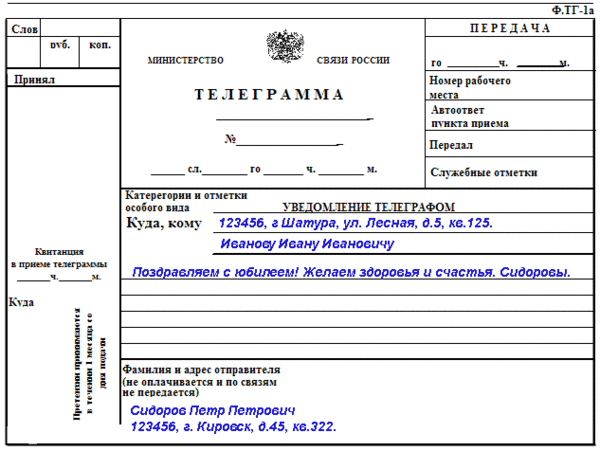

# &nbsp;

<h1 style="font-size:28pt">Skaitļu teorija: IMO un īsie saraksti (2014-2018)</h1>

# Telegrammas/SMS/Twitter (140 burti)

Cipari, pieturzīmes, visādu valodu burti, bet ne formulas.

</hgroup>

# <lo-sample/> IMO.SHL.2014.N6

Ar $a_1 < a_2 < \cdots <a_n$ apzīmējam naturālus skaitļus, kas ir 
savstarpēji pirmskaitļi. Turklāt $a_1$ ir pirmskaitlis un
$a_1 \geq n + 2$. Reālās taisnes nogrieznī $I = [0, a_1 a_2  \cdots a_n ]$ 
atzīmējam visus veselos skaitļus, kas dalās ar vismaz vienu no 
skaitļiem
$a_1 ,   \ldots , a_n$. Šie punkti sadala $I$ vairākos mazākos nogriežņos.
Pierādīt, ka šo nogriežņu garumu kvadrātu summa dalās ar $a_1$. 

<!--
Let $a_1 < a_2 <  \cdots <a_n$ be pairwise coprime positive integers with 
$a_1$ being prime and $a_1 \ge n + 2$. On the segment $I = [0, a_1 a_2  \cdots a_n ]$ 
of the real line, mark all integers that are divisible by at least one of the numbers 
$a_1 ,   \ldots , a_n$ . These points split $I$ into a number of smaller segments. 
Prove that the sum of the squares of the lengths of these segments is divisible by $a_1$.
-->

## Jautājums 1.1

Apzīmējam $N=3\cdot{}5\cdot{}7\cdot{}11$. Skaitļu intervālā $[0,N]$ 
nokrāsojam sarkanus visus tos punktus, kuri dalās ar vismaz vienu 
no skaitļiem $3,5,7$ vai $11$. Cik ir tādu intervālu $I \subseteq [0,N]$
garumā $1$, kam abi galapunkti ir sarkani?

## Telegramma (192 simboli)

<small>

`Apzīmē f(d) - cik [0;N] satur intervālus garumā d,`  
`kuros nav neviena sarkana punkta.`  
`f(1)=3*5*7*11,`  
`f(2)=(3-1)(5-1)(7-1)(11-1),`  
`f(3)=(3-2)(5-2)(7-2)(11-2),`  
`f(4)=f(5)=...=0`  
`Atbilde: f(1)-2f(2)+f(3)`

</small>
 

## Jautājums 1.2

Kāds atlikums rodas, ja summu 
$$\sum_{k=1}^{103} (1+2k^{17})^7$$
dala ar $103$? 

# <lo-sample/> IMO.SHL.2014.N7

Dots naturāls skaitlis $c \ge 1$. Definējam naturālu skaitļu 
virkni ar vienādībām $a_1 = c$ un
$$a_{n+1}=a_n^3-4c\cdot a_n^2+5c^2\cdot a_n+c$$ 
visiem $n \geq 1$. 
Pierādīt, ka jebkuram naturālam $n \geq 2$ eksistē
pirmskaitlis $p$, ar kuru dalās $a_n$, bet nedalās 
neviens no skaitļiem $a_1,\ldots,a_{n-1}$.

<!--
Let $c \ge 1$ be an integer. Define a sequence of 
positive integers by $a_1 = c$ and 
$$a_{n+1}=a_n^3-4c\cdot a_n^2+5c^2\cdot a_n+c$$ 
for all $n \geq 1$. 
Prove that for each integer $n \geq 2$ there exists 
a prime number $p$ dividing $a_n$ but none of the 
numbers $a_1 , \ldots , a_{n-1}$ .
-->

# <lo-sample/> IMO.SHL.2014.N8

Katram reālam skaitlim $x$, ar $||x||$ apzīmējam 
attālumu starp $x$ un tuvāko veselo skaitli. 
Pierādīt, ka jebkuram naturālu skaitļu pārim $(a,b)$
eksistē nepāru pirmskaitlis $p$ un naturāls skaitlis $k$, 
kas apmierina sakarību:
$$\left|\left|\frac{a}{p^k}\right|\right| + 
\left|\left|\frac{b}{p^k}\right|\right| + 
\left|\left|\frac{a+b}{p^k}\right|\right|=1.$$

<!--
For every real number $x$, let $||x||$ denote 
the distance between $x$ and the nearest integer.
Prove that for every pair $(a, b)$ of positive 
integers there exist an odd prime $p$ 
and a positive integer $k$ satisfying 
$$\left|\left|\frac{a}{p^k}\right|\right| + 
\left|\left|\frac{b}{p^k}\right|\right| + 
\left|\left|\frac{a+b}{p^k}\right|\right|=1.$$
-->

# <lo-sample/> IMO.SHL.2015.N8

Katram naturālam skaitlim $n$, kura sadalījums pirmreizinātājos ir 
$n = \prod_{n=1}^k p_i^{\alpha_i}$, definējam
$$\mho(n) = \sum_{i:p_i > 10^{100}} \alpha_i.$$
Tātad, $\mho(n)$ ir skaitļa pirmreizinātāju skaits, kuri lielāki par
$10^{100}$, kas summēti, ņemot vērā atkārtojumus.  
Atrast visas stingri augošas funkcijas $f:\mathbb{Z} \rightarrow \mathbb{Z}$, 
ka visiem veseliem $a$ un $b$, kam $a>b$, izpildās sakarība:
$$\mho\left( f(a) - f(b) \right) \leq \mho(a-b)$$

<!--
For every positive integer $n$ with prime factorization 
$n = \prod_{n=1}^k p_i^{\alpha_i}$, define
$$\mho(n) = \sum_{i:p_i > 10^{100}} \alpha_i.$$
That is, $\mho(n)$ is the number of prime factors $n$ greater than 
$10^{100}$ counted with multiplicity.  
Find all strictly increasing functions $f:\mathbb{Z} \rightarrow \mathbb{Z}$ 
such that 
$$\mho\left( f(a) - f(b) \right) \leq \mho(a-b)$$
for all integers $a$ and $b$ with $a>b$. 
-->

# <lo-sample/> IMO.SHL.2016.N7

Ar $n$ apzīmēts nepāru naturāls skaitlis. Dekarta plaknē 
izraudzīts daudzstūris (vienkārša, slēgta lauzta līnija) $P$, 
kura laukums ir $S$. Visām tā virsotnēm abas koordinātes
ir veseli skaitļi, un visu tā malu garumu kvadrāti dalās ar $n$. 
Pierādīt, ka $2S$ ir vesels skaitlis, kas dalās ar $n$.

<!--
Let $n$ be an odd positive integer. In the Cartesian plane, 
a cyclic polygon $P$ with area
$S$ is chosen. All its vertices have integral coordinates, 
and all squares of its side lengths are
divisible by $n$. Prove that $2S$ is an integer divisible by $n$.
-->

# <lo-sample/> IMO.SHL.2016.N8

Atrast visus polinomus $P(x)$ ar nepāru pakāpi $d$ un 
veseliem koeficientiem, kas apmierina sekojošu īpašību: 
Katram naturālam skaitlim $n$ eksistē $n$ naturāli 
skaitļi $x_1,x_2,\ldots,x_n$, ka 
${\displaystyle \frac{1}{2} < \frac{P(x_i)}{P(x_j)} < 2}$ 
un ${\displaystyle \frac{P(x_i)}{P(x_j)}}$
vienāds ar racionālu skaitli kāpinātu pakāpē $d$ 
(visiem indeksu pāriem $i$ un $j$, kur $1 \leq i,j \leq n$). 

<!--
Find all polynomials $P(x)$ of odd degree $d$ and 
with integer coefficients satisfying the
following property: for each positive integer $n$, 
there exist $n$ positive integers $x_1,x_2,\ldots,x_n$
such that ${\displaystyle \frac{1}{2} < \frac{P(x_i)}{P(x_j)} < 2}$ 
and ${\displaystyle \frac{P(x_i)}{P(x_j)}}$
is the $d$-th power of a rational number for every pair of
indices $i$ and $j$ with $1 \leq i,j \leq n$.
-->

# <lo-sample/> IMO.SHL.2017.N6

Atrast mazāko naturālo skaitli $n$ vai pierādīt, ka tāds neeksistē, 
kam būtu sekojoša īpašība: Ir bezgalīgi daudz tādu 
pozitīvu racionālu skaitļu komplektu 
$(a_1,a_2,\cdots,a_n)$, kuriem abi skaitļi
$$a_1 + a_2 + \cdots + a_n \;\; \mbox{un}\;\;
\frac{1}{a_1} + \frac{1}{a_2} + \cdots + \frac{1}{a_n}$$
ir veseli.

<!--
Find the smallest positive integer $n$, 
or show that no such $n$ exists, with the following
property: there are infinitely many distinct 
$n$-tuples of positive rational numbers 
$(a_1,a_2,\cdots,a_n)$
such that both
$$a_1 + a_2 + \cdots + a_n \;\; \mbox{and}\;\;
\frac{1}{a_1} + \frac{1}{a_2} + \cdots + \frac{1}{a_n}$$
are integers.
-->

# <lo-sample/> IMO.SHL.2017.N7

Sakārtots veselu skaitļu pāris $(x, y)$ ir primitīvs punkts, 
ja $x$ un $y$ lielākais kopīgais
dalītājs ir $1$. Pierādiet, ka katrai galīgai primitīvu 
punktu kopai $S$ eksistē tāds vesels pozitīvs skaitlis
$n$ un tādi veseli skaitļi $a_0,a_1,\ldots,a_n$, 
ka katram $(x, y)$ pārim no $S$ izpildās:
$$a_0x^n + a_1x^{n−1}y + a_2x^{n−2}y^2 + \cdots + a_{n−1}xy^{n−1} + a_n y^n = 1.$$

<!--
Say that an ordered pair $(x,y)$ of integers is 
an irreducible lattice point if $x$ and $y$
are relatively prime. For any finite set $S$ 
of irreducible lattice points, show that there 
is a homogenous polynomial in two variables, 
$f(x,y)$, with integer 
coefficients, of degree at least $1$,
such that $f(x,y)=1$ for each 
$(x,y)$ in the set $S$.  
*Note:* A homogenous polynomial of degree $n$ 
is any nonzero polynomial of the form
$$f(x,y) = a_0x^n + a_1x^{n-1}y + a_2x^{n-2}y^2 + 
\cdots + a_{n-1}xy^{n-1} + a_ny^n.$$
-->

# <lo-sample/> IMO.SHL.2018.N3

Definējam virkni $a_0, a_1, a_2,\ldots$
ar sakarību $a_n = 2^n + 2^{\lfloor n/2 \rfloor}$. 
Pierādīt, ka eksistē bezgalīgi daudzi šīs virknes locekļi, 
ko var izteikt kā (divu vai vairāku) šīs virknes 
locekļu summu. Kā arī bezgalīgi daudzi locekļi, 
kurus tādā veidā nevar izteikt.
<!--
Define the sequence $a_0, a_1, a_2,\ldots$
by $a_n = 2^n + 2^{\lfloor n/2 \rfloor}$. 
Prove that there are infinitely many terms of the sequence
which can be expressed as a sum of (two or more)
distinct terms of the sequence, as well as infinitely 
many of those which cannot be expressed in such a way.
-->

# <lo-sample/> IMO.SHL.2018.N6

Dota $f\,:\,\{1,2,3,\ldots\}\,\rightarrow\{2,3,\ldots\}$, 
funkcija, kas apmierina sakarību
$f(m+n)\,\mid\,f(m)+f(n)$ ($f(m+n)$ ir $f(m)+f(n)$ dalītājs)
visiem naturālu skaitļu pāriem $m,n$. Pierādīt, ka 
eksistē naturāls skaitlis $c>1$, kurš ir visu 
$f$ vērtību dalītājs.

<!--
Let $f\,:\,\{1,2,3,\ldots\}\,\rightarrow\{2,3,\ldots\}$
be a function such that $f(m+n)\,\mid\,f(m)+f(n)$
for all pairs $m,n$ of positive integers. Prove
that there exists a positive integer $c>1$ which 
divides all values of $f$.
-->

# <lo-sample/> IMO.SHL.2018.N7

Dots vesels skaitlis $n \geq 2018$ un 
$a_1,a_2,\ldots,a_n,b_1,b_2,\ldots,b_n$
ir pa pāriem dažādi naturāli skaitļi, kas 
nepārsniedz $5n$. Pieņemsim, ka virkne
$$\frac{a_1}{b_1},\frac{a_2}{b_2},\ldots,\frac{a_n}{b_n}$$
veido aritmētisku progresiju. Pierādīt, ka visi virknes locekļi 
ir savā starpā vienādi.

<!--
Let $n \geq 2018$ be an integer, and let 
$a_1,a_2,\ldots,a_n,b_1,b_2,\ldots,b_n$
be pairwise distincst positive integers not 
exceeding $5n$. Suppose that the sequence 
$$\frac{a_1}{b_1},\frac{a_2}{b_2},\ldots,\frac{a_n}{b_1n}$$
forms an arithmetic progression. Prove that the terms 
of the sequence are equal.
-->

