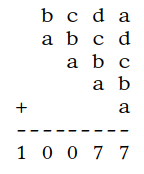

# &nbsp;

<hgroup>

<h1 style="font-size:32pt">Skaitļu teorija: 
10.kl. Igaunijas olimpiādes</h1>

</hgroup><hgroup>

* EE.PK - Eesti Piirkonnavoor (Igaunijas reģionu kārta)
* EE.LO - Eesti Lõppvoor (Igaunijas gala/valsts kārta)
* EE.LVS - Eesti Sügisene lahtine võistlus (Igaunijas rudens atvērtais konkurss)
* EE.LVT - Eesti Talvine lahtine võistlus (Igaunijas ziemas atvērtais konkurss)

[Matemaatikaolümpiaadid ](http://www.math.olympiaadid.ut.ee/html/index.php)

</hgroup>

---

# <lo-sample/> EE.PK.2010.10.5

Pierādīt, ka jebkuram veselam $n \geq 3$ atradīsies tāds $n$-ciparu
skaitlis, kurš ir vesela skaitļa kvadrāts, un, pierakstot tam sākumā 
ciparu 1, arī rodas kāda vesela skaitļa kvadrāts.

<!--
Доказать, что для каждого целого числа $n \geq 3$ найдётся такое $n$-значное
число, которое является квадратом целого числа и при добавлении в его
начало цифры 1 также получится квадрат некоторого целого числа.
-->

<small>

* [misc.beginatend](#)
* [misc.experiment](#)
* [notation.algor.square5](#)
* [notation.dec.numdigits.square](#)
* [alg.factorize.sqdiff](#)

</small>

----

# Vienādojumu sistēmas

* Ja $n=3$, var aplūkot pilnus kvadrātus, kas satur četrus ciparus un
sākas ar "1": $32^2=1024$, $33^2 = 1089$, $34^2 = 1156$ un 
$35^2 = 1225$. Tas arī ir pirmais skaitlis, kuram nometot pirmo ciparu 
iegūst kvadrātu: $225 = 15^2$. 
* Redzam arī, ka $35^2 - 15^2 = (35-15)(35+15)=20\cdot 50 = 1000$. 
* Nākamā sistēmiņa: $a+b=200$, $a-b=50$. Tātad 
$$a = 125,\;\; b = 75,\;\;125^2 - 75^2=10000.$$
* Skaitļus $15$, $35$, $75$, $125$ u.c. var ātri kāpināt kvadrātā:

$75^2 = 5625$, jo $7 \cdot 8 = 56$.  
$125^2 = 15625$, jo $12 \cdot 13 = 156$.

----

# <lo-sample/> EE.PK.2011.10.3

Matemātikas stundā Jüri dalīja naturālu skaitli $n$ ar naturālu 
skaitli $m$, iegūstot dalījumu un atlikumu.  
a) Pierādīt, ka, ja dalījums un atlikums ir savā starpā vienādi, 
tad $n$ dalās ar $m+1$.  
b) Vai izpildās arī apgrieztais apgalvojums: Vienmēr, kad skaitlis
$n$ dalās ar $m+1$, tad dalījums un atlikums, ja $n$ dala ar $m$, ir 
savā starpā vienādi? 

<!--
На уроке математики Юра должен был поделить положительное целое
число $n$ на положительное целое число $m$, чтобы найти частное и остаток.
а) Доказать, что если найденные частное и остаток равны между собой,
то число n делится на число m + 1.
б) Выполняется ли обратное утверждение: всегда, когда число n делится 
на число m + 1, частное и остаток при делении числа n на число
m равны между собой?
-->

<small>

* [mod.rem.expr](#)
* [mod.rem.values](#)

</small>

----

# <lo-sample/> EE.PK.2012.10.4

Cik ir veselu skaitļu komplektu $(a, b, c)$, 
kuri apmierina vienādojumu $(a + b)(b + c)(c + a) = 123456789$?

<!--
Сколько существует комплектов целых чисел $(a, b, c)$, 
которые удовлетворяют уравнению $(a + b)(b + c)(c + a) = 123456789$?
-->

<small>

* [mod.parity.cases](#)

</small>

---

# <lo-sample/> EE.PK.2013.10.3

Atrast mazāko naturālo skaitli $n$, kuram starp jebkuriem $n$
veselu skaitļu kvadrātiem atradīsies divi tādi, kuru starpība
dalās ar $10$. 

<!--
Найти наименьшее натуральное число $n$, при котором среди любых n
квадратов целых чисел найдутся два таких, разность которых делится
на $10$.
-->

<small>

* [mod.expr.square](#)
* [misc.exhaustive](#)
* [misc.pigeonhole](#)

</small>

----

# Dirihlē princips

* Ievērojam, ka skaitļa kvadrāta atlikums, dalot ar $10$, atkarīgs tikai no paša skaitļa atlikuma.
* Pārbaudām pilno kvadrātu atlikumus:

<table>
<tr><th>$x$</th><td>1</td><td>2</td><td>3</td><td>4</td><td>5</td><td>6</td><td>7</td><td>8</td><td>9</td><td>10</td></tr>
<tr><th>$x^2$</th><td>1</td><td>4</td><td>9</td><td>16</td><td>25</td><td>36</td><td>49</td><td>64</td><td>81</td><td>100</td></tr>
<tr><th>$x^2\;\mbox{mod}\;10$</th><td>1</td><td>4</td><td>9</td><td>6</td><td>5</td><td>6</td><td>9</td><td>4</td><td>1</td><td>0</td></tr>
</table>

* Starp šiem atlikumiem ir seši atšķirīgi: $1,4,9,6,5,0$.
* Ja izvēlas septiņus, tad divi sakritīs (Dirihlē princips). 

----

# <lo-sample/> EE.PK.2014.10.3

Vienādmalu trijstūra virsotnēs ierakstīti naturāli skaitļi $14$, $20$ un $n$.. 
Jebkuru divu virsotņu skaitļu reizinājums dalās ar skaitli trešajā virsotnē. 
Atrast visas iespējamās $n$ vērtības.

<!--
В вершины равностороннего треугольника записаны положительные целые числа 14, 20 и $n$. 
Произведение чисел любых двух вершин делится на
число в третьей вершине. Найти все возможные значения числа $n$.
-->

<small>

* [div.common.lcm](#)
* [div.common.lcm.mult](#)
* [misc.exhaustive](#)

</small>

-----

* Prasības: $14 \cdot 20$ dalās ar $n$, $14n$ dalās ar $20$, $20n$ dalās ar $14$
* $n$ ir $280$ dalītājs, vienlaikus $n$ dalās ar $2$, $5$, $7$. 
* Tātad $n = 2 \cdot 5 \cdot 7 k = 70k$, kas ir $280$ dalītājs.
* Trīs $n$ vērtības: $(70, 140, 280)$. 

----

# <lo-sample/> EE.PK.2015.10.3

а) Zināms, ka $x^2 − y^2 = 100$, kur $x$ и $y$ ir naturāli skaitļi. Atrast izteiksmes 
$x − y$ mazāko iespējamo vērtību.  
b) Tas pats jautājums, ja $x$ un $y$ ir veseli skaitļi.

<!--
а) Известно, что $x^2 − y^2 = 100$, где $x$ и $y$ − натуральные числа. Найти
наименьшее возможное значение выражения $x − y$.  
б) Тот же вопрос, при условии, что $x$ и $y$ − целые числа
-->

<small>

* [alg.factorize.sqdiff](#)
* [div.pfactor.prop.numdivisors](#)

</small>

---

# <lo-sample/> EE.PK.2015.10.6

Vai eksistē tāds naturāls skaitlis $n$, ka vairāk nekā pusei 
veselo skaitļu no $1$ līdz $n$ ciparu summa ir pāru skaitlis?

<!--
Существует ли такое положительное целое число $n$, что у более половины
из целых чисел от $1$ до $n$ сумма цифр чётна?
-->

<small>

* [misc.induction](#)

</small>

---

# <lo-sample/> EE.PK.2016.10.3

Vai var atrast tādus $n$ naturālus skaitļus, lai to summa 
būtu vienāda ar to mazāko kopīgo dalāmo, ja 
a) $n = 2$?  
b) $n = 3$?

<!--
Можно ли подобрать такие $n$ положительных целых чисел, 
чтобы их сумма равнялась их же наименьшему общему кратному, если
а) $n = 2$?  
б) $n = 3$?
-->

---

# <lo-sample/> EE.PK.2016.10.4

Vai eksistē tāds vienādojuma 
$x^2 + y^2 + z^2 + w^2 = 3 + xy + yz + zw$,
atrisinājums, kuram $x$, $y$, $z$ un $w$ ir dažādi veseli skaitļi?

<!--
Существует ли такое решение уравнения
$x^2 + y^2 + z^2 + w^2 = 3 + xy + y z + zw$,
при котором $x$, $y$, $z$ и $w$ различные целые числа?
-->

<small>

* [alg.ineq.fullsquare](#)

</small>

----

# <lo-sample/> EE.PK.2017.10.2

Atrast visus veselu skaitļu pārus $(x,y)$, kuriem 
$324^{x+y} = 2^{x−y} \cdot 3^{x−3} \cdot 4^{y−4}$.

<!--
Найти все пары целых чисел $(x,y)$, при которых
$324^{x+y} = 2^{x−y} \cdot 3^{x−3} \cdot 4^{y−4}$.
-->

----

# <lo-sample/> EE.PK.2017.10.3

Pierādīt, ka atradīsies bezgalīgi daudz četrinieku, ko veido 
dažādi naturāli skaitļi, kuriem
$$\frac{1}{a} - \frac{1}{b} =\frac{1}{b} - \frac{1}{c} =\frac{1}{c} - \frac{1}{d}.$$

<!--
Доказать, что найдётся бесконечно много четвёрок различных 
целых положительных чисел $(a, b, c, d)$, при которых
$$\frac{1}{a} - \frac{1}{b} =\frac{1}{b} - \frac{1}{c} =\frac{1}{c} - \frac{1}{d}.$$
-->

----

# <lo-sample/> EE.PK.2018.10.3

Mari iedomājās naturālu skaitli. Pareizinot šo skaitli ar $4$, 
viņa ieguva kādu trīsciparu skaitli. Bet, pareizinot sākotnējo 
skaitli ar $3$ un pārceļot rezultāta pēdējo ciparu uz sākumu, 
negaidīti ieguva tādu pašu trīsciparu skaitli. 
Atrast visas iespējamās vērtības Mari iedomātajam skaitlim. 

<!--
Маша задумала одно натуральное число. Умножив это число на 4, 
она получила какое-то трёхзначное число. А когда она умножила первоначальное 
число на 3 и переставила последнюю цифру результата в его начало,
то неожиданно получила то же самое трёхзначное число. 
Найти все возможные значения задуманного Машей числа.
-->

----

# <lo-sample/> EE.PK.2019.10.3

Cik ir tādu veselu negatīvu skaitļu pāru $(a,b)$, 
kas apmierina vienādību $22a + 15b = 2019$?

<!--
Сколько найдётся пар неотрицательных целых чисел $(a, b)$, 
удовлетворяющих равенству $22a + 15b = 2019$?
-->

----

# <lo-sample/> EE.LO.2010.10.2

Vienādojumam
$$\frac{2}{a^2}+\frac{3}{b^2}+\frac{4}{c^2}=1$$
atrast visus atrisinājumus naturālos skaitļos.

<!--
Для уравнения
$$\frac{2}{a^2}+\frac{3}{b^2}+\frac{4}{c^2}=1$$
найти все решения в натуральных числах.
-->

----

# <lo-sample/> EE.LO.2011.10.2

Atrast visus naturālu skaitļu četriniekus $(w,x,y,z)$, 
kuriem izpildās vienādība $w^x + w^y = w^z$.

<!--
Найти все четвёрки положительных целых чисел $(w, x, y, z)$, 
при которых выполняется равенство $w^x + w^y = w^z$.
-->

---

# <lo-sample/> EE.LO.2012.10.1

Atrast visus tādus naturālu skaitļu pārus $(n,m)$, kuriem 
skaitļu $n$ un $m$ aritmētiskais un ģeometriskais vidējais 
ir dažādi divciparu naturāli skaitļi, kuri iegūstami viens no 
otra, apmainot vietām ciparus.  
*Piezīme. Par pozitīvu skaitļu $x$, $y$ ģeometrisko vidējo 
sauc skaitli $\sqrt{x y}$.*

<!--
Найти все такие пары $(n, m)$ положительных целых чисел, при которых
арифметическое и геометрическое среднее чисел $n$ и $m$ являются 
различными двузначными натуральными числами, которые одно из другого
получаются перестановкой цифр.  
*Замечание. Геометрическим средним положительных чисел $x$, $y$ называется 
число $\sqrt{x y}$.*
-->

---

# <lo-sample/> EE.LO.2012.10.5

Atrast visus naturālu skaitļu trijniekus $(x,y,z)$, kuriem 
$x \cdot y! + 2y \cdot x! = z!$.  
*Piezīme. Par naturāla skaitļa $n$ faktoriālu $n!$ sauc 
reizinājumu $1 \cdot 2 \cdot \ldots \cdot n$.*

<!--
Найти все такие тройки положительных целых чисел (x, y, z), 
при которых $x \cdot y! + 2y \cdot x! = z!$.  
*Замечание. Факториалом $n!$ натурального числа $n$ 
называется произведение $1 \cdot 2 \cdot \ldots \cdot n$.*
-->

---

# <lo-sample/> EE.LO.2013.10.1

Vai skaitli $2013$ var izteikt kā divu veselu skaitļu kubu starpību?

<!--
Можно ли представить число 2013 как разность кубов двух целых чисел?
-->

<small>

* [mod.cases.cubes](#)
* [notation.divrules.3or9.remainder](#)

</small>

---

# <lo-sample/> EE.LO.2014.10.1

Ar $a$ un $n$ apzīmēti naturāli skaitļi. Pierādīt, ka 
$$\left\lfloor \frac{a}{n} \right\rfloor + \left\lfloor \frac{a+1}{n} \right\rfloor + \ldots + \left\lfloor \frac{a+n-1}{n} \right\rfloor = a.$$
*Piezīme. Katram reālam skaitlim $x$, 
$\lfloor x \rfloor$ apzīmē skaitļa $x$ (apakšējo) veselo daļu, 
t.i. vislielāko veselo skaitli, kas nepārsniedz $x$.*

<!-- 
Пусть $a$ и $n$ − целые положительные числа. Доказать, что
$$\left\lfloor \frac{a}{n} \right\rfloor + 
left\lfloor \frac{a+1}{n} \right\rfloor + \ldots +
left\lfloor \frac{a+n-1}{n} \right\rfloor = a.$$
*Примечание. Для каждого действительного числа $x$, $\lfloor x \rfloor$ обозначает 
целую часть числа $x$, т.е. наибольшее целое число, не превосходящее $x$.*
-->

---

# <lo-sample/> EE.LO.2014.10.5

Ar $m$ apzīmēts naturāls skaitlis. Pierādīt, ka, ja Mari uzrakstījusi 
uz tāfeles vismaz $m+3$ skaitļus, tad Jüri vienmēr varēs izvēlēties no 
tiem $4$ tādus, ka kaut kādu divu izvēlēto skaitļu summa un atlikušo 
divu izvēlēto skaitļu summa dos vienādus atlikumus, dalot ar $m$. 

<!--
Пусть $m$ − положительное целое число. Доказать, что если Маша запишет
на доске по меньшей мере $m + 3$ числа, то у Пети всегда будет 
возможность выбрать из них $4$ таких, что сумма каких-то двух выбранных чисел
и сумма остальных двух выбранных чисел будут давать равные остатки
при делении на $m$.
-->

----

# <lo-sample/> EE.LO.2015.10.1

Atrast visus naturālos skaitļus $n$, kas lielāki par vienu, 
kuriem 
$\frac{1}{n}$ un $\frac{1}{n + 1}$
izsakāmi kā galīgas decimāldaļas.

<!--
Найти все натуральные числа $n$ большие одного, при которых 
$\frac{1}{n}$ и $\frac{1}{n + 1}$
представимы в виде конечных десятичных дробей.
-->

----

# <lo-sample/> EE.LO.2015.10.4

Uz tāfeles virknē viens pēc otra uzrakstīti naturālie skaitļi 
no $1$ līdz $n$, bet zem viņiem tie paši skaitļi, bet pretējā
secībā. Apzīmēsim viena zem otra uzrakstīto skaitļu reizinājumu 
summu ar $S(n)$. Piemēram, 
$S(6) = 1\cdot{}6 + 2\cdot{}5 + 3\cdot{}4 + 4\cdot{}3 + 5\cdot{}2 + 6\cdot{}1 = 56$.)
Pierādīt, ka jebkuram naturālam skaitlim $n$ izpildās vienādības
$$S(n + 1) − S(n) = 1 + 2 + . . . + n + (n + 1),$$
$$S(n + 1) + S(n) = 1^2 + 2^2 + \ldots + n^2 + (n + 1)^2.$$

<!--
На доске в ряд друг за другом записываются натуральные числа от $1$ до $n$,
а под ними те же самые числа, но в обратном порядке. Обозначим сумму
произведений записанных друг над другом чисел через $S(n)$. (Например,
$S(6) = 1\cdot{}6 + 2\cdot{}5 + 3\cdot{}4 + 4\cdot{}3 + 5\cdot{}2 + 6\cdot{}1 = 56$.)
Доказать, что для каждого натурального числа $n$ выполняются равенства
$$S(n + 1) − S(n) = 1 + 2 + . . . + n + (n + 1),$$
$$S(n + 1) + S(n) = 1^2 + 2^2 + \ldots + n^2 + (n + 1)^2.$$
-->

----

# <lo-sample/> EE.LO.2016.10.1

Atrast visus tos četrciparu skaitļus, kuri ir tieši par $2016$ lielāki 
par skaitli, ko iegūst, pārliekot pirmo ciparu uz beigām.

<!--
Найти все такие четырёхзначные числа, которые ровно на $2016$ больше
числа, полученного путём переставления первой цифры в конец.
-->

----

# <lo-sample/> EE.LO.2016.10.2

Atrast visus veselu skaitļu pārus $(a,b)$, kuriem izpildās vienādība
$$3(a^2 + b^2) − 7(a + b) = −4.$$

<!--
Найти все пары целых чисел $(a, b)$, для которых выполняется равенство
$$3(a^2 + b^2) − 7(a + b) = −4.$$
-->

----

# <lo-sample/> EE.LO.2017.10.1

Juku izvirzījis matemātisku hipotēzi, kas apgalvo, ka jebkuram 
veselam skaitlim $n > 4$ vismaz viens no diviem lielākajiem skaitļiem, 
kuri mazāki par $\frac{n}{2}$, ir savstarpējs pirmskaitlis ar $n$. 
Vai Juku hipotēze ir patiesa?  
*Piezīme. Vesels skaitlis $a$ ir savstarpējs pirmskaitlis ar veselu 
skaitli $b$, ja lielākais kopīgais dalītājs $\mbox{LKD}(a,b)=1$.*

<!--
Петя выдвинул математическую гипотезу, согласно которой для каждого 
целого числа $n > 4$ по крайней мере одно из двух наибольших целых
чисел, меньших чем $\frac{n}{2}$, взаимно просто с числом $n$. Верна ли гипотеза
Пети?  
Примечание. Целое число $a$ взаимно просто с целым числом $b$, если
$\mbox{НОД}(a, b) = 1$.
-->

----

# <lo-sample/> EE.LO.2017.10.5

a) Uz tāfeles uzrakstīts trīsciparu skaitļa vispārīgais izskats 
$\overline{ABC}$. 
Anija un Enija pēc kārtas katrā savā gājienā nomaina vienu burtu 
ar ciparu, sāk Anija. Vai Anija varēs tā ierakstīt ciparus, ka neatkarīgi 
no Enijas gājiena iegūtais trīsciparu skaitlis dalīsies ar $11$? 
(Dažādus burtus var aizstāt arī ar to pašu ciparu, bet burtu "A" 
nevar aizstāt ar $0$.)  
b) Anija un Enija vairs negribēja katras spēles sākumā rakstīt 
skaitļa vispārīgo izskatu un nolēma izmainīt noteikumus: 
vispirms Anija uzraksta vienu ciparu, pēc tam Enija raksta tam pa 
labi vai pa kreisi otru ciparu, visbeidzot Anija pieraksta pa 
labi vai pa kreisi jau uzrakstītajiem cipariem trešo 
(ierakstīt starp esošajiem cipariem nav atļauts). 
Vai Anija varēs tā ierakstīt ciparus, ka neatkarīgi no Enijas gājiena
rezultātā būs trīsciparu skaitlis (t.i. pirmais cipars nav $0$), kas
dalās ar $11$? 

<!--
а) На доске записан общий вид трёхзначного числа $\overline{ABC}$. 
Аня и Женя по очереди заменяют каждым ходом одну букву цифрой, 
начинает Аня. Сможет ли Аня так записывать цифры, что независимо 
от хода Жени полученное в итоге трёхзначное число делилось бы на $11$? 
(Разные буквы можно заменять одной и той же цифрой, но букву A нельзя
заменять на $0$.)  
б) Аня и Женя утомились в начале каждой игры записывать общий вид
числа и решили изменить правила: сперва Аня записывает одну цифру, 
затем Женя справа или слева от неё вторую, а в конце Аня 
записывает вправо или влево от записанных на доске двух цифр третью 
(между цифрами записывать не разрешается). Сможет ли Аня так
записывать цифры, что независимо от хода Жени в итоге получится
трёхзначное число (т.е. первая цифра не $0$), делящееся на $11$?
-->

---

# <lo-sample/> EE.LO.2018.10.1

Atrast visus veselu skaitļu pārus $(a, b)$, kuriem
$$(2a^2 + b)^3 = b^3a.$$

<!--
Найти все пары целых чисел (a, b), при которых
$$(2a^2 + b)^3 = b^3a.$$
-->

----

# <lo-sample/> EE.LO.2019.10.1

Atrast visus veselu skaitļu pārus $(x, y)$, kuriem $x − y = \frac{x}{y}$.

<!--
Найти все пары целых чисел $(x, y)$, при которых $x − y = \frac{x}{y}$.
-->

---

# <lo-sample/> EE.LVS.2010.noorem.1

Atrast visus naturālos skaitļus $n$, kuriem 
$1 + 2^2 + 3^3 + 4^n$
ir vesela skaitļa kvadrāts.

<!--
Найти все положительные целые числа $n$, при которых 
$1 + 2^2 + 3^3 + 4^n$
является квадратом некоторого целого числа.
-->

---

# <lo-sample/> EE.LVS.2010.vanem.1

Vai eksistē pirmskaitlis $p$, kuram
$p^3 + 2008$ un $p^3 + 2010$ arī
ir pirmskaitļi?

<!--
Найдётся ли простое число $p$, при котором 
$p^3 + 2008$ и $p^3 + 2010$ также
являются простыми числами?
-->

---

# <lo-sample/> EE.LVT.2010.noorem.1

Atrast visus vienādojuma $xy-3x+7y = 2030$ atrisinājumus 
naturālos skaitļos.

<!--
Найти все решения уравнения $xy-3x+7y = 2030$ в положительных целых
числах.
-->

----

# <lo-sample/> EE.LVT.2010.noorem.5

Sauksim naturālu skaitli $n$ par *pirmskaittiecīgu*, ja 
eksistē vismaz trīs tādi pirmskaitļi, kuriem nodzēšot pēdējo 
ciparu, iegūst skaitli $n$. Pierādīt, ka jebkuri 
divi naturāli pirmskaittiecīgi skaitļi atšķiras vismaz par $3$. 

<!--
Назовём положительное целое число n простолюбивым, если найдутся
по крайней мере три таких простых числа, при стирании последней 
цифры которых получается число n. Доказать, что любые два простолюбивых
положительных целых числа различаются по крайней мере на $3$.
-->

----

# <lo-sample/> EE.LVT.2010.vanem.3

Sauksim naturālu skaitli $n$ par *tīru*, ja tas neietilpst nevienā
veselu skaitļu virknē
$c_0, c_1, c_2, \ldots$ , kur $0 < c_0 < n$,
un ko visiem $i > 0$ definē šādi:
$$c_i = \frac{c_{i-1}}{2},\;\;\mbox{ja $c_{i−1}$ ir pāru,}$$
$$c_i = 3c_{i-1} - 1,\;\;\mbox{ja $c_{i-1}$ ir nepāru.}$$
Piemēram, skaitlis $10$ nav tīrs, jo tas ietilpst virknē 
$5, 14, 7, 20, 10, \ldots$, kas apmierina virknes nosacījumus.  
a) Vai katrs naturāls skaitlis, kurš dalās ar $3$, ir tīrs?  
b) Pierādīt, ka, ja $n > 1$ ir tīrs, bet nedalās ar $3$, tad
skaitlis $n + 1$ dalās ar $6$.

<!--
Назовём положительное целое число $n$ чистым, если оно не содержится
ни в какой последовательности целых чисел 
$c_0, c_1, c_2, \ldots$ , где $0 < c_0 < n$,
и при каждом $i > 0$
$$c_i = \left\{ 
\begin{array}{ll}
\frac{c_{i-1}}{2}, & \mbox{если $c_{i−1}$ чётно,} \\
$3c_{i-1} - 1, & \mbox{если $c_{i-1}$ нечётно.}
\end{array} \right.$$
Например, число $10$ не является чистым, так как оно содержится в последовательности 
$5, 14, 7, 20, 10, \ldots$, удовлетворяющей условиям задачи.  
а) Является ли каждое делящееся на $3$ положительное целое число чистым?  
б) Доказать, что если целое число $n > 1$ чистое, но не делится на $3$, то
число $n + 1$ делится на $6$.
-->

----

# <lo-sample/> EE.LVS.2011.noorem.1

Atrast visus naturālos skaitļus $n$, kuriem 
visu viņu pozitīvo dalītāju reizinājums nav skaitļa $n$
pakāpe ar veselu kāpinātāju. 

<!--
Найти все положительные целые числа $n$, 
произведение всех положительных делителей которых не 
является степенью числа $n$ с целочисленным
показателем.
-->

----

# <lo-sample/> EE.LVS.2011.noorem.5

Atrast visus naturālu skaitļu pārus $(n,k)$, kuriem
$n! + (n + 1)! = k! + 120$.  
*Piezīme. Pieraksts $x!$ apzīmē reizinājumu $1 \cdot 2 \cdot \ldots \cdot x$.*

<!--
Найти все пары положительных целых чисел $(n, k)$, при которых
$n! + (n + 1)! = k! + 120$.  
Замечание. Запись $x!$ обозначает произведение $1 \cdot 2 \cdot \ldots \cdot x$.
-->

----

# <lo-sample/> EE.LVS.2011.vanem.1

Pierādīt, ka nevienu naturālu skaitli, starp kura cipariem pa 
vienai reizei atrodami cipari $2$ un $1$, bet visi pārējie cipari ir
nulles, nevar izteikt kā divu veselu skaitļu kvadrātu summu 
vai divu veselu skaitļu kubu summu. 

<!--
Доказать, что ни одно натуральное число, среди цифр которого 
встречаются по одному разу $2$ и $1$, а остальные все цифры нули, 
нельзя представить в виду суммы квадратов или суммы кубов двух целых чисел.
-->

---

# <lo-sample/> EE.LVS.2011.vanem.2

Ar $P(x)$ apzīmēts polinoms ar veseliem koeficientiem, 
kas apmierina nosacījumu $P(2010) = P(201) = 2010$.  
a) Vai ir iespējams, ka $P(2011) = 2011$?  
b) Kāda ir mazākā iespējamā $P(2011)$ pozitīvā vērtība?

<!--
Пусть $P(x)$ –– многочлен с целочисленными коэффициентами, 
удовлетворяющий условию $P(2010) = P(201) = 2010$.  
а) Возможно ли, что $P(2011) = 2011$?  
б) Каково наименьшее возможное положительное значение $P(2011)$?
-->

----

# <lo-sample/> EE.LVT.2011.noorem.1

Atrast visus naturālos skaitļus, kuru pierakstā nav vairāk par četriem
cipariem, un kuri, nodzēšot pirmo ciparu, samazinās tieši $25$ reizes
(pēc nodzēšanas skaitlis var sākties arī ar ciparu $0$). 

<!--
Найти все не более чем четырёхзначные положительные целые числа, 
которые при стирании первой цифры уменьшаются ровно в 25 раз 
(оставшееся число может начинаться и на цифру 0).
-->

----

# <lo-sample/> EE.LVT.2011.noorem.1

Aplūkosim naturālus skaitļus $N$, kuriem ir tieši $6$ 
pozitīvi dalītāji - apzīmēsim šos dalītājus ar 
$d_1,\ldots,d_6$, turklāt
$1 = d_1 <d_2 <d_3 <d_4 <d_5 <d_6 = N$. 
Sauksim skaitli $N$ par *labu*, ja summa
$d_4 + d_5$ dalās ar summu $d_2 + d_3$.  
a) Atrast mazāko naturālo skaitli $N$, kuram ir tieši
$6$ pozitīvi dalītāji un kurš nav labs.  
b) Pierādīt, ka atradīsies bezgalīgi daudz naturālu skaitļu
$N$, kuriem ir tieši $6$ pozitīvi dalītāji un kuri nav labi.

<!--
Рассмотрим положительные целые числа $N$, у которых ровно 
$6$ положительных делителей − обозначим эти делители через 
$d_1,\ldots,d_6$, причём
$1 = d_1 <d_2 <d_3 <d_4 <d_5 <d_6 = N$. 
Назовём число $N$ хорошим, если сумма
$d_4 + d_5$ делится на сумму $d_2 + d_3$.  
а) Найти наименьшее положительное целое число $N$, у которого ровно
$6$ положительных делителей и которое не является хорошим.  
б) Доказать, что найдётся бесконечно много положительных 
целых чисел $N$, у которых ровно $6$ положительных делителей и которые не
являются хорошими.
-->

----

# <lo-sample/> EE.LVT.2011.vanem.5

Cik ir tādu naturālu skaitļu, kas dalās ar $2010$, kuriem ir 
tieši $2010$ pozitīvu dalītāju (ieskaitot $1$ un pašu skaitli)? 

<!--
Сколько найдётся таких положительных целых чисел, делящихся на $2010$,
у которых ровно $2010$ положительных делителей (включая $1$ и само это
число)?
-->

----

# <lo-sample/> EE.LVS.2012.noorem.1

Atrast visus četrciparu skaitļus, kam, nodzēšot
jebkuru ciparu, rodas trīsciparu skaitlis, kurš ir 
sākotnējā skaitļa dalītājs. 

<!--
Найти все четырёхзначные числа, при стирании любой 
цифры которых получается трёхзначное число, 
являющееся делителем изначального числа.
-->

----

# <lo-sample/> EE.LVS.2012.vanem.1

Katram naturālam skaitlim $n$ apzīmēsim ar simbolu 
$a_n$ lielāko skaitļa $2$ pakāpi, ar ko dalās skaitlis $n$
(piemēram, $a_{2011} = 1$,
$a_{2012} = 4$). Pierādīt, ka patvaļīgiem naturāliem skaitļiem
$i$ un $j$, kur $i < j$, summa
$$\frac{1}{a_i} + \frac{1}{a_{i+1}} + \ldots + \frac{1}{a_j}$$
nav vesels skaitlis.

<!--
Для каждого положительного числа $n$ обозначим символом 
$a_n$ наибольшую степень числа $2$, на которую делится 
число $n$ (например, $a_{2011} = 1$,
$a_{2012} = 4$). Доказать, что для произвольных положительных 
целых чисел $i$ и $j$ , где $i < j$, сумма
$$\frac{1}{a_i} + \frac{1}{a_{i+1}} + \ldots + \frac{1}{a_j}$$
не является целым числом.
-->

-----

# <lo-sample/> EE.LVT.2012.noorem.1

Pierādīt, ka vienādojumam
$$2x^3 − y^2 = 3$$
nav atrisinājumu veselos skaitļos.

<!--
Доказать, что уравнение
$$2x^3 − y^2 = 3$$
не имеет целочисленных решений.
-->

------

# <lo-sample/> EE.LVT.2012.noorem.5

Vai var gadīties, ka trijstūrim ar veseliem malu garumiem
perimetrs dalās ar divkāršotu trijstūra pašas garākās malas garumu. 

<!--
Может ли быть так, что периметр треугольника 
с целочисленными длинами сторон делится на удвоенную длину 
самой длинной стороны этого треугольника?
-->

------

# <lo-sample/> EE.LVT.2012.vanem.1

Pierādīt, ka jebkuram pozitīvam skaitlim $n$ pirmo $n$ 
pirmskaitļu summa ir lielāka par $n^2$. 

<!--
Доказать, что при любом положительном целом числе n сумма первых n
простых чисел больше, чем n^2.
-->

------

# <lo-sample/> EE.LVT.2012.vanem.2

Atrast visus naturālu skaitļu trijniekus $(a,b,c)$, 
kuriem izpildās vienādība
$$a^{bc} + b^{ca} + c^{ab} = 3abc.$$

<!--
Найти все тройки положительных целых чисел $(a,b,c)$, 
при которых выполняется равенство
$$a^{bc} + b^{ca} + c^{ab} = 3abc.$$
-->

-----

# <lo-sample/> EE.LVS.2013.noorem.1

Cik ir tādu sešciparu naturālu skaitļu, kuru pierakstā ir 
cipari $0$, $1$, $2$, $3$, $4$ un $5$ katrs vienu reizi un 
kuri dalās ar katru savu ciparu, kas nav nulle.

<!--
Сколько всего таких шестизначных натуральных чисел, в записи которых
присутствуют цифры 0, 1, 2, 3, 4 и 5 каждая по одному разу, и которые
делятся на каждую свою цифру, отличную от нуля?
-->

---

# <lo-sample/> EE.LVS.2013.noorem.2

No nulles atšķirīgi veseli skaitļi $a$, $b$ un $c$ apmierina nosacījumu
$\frac{1}{a}+\frac{1}{b}+\frac{1}{c}=0$.
Pierādīt, ka star skaitļiem $a$, $b$, $c$ var atrast divus tādus
skaitļus, kuriem ir kopīgs dalītājs, kas lielāks par $1$.

<!--
Отличные от нуля целые числа $a$, $b$ и $c$ удовлетворяют условию
$\frac{1}{a}+\frac{1}{b}+\frac{1}{c}=0$.
Доказать, что среди чисел $a$, $b$, $c$ можно найти два таких числа, 
у которых найдётся общий делитель, который больше числа $1$.
-->

-----

# <lo-sample/> EE.LVS.2013.noorem.3

Skolotājs pateica Jüri divus veselus skaitļus $a$ un $b$, kas nav nulles, 
turklāt $b$ dalās ar $a$. Jüri ir jāatrod tādu nenulles veselu 
skaitli $c$, ka $c$ dalās ar $b$, un visi kvadrātvienādojuma
$ax^2+bx+c=0$ atrisinājumi ir veseli skaitļi. Vai Jüri vienmēr 
var atrisināt šo uzdevumu?

<!--
Учитель сказал Юре два отличных от нуля целых числа $a$ и $b$, причём
$b$ делится на $a$. Юра должен найти такое отличное от нуля целое число
$c$, что $c$ делилось бы на $b$, и чтобы все решения квадратного уравнения
$ax^2+bx+c=0$ являлись целыми числами. Всегда ли у Юры есть 
возможность верно решить это задание?
-->

-----

# <lo-sample/> EE.LVS.2013.vanem.1

Atrast visus naturālos skaitļus, kuri ir tieši $2013$ reizes lielāki 
par savu ciparu summu. 

<!--
Найти все положительные целые числа, которые ровно в $2013$ раз больше
суммы своих цифр.
-->

-----

# <lo-sample/> EE.LVS.2013.vanem.2

Atrast visus atlikumus, kurus, dalot ar $6$, dod vesels
skaitlis $n$, kurš kādam veselam $m$ apmierina vienādību 
$n^3 = m^2 + m + 1$.

<!--
Найти все остатки, которые при делении на число $6$ может 
дать целое число $n$, которое для некоторого 
целого числа $m$ удовлетворяет равенству
$n^3 = m^2 + m + 1$.
-->

-----

# <lo-sample/> EE.LVS.2013.vanem.3

Pierādīt, ka $(2n)! < n^{2n}$
katram veselam skaitlim $n \geq 3$.
*Piezīme. Par naturāla skaitļa $x$ faktoriālu $x!$ 
sauc reizinājumu $1\cdot{}2\cdot\ldots\cdot{}x$.*

<!--
Доказать, что $(2n)! < n^{2n}$
для каждого целого числа $n \geq 3$.
*Замечание. Факториалом $x!$ положительного целого числа $x$ называется
произведение $1\cdot{}2\cdot\ldots\cdot{}x$.*
-->

-----

# <lo-sample/> EE.LVT.2013.noorem.1

Kärt uzraksta uz tāfeles daļas $\frac{1}{2}$
un $\frac{1}{3}$, bet Märt uzraksta uz papīra $10$ 
naturālus skaitļus pēc savas izvēles, turklāt tos nerāda Kärt'am.
Pēc tam Kärt sāk pa vienai rakstīt klāt jaunas daļas
sekojošā veidā: katrā solī viņš izvēlas kādas uz tāfeles jau 
esošas daļas $\frac{a}{b}$ un $\frac{c}{d}$, 
un pievieno uz tāfeles daļu $\frac{a + c}{b + d}$ saīsinātā veidā.
(Piemēram, ja Kärt izvēlējās daļas
$\frac{1}{3}$ un $\frac{3}{5}$, tad viņš pievienos tām
daļu $\frac{1}{2}$, jo
$\frac{1 + 3}{3 + 5} = \frac{4}{8} = \frac{1}{2}$.)
Vai vienmēr Kärt spēs izvēlēties daļas tā, lai pēc kaut kāda soļu skaita
uz tāfeles parādītos daļa, kuras saucējs ir savstarpējs pirmskaitlis ar
visiem Märt uzrakstītajiem skaitļiem?

<!--
Карен записывает на доске дроби $\frac{1}{2}$
и $\frac{1}{3}$, а Маша записывает на бумаге
$10$ положительных целых чисел по своему выбору, причём Карену она их
не показывает. Затем Карен начинает по одной добавлять дроби на доску следующим образом: на каждом шагу он выбирает какие-то две уже
имеющиеся на доске дроби $\frac{a}{b}$ и $\frac{c}{d}$
и записывает на доску дробь $\frac{a + c}{b + d}$
в несократимом виде. (Например: если Карен выбрал дроби 
$\frac{1}{3}$ и $\frac{3}{5}$, то он
дописывает дробь $\frac{1}{2}$, потому что
$\frac{1 + 3}{3 + 5} = \frac{4}{8} = \frac{1}{2}$.)
Всегда ли Карен сможет выбрать дроби так, что после некоторого числа
шагов он запишет на доске дробь, знаменатель которой окажется взаимно
простым со всеми числами, записанными Машей?
-->

-----

# <lo-sample/> EE.LVT.2013.noorem.5

Atrast visus tos veselu skaitļu pārus $(a, b)$, kuriem
$(a + 1)(b − 1) = a^2b^2$.

<!--
Найти все такие пары целых чисел $(a, b)$, что 
$(a + 1)(b − 1) = a^2b^2$.
-->

----

# <lo-sample/> EE.LVT.2013.vanem.1

Ar $a$ un $b$ apzīmējam tādus naturālus skaitļus, ka $b$ dalās ar $a$, bet
pierakstot skaitļus $a$ un $b$ vienu aiz otra šajā secībā, 
iegūsim skaitli 
$(a + b)^2$. Pierādīt, ka $\frac{b}{a}=6$.

<!--
Пусть $a$ и $b$ такие положительные целые числа, что $b$ делится на $a$, а
записывая числа $a$ и $b$ друг за другом в этом порядке, получим число
$(a + b)^2$. Доказать, что $\frac{b}{a}=6$.
-->

----

# <lo-sample/> EE.LVT.2013.vanem.2

Ar $x$ un $y$ ir dažādi naturāli skaitļi. Pierādīt, ka 
$$\frac{x^2 + 4xy + y^2}{x^3 − y^3}$$
nav vesels skaitlis.

<!--
Пусть $x$ и $y$ различные положительные целые числа. Доказать, что
$$\frac{x^2 + 4xy + y^2}{x^3 − y^3}$$
не является целым числом
-->

----

# <lo-sample/> EE.LVT.2013.vanem.5

Atrast visas funkcijas $f$, kas definēta naturāliem skaitļiem
un pieņem naturālas vērtības, kas apmierina nosacījumu: 
Katriem naturāliem skaitļiem $k$ un
$a_1,\ldots,a_k$ skaitlis $f(a_1)+\ldots+f(a_k)$ dalās
ar skaitli $a_1 + \ldots + a_k$.

<!--
Найти все такие функции $f$ из множества положительных целых чисел в
это же самое множество, которые удовлетворяют условию: 
при любых положительных целых числах $k$ и 
$a_1,\ldots,a_k$ число $f(a_1)+\ldots+f(a_k)$ делится
на число $a_1 + \ldots + a_k$.
-->

----

# <lo-sample/> EE.LVS.2014.noorem.1

Volli grib no naturāliem skaitļiem
$1, 2, 3, \ldots, 100$ izvēlēties $x$ skaitļus tā, 
lai tieši četri no tiem dalītos ar $4$, tieši 
četri dalītos ar $5$ un tieši trīs skaitļi dalītos ar $6$. 
Atrast mazāko skaitļa $x$ vērtību. 

<!--
Витя желает выбрать среди натуральных чисел 
$1, 2, 3, \ldots, 100$ всего $x$ чисел так, 
чтобы ровно четыре из них делились на число $4$, 
ровно четыре из них делились на число $5$ и ровно 
три из них делились на число $6$. Найти
наименьшее возможное значение числа $x$.
-->

----

# <lo-sample/> EE.LVS.2014.noorem.2

Vienādiem burtiem atbilst vienādi cipari, 
bet dažādiem burtiem - dažādi cipari. 
Atrast visus veidus, kā aizstāt burtus ar cipariem tā, 
lai darbība izrādītos pareiza.

<!--
Одинаковым буквам соответствуют одинаковые цифры, 
а различным буквам − различные цифры. 
Найти все возможные способы замены букв цифрами так, 
чтобы данное действие было верным.
-->

----

# <lo-sample/> EE.LVS.2014.noorem.3

Doti naturāli skaitļi $a, b, c$, 
to lielākais kopīgais dalītājs ir $1$. 
Zināms, ka skaitļi $a+2b$ un $a^2 − b^2$
dalās ar $c$.
Pierādīt, ka arī $a-b$ dalās ar $c$.

<!--
Даны положительные целые числа $a, b, c$, 
наибольший общий делитель которых равен 1. 
Известно, что числа $a+2b$ и $a^2 − b^2$
делятся на число $c$.
Доказать, что на число $c$ делится также число $a − b$.
-->

----

# <lo-sample/> EE.LVS.2014.vanem.1

Atrast veselo daļu skaitlim 
$$A = \sqrt{2013 + \sqrt{2012 + \sqrt{2011 + \ldots \sqrt{2 +\sqrt{1}}}}}.$$
*Piezīme:* Par skaitļa $x$ veselo daļu sauc lielāko veselo skaitli, 
kurš nepārsniedz $x$.

<!--
Найти целую часть числа 
$$A = \sqrt{2013 + \sqrt{2012 + \sqrt{2011 + \ldots \sqrt{2 +\sqrt{1}}}}}.$$
Замечание: целой частью числа называется наибольшее 
целое число, которое не превышает данное число.
-->

----

# <lo-sample/> EE.LVS.2014.vanem.2

Atrast visus naturālos skaitļus $n$, kuriem atradīsies tādi 
pirmskaitļi $p$ un $q$, ka 
$$p(p + 1) + q(q + 1) = n(n + 1).$$

<!--
Найти все натуральные числа $n$, при которых найдутся такие простые
числа $p$ и $q$, что
$$p(p + 1) + q(q + 1) = n(n + 1).$$
-->

----

# <lo-sample/> EE.LVT.2014.noorem.1

Sauksim naturālu skaitli par *interesantu*, ja 
skaitlis, kuru veido jebkuri divi
blakusesoši cipari šajā skaitlī, dalās ar $19$ vai ar $21$. 
Piemēram, skaitlis $7638$ ir interesants, jo $76$ ir 
daudzkārtnis skaitlim $19$, 
$63$ ir daudzkārtnis skaitlim $21$, 
$38$ ir daudzkārtnis skaitlim $19$. 
Cik pavisam ir interesantu skaitļu, kuru 
pierakstā ir $2013$-cipari.

<!--
Назовём натуральное число интересным, если число, 
состоящее из любых двух рядом стоящих цифр этого числа, 
является кратным числу $19$ или числу $21$. 
Например, число $7638$ интересное, так как $76$ кратно числу 
$19$, $63$ кратно числу $21$, а $38$ кратно числу $19$. 
Сколько всего существует $2013$-значных интересных чисел?
-->

----

# <lo-sample/> EE.LVT.2014.noorem.3

Par naturāla skaitļa $n$ *nepāra daļu* sauksim lielāko 
nepāra naturālo skaitli, ar kuru dalās $n$.
Vai atradīsies tāds nepāru naturāls skaitlis, kuru 
nevar izteikt kā divu pēc kārtas sekojošu naturālu 
skaitļu nepāru daļu reizinājumu.

<!--
Нечётной частью положительного целого числа n назовём наибольшее
нечётное положительное целое число, на которое число n делится.
Найдётся ли такое нечётное положительное целое число, 
которое невозможно представить в виде произведения нечётных частей 
двух последовательных положительных целых чисел?
-->

----

# <lo-sample/> EE.LVT.2014.vanem.1

Atrast visus tos pozitīvu racionālu skaitļu pārus, 
kuriem pārī ietilpstošo skaitļu summa ir vesels skaitlis, 
un arī šo skaitļu apgriezto lielumu summa ir vesels skaitlis. 

<!--
Найти все такие пары положительных рациональных чисел, при которых
сумма входящих в пару чисел является целым числом, 
а также сумма обратных им чисел является целым числом.
-->

----

# <lo-sample/> EE.LVT.2014.vanem.5

a) Vai atradīsies tāds vesels skaitlis $c$ un polinoms $P(x)$ 
ar veseliem koeficientiem, kam $P(c) \neq c$, bet $P(P(c)) = c$?  
b) Vai atradīsies tāds vesels skaitlis $c$ un polinoms $P(x)$ 
ar veseliem koeficientiem, kam $P(c) \neq c$ un $P(P(c)) \neq c$, 
bet $P(P(P(c))) = c$?  
*Piezīme:* Par polinomu ar veseliem koeficientiem sauc
no $x$ atkarīgu izteiksmi
$P(x) = a_0 + a_1x + a_2x^2 +\ldots+ a_n x^n$,
kur $n$ − naturāls skaitlis un $a_0,a_1,a_2,\ldots,a_n$ - veseli skaitļi.

<!--
a) Найдётся ли такое целое число $c$ и многочлен $P(x)$ с целочисленными
коэффициентами, при которых $P(c) \neq c$, но $P(P(c)) = c$?  
b) Найдётся ли такое целое число c и многочлен $P(x)$ с целочисленными
коэффициентами, при которых $P(c) \neq c$ и $P(P(c)) \neq c$, 
но $P(P(P(c))) = c$?  
*Замечание:* многочленом с целочисленными коэффициентами называется
зависящее от переменной $x$ выражение 
$P(x) = a_0 + a_1x + a_2x^2 +\ldots+ a_n x^n$,
где $n$ − натуральное число и $a_0,a_1,a_2,\ldots,a_n$ − целые числа.
-->

----

# <lo-sample/> EE.LVS.2015.noorem.1

Atrast tādu vismazāko naturālo $n$, kuram katrs no cipariem 
no $0$ līdz $9$ būtu decimālpierakstā kaut vienam no 
sešiem pēc kārtas sekojošiem skaitļiem
$n+1$, $n+2$, $n+3$, $n+4$, $n+5$ 
un $n+6$.

<!--
Найти такое наименьшее натуральное число $n$, при котором каждая из
цифр от $0$ до $9$ присутствовала бы в записи хотя бы одного 
из шести последовательных чисел $n+1$, $n+2$, $n+3$, $n+4$, $n+5$ 
и $n+6$.
-->

----

# <lo-sample/> EE.LVS.2015.noorem.3

Vispirms uz lapiņas uzraksta skaitli $1$. 
Katrā solī zem pēdējā uzrakstītā skaitļa uzraksta 
vai nu skaitli, kurš par to tieši divreiz lielāks, 
vai arī skaitli, kuru iegūst pēdējā uzrakstītajā skaitlī 
mainot vietām ciparus (ņemot vērā, ka skaitļi 
nevar sākties ar ciparu $0$). Vai var gadīties, ka 
pēc galīga skaita šādu soļu uz lapiņas būs uzrakstīts  
a) skaitlis $1000000000$?  
b) skaitlis $9876543210$?

<!--
Сначала на листок бумаги записывают число 1. 
Каждым шагом под последним записанным числом записывают 
либо число, которое ровно в два
раза больше этого числа, либо число, полученное 
перестановкой цифр записанного последним числа 
(учитывая, что числа не могут начинаться с
цифры 0). Возможно ли после конечного числа таких шагов записать на
этом листке бумаги  
а) число $1000000000$?  
б) число $9876543210$?
-->

----

# <lo-sample/> EE.LVS.2015.noorem.4

Kurš no skaitļiem lielāks: $2^{2014}$ vai
$3^303 \cdot 4^{404} \cdot 5^{505}$?

<!--
Какое из чисел больше, $2^{2014}$ или 
$3^303 \cdot 4^{404} \cdot 5^{505}$?
-->

----

# <lo-sample/> EE.LVS.2015.vanem.1

Atrast visus tos naturālos skaitļus $n$, kuriem 
vienādojumam 
$(x^2+y^2)^n = (xy)^{2014}$ 
ir atrisinājums naturālos skaitļos.

<!--
Найти все такие положительные целые числа $n$, 
при которых уравнение
$(x^2+y^2)^n = (xy)^{2014}$ имеет решение в положительных целых числах.
-->

-----

# <lo-sample/> EE.LVT.2015.noorem.1

Pēc kārtas sekojoši naturāli skaitļi, sākot
ar $1$, sadalīti grupās pa desmit tā, ka 
1.grupā atrodas skaitļi no $1$
līdz $10$, 2.grupā skaitļi no $11$ līdz $20$, 
3.grupā skaitļi no $21$ līdz $30$ utt.
Vai eksistē tāds vesels pozitīvs skaitlis, ka,
skaitli saskaitot ar viņa grupas numuru, iegūst 
$2014$?

<!--
Последовательные положительные целые числа, 
начиная с числа $1$, разбиты на группы по десять так, 
что в 1-ой группе находятся числа от $1$
до $10$, во 2-ой от $11$ до $20$, в 3-ой от $21$ до $30$ и т. д. 
Существует ли такое
положительное целое число, что сумма его 
самого с номером его группы равна $2014$?
-->

-----

# <lo-sample/> EE.LVT.2015.noorem.2

Ar $d_n$ apzīmējam skaitli vai skaitļa daļu, 
ko veido $n$ pēc kārtas sekojoši cipari $d$. 
Piemēram, pieraksts $4_3$ apzīmē skaitli $444$, bet $1_25_38_29_1$
apzīmē skaitli $11555889$. Zināms, ka ir spēkā vienādība
$3_a2_b5_c + 2_c5_a3_b = 5_38_17_d5_28_3$, 
kur $a$, $b$, $c$ un $d$ ir kaut kādi pozitīvi 
veseli skaitļi. Atrast $a$, $b$, $c$ un $d$.

<!--
Пусть $d_n$ обозначает число или часть числа, 
состоящюю из $n$ последовательных цифр $d$. 
Например, запись $4_3$ обозначает число $444$, а $1_25_38_29_1$
обозначает число $11555889$. Известно, что имеет место равенство
$3_a2_b5_c + 2_c5_a3_b = 5_38_17_d5_28_3$, 
где $a$, $b$, $c$ и $d$ какие-то положительные
целые числа. Найти числа $a$, $b$, $c$ и $d$.
-->

-----

# <lo-sample/> EE.LVT.2015.noorem.3

Pierādīt, ka patvaļīgu naturālu skaitļu $n$ un $m$
mazākā kopīgā dalāmā kvadrāts dalās ar to 
reizināmumu $nm$, bet 
$nm$ savukārt dalās ar skaitļu $n$ un $m$ 
lielākā kopīgā dalītāja kvadrātu. 

<!--
Доказать, что квадрат наименьшего общего 
кратного произвольных положительных целых 
чисел $n$ и $m$ делится на их произведение $nm$, а $nm$ в
свою очередь делится на квадрат 
наибольшего общего делителя чисел $n$ и $m$.
-->

-----

# <lo-sample/> EE.LVT.2015.vanem.1

Vai eksistē tāds vesels skaitlis $x$, ka 
$2 \leq x \leq m-1$, un $x^2 - x$ dalās ar $m$, ka  
a) $m = 2014$;  
b) $m = 2015$?

<!--
Существует ли такое целое число $x$, что $2 \leq x \leq m-1$, и 
$x^2 − x$ делится на $m$, если  
а) $m = 2014$;  
б) $m = 2015$?
-->

-----

# <lo-sample/> EE.LVT.2015.vanem.3

Atrast visus tos četrciparu naturālos skaitļus, kuru
dalījums ar savu ciparu summu ir mazākais iespējamais. 

<!--
Найти все такие четырёхзначные натуральные числа, результат деления
которых на сумму своих цифр будет наименьшим возможным.
-->

