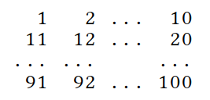

# Skaitļu teorija (LT, 10.kl.)

* **LT.LKMMO** - Lietuvos komandinė mokinių matematikos 
olimpiada (Lietuvas komandveida skolēnu matemātikas olimpiāde)
* **LT.LDK** - Varžybos Lietuvos Didžiosios Kunigaikštystės garbei
(Sacensības Lietuvas Lielkņazistes godam)  
* **LT.RAJ** - Rajono/miesto etapas (Rajona/pilsētas posms)  
* **LT.LMMO** - Lietuvos mokinių matematikos olimpiada (Lietuvas skolēnu
matemātikas olimpiāde: nacionālais posms)  
* **LT.VUMIF** - Vilniaus universiteto Matematikos ir 
informatikos fakulteto olimpiada (Viļņas universitātes 
rīkota olimpiāde skolēniem)

[Matematikos olimpiados](http://mif.vu.lt/matematikos-olimpiados/)

# <lo-sample/> LT.LKMMO.2009.7

Veseli skaitļi $a$ un $b$ apmierina nosacījumu
$$a = a^2 + b^2 - 8b - 2ab + 16.$$
Vai $a$ noteikti ir vesela skaitļa kvadrāts? 
Atbildi pamatojiet.

<!--
Sveikieji skaičiai $a$ ir $b$ tenkina sąlygą
$$a = a^2 + b^2 - 8b - 2ab + 16.$$
Ar būtinai skaičius $a$ yra sveikojo skaičiaus kvadratas? 
Atsakymą pagrįskite.
-->

# <lo-sample/> LT.LKMMO.2009.8

Cik ir naturālu skaitļu $a$, $b$ un $c$ trijnieku $(a; b; c)$, kuri apmierina nosacījumu
$a + b + c = 2009$?
Atrodiet visus tādus trijniekus $(a; b; c)$, kuri apmierinātu šo vienādību, 
bet to reizinājumam $abc$ būtu lielākā iespējamā vērtība.

<!--
Kiek yra natūraliųjų skaičių $a$, $b$ ir $c$ trejetų $(a; b; c)$, tenkinančių sąlygą
$a + b + c = 2009$?
Nurodykite visus tokius trejetus $(a; b; c)$, kurie tenkintų lygybę, 
o jų sandauga $abc$ įgytų didžiausią galimą reikšmę.
-->

# <lo-sample/> LT.LKMMO.2009.9

Veseli nenegatīvi skaitļi $a$ un $b$ apmierina nosacījumu 
$\left(a^2 - 9b^2\right)^2 - 33b = 16$.  
1) Pierādiet, ka $|a-3b| \geq 1$.  
2) Atrodiet visus veselu nenegatīvu skaitļu pārus $(a; b)$, kas apmierina šo vienādību. 

<!--
Neneigiami sveikieji skaičiai $a$ ir $b$ tenkina sąlygą
$\left(a^2 - 9b^2\right)^2 - 33b = 16$.  
1) Įrodykite, kad $|a-3b| \geq 1$.  
2) Raskite visas neneigiamų sveikųjų skaičių poras $(a; b)$, tenkinančias šią lygybę. 
-->

# <lo-sample/> LT.LKMMO.2009.10

Pirmā simta skaitļi $M = \{1, 2, 3, \ldots, 99, 100\}$ 
ir sarakstīti dabiskajā secībā $10 \times 10$ izmēru tabulā, kā 
parādīts zemāk:

Vai no tabulas var izsvītrot $10$ skaitļus tā, lai starp pārpalikušajiem 
$90$ skaitļiem nevarētu atrast $10$-elementu aritmētisku progresiju?

<!--
Pirmosios šimtinės elementai $M = \{1, 2, 3, \ldots, 99, 100\}$ 
yra surašyti natūralia tvarka į $10 \times 10$
matmenų lentelę, kaip parodyta žemiau:

Ar įmanoma išbraukti iš lentelės $10$ skaičių taip, kad tarp likusių 
$90$ skaičių nebūtų galima surasti $10$-elementės aritmetinės progresijos?
-->

# <lo-sample/> LT.LKMMO.2009.13

Atrodiet mazāko iespējamo saucēju tādā nesaīsināmā 
daļā, kura pati ir divu tādu nesaīsināmu daļu summa, kuru 
saucēji ir attiecīgi $600$ un $700$.

<!--
Raskite patį mažiausią galimą vardiklį tokios 
nesuprastinamos trupmenos, kuri pati yra dviejų
nesuprastinamų trupmenų su vardikliais $600$ bei $700$ suma.
-->

# <lo-sample/> LT.LKMMO.2009.14

Ar $f(n)$ apzīmēsim visu vienādojuma 
$4x + 3y + 2z = n$
veselo pozitīvo atrisinājumu $(x; y;z)$ skaitu. Atrodiet
$$f(2009) – f(2000).$$

<!--
Simboliu f(n) pažymėkime visų lygties
$4x + 3y + 2z = n$
sveikųjų teigiamų sprendinių $(x;y;z)$ skaičių. Raskite
$$f(2009) – f(2000).$$
-->

# <lo-sample/> LT.LKMMO.2009.15

Pierādiet vai atspēkojiet, ka skaitlis 
${\underbrace{99\ldots9}_{2005}}^{2009}$
var tikt iegūts, izsvītrojot kaut kādus skaitļa
${\underbrace{99\ldots9}_{2008}}^{2009}$
ciparus.

<!--
Įrodykite arba paneikite, kad skaičius 
${\underbrace{99\ldots9}_{2005}}^{2009}$
gali būti gautas išbraukiant kai kuriuos skaičiaus
${\underbrace{99\ldots9}_{2008}}^{2009}$
skaitmenis. 
-->

# <lo-sample/> LT.LKMMO.2010.6

Ar $n$ apzīmējam naturālu skaitli, kurš dalās ar $2010$ un 
kura decimālpierakstā ir ne vairāk kā viens pāru cipars.  
(A) Atrodiet kaut vienu tādu skaitli.   
(B) Noskaidrojiet, vai var atrast $2010$ tādus skaitļus.  
(C) Atrodiet pašu mazāko tādu skaitli.

<!--
$n$ yra natūralusis skaičius, kuris dalijasi iš $2010$ 
ir kurio dešimtainiame užraše yra daugiausiai vienas
lyginis skaitmuo.  
(A) Nurodykite kokį nors vieną tokį skaičių.  
(B) Nustatykite, ar galima rasti $2010$ tokių skaičių.  
(C) Raskite patį mažiausią tokį skaičių.
-->

# <lo-sample/> LT.LKMMO.2010.7

Atrodiet:  
(A) Kādu naturālu skaitli $n>1$, kurš ir vairāk kā 
$1200$ reižu lielāks par jebkuru savu pirmreizinātāju;  
(B) Vismazāko skaitli ar šo īpašību.

<!--
Nurodykite:  
(A) kokį nors natūralųjį skaičių $n>1$, 
kuris yra daugiau kaip $1200$ kartų didesnis už bet kurį savo
pirminį daliklį;  
(B) patį mažiausią tokį skaičių.
-->

# <lo-sample/> LT.LKMMO.2010.8

Atrodiet visus naturālos skaitļus $n$, kuriem ikviens
no skaitļiem $n^2 - 10n + 23$, 
$n^2 - 9n + 31$ ir $n^2 - 12n + 46$
ir pirmskaitlis.

<!--
Raskite visus natūraliuosius skaičius $n$, 
kuriems kiekvienas iš skaičių $n^2 - 10n + 23$, 
$n^2 - 9n + 31$ ir $n^2 - 12n + 46$
yra pirminis.
-->

# <lo-sample/> LT.LKMMO.2010.9

Atrodiet visus naturālos skaitļus $n$, kuriem 
var atrast tādu "futbola skaitļa" $11$ daudzkārtni 
(t.i. kādu skaitli, kurš dalās ar $11$), 
kura ciparu summa vienāda ar $n$. 

<!--
Raskite visus natūraliuosius skaičius $n$, 
su kuriais egzistuoja toks „futbolo skaičiaus” $11$ kartotinis,
kurio skaitmenų suma lygi $n$.
-->

# <lo-sample/> LT.LKMMO.2010.10

Naturālu skaitli $n$ sauc par *neaizmirstamu*, 
ja to nevar uzrakstīt formā $n=\frac{x^2-1}{y^2-1}$,
kur $x$ un $y$ ir naturāli skaitļi, kas lielāki par $1$.  
(A) Vai skaitlis $2$ ir *neaizmirstams*?  
(B) Vai skaitlis $4$ ir *neaizmirstams*?  
(C) Vai *neaizmirstamu* skaitļu ir bezgalīgi daudz? Atbildi pamatojiet.

<!--
Natūralusis skaičius $n$ vadinamas *nemariuoju*,
jeigu jo negalima užrašyti pavidalu $n=\frac{x^2-1}{y^2-1}$,
kur $x$ ir $y$ yra natūralieji skaičiai, didesni už $1$.  
(A) Ar skaičius $2$ yra *nemarusis*?  
(B) Ar skaičius $4$ yra *nemarusis*?  
(C) Ar *nemariųjų* skaičių yra be galo daug? Atsakymą pagrįskite.
-->

# <lo-sample/> LT.LKMMO.2010.15

Tabulas $n \times n$ rūtiņās kaut kādā secībā 
ierakstīti visi skaitļi 
$1, 2, 3, \ldots, n^2$ pa vienam katrā rūtiņā. 
Jebkuras $n$ tabulas rūtiņas, kas visas atrodas dažādās
tabulas rindiņās un dažādās kolonnās sauksim par retinātām rūtiņām. 
Tabulu sauc par *serbisku*, ja jebkurās $n$ izretinātās rūtiņās
visu skaitļu reizinājuma atlikums, dalot ar $n^2 + 1$ ir 
vienmēr viens un tas pats. Vai eksistē serbiska tabula, kurai  
(A) $n = 8$? (B) $n = 10$?

<!--
Į $n \times n$ lentelės langelius tam tikra tvarka, 
po vieną skaičių į kiekvieną langelį, surašomi visi skaičiai
$1, 2, 3, \ldots, n^2$.
Bet kurie $n$ langelių, esančių skirtingose tos 
lentelės eilutėse ir skirtinguose
stulpeliuose, vadinami išretintais langeliais. 
Lentelė vadinama *serbiškąja*, jeigu bet kurių $n$ išretintų tos
lentelės langelių skaičių sandaugos dalybos iš $n^2 + 1$
liekana yra visada viena ir ta pati. Ar egzistuoja
serbiškoji lentelė, kai  
(A) $n = 8$? (B) $n = 10$?
-->

# <lo-sample/> LT.LKMMO.2011.6

Atrodiet visus naturālos skaitļus $n$, kuriem 
$n^2 - 7n + 10$ dalās ar $n – 3$.

<!--
Raskite visus tokius natūraliuosius skaičius $n$, kad
$n^2 - 7n + 10$ dalijasi iš $n – 3$.
-->

# <lo-sample/> LT.LKMMO.2011.7

(A) Skaitļi $1$, $2$, $3$, $4$, $5$, $6$, $7$, $8$, $9$ un $10$ 
sadalīti pa pāriem. Katrā no šiem pieciem pāriem izrēķināta abu skaitļu summa.
Vai šādi var iegūt piecus dažādus pirmskaitļus?  
(B) Skaitļi $1$, $2$, $3$, $\ldots$, $18$, $19$ un $20$ 
sadalīti pa pāriem. Katrā no šiem desmit pāriem izrēķināta abu skaitļu summa. 
Vai šādi var iegūt desmit dažādus pirmskaitļus?

<!--
(A) Skaičiai $1$, $2$, $3$, $4$, $5$, $6$, $7$, $8$, $9$ ir $10$ 
suskirstyti poromis ir apskaičiuotos visos penkios kiekvienos
poros skaičių sumos. Ar galima tokiu būdu gauti penkis 
skirtingus pirminius skaičius?  
(B) Skaičiai $1$, $2$, $3$, $\ldots$, $18$, $19$ ir $20$ 
suskirstyti poromis ir apskaičiuotos visos dešimt kiekvienos poros
skaičių sumų. Ar galima tokiu būdu gauti dešimt skirtingų pirminių skaičių?
-->

# <lo-sample/> LT.LKMMO.2011.8

Atrodiet visus tos naturālu skaitļu pārus 
$(p,q)$, kuriem $p>q$ un
$\frac{p+1}{p} \cdot \frac{q+1}{q} = \frac{2011}{2010}$.

<!--
Raskite visas tokias natūraliųjų skaičių poras
$(p,q)$, kad $p>q$ ir
$\frac{p+1}{p} \cdot \frac{q+1}{q} = \frac{2011}{2010}$.
-->

# <lo-sample/> LT.LKMMO.2011.9

Atrodiet visus tos veselo skaitļu pārus 
$(x,y)$, kuriem
$$x^2(y-1) + y^2(x-1)=1.$$

<!--
Raskite visas tokias sveikųjų skaičių poras
$(x,y)$, kad
$$x^2(y-1) + y^2(x-1)=1.$$
-->

# <lo-sample/> LT.LKMMO.2011.10

Naturāli skaitļi $a_1 < a_2 < \ldots < a_n$
izceļas ar īpašību, ka jebkuriem dažādiem
indeksiem $i$ un $j$ skaitlis
$a_i$ dalās ar $| a_j - a_i |$. 
Pierādīt, ka visiem indeksiem $i<j$ ir spēkā 
$$ia_j \leq ja_i.$$

<!--
Natūralieji skaičiai $a_1 < a_2 < \ldots < a_n$
pasižymi savybe, kad su bet kuriais skirtingais 
indeksais $i$ ir $j$ skaičius
$a_i$ dalijasi iš $| a_j - a_i |$. 
Įrodykite, kad su visais indeksais $i<j$
galioja
$$ia_j \leq ja_i.$$
-->

# <lo-sample/> LT.LKMMO.2012.6

Aplūkosim visu skaitļa $35$ pozitīvo daudzkārtņu kopu (t.i. skaitļus, kuri dalās ar $35$).  
(A) Atrodiet šīs kopas skaitli, kura visi cipari ir vienādi.  
(B) Atrodiet pašu mazāko šādu skaitli.

<!--
Nagrinėkime visų skaičiaus $35$ teigiamų kartotinių aibę.  
(A) Raskite tos aibės skaičių, 
kurio visi skaitmenys būtų vienodi.
(B) Raskite patį mažiausią tokį skaičių.
-->

# <lo-sample/> LT.LKMMO.2012.7

Putnu barvedis Genis Balis maiņas beigās mēdz
sausajā priedē vēl nedaudz iekalt - 
saskaitīt vai sareizināt kaut ko "stabiņā".
Vakar viņš izvēlējās $7$-ciparu naturālu skaitli 
bez nullēm (nulles barvedis Balis neatzīst), 
to divkāršoja, un nulles divkāršotajā skaitlī atkal neieguva.
Kādu lielāko skaitu reižu var samazināties divkāršojamā 
$7$-ciparu skaitļa ciparu summa?
(To, ka ciparu summa var samazināties, barvedis zināja vēl
neredzējis piemēru $6\,666\,668 \cdot 2 = 13\,333\,336$.)

<!--
Paukščių pulkininkas Genys Balys baigęs pamainą 
labai mėgsta sausoje pušyje dar pakalinėti – sudėti
ar sudauginti ką nors “stulpeliu”. Vakar jis pasiėmė 
$7$-ženklį natūralųjį skaičių be nulių (nulių kaip
skaitmenų pulkininkas Balys nepripažįsta), 
padvigubino jį ir nulių padvigubintame skaičiuje vėl negavo.
Kiek daugiausiai kartų galėjo sumažėti dvigubinamojo 
$7$-ženklio skaičiaus skaitmenų sandauga? 
(Kad sandauga gali sumažėti, pulkininkas žinojo 
dar nematęs pavyzdžio $6\,666\,668 \cdot 2 = 13\,333\,336$.)
-->

# <lo-sample/> LT.LKMMO.2012.8

Nosakiet, cik veselu atrisinājumu 
$(x;y;z)$ ir vienādojumam
$$(x-y)^3 + (y-z)^3 + (z-x)^3 = 30.$$

<!--
Nustatykite, kiek sveikųjų sprendinių
$(x;y;z)$ turi lygtis
$$(x-y)^3 + (y-z)^3 + (z-x)^3 = 30.$$
-->

# <lo-sample/> LT.LKMMO.2012.9

Atrodiet visus naturālu skaitļu trijniekus $(x; y; z)$, kuri apmierina vienādojumu
$x^2 = y \cdot 2^z + 1$
un nosacījumu $x > y > z$.

<!--
Raskite visus natūraliųjų skaičių trejetus $(x; y; z)$, tenkinančius lygtį
$x^2 = y \cdot 2^z + 1$
ir sąlygą $x > y > z$.
-->

# <lo-sample/> LT.LKMMO.2012.10

Apakškopa 
$M \subseteq \{ 1,2,\ldots,2011 \}$
apmierina nosacījumu: izvēloties jebkādus trīs apakškopas $M$ elementus, 
starp tiem vienmēr atradīsies tādi divi elementi $a$ un $b$, ka 
vai nu $a$ dala $b$, vai arī $b$ dala $a$. Kāds lielākais elementu skaits var būt
šādā apakškopā $M$? 

<!--
Poaibis
$M \subseteq \{ 1,2,\ldots,2011 \}$
tenkina sąlygą: kad ir kokius tris to poaibio $M$ elementus beimtume, tarp jų
visada rasis tokie du elementai $a$ ir $b$, kad arba $a$ dalija $b$, arba $b$ dalija $a$. 
Kiek daugiausiai elementų gali būti tokiame poaibyje $M$?
-->

# <lo-sample/> LT.LKMMO.2013.6

Saskaitot sešus pēc kārtas sekojošus naturālus skaitļus, no 
kuriem neviens nedalās ar $7$, iegūts vesela skaitļa kvadrāts $S = n^2$.  
a) Atrodiet visus tādus četrciparu skaitļus $S$.  
b) Cik ir tādu sešciparu skaitļu $S$?

<!--
Sudėjus šešis iš eilės einančius natūraliuosius skaičius, 
iš kurių nė vienas nesidalija iš $7$, gautas
sveikojo skaičiaus kvadratas $S = n^2$.  
a) Raskite visus tokius keturženklius skaičius $S$.  
b) Kiek yra tokių šešiaženklių skaičių $S$?
-->

## Soļi

* Vienīgā iespēja ir sākt ar $m+1$ ($m = 7k$), tad saskaitāmie ir $7k+1,\ldots,7k+6$.
* Aritm. progresijas summa $S(m)=6\cdot 7 \cdot k + 21$. 
* $S(m)$ dalās ar $3$ un $7$, t.i. arī ar $9$ un $49$. 
* Tas arī vienmēr ir nepāru, t.i. $42k+21 \equiv 1\;(\mbox{mod}\;8)$ jeb $k = 4a+2$
* $S(m)=42 k + 21 = 42(4a+2) + 21 = 168a + 105$
* Tā kā $S(m)$ ir pilns kvadrāts, tad tas dalās ar $3^27^2=441$.
* Aplūkojam $S = 441 \cdot (2a+1)$.
 

# <lo-sample/> LT.LKMMO.2013.7

Cik ir tādu naturālu skaitļu $k$, ka trīs skaitļu 
$6^6$, $8^8$ un $k$ mazākais kopīgais dalāmais vienāds $12^{12}$?

<!--
Kiek yra tokių natūraliųjų skaičių $k$, kad mažiausias bendras trijų skaičių 
$6^6$, $8^8$ ir $k$ kartotinis lygus $12^{12}$?
-->

# <lo-sample/> LT.LKMMO.2013.8

Dots naturāls skaitlis $n$. Gan $n$, gan $n+1$ ciparu summa dalās ar $101$.  
a) Atrodiet vismaz vienu tādu skaitli $n$.  
b) Atrodiet mazāko tādu skaitli $n$. 

<!--
Duotas natūralusis skaičius $n$. 
Kiekvieno iš skaičių $n$ ir $n+1$ skaitmenų suma dalijasi iš $101$.  
a) Raskite bent vieną tokį skaičių $n$.  
b) Raskite mažiausią tokį skaičių $n$.
-->

# <lo-sample/> LT.LKMMO.2013.9

Atrodiet visus skaitļa $10^{2013} − 1$ 
naturālos dalītājus, kas nepārsniedz a) $9$; b) $99$.

<!--
Raskite visus skaičiaus $10^{2013} − 1$ 
natūraliuosius daliklius, neviršijančius a) $9$; b) $99$.
-->

# <lo-sample/> LT.LKMMO.2013.10

Pierādiet, ka, ja veseli skaitļi $a, b, c$ apmierina vienādību
$$\frac{a}{b}+\frac{b}{c}+\frac{c}{a}=5,$$
tad reizinājums $abc$ ir vesela skaitļa kubs.

<!--
Įrodykite, kad jei sveikieji skaičiai $a, b, c$ tenkina lygybę
$$\frac{a}{b}+\frac{b}{c}+\frac{c}{a}=5,$$
tai sandauga $abc$ yra sveikojo skaičiaus kubas.
-->

# <lo-sample/> LT.LKMMO.2014.6

Viens no četrciparu naturāla skaitļa cipariem ir $2$. 
Visu četru ciparu summa vienāda ar $22$. 
Bez tam, pats četrciparu skaitlis dalās ar $11$. 
Cik ir tādu četrciparu skaitļu?

<!--
Vienas iš keturženklio natūraliojo skaičiaus skaitmenų yra $2$. 
Visų keturių skaitmenų suma lygi $22$. 
Be to, pats keturženklis skaičius dalijasi iš $11$. 
Kiek yra tokių keturženklių skaičių?
-->

# <lo-sample/> LT.LKMMO.2014.7

Atrodiet šīs vienādojumu sistēmas atrisinājumus veselos skaitļos:

$$\left\{ 
\begin{array}{lcl}
xy + z & = & 27, \\
x+yz & = & 22
\end{array}
\right.$$

<!--
Raskite sveikuosius šios lygčių sistemos sprendinius:
$$xy + z = 27,$$
$$x+yz=22$$
-->

# <lo-sample/> LT.LKMMO.2014.8

Atrodiet visus naturālos skaitļus $n$, kuriem
$3^{2n+1} - 4^{n+1} + 6n$ ir pirmskaitlis. 

<!--
Raskite visus natūraliuosius skaičius n, su kuriais skaičius 
$3^{2n+1} - 4^{n+1} + 6n$ yra pirminis.
-->

# <lo-sample/> LT.LKMMO.2014.9

Naturālu skaitli sauksim par *izcilu*, ja tam 
ir tieši divi atšķirīgi pirmskaitļu dalītāji. 
Piemēram, izcilam skaitlim $100$ ir divi 
pirmskaitļu dalītāji $2$ un $5$. Pierādiet, ka 
$18$ pēc kārtas sekojoši naturāli skaitļi nevar
visi būt izcili. 

<!--
Natūralųjį skaičių vadinkime neprilygstamu, 
jei jis turi lygiai du skirtingus pirminius daliklius.
Pvz., neprilygstamas skaičius $100$ turi du pirminius 
daliklius $2$ ir $5$. Įrodykite, kad $18$ iš eilės
einančių natūraliųjų skaičių negali būti visi neprilygstami.
-->

# <lo-sample/> LT.LKMMO.2014.10

Kurš skaitlis lielāks: $(100!)!$ vai 
$(99!)^{100!}\cdot(100!)^{99!}$? 
(Šeit $n! = 1 \cdot 2 \cdot 3 \cdot \ldots \cdot n$ apzīmē faktoriālu.)

<!--
Kuris skaičius didesnis: $(100!)!$ ar 
$(99!)^{100!}\cdot(100!)^{99!}$? 
(Čia $n! = 1 \cdot 2 \cdot 3 \cdot \ldots \cdot n$ žymi faktorialą.)
-->

# <lo-sample/> LT.LKMMO.2014.11

Viens "divniekotājs"
matemātikas stundās arvien saņem kādu no $4$ atzīmēm: 
$2$, $3$, $4$ vai $5$. 
Viņa $17$ vērtējumu aritmētiskais vidējais ir 
vesels skaitlis. Pierādiet, ka vienu no $4$ atzīmēm 
šis "divniekotājs" saņēma ne vairāk kā divas reizes.

<!--
Vienas dvejetukininkas per matematikos 
pamokas tegauna $4$ pažymius: $2$, $3$, $4$ arba $5$. 
Jo $17$ įvertinimų vidurkis yra sveikasis skaičius. 
Įrodykite, kad vieną iš $4$ pažymių dvejetukininkas
gavo ne daugiau nei du kartus.
-->

# <lo-sample/> LT.LKMMO.2015.6

a) Kuram lielākajam naturālam $k$ skaitlis $120!$ dalās ar 
$12^k$? 
b) Kuram lielākajam naturālam $k$ skaitlis $240!$ dalās 
ar $12^k$? 

<!--
a) Su kokiu didžiausiu natūraliuoju skaičiumi $k$ skaičius $120!$ 
dalijasi iš $12^k$?  
b) Su kokiu didžiausiu natūraliuoju skaičiumi $k$ skaičius $240!$ 
dalijasi iš $12^k$?
-->

# <lo-sample/> LT.LKMMO.2015.7

Trīsciparu skaitlis ar nenulles cipariem ir ar
šādu īpašību: tā ciparus sakārtojot jebkurā secībā, 
iegūtais trīsciparu skaitlis nekad nedalās ar $4$. 
Cik ir tādu trīsciparu skaitļu ar visiem nenulles cipariem? 

<!--
Triženklis skaičius su nenuliniais skaitmenimis 
pasižymi tokia savybe: jo skaitmenis surikiavus
bet kuria tvarka, gautas triženklis skaičius 
niekada nesidalija iš $4$. Kiek yra tokių triženklių
skaičių su nenuliniais skaitmenimis?
-->

# <lo-sample/> LT.LKMMO.2015.8

Divu blakusesošu naturālu skaitļu reizinājumu 
sauksim par *gandrīz kvadrātu*. Pierādiet, ka 
jebkurš gandrīz kvadrāts vienāds ar divu gandrīz 
kvadrātu attiecību. 

<!--
Dviejų gretimų natūraliųjų skaičių sandaugą 
vadinkime beveik kvadratu. Įrodykite, kad bet
kuris beveik kvadratas lygus dviejų beveik kvadratų santykiui.
-->

# <lo-sample/> LT.LKMMO.2015.9

Atrodiet visus pirmskaitļu četriniekus $(p, q, r, s)$, 
kas apmierina nevienādības $0 < p < q < r < s$
un vienādojumu.  
$$1 - \frac{1}{p} - \frac{1}{q} - \frac{1}{r} - \frac{1}{s} = \frac{1}{pqrs}.$$

# <lo-sample/> LT.LKMMO.2015.10

Katram naturālam skaitlim $n>1$ skaitļi
$$\frac{1}{n},\frac{2}{n},\frac{3}{n},\ldots,\frac{n-1}{n}$$
uzrakstīti kā nesaīsināmas daļas un aprēķināta šo daļu skaitītāju summa $f(n)$. 
Kurām $n$ vērtībām skaitlis $f(2015n) − f(n)$ ir pāru?

<!--
Kiekvienam natūraliajam skaičiui $n > 1$ skaičiai
$$\frac{1}{n},\frac{2}{n},\frac{3}{n},\ldots,\frac{n-1}{n}$$
užrašomi kaip nesuprastinamos trupmenos ir apskaičiuojama tų trupmenų skaitiklių suma $f(n)$.
Su kuriomis $n$ reikšmėmis skaičius $f(2015n) − f(n)$ yra lyginis?
-->

# <lo-sample/> LT.LKMMO.2015.11

Uz tāfeles uzrakstīts skaitlis $12$. Vienā gājienā 
atļauts nodzēst uz tāfeles esošo skaitli $N$ un 
uzrakstīt vienu no skaitļiem $2N + 1$ vai $\frac{N}{3}$
(skaitlim jāpaliek veselam). Vai tā var iegūt skaitli  
a) $29$; b) $4095$; c) $100$?

<!--
Lentoje užrašytas skaičius $12$. Vienu ėjimu leidžiama 
nutrinti lentoje užrašytą skaičių $N$ ir
užrašyti vieną iš skaičių $2N + 1$ ir $\frac{N}{3}$
(skaičius turi likti sveikasis). Ar taip galima gauti skaičių  
a) $29$; b) $4095$; c) $100$?
-->

# <lo-sample/> LT.LKMMO.2015.15

Uz tāfeles ir uzrakstīts skaitlis $1345$. 
Jaunutis un Algirdas, pārmaiņus veicot gājienus, spēlē tādu spēli. 
Vienā gājienā uz tāfeles esošajam skaitlim spēlētājs atņem jebkuru tā 
pozitīvu dalītāju vai jebkuru tā dažādu dalītāju summu un iegūto 
skaitli uzrakstīt uz tāfeles sākotnējā skaitļa vietā. Zaudē tas spēlētājs, kurš
savā gājienā uz tāfeles uzraksta skaitli, kas mazāks par $1$. 
Kuram spēlētājam ir uzvaras stratēģija, ja pirmo gājienu veic Jaunutis? 

<!--
Lentoje parašytas skaičius $1345$. Jaunutis ir Algirdas, pakaitomis atlikdami ėjimus, žaidžia
tokį žaidimą. Vienu ėjimu žaidėjas turi iš lentoje esančio skaičiaus atimti bet kurį jo teigiamą
daliklį arba bet kurių jo skirtingų teigiamų daliklių sumą ir gautąjį skaičių užrašyti lentoje
vietoj pradinio. Pralaimi tas žaidėjas, kuris savo ėjimu lentoje užrašo už $1$ mažesnį skaičių.
Kuris žaidėjas turi pergalės strategiją, jei pirmąjį ėjimą atlieka Jaunutis?
-->

# <lo-sample/> LT.LKMMO.2016.6

Atrast visus pirmskaitļu pārus $(p,q)$, kuriem
$p^4 − q^4$ ir naturāls skaitlis, kuram ir 
mazāk kā $8$ (pozitīvi) dalītāji (ieskaitot $1$ un pašu skaitli).

<!--
Raskite visas pirminių skaičių poras $(p,q)$, kurioms 
$p^4 − q^4$ yra natūralusis skaičius, turintis
mažiau nei $8$ (teigiamus) daliklius (įskaitant $1$ ir patį skaičių).
-->

# <lo-sample/> LT.LKMMO.2016.7

Atrast visus pozitīvos vienādojumu sistēmas atrisinājumus $(x,y,z)$:
$$ \left\{
\begin{array}{l}
3\lfloor x \rfloor − \{y\} + \{z\} = 20,3,\\
3\lfloor y \rfloor  + 5\lfloor z \rfloor − \{x\} = 15,1,\\
\{y\} + \{z\} = 0,9.
\end{array} \right. $$
Šeit $\lfloor t \rfloor$ apzīmē skaitļa $t$ veselo daļu
(lielāko veselo skaitli, kas nav lielāks par $t$), bet $\{ t \} = t−\lfloor t \rfloor$
ir skaitļa $t$ daļveida daļas.

<!--
Raskite visus teigiamus lygčių sistemos sprendinius $(x,y,z)$:
$$ \left\{
\begin{array}{l}
3\lfloor x \rfloor − \{y\} + \{z\} = 20,3,\\
3\lfloor y \rfloor  + 5\lfloor z \rfloor − \{x\} = 15,1,\\
\{y\} + \{z\} = 0,9.
\end{array} \right. $$
Čia $\lfloor t \rfloor$ žymi skaičiaus $t$ sveikąją dalį 
(didžiausią sveikąjį skaičių, ne didesnį už $t$), o $\{ t \} = t−\lfloor t \rfloor$
yra skaičiaus $t$ trupmeninė dalis.
-->

# <lo-sample/> LT.LKMMO.2016.8

Atrast visus vienādojuma $x+y = \sqrt{x} + \sqrt{y} + \sqrt{xy}$ 
naturālos atrisinājumus $(x, y)$.

<!--
Raskite visus lygties $x+y = \sqrt{x} + \sqrt{y} + \sqrt{xy}$ 
natūraliuosius sprendinius $(x, y)$.
-->

# <lo-sample/> LT.LKMMO.2016.9

Audrius uzrakstīja deviņus deviņciparu naturālus skaitļus. 
Ikvienā skaitlī ir visi cipari 
$1,2,3,4,5,6,7,8,9$. Uzrakstīto skaitļu 
summas pēdējie $k$ cipari ir nulles. 
Atrodiet lielāko iespējamo skaitļa $k$ vērtību.

<!--
Audrius užrašė devynis devynženklius natūraliuosius skaičius. 
Kiekviename skaičiuje yra visi
skaitmenys $1,2,3,4,5,6,7,8,9$. Užrašytųjų skaičių 
sumos paskutinieji $k$ skaitmenų yra
nuliai. Raskite didžiausią galimą skaičiaus $k$ reikšmę.
-->

# <lo-sample/> LT.LKMMO.2016.10

Pierādiet: Jebkuram naturālam skaitlim $n > 1$ 
eksistē tāds naturāls skaitlis $m > n^n$,
ka $n^m − m^n$ dalās ar $n + m$.

<!--
Įrodykite: bet kuriam natūraliajam skaičiui 
$n > 1$ egzistuoja toks natūralusis skaičius $m > n^n$,
kad $n^m − m^n$ dalijasi iš $n + m$.
-->

# <lo-sample/> LT.LKMMO.2016.15

Uz tāfeles uzrakstītas $9$ zvaigznītes $\ast\ast\ast\ast\ast\ast\ast\ast\ast$. 
Gervazs un Protazs spēlē sekojošu spēli, pārmaiņus izdarīdami 
gājienus un izmantodami ciparus $1, 2, 3, 4, 5, 6, 7, 8, 9$. 
Gervazs, kurš sāk spēli, gājiena laikā ieraksta ciparu 
jebkuras zvaigznītes vietā. Savukārt Protazs vienā gājienā pārvērš 
par cipariem jebkuras divas zvaigznītes. Katru ciparu var izmantot tikai 
vienreiz. Protazs uzvar, ja beigās iegūtais skaitlis ar deviņiem 
dažādiem cipariem, kas iegūts katram spēlētājam izdarot trīs gājienus, 
dalās ar $27$.
Vai Protazam ir uzvaras stratēģija (t.i. vai viņš vienmēr 
var uzvarēt, lai kā spēlētu Gervazs)?

<!--
Lentoje užrašytos 9 žvaigždutės $\ast\ast\ast\ast\ast\ast\ast\ast\ast$. Gervazas ir Protazas 
žaidžia tokį žaidimą, pakaitomis atlikdami ėjimus ir naudodami 
skaitmenis $1, 2, 3, 4, 5, 6, 7, 8, 9$. Gervazas, kuris ir
pradeda žaidimą, ėjimo metu turi įrašyti skaitmenį vietoj 
bet kurios žvaigždutės. Savuoju ėjimu Protazas turi pakeisti 
skaitmenimis bet kurias dvi žvaigždutes. Skaitmenį galima panaudoti
tik vieną kartą. Protazas laimi, jeigu galutinis skaičius 
su devyniais skirtingais skaitmenimis,
gautas žaidėjams atlikus po tris ėjimus, dalijasi iš $27$. 
Ar Protazas turi pergalės strategiją (t. y.
ar jis visada gali laimėti, kaip bežaistų Gervazas)?
-->

# <lo-sample/> LT.LKMMO.2017.6

Skaitlis $p$ ir pirmskaitlis, bet skaitlis $3p + 10$ ir sešu pēc kārtas 
sekojošu naturālu skaitļu kvadrātu summa. 
Pierādiet, ka $p − 7$ dalās ar $36$.

<!--
Skaičius $p$ pirminis, o skaičius $3p + 10$ yra šešių iš eilės einančių 
natūraliųjų skaičių kvadratų
suma. Įrodykite, kad $p − 7$ dalijasi iš $36$.
-->

# <lo-sample/> LT.LKMMO.2017.7

Veselo skaitļu kopu apzīmējam ar $\mathbb{Z}$.  
a) Vai jebkuriem tās pašas paritātes naturāliem skaitļiem $a$ un $b$ eksistē tādi reāli 
skaitļi $x \not\in \mathbb{Z}$ un $y \not\in \mathbb{Z}$, 
ka $x + y \in \mathbb{Z}$ un $ax + by \in \mathbb{Z}$?  
b) Va jebkuriem atšķirīgas paritātes naturāliem skaitļiem $a$ un $b$ eksistē tādi
reāli skaitļi $x \not\in \mathbb{Z}$ un $y \not\in \mathbb{Z}$, ka
$x + y \in \mathbb{Z}$ un $ax + by \in \mathbb{Z}$?

<!--
Sveikųjų skaičių aibę pažymėkime $\mathbb{Z}$.  
a) Ar bet kuriems to paties lyginumo natūraliesiems skaičiams $a$ ir $b$ egzistuoja tokie realieji
skaičiai $x \not\in \mathbb{Z}$ ir $y \not\in \mathbb{Z}$, 
kad $x + y \in \mathbb{Z}$ ir $ax + by \in \mathbb{Z}$?  
b) Ar bet kuriems skirtingo lyginumo natūraliesiems skaičiams $a$ ir $b$ egzistuoja tokie realieji
skaičiai $x \not\in \mathbb{Z}$ ir $y \not\in \mathbb{Z}$, kad 
$x + y \in \mathbb{Z}$ ir $ax + by \in \mathbb{Z}$?
-->

# <lo-sample/> LT.LKMMO.2017.8

Naturāla skaitļa $a$ ciparu summu apzīmēsim ar $S(a)$. 
Vai eksistē tāds naturāls skaitlis $n$, ka
$S(n) \cdot S(n + 1) = 465$?

<!--
Natūraliojo skaičiaus $a$ skaitmenų sumą žymėkime $S(a)$. 
Ar egzistuoja toks natūralusis skaičius $n$, kad
$S(n) \cdot S(n + 1) = 465$?
-->

# <lo-sample/> LT.LKMMO.2017.9

Naturāli skaitļi $a$ un $b$ apmierina nosacījumu 
$$a − b = 5b^2 − 4a^2 > 0.$$
Pierādiet, ka $a - b$ ir vesela skaitļa kvadrāts.

<!--
Natūralieji skaičiai $a$ ir $b$ tenkina sąlygą
$$a − b = 5b^2 − 4a^2 > 0.$$
Įrodykite, kad $a − b$ yra sveikojo skaičiaus kvadratas.
-->

# <lo-sample/> LT.LKMMO.2017.10

Naturāla skaitļa $N$ jebkuram dalītājam $d$ (ieskaitot dalītājus 
$1$ un $N$) skaitlis
$d + 2$ ir pirmskaitlis. Kāds lielākais pozitīvu dalītāju skaits var būt skaitlim $N$? 

<!--
Natūraliojo skaičiaus $N$ bet kuriam teigiamam dalikliui $d$ 
(įskaitant daliklius $1$ ir $N$) skaičius
$d + 2$ yra pirminis. Kiek daugiausiai teigiamų daliklių gali turėti $N$?
-->

# <lo-sample/> LT.LKMMO.2017.11

Kastē sajauktas $100$ kartiņas, kas bija pēc kārtas 
sanumurētas ar skaitļiem $1, 2, 3, \ldots, 100$. Cik vismaz kartiņu no kastes ir 
neskatoties jāizvelk, lai izvilkto skaitļu reizinājums noteikti dalītos ar $192$?

<!--
Dėžėje sumaišytos guli $100$ kortelių, iš eilės sunumeruotos skaičiais $1, 2, 3, \ldots, 100$. Kiek
mažiausiai kortelių reikia nežiūrint ištraukti iš dėžės, kad ištrauktų skaičių sandauga būtinai
dalytųsi iš $192$?
-->

# <lo-sample/> LT.LKMMO.2018.6

Naturālu skaitli $N$ sauksim par *jauku*, ja 
tam labajā pusē pierakstot jebkuru nenulles ciparu $a$, 
iegūtais jaunais skaitlis vienmēr dalās ar $a$.  
a) Atrodiet kaut vienu jauku skaitli.  
b) Atrodiet vismazāko jauko skaitli.

<!--
Natūralųjį skaičių $N$ vadinsime smagiu, 
jei prie jo iš dešinės prirašius bet kurį nenulinį skaitmenį $a$,
gautasis naujas skaičius visada dalijasi iš $a$.   
a) Raskite bent vieną smagų skaičių.  
b) Raskite mažiausią smagų skaičių.
-->

# <lo-sample/> LT.LKMMO.2018.7

Trīs naturāli skaitļi $a,b,c$ apmierina vienādojumu 
$a^3b^3 + b^3c^3 + c^3a^3 = abc(a^3 + b^3 + c^3)$. Pierādiet, 
ka vismaz viens no skaitļiem $ab, bc, ca$ ir naturāla skaitļa kvadrāts.

<!--
Trys natūralieji skaičiai $a, b, c$ tenkina lygtį 
$a^3b^3 + b^3c^3 + c^3a^3 = abc(a^3 + b^3 + c^3)$. Įrodykite,
kad bent vienas iš skaičių $ab, bc, ca$ yra natūraliojo skaičiaus kvadratas.
-->

# <lo-sample/> LT.LKMMO.2018.8

Veseli skaitļi $x_1, x_2,\ldots, x_n$, $y_1, y_2,\ldots, y_n$
apmierina nosacījumus:
$$x_1 + x_2 + \ldots + x_n = y_1 + y_2 + \ldots + y_n = 0,$$ 
$$x_1^2 + y_1^2 = x_2^2 + y_2^2 = \ldots = x_n^2 + y_n^2 > 0.$$
Pierādiet, ka skaitlis $n$ ir pāru skaitlis. 

<!--
Sveikieji skaičiai $x_1, x_2,\ldots, x_n$, $y_1, y_2,\ldots, y_n$
tenkina sąlygas
$$x_1 + x_2 + \ldots + x_n = y_1 + y_2 + \ldots + y_n = 0,$$ 
$$x_1^2 + y_1^2 = x_2^2 + y_2^2 = \ldots = x_n^2 + y_n^2 > 0.$$
Įrodykite, kad natūralusis skaičius $n$ yra lyginis.
-->

# <lo-sample/> LT.LKMMO.2018.9

Aušra vienu pēc otra uzrakstīja $8$ pirmskaitļus, kas
mazāki par $200$ (ne obligāti dažādus). Tad 
Aušrine pie pirmā Aušras skaitļa pieskaitīja $1$, 
pie otrā pieskaitīja $2$, pie trešā pieskaitīja $3$, $\ldots$, 
pie astotā pieskaitīja $8$. Aurora Aušrines iegūtos $8$
skaitļus sareizināja. Ar kādu lielāko divnieka pakāpi $2^n$, 
kur $n$ ir naturāls skaitlis, var dalīties Auroras iegūtais skaitlis?

<!--
Aušra vieną po kito užrašė $8$ pirminius skaičius,
mažesnius už $200$ (nebūtinai skirtingus). Tada
Aušrinė prie pirmojo Aušros skaičiaus pridėjo $1$, 
prie antrojo pridėjo $2$, prie trečiojo pridėjo $3$, $\ldots$, 
prie aštuntojo pridėjo $8$. Aurora Aušrinės gautus $8$ skaičius sudaugino. Iš kokio
didžiausio dvejeto laipsnio $2^n$, 
kur skaičius $n$ natūralusis, gali dalytis Auroros gautas skaičius?
-->

# <lo-sample/> LT.LKMMO.2018.10

Uz tāfeles uzrakstīts skaitlis $2018$. Rītis un Vakare spēlē 
spēli, pārmaiņus izdarot gājienus; Rītis sāk. Gājiena laikā 
Rītim pie skaitļa, kas ir uz tāfeles, labajā pusē jāpieraksta
jebkurš cipars. Vakarei sava gājiena laikā jāpieraksta skaitlim, kas
ir uz tāfeles, jāpieraksta jebkurus divus ciparus. Ja pēc jebkura 
Vakares gājiena skaitlis uz tāfeles dalās ar $112$, tad Vakare uzvar. 
Ja uz tāfeles esošajam skaitlim ir vismaz $2018$ ciparu, bet Vakare vēl 
nav uzvarējusi, tad uzvar Rītis. Kuram no spēlētājiem ir uzvaras stratēģija.

<!--
Lentoje užrašytas skaičius $2018$. Rytis ir Vakarė žaidžia žaidimą, pakaitomis atlikdami ėjimus;
pradeda Rytis. Ėjimo metu Rytis turi prie lentoje užrašyto skaičiaus iš dešinės prirašyti vieną
bet kokį skaitmenį. Vakarė savo ėjimo metu turi prie lentoje užrašyto skaičiaus iš dešinės
prirašyti du bet kokius skaitmenis. Jei po kurio nors Vakarės ėjimo gautasis skaičius dalijasi
iš $112$, tai Vakarė laimi. Jei lentoje užrašytas skaičius turi bent $2018$ skaitmenų, o Vakarė dar
nelaimėjo, tai laimi Rytis. Kuris iš žaidėjų turi pergalės strategiją?
-->

# <lo-sample/> LT.LDK.2009.1

Naturāls skaitlis $N$ dalās ar $2009$ un 
tā decimālpieraksta ciparu summa vienāda ar $2009$.  
(A) Atrast vienu šādu skaitli,  
(B) Atrast mazāko šādu skaitli.

<!--
The natural number $N$ is a multiple of $2009$ 
and the sum of its (decimal) digits
equals $2009$.  
(A) Find one such number.  
(B) Find the smallest such number.
-->

# <lo-sample/> LT.LDK.2009.5

Aplūkojam tabulu, kuras šūnās ierakstīti veseli skaitļi. 
Viena un tā paša vesela skaitļa pieskaitīšanu visiem skaitļiem tanī pašā
tabulas rindiņā vai tanī pašā kolonnā sauksim par *operāciju*. Ir zināms, 
ka bezgalīgi daudziem naturāliem $n$, ar galīgu operāciju skaitu var iegūt 
tabulu, kurā visi elementi dalās ar $n$. Pierādiet, ka ar galīgu skaitu operāciju 
var iegūt tabulu, kur visi elementi ir nulles.

<!--
Consider a table whose entries are integers. Adding a same integer to all entries on
a same row, or on a same column, is called an operation. It is given that, for infinitely
many positive integers $n$, one can obtain, through a finite number of operations, a
table having all entries divisible by $n$. Prove that, through a finite number of
operations, one can obtain the table whose all entries are zeroes. 
-->

# <lo-sample/> LT.LDK.2010.2

Atrast visus naturālos skaitļus $n$, kuriem eksistē dažādi veseli skaitļi
$a_1,a_2,\ldots,a_n$ tādi, ka
$$\frac{1}{a_1}+\frac{2}{a_2}+\cdots+\frac{n}{a_n}=\frac{a_1 + a_2 + \cdots + a_n}{2}.$$

<!--
Find all positive integers $n$ for which there are distinct integer numbers
$a_1,a_2,\ldots,a_n$ such that
$$\frac{1}{a_1}+\frac{2}{a_2}+\cdots+\frac{n}{a_n}=\frac{a_1 + a_2 + \cdots + a_n}{2}.$$
-->

# <lo-sample/> LT.LDK.2010.5

Atrast naturālos skaitļus $n$, kas apmierina sekojošus divus nosacījumus:  
(a) $n$ dalot ar $9$, dalījums ir pozitīvs trīsciparu skaitlis, kuram 
ir vienādi cipari.  
(b) $n+36$ dalot ar $4$, dalījums ir četrciparu skaitlis, tā cipari 
ir $2$, $0$, $0$, $9$ kaut kādā secībā.

<!--
Find positive integers $n$ that satisfy the following two conditions:  
(a) the quotient obtained when $n$ is divided by $9$ is a positive three
digit number, that has equal digits.  
(b) the quotient obtained when $n + 36$ is divided by $4$ is a four digit
number, the digits beeing $2$, $0$, $0$, $9$ in some order.
-->

# <lo-sample/> LT.LDK.2011.1

Veselie skaitļi $a$, $b$ un $c$ apmierina nosacījumu
$ab + bc + ca = 1$. Vai skaitlis
$(1 + a^2)(1 + b^2)(1 + c^2)$ 
ir pilns kvadrāts? Kāpēc?

<!--
Integers $a$, $b$ and $c$ satisfy the condition 
$ab + bc + ca = 1$. Is it true that the
number $(1 + a^2)(1 + b^2)(1 + c^2)$ 
is a perfect square? Why?
-->

# <lo-sample/> LT.LDK.2011.3

Atrast visus pirmskaitļus $p, q$ tādus, ka 
$p^3 - q^7 = p-q$. 

<!--
Find all primes $p,q$ such that
$p^3 - q^7 = p-q$. 
-->

# <lo-sample/> LT.LDK.2011.5

Naturāli skaitļi $1,2,3,\ldots,n$ ir uzrakstīti uz tāfeles ($n > 2$). Katru 
minūti divus skaitļus nodzēš un to vietā uzraksta to summas mazāko pirmreizinātāju. 
Beigās paliek tikai skaitlis $97$. Atrast mazāko $n$, kuram tasir iespējams.

<!--
Positive integers $1,2,3,\ldots,n$ are written on a blackboard ($n > 2$). Every
minute two numbers are erased and the least prime divisor of their sum is
written. In the end only the number $97$ remains. Find the least $n$ for which it is
possible.
-->

# <lo-sample/> LT.LDK.2012.4

Ar $m$ apzīmēts naturāls skaitlis. Atrodiet visas ierobežotās 
veselu skaitļu virknes $a_1,a_2,a_3,\ldots$ kuriem 
$a_n+a_{n+1}+a_{n+m} = 0$ visiem
$n \in \mathbb{N}$.

<!--
Let $m$ be a positive integer. Find all bounded sequences of
integers $a_1,a_2,a_3,\ldots$ for which $a_n+a_{n+1}+a_{n+m} = 0$ for all
$n \in \mathbb{N}$.
-->

# <lo-sample/> LT.LDK.2013.3

Uz tāfeles uzrakstīts skaitlis $1234567890$. Divi spēlētāji 
$A$ un $B$ spēlē sekojošu spēli, pārmaiņus izdarot gājienus.
Vienā gājienā spēlētājs nodzēš skaitli, kas ir uz tāfeles, piemēram $m$, 
un tā vietā uzraksta starpību, kur no $m$ atņem jebkuru 
naturālu skaitli, kas nepārsniedz skaitļa $m$ ciparu summu. 
Uzvar tas spēlētājs, kurš pirmais smazina skaitli uz tāfeles līdz $0$. 
Noteikt, kuram no spēlētājiem ir uzvaroša stratēģija, ja 
spēlētājs $A$ izdara pirmo gājienu.

<!--
The number $1234567890$ is written on the blackboard. Two
players $A$ and $B$ play the following game taking alternate moves.
In one move, a player erases the number which is written on the
blackboard, say, $m$, subtracts from $m$ any positive integer not
exceeding the sum of the digits of $m$ and writes the obtained
result instead of $m$. The first player who reduces the number
written on the blackboard to $0$ wins. Determine which of the
players has the winning strategy if the player $A$ makes the first
move.
-->

# <lo-sample/> LT.LDK.2013.4

Naturālu skaitli $n>2$ saucam par *savdabīgu*, ja skaitlis 
$${n \choose i} + {n \choose j} - i - j$$
ir pāru skaitlis visiem $i$ un $j$ tādiem, ka $0 \leq i \leq j \leq n$.
Atrodiet visus savdabīgos skaitļus.

<!--
A positive integer n > 2 is called peculiar if the number
$${n \choose i} + {n \choose j} - i - j$$
is even for all integers $i$ and $j$ such that $0 \leq i \leq j \leq n$.
Determine all peculiar numbers.
-->

# <lo-sample/> LT.LDK.2014.4

Noteikt visus naturālos skaitļus $n > 1$, kuriem $n+D(n)$ ir skaitļa
$10$ pakāpe, kur $D(n)$ apzīmē lielāko skaitļa $n$ dalītāju, kuram 
$D(n) < n$.

<!--
Determine all positive integers $n > 1$ for which $n+D(n)$ is a
power of $10$, where $D(n)$ denotes the largest integer divisor of
$n$ satisfying $D(n) < n$.
-->

# <lo-sample/> LT.LDK.2015.4

Ar $\mbox{LKD}(\ldots)$ apzīmē skaitļu
$(\ldots)$ lielāko kopīgo dalītāju. 
Naturāli skaitļi $a,b,c$ apmierina četrus nosacījumus:
$$\begin{array}{rcl}
\mbox{LKD}(a, b, c) & = & 1, \\
\mbox{LKD}(a, b + c) & > & 1, \\
\mbox{LKD}(b, c + a) & > & 1, \\
\mbox{LKD}(c, a + b) & > & 1. \\
\end{array}$$
a) Vai ir iespējams, ka $a + b + c = 2015$?  
b) Noteikt mazāko iespējamo vērtību summai $a+b+c$.

<!--
We denote by $\mbox{gcd}(\ldots)$ the greatest common divisor of the numbers in
$(\ldots)$. (For example, $\mbox{gcd}(4, 6, 8)=2$ and $\mbox{gcd}(12, 15)=3$.) Suppose that
positive integers $a,b,c$ satisfy the following four conditions:
$$\begin{array}{rcl}
gcd(a, b, c) & = & 1, \\
gcd(a, b + c) & > & 1, \\
gcd(b, c + a) & > & 1, \\
gcd(c, a + b) & > & 1. \\
\end{array}$$
a) Is it possible that $a + b + c = 2015$?  
b) Determine the minimum possible value that the sum $a+b+c$ can
take.
-->

# <lo-sample/> LT.LDK.2016.4

Noteikt visus naturālos skaitļus $n$, kuriem 
$7^n−1$ dalās ar $6^n−1$.

<!--
Determine all positive integers $n$ such that 
$7^n−1$ is divisible by $6^n−1$.
-->

# <lo-sample/> LT.LDK.2017.4

Pierādīt, ka ir bezgalīgi daudz naturālu skaitļu $n$, ka
skaitļa $n(n+3)$ dažādo nepāra pirmreizinātāju skaits dalās ar $3$. 
(Piemēram, skaitlim $180 = 2^2 \cdot 3^2 \cdot 5$ ir divi dažādi nepāru pirmreizinātāji, 
bet skaitlim 
$840 = 2^3 \cdot 3 \cdot 5 \cdot 7$ tādu ir trīs.)

<!--
Show that there are infinitely many positive integers $n$ such that the
number of distinct odd prime factors of $n(n + 3)$ is a multiple of $3$.
(For instance, $180 = 2^2 \cdot 3^2 \cdot 5$ has two distinct odd prime factors and
$840 = 2^3 \cdot 3 \cdot 5 \cdot 7$ has three.)
-->

# <lo-sample/> LT.LDK.2018.4

Atrast visus naturālos skaitļus $n$, kuriem eksistē naturāls $k$, ka 
ikvienam pozitīvam skaitļa $n$ dalītājam $d$, skaitlis $d-k$ arī ir
(ne obligāti pozitīvs) skaitļa $n$ dalītājs. 

<!--
Find all positive integers $n$ for which there exists a positive integer $k$
such that for every positive divisor $d$ of $n$, the number $d-k$ is also
a (not necessarily positive) divisor of $n$.
-->

# <lo-sample/> LT.RAJ.2010.9_10.1

Savākušies riekstu, iz meža pa pāriem iznāk bērni. 
Katrā pārī ir meitene un puisis. Bez tam, 
katram puisim ir divreiz vairāk vai divreiz mazāk 
nekā meitenei viņa pārī. Vai var būt tā, ka 
visiem bērniem kopā ir $2009$?

<!--
Prisirinkę riešutų, iš miško poromis išeina vaikai. 
Kiekvienoje poroje yra mergaitė ir berniukas. 
Be to, kiekvienas berniukas turi dvigubai daugiau arba
perpus mažiau riešutų nei jo porininkė mergaitė. 
Ar gali būti taip, kad iš viso vaikai
turi $2009$ riešutus?
-->

# <lo-sample/> LT.RAJ.2010.9_10.4

Atrodiet visus trīsciparu skaitļus, kuri ir $12$
reizes lielāki par savu ciparu summu. 

<!--
Raskite visus triženklius skaičius, kurie $12$ 
kartų didesni už savo skaitmenų sumą.
-->

# <lo-sample/> LT.RAJ.2010.11_12.2

Petrjuks izvēlējās trīs dažādus nenulles ciparus. 
Tad viņš saskaitīja visus deviņus divciparu skaitļus, 
ko var uzrakstīt, izmantojot tikai šos trīs ciparus, 
bet iegūto summu izdalīja ar $3$. Tādā veidā viņš
ieguva trīsciparu skaitli, kura decimālajā pierakstā 
atpazina visus trīs sākotnējos ciparus. Kuru 
skaitli ieguva Petrjuks?

<!--
Petriukas pasirinko tris skirtingus nenulinius skaitmenis. 
Tada visus devynis dviženklius skaičius, kuriuos 
galima užrašyti naudojantis vien tais trimis
skaitmenimis, jis sudėjo, o sumą padalijo iš $3$. 
Tokiu būdu jis gavo triženklį skaičių,
kurio dešimtainėje išraiškoje atpažino 
visus tris pradinius skaitmenis. Kokį skaičių gavo
Petriukas?
-->

# <lo-sample/> LT.RAJ.2010.11_12.3

Atrodiet visus naturālos skaitļus $n$, kuriem 
vienādojumam $2x + 3y = n$
ir vairāk veselu nenegatīvu atrisinājumu
$(x, y)$ nekā vienādojumiem $2x + 3y = n + 1$.

<!--
Raskite visus natūraliuosius skaičius $n$, 
kuriems lygtis $2x + 3y = n$
turi daugiau sveikųjų neneigiamų sprendinių 
$(x, y)$ nei lygtis $2x + 3y = n + 1$.
-->

# <lo-sample/> LT.RAJ.2011.9_10.2

Divu naturālo skaitļu $m$ un $n$ mazākais kopīgais
dalāmais ir $8$ reizes lielāks par šo skaitļu lielāko 
kopīgo dalītāju. Pierādiet, ka $m$ dalās ar $n$ vai arī
$n$ dalās ar $m$. 

<!--
Dviejų natūraliųjų skaičių $m$ ir $n$ mažiausias 
bendrasis kartotinis $8$ kartus didesnis už tų skaičių 
didžiausią bendrąjį daliklį. Įrodykite, kad $m$ dalijasi iš $n$
arba $n$ dalijasi iš $m$.
-->

# <lo-sample/> LT.RAJ.2011.9_10.4

Dots vienādojums$x^2 + 5y^3 = t^2$.  
a) Vai šī vienādojuma veselo atrisinājumu kopa ir galīga?  
b) Vai šī vienādojuma naturālo atrisinājumu kopa ir galīga?

<!--
Duota lygtis $x^2 + 5y^3 = t^2$.  
a) Ar šios lygties sveikųjų sprendinių aibė baigtinė?  
b) Ar šios lygties natūraliųjų sprendinių aibė baigtinė?
-->

# <lo-sample/> LT.RAJ.2011.11_12.1

Naturāli skaitļi $m$ un $n$ apmierina vienādību 
$(m−n)^2 = \frac{4mn}{m+n−1}$.
Pierādiet, ka $m+n$ ir naturāla skaitļa kvadrāts.

<!--
Natūralieji skaičiai $m$ ir $n$ tenkina lygybę 
$(m−n)^2 = \frac{4mn}{m+n−1}$. Įrodykite,
kad $m+n$ yra natūraliojo skaičiaus kvadratas. 
-->

# <lo-sample/> LT.RAJ.2011.11_12.3

Divu naturālu skaitļu reizinajums ir naturāla 
skaitļa kvadrāts.  
a) Pierādiet, ka šo divu skaitļu starpība 
nevar būt vienāda ar $2$.  
b) Kādi var būt šie divi skaitļi, ja to starpība
vienāda ar $3$? Atrodiet visus variantus. 

<!--
Dviejų natūraliųjų skaičių sandauga 
yra natūraliojo skaičiaus kvadratas.  
a) Įrodykite, kad tų dviejų skaičių skirtumas 
negali būti lygus $2$.  
b) Kokie gali būti tie du skaičiai, 
jei jų skirtumas lygus $3$? Raskite visus variantus.
-->

# <lo-sample/> LT.VILNIUS.2011.9_10.4

$p$ un $q$ ir tādi pirmskaitļi, ka 
$p^2+1$ dalās ar $q$, bet $q^2-1$ dalās
ar $p$. Pierādiet, ka $p+q+1$ ir salikts skaitlis.

<!--
$p$ ir $q$ – tokie pirminiai skaičiai, kad 
$p^2+1$ dalijasi iš $q$, o $q^2-1$ dalijasi
iš $p$. Įrodykite, kad $p+q+1$ – sudėtinis skaičius.
-->

# <lo-sample/> LT.VILNIUS.2011.11_12.4

Atrodiet visus veselos skaitļus $x$, 
kuriem skaitlis $$2^x + 5$ ir
racionāla skaitļa kvadrāts.

<!--
Raskite visus sveikuosius skaičius $x$, 
su kuriais skaičius $2^x + 5$ yra
racionalaus skaičiaus kvadratas.
-->

# <lo-sample/> LT.RAJ.2012.9_10.1

Pamāte lika Sigutei atnest no ezera tik daudz ūdens, 
cik ieiet spainī, bet pašu spaini noslēpa. 
Sigute atrada divus toverus, vienu - $9$ reizes ietilpīgāku 
par spaini, bet otru - $13$ reizes.  
a) Izdomājiet, kā Sigutei izpildīt Pamātes rīkojumu, 
izmantojot vien šos toverus.  
b) Citreiz Pamāte lika vienu reizi atnest tieši tik 
ezera ūdens, cik ieiet $7$ tādos spaiņos. Kā Sigutei 
to izdarīt (vēl arvien, izmantojot tikai tos pašus toverus)?  
c) Kādu vēl spaiņu skaitu Sigute var izmērīt ar šiem 
diviem toveriem? Atrodiet visus variantus.

<!--
Pamotė liepė Sigutei atnešti iš ežero tiek vandens, 
kiek telpa į kibirą, bet patį kibirą paslėpė. 
Sigutė terado du kubilus, vieną − $9$ kartus talpesnį už kibirą,
o kitą − $13$ kartų.  
a) Sugalvokite, kaip Sigutei įvykdyti Pamotės paliepimą, 
naudojantis vien šiais kubilais.  
b) Kitąsyk Pamotė liepė per vieną kartą atnešti 
lygiai tiek ežero vandens, kiek
telpa $7$ tokiuose kibiruose. Kaip Sigutei tai padaryti 
(vėlgi turint tik tuos pačius kubilus)?  
c) Kiek dar kibirų vandens Sigutė gali tiksliai 
pamatuoti dviem kubilais? Raskite visus variantus.
-->

# <lo-sample/> LT.RAJ.2012.9_10.2

Atrodiet visus trīsciparu skaitļus $\overline{abc}$, 
kuru cipari $a$, $b$ un $c$ apmierina vienādību
$$56a + 7b + c = 426.$$

<!--
Raskite visus triženklius skaičius $\overline{abc}$, 
kurių skaitmenys $a$, $b$ ir $c$ tenkina lygybę
$$56a + 7b + c = 426.$$
-->

# <lo-sample/> LT.RAJ.2012.11_12.2

Naturāli skaitļi bez atstarpēm pēc kaŗtas sarakstīti 
viens pēc cita:
$$12345678910111213\ldots$$
a) Kāds ir trīsdesmitais cipars šajā virknē?  
b) Kādi ir simtais un $400$-ais cipari?  
c) Kāds ir $2012$-ais cipars?

<!--
Natūralieji skaičiai be tarpų iš eilės surašyti vienas po kito:
$$12345678910111213\ldots$$
a) Koks yra trisdešimtasis skaitmuo šioje sekoje?  
b) Koks yra šimtasis bei $400$-asis skaitmenys?  
c) Koks yra $2012$-asis skaitmuo?
-->

# <lo-sample/> LT.RAJ.2012.11_12.3

Dota tāda veselu skaitļu virkne $x_1, x_2, x_3, \ldots$, 
ka $x_1 = 1$, $x_2 = 2$ un
katram naturālam $n > 2$ ir spēkā viena no divām vienādībām:
$x_n = x_{n-1} - x_{n-2}$ vai $x_n = -(x_{n-1} - x_{n-2})$.  
a) Atrodiet $x_{2012}$ un summu $x_1 + x_2 + \ldots + x_{2012}$, 
ja zināms, ka visi virknes locekļi ir nenegatīvi.  
b) Pierādīt, ka nav tādas virknes, kas apmierina 
uzdevuma nosacījumu un $x_{2012} = 1$.  
c) Pierādīt, ka eksistē tādas uzdevuma nosacījumu apmierinošas 
virknes, ka $x_{2012} = 2$ un 
$x_{2012} = 4$.  
d) Pierādīt, ka eksistē tāda uzdevuma nosacījumu apmierinoša
virkne, ka $x_{2012} = 2012$.

<!--
Duota tokia sveikųjų skaičių seka $x_1, x_2, x_3, \ldots$, 
kad $x_1 = 1$, $x_2 = 2$ ir
kiekvienam natūraliajam $n > 2$ galioja viena iš dviejų lygybių:
$x_n = x_{n-1} - x_{n-2}$ arba $x_n = -(x_{n-1} - x_{n-2})$.  
a) Raskite $x_{2012}$ ir sumą $x_1 + x_2 + \ldots + x_{2012}$, 
jei žinoma, kad visi sekos nariai
neneigiami.  
b) Įrodykite, kad nėra tokios uždavinio 
sąlygą tenkinačios sekos, kad $x_{2012} = 1$.  
c) Įrodykite, kad egizstuoja tokios uždavinio 
sąlygą tenkinačios sekos, kad $x_{2012} = 2$ ir 
kad $x_{2012} = 4$.  
d) Įrodykite, kad egzistuoja tokia uždavinio sąlygą 
tenkinati seka, kad $x_{2012} = 2012$.
-->

# <lo-sample/> LT.RAJ.2012.11_12.5

Dots vienādojums
$$(x^2 − y)(y^2 − x) + x^3 + y^3 = a,$$
kur $a$ ir attiecīgs vesels skaitlis.  
a) Atrodiet visus naturālus vienādojuma atrisinājumus $(x, y)$, 
kad $a = 2$ un kad $a = 0$.  
b) Atrodiet vismaz pa vienai naturālai $a$ vērtībai, ar kuru 
vienādojumam ir tieši $2$ un tieši $3$ naturāli atrisinājumi 
$(x,y)$.  
c) Vai ar kādu naturālu $a$ vērtību dotajam vienādojumam ir tieši 
$2012$ naturālu atrisinājumu $(x,y)$? Atbildi pamatojiet.  
d) Pierādiet, ka, ja ar atbilstošu naturālu skaitli $a>20$
vienādojumam ir vismaz viens naturāls atrisinājums $(x,y)$, 
tad skaitlim $a$ ir vismaz $8$ dažādi naturāli dalītāji 
(ieskaitot vieninieku un viņu pašu).

<!--
Duota lygtis
$$(x^2 − y)(y^2 − x) + x^3 + y^3 = a,$$
kur $a$ yra tam tikras sveikasis skaičius.  
a) Raskite visus natūraliuosius lygties sprendinius $(x, y)$, 
kai $a = 2$ ir kai $a = 0$.  
b) Raskite po bent vieną natūraliąją $a$ reikšmę, 
su kuria lygtis turi lygiai $2$ ir lygiai
$3$ natūraliuosius sprendinius $(x, y)$.  
c) Ar turi su kokia nors natūraliąja $a$ reikšme 
duotoji lygtis lygiai $2012$ natūraliųjų
sprendinių $(x, y)$? Atsakymą pagrįskite.  
d) Įrodykite, kad jei su tam tikru natūraliuoju 
skaičiumi $a > 20$ lygtis turi bent
vieną natūralųjį sprendinį $(x, y)$, 
tai skaičius $a$ turi mažiausiai $8$ skirtingus 
natūraliuosius daliklius (įskaitant vienetą ir jį patį).
-->

# <lo-sample/> LT.RAJ.2013.9_10.1

Četriem pēc kārtas sekojošiem naturāliem skaitļiem 
apgriezto skaitļu summa vienāda ar $19/20$. 
Atrodiet šos naturālos skaitļus.

<!--
Keturiems iš eilės einantiems natūraliesiems 
skaičiams atvirkštinių skaičių suma lygi $19/20$. 
Raskite šiuos natūraliuosius skaičius.
-->

# <lo-sample/> LT.RAJ.2013.9_10.5

Atrodiet naturālu skaitļu $p$, $p+8$ un
$2p^2+43$ reizinājumu, ja zināms, ka 
visi trīs skaitļi ir pirmskaitļi.

<!--
Raskite natūraliųjų skaičių $p$, $p+8$ ir 
$2p^2+43$ sandaugą, jei žinoma,
kad visi trys skaičiai yra pirminiai.
-->

# <lo-sample/> LT.RAJ.2013.9_10.4A

Veseli skaitļi $x$, $y$ un $z$ apmierina vienādojumu
$$x^2 + xy + y^2 = 2013z^2.$$
a) Atrodiet kaut vienu šī vienādojuma atrisinājumu $(x,y,z)$.  
b) Atrodiet visus šī vienādojuma atrisinājumus $(x,y,z)$.

<!--
Sveikieji skaičiai $x$, $y$ ir $z$ tenkina lygtį
$$x^2 + xy + y^2 = 2013z^2.$$
a) Raskite bent vieną šios lygties sprendinį $(x,y,z)$.  
b) Raskite visus šios lygties sprendinius $(x,y,z)$.
-->

# <lo-sample/> LT.RAJ.2013.11_12.3

Rakstniekam Grebļūnam ir alerģija pret skaitļiem $2$ un $5$. 
Tādēļ visās viņa grāmatās lappuses sanumurētas, izlaižot
ikvienu šo abu skaitļu daudzkārtni. 
Rakstniekam Kočelam ir alerģija pret skaitļiem $3$ un $7$. 
Tādēļ viņa grāmatās tāpat izlaisti lappušu numuri, kuri 
ir attiecīgo skaitļu daudzkārtņi. 
Bibliotekāre atšķīrusi pēdējās lappuses kaut kādās
četrās šo autoru grāmatās, ievērojusi, ka
pēdējo lappušu numuri ir $501$, $80$, $400$, $1049$ 
(pēdējo grāmatu rakstījuši abi šie autori kopīgi).
Cik lappušu šajās grāmatās ir patiesībā?

<!--
Rašytojas Grėbliūnas yra alergiškas skaičiams $2$ ir $5$. 
Todėl visose jo knygose puslapiai sunumeruoti 
praleidžiant kiekvieno iš šių skaičių kartotinius. 
Rašytojas Kočėlas alergiškas skaičiams 3 ir 7. 
Todėl jo knygose taip pat praleidžiami visi
atitinkami puslapiai. Bibliotekininkė atsivertusi 
paskutiniuosius keturių šių rašytojų
knygų puslapius pamanė, kad puslapių jose 
yra po 501, 80, 400 ir 1049 (paskutinė
knyga rašyta abiejų autorių bendrai). 
Po kiek puslapių šiose knygose yra iš tikrųjų?
-->

# <lo-sample/> LT.RAJ.2013.11_12.4

a) Vai vienādojumam
$$\frac{3x^2 + 16xy + 15y^2}{x^2 + y^2} = 21$$
ir atrisinājums? Atbildi pamatojiet.  
b) Atrodiet lielāko izteiksmes 
$$\frac{3x^2 + 16xy + 15y^2}{x^2 + y^2}$$
vērtība.  
c) Taisnleņķa trijstūra katešu garumi 
$u$ un $v$ un izteiksmes 
$$\frac{ux^2 + vxy}{x^2 + y^2}$$
lielākā vērtība $M$ ir naturāli skaitļi. Pierādiet, 
ka trijstūra hipotenūzas garums arī ir naturāls skaitlis. 
(Te $x$ un $y$ ir jebkuri reāli skaitļi, 
ar kuriem definētas izteiksmes.)

<!--
a) Ar lygtis
$$\frac{3x^2 + 16xy + 15y^2}{x^2 + y^2} = 21$$
turi sprendinių? Atsakymą pagrįskite.  
b) Raskite didžiausią reiškinio
$$\frac{3x^2 + 16xy + 15y^2}{x^2 + y^2}$$
reikšmę.  
c) Stačiojo trikampio statinių ilgiai 
$u$ ir $v$ bei reiškinio 
$$\frac{ux^2 + vxy}{x^2 + y^2}$$
didžiausia reikšmė $M$ 
yra natūralieji skaičiai. Įrodykite, kad trikampio 
įžambinės ilgis taip pat yra natūralusis skaičius.
(Čia $x$ ir $y$ visur yra bet kokie realieji skaičiai, 
kuriems reiškiniai apibrėžti.)
-->

# <lo-sample/> LT.RAJ.2014.9_10.4

Naturāls skaitlis $n$ ir tāds, ka
$n^2 + 26$ dalās ar $n+2$. Atrodiet  
a) vismaz divus tādus naturālus skaitļus $n$;  
b) visus tādus naturālus skaitļus $n$.

<!--
Natūralusis skaičius $n$ yra toks, kad 
$n^2 + 26$ dalijasi iš $n+2$. Raskite  
a) bent du tokius natūraliuosius skaičius $n$;  
b) visus tokius natūraliuosius skaičius $n$.
-->

# <lo-sample/> LT.RAJ.2015.9_10.1

Burti $a$, $b$, $c$ un $d$ apzīmē atšķirīgus
ciparus. Sareizinot divciparu naturālus skaitļus
$\overline{ab}$ un $\overline{cb}$, 
iegūts trīsciparu skaitlis $\overline{ddd}$. Atrodiet visas
izteiksmes $(a + c)(a^2 + c^2)(a^a + c^c)$ vērtības.

<!--
Raidės $a$, $b$, $c$ ir $d$ žymi skirtingus 
skaitmenis. Sudauginus dviženklius
natūraliuosius skaičius $\overline{ab}$ ir $\overline{cb}$, 
gaunamas triženklis skaičius $\overline{ddd}$. Raskite visas galimas
reiškinio $(a + c)(a^2 + c^2)(a^a + c^c)$ reikšmes.
-->

# <lo-sample/> LT.RAJ.2015.9_10.2

Piecu pēc kārtas sekojošu naturālu skaitļu 
virknē pirmo trīs skaitļu kvadrātu summa vienāda
ar pēdējo divu skaitļu kvadrātu summu. 
a) ARaskite bent vieną
tokį rinkinį. b) Ar yra daugiau tokių rinkinių?

<!--
Penkių iš eilės einančių natūraliųjų skaičių 
sekoje pirmųjų trijų skaičių
kvadratų suma lygi paskutiniųjų dviejų skaičių 
kvadratų sumai. a) Raskite bent vieną
tokį rinkinį. b) Ar yra daugiau tokių rinkinių?
-->

# <lo-sample/> LT.RAJ.2015.9_10.5

Atrodiet visus reālos skaitļus $x \neq 0$, 
kuriem abi skaitļi $x+\sqrt{35}$
un $\frac{1}{x}-\sqrt{35}$ ir veseli.  
*Piezīme.* Galima naudotis faktu, kad jei natūralusis 
skaičius $a$ nėra tikslusis kvadratas, tai $\sqrt{a}$ 
yra iracionalusis skaičius.

<!--
Raskite visus realiuosius skaičius $x \neq 0$, 
su kuriais abu skaičiai $x+\sqrt{35}$
ir $\frac{1}{x}-\sqrt{35}$ yra sveikieji.  
*Pastaba.* Galima naudotis faktu, kad jei natūralusis 
skaičius $a$ nėra tikslusis kvadratas, tai $\sqrt{a}$ 
yra iracionalusis skaičius.
-->

# <lo-sample/> LT.RAJ.2015.11_12.1

Aiste uzrakstīja skaitļu virkni:
$$1 \cdot (2-3)^4, 4 \cdot (5-6)^7, 7 \cdot (8-9)^{10},\ldots, 
2014 \cdot (2015-2016)^{2017}.$$
a) Cik locekļu veido Aistes virkni?  
b) Kam vienādi visu virknes locekļu summa?  
c) Kāds ir pēdējais cipars visu virknes locekļu kvadrātu summai?

<!--
Aistė užrašė skaičių seką:
$$1 \cdot (2-3)^4, 4 \cdot (5-6)^7, 7 \cdot (8-9)^{10},\ldots, 
2014 \cdot (2015-2016)^{2017}.$$
a) Kiek narių sudaro Aistės seką?  
b) Kam lygi visų sekos narių suma?  
c) Koks yra paskutinis visų sekos narių kvadratų sumos skaitmuo?
-->

# <lo-sample/> LT.RAJ.2015.11_12.4

Astoņus ciparus $1$, $2$, $3$, $4$, $5$, $6$, 
$7$, $8$ sarakstot noteiktā secībā, 
iegūts astoņciparu skaitlis $n = \overline{ABCDEFGH}$. 
Par sešiem trīsciparu skaitļiem $\overline{ABC}$,
$\overline{BCD}$, $\ldots$, $\overline{FGH}$ 
ir zināms, ka pirmais no tiem dalās ar $7$, 
otrais – ar $6$, trešais – iš $5$, $\ldots$, 
sestais – iš $2$. Bez tam, skailis $\overline{DEF}$, 
kurš dalās ar $4$, nedalās ar $8$. Atrodiet
tādu skaitli $n$ un pierādiet, ka tas ir viens vienīgs.

<!--
Aštuonis skaitmenis $1$, $2$, $3$, $4$, $5$, $6$, 
$7$, $8$ surašius tam tikra tvarka,
gautas aštuonženklis skaičius $n = \overline{ABCDEFGH}$. 
Apie šešis triženklius skaičius $\overline{ABC}$,
$\overline{BCD}$, $\ldots$, $\overline{FGH}$ 
yra žinoma, kad pirmasis iš jų dalijasi iš $7$, 
antrasis – iš $6$, trečiasis – iš $5$, $\ldots$, 
šeštasis – iš $2$. Be to, skaičius $\overline{DEF}$, 
kuris dalijasi iš $4$, nesidalija iš $8$. Raskite
tokį skaičių $n$ ir įrodykite, kad jis vienintelis.
-->

# <lo-sample/> LT.RAJ.2015.11_12.5

Zināms, ka reāls skaitlis $x$ nav vienāds ar $0$, un 
ka tieši trīs no četriem skaitļiem
$$x, x + x^{-1}, x^2 + x^{-2}, x2 − 4x$$
ir veseli. Atrodiet visas iespējamās skaitļa $x$ vērtības.
*Piezīme.* Var izmantot faktu, ka, ja naturāls skaitlis $a$ 
nav pilns kvadr'ats, tad 
$\sqrt{a}$ ir iracionāls skaitlis.

<!--
Žinoma, kad realusis skaičius $x$ nelygus $0$ 
ir kad lygiai trys iš keturių skaičių
$$x, x + x^{-1}, x^2 + x^{-2}, x2 − 4x$$
yra sveikieji. Raskite visas galimas skaičiaus $x$ reikšmes.
*Pastaba.* Galima naudotis faktu, kad jei natūralusis 
skaičius $a$ nėra tikslusis kvadratas, tai 
$\sqrt{a}$ yra iracionalusis skaičius.
-->

# <lo-sample/> LT.RAJ.2016.9_10.3

Atrodiet mazāko naturālu sešciparu skaitli, 
kuram visi cipari ir atšķirīgi un kurš 
dalās ar $2$, $3$, $4$, $5$ un $6$.

<!--
Raskite mažiausią natūralųjį šešiaženklį skaičių, 
kurio visi skaitmenys
yra skirtingi ir kuris dalijasi iš $2$, $3$, $4$, $5$ ir $6$.
-->

# <lo-sample/> LT.RAJ.2016.9_10.4

Ir doti trīs dažādi naturāli skaitļi. 
Jebkuru divu šo skaitļu summa dalās ar atlikušo skaitli.  
a) Atrast kaut vienu šādu skaitļu trijnieku, kurā
lielākais skaitlis būtu $9009$.  
b) Pierādiet, ka jebkura šāda trijnieka skaitļu summa dalās 
ar $6$. 

<!--
Duoti trys skirtingi natūralieji skaičiai. 
Bet kurių dviejų skaičių suma
dalijasi iš likusio skaičiaus. 
a) Raskite bent vieną tokį skaičių trejetą, 
kuriame didžiausias skaičius būtų $9009$. 
b) Įrodykite, kad bet kurio tokio trejeto skaičių suma dalijasi
iš $6$.
-->

# <lo-sample/> LT.RAJ.2016.11_12.1

Kad ganam jautāja, cik viņš audzē aitu, āžu un 
ēzeļu, viņš atbildēja: 
„Ja puse no manām aitām pārvērstos par ēzeļiem, 
tad āžu man būtu divreiz vairāk nekā ēzeļu. 
Ja pusi no maniem ēzeļiem pārvērstos par āžiem, tad 
āžu man būtu par pieciem vairāk nekā aitu. 
Ja pusi no maniem āžiem kļūtu par aitām, tad 
aitu man būtū septiņreiz vairāk nekā ēzeļu." 
Cik pavisam dzīvnieku audzē gans?

<!--
Kai piemens paklausė, kiek jis augina avių, 
ožkų ir asilų, jis atsakė:
„Jei pusė mano avių virstų asilais, ožkų 
turėčiau dvigubai daugiau nei asilų. Jei pusė
mano asilų virstų ožkomis, ožkų turėčiau 
penkiomis daugiau nei avių. Jei pusė mano
ožkų virstų avimis, tai avių turėčiau septynis 
kartus daugiau nei asilų.” Kiek iš viso
gyvūnų augina piemuo?
-->

# <lo-sample/> LT.RAJ.2016.11_12.4

Onute uz četrām kartiņām uzraksta pa ciparam. 
Izmantojot visas $4$ kartiņas, viņa izveidoja 
divus divciparus naturālus skaitļus. 
Jonuks novēroja, ka divas kartiņas ir vienādas, vienu 
no tām novāca un no atlikušajiem trim cipariem izveidoja
trīsciparu skaitli $n = \overline{ABC}$, kas vienāds ar Onutes
divciparu skaitļu summu. Atrodiet visas 
iespējamās skaitļa $n$ vērtības. 

<!--
Onutė keturiose kortelėse užrašė po skaitmenį. 
Panaudojusi visas $4$ korteles, ji sudarė du 
dviženklius natūraliuosius skaičius. Jonukas pastebėjo, kad
dvi kortelės vienodos, pašalino vieną iš jų ir iš 
likusių trijų skirtingų skaitmenų sudarė
triženklį skaičių $n = ABC$, lygų Onutės dviženklių 
skaičių sumai. Raskite visas galimas
skaičiaus $n$ reikšmes.
-->

# <lo-sample/> LT.RAJ.2016.11_12.4

Dota funkcija $f(x) = \frac{x^3}{1+x^3}$. 
Ikvienam naturālu skaitļu pārim 
$(a,b)$, kad $1 \leq a, b \leq 2016$, 
ir aprēķināta funkcijas vērtība
$f\left( \frac{a}{b} \right)$ un tad ir atrodama visu 
šīs funkcijas vērtību summa $s$. 
Pierādīt, ka $2s$ ir vesela skaitļa kvadrāts.

<!--
Duota funkcija $f(x) = \frac{x^3}{1+x^3}$. 
Kiekvienai natūraliųjų skaičių porai
$(a,b)$, kai $1 \leq a, b \leq 2016$, 
apskaičiuojama funkcijos reikšmė 
$f\left( \frac{a}{b} \right)$ ir tada randama visų
šių funkcijos reikšmių suma $s$. 
Įrodykite, kad $2s$ yra sveikojo skaičiaus kvadratas.
-->

# <lo-sample/> LT.RAJ.2017.9_10.1

Cik ir piecciparu skaitļu $\overline{ab51c}$, kuri dalās ar $72$?

<!--
Kiek yra penkiaženklių skaičių $\overline{ab51c}$, kurie dalijasi iš $72$?
-->

# <lo-sample/> LT.RAJ.2017.9_10.4

Ikvienā $3 \times 4$ tabulas rūtiņā
Sofija ierakstīja pa vienam naturālam skaitlim. 
Visi tabulā ierakstītie skaitļi ir atšķirīgi. 
Izrādījās, ka visās tabulas rindiņās skaitļu summas
ir savā starpā vienādas un arī visās tabulas
kolonnās skaitļu summas ir savā starpā vienādas. 
Visu tabulā ierakstīto skaitļu summu apzīmēsim ar $s$. 
Atrodiet visas iespējamās summas $s$, kas mazākas par $130$. 

<!--
Kiekviename $3 \times 4$ lentelės langelyje 
Sofija įrašė po vieną natūralųjį
skaičių. Visi lentelėje įrašyti skaičiai yra skirtingi. 
Paaiškėjo, kad visų eilučių skaičių
sumos yra tarpusavyje lygios ir visų stulpelių 
skaičių sumos yra tarpusavyje lygios.
Visų lentelėje parašytų skaičių sumą pažymėkime $s$. 
Raskite visas įmanomas sumos $s$
reikšmes, mažesnes už $130$.
-->

# <lo-sample/> LT.RAJ.2017.11_12.1

Tādu naturālu $n$-ciparu skaitļu, kuru 
decimālpierakstā nav cipara $2$, bet
ir vismaz viens cipars $1$, 
skaitu apzīmējam ar $a_n$.  
a) Atrodiet skaitļa $a_6$ decimālpierakstu.  
b) Pierādiet, ka  
$\sqrt{2a_7 - 16a_6}$ 
ir vesels skaitlis. 

<!--
Natūraliųjų $n$-ženklių skaičių, kurių 
dešimtainėje išraiškoje nėra skaitmens $2$, 
bet yra bent vienas skaitmuo $1$, 
kiekį pažymėkime $a_n$. 
a) Raskite skaičiaus $a_6$
dešimtainę išraišką. 
b) Įrodykite, kad 
$\sqrt{2a_7 - 16a_6}$ 
yra sveikasis skaičius.
-->

# <lo-sample/> LT.RAJ.2017.11_12.4

Kādā ārvalstu pilsētā publiskā transporta biļete
ir derīga $7$ dienas vai $30$ dienas. 
Biļetes attiecīgi maksā $7$ EUR $3$ centus, vai 
$30$ EUR. Students ir nodomājis būt pilsētā $3$
gadus, t.i. $1096$ dienas, bet sabiedrisko 
transportu izmantot ikdienas. 
Kāds ir mazākais naudas daudzums, ko viņš
var iztērēt biļetēm? 

<!--
Viename užsienio mieste viešojo transporto 
bilietas galioja $7$ dienas
arba $30$ dienų. Bilietas atitinkamai kainuoja 
$7$ Eur $3$ ct arba $30$ Eur. Studentas ketina
mieste išbūti $3$ metus, t. y. 
$1096$ dienas, o viešuoju transportu naudotis kasdien. Kiek
mažiausiai pinigų jis gali išleisti bilietams?
-->

# <lo-sample/> LT.RAJ.2017.11_12.5

Naturāli skaitļi $a$, $m$, $n$ apmierina
vienādojumu 
$$(a^2 + 2)^m = (2a - 1)^n.$$
Atrodiet visas iespējamās skaitļaa $a$ vērtības.

<!--
Natūralieji skaičiai $a$, $m$, $n$ tenkina lygtį
$$(a^2 + 2)^m = (2a - 1)^n.$$
Raskite visas galimas skaičiaus $a$ reikšmes.
--> 

# <lo-sample/> LT.VUMIF.2016.9.3

Atrodiet visas naturālas $n$ vērtības, kurām skaitli s
$\frac{n^3 + 3}{n^2 + 7}$
ir naturāls.

<!--
Raskite visas natūraliąsias $n$ reikšmes, su kuriomis skaičius
$\frac{n^3 + 3}{n^2 + 7}$
yra natūralusis.
-->

# <lo-sample/> LT.VUMIF.2016.10.3

Atrodiet mazāko naturālo skaitli $n$, kuram skaitļi 
$\sqrt[5]{5n}$, $\sqrt[6]{6n}$, $\sqrt[7]{7n}$
ir naturāli. 

<!--
Raskite mažiausią natūralųjį skaičių $n$, kuriam skaičiai
$\sqrt[5]{5n}$, $\sqrt[6]{6n}$, $\sqrt[7]{7n}$
yra natūralieji.
-->

# <lo-sample/> LT.VUMIF.2016.11_12.1

Agne savā traukā ielēja $p$ litrus ūdens, 
bet Bens savā traukā ielēja $q$ litrus ūdens. 
Pārmaiņus veikdami gājienus, viņi spēlē sekojošu spēli. 
Gājiena laikā spēlētājs no sava trauka otra spēlētāja
traukā ielej tik daudz ūdens, 
cik ūdens jau ir otrā spēlētāja traukā.
Spēli sāk Agne. Pēc simts gājieniem Agnes traukā
bija $q$ litri ūdens, bet Bena traukā - $p$ litri ūdens. 
Atrodiet $\frac{p}{q}$.

<!--
Agnė į savo turimą indą įpylė $p$ litrų vandens, 
o Benas į savąjį indą įpylė $q$ litrų vandens.
Pakaitomis atlikdami ėjimus, jie žaidžia tokį žaidimą. 
Ėjimo metu žaidėjas iš savo indo į
kito žaidėjo indą turi įpilti tiek vandens, 
kiek jo tuo metu yra kito žaidėjo inde. Žaidimą
pradėjo Agnė. Po šimto ėjimų Agnės inde buvo $q$ 
litrų vandens, o Beno – $p$ litrų vandens.
Raskite $\frac{p}{q}$.
-->

# <lo-sample/> LT.VUMIF.2016.11_12.3

Noskaidrojiet, vai eksistē tāds naturāls skaitlis $n$, ka 
skaitlis $n \cdot 2^{2016} - 7$ ir
naturāla skaitļa kvadrāts.

<!--
Nustatykite, ar egzistuoja toks natūralusis skaičius $n$, 
kad skaičius $n \cdot 2^{2016} - 7$ yra
natūraliojo skaičiaus kvadratas.
-->

# <lo-sample/> LT.VUMIF.2017.9.2

Vai izmantojot tieši pa vienai reizei visus desmit ciparus 
$0,1,2,\ldots,9$ var uzrakstīt divus naturālus skaitļus, ka 
viens skaitlis būtu otra kvadrāts?  
*Piezīme.* Pirmais skaitļa cipars nevar būt nulle.

<!--
Ar panaudojus po lygiai vieną kartą visus dešimt skaitmenų
$0,1,2,\ldots,9$ galima užrašyti du natūraliuosius skaičius, 
kad vienas skaičius būtų kito kvadratas?  
*Pastaba.* Pirmasis skaičiaus skaitmuo negali būti nulis. 
-->

# <lo-sample/> LT.VUMIF.2017.10.1

Atrodiet visus veselu skaitļu pārus $(a,b)$, 
kuriem eksistē tādi veseli skaitļi $x$ un
$y$, ka
$$8x^4 + 8y^4 = a^4 + 6a^2b^2 + b^4.$$

<!--
Raskite visas sveikųjų skaičių poras $(a,b)$, 
kurioms egzistuoja tokie sveikieji skaičiai $x$ ir
$y$, kad
$$8x^4 + 8y^4 = a^4 + 6a^2b^2 + b^4.$$
-->

# <lo-sample/> LT.VUMIF.2017.10.2

Atrodiet visus veselo skaitļu $m$ un $n$ pārus
$(m,n)$, kas apmierina vienādību 
$$m^2 + 2m - 9 = n^2 + n.$$

<!--
Raskite visas sveikųjų skaičių $m$ ir $n$ poras 
$(m, n)$, tenkinančias lygybę
$$m^2 + 2m - 9 = n^2 + n.$$
-->

# <lo-sample/> LT.VUMIF.2017.11_12.2

Atrodiet vienādojuma
$$x^2y^2 + 208 + 4(\mbox{LKD}(x,y) + \mbox{MKD}(x,y))^2$$
visus naturālos atrisinājumus $(x,y)$. 
Šeit $\mbox{LKD}(x,y)$ un $\mbox{MKD}(x,y)$ attiecīgi apzīmē skaitļu 
$x$ un $y$ lielāko kopīgo dalītāju un mazāko kopīgo dalāmo. 

<!--
Raskite lygties
$$x^2y^2 + 208 + 4(\mbox{DBD}(x,y) + \mbox{MBK}(x,y))^2$$
visus natūraliuosius sprendinius $(x,y)$. 
Čia $\mbox{DBD}(x,y)$ ir $\mbox{MBK}(x,y)$ atitinkamai žymi
skaičių $x$ ir $y$ didžiausią bendrą daliklį ir 
mažiausią bendrą kartotinį.
-->

# <lo-sample/> LT.VUMIF.2017.11_12.4

Uz tāfeles uzrakstīts skaitlis $636363$. 
Divi spēlētāji $A$ un $B$ pārmaiņus veic gājienus, 
pirmo gājienu izdara $A$. 
Gājiena laikā ir jānodzēš uz tāfeles esošais skaitlis un 
jāuzraksta tā starpība ar jebkuru viņa naturālu dalītāju. 
Spēlētājs, kurš uzraksta $0$, zaudē. Noskaidrojiet, kuram 
spēlētājam ir uzvaras stratēģija, un parādiet to.

<!--
Lentoje užrašytas skaičius $636363$. 
Du žaidėjai $A$ ir $B$ pakaitomis atlieka ėjimus, pirmąjį
ėjimą atlieka $A$. Ėjimo metu reikia nutrinti 
lentoje esantį skaičių ir užrašyti jo ir bet kurio
jo natūraliojo daliklio skirtumą. Žaidėjas, užrašęs 
skaičių $0$, pralaimi. Nustatykite, kuris
žaidėjas turi pergalės strategiją, ir nurodykite ją.
-->

# <lo-sample/> LT.VUMIF.2018.9.4

Naturālam skaitlim $M = 3N$ 
ir tikpat ciparu, cik naturālam skaitlim $N > 10$. 
Lai iegūtu skaitli $M$, vajag palielināt
ikvienu skaitļa $N$ ciparu: vienam no cipariem 
pieskaitīt $2$, bet pie atlikušajiem cipariem 
pieskaitīt pa nepāru naturālam skaitlim (ne obligāti 
visiem to pašu). 
Atrodiet visas iespējamās skaitļa $N$ pēdējā 
cipara vērtības.

<!--
Natūralusis skaičius $M = 3N$ 
turi tiek pat skaitmenų, kaip ir
natūralusis skaičius $N > 10$. 
Norint gauti skaičių $M$, reikia padidinti 
kiekvieną iš skaičiaus $N$ skaitmenų: prie vieno skaitmens
pridėti $2$, o prie likusių skaitmenų 
pridėti po nelyginį natūralųjį
skaičių (nebūtinai po tą patį). 
Raskite visas galimas skaičiaus $N$
paskutinio skaitmens reikšmes.
-->

# <lo-sample/> LT.VUMIF.2018.10.4

Skaitļa $n>1$ visu pozitīvo dalītāju 
(ieskaitot $1$ un $n$) reizinājums vienāds ar $n^3$.
Norādiet visas iespējamās skaitļa $n$ vērtības, 
uzrakstot, kāds var būt skaitļa $n$ sadalījums pirmreizinātājos. 

<!--
Skaičiaus $n>1$ visų teigiamų daliklių 
(įskaitant $1$ ir $n$) sandauga lygi $n^3$.
Nurodykite visas galimas skaičiaus $n$ reikšmes, 
užrašydami, koks gali būti skaičiaus $n$ 
skaidinys pirminiais daugikliais.
-->

# <lo-sample/> LT.VUMIF.2018.11_12.4

Naturālie skaitļi $p$, $x$, $y$ apmierina vienādojumus:
Natūralieji skaičiai $p$, $x$, $y$ tenkina lygtis:
$p + 1 = 2x^2,\;\;p^2 + 1 = 2y^2.$$
Noskaidrojiet visas iespējamās skaitļa $p$ vērtības, ja 
zināms, ka šis skaitlis ir pirmskaitlis. 

<!--
Natūralieji skaičiai $p$, $x$, $y$ tenkina lygtis:
$p + 1 = 2x^2,\;\;p^2 + 1 = 2y^2.$$
Nustatykite visas galimas skaičiaus $p$ reikšmes, 
jei žinoma, kad šis skaičius pirminis.
-->

# <lo-sample/> LT.VUMIF.2019.9.1

Atrodiet visus veselu skaitļu trijniekus $(x,y,z)$, 
kas apmierina vienādojumu sistēmu
$$
\left\{ \begin{array}{l}
x^3 + y^3 = z^3 + 1,\\
y^2 - x^2 = x+y,\\
2x^3 - 6x = z^3 - 4x^2.
\end{array} \right.$$

<!--
Raskite visus sveikųjų skaičių trejetus $(x,y,z)$, 
tenkinančius lygčių sistemą
$$
\left\{ \begin{array}{l}
x^3 + y^3 = z^3 + 1,\\
y^2 - x^2 = x+y,\\
2x^3 - 6x = z^3 - 4x^2.
\end{array} \right.$$
-->

# <lo-sample/> LT.VUMIF.2019.9.1

Algis un Balis spēlē sekojošu spēli, 
pārmaiņus izdarīdami gājienus. Sākumā 
ir divas monētu kaudzītes: vienā kaudzītē
ir $m$ monētas, bet otrā $n$ monētas.
Gājiena laikā jāveic jebkura viena no trim 
sekojošām darbībām:
1) izmest vienu monētu no jebkuras kaudzītes;
2) izmest pa vienai monētai no abām kaudzītēm; 
3) pārcelt vienu monētu no jebkuras kaudzītes uz otru kaudzīti. 
Sāk Algis. Spēlētājs, kurš nevar veikt gājienu, zaudē. 
Noskaidrojiet visus naturālu skaitļu pārus $(m,n)$, 
kuriem Balim ir uzvaras stratēģija, t.i. kurām viņš var
nodrošināt uzvaru, lai kā spēlētu Algis. 

<!--
Algis ir Balys žaidžia tokį žaidimą, 
pakaitomis atlikdami ėjimus. Pradžioje
yra dvi monetų krūvelės: vienoje krūvelėje 
yra $m$ monetų, o kitoje yra $n$
monetų. Ėjimo metu reikia atlikti bet 
kurį vieną iš šių trijų veiksmų: 
1) išmesti vieną monetą iš bet kurios krūvelės; 
2) išmesti po vieną monetą iš abiejų krūvelių; 
3) perkelti vieną monetą iš bet kurios krūvelės į kitą. 
Pradeda Algis. Žaidėjas, negalintis atlikti ėjimo, 
pralaimi. Nustatykite visas natūraliųjų skaičių $(m,n)$ 
poras, kurioms Balys turi pergalės strategiją, t. y.
kurioms jis gali užsitikrinti pergalę, 
kad ir kaip žaistų Algis.
-->

# <lo-sample/> LT.VUMIF.2019.9.4

Jurgis uzrakstīja trīs naturālus skaitļus, 
no kuriem katrs beidzas ar to pašu ciparu, ar kuru 
beidzas pārējo divu skaitļu summa, un sareizināja tos. 
Jurgis uzrakstīja tikai reizinājuma pēdējos trīs 
ciparus. Kādu ciparu trijnieku viņš varēja iegūt? 
Atrodiet visas iespējas. 

<!--
Jurgis užrašė tris natūraliuosius skaičius, 
iš kurių kiekvienas baigiasi tuo
pačiu skaitmeniu kaip kitų dviejų skaičių 
suma, ir sudaugino juos. Jurgis
užrašė tik sandaugos paskutinius tris 
skaitmenis. Kokį skaitmenų trejetą jis
galėjo gauti? Raskite visas galimybes.
-->

# <lo-sample/> LT.VUMIF.2019.10.4

Naturālu skaitli sauksim par *septiņīgu*, 
ja tam ir tieši $70$ ciparu: $10$ vieninieku, 
$10$ divnieku, $\ldots$, $10$ septiņnkieku. 
Pierādīt, ka, ja viens septiņīgs skaitlis dalās
ar citu septiņīgu skaitli, tad tie ir vienādi. 

<!--
Natūralųjį skaičių vadinsime *septintiniu*, 
jei jis turi lygiai $70$ skaitmenų: $10$
vienetų, $10$ dvejetų, $\ldots$, $10$ septynetų. 
Įrodykite, kad jei vienas septintinis
skaičius dalijasi iš kito, tai jie lygūs.
-->

# <lo-sample/> LT.VUMIF.2019.11_12.4

Naturālu skaitli sauksim par *piecīgu*, ja
tam ir tieši $500$ ciparu: pa $100$ divnieku, 
trijnieku, četrinieku, piecinieku un sešinieku. 
Pie piecīga skaitļa $M$ labajā pusē pierakstot 
divus ciparus $81$, iegūts skaitlis 
$N = \overline{M81}$. Pierādiet, ka  
a) $M$ nedalās ne ar vienu piecīgu skaitli, izņemot sevi pašu;  
b) $N$ nedalās ne ar vienu piecīgu skaitli. 

<!--
Natūralųjį skaičių vadinsime *penktiniu*, 
jei jis turi lygiai $500$ skaitmenų: po
$100$ dvejetų, trejetų, ketvertų, penketų ir šešetų. 
Prie penktinio skaičiaus $M$
iš dešinės prirašius du skaitmenis $81$, 
gautas skaičius $N = \overline{M81}$. Įrodykite,
kad a) $M$ nesidalija iš jokio penktinio skaičiaus, 
išskyrus save patį; 
b) $N$ nesidalija iš jokio penktinio skaičiaus.
-->

