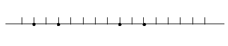
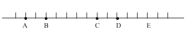

# 1.Daļa: SKAITĻU DALĀMĪBA

## Dalītāji un dalāmība

Viens no galvenajiem skaitļu teorijas jēdzieniem ir skaitļu dalāmība.

**Definīcija:**
Saka, ka vesels skaitlis $m$ dalās ar veselu skaitli $n$, jeb $n$ ir $m$ dalītājs, 
ja eksistē tāds vesels skaitlis $k$, kuram $m = n \cdot k$. 
To pieraksta šādi $m \mathrel{\vdots} n$ jeb $n \mid m$.

**Dalāmības īpašības:**	

**D1.** Ja $a \mid b$ un $a \mid c$, tad $a \mid b+c$ un $a \mid b-c$;  
**D2.** Ja $a \mid b$, tad $a \mid b \cdot k$;  
**D3.** Ja $a \mid b_1$, $a\mid b_2$, $\ldots$, $a \mid b_n$, 
tad $a \mid \left(b_1k_1 + b_2k_2 + \cdots + b_nk_n \right)$;  
**D4.** Ja $a \mid b$ un $b \mid c$, tad $a \mid c$;  
**D5.** Ja $a \mid x$ un $b \mid y$, tad $ab \mid xy$;  
**D6.** Ja $a,b \in \mathbb{N}$, $a \mid b$ un $b \mid a$, tad $a =b$.

## Dalīšana ar atlikumu

**Definīcija:**
Izdalīt veselu skaitli $m$ ar naturālu skaitli $n$ ar atlikumu 
nozīmē uzrakstīt skaitli formā $m=nq+r$, turklāt $q$ un $r$ 
ir veseli skaitļi, un $0 \leq r \leq n-1$.

Praktiski dalīšanu ar atlikumu izpilda kā parastu dalīšanu, 
tikai šo procesu pabeidz, tiklīdz atlikums kļūst mazāks par dalītāju.

Mēs parasti neuzdodam sev jautājumu, vai vienmēr var izdalīt ar atlikumu 
un vai atlikums nosakāms viennozīmīgi. 

**Teorēma:** 
Jebkuram veselam skaitlim $m$ un jebkuram naturālam skaitlim $n$ 
eksistē tieši viens veselu skaitļu pāris $(q,r)$, kuram izpildās nosacījumi:
$$m = q \cdot n + r,\;\;0 \leq r < n.$$

**Pierādījums.** 

* **Eksistence (Izdalīt ar atlikumu vienmēr var).**  
  Ar $q$ apzīmēsim lielāko veselo skaitli, 
  kurš nepārsniedz $\frac{m}{n}$; tad  $q \leq \frac{m}{n} < q+1$ un $qn \leq m < qn+n$. 
  Ar $r$ apzīmēsim skaitli $m-qn$; tātad $m = q \cdot n + r$. 
  No nevienādībām $qn \leq m < qn+n$ seko, ka $0 \leq r < n$.

* **Unitāte (Izdalīt ar atlikumu var tikai vienā veidā).**  
  Pieņemsim, ka to pašu skaitli $m$ var izteikt divos dažādos veidos: 
  $$\left\{ \begin{array}{ll}
  m = q_1 \cdot n + r_1, & 0 \leq r_1 < n\\
  m = q_1 \cdot n + r_1, & 0 \leq r_1 < n.\\
  \end{array} \}$$
	
  Atņemot no pirmās vienādības otro, iegūstam:

  $$0 = (q_1 - q_2) \cdot n + (r_1 - r_2)\;\;\text{jeb}\;\; (q_2 - q_1) \cdot n = (r_1 - r_2).$$

  Tātad $r_1 - r_2$ dalās ar $n$. Tā kā $|r_1 - r_2 | < n$, tad 
  $r_1 - r_2 = 0$ un tādēļ arī $r_1 = r_2$ un $q_1 = q_2$.  
  Unitāte pierādīta.

## LKD un MKD 

Pievērsiet īpašu  uzmanību LKD un MKD definīcijām. Tās atšķiras no  
no skolas programmas. Šajās definīcijās neizmanto attiecības  
"lielāks" un "mazāks", tikai dalāmības attiecību. 
Šīs definīcijas var izmantot, lai ieviestu LKD un MKD jēdzienus arī 
situācijās, kad objekti nav salīdzināmi. 
(Piemēram, var tādā pašā veidā definēt arī LKD vai MKD diviem polinomiem kaut 
arī polinomi nav salīdzināmi tāpat kā skaitļi.)

**Definīcija:** Veselu skaitli $d$ sauc par veselu skaitļu $a$ un $b$ 
*lielāko kopīgo dalītāju* un apzīmē $d = \operatorname{gcd}(a, b)$, 
ja izpildās sekojošas īpašības:
	
1. $d \mid a$ un $d \mid b$;
2. ja $t$ ir tāds vesels skaitlis, ka $t \mid a$ un $t \mid b$, tad $t \mid d$.

**Definīcija:** 
Veselu skaitli $m$ sauc par veselu skaitļu $a$ un $b$ mazāko kopīgo dalāmo 
un apzīmē $\operatorname{lcm}(a, b)$, ja tam izpildās sekojošas īpašības:

1. $a \mid m$ un $b \mid m$;
2. ja $s$ ir tāds vesels skaitlis, ka $a \mid s$ un $b \mid s$, tad $m \mid s$.

Izmantojot definīcijas, var pierādīt, ka skaitļu LKD un MKD ir noteikti viennozīmīgi, 
ja neņem vērā skaitļu zīmi. Taču LKD un MKD eksistence, ievērojot doto definīciju, 
ir pietiekami sarežģīts apgalvojums. Eksistences pierādījums ir saistīts ar 
Eiklīda algoritmu – metodi, kas aprēķina skaitļu 
(un ne tikai skaitļu, bet, piemēram, arī polinomu) lielāko kopīgo dalītāju.

**LKD īpašības:**

1. $\operatorname{gcd}(a,b) = \operatorname{gcd}(b,a)$,
2. $\operatorname{gcd}(a,b) = \operatorname{gcd}(a, b+ka)$,
3. $\operatorname{gcd}(a,b,c) = \operatorname{gcd}(\operatorname{gcd}(a,b),c)$,
4. $\operatorname{gcd}(ta,tb) = t \cdot \operatorname{gcd}(a,b)$,
5. $\operatorname{gcd}(a,b) \cdot \operatorname{lcm}(a,b) = a \cdot b$.
6. Ja $\operatorname{gcd}(x,y) = 1$, $x \mid a$ un $y \mid b$, tad  $xy \mid a$,
7. Ja $\operatorname{gcd}(a,x) = 1$ un $x \mid ab$, tad $x \mid b$.

## Eiklīda algoritms

Doti naturāli skaitļi $a_0$ un $a_1$; pieņemsim, ka $a_0 > a_1$. 
Izdalīsim skaitli $a_0$ ar $a_1$ ar atlikumu: 
$a_0 = a_1q_1 + a_2$, $0 \leq a_2 < a_1$.  
Pēc tam izdalīsim  $a_1$ ar $a_2$ ar atlikumu, atlikumu apzīmēsim ar $a_3$. 
Šo procesu turpināsim, kamēr atlikumā iegūsim $0$. 
Process beigsies, jo virkne $(a_n)$ ir stingri dilstoša nenegatīvu skaitļu virkne. 
Rezultātā  iegūsim šādu sistēmu:  

$$\left\{ \begin{array}{ll}
a_0 = a_1q_1 + a_2, & a_2 < a_1,\\
a_1 = a_2q_2 + a_3, & a_3 < a_2,\\
\ldots & \\
a_{k-2} = a_{k-1}q_{k-1} + a_k, & a_k < a_{k-1},\\
a_{k-1} = a_kq_k. & \\
\end{array} \right\}$$
	
**Teorēma:** Pēdējais nenulles atlikums, ko iegūst, 
realizējot Eiklīda algoritmu ar skaitļiem $a_0$ un $a_1$, 
ir skaitļu $a_0$ un $a_1$ LKD. 
Turklāt, eksistē tādi veseli skaitļi $t$ un $s$, ka $a_k = ta_0 + sa_1$.

## Pirmskaitļi

**Definīcija:**  
Naturālu skaitli $n>1$ sauc par pirmskaitli, ja tam nav citu dalītāju, 
izņemot $1$ un $n$.

**Pirmskaitļu īpašības:**

1.  Naturāls skaitlis $n>1$ nav pirmskaitlis tad un tikai tad, 
    kad eksistē tāds skaitļa $n$ dalītājs $m>1$, kurš nepārsniedz $\sqrt{n}$.
2. *Eiklīda lemma.* Ja $p$ ir pirmskaitlis, un $p \mid ab$, tad $p \mid a$ vai $p \mid b$.
3. Eksistē bezgalīgi daudz pirmskaitļu.
4. *Bertrāna postulāts.* Jebkuram naturālam skaitlim $n \geq 2$ 
   eksistē pirmskaitlis $p$, kurš atrodas intervālā $n < p < 2n$.
5. *Dirihlē teorēma.* Ja $(a,b)=1$, tad eksistē bezgalīgi daudz 
   tādu naturālu skaitļu $n$, ka $an+b$ ir pirmskaitlis.

## Dalāmības pazīmes

Šīs tēmas uzdevumos izmantojamas dalāmības pazīmes ar 
$3$, $9$ un $11$. Tās ir šādas:

* Skaitlis dalās ar $3$, ja tā ciparu summa dalās ar $3$.
* Skaitlis dalās ar $9$, ja tā ciparu summa dalās ar $9$. 
* Skaitlis dalās ar $11$, ja tā ciparu summa, kas atrodas pāra pozīcijās,    
  mīnus ciparu summa, kas atrodas nepāra pozīcijās, dalās ar $11$.

Uzdevumi, kas izmanto dalāmības pazīmes ar $2$, $4$, $8$, $5$, $25$ 
tiks aplūkoti citās tēmās, jo dalāmības pazīmes ar šiem skaitļiem 
izmanto tikai skaitļu pēdējos ciparus. 
Aplūkot skaitļa pēdējos ciparus, nozīmē aplūkot skaitli pēc moduļa $10^n$.

# <lo-sample/> BBK2012.P1.1

Vai eksistē 3 viens otram sekojoši skaitļi, kuru reizinājums ir 
$19941995199620$? 

## Atrisinājums

Nē, neeksistē. Trīs sekojošu naturālu skaitļu reizinājums dalās ar $3$, 
bet dotais skaitlis ar $3$ nedalās, jo tā ciparu summa nedalās ar $3$.

# <lo-sample/> BBK2012.P1.2

Vai $6$ pēc kārtas ņemtu naturālu skaitļu reizinājums var būt $1111140960$? 

## Atrisinājums

Nē, nevar. Sešu pēc kārtas ņemtu naturālu skaitļu reizinājums dalās ar $9$, 
bet dotais skaitlis ar $9$ nedalās.

# <lo-sample/> BBK2012.P1.3

Andris saskaitīja sešus viens otram sekojošus naturālus skaitļus un ieguva rezultātu, 
kurā katrs cipars no $2$ līdz $9$ sastopams vienu reizi, bet cipars $1$ – divas reizes. 
Pierādīt, ka Andris kļūdījās.

## Atrisinājums

Viegli pārbaudīt, ka sešu viens otram sekojošu naturālu skaitļu summa dalās ar $3$, 
bet skaitlis, kurā katrs cipars no $2$ līdz $9$ sastopams vienu reizi, 
bet cipars $1$ – divas reizes ar $3$ nedalās, jo tā ciparu summa $46$ ar $3$ nedalās. 

# <lo-sample/> BBK2012.P1.4

Pierādīt, ka skaitlis $\underbrace{111\ldots{}1}_{\mbox{27 vieninieki}}$
dalās ar $27$. 

## Atrisinājums

Ievērosim, ka izpildās vienādība

$$\underbrace{111\ldots{}1}_{\mbox{27 vieninieki}} = 111 \cdot \underbrace{1001001\ldots{}001}_{\mbox{9 vieninieki}}.$$

No dalāmības pazīmēm ar $3$ un $9$ seko, ka pirmais reizinātājs dalās ar $3$, 
bet otrais ar $9$; tātad viss reizinājums dalās ar $27$.

# <lo-sample/> BBK2012.P1.5

Pierādīt, ka skaitlis ${\displaystyle \underbrace{111\ldots{}1}_{\mbox{$81$ vieninieki}}}$
dalās ar $81$. 

## Atrisinājums

Ievērosim, ka 

$$\underbrace{111\ldots{}1}_{\mbox{$81$ vieninieki}} = 
\underbrace{111\ldots{}1}_{\mbox{$9$ vieninieki}} \cdot \underbrace{100\ldots{}0100\ldots{}01}_{\mbox{$9$ vieninieki}}.$$

Katrs no reizinātājiem dalās ar $9$, jo ciparu summa dalās ar $9$. Tātad reizinājums dalās ar $81$.

# <lo-sample/> BBK2012.P1.6

Visi piecciparu skaitļi no $11111$ līdz $99999$ patvaļīgā secībā 
uzrakstīti viens aiz otra. Pierādiet, ka uzrakstītais skaitlis nav divnieka naturāla pakāpe.

## Atrisinājums

Uzrakstītā skaitļa ciparu summa dalās ar $9$. 
Tātad šis skaitlis dalās ar $9$, un tas nevar būt divnieka pakāpe.

# <lo-sample/> BBK2012.P1.7

Aplūkosim visus deviņciparu skaitļus, kuru decimālajā pierakstā katrs cipars 
no $1$ līdz $9$ uzrakstīti tieši vienu reizi. Nosakiet, kāds ir šo skaitļu 
lielākais kopīgais dalītājs.

## Atrisinājums

Katra šāda skaitļa ciparu summa ir $45$. 
Tātad visi šie skaitļi dalās ar $9$. Tā kā $123456798 - 123456789=9$, 
tad visu doto skaitļu kopīgais dalītājs nevar būt lielāks par $9$.  
Atbilde: doto skaitļu LKD ir $9$.

# <lo-sample/> BBK2012.P1.8

No skaitļa 1985 atņēma tā ciparu summu, no rezultāta – tā ciparu summu, utt.

a. Pierādiet, ka noteikti kādreiz iegūsim viencipara skaitli.
b. Kāds tas būs?

## Atrisinājums

Atņemot no skaitļa tā ciparu summu iegūstam skaitli, 
kas dalās ar $9$. Ja skaitlis nav viencipara, tad tā ciparu summa 
ir mazāka par pašu skaitli; tātad iegūt nulli var iegūt tikai 
no viencipara skaitļa, un rezultātā šajā virknē būs viencipara 
skaitlis, kas dalās ar $9$ – tātad tas būs skaitlis $9$.

# <lo-sample/> BBK2012.P1.9

Reizināšanas pierakstā viens cipars aizstāts ar zvaigznīti.

$$1\ast{}74633 \times 2840332 = 3904414098156.$$ 

Kas tas par ciparu?

## Atrisinājums

Izmantojot dalāmības pazīmes ar $3$ un $9$, noskaidrojam, ka skaitļu 
reizinājums dalās ar $9$, bet otrais reizinātājs nedalās ar $3$. 
Tātad pirmais reizinātājs dalās ar $9$. Tā kā pirmā reizinātāja 
ierakstīto ciparu summa ir $24$, lai tas dalītos ar $9$, zvaigznītes 
vietā ir jāieraksta cipars $3$.

# <lo-sample/> BBK2012.P1.10

Jānis sareizināja visus naturālos skaitļus no $1$ līdz $13$ (ieskaitot) 
un atrada rezultāta otro pakāpi. Iznāca

$$387757880 \ast{} 3632640000,$$

kur viens cipars aizstāts ar zvaigznīti.
Atrodiet, kāds cipars aizstāts ar zvaigznīti.

## Atrisinājums

Jāņa iegūtais reizinājums dalās ar $9$; 
tātad arī tā ciparu summa dalās ar $9$.
Šī ciparu  summa ir $77+\ast$. Lai šī summa dalītos ar $9$, 
ciparam $\ast$ ir jābūt vienādam ar $4$.

# <lo-sample/> BBK2012.P1.11

No skaitļa $1230123012301230$ jāizsvītro vairāki cipari tā, 
lai iegūtais skaitlis dalītos ar $9$ un būtu maksimāli liels. Kuri cipari jāizsvītro? 

## Atrisinājums

Tā kā uzrakstītā skaitļa ciparu summa ir $15$, tad, lai atlikušais skaitlis 
dalītos ar $9$ ir jāizsvītro cipari, kuru summa ir $6$. Protams, lai iegūtu 
lielāko skaitli ir jāizsvītro pēc iespējas mazāk cipari; tātad jāizsvītro 
divi trijnieki.

Tā kā vecākās šķiras ir nozīmīgākas, tad jānosvītro abi pēdējie trijnieki.

# <lo-sample/> BBK2012.P1.12

No nenulles cipariem, katru izmantojot tieši 1 reizi, jāizveido triju trīsciparu 
skaitļu decimālie pieraksti. Vai var gadīties tā, ka

**(A)**  neviens no tiem nedalās ar $3$,  
**(B)**  tie visi dalās ar $3$,  
**(C)**  divi no tiem dalās ar $3$, bet trešais – nē?

## Atrisinājums

**(A)**  Jā, var; piemēram, $125, 368, 479$.

**(B)**  Jā, var; piemēram, $123, 456, 789$.

**(C)**  Nē, nevar. Visu trīs skaitļu ciparu summu summa ir $45$. 
Ja izpildās uzdevuma nosacījumi, tad pirmo divu skaitļu ciparu 
summas dalās ar $3$, bet trešā skaitļa ciparu summa nedalās ar $3$. 
Tas nozīmē, ka visu trīs skaitļu ciparu summu summa nedalās ar $3$, 
bet $45$ ar $3$ dalās.

# <lo-sample/> BBK2012.P1.13

Dots patvaļīgs $1973$-ciparu skaitlis, kurš dalās ar $9$. Šī skaitļa ciparu 
summu apzīmēsim ar $a$; skaitļa $a$ ciparu summu apzīmēsim ar $b$; skaitļa $b$ 
ciparu summu apzīmēsim ar $c$. Ar ko ir vienāds skaitlis $c$?

## Atrisinājums

Ievērosim, ka $a \leq 9 \cdot 1973 = 17757$; 
tātad $b<45$ un $c \leq 12$. 
Tā kā sākotnējais skaitlis dalās ar $9$, tad arī $9 \mid a$, $9 \mid b$, $9 \mid c$. 
Tātad $c = 9$.

# <lo-sample/> BBK2012.P1.14

Atrast vislielāko pozitīvo skaitli, ar kuru dalās katrs skaitlis, 
kas satur visus ciparus (katru tieši vienu reizi).

## Atrisinājums

Meklējamais skaitlis ir $9$. Tiešām, ar 9 dalās visi skaitļi, 
kas satur katru ciparu tieši vienu reizi, jo tā ciparu summa $45$ dalās ar $9$.
Ja $k$ ir skaitlis, ar kuru dalās visi “dažādciparu” skaitļi, 
tad ar $k$ dalās skaitļi $9876543210$ un $9876543201$, 
tātad ar $k$ dalās arī šo skaitļu starpība – skaitlis $9$. Tātad $k \leq 9$.

# <lo-sample/> BBK2012.P1.15

Pierādiet, ka, ja pietiekamā un nepieciešamā dalāmības 
pazīme ar skaitli $n$ nav atkarīga no skaitļa ciparu secības, 
tad $n$ ir vai nu trīs, vai deviņi.

## Atrisinājums

Pieņemsim, ka aplūkota dalāmības pazīme ar skaitli $k$. 
Izvēlēsimies $n$-ciparu skaitli $m$ intervālā 
$[1230\ldots{}0; 1239\ldots{}9]$, kurš dalās ar $k$. 
Tātad $m=\overline{123a_4\ldots{}a_n}$, un $k\mid{}m$. 
Ja dalāmības pazīme nav atkarīga no ciparu secības, 
tad arī skaitļi $\overline{3a_4\ldots{}a_n21}$ un 
$\overline{3a_4\ldots{}a_n12}$ dalās ar $k$. 
Šo skaitļu starpība ir $9$. Tātad $k\mid{}9$, un $k=3$ 
vai $k=9$.

# <lo-sample/> BBK2012.P1.16

Apzīmēsim skaitļa $a$ ciparu summu ar $S(a)$. 
Pierādiet, ka no vienādības $S(a) = S(2a)$ seko, 
ka $a$ dalās ar $9$.

## Atrisinājums

No vienādības $S(a)=S(2a)$ seko, ka $a \equiv 2a \pmod 9$. 
Tātad $a \equiv 0 \pmod 9$, jeb $9\mid{}a$.

# <lo-sample/> BBK2012.P1.17

Skaitli $A$ pareizinot ar $3$, tā ciparu summa nemainās.
Pierādīt, ka $A$ dalās ar $9$.

## Atrisinājums

Apzīmēsim $3A=B$. 
Tā kā $B$ dalās ar $3$, tad arī $B$ ciparu summa $S(B)$ 
dalās ar $3$. Tā kā skaitļu $A$ un $B$ ciparu summas ir vienādas, 
tad arī skaitļa $A$ ciparu summa dalās ar $3$; tātad $A$ dalās ar $3$. 
Tas nozīmē, ka $B$ dalās ar $9$; tātad $B$ ciparu summa $S(B)$ 
dalās ar $9$ un arī skaitļa $A$ ciparu summa dalās ar $9$. 
Tātad $A$ dalās ar $9$.

# <lo-sample/> BBK2012.P1.18

Dots, ka $n$ – kaut kāds naturāls skaitlis. Skaitlim $2^n$ 
atrodam ciparu summu. Iegūtajai summai atkal atrodam ciparu summu, 
utt. Pieņemsim, ka kādreiz iegūsim desmitciparu skaitli. 
Pierādīt, ka tam ir vismaz divi vienādi cipari.

## Atrisinājums

Ja iegūtajam skaitlim visi cipari būtu dažādi, tad to summa būtu 
$0+1+2+\cdots{}+9=45$; t.i., šis skaitlis dalītos ar $9$. 
Bet tad arī skaitlim $2^n$ jādalās ar $9$, taču $2^n$ ar $9$ nedalās.

# <lo-sample/> BBK2012.P1.19

Vai astoņciparu skaitlis, kura decimālais pieraksts ir simetrisks, 
var būt pirmskaitlis?

## Atrisinājums

Simetrisks astoņciparu skaitlis dalās ar 11 pēc dalāmības pazīmes, 
un tas nevar būt pirmskaitlis.

# <lo-sample/> BBK2012.P1.20

Vai četrciparu skaitlis, kura pirmais cipars vienāds ar pēdējo, 
bet otrais ar trešo var būt pirmskaitlis?

## Atrisinājums

Nē, nevar būt, jo šāds skaitlis dalās ar 11. Tiešām

$$\overline{abba} = 1000a + 100b + 10b + a = 1001a + 110b = 11 \cdot (91a + 10b).$$

# <lo-sample/> BBK2012.P1.21

Ar vienādiem burtiem apzīmēti vienādi cipari, ar dažādiem burtiem – dažādi. 
Pierādīt, ka vienādība

$$\text{JĀ}\,\times\,\text{NĒ} \,=\, \text{FFGG}$$

nav pareiza.

## Atrisinājums

Skaitlis  $FFGG$  dalās ar $11$ (dalījums ir $F0G$), 
bet neviens no kreisās puses reizinātājiem ar $11$ nedalās; tā ir pretruna.

# <lo-sample/> BBK2012.P1.22

Pierādiet apgalvojumu: ja skaitlis dalās ar $99$, tad tā ciparu summa 
ir ne mazāka kā $18$.

## Atrisinājums

Apzīmēsim ar $S_1$ dotā skaitļa ciparu summu, kas atrodas nepāra pozīcijās, 
un ar $S_2$ dotā skaitļa ciparu summu, kas atrodas pāra pozīcijās. 
Tā kā dotais skaitlis dalās ar $9$, tad $9 \mid (S_1 + S_2)$; savukārt no tā, 
ka skaitlis dalās ar $11$, seko, ka $11 \mid (S_1 - S_2)$. 
Ja izpildās vienādība $S_1 + S_2 = 9$, tad $S_1 - S_2$ nevar dalīties ar $11$. 
Tātad $S_1 + S_2 \geq 2 \cdot 9 = 18$.

# <lo-sample/> BBK2012.P1.23

Autobusa biļetei ir sešciparu numurs no $000000$ līdz $999999$. 
Kādu biļešu ir vairāk: 
tādu, kuru numuru pirmo trīs ciparu summa ir vienāda ar pēdējo 
trīs ciparu summu, vai tādu, kuru numurs dalās ar $11$?

## Atrisinājums

Vairāk ir tādu biļešu, kuru numuri dalās ar $11$. 
Tiešām, katrai biļetei $\overline{a_1a_2a_3a_4a_5a_6}$, 
kurai izpildās vienādība $a_1 + a_2 + a_3 = a_4 + a_5 + a_6$, 
piekārtosim biļeti $\overline{a_1a_4a_2a_5a_3a_6}$, kuras numurs 
(no dalāmības pazīmes ar $11$) dalās ar $11$. 
Tā kā ne visas biļetes, kuru numuri dalās ar $11$, 
tiek iegūtas šādā veidā (piemēram, biļete $605000$ tā nav iegūta), 
tad vajadzīgais apgalvojums ir pierādīts.

# <lo-sample/> BBK2012.P1.24

Pierādiet, ka skaitlis $\overline{a_1a_2\cdots{}a_{3m}}$ dalās ar $7$
($11$ vai $13$) tad un tikai tad, kad 
skaitlis 

$$\overline{a_1a_2a_3} - \overline{a_4a_5a_6} + \cdots + 
(-1)^{m-1}\overline{a_{3m-2}a_{3m-1}a_{3m}}$$

dalās ar $7$ ($11$ vai $13$).

## Atrisinājums

Tā kā $1000^k \equiv (-1)^k \pmod {1001}$, tad 
$$\overline{a_1a_2a_3\cdots{}a_{3m-2}a_{3m-1}a_{3m}} \equiv \overline{a_1a_2a_3} \cdot 10^{3m-3} + \cdots + \overline{a_{3m-2}a_{3m-1}a_{3m}} \equiv$$
$$\equiv \overline{a_1a_2a_3} \cdot (-1)^{m-1} + \overline{a_4a_5a_6} \cdot (-1)^{m-2} + \cdots + \overline{a_{3m-2}a_{3m-1}a_{3m}} \equiv$$
$$\equiv (-1)^{m-1}\left( \overline{a_1a_2a_3} - \overline{a_4a_5a_6}  + \cdots + (-1)^{m-1}\overline{a_{3m-2}a_{3m-1}a_{3m}}  \right) \pmod {1001}.$$

# <lo-sample/> BBK2012.P1.25

Kuri no sekojošiem skaitļiem ir pirmskaitļi?
Pamatojiet savu atbildi:

**(A)** $1395$;
**(B)** $131313$;
**(C)** $1993$;
**(D)** $1991$.

## Atrisinājums

**(A)**  Nē, jo skaitlis dalās ar $5$.
**(B)**  Nē, jo skaitlis dalās ar $13$.
**(C)**  Jā, $1993$ ir pirmskaitlis.
**(D)**	Nē, jo skaitlis dalās ar $11$.

# <lo-sample/> BBK2012.P1.26

Pierādīt, ka sešciparu skaitlis dalās ar $13$ tādā un 
tikai tādā gadījumā, ja ar $13$ dalās tā pirmo trīs 
ciparu un pēdējo trīs ciparu veidoto skaitļu starpība 
(mazinātājs varētu sākties ar vienu vai vairākām nullēm).

## Atrisinājums

Apgalvojums seko no vienādības
$$\overline{abcdef} = 1000 \cdot \overline{abc} + \overline{def} =$$
$$= 1001 \cdot \overline{abc} + (\overline{def} - \overline{abc}) = 13 \cdot 77 \overline{abc} + (\overline{def} - \overline{abc}).$$
No šejienes redzams, ka $\overline{abcdef}$ dalās ar $13$ tad un tikai tad, kad $(\overline{def} - \overline{abc})$ dalās ar $13$.

# Dalāmības īpašības

Dalāmības īpašības sk. [Jēdziens: dalītājs](Concept-p1.1-divisor.md), 
šeit papildus izmantojam sekojošus apgalvojumus:

* Ja $p$ ir pirmskaitlis un $p \mid ab$, tad $p \mid a$ vai $p \mid b$.
* Ja $a_1 \mid m$, $a_2 \mid m$, $\ldots$, $a_n \mid m$, tad
  $\operatorname{lcm}(a_1,a_2,\ldots,a_n)\,\mid\,m$. 
* Ja $a$ un $b$ ir savstarpēji pirmskaitļi un $a \mid bc$, tad $a \mid c$.

Pirmās un trešās īpašības pierādījumi nebūt nav vienkārši.
To pamatā ir teorēma par Eiklīda algoritmu un šīs īpašība tiks pierādītas otrajā nodaļā. 
Otrā īpašība seko no MKD definīcijas. Taču, rēķinot uzdevumus par skaitļu dalāmību, 
mums pašreiz nav vajadzības zināt aritmētikas pamatteorēmas pierādījumu, 
un tāpēc pagaidām izmantosim šīs īpašības uzdevumu risināšanā, atceroties, 
ka to pierādījumi tiks aplūkoti vēlāk, kad tiks pierādīta aritmētikas pamatteorēma.
Risinot uzdevumus, jāizmanto arī skaitļa sadalījums pirmreizinātājos 
un jāmāk uzrakstīt visi skaitļa dalītāji. Arī šajā gadījumā mēs faktiski 
lietojam aritmētikas pamatteorēmu, kas pagaidām nav pierādīta.

## Jautājumi paškontrolei

Pamatojiet norādītās atbildes.

1. Dots, ka naturāls skaitlis dalās ar $3$ un $4$. Vai šis 
   skaitlis noteikti dalās ar $12$?  
   Atbilde: jā.
2. Dots, ka naturāls skaitlis dalās ar $6$ un $4$. Vai šis skaitlis 
   noteikti dalās ar 24?  
   Atbilde: nē. 
3. Kur ir būtiskā atšķirība starp pirmo un otro jautājumu?  
   Atbilde: $3$ un $4$ ir savstarpēji pirmskaitļi, bet $6$ un $4$ – nē. 
4. Skaitlis $A$ nedalās ar $3$. Vai skaitlis $2A$ var dalīties ar $3$?
   Atbilde: nē.
5. Dots, ka $A$ ir pāra skaitlis. Vai skaitlis $3A$ 
   noteikti dalās ar $6$?  
   Atbilde: jā.
6. Skaitlis $5A$ dalās ar $3$. Vai skaitlis $A$ noteikti 
   dalās ar $3$?  
   Atbilde: jā.
7. Skaitlis $15A$ dalās ar $6$. Vai skaitlis $A$ 
   noteikti dalās ar $6$?  
   Atbilde: nē.

# Dalāmības īpašības: Ievaduzdevumi

# <lo-sample/> BBK2012.P1.E2.1

Dots, ka $5 \mid a$ un $5 \mid b$. Pierādiet, ka 
$5 \mid (a^2 + 7b)$.

<small>

* skill:DivisibilityProperties
* questionType:Prove

</small>

## Atrisinājums

$5 \mid a$, tātad $5 \mid a^2$ (īpašība **D2**); 
$5 \mid b$, tātad $5 \mid 7b$ (īpašība **D2**). 
No īpašības **D1** seko, ka $5 \mid (a^2 + 7b)$.

# <lo-sample/> BBK2012.P1.E2.2

Dots, ka $7 \mid a$. Pierādiet, ka $7 \mid (a^2 + 3a + 7b - 21)$.

<small>

* skill:DivisibilityProperties
* questionType:Prove

</small>

## Atrisinājums

$7 \mid a$, tātad $7 \mid a^2$ un $7 \mid 3a$ (īpašība **D2**); 
$7 \mid 7b$ un $7 \mid 21$. No īpašības **D3** seko, ka 
$7 \mid (a^2 + 3a ­+ 7b - 21)$.

# <lo-sample/> BBK2012.P1.E2.3
 
Dots, ka $n \mid a$ un $n \mid (5a + b)$. Pierādiet, ka $n \mid b$.

<small>

* skill:DivisibilityProperties
* questionType:Prove

</small>

## Atrisinājums

$b = (5a + b) - 5a$. Tā kā $n \mid (5a + b)$ un $n \mid 5a$ 
(jo $n \mid a$), tad $n$ ir šo skaitļu starpības dalītājs, t.i., $n \mid b$.

# <lo-sample/> BBK2012.P1.E2.4

Dots, ka $n \mid (a - b)$. Pierādiet, ka $n \mid (a^2 + a - b^2 - b)$.

<small>

* skill:DivisibilityProperties
* questionType:Prove

</small>

## Atrisinājums

Izteiksmi $a­^­­­­­­2 + a - b2 - b$ var sadalīt reizinātājos 
$(a - b)(a + b + 1)$. Tā kā $n \mid (a - b)$, 
tad no īpašības **D2** seko, ka $n \mid (a^­­­­­­­2 + a - b^2 - b)$.

# <lo-sample/> BBK2012.P1.E2.5

Dots, ka $n \mid 3a$ un $n \mid (12a + 5b)$. Pierādiet, ka $n \mid 10b$.

<small>

* skill:DivisibilityProperties
* questionType:Prove

</small>

## Atrisinājums

No īpašības **D3** seko, ka $n \mid 5b = (12a +5b) - 4 \cdot 3a$. 
Tātad $n$ dala arī $10b$ (īpašība **D2**).

# <lo-sample/> BBK2012.P1.E2.6

Dots, ka $5 \mid (a - b)$ un $7 \mid (a + b)$. Pierādiet, ka $35 \mid (a^2 - b^2)$.

<small>

* skill:DivisibilityProperties
* questionType:Prove

</small>

## Atrisinājums

No īpašības **D5** seko, ka $5 \cdot 7 = 35 \mid (a-b)(a+b) = a^2 - b^2$.

# <lo-sample/> BBK2012.P1.E2.7

Doti tādi naturāli skaitļi $a, b, c$, ka $a \mid b$, 
$b \mid c$, $c \mid a$. Pierādiet, ka 
$a = b = c$.

<small>

* skill:DivisibilityProperties
* questionType:Prove

</small>

## Atrisinājums

No tā, ka $b \mid c$ un $c \mid a$ seko, ka $b \mid a$ (īpašība **D4**). 
Tā kā $a \mid b$ un $b \mid a$, tad $a = b$ (īpašība **D6**). 
Līdzīgi pierāda, ka $b = c$.

# <lo-sample/> BBK2012.P1.E2.8

Dots, ka $3 \mid (a - 1)$ un $5 \mid (a+2)$. Pierādiet, 
ka $15 \mid (a^2 + a - 2)$.

<small>

* skill:DivisibilityProperties
* questionType:Prove

</small>

## Atrisinājums

Apgalvojums seko no vienādības $a^2 + a - 2 = (a -1)(a + 2)$ un īpašības **D5**.

# <lo-sample/> BBK2012.P1.E2.9

Kuri no skaitļiem $101, 111, 141, 143, 155, 161, 163$ ir pirmskaitļi?

<small>

* skill:DivisibilityProperties
* questionType:FindAll

</small>

## Atrisinājums

Visi no dotajiem skaitļiem ir mazāki par $13^2 = 169$. 
Tātad, lai noskaidrotu, vai dotie skaitļi ir pirmskaitļi, 
mums jāpārbauda to dalāmība ar pirmskaitļiem, kuri ir mazāki par 13. 
Tie ir $2$, $3$, $5$, $7$ un $11$. 
Pārbaudot redzam, ka pirmskaitļi ir skaitļi $101$, $141$, $163$.

# <lo-sample/> BBK2012.P1.E2.10

Atrodiet visus pirmskaitļus intervālā $[100, 120]$.

<small>

* skill:DivisibilityProperties
* questionType:FindAll

</small>

## Atrisinājums

Tā kā $\sqrt{120} < 11$, tad pietiek pārbaudīt dalāmību ar 
pirmskaitļiem, kas ir mazāki par $11$. Tie ir 2, 3, 5 un 7. 
Vienīgais pāra pirmskaitlis ir $2 \not\in [100, 120]$; tāpēc
pāra skaitļi nav jāaplūko. 
Izrakstīsim visus nepāra skaitļus no $[100;120]$ un pasvītrosim 
tos, kas dalās ar $2$, $3$, $5$ vai $7$: 

$$101, 103, \underline{105}, 107, 109, \underline{111}, 113, \underline{115}, \underline{117}, \underline{119}.$$

Nepasvītrotie skaitļi $101$, $103$, $107$, $109$, $113$ ir pirmskaitļi.

# <lo-sample/> BBK2012.P1.E2.11

Atrodiet visus pirmskaitļus intervālā $[180, 200]$s.

<small>

* skill:DivisibilityProperties
* questionType:FindAll

</small>

## Atrisinājums

Dotajā intervālā pirmskaitļi ir skaitļi  $181$, $191$, $193$, $197$ un $199$.
Citi neder, jo $3 \mid 183$, $5 \mid 185$, $11 \mid 187$, 
$3 \mid 189$, $5 \mid 195$ (vai arī ir pāra skaitļi).  

# <lo-sample/> BBK2012.P1.E2.12

Ar kādām naturālām $n$ vērtībām skaitlis $n^2 - 1$ ir pirmskaitlis?

<small>

* skill:DivisibilityProperties
* questionType:FindAll

</small>

## Atrisinājums

Zināms, ka $n^2 - 1 = (n - 1)(n + 1)$. 
Tātad, ja $n - 1 > 1$, tad $n^2-1$ nav pirmskaitlis, jo $n-1$ 
ir tā dalītājs, pie kam $n -1 \neq 1$ un $n-1 \neq n^2 -1$. 
Atliek pārbaudīt $n$ vērtības $n=1$ un $n=2$. 
Ja $n =1$, tad $n^2 - 1 = 0$ nav pirmskaitlis. 
Ja $n = 2$, tad $n^2 - 1 = 3$ ir pirmskaitlis.

# <lo-sample/> BBK2012.P1.E2.13

Dots, ka $5 \mid 12a$. Pierādiet, ka $5 \mid a$.

<small>

* skill:DivisibilityProperties
* questionType:Prove

</small>

## Atrisinājums

No pirmskaitļu 2.īpašības seko, ka $5 \mid 12$ vai $5 \mid a$. 
Tā kā $\operatorname{gcd}(5, 12) = 1$, tad $5 \mid a$.

# <lo-sample/> BBK2012.P1.E2.14

Dots, ka $7 \mid a$ un $7 \mid (2a + 3b)$. Pierādiet, ka $7 \mid b$.

<small>

* skill:DivisibilityProperties
* questionType:Prove

</small>

## Atrisinājums

No īpašības **D3** seko, ka $7 \mid (2a + 3b) - 2a = 3b$. 
No pirmskaitļu 2 īpašības seko, ka $7 \mid b$.

# <lo-sample/> BBK2012.P1.E2.15

Dots, ka $5 \mid 7b$ un $7 \mid 5a$. Pierādiet, ka $35 \mid ab$.

<small>

* skill:DivisibilityProperties
* questionType:Prove

</small>

## Atrisinājums

No pirmskaitļu 2.īpašības seko, ka $5 \mid b$ un $7 \mid a$. 
Tātad $35 \mid ab$ (īpašība **D5**).

# <lo-sample/> BBK2012.P1.E2.16

Dots, ka $n \mid (5a + 3b)$ un $n \mid (3a + 2b)$. 
Pierādiet, ka $n \mid a$ un $n \mid b$.

<small>

* skill:DivisibilityProperties
* questionType:Prove

</small>

## Atrisinājums

Pareizinot $5a + 3b$ ar $2$ un $3a + 2b$ ar $3$ un atņemot 
otro izteiksmi no pirmās, iegūsim: $2 (5a + 3b) - 3 (3a + 2b) = a$. 
Tā kā $n \mid (5a + 3b)$ un $n \mid (3a + 2b)$, tad $n \mid a$ 
(īpašība **D3**). Izmantojot vienādību $b = 5 (3a + 2b) - 3 (5a + 3b)$,
pierāda, ka $n \mid b$.

# <lo-sample/> BBK2012.P1.E2.17

Dots, ka $n \mid (3a + 7b)$ un $n \mid (2a + 5b)$. 
Pierādiet, ka $n \mid a$ un $n \mid b$.

<small>

* skill:DivisibilityProperties
* questionType:Prove

</small>

## Atrisinājums

Seko no tā, ka $a = 5 (3a + 7b) - 7 (2a + 5b)$ un 
$b = 3 (2a + 5b) - 2 (3a + 7b)$.

# <lo-sample/> BBK2012.P1.E2.18

Dots, ka $5 \mid (3a + 4b)$ un $5 \mid (2a + 3b)$. 
Pierādiet, ka $25 \mid ab$.

<small>

* skill:DivisibilityProperties
* questionType:Prove

</small>

## Atrisinājums

$5 \mid a$, jo $a = 3 (3a + 4b) - 4 (2a + 3b)$.   
$5 \mid b$, jo $b = 3 (2a + 3b) - 2 (3a + 4b)$.  
No īpašības **D5** seko, ka $25 \mid ab$.

# <lo-sample/> BBK2012.P1.E2.19

Pierādiet, ka visiem naturāliem $n$ skaitlis 
$n^2 + n + 6$ dalās ar $2$.

<small>

* skill:DivisibilityProperties
* questionType:Prove

</small>

## Atrisinājums

Viens no skaitļiem $n$ vai $n + 1$ ir pāra skaitlis, 
tāpēc $n^2+ n = n(n + 1)$ dalās ar $2$. Tātad $2 \mid (n^2+ n + 6)$.

# <lo-sample/> BBK2012.P1.E2.20

Dots, ka $n \mid (a - b)$. Pierādiet, ka $n \mid (a^3 + a^2 - b^3 - b^2)$.

<small>

* skill:DivisibilityProperties
* questionType:Prove

</small>

## Atrisinājums

Seko no tā, ka $a^3 + a^2 - b^3 - b^2 = (a^3 - b^3) + (a^2 - b^2)$,   
$(a^3 - b^3) + (a^2 - b^2) = (a - b)(a^2 + ab + b2) + (a - b)(a + b)$.  
Abi saskaitāmie dalās ar $a-b$, tātad arī ar $n$. 

# <lo-sample/> BBK2012.P1.E2.21

Dots, ka $n \mid (a + 2b)$. Pierādiet, ka $n \mid (a^3 + 2a + 8b^3 + 4b)$.

<small>

* skill:DivisibilityProperties
* questionType:Prove

</small>

## Atrisinājums

Seko no tā, ka $a^3 + 2a + 8b^3 + 4b = (a^3 + 8b^3) + 2(a + 2b)$,  
$(a^3 + 8b^3) + 2(a + 2b) = (a + 2b)(a^2 - 2ab + 4b^2) + 2(a + 2b)$.  
Abi saskaitāmie dalās ar $a+2b$, tātad arī ar $n$. 

# <lo-sample/> BBK2012.P1.E2.22

Dots, ka daļa $a/b$ ir saīsināma. Vai daļa $(a - b)/(a + b)$ ir saīsināma? 
Un otrādi, ja zināms, ka daļa $(a - b)/(a + b)$ ir saīsināma, 
vai daļa $a/b$ noteikti ir saīsināma?

<small>

* skill:DivisibilityProperties
* questionType:ProveDisprove

</small>

## Atrisinājums

Jā, ir saīsināma. Ja $n \mid a$ un $n \mid b$, tad $n \mid (a - b)$ un 
$n \mid (a + b)$. Apgrieztais apgalvojums neizpildās, jo, 
ņemot, piemēram, $a = 5$ un $b = 3$ redzam, ka daļa $5/3$ 
nav saīsināma, bet daļa $(5 - 3)/(5 + 3)$ ir saīsināma.

# <lo-sample/> BBK2012.P1.E2.23

Dots, ka $11 \mid (3x + 7y)$ un $11 \mid (2x + 5y)$. Pierādiet, ka 
$121 \mid (x^2 + y^2)$.

<small>

* skill:DivisibilityProperties
* questionType:Prove

</small>

## Atrisinājums

$11 \mid x$, jo $x = 5 (3x + 7y) - 7 (2x + 5y)$ un   
$11 \mid y$, jo $y = 3 (2x + 5y) - 2 (3x + 7y)$.   
Tātad $11^2 \mid x^2$, $11^2  \mid y^2$, un $121 \mid x^2 + 3y^2$.

# <lo-sample/> BBK2012.P1.E2.24

Doti tādi naturāli skaitļi $a,b$, ka $a \mid (a + b)$ un $b \mid (a + b)$.
Pierādiet, ka $a = b$.

<small>

* skill:DivisibilityProperties
* questionType:Prove

</small>

## Atrisinājums

No $a \mid (a + b)$ seko, ka $a \mid b$. Līdzīgi iegūstam, ka $b \mid a$. 
No īpašības **D6** seko, ka $a = b$.

# <lo-sample/> BBK2012.P1.E2.25

Dots, ka $2 \mid (a - 1)$ un $3 \mid (a + 1)$. 
Pierādiet, ka $6 \mid (a^2 + 5)$.

<small>

* skill:DivisibilityProperties
* questionType:Prove

</small>

## Atrisinājums

No dalāmības īpašībām seko, ka $6 \mid (a - 1)(a + 1) = a^2 - 1$. 
Tātad $6 \mid (a^2 + 5)$, jo $a^2 + 5 = (a^2 - 1) + 6$.

# <lo-sample/> BBK2012.P1.E2.26

Dots, ka $6 \mid (a - b)$ un $6 \mid (a + b)$. 
Pierādiet, ka $3 \mid (a^2 + 8b^2)$.

<small>

* skill:DivisibilityProperties
* questionType:Prove

</small>

## Atrisinājums

No tā, ka $6 \mid (a - b)$ seko, ka $6 \mid (a^2 - b^2) = (a - b)(a + b)$. 
No īpašības **D1** seko, ka $6 \mid (a^2 - b^2 + 6b^2) = a^2 + 5b^2$. 
Tā kā $3 \mid 6$, tad arī $3 \mid (a^2 + 5b^2)$.

# <lo-sample/> BBK2012.P1.E2.27

Ar kādām naturālām $n$ vērtībām skaitlis $n^3-1$ ir pirmskaitlis?

<small>

* skill:DivisibilityProperties
* questionType:FindAll

</small>

## Atrisinājums

Zināms, ka $n^3 - 1 = (n - 1)(n^2 + n + 1)$. Tātad, ja $n-1 > 1$, 
tad $n^3-1$ nav pirmskaitlis, jo $n-1$ ir tā dalītājs, pie kam 
$n-1 >1$ un $n-1 < n^3-1$. Atliek pārbaudīt $n$ vērtības $n = 1$ un $n = 2$.
Ja $n=1$, tad $n^3-1 = 0$ nav pirmskaitlis. Ja $n = 2$, 
tad $n^3 - 1 = 7$ ir pirmskaitlis.

# <lo-sample/> BBK2012.P1.E2.28

Ar kādām naturālām $n$ vērtībām skaitlis $n^2+5n+6$ ir pirmskaitlis? 

<small>

* skill:DivisibilityProperties
* questionType:FindAll

</small>

## Atrisinājums

Skaitlis $n^2 + 5n + 6 = (n + 2)(n + 3)$ nav pirmskaitlis 
nevienai n vērtībai, jo tas sadalās reizinātājos, kuri ir lielāki par $1$.

# <lo-sample/> BBK2012.P1.E2.29

Ar kādām naturālām $a$ un $b$ vērtībām skaitlis 
$ab + a + b + 1$ ir pirmskaitlis?

<small>

* skill:DivisibilityProperties
* questionType:FindAll

</small>

## Atrisinājums

Izteiksmi $ab + a + b + 1$ sadalām reizinātājos $(a+1)(b+1)$. 
Tātad šis skaitlis nav pirmskaitlis nekādām $a$ un $b$ vērtībām, 
jo abi reizinātāji ir lielāki par $1$.

# <lo-sample/> BBK2012.P1.E2.30

Dots, ka $4 \mid x$ un $3 \mid y$. Pierādiet, ka $12 \mid (xy + 8y + 9x)$.

<small>

* skill:DivisibilityProperties
* questionType:Prove

</small>

## Atrisinājums

$12 \mid xy$, jo $4 \mid x$ un $3 \mid y$ (īpašība **D5**); 
$12 \mid 8y$, jo $4 \mid 8$ un $3 \mid y$; $12 \mid 9x$, 
jo $3 \mid 9$ un $4 \mid x$.  Tātad $12$ dala arī šo skaitļu summu 
$xy + 8y + 9x$.

# <lo-sample/> BBK2012.P1.E2.31

Dots, ka $11 \mid (4a + b)$ un $11 \mid (a+4b)$. Pierādiet, 
ka $11 \mid a$ un $11 \mid b$.

<small>

* skill:DivisibilityProperties
* questionType:Prove

</small>

## Atrisinājums

No uzdevuma nosacījumiem seko, ka skaitlis $4(a + 4b) - (4a +b) = 15b$ 
dalās ar $11$. No pirmskaitļu 2. īpašības izriet, ka $11 \mid b$. 
Līdzīgi pierāda, ka $11 \mid a$.

# <lo-sample/> BBK2012.P1.E2.32

Dots, ka $7 \mid (3a + b)$ un $7 \mid (a + 3b)$. Pierādiet, ka $49 \mid ab$.

<small>

* skill:DivisibilityProperties
* questionType:Prove

</small>

## Atrisinājums

$7 \mid (3(a + 3b) - (3a + b)) = 8b$. 
Tātad, $7 \mid b$. Līdzīgi pierāda, ka $7 \mid a$. 
No īpašības **D5** seko, ka $49 \mid ab$.

# <lo-sample/> BBK2012.P1.E2.33

Dots, ka $7 \mid (2a + 3b)$. Pierādiet, ka $7 \mid (a + 5b)$.

<small>

* skill:DivisibilityProperties
* questionType:Prove

</small>

## Atrisinājums

No dotā seko, ka $7 \mid 4(2a +3b) = 8a + 12b$. 
Tātad arī skaitlis 
$a + 5b = 8a + 12b - 7(a + b)$ dalās ar $7$.

# <lo-sample/> BBK2012.P1.E2.34

Dots, ka $13 \mid (a + 4b)$. Pierādiet, ka $13 \mid (10a + b)$.

<small>

* skill:DivisibilityProperties
* questionType:Prove

</small>

## Atrisinājums

No dotā seko, ka $13 \mid 10(a +4b) = 10a + 40b$. Tātad arī skaitlis 
$10a + b = (10a + 40b) - 39b$ dalās ar $13$.

# <lo-sample/> BBK2012.P1.E2.35

Dots, ka $11 \mid (3a + 7b)$. Pierādiet, ka $11 \mid (4a + 2b)$.

<small>

* skill:DivisibilityProperties
* questionType:Prove

</small>

## Atrisinājums

No dotā seko, ka $11 \mid 5(3a +7b) = 15a + 35b$. 
Tātad arī skaitlis 
$4a + 2b = 15a + 35b - 11(a + 3b)$ dalās ar $11$.

# <lo-sample/> BBK2012.P1.E2.36

Pierādiet, ka skaitlis $4a + 5b$ dalās ar $17$ tad un tikai tad, 
kad skaitlis $7a - 3b$ dalās ar $17$.

<small>

* skill:DivisibilityProperties
* questionType:Prove

</small>

## Atrisinājums

Ja $17 \mid (4a +5b)$, tad arī skaitlis $6(4a +5b) = 24a + 30b$ dalās ar $17$. Tas nozīmē, ka skaitlis $7a - 4b = 24a + 30b - 17(a + 2b)$ dalās ar $17$.
Līdzīgi pierāda apgriezto apgalvojumu.

# <lo-sample/> BBK2012.P1.E2.37

Ar kādām naturālām $n$ un $m$ vērtībām skaitlis 
$(n-m)(n^2+m-1)$ ir pirmskaitlis?

<small>

* skill:DivisibilityProperties
* questionType:FindAll

</small>

## Atrisinājums

Nav tādu $n$ un $m$ vērtību. Vērtības $n<m$ dod negatīvu rezultātu un neder.
Ja $n-m=0$, tad $0$ nav pirmskaitlis. 
Ja $n-m \geq 2$, tad izteiksme $(n-m)(n^2+m-1)$ dalās ar $n-m$, pie tam 
$n-m \neq 1$ un $n-m \neq (n-m)(n^2+m-1)$. 

Visbeidzot, ja $n-m=1$, tad $n^2 + m - 1$, tad 
$n^2 + (n-1) - 1 = n^2 + n - 2 = n(n+1) - 2$. Tas vienmēr ir pāra skaitlis, 
jo vismaz viens no $n$ vai $n+1$ ir pāra. Vienīgais pāra pirmskaitlis ir $2$, 
bet $n(n+1) - 2 \neq 2$ nekādam $n$, jo izteiksme $n(n+1)-2$ ir augoša un 
pieņem vērtības $0, 4, 10, 18, \ldots$ pie $n=1,2,3,4,\ldots$. 
Šīs vērtības "pārlec pāri" vērtībai $2$.

# <lo-sample/> BBK2012.P1.E2.38

Atrodiet vismaz vienu naturālu skaitli $n$, 
lai intervālā $[n, n + 10]$ nebūtu neviena pirmskaitļa.

<small>

* skill:DivisibilityProperties
* questionType:FindExample

</small>

## Atrisinājums

Uzdevuma nosacījumus apmierina, piemēram, skaitlis 
$n = 12! +2 = 479001602$. 
Tiešām, ja $1 < k < 13$ , tad $12! + k$ ir salikts skaitlis, 
jo $k$ ir šā skaitļa dalītājs.

Ir arī daudz mazāki atrisinājumi, piemēram $n=114$. 
Intervālā $[114;126]$ nav neviena pirmskaitļa.

# <lo-sample/> BBK2012.P1.27

Ar kādu ciparu beidzas reizinājums

$$11 \cdot 12 \cdot 13 \cdot 14 \cdot 15 \cdot 16 \cdot 17 \cdot 18 \cdot 19 \cdot 20 \cdot 21 \cdot 22 \cdot 23 ?$$

## Atrisinājums

Šis reizinājums dalās ar $10$; tātad tā pēdējais cipars ir $0$.

# <lo-sample/> BBK2012.P1.28

Četrus veselus pozitīvus skaitļus katru dalīja ar 5 ar atlikumu. 
Iegūto atlikumu summa ir $3$. Pierādīt, ka šo četru skaitļu 
reizinājums dalās ar $5$.

## Atrisinājums

Atlikumi ir veseli nenegatīvi skaitļi. Ja četru atlikumu summa ir $3$, 
tad vismaz viens no tiem ir $0$; atbilstošais skaitlis un līdz ar to 
visu skaitļu reizinājums dalās ar $5$.

# <lo-sample/> BBK2012.P1.29

Dalot $1 \cdot 2$  ar $3$, $2 \cdot 3$ ar $4$,
$3 \cdot 4$  ar $5$, atlikumā iegūst $2$. 
Vai vienmēr, dalot divu viens otram sekojošu naturālu 
skaitļu reizinājumu ar nākošo naturālo skaitli, atlikuma iegūst $2$?

## Atrisinājums

Jā, tā notiek vienmēr, jo $(n-2) \cdot (n-1) = n^2 - 3n + 2 = (n-3) \cdot n + 2$. 

# <lo-sample/> BBK2012.P1.30

Pierādīt, ka $2^{1995} + 2^{1996} + 2^{1997} + 2^{1998}$ dalās ar $15$.

## Atrisinājums

No vienādības

$$2^{1995} + 2^{1996} + 2^{1997} + 2^{1998} = 2^{1995} \cdot (1+2+4+8) =  2^{1995} \cdot 15$$

seko, ka dotais skaitlis dalās ar $15$.

# <lo-sample/> BBK2012.P1.31

Dots, ka $a$ un $b$ ir naturāli skaitļi un $a+b = 210$. 
Pierādīt, ka $ab$ nedalās ar $210$. 

## Atrisinājums

Pieņemsim pretējo, ka $a \cdot b$ dalās ar $210$.
Ievērosim, ka $210 = 2 \cdot 3 \cdot 5 \cdot 7$. 
Ar $p$  apzīmēsim jebkuru no pirmskaitļiem $2, 3, 5, 7$. 
Tad $a \cdot b$ dalās ar $p$. 
Tātad vismaz viens no skaitļiem $a$, $b$ dalās ar $p$. 
Tā kā $a + b = 210$ dalās ar $p$, 
tad arī otrs skaitlis dalās ar $p$.
Tātad gan $a$, gan $b$ dalās ar $2 \cdot 3 \cdot 5 \cdot 7 = 210$, 
bet tādā gadījumā $a \geq 210$, $b \geq 210$ un $a + b > 210$. 
Iegūta pretruna.

# <lo-sample/> BBK2012.P1.32

Uz skaitļu ass attēloti vairāki veseli skaitļi, kas ņemti pēc kārtas (skat. 1. zīm.):

{ width=300px }

Divi no tiem skaitļiem, kas attēloti ar melniem aplīšiem, dalās ar 3, bet divi – ar 5 (nav zināms, kuri). Norādiet zīmējumā skaitli, kurš dalās ar 15. Pamatojiet savu atbildi.

## Atrisinājums

Skat. zīm.

{ width=300px }

Ja divi skaitļi dalās ar $5$, tad arī to starpība dalās ar $5$. 
No atzīmētajiem skaitļiem tikai skaitļu $C$ un $B$ 
starpība dalās ar $5$ . Nākošais skaitlis aiz $C$, kas dalās ar 
$5$ ir $E$. Tā kā abi atlikušie skaitļi $A$ un $D$ dalās ar $3$, un $E -D = 3$, 
tad arī $E$ dalās ar 3.
Tā kā skaitlis $E$ dalās ar $3$ un $5$, tad dalās arī ar $15$.

# <lo-sample/> BBK2012.P1.33

Doti $6$ stieņi, katrs $50$ cm garš. Vai tos var sagriezt 
gabalos tā, lai rastos $12$ gabali ar garumu $12$ cm katrs, 
$30$ gabali ar garumu $3$ cm katrs un $11$ gabali ar garumu $6$ cm katrs?

## Atrisinājums

Nē. Visu daļu garumi dalās ar $3$, bet $50$ ar $3$ nedalās.

# <lo-sample/> BBK2012.P1.34

**(A)** Vai piecu pēc kārtas ņemtu skaitļu summa var būt $24$?
**(B)** Vai tā var būt $1984$? 
**(C)** Vai tā var būt $1985$?

## Atrisinājums

Aplūkosim piecu pēc kārtas ņemtu skaitļu summu:

$$S = (n-2) + (n-1) + n + (n+1) + (n+2) = 5n.$$

Tātad šī summa dalās ar $5$ un nevar pieņemt vērtības 
$24$ un $1984$, bet var pieņemt vērtību $1985$.

# <lo-sample/> BBK2012.P1.35

Naturālus skaitļus no $1$ līdz $25$ ieskaitot jāsadala 
vairākās grupās ( katram skaitlim jānonāk tieši vienā grupā) tā, 
lai katrā grupā mazākais skaitlis būtu $8$ reizes mazāks 
par visu citu šīs grupas skaitļu summu.
Vai to var izdarīt?

## Atrisinājums

Saskaņā ar uzdevuma nosacījumiem katrā grupā skaitļu summai jādalās ar $9$; 
tātad visu skaitļu summai arī jādalās ar $9$, 
bet $1 + 2 + 3 + \cdots + 25 = \frac{25 \cdot 26}{2} = 325$ 
nedalās ar $9$. Tas nozīmē, ka to izdarīt nevar.

# <lo-sample/> BBK2012.P1.36

Trīs no aritmētiskās progresijas locekļiem ir $41$, $113$, $193$. 
Atrast lielāko iespējamo diferences vērtību, ja zināms, ka tā ir vesels skaitlis.

<small>

* topic:GcdAndLcm
* questionType:FindOptimal

</small>

## Atrisinājums

Aritmētiskās progresijas locekļu starpības ir tās diferences $d$ daudzkārtņi. 
Tātad $113 - 41 = 72$ un $193 - 113 = 80$ dalās ar $d$. 
Tātad arī $80 - 72$ dalās ar $d$. Tas nozīmē, ka $d \leq 8$. 
Vērtība $d=8$ ir iespējama; aritmētiskā progresija $a_k = 8k+1$ ar diferenci $8$ 
satur visus norādītos skaitļus.

# <lo-sample/> BBK2012.P1.37 

Pierādīt, ka $10a+b$ dalās ar $7$ tad un tikai tad, ja $a-2b$ dalās ar $7$ ($a$ un $b$ ir naturāli skaitļi).

# <lo-sample/> BBK2012.P1.38

Dots, ka $a$ un $b-$ naturāli skaitļi un gan $3a+4 b$, gan $2a+3 b$ dalās ar $7$. 
Pierādīt, ka gan $a$, gan $b$ dalās ar $7$.

# <lo-sample/> BBK2012.P1.39  

Dots, ka $a$ - naturāls skaitlis, $p$ - pirmskaitlis, pie tam $3 a+1$ un $a-8$ dalās ar $p$. Aprēķināt $p$.

# <lo-sample/> BBK2012.P1.40

Naturāli skaitli $a$ un $b$ ir tādi, ka $34a = 43b$.
Vai $a+b$ var būt pirmskaitlis?

# <lo-sample/> BBK2012.P1.41 

Dots, ka $a, b, c$ - dažādi naturāli skaiţ̦li. Kāds lielākais daudzums no skaiţ̦iem 
$a+b, \quad a+c, \quad b+c$ var būt pirmskaitļi?

# <lo-sample/> BBK2012.P1.42 

Noskaidrojiet  
**(A)** vai visu naturālo skaitļu reizinājums no $1$ līdz $76$ ieskaitot dalās ar $77$;  
**(B)** vai visu naturālo skaitļu reizinājums no $1$ lîdz $100$ ieskaitot dalās ar $101$?

# <lo-sample/> BBK2012.P1.43 

**(A)** Pierādīt, ka katru $499$ pēc kārtas n̦emtu naturālu skaitļu reizinājums dalās ar $1996$.  
**(B)** Vai katru $498$ pēc kārtas n̦emtu naturālu skaitlu reizinājums dalās ar $1996$?

# <lo-sample/> BBK2012.P1.44 

**(A)** atrast kaut vienu $n$ ar īpašību: jebkuru pēc kārtas n̦emtu $n$ naturālu skaiţlu summa dalās ar $1996$,  
**(B)** atrast vismazāko $n$, kam piemīt (A) punktā minētā īpašība.

# <lo-sample/> BBK2012.P1.45

Kāds lielākais pirmskaitlu daudzums var būt sastopams starp $12$ pēc kārtas n̦emtiem naturāliem skaitliem?

# <lo-sample/> BBK2012.P1.46

Zināms, ka dalot skaitlus $2077$ un $100$ ar $a$, iegūti vienādi atlikumi. Kādas var būt skaitļa $a$ vērtības?

# <lo-sample/> BBK2012.P1.47

Dalot skaitli $1987$ ar $a$, atlikumā ieguva skaitli $9$. Kādas var būt skaitla $a$ vērtības?

# <lo-sample/> BBK2012.P1.48

Skaitli $1991$ dalot ar $a$, atlikumā iegūst $9$. Kāds var būt $a$?

# <lo-sample/> BBK2012.P1.49

Vai dažādu pirmskaitļu apgriezto lielumu summa var būt vesels skaitlis?

# <lo-sample/> BBK2012.P1.50 

Naturāls skaitlis $A$, dalot ar $1981$, dod atlikumā $35$, bet, dalot ar $1982$, 
dod atlikumā $13$. Kādu atlikumu dod $A$, dalot ar 14 ?

# <lo-sample/> BBK2012.P1.51

Doti $12$ pēc kārtas n̦emti naturāli skaitl̦i. Pierādiet, ka vismaz viens 
no tiem ir mazāks par savu dalītāju summu. (Tiek ņemti skaița naturālie 
dalītāji, kas mazāki par pašu skaitli).

# <lo-sample/> BBK2012.P1.52

Vai iespējams norādīt tādu galīgu skaitu ģeometrisko progresiju, 
kuru locekļi ir naturāli skaitļi, ka jebkurš naturāls skaitlis 
piederētu vismaz vienai progresijai?

<small>

* topic:GeometricSeriesGaps

</small>

<!--
questionType=ProveDisprove
-->

# <lo-sample/>BBK2012.P1.72

Atrodiet visas tādas naturālu skaitļu virknes $(a_n)$, 
kurām izpildās sekojošas īpašības:

a. visiem naturāliem $n$, $a_n \leq n\sqrt{n}$,  
b. visiem naturāliem $m$ un $n$ starpība $a_m - a_n$ dalās ar $m-n$.

<!--
questionType=FindAll
concepts=square-root
-->

# <lo-sample/> BBK2012.P1.89

Pierādīt, bezgalīgi daudziem pirmskaitļiem $p$ var 
atrast tādus naturālus skaitļus $x$ un $y$, ka 
$2x^2 + 2x + 1 = py$. 

<!--
sameAs=LV.OTHER.TST.1979.9.1
-->

# <lo-sample/> BBK2012.P1.93

Dots, ka $n$ - naturāls skaitlis. Pierādīt, ka $3n + 2$ 
un $7n + 5$ ir savstarpēji pirmskaitļi.

<!--
sameAs=LV.OTHER.TST.1976.9.3
-->

# <lo-sample/> BBK2012.P1.94

Aritmētiskā progresija, kuras locekļi ir veseli skaitļi satur skaitļus 
$13$, $37$ un $79$. 
Kāda var būt lielākā šīs progresijas diferences vērtība?

<small>

* topic:GcdAndLcm

</small>

<!--
seeAlso=BBK2012.P1.36
questionType=FindOptimal
-->

# <lo-sample/> BBK2012.P1.97

Pierādīt, ka katru naturālu skaitli, kas lielāks par $17$, 
var izsacīt kā triju tādu
naturālu skaitļu summu, no kuriem katriem diviem 
lielākais kopīgais dalītājs ir $1$.

<!--
sameAs=LV.OTHER.TST.1985.9.3
-->

# <lo-sample/> BBK2012.P1.99

Virknē uzrakstīti cipari no $1$ līdz $9$:
$$1\;\;2\;\;3\;\;4\;\;5\;\;6\;\;7\;\;8\;\;9$$
Kādu lielāko daudzumu semikolu var ievietot starp 
blakus esošiem cipariem, lai tie sadalītu ciparu virkni 
tādu naturālo skaitļu pierakstos, no kuriem 
katriem diviem lielākais kopīgais dalītājs ir $1$?
(Piemēram, pieraksts $123;45678;9$ neder, 
jo $123$ un $9$ abi dalās ar $3$.)

<!--
questionType=FindOptimal
seeAlso=LV.NO.2001.7.4
-->

# <lo-sample/> BBK2012.P1.104

Skaitļu virkne $(a_i)$ tiek definēta šādi: 
$$a_1=19,\;a_2=90,\;a_{n+2}=a_n+a_{n+1},\;\mbox{ja}\;n=1,2,3,\ldots.$$
Atrast skaitļu $a_{1989}$ un $a_{1990}$ lielāko kopīgo dalītāju.

<small>

* topic:LinearRecurrencesConstant
* topic:InvariantAlgebraic
* topic:NumTheoryMathInduction

</small>

<!--
questionType=FindAll
-->

# <lo-sample/> BBK2012.P1.105 

Kādu lielāko vērtību var pienemt skaitļu $a_{1}, a_{2}, \ldots, a_{10}$ LKD, 
ja to summa ir $1001$?

# <lo-sample/> BBK2012.P1.106 

Skaiţ̦i $a_{1}, a_{2}, a_{3}, \ldots, a_{10}$ ir veseli pozitīvi skaiţ̦i un  
$$a_{1}+a_{2}+a_{3}+\cdots+a_{10}=1001$$

Kādas vērtības var būt skaitlu $a_{1}, a_{2}, a_{3}, \ldots, a_{10}$ 
lielākajam kopīgajam dalîtājam?

# <lo-sample/> BBK2012.P1.107 

Skaitlis $2401$ ir izteikts kā 25 naturālu skaitlu summa. 
Kāda ir mazākā iespējamā šo skaitlu MKD vērtība?

# <lo-sample/> BBK2012.P1.108 

Kādu lielāko daudzumu naturālu skaitlu, kas nepārsniedz $360$, var izvēlēties tā, 
lai neviens no tiem nebūtu pirmskaitlis, bet katru divu izraudzīto skaitļu 
lielākais kopīgais dalītājs būtu 1?

# <lo-sample/> BBK2012.P1.109 

Pierādīt, ka no katriem  
**(A)** trim,  
**(B)** pieciem,  
**(C)** septiņiem  
pēc kārtas n̦emtiem naturāliem skaiţ̦iem var izvēlēties vienu tā, 
ka tas ir savstarpējs pirmskaitlis ar katru no pārējiem.

# <lo-sample/> BBK2012.P1.110 

Doti naturāli skaiţ̧i $a$ un $b$. Zināms, ka $\frac{a+1}{b}+\frac{b+1}{a}$ ir vesels skaitlis.
Pierādīt, ka $(a, b) \leq \sqrt{a+b}$.

# <lo-sample/> BBK2012.P1.111 

Doti naturāli skaiţ̦i $a, b, a^{\prime}, b^{\prime}$. 
Apzīmēsim $(a, b)$ ar $d$ un $a^{\prime}, b^{\prime}$ ar $d^{\prime}$. 
Pierādīt, ka $\left(a a^{\prime}, a b^{\prime}, b a^{\prime}, b b^{\prime}\right)=d d^{\prime}$.

# <lo-sample/> BBK2012.P1.112 

Vai skaitlis $x$ noteikti ir racionāls, ja zināms, ka racionāli ir sekojoši skaitļi   
**(A)** $x^{55}$ un $x^{89}$,  
**(B)** $x^{91}$ un $x^{42}$?

# <lo-sample/> BBK2012.P1.113 

Doti naturāli skaiţ̦i $a, b, c$, kuriem $(a, b, c)=1$, un izpildās vienādība

$$\frac{1}{a}+\frac{1}{b}=\frac{1}{c}$$

Pierādiet, ka $a+b$ ir naturāla skaiţ̦a kvadrāts.

# <lo-sample/> BBK2012.P1.114

Naturāliem skaiţ̧iem $x, y, z$ izpildās vienādība $\frac{1}{x}-\frac{1}{y}=\frac{1}{z}$. 
Skaitļu $x, y, z$ lielākais kopīgais dalîtājs ir $h$. Pierādīt, ka skaitļi $h x y z$ un $h(y-z)$ ir kvadrāti.

# <lo-sample/> BBK2012.P1.115

Atrodiet visus tādus dažādu naturālu skaitļu trijniekus, 
kuriem skaitļi $ab$, $ac$ un $bc$ veido aritmētisko progresiju.

<!--
questionType=FindAll
-->

# <lo-sample/> BBK2012.P1.116 

Dots naturāls skaitlis $n$. Aplūkosim tādu naturālu skaiţ̦u pārus 
$(u, v)$, kuriem $[u, v]=n$. Pierādiet, ka šādu pāru skaits ir 
vienāds ar skaiț̣a $n^{2}$ pozitīvo dalītāju skaitu.

# <lo-sample/> BBK2012.P1.117

Aplūkojam visus naturālos skaitļus no $1$ līdz  
$2\,000\,000$ ieskaitot. Izvēlēsimies
no tiem kaut kādus  $1\,000\,001$ skaitļus.
Pierādīt, ka starp izvēlētajiem skaitļiem 
noteikti atradīsies divi tādi, kas ir savstarpēji
pirmskaitļi.
Vai to noteikti var apgalvot, ja tiek izvēlēti 
$1\,000\,000$ skaitļi?

<!--
sameAs=LV.OTHER.TST.1981.9.2
-->

# <lo-sample/> BBK2012.P1.118 

Uz tāfeles uzrakstìti 1999 naturāli skaiţ̦i (starp tiem var būt arī vienādi). 
Ar vienu gājienu aţ̦auts nodzēst divus skaitlus un to vietā uzrakstīt 
nodzēsto skaitlu lielāko kopīgo dalītāju un mazāko kopīgo dalāmo.

Pierādīt, ka izdarot šādus gājienus pietiekami ilgi, uz tāfeles uzrakstītie 
skaitļi kādreiz pārstās mainīties.

# <lo-sample/> BBK2012.P1.119

Doti naturāli skaitļi $a$, $b$ un $m$; $\mbox{LKD}(a,b)=1$. 
Pierādiet, ka aritmētiskajā progresijā $ak+b$, ($k=0,1,2,\ldots$) 
ir bezgalīgi daudz locekļu, kas ir savstarpēji pirmskaitļi ar skaitli $m$.

<small>

* topic:ArithmeticSeriesAll

</small>

<!--
questionType=Prove
-->

# <lo-sample/> BBK2012.P1.120

Doti $12$ dažādi naturāli skaiţ̦li. Katriem $5$ no tiem mazākais kopīgais 
dalāmais ir viens un tas pats skaitlis $M$. Ir zināms, ka no dotajiem 
$12$ skaitliem var izvēlēties $x$ skaiţ̧us tā, ka katri divi no izvēlētajiem 
skaiţ̦liem ir savstarpēji pirmskaitļi.  
**(A)** Pierādīt, ka $x \leq 4$.  
**(B)** Pierādīt, ka var gadīties, ka $x=4$.

# <lo-sample/> BBK2012.P1.121

Dota virkne $x_1=19,\;x_2=95,\;x_{n+2}=\mbox{LKD}(x_{n+1},x_n)+x_n$, 
ja $n \geq 1$. Atrast skaitļu $x_{1995}$ un $x_{1996}$ 
lielāko kopīgo dalītāju.

<small>

* topic:NonlinearRecurrences
* topic:InvariantAlgebraic
* topic:NumTheoryMathInduction

</small>

<!--
questionType=FindAll
-->

# <lo-sample/> BBK2012.P1.122

Cik daudz ir tādu naturālu skaitļu $n \leq 1983$, kuriem $3n+5$ 
dalās ar $7$?

<small>

* topic:ArithmeticSeriesDivisibility
* topic:MultiplesInInterval
* topic:SequencePeriodicity

</small>

<!--
questionType=FindCount
seeAlso=LV.VO.1983.8.1
-->

# <lo-sample/> BBK2012.P1.123

Cik daudz ir tādu naturālu skaitļu $n \leq 1000$, 
kuri nedalās ne ar $5$, ne ar $7$?

<small>

* topic:GcdAndLcm
* topic:ArithmeticSeriesDivisibility
* topic:SequencePeriodicity
* topic:MultiplesInInterval

</small>

<!--
questionType=FindCount
-->

# <lo-sample/> BBK2012.P1.124

Atrast  
**(A)** visu to naturālo skaitļu summu, kas nepārsniedz $1000$ un dalās ar $5$;  
**(B)** visu to naturālo skaitļu summu, kas nepārsniedz $1000$ un dalās 
vai nu ar $3$, vai ar $5$.

<!--
questionType=FindAll
-->

<small>

* topic:InclusionExclusionPrinciple
* topic:SequencePeriodicity

</small>

# <lo-sample/> BBK2012.P1.125

Cik daudz tādu piecciparu skaitļu, kuru pēdējais cipars ir $6$, 
un kuri dalās ar $3$?

<small>

* topic:ChineseRemainderTheorem
* topic:SequencePeriodicity

</small>

<!--
questionType=FindCount
-->

# <lo-sample/> BBK2012.P1.126

No naturāliem skaitļiem, kas nepārsniedz $1993$, izvēlieties $1328$ 
skaitļus tā, lai starp jebkuriem trim izvēlētajiem būtu vismaz divi,
kuru lielākais kopīgais dalītājs pārsniedz vieninieku.
Pietiek uzrādīt vienu šādu $1328$ skaitļu komplektu.

<small>

* topic:SequencePeriodicity

</small>

<!--
concepts=mutual-primes,gcd
questionType=FindExample
-->

# <lo-sample/> BBK2012.P1.127

Pierādīt, ka jebkuriem naturāliem skaitļiem $n$ un $k$ izpildās vienādība 
$$\left\lfloor \frac{n}{k} \right\rfloor +
\left\lfloor \frac{n+1}{k} \right\rfloor + \ldots + 
\left\lfloor \frac{n+k-1}{k} \right\rfloor = n.$$

<!--
questionType=Prove
-->

Ja $0 \leq j \leq k, \operatorname{tad}\left[\frac{n+j}{k}\right]$ norāda tādu skaitlu skaitu, 
kas nepārsniedz $n$ un, dalot ar $k$, dod atlikumā $k-j$, ja $j \neq 0$, vai $0$, 
ja $j=0$. No šejienes seko prasītā vienādība, jo katrs skaitlis no 1 lîdz $n$, 
daloties ar $k$, dod atlikumu no $0$ līdz $k-1$ un summā

$$\left[\frac{n}{k}\right]+\left[\frac{n+1}{k}\right]+\cdots+\left[\frac{n+k-1}{k}\right]$$

tiek ieskaitīts tieši vienu reizi.

# <lo-sample/> BBK2012.P1.128

Ar $\lfloor x \rfloor$ apzīmē lielāko veselo skaitli, kas nepārsniedz $x$. 
Pierādīt: ja $p$ un $q$ – naturāli skaitļi, kuru lielākais kopīgais dalītājs ir $1$, tad
$$\left\lfloor \frac{p}{q} \right\rfloor +
\left\lfloor \frac{2p}{q} \right\rfloor + 
\left\lfloor \frac{3p}{q} \right\rfloor + \ldots + 
\left\lfloor \frac{(q-1)p}{q} \right\rfloor =$$
$$=\left\lfloor \frac{q}{p} \right\rfloor +
\left\lfloor \frac{2q}{p} \right\rfloor + 
\left\lfloor \frac{3q}{p} \right\rfloor + \ldots + 
\left\lfloor \frac{(p-1)q}{p} \right\rfloor.$$

<!--
questionType=Prove
-->

## Atrisinājums

Pierādījumā izmanto faktu, ka skaiţ̦i $p, 2p, \ldots, (q-1)p$ 
dod visus nenulles atlikumus pēc moduḷa $q$.

# <lo-sample/> BBK2012.P1.129
	
Dots naturāls skaitlis $n$. Aprēķināt summu
$$\left\lfloor \frac{n+1}{2} \right\rfloor +
\left\lfloor \frac{n+2}{2^2} \right\rfloor + \ldots + 
\left\lfloor \frac{n+2^k}{2^{k+1}} \right\rfloor + \ldots.$$

<!--
questionType=FindAll
-->

## Atrisinājums

Apzīmēsim doto summu ar $S_{n}$. Tad

$$S_{n+1}-S_{n}=\sum_{k=0}^{\infty}\left(\left[\frac{n+2^{k}+1}{2^{k+1}}\right]-\left[\frac{n+2^{k}}{2^{k+1}}\right]\right)$$

Aprakstīsim šīs starpības

$$\left[\frac{n+2^{k}+1}{2^{k+1}}\right]-\left[\frac{n+2^{k}}{2^{k+1}}\right]=\left\{\begin{array}{c}
0, \text { ja } 2^{k+1} \text { nedala }\left(n+2^{k}+1\right) \\
1, \text { ja } 2^{k+1} \text { dala }\left(n+2^{k}+1\right) .
\end{array}\right.$$

Pien̦emsim, ka $n+1=2^{m} \cdot A$, un $A$ nedalās ar $2$. 
Skaidrs, ka $n+2^{k}+1=2^{m} \cdot A+2^{k}$ dalās ar $2^{k+1}$ tad un tikai tad, 
kad $m=k$. Tātad aplūkotā starpība nav 0 tikai vienai skaiț̣a $k$ vērtībai. 
Rezultātā iegūstam vienādību $S_{n+1}-S_{n}=1$, kas izpildās visiem $n$. 
Tā kā $S_{1}=1$, tad $S_{n}=n$.

# <lo-sample/> BBK2012.P1.130

Pierādīt, ka vienādība
$$\sum_{k=1}^n \left\lfloor \frac{n}{k} \right\rfloor = 
2 + \sum_{k=1}^{n-1} \left\lfloor \frac{n-1}{k} \right\rfloor,\;
n \in \mathbb{N}, n\geq 2$$
izpildās tad un tikai tad, kad $n$ ir pirmskaitlis.

<!--
questionType=Prove
-->

## Atrisinājums

Ievērosim, ka  
$$\sum_{k=1}^{n}\left[\frac{n}{k}\right]=\left[\frac{n}{1}\right]+\sum_{k=2}^{n-1}\left[\frac{n}{k}\right]+\left[\frac{n}{n}\right]=n+1+\sum_{k=2}^{n-1}\left[\frac{n}{k}\right]$$  
bet  
$$\sum_{k=1}^{n-1}\left[\frac{n-1}{k}\right]=\left[\frac{n-1}{1}\right]+\sum_{k=2}^{n-1}\left[\frac{n-1}{k}\right]=n-1+\sum_{k=2}^{n-1}\left[\frac{n-1}{k}\right]$$   
un pierādāmā vienādība ir ekvivalenta ar sekojošu vienādību:

$$\sum_{k=2}^{n-1}\left(\left[\frac{n}{k}\right]-\left[\frac{n-1}{k}\right]\right)=0$$

Tā kā  
$$\left(\left[\frac{n}{k}\right]-\left[\frac{n-1}{k}\right]\right)=\left\{\begin{array}{c}
0, \text { ja } k \text { nedala } n \\
1, \text { ja } k \text { dala } n,
\end{array}\right.$$  
tad dotā vienādība izpildās tad un tikai tad, kad $n$ nedalās 
ne ar vienu no skaitliem $2,3, \ldots, n-1$; t.i., kad $n$ ir pirmskaitlis.

# <lo-sample/> BBK2012.P1.131

Atrodiet visus tādus naturālus skaitļus $k$, kuriem virkne $k+1,k+2,\ldots,k+100$
satur maksimālo iespējamo pirmskaitļu skaitu.

<!--
questionType=FindAll
-->

## Atrisinājums

Eksistē tikai viens šāds skaitlis $k=1$.

Šajā gadījumā virkne $k+1, k+2, \ldots, k+100$ satur $26$ pirmskaitļus.
Ja $k \in\{2,3,4\}$, tad virknē ir $25$ pirmskaitļi. 
Ja $k \in\{5,6\}$, tad virknē $24$ pirmskaitļi. Tālāk aplūkosim $k \geq 7$. Tādā gadījumā jebkurš no skaițliem, 
kurš dalās ar $2$, $3$, $5$ vai $7$, ir salikts skaitlis. Pakāpeniski pierādām sekojošu apgalvojumus:

a. Tieši $50$ skaitļi virknē dalās ar $2$.
b. Virknē ir ne mazāk kā $16$ skaitli, kas dalās ar $3$, bet nedalās ar $2$.
c. Virknē ir ne mazāk kā $6$ skaitli, kas dalās ar $5$, bet nedalās ar $2$ vai $3$.
d. Virknē ir ne mazāk kā $3$ skaiți, kas dalās ar $7$, bet nedalās ar $2$, $3$ vai $5$.

Tātad virknē ir ne vairāk kā $100-50-16-6-3=25$ pirmskaitļi.

# <lo-sample/> BBK2012.P1.132

Ar $d(i)$ apzīmēsim skaitļa $i$ naturālo dalītāju skaitu. 
Pierādiet, ka jebkuram naturālam skaitlim $n$ izpildās vienādība 
$$d(1)+d(2)+\ldots+d(n)= \left\lfloor \frac{n}{1} \right\rfloor + 
\left\lfloor \frac{n}{2} \right\rfloor + \ldots + 
\left\lfloor \frac{n}{n} \right\rfloor.$$

<!--
questionType=Prove
-->

## Atrisinājums

Aplūkosim funkciju, kas definēta visiem naturāliem skaitlu pāriem $(i, j)$ :

$$
f(i, j)=\left\{\begin{array}{l}
0, \text { ja } i \text { nedala } j \\
1, \text { ja } i \text { dala } j
\end{array}\right.
$$

Aprēķināsim summu $\sum_{i=1}^{n} \sum_{j=1}^{n} f(i, j)$ divos dažādos veidos:

$$\begin{aligned}
& \sum_{i=1}^{n} \sum_{j=1}^{n} f(i, j)=\sum_{i=1}^{n}\left[\frac{n}{i}\right] \\
& \sum_{i=1}^{n} \sum_{j=1}^{n} f(i, j)=\sum_{j=1}^{n} \sum_{i=1}^{n} f(i, j)=\sum_{j=1}^{n} d(j)
\end{aligned}$$

No šejienes seko pierādāmā vienādība.

