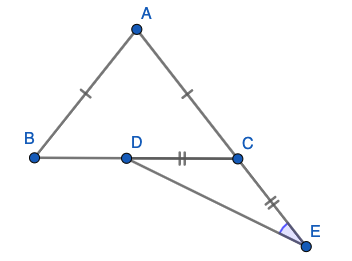
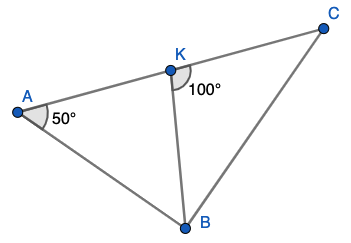
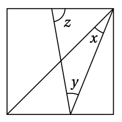

# &nbsp;

<h1 style="font-size:28pt">Skaitļu teorija: Igaunijas olimpiādes</h1>

* **EE.PK** - **Eesti Piirkonnavoor** (Igaunijas reģionu kārta) - īso atbilžu testi 7.-9.kl.
* [Matemaatikaolümpiaadid ](http://www.math.olympiaadid.ut.ee/html/index.php)

# <lo-sample/> EE.PK.2010.7A.6

Uz vienādsānu trijstūra $ABC$ pamata $BC$ izvēlas punktu $D$, bet uz
malas $AC$ pagarinājuma aiz punkta $C$ izvēlas punktu $E$ tā, lai $|CD|=|CE|$. 
Atrast $\sphericalangle BAC$, ja $\sphericalangle CED = 25^{\circ}$. 

{ width=250px }

*Ierakstīt veselu skaitli - leņķa $BAC$ lielumu grādos.*

<small>

* [plan.triangle.angles.internal](#)
* [plan.triangle.special.isosceles](#)
* Topic:triangleSumOfAngles
* Answer:80

</small>

<!--
ru=
На основании $BC$ равнобедренного треугольника $ABC$ выбирают точку $D$, а на продолжении
ребра $AC$ через точку $C$ выбирают точку $E$ так,
что $|CD| = |CE|$. Найти величину угла $BAC$, если $\sphericalangle CED = 25^{\circ}$.
-->

<!--
questionType=Test.ShortAnswer
-->

## Atrisinājums

Trijstūra $CDE$ leņķu summa ir $180^{\circ}$ un divi no tā leņķiem 
ir $25^{\circ}$. Tāpēc leņķis $\sphericalangle DCE$ ir 
$180^{\circ} - 25^{\circ} - 25^{\circ} = 130^{\circ}$. 

Tā blakusleņķis $\sphericalangle DCA = 180^{\circ} - 130^{\circ} = 50^{\circ}$. 
Atkārtojam līdzīgu spriedumu vienādmalu trijstūrim $ABC$, kam viens leņķis pie 
pamata ir $50^{\circ}$. Tad arī otrs leņķis pie pamata $\sphericalangle ABC = 50^{\circ}$
un leņķis pie virsotnes $\sphericalangle BAC = 180^{\circ} - 50^{\circ} - 50^{\circ} = 80^{\circ}$. 

# <lo-sample/> EE.PK.2010.8A.6

No vienādsānu trijstūra uz ārpusi konstruēti taisnstūri. Atrast to leņķu lielumu summu, 
kas apzīmēti ar lociņiem.

{ width=250px }

*Ierakstīt veselu skaitli - leņķu summu grādos.*

<small>

* [plan.circle.angles.central](#)
* [plan.triangle.angles.internal](#)
* Topic:measuringSegmentsAngles
* Answer:360

</small>

<!-- 
ru=
На сторонах равнобедренного треугольника построены прямоугольники. Найти сумму величин
углов, обозначенных дугами.
-->

<!--
questionType=Test.ShortAnswer
-->

## Atrisinājums

Trijstūra iekšējos leņķus apzīmējam ar $\alpha$, $\beta$ un $\gamma$. 
(Vienādsānu trijstūrī divi no šiem leņķiem ir vienādi, bet mūsu apgalvojumā tas 
nav vajadzīgs - trīs ar lociņu apzīmēto leņķu summu var noteikt jebkuram trijstūrim.)

Viens no leņķiem, kas apzīmēts ar lociņu ir $360^{\circ} - 90^{\circ} - 90^{\circ} - \alpha = 180 - \alpha$.   
Abi pārējie leņķi ir attiecīgi $180^{\circ} - \beta$ un $180^{\circ} - \gamma$. 
Tāpēc visu šo summa ir  
$(180^{\circ} - \alpha) + (180^{\circ} - \beta) + (180^{\circ} - \gamma) = 540^{\circ} - (\alpha + \beta + \gamma)$.  

Summa $(\alpha + \beta + \gamma) = 180^{\circ}$, jo tie ir trijstūra iekšējie leņķi. Iegūstam, ka trīs 
ar lociņu apzīmēto leņķu summa ir $540^{\circ} - 180^{\circ} = 360^{\circ}$. 

# <lo-sample/> EE.PK.2011.7A.7

Zīmējumā attēloti divi vienādsānu trijstūri, kuriem leņķi pie virsotnes ir attiecīgi 
$40^{\circ}$ un $50^{\circ}$, un kuru pamati ir uz vienas taisnes. 
Atrast leņķi $x$.

{ width=250px }

*Ierakstīt veselu skaitli - leņķa $x$ lielumu grādos.*

<small>

* [plan.triangle.special.isosceles](#)
* [plan.triangle.angles.internal](#)
* [plan.measurements.angles.linearpair](#)
* Topic:isoscelesTriangles
* Answer:45

</small>

<!--
ru=
На рисунке изображены два равнобедренных треугольника, углы при вершинах которых равны
$40^{\circ}$ и $50^{\circ}$, и основания которых лежат на одной
прямой. Найти величину угла $x$.
-->

<!--
questionType=Test.ShortAnswer
-->

## Atrisinājums

Leņķi pie vienādsānu trijstūru pamata ir attiecīgi $(180^{\circ} - 40^{\circ})/2 = 70^{\circ}$ un 
$(180^{\circ} - 50^{\circ})/2 = 65^{\circ}$. 

Leņķis $x$ plus $70^{\circ}$ plus $65^{\circ}$ ir izstiepts leņķis. Iegūstam, ka 
$x = 180^{\circ} - (70^{\circ} + 65^{\circ}) = 45^{\circ}$. 

# <lo-sample/> EE.PK.2011.9A.7

Atrast leņķu lielumu summu, kas zīmējumā apzīmēti ar $x$ un $y$. 

{ width=200px }

*Ierakstīt veselu skaitli - leņķu summu grādos.*

<small>

* [plan.measurements.angles.central](#)
* [plan.polygon.angles.internal](#)
* Topic:polygonSumOfAngles
* Answer:150

</small>

<!--
ru=
Найти сумму величин углов, обозначенных на рисунке буквами $x$ и $y$.
-->

<!--
questionType=Test.ShortAnswer
-->

## Atrisinājums

Zīmējumā dots piecstūris, kurš nav izliekts. Leņķis, kurš papildina $60^{\circ}$ leņķi 
līdz pilnam aplim ir $360^{\circ} - 60^{\circ} = 300^{\circ}$. Tāpēc piecstūra 
iekšējo leņķu summa ir $180^{\circ} \cdot (5-2) = 540^{\circ}$ un iegūstam 
vienādojumu:

$x + y + 40^{\circ} + 300^{\circ} + 50^{\circ} = 540^{\circ}$.  
Iegūstam, ka $x + y$ ir $540^{\circ} - (40^{\circ} + 300^{\circ} + 50^{\circ}) = 150^{\circ}$. 

# <lo-sample/> EE.PK.2012.7A.8

Uz vienas no taisnstūra malām konstruēts vienādmalu trijstūris. Vienu no 
šī trijstūra malām pagarināja, kā parādīts zīmējumā. 
Atrast platā leņķa $\alpha$ lielumu, kas rodas starp trijstūra pagarināto malu un 
taisnstūra malu. 

{ width=250px }

*Ierakstīt veselu skaitli - leņķa $\alpha$ lielumu grādos.*

<small>

* [plan.triangle.special.equilateral](#)
* [plan.measurements.angles.interior](#)
* Topic:parallelAndIntersectingLines
* Answer:120

</small>

<!--
ru=
На одной из сторон прямоугольника нарисовали равносторонний треугольник. Одну из сторон
этого треугольника продлили так, как показано
на рисунке. Найти величину тупого угла $\alpha$, который образовался между продолжением стороны треугольника и стороной прямоугольника.
-->

<!--
questionType=Test.ShortAnswer
-->

## Atrisinājums

Taisnstūrī abas vertikālās malas ir paralēlas, tāpēc 
iekšējo vienpusleņķu summa $60^{\circ} + \alpha = 180^{\circ}$.  
Iegūstam, ka $\alpha = 120^{\circ}$. 

# <lo-sample/> EE.PK.2012.8A.6

Atrast leņķa $\sphericalangle BAC$ lielumu $\alpha$, ja nogriežņi $BD$ un
$CD$ ir šī trijstūra iekšējo leņķu bisektrises, un leņķa $\sphericalangle BDC$ lielums ir $5\alpha$.

{ width=300px }

*Ierakstīt veselu skaitli - leņķa $\alpha$ lielumu grādos.*

<small>

* [plan.triangle.angles.internal](#)
* Topic:triangleSumOfAngles
* Answer:20

</small>

<!--
ru=
Найти величину $\alpha$ угла $\sphericalangle BAC$ треугольника $ABC$, если отрезки $BD$ и
$CD$ делят углы этого треугольника пополам, а величина угла $BDC$ равна $5\alpha$.
-->

## Atrisinājums

Trijstūra $BCD$ iekšējo leņķu summa ir $180^{\circ}$ tāpēc
$\sphericalangle DCB + \sphericalangle DBC = 180^{\circ} - 5\alpha$, 
bet $\sphericalangle ACB + \sphericalangle ABC$ summa ir divreiz lielāka - tātad $360^{\circ} - 10\alpha$. 

Bet šī summa $\sphericalangle ACB + \sphericalangle ABC$ ir arī $180^{\circ} - \alpha$ 
(trijstūra $ABC$ iekšējo leņķu summas dēļ). 
Tāpēc $360^{\circ} - 10\alpha = 180^{\circ} - \alpha$ jeb $\alpha = 20^{\circ}$. 

# <lo-sample/> EE.PK.2013.7A.6

No riņķa līnijas centra $O$ novilkti $3$ stari, kas dala riņķi trīs sektoros, kuru 
leņķu lielumi ir $\alpha$, $\beta$ un $\gamma$. Leņķu $\alpha$ un $\beta$ summa 
ir izstiepts leņķis, bet leņķu $\beta$ un $\gamma$ summa ir $200^{\circ}$. 
Kāda ir leņķu $\alpha$ un $\gamma$ summa?

*Ierakstīt veselu skaitli - leņķu $\alpha$  un $\gamma$ summu grādos.*

<small>

* [plan.measurements.angles.central](#)
* [alg.linear.equations](#)
* Topic:measuringSegmentsAngles
* Answer:340

</small>

<!--
ru=
Из центра $O$ окружности проведены $3$ луча, которые делят круг на три
сектора, величины углов которых равны $\alpha$, $\beta$ и $\gamma$. Сумма углов $\alpha$ и $\beta$
является развёрнутым углом, а сумма углов $\beta$ и $\gamma$ равна $200^{\circ}$. 
Какова величина суммы углов $\alpha$ и $\gamma$?
-->

<!--
questionType=Test.ShortAnswer
-->

## Atrisinājums

Izrakstām zināmās leņķu summas: $\alpha + \beta + \gamma = 360^{\circ}$ (jo šie sektori veido pilnu apli).  
$\alpha + \beta = 180^{\circ}$ (izstiepts leņķis).  
$\beta + \gamma = 200^{\circ}$. 

Pirmo vienādojumu pareizinām ar 2 un atņemam abus pārējos:  
$2(\alpha + \beta + \gamma) - (\alpha + \beta) - (\beta + \gamma) = \alpha + \gamma$. 
No otras puses, šī izteiksme ir $2 \cdot 360^{\circ} - 180^{\circ} - 200^{\circ} = 340^{\circ}$.

# <lo-sample/> EE.PK.2013.8A.6

Dots taisnstūris $ABCD$, kurā
$\sphericalangle CBD = 25^{\circ}$. 
Punktu $E$ uz malas $BC$ izvēlējās tā, lai $|CE| = |CD|$. 
Atrast leņķa $BDE$ lielumu.

{ width=250px }

*Ierakstīt veselu skaitli - leņķa lielumu grādos.*

<small>

* [plan.triangle.special.isosceles](#)
* [plan.triangle.angles.internal](#)
* Topic:triangleSumOfAngles
* Answer:20

</small>

<!--
ru=
Дан прямоугольник $ABCD$, в котором
$\sphearicalangle CBD = 25^{\circ}$. 
Точку $E$ на стороне $BC$ выбрали так, чтобы $|CE| = |CD|$. 
Найти величину угла $BDE$.
-->

<!--
questionType=Test.ShortAnswer
-->

## Atrisinājums

$\sphericalangle DEC = 45^{\circ}$, jo tas ir leņķis vienādsānu taisnleņķa trijstūrī 
$EDC$. Tāpēc blakusleņķis $\sphericalangle BED = 180^{\circ} - 45^{\circ} = 135^{\circ}$. 

Visbeidzot, trijstūrī $BDE$ iekšējo leņķu summa ir $180^{\circ}$ un 
divi leņķi jau ir zināmi (attiecīgi $25^{circ}$ un $135^{\circ}$). 
Tādēļ trešais leņķis ir $180^{\circ} - 25^{\circ} - 135^{\circ} = 20^{\circ}$. 

# <lo-sample/> EE.PK.2014.7A.8

Zīmējumā attēlotajā četrstūrī 
$|AB| = |CD|$. Atrast leņķa $\sphericalangle ABC$ lielumu. 

{ width=250px }

*Ierakstīt veselu skaitli - leņķa lielumu grādos.*

<small>

* [plan.triangle.special.isosceles](#)
* Topic:isoscelesTriangles
* Answer:65

</small>

<!--
ru=
В изображённом на рисунке четырёхугольнике
$|AB| = |CD|$. Найти величину угла $ABC$.
-->

<!--
questionType=Test.ShortAnswer
-->

## Atrisinājums 

Trijstūrī $ACD$ trešais leņķis ir $180^{\circ} - 30^{\circ} - 75^{\circ} = 75^{\circ}$. 
Tāpēc trijstūris $ACD$ ir vienādsānu un $|CD| = |CA|$.
Zināms arī, ka $|CD| = |AB|$. 

Tādēļ $|AB| = |AC|$ un arī trijstūris $ABC$ ir vienādsānu. 
Tāpēc tajā abi leņķi pie pamata $\sphericalangle ABC$ un $\sphericalangle ACB$ ir 
savstarpēji vienādi un summā ar $50^{\circ}$ dod $180^{\circ}$. 
Tāpēc tie abi vienādi ar $(180^{\circ} - 50^{\circ})/2 = 65^{\circ}$. 

# <lo-sample/> EE.PK.2014.8A.7

$ABC$ ir taisnleņķa trijstūris. Punkts $K$
atrodas uz hipotenūzas $AC$ un $|KB| = 15\,\text{cm}$. Atrast
malas $AC$ garumu.

{ width=300px }

*Ierakstīt veselu skaitli - malas $AC$ garumu centimetros.*

<small>

* [plan.triangle.angles.internal](#)
* Topic:triangleSumOfAngles
* Answer:30

</small>

<!--
ru=
Треугольник $ABC$ прямоугольный. Точка $K$
лежит на стороне $AC$ и $|KB| = 15\,\text{cm}$. Найти
длину стороны $AC$.
-->

<!--
questionType=Test.ShortAnswer
-->

Tā kā $ABC$ ir taisnleņķa trijstūris, tad tajā 
trešais leņķis $\sphericalangle ACB = 90^{\circ} - 50^{\circ} = 40^{\circ}$. 

Trijstūrī $BKC$ var izteikt trešo leņķi, jo divi leņķi jau zināmi:
$\sphericalangle KBC = 180^{\circ} - 100^{\circ} - 40^{\circ} = 40^{\circ}$. 
Tādēļ trijstūris $KBC$ ir vienādsānu trijstūris un tajā $|KB| = |KC|$. 

Var izteikt arī leņķi $\sphericalangle ABK = 90^{\circ} - 40^{\circ} = 50^{\circ}$. 
Tādēļ arī trijstūris $AKB$ ir vienādsānu un $|KB| = |KA|$. 
Iegūstam, ka $|AC| = |AK| + |KC| = 2|KB| = 2 \cdot 15 = 30$ centimetri.  

# <lo-sample/> EE.PK.2015.7A.6

Trijstūrī $ABC$ malu $AB$ un $AC$ garumi ir vienādi, bet
leņķis $\sphericalangle ACB$ ir $70^{\circ}$. 
Uz malas $AC$ atzīmēja punktu $P$ tā, lai nogriežņi $BP$ un
$BC$ būtu vienādi. Atrast ar $x$ apzīmēto leņķi. 

{ width=200px }

*Ierakstīt veselu skaitli - leņķa $x$ lielumu grādos.*

<small>

* [plan.triangle.angles.internal](#)
* [plan.triangle.special.isosceles](#)
* Topic:isoscelesTriangles
* Answer:30

</small>

<!-- 
ru=
В треугольнике $ABC$ длины сторон $AB$ и $AC$ равны
между собой, а величина угла $ACB$ равна $70^{\circ}$. 
На стороне $AC$ выбрали точку $P$ так, чтобы отрезки $BP$ и
$BC$ оказались равной длины. Найти величину угла,
обозначенного буквой $x$.
-->

<!--
questionType=Test.ShortAnswer
-->

## Atrisinājums

Tā kā $PBC$ ir vienādsānu trijstūris, tad $\sphericalangle PCB = \sphericalangle CPB = 70^{\circ}$ 
un atlikušais leņķis $\sphericalangle PBC = $180^{\circ} - 70^{\circ} - 70^{\circ} = 40^{\circ}$.

Līdzīgi arī 
vienādsānu trijstūra $ABC$ virsotnes $A$ leņķis ir $180^{\circ} - 70^{\circ} - 70^{\circ} = 40^{\circ}$. 
Leņķim $x$ jābūt tādam, lai visu ar lociņiem apzīmēto leņķu summa 
$x + 40^{\circ} + 70^{\circ} + 40^{\circ}$ būtu $180^{\circ}$ jeb $x = 30^{\circ}$. 

# <lo-sample/> EE.PK.2015.8A.8

Četras taisnes krustojas kā attēlots zīmējumā. 
Atrast leņķi, kas apzīmēts ar burtu $x$. 

{ width=200px }

*Ierakstīt veselu skaitli - leņķa $x$ lielumu grādos.*

<small>

* [plan.polygon.angles](#)
* [plan.measurements.angles.linearpair](#)
* Topic:polygonSumOfAngles
* Answer:130

</small>

<!--
ru=
Четыре прямые пересекаются показанным
на рисунке образом. Найти величину угла,
обозначенного буквой $x$.
-->

<!--
questionType=Test.ShortAnswer
-->

## Atrisinājums

Uzzīmējam četrstūrim visus ārējos leņķus, kā parādīts zīmējumā. 
Pēc blakusleņķu īpašības, blakus $90^{\circ}$ leņķim atrodas $180^{\circ} - 90^{\circ} = 90^{\circ}$ leņķis, 
bet blakus $100^{\circ}$ atrodas $180^{\circ} - 100^{\circ} = 80^{\circ}$ leņķis.

Visu ārējo leņķu summa ir $360^{\circ}$, tāpēc 
$x + 90^{\circ} + 80^{\circ} + 60^{\circ} = 360^{\circ}$ un
$x = 360^{\circ} - (90^{\circ} + 80^{\circ} + 60^{\circ}) = 130^{\circ}$. 

# <lo-sample/> EE.PK.2015.9A.6

Taisne $a$ krustojas ar taisnēm $s$ un $t$ punktā $A$, bet
taisne $b$ krustojas ar taisnēm $s$ un $t$ attiecīgi punktos $B$ un $C$. 
Taisnes $a$ un $b$ ir paralēlas. Divi zīmējumā redzamie leņķi ir $y$, 
bet leņķis $\sphericalangle ABC$ ir $80^{\circ}$. Atrast $y$. 

{ width=200px }

*Ierakstīt veselu skaitli - leņķa $y$ lielumu grādos.*

<small>

* [plan.triangle.angles.internal](#)
* [plan.measurements.angles.corresponding](#)
* Topic:triangleSumOfAngles
* Answer:50

</small>

<!--
ru=
Прямая $a$ пересекается с прямыми $s$ и $t$ в точке $A$, 
а прямая $b$ пересекается с прямыми $s$ и $t$ соответственно в точках $B$ и $C$. 
Прямые $a$ и $b$ являются параллельными. Величины двух обозначенных
на рисунке углов равны $y$, а величина угла $\sphericalangle ABC$
равна $80^{\circ}$. Найти $y$.
-->

<!--
questionType=Test.ShortAnswer
-->

## Atrisinājums 

Tā kā $\sphericalangle BCA$ un $y$ ir kāpšļu leņķi, tad tie ir vienādi. 
Trijstūrī $ABC$ iekšējo leņķu summa ir $80^{\circ} + 2y = 180^{\circ}$ 
jeb $y = 50^{\circ}$. 

# <lo-sample/> EE.PK.2016.7A.8

Atrast leņķi, kas apzīmēts ar $y$, ja ar $x$ apzīmētie leņķi ir vienādi. 

{ width=250px }

*Ierakstīt veselu skaitli - leņķa $EAB$ lielumu grādos.*

<small>

* [plan.triangle.angles.internal](#)
* [plan.measurements.angles.vertical](#)
* Topic:triangleSumOfAngles
* Answer:48

</small>

<!--
ru=
Найти величину угла, обозначенного
буквой $y$, если величины обозначенных буквой $x$ углов равны.
-->

<!--
questionType=Test.ShortAnswer
-->

## Atrisinājums

Pēc krustleņķu īpašības, labajā pusē esošajam trijstūrim 
iekšējie leņķi ir $x$, $x$ un $96^{\circ}$ un to summa ir $180^{\circ}$. 
Tāpēc $x$ ir $(180^{\circ} - 96^{\circ})/2 = 42^{\circ}$. 

Visbeidzot, taisnleņķa trijstūrī, kas ir kreisajā pusē, 
iekšējo leņķu summa arī ir $180^{\circ}$, tāpēc 
$y = 180^{\circ} - 90^{\circ} - x = 90^{\circ} - 42^{\circ} = 48^{\circ}$. 

# <lo-sample/> EE.PK.2016.8A.9

Punkts $C$ ir nogriežņu $AD$ un $EB$ krustpunkts. 
Trijstūris $ACE$ ir vienādsānu. Atrast leņķi $\sphericalangle EAB$.

{ width=250px }

*Ierakstīt veselu skaitli - leņķa $EAB$ lielumu grādos.*

<small>

* [plan.triangle.angles.internal](#)
* [plan.measurements.angles.linearpair](#)
* Topic:triangleSumOfAngles
* Answer:57

</small>

<!--
ru=
Точка $C$ является точкой пересечения отрезков $AD$ и $EB$. 
Треугольник $ACE$ равнобедренный. Найти величину угла $\sphericalangle EAB$.
-->

<!--
questionType=Test.ShortAnswer
-->

## Atrisinājums

Trijstūra $ECD$ trešais leņķis ir $180^{\circ} - 90^{\circ} - 24^{\circ} = 66^{\circ}$. 
Blakusleņķis $\sphericalangle ACE = 180^{\circ} - 66^{\circ} = 114^{\circ}$. 

Vienādsānu trijstūrī $ACE$ abi leņķi $\sphericalangle AEC$ un $\sphericalangle EAC$ ir $33^{\circ}$, lai 
$ACE$ iekšējo leņķu summa būtu $180^{\circ}$.
Visbeidzot, taisnleņķa trijstūrī $EAB$ atlikušais leņķis ir 
$\sphericalangle EAB = 180^{\circ} - 90^{\circ} - 33^{\circ} = 57^{\circ}$. 

# <lo-sample/> EE.PK.2016.9A.9

Taisnes $DE$ un $AB$ ir paralēlas. Taisnes $AD$ un $BE$ krustojas punktā $C$
un izpildās vienādības  $|DB| = |DC| = |BE|$.
Atrast leņķi $DCE$. 

{ width=200px }

*Ierakstīt veselu skaitli - leņķa $DCE$ lielumu grādos.*

<small>

* [plan.triangle.angles.internal](#)
* [plan.measurements.angles.interior](#)
* [plan.measurements.angles.vertical](#)
* Topic:triangleSumOfAngles
* Answer:20

</small>

<!--
ru=
Прямые $DE$ и $AB$ параллельны. Прямые
$AD$ и $BE$ пересекаются в точке $C$, и действует равенство $|DB| = |DC| = |BE|$.
Найти величину угла $DCE$.
-->

<!--
questionType=Test.ShortAnswer
-->

## Atrisinājums

Apzīmējam leņķi $\sphericalangle DCE = \sphericalangle DBE$ ar $\alpha$. 
Vienādsānu trijstūrī $BDE$ leņķis pie pamata $\sphericalangle BDE = (180^{\circ} - \alpha)/2 = 90^{\circ} - \alpha/2$. 
Leņķi $\sphericalangle BDE$ un $\sphericalangle DBA$ ir iekšējie šķērsleņķi; 
tie abi ir $90^{\circ} - \alpha/2$. 

$\sphericalangle DAB$ ir krustleņķis citam leņķim, kas vienāds ar $60^{\circ}$, tādēļ 
arī $\sphericalangle DAB = 60^{\circ}$. 
Varam izteikt $ABC$ iekšējo leņķu summu: $60^{\circ} + ((90^{\circ} - \alpha/2) + \alpha) + \alpha = 180^{\circ}$. 
Izsakot no šejienes, iegūstam, ka $\frac{3}{2}\alpha = 180^{\circ} - (60^{\circ} + 90^{\circ})$ jeb 
$\frac{3}{2}\alpha = 30^{\circ}$ jeb $\alpha = 20^{\circ}$.  

# <lo-sample/> EE.PK.2017.7A.6

Uz trijstūra $ABC$ malas $BC$ ir punkts $D$, kuram trijstūris $ABD$ ir vienādmalu, 
bet trijstūris $ACD$ ir vienādsānu. Atrast leņķi $ACB$. 

*Ierakstīt veselu skaitli - leņķa $ACB$ lielumu grādos.*

<small>

* [plan.triangle.angles.internal](#)
* [plan.measurements.angles.linearpair](#)
* Topic:specialTriangles
* Answer:30

</small>

<!--
ru=
На стороне $BC$ треугольника $ABC$ найдётся такая точка $D$, при которой
треугольник $ABD$ является равносторонним, а треугольник $ACD$ равнобедренным. Найти величину угла $ACB$.
-->

<!--
questionType=Test.ShortAnswer
-->

## Atrisinājums

Trijstūrī $ABD$ visi leņķi ir $60^{\circ}$. Tādēļ arī $\sphericalangle BDA = 60^{\circ}$ un 
tā blakusleņķis $\sphericalangle ADC = 120^{\circ}$. 
Tā kā $ADC$ ir vienādsānu trijstūris, tad $\sphericalangle ACD = \sphericalangle DAC = 30^{\circ}$. 
Un leņķis $ACB$ ir tas pats kas $ACD$ - tātad arī tas ir $30^{\circ}$. 

# <lo-sample/> EE.PK.2017.8A.6

Taisnleņķa trijstūrī $ABC$ no taisnā leņķa virsotnes $C$ novilkts augstums $CD$, 
kas krusto no virsotnes $B$ vilkto bisektrisi punktā $L$. Leņķa $BLC$ 
lielums ir $110^{\circ}$.
Atrast leņķi $ACD$. 

{ width=200px }

*Ierakstīt veselu skaitli - leņķa $ACD$ lielumu grādos.*

<small>

* [plan.triangle.angles.internal](#)
* Topic:triangleSumOfAngles
* Answer:40

</small>

<!--
ru=
В прямоугольном треугольнике $ABC$ из вершины
прямого угла $C$ проведена высота $CD$, которая
пересекает проведённую из вершины $B$ биссектрису в точке $L$. Величина угла $BLC$ 
равна $110^{\circ}$.
Найти величину угла $ACD$.
-->

<!--
questionType=Test.ShortAnswer
-->

## Atrisinājums

Apzīmējam $\sphericalangle ABC = \beta$. 
Tad $\sphericalangle BCD = 90^{\circ} - \beta$, jo 
$BCD$ ir taisnleņķa trijstūris. 
Arī $\sphericalangle CAB = 90^{\circ} - \beta$, jo arī 
$ABC$ ir taisnleņķa trijstūris; savukārt $\sphericalangle ACD = 90^{\circ} - (90^{\circ} - \beta) = \beta$, 
jo arī $ACD$ ir taisnleņķa trijstūris. Mums tātad jāatrod $\beta$. 

$\sphericalangle CBL = \beta/2$, jo $BL$ ir leņķa $\sphericalangle ABC$ bisektrise.
Izsakām trijstūra $CBL$ iekšējo leņķu summu: $(90^{\circ} - \beta) + \beta/2 + 110^{\circ} = 180^{\circ}$, 
tāpēc $200^{\circ} - \beta/2 = 180^{\circ}$ jeb $\beta = 40^{\circ}$.

# <lo-sample/> EE.PK.2017.9A.6

No šaurleņķa trijstūra $ABC$ virsotnes $C$ novilkta bisektrise $CD$. 
Trijstūrī $ACD$ viens iekšējais leņķis ir $60^{\circ}$, 
bet trijstūrī $BCD$ viens iekšējais leņķis ir $100^{\circ}$.
Atrast leņķi $ACB$. 

*Ierakstīt veselu skaitli - leņķa $\sphericalangle ACB$ lielumu grādos.*

<small>

* [plan.triangle.angles.internal](#)
* [plan.measurements.angles.linearpair](#)
* Topic:triangleSumOfAngles
* Answer:80

</small>

<!--
ru=
Из вершины $C$ остроугольного треугольника $ABC$ проведена биссектриса
$CD$. Величина одного из внутренних углов треугольника $ACD$ равна $60^{\circ}$,
а величина одного из внутренних углов треугольника $BCD$ равна $100^{\circ}$.
Найти величину угла $ACB$.
-->

<!--
questionType=Test.ShortAnswer
-->

## Atrisinājums

Vienīgais platais leņķis $100^{\circ}$ var būt pie virsotnes $D$, 
kur bisektrise krusto pretējo malu, jo visi citi leņķi ir šauri. 
Tāpēc $\sphericalangle CDB = 100^{\circ}$. 
Tad $\sphericalangle CDA$ ir blakusleņķis, tātad vienāds ar $80^{\circ}$. 

Kurš no leņķiem trijstūrī $ACD$ ir $60^{\circ}$? 
Tas nevar būt pie virsotnes $C$, jo citādi bisektrise dalītu uz pusēm 
$120^{\circ}$ leņķi un $ABC$ nebūtu šaurleņķu trijstūris.
Tāpēc $\sphericalangle CAD = 60^{\circ}$ un tādēļ 
$\sphericalangle ACD = 180^{\circ} - 80^{\circ} - 60^{\circ} = 40^{\circ}$. 

Leņķis $\sphericalangle ACB$ ir divreiz lielāks par $\sphericalangle ACD$, 
tāpēc tas ir $80^{\circ}$. 

# <lo-sample/> EE.PK.2018.7A.6

Atrast leņķi $z$, ja zīmējumā attēlotais četrstūris ir kvadrāts, 
leņķis $x$ ir $23^{\circ}$ un leņķis $y$ ir $32^{\circ}$.

{ width=150px }

*Ierakstīt veselu skaitli - leņķa $z$ lielumu grādos.*

<small>

* [plan.triangle.angles.internal](#)
* [plan.polygon.angles.internal](#)
* Topic:triangleSumOfAngles
* Answer:80

</small>

<!--
ru=
Найти величину угла $z$, если изображенный на рисунке
четырехугольник является квадратом, величина угла $x$
равна $23^{\circ}$, а величина угла $y$ равна $32^{\circ}$.
-->

<!--
questionType=Test.ShortAnswer
-->

## Atrisinājums

Blakus leņķim $x = 23^{\circ}$ atrodas leņķis $\alpha = 45^{\circ} - 23^{\circ} = 22^{\circ}$. 
Leņķis $\beta = 90^{\circ} - 22^{\circ} = 68^{\circ}$. 
$\beta + y = 100^{\circ}$. 

Tādēļ leņķim $z$ jābūt $180^{\circ} - 100^{\circ} = 80^{\circ}$, lai taisnleņķa
trapecē iekšējo leņķu summa būtu $360^{\circ}$. 

# <lo-sample/> EE.PK.2018.8A.7

Atrast leņķa $x$ lielumu, ja zīmējumā attēlotais četrstūris ir paralelograms. 

{ width=200px }

*Ierakstīt veselu skaitli - leņķa $x$ lielumu grādos.*

<small>

* [plan.triangle.angles.internal](#)
* [plan.polygon.angles.internal](#)
* Topic:triangleSumOfAngles
* Answer:44

</small>

<!--
ru=
Найти величину угла $x$, если изображенный на рисунке четырехугольник является параллелограммом.
-->

<!--
questionType=Test.ShortAnswer
-->

## Atrisinājums

Paralelogramā centrālās simetrijas dēļ arī pretī leņķim $44^{\circ}$ esošais
leņķis ??? ir $44^{\circ}$. 
Taisnleņķa trijstūrī ??? atlikušais 
leņķis ir $180^{\circ} - 90^{\circ} - 44^{\circ} = 46^{\circ}$
Savukārt leņķis $x$ papildina $46^{\circ}$ līdz $90^{\circ}$, tāpēc 
$x = 44^{\circ}$.

# <lo-sample/> EE.PK.2018.9A.6

Atrast leņķa $x$ lielumu, ja zīmējumā attēlotais četrstūris ir rombs un
$M$ ir tā malas viduspunkts.

{ width=200px }

*Ierakstīt veselu skaitli - leņķa $x$ lielumu grādos.*

<small>

* [plan.triangle.special.equilateral](#)
* Topic:placementTriangleSpecialLines
* Answer:120

</small>

<!--
ru=
Найти величину угла $x$, если изображенный
на рисунке четырехугольник является ромбом и точка $M$ является серединой его стороны.
-->

<!--
questionType=Test.ShortAnswer
-->

## Atrisinājums

Lai augstums, kura pamats ir punkts $M$, būtu vienlaikus arī mediāna, 
trijstūrim ??? jābūt vienādsānu: ??? = ???. Tā kā vienādas arī otras divas malas, 
tad trijstūris ??? ir vienādmalu. Ja rombu veido divi kopā salikti vienādmalu 
trijstūri, tad $x = 120^{\circ}$. 

# <lo-sample/> EE.PK.2019.7A.6

Uz taisnleņķa trijstūra $ABC$ malas $AB$ atzīmēts punkts $D$ tā, ka
$|CD| = |DB|$ un leņķa $\sphericalangle ACD$ lielums ir $24^{\circ}$. 
Atrast leņķi $\sphericalangle ABC$. 

{ width=150px }

*Ierakstīt veselu skaitli - leņķa $ABC$ lielumu grādos.*

<small>

* [plan.triangle.angles.internal](#)
* [plan.measurements.angles.linearpair](#)
* Topic:triangleSumOfAngles
* Answer:33

</small>

<!--
ru=
На стороне $AB$ прямоугольного треугольника $ABC$ лежит точка $D$ так, 
что $|CD| = |DB|$ и величина угла $ACD$
равна $24^{\circ}$. Найти величину угла $ABC$.
-->

<!--
questionType=Test.ShortAnswer
-->

## Atrisinājums

Leņķis $CDA$ ir $66^{\circ}$ un blakusleņķis $CDB = 114^{\circ}$. 
Abi pārējie leņķi vienādsānu trijstūrī $CDB$ ir $(180^{\circ} - 114^{\circ})/2 = 33^{\circ}$. 
Tāpēc arī $\sphericalangle ABC = 33^{\circ}$. 

# <lo-sample/> EE.PK.2019.8A.6

Trijstūrī $ABC$ malas $AC$ un $BC$ ir vienādas. 
No punkta $D$, kas atrodas uz malas $AB$ novilka nogriezni $DE$, 
kas krustoja malu $AC$ punktā $K$. Atrast leņķa $\sphericalangle ACB$ 
lielumu, ja $\sphericalangle ADK = 97^{\circ}$ un $\sphericalangle DKC = 123^{\circ}$.

{ width=250px }

*Ierakstīt veselu skaitli - leņķa $ACB$ lielumu grādos.*

<small>

* [plan.triangle.angles.internal](#)
* [plan.measurements.angles.linearpair](#)
* Topic:triangleSumOfAngles
* Answer:128

</small>

<!--
ru=
В треугольнике $ABC$ стороны $AC$ и
$BC$ равны. Из точки $D$, лежащей на
стороне $AB$, провели отрезок $DE$,
который пересёк сторону $AC$ в точке $K$. Найти величину угла $ACB$, 
если $\sphericalangle ADK = 97^{\circ}$ и $\sphericalangle DKC = 123^{\circ}$.
-->

<!--
questionType=Test.ShortAnswer
-->

## Atrisinājums 

Leņķa $\sphericalangle DKC = 123^{\circ}$ blakusleņķis $\sphericalangle DKA = 180^{\circ} - 123^{\circ} = 57^{\circ}$. 
Izsakām trijstūra $AKD$ atlikušo leņķi $\sphericalangle KAD$, ja divi jau ir zināmi: 
$180^{\circ} - 57^{\circ} - 97^{\circ} = 26^{\circ}$. 

Ja vienādsānu trijstūrī $ABC$ abi leņķi pie pamata ir $26^{\circ}$, tad leņķis 
pie virsotnes ir $180^{\circ} - 2 \cdot 26^{\circ} = 128^{\circ}$. 

# <lo-sample/> EE.PK.2019.9A.6

Uz regulāra piecstūra $ABCDE$ malas $AB$ uzkonstruēja kvadrātu 
$ABLM$, bet uz tā malas $BC$ uzkonstruēja vienādmalu trijstūri $BCK$ tā, ka
gan kvadrāts, gan trijstūris atrodas ārpus piecstūra. 
Atrast leņķi $\sphericalangle BKL$.

{ width=200px }

*Ierakstīt veselu skaitli - leņķa $BKL$ lielumu grādos.*

<small>

* Topic:polygonSumOfAngles
* Answer:39

</small>

<!--
ru=
На стороне $AB$ правильного пятиугольника $ABCDE$
нарисовали квадрат $ABLM$, а на стороне $BC$ равносторонний треугольник $BCK$. Найти величину угла
$\sphericalangle BKL$.
-->

<!--
questionType=Test.ShortAnswer
-->

## Atrisinājums

Regulārā piecstūrī iekšējais leņķis ir $108^{\circ}$ 
(tā, lai piecu šādu leņķu summa $5 \cdot 108^{\circ} = 540^{circ}$ būtu vienāda 
ar piecstūra iekšējo leņķu summu, kas vienmēr ir $180^{circ} \cdot (5-2)$. 

Kvadrātam iekšējais leņķis ir $90^{\circ}$, bet vienādmalu trijstūrim $60^{\circ}$. 
Tāpēc $\sphericalangle KBL = 360^{circ} - 108^{\circ} - 90^{\circ} - 60^{\circ} = 102^{\circ}$. 
Tā kā $KBL$ ir vienādsānu trijstūris, tad tā leņķis pie pamata ir 
$\sphericalangle BKL = (180^{\circ} - 102^{\circ})/2 = 39^{\circ}$. 

