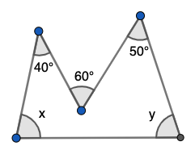
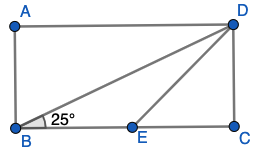

# &nbsp;

<h1 style="font-size:28pt">Skaitļu teorija: Igaunijas olimpiādes</h1>

* **EE.PK** - **Eesti Piirkonnavoor** (Igaunijas reģionu kārta) - īso atbilžu testi 7.-9.kl.
* [Matemaatikaolümpiaadid ](http://www.math.olympiaadid.ut.ee/html/index.php)

# <lo-sample/> EE.PK.2010.7A.6

Uz vienādsānu trijstūra $ABC$ pamata $BC$ izvēlas punktu $D$, bet uz
malas $AC$ pagarinājuma aiz punkta $C$ izvēlas punktu $E$ tā, lai $|CD|=|CE|$. 
Atrast $\sphericalangle BAC$, ja $\sphericalangle CED = 25^{\circ}$. 

{ width=250px }

*Ierakstīt veselu skaitli - leņķa $BAC$ lielumu grādos.*

<small>

* [plan.triangle.angles.internal](#)
* [plan.triangle.special.isosceles](#)
* Topic:triangleSumOfAngles
* Answer:80

</small>

<!--
ru=
На основании $BC$ равнобедренного треугольника $ABC$ выбирают точку $D$, а на продолжении
ребра $AC$ через точку $C$ выбирают точку $E$ так,
что $|CD| = |CE|$. Найти величину угла $BAC$, если $\sphericalangle CED = 25^{\circ}$.
-->

<!--
questionType=Test.ShortAnswer
-->

## Atrisinājums

Trijstūra $CDE$ leņķu summa ir $180^{\circ}$ un divi no tā leņķiem 
ir $25^{\circ}$. Tāpēc leņķis $\sphericalangle DCE$ ir 
$180^{\circ} - 25^{\circ} - 25^{\circ} = 130^{\circ}$. 

Tā blakusleņķis $\sphericalangle DCA = 180^{\circ} - 130^{\circ} = 50^{\circ}$. 
Atkārtojam līdzīgu spriedumu vienādmalu trijstūrim $ABC$, kam viens leņķis pie 
pamata ir $50^{\circ}$. Tad arī otrs leņķis pie pamata $\sphericalangle ABC = 50^{\circ}$
un leņķis pie virsotnes $\sphericalangle BAC = 180^{\circ} - 50^{\circ} - 50^{\circ} = 80^{\circ}$. 

# <lo-sample/> EE.PK.2010.8A.6

No vienādsānu trijstūra uz ārpusi konstruēti taisnstūri. Atrast to leņķu lielumu summu, 
kas apzīmēti ar lociņiem.

{ width=250px }

*Ierakstīt veselu skaitli - leņķu summu grādos.*

<small>

* [plan.circle.angles.central](#)
* [plan.triangle.angles.internal](#)
* Topic:measuringSegmentsAngles
* Answer:360

</small>

<!-- 
ru=
На сторонах равнобедренного треугольника построены прямоугольники. Найти сумму величин
углов, обозначенных дугами.
-->

<!--
questionType=Test.ShortAnswer
-->

## Atrisinājums

Trijstūra iekšējos leņķus apzīmējam ar $\alpha$, $\beta$ un $\gamma$. 
(Vienādsānu trijstūrī divi no šiem leņķiem ir vienādi, bet mūsu apgalvojumā tas 
nav vajadzīgs - trīs ar lociņu apzīmēto leņķu summu var noteikt jebkuram trijstūrim.)

Viens no leņķiem, kas apzīmēts ar lociņu ir $360^{\circ} - 90^{\circ} - 90^{\circ} - \alpha = 180 - \alpha$.   
Abi pārējie leņķi ir attiecīgi $180^{\circ} - \beta$ un $180^{\circ} - \gamma$. 
Tāpēc visu šo summa ir  
$(180^{\circ} - \alpha) + (180^{\circ} - \beta) + (180^{\circ} - \gamma) = 540^{\circ} - (\alpha + \beta + \gamma)$.  

Summa $(\alpha + \beta + \gamma) = 180^{\circ}$, jo tie ir trijstūra iekšējie leņķi. Iegūstam, ka trīs 
ar lociņu apzīmēto leņķu summa ir $540^{\circ} - 180^{\circ} = 360^{\circ}$. 

# <lo-sample/> EE.PK.2011.7A.7

Zīmējumā attēloti divi vienādsānu trijstūri, kuriem leņķi pie virsotnes ir attiecīgi 
$40^{\circ}$ un $50^{\circ}$, un kuru pamati ir uz vienas taisnes. 
Atrast leņķi $x$.

{ width=250px }

*Ierakstīt veselu skaitli - leņķa $x$ lielumu grādos.*

<small>

* [plan.triangle.special.isosceles](#)
* [plan.triangle.angles.internal](#)
* [plan.measurements.angles.linearpair](#)
* Topic:isoscelesTriangles
* Answer:45

</small>

<!--
ru=
На рисунке изображены два равнобедренных треугольника, углы при вершинах которых равны
$40^{\circ}$ и $50^{\circ}$, и основания которых лежат на одной
прямой. Найти величину угла $x$.
-->

<!--
questionType=Test.ShortAnswer
-->

## Atrisinājums

Leņķi pie vienādsānu trijstūru pamata ir attiecīgi $(180^{\circ} - 40^{\circ})/2 = 70^{\circ}$ un 
$(180^{\circ} - 50^{\circ})/2 = 65^{\circ}$. 

Leņķis $x$ plus $70^{\circ}$ plus $65^{\circ}$ ir izstiepts leņķis. Iegūstam, ka 
$x = 180^{\circ} - ($70^{\circ}$ + $65^{\circ}$) = 45^{\circ}$. 

# <lo-sample/> EE.PK.2011.9A.7

Atrast leņķu lielumu summu, kas zīmējumā apzīmēti ar $x$ un $y$. 

{ width=200px }

*Ierakstīt veselu skaitli - leņķu summu grādos.*

<small>

* [plan.measurements.angles.central](#)
* [plan.polygon.angles.internal](#)
* Topic:polygonSumOfAngles
* Answer:150

</small>

<!--
ru=
Найти сумму величин углов, обозначенных на рисунке буквами $x$ и $y$.
-->

<!--
questionType=Test.ShortAnswer
-->

## Atrisinājums

Zīmējumā dots piecstūris, kurš nav izliekts. Leņķis, kurš papildina $60^{\circ}$ leņķi 
līdz pilnam aplim ir $360^{\circ} - 60^{\circ} = 300^{\circ}$. Tāpēc piecstūra 
iekšējo leņķu summa ir $180^{\circ} \cdot (5-2) = 540^{\circ}$ un iegūstam 
vienādojumu:

$x + y + 40^{\circ} + 300^{\circ} + 50^{\circ} = 540^{\circ}$.  
Iegūstam, ka $x + y$ ir $540^{\circ} - (40^{\circ} + 300^{\circ} + 50^{\circ}) = 150^{\circ}$. 

# <lo-sample/> EE.PK.2012.7A.8

Uz vienas no taisnstūra malām konstruēts vienādmalu trijstūris. Vienu no 
šī trijstūra malām pagarināja, kā parādīts zīmējumā. 
Atrast platā leņķa $\alpha$ lielumu, kas rodas starp trijstūra pagarināto malu un 
taisnstūra malu. 

{ width=250px }

*Ierakstīt veselu skaitli - leņķa $\alpha$ lielumu grādos.*

<small>

* [plan.triangle.special.equilateral](#)
* [plan.measurements.angles.interior](#)
* Topic:parallelAndIntersectingLines
* Answer:120

</small>

<!--
ru=
На одной из сторон прямоугольника нарисовали равносторонний треугольник. Одну из сторон
этого треугольника продлили так, как показано
на рисунке. Найти величину тупого угла $\alpha$, который образовался между продолжением стороны треугольника и стороной прямоугольника.
-->

<!--
questionType=Test.ShortAnswer
-->

## Atrisinājums

Taisnstūrī abas vertikālās malas ir paralēlas, tāpēc 
iekšējo vienpusleņķu summa $60^{\circ} + \alpha = 180^{\circ}$.  
Iegūstam, ka $\alpha = 120^{\circ}$. 

# <lo-sample/> EE.PK.2012.8A.6

Atrast leņķa $\sphericalangle BAC$ lielumu $\alpha$, ja nogriežņi $BD$ un
$CD$ ir šī trijstūra iekšējo leņķu bisektrises, un leņķa $\sphericalangle BDC$ lielums ir $5\alpha$.

{ width=300px }

*Ierakstīt veselu skaitli - leņķa $\alpha$ lielumu grādos.*

<small>

* [plan.triangle.angles.internal](#)
* Topic:triangleSumOfAngles
* Answer:20

</small>

<!--
ru=
Найти величину $\alpha$ угла $\sphericalangle BAC$ треугольника $ABC$, если отрезки $BD$ и
$CD$ делят углы этого треугольника пополам, а величина угла $BDC$ равна $5\alpha$.
-->

# <lo-sample/> EE.PK.2013.7A.6

No riņķa līnijas centra $O$ novilkti $3$ stari, kas dala riņķi trīs sektoros, kuru 
leņķu lielumi ir $\alpha$, $\beta$ un $\gamma$. Leņķu $\alpha$ un $\beta$ summa 
ir izstiepts leņķis, bet leņķu $\beta$ un $\gamma$ summa ir $200^{\circ}$. 
Kāda ir leņķu $\alpha$ un $\gamma$ summa?

*Ierakstīt veselu skaitli - leņķu $\alpha$  un $\gamma$ summu grādos.*

<small>

* [plan.measurements.angles.central](#)
* [alg.linear.equations](#)
* Topic:measuringSegmentsAngles
* Answer:340

</small>

<!--
ru=
Из центра $O$ окружности проведены $3$ луча, которые делят круг на три
сектора, величины углов которых равны $\alpha$, $\beta$ и $\gamma$. Сумма углов $\alpha$ и $\beta$
является развёрнутым углом, а сумма углов $\beta$ и $\gamma$ равна $200^{\circ}$. 
Какова величина суммы углов $\alpha$ и $\gamma$?
-->

<!--
questionType=Test.ShortAnswer
-->

## Atrisinājums

Izrakstām zināmās leņķu summas: $\alpha + \beta + \gamma = 360^{\circ}$ (jo šie sektori veido pilnu apli).  
$\alpha + \beta = 180^{\circ}$ (izstiepts leņķis).  
$\beta + \gamma = 200^{\circ}$. 

Pirmo vienādojumu pareizinām ar 2 un atņemam abus pārējos:  
$2(\alpha + \beta + \gamma) - (\alpha + \beta) - (\beta + \gamma) = \alpha + \gamma$. 
No otras puses, šī izteiksme ir $2 \cdot 360^{\circ} - 180^{\circ} - 200^{\circ} = 340^{\circ}$.

# <lo-sample/> EE.PK.2013.8A.6

Dots taisnstūris $ABCD$, kurā
$\sphericalangle CBD = 25^{\circ}$. 
Punktu $E$ uz malas $BC$ izvēlējās tā, lai $|CE| = |CD|$. 
Atrast leņķa $BDE$ lielumu.

{ width=250px }

*Ierakstīt veselu skaitli - leņķa lielumu grādos.*

<small>

* [plan.triangle.special.isosceles](#)
* [plan.triangle.angles.internal](#)
* Topic:triangleSumOfAngles
* Answer:20

</small>

<!--
ru=
Дан прямоугольник $ABCD$, в котором
$\sphearicalangle CBD = 25^{\circ}$. 
Точку $E$ на стороне $BC$ выбрали так, чтобы $|CE| = |CD|$. 
Найти величину угла $BDE$.
-->

<!--
questionType=Test.ShortAnswer
-->

# <lo-sample/> EE.PK.2014.7A.8

Zīmējumā attēlotajā četrstūrī 
$|AB| = |CD|$. Atrast leņķa $\sphericalangle ABC$ lielumu. 

{ width=250px }

*Ierakstīt veselu skaitli - leņķa lielumu grādos.*

<small>

* [plan.triangle.special.isosceles](#)
* Topic:isoscelesTriangles
* Answer:65

</small>

<!--
ru=
В изображённом на рисунке четырёхугольнике
$|AB| = |CD|$. Найти величину угла $ABC$.
-->

<!--
questionType=Test.ShortAnswer
-->

# <lo-sample/> EE.PK.2014.8A.7

$ABC$ ir taisnleņķa trijstūris. Punkts $K$
atrodas uz hipotenūzas $AC$ un $|KB| = 15\,\text{cm}$. Atrast
malas $AC$ garumu.

{ width=300px }

*Ierakstīt veselu skaitli - malas $AC$ garumu centimetros.*

<small>

* [plan.triangle.angles.internal](#)
* Topic:triangleSumOfAngles
* Answer:30

</small>

<!--
ru=
Треугольник $ABC$ прямоугольный. Точка $K$
лежит на стороне $AC$ и $|KB| = 15\,\text{cm}$. Найти
длину стороны $AC$.
-->

<!--
questionType=Test.ShortAnswer
-->
