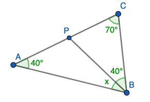

# <lo-sample/> EE.PK.2010TEST.7.6

<text lang="lv">
Uz vienādsānu trijstūra $ABC$ pamata $BC$ izvēlas punktu $D$, bet uz
malas $AC$ pagarinājuma aiz punkta $C$ izvēlas punktu $E$ tā, lai $CD=CE$. 
Atrast $\sphericalangle BAC$, ja $\sphericalangle CED = 25^{\circ}$. 

{ width=250px }

*Ierakstīt veselu skaitli - leņķa $BAC$ lielumu grādos.*
</text>

<text lang="ru">
На основании $BC$ равнобедренного треугольника $ABC$ выбирают точку $D$, а на продолжении
ребра $AC$ через точку $C$ выбирают точку $E$ так,
что $|CD| = |CE|$. Найти величину угла $BAC$, если $\sphericalangle CED = 25^{\circ}$.

{ width=250px }
</text>

<small>

* topic:TriangleAngles
* topic:TrianglesIsosceles
* topic:AnglesParallelLines
* LTopic:LTTriangles
* Answer:80
* Grade:7,8
* questionType:ShortAnswer
* domain:Geom

</small>

<text num="1" lang="lv">
## Ieteikums

Var izteikt vispirms $\sphericalangle DCB$, tad tā blakusleņķi $\sphericalangle ACB$.
</text>

<text num="1" lang="lv">
## Atrisinājums

Trijstūra $CDE$ leņķu summa ir $180^{\circ}$ un divi no tā leņķiem 
ir $25^{\circ}$. Tāpēc $\sphericalangle DCE = 180^{\circ} - 25^{\circ} - 25^{\circ} = 130^{\circ}$. 

Blakusleņķis $\sphericalangle DCA = 180^{\circ} - 130^{\circ} = 50^{\circ}$. 
Atkārtojam līdzīgu spriedumu vienādsānu trijstūrim $ABC$, kam viens leņķis pie 
pamata ir $50^{\circ}$. Arī otrs leņķis pie pamata $\sphericalangle ABC = 50^{\circ}$
un leņķis pie virsotnes: $\sphericalangle BAC = 180^{\circ} - 50^{\circ} - 50^{\circ} = 80^{\circ}$. 
</text>

# <lo-sample/> EE.PK.2010TEST.8.6

<text lang="lv">
No vienādsānu trijstūra uz ārpusi konstruēti taisnstūri. Aprēķināt to leņķu lielumu summu, 
kas apzīmēti ar lociņiem.

{ width=250px }

*Ierakstīt veselu skaitli - leņķu summu grādos.*
</text>

<text lang="ru">
На сторонах равнобедренного треугольника построены прямоугольники. Найти сумму величин
углов, обозначенных дугами.

{ width=250px }
</text>

<small>

* LTopic:LTTriangles
* topic:TriangleAngles
* LTopic:LTPolygons
* Answer:360
* Grade:7,8
* questionType:ShortAnswer
* domain:Geom

</small>

<text num="1" lang="lv">
## Atrisinājums

Trijstūra iekšējos leņķus apzīmējam ar $\alpha$, $\alpha$ un $180^{\circ} - 2\alpha$.  
Divi no leņķiem, kas apzīmēti ar lociņu ir $360^{\circ} - (90^{\circ} + 90^{\circ} + \alpha) = 180 - \alpha$.  
Pie virsotnes ar lociņu apzīmētais leņķis ir $360^{\circ} - (90^{\circ} + 90^{\circ} + (180^{\circ}-2\alpha) = 2\alpha$. 

Tāpēc visu trīs leņķu summa:    
$(180^{\circ} - \alpha) + (180^{\circ} - \alpha) + 2\alpha = 360^{\circ}$. 
</text>

# <lo-sample/> EE.PK.2011TEST.7.7

<text lang="lv">
Zīmējumā attēloti divi vienādsānu trijstūri, kuriem leņķi pie virsotnes ir attiecīgi 
$40^{\circ}$ un $50^{\circ}$, un kuru pamati ir uz vienas taisnes. 
Aprēķināt leņķi $x$.

{ width=250px }

*Ierakstīt veselu skaitli - leņķa $x$ lielumu grādos.*
</text>

<text lang="ru">
На рисунке изображены два равнобедренных треугольника, углы при вершинах которых равны
$40^{\circ}$ и $50^{\circ}$, и основания которых лежат на одной
прямой. Найти величину угла $x$.

{ width=250px }
</text>

<small>

* topic:TrianglesIsosceles
* topic:TriangleAngles
* topic:AnglesParallelLines
* LTopic:LTTriangles
* Answer:45
* Grade:7,8
* questionType:ShortAnswer
* domain:Geom

</small>

<text num="1" lang="en">
## Ieteikums

Var vispirms izteikt leņķus abās pusēs leņķim $x$.
</text>

<text num="1" lang="lv">
## Atrisinājums

Leņķi pie vienādsānu trijstūru pamata ir attiecīgi $(180^{\circ} - 40^{\circ})/2 = 70^{\circ}$ un 
$(180^{\circ} - 50^{\circ})/2 = 65^{\circ}$.  
Iegūstam, ka $x = 180^{\circ} - (70^{\circ} + 65^{\circ}) = 45^{\circ}$. 
</text>

# <lo-sample/> EE.PK.2011TEST.9.7

<text lang="lv">
Aprēķināt leņķu lielumu summu, kas zīmējumā apzīmēti ar $x$ un $y$. 

{ width=200px }

*Ierakstīt veselu skaitli - leņķu summu grādos.*
</text>

<text lang="ru">
Найти сумму величин углов, обозначенных на рисунке буквами $x$ и $y$.

{ width=200px }
</text>

<small>

* topic:AnglesCentral
* topic:PolygonAnglesSum
* LTopic:LTPolygons
* Answer:150
* Grade:7,8
* questionType:ShortAnswer
* concepts:pentagon
* domain:Geom

</small>

<text num="1" lang="lv">
## Atrisinājums

Zīmējumā dots ieliekts piecstūris. Leņķis, kas papildina $60^{\circ}$  
līdz pilnam leņķim ir $360^{\circ} - 60^{\circ} = 300^{\circ}$. Tā kā piecstūra 
iekšējo leņķu summa ir $180^{\circ} \cdot (5-2) = 540^{\circ}$, tad iegūstam 
vienādojumu:  
$x + y + 40^{\circ} + 300^{\circ} + 50^{\circ} = 540^{\circ}$.  
$x + y = 540^{\circ} - (40^{\circ} + 300^{\circ} + 50^{\circ}) = 150^{\circ}$. 
</text>

# <lo-sample/> EE.PK.2012TEST.7.8

<text lang="lv">
Uz vienas no taisnstūra malām konstruēts vienādmalu trijstūris. Vienu no 
šī trijstūra malām pagarināja, kā parādīts zīmējumā. 
Atrast platā leņķa $\alpha$ lielumu, kas rodas starp trijstūra pagarināto malu un 
taisnstūra malu. 

{ width=200px }

*Ierakstīt veselu skaitli - leņķa $\alpha$ lielumu grādos.*
</text>

<text lang="ru">
На одной из сторон прямоугольника нарисовали равносторонний треугольник. Одну из сторон
этого треугольника продлили так, как показано
на рисунке. Найти величину тупого угла $\alpha$, который образовался между 
продолжением стороны треугольника и стороной прямоугольника.

{ width=200px }
</text>

<small>

* topic:TrianglesEquilateral
* topic:AnglesParallelLines
* LTopic:LTTriangles
* Answer:120
* Grade:7,8
* questionType:ShortAnswer
* domain:Geom

</small>

<text num="1" lang="lv">
## Ieteikums

Vienādmalu trijstūra iekšējie leņķi ir $60^{\circ}$. Leņķi $\alpha$ var ar to izteikt.
</text>

<text num="1" lang="lv">
## Atrisinājums

Taisnstūrī pretējās malas ir paralēlas, tāpēc 
iekšējo vienpusleņķu summa $60^{\circ} + \alpha = 180^{\circ}$.  
Iegūstam, ka $\alpha = 120^{\circ}$. 

{ width=200px }
</text>

# <lo-sample/> EE.PK.2012TEST.8.6

<text lang="lv">
Atrast $\sphericalangle BAC$ lielumu $\alpha$, ja $BD$ un
$CD$ ir šī trijstūra iekšējo leņķu bisektrises, un $\sphericalangle BDC$ lielums ir $5\alpha$.

{ width=300px }

*Ierakstīt veselu skaitli - leņķa $\alpha$ lielumu grādos.*
</text>

<text lang="ru">
Найти величину $\alpha$ угла $\sphericalangle BAC$ треугольника $ABC$, если отрезки $BD$ и
$CD$ делят углы этого треугольника пополам, а величина угла $BDC$ равна $5\alpha$.

{ width=300px }
</text>

<small>

* topic:TriangleAngles
* LTopic:LTTriangles
* Answer:20
* Grade:7,8
* domain:Geom

</small>

<text num="1" lang="lv">
## Atrisinājums

Trijstūra $BCD$ iekšējo leņķu summa ir $180^{\circ}$ tāpēc
$\sphericalangle DCB + \sphericalangle DBC = 180^{\circ} - 5\alpha$, 
bet $\sphericalangle ACB + \sphericalangle ABC$ summa ir divreiz lielāka - tātad $360^{\circ} - 10\alpha$.  
$\sphericalangle ACB + \sphericalangle ABC = 180^{\circ} - \alpha$ 
(trijstūra $ABC$ iekšējo leņķu summa). 
Tāpēc $360^{\circ} - 10\alpha = 180^{\circ} - \alpha$ un $\alpha = 20^{\circ}$. 
</text>

# <lo-sample/> EE.PK.2013TEST.7.6

<text lang="lv">
No riņķa līnijas centra $O$ novilkti $3$ stari, kas dala riņķi trīs sektoros, kuru 
leņķu lielumi ir $\alpha$, $\beta$ un $\gamma$. Leņķu $\alpha$ un $\beta$ summa 
ir izstiepts leņķis, bet leņķu $\beta$ un $\gamma$ summa ir $200^{\circ}$. 
Kāda ir leņķu $\alpha$ un $\gamma$ summa?

*Ierakstīt veselu skaitli - leņķu $\alpha$  un $\gamma$ summu grādos.*
</text>

<text lang="ru">
Из центра $O$ окружности проведены $3$ луча, которые делят круг на три
сектора, величины углов которых равны $\alpha$, $\beta$ и $\gamma$. Сумма углов $\alpha$ и $\beta$
является развёрнутым углом, а сумма углов $\beta$ и $\gamma$ равна $200^{\circ}$. 
Какова величина суммы углов $\alpha$ и $\gamma$?
</text>

<small>

* topic:AnglesCentral
* topic:LinearSystemsTransforms
* LTopic:LTCircleAndRelatedAngles
* Answer:340
* Grade:9,10
* questionType:ShortAnswer
* domain:Geom

</small>

<text num="1" lang="lv">
## Atrisinājums

Izrakstām zināmās leņķu summas: $\alpha + \beta + \gamma = 360^{\circ}$ (jo šie sektori veido pilnu apli).  
Dots, ka $\alpha + \beta = 180^{\circ}$ un 
$\beta + \gamma = 200^{\circ}$.  
Tāpēc $\gamma = 360^{\circ} - 180^{\circ} = 180^{\circ}$, bet $\alpha = 360 - 200^{\circ} = 160^{\circ}$.  
Šo leņķu summa ir $180^{\circ} + 160^{\circ} = 340^{\circ}$.

{ width=200px }
</text>

# <lo-sample/> EE.PK.2013TEST.8.6

<text lang="lv">
Dots taisnstūris $ABCD$, kurā
$\sphericalangle CBD = 25^{\circ}$. 
Uz malas $BC$ izvēlas punktu $E$ tā, lai $CE = CD$. 
Atrast leņķa $BDE$ lielumu.

{ width=250px }

*Ierakstīt veselu skaitli - leņķa lielumu grādos.*
</text>

<text lang="ru">
Дан прямоугольник $ABCD$, в котором
$\sphearicalangle CBD = 25^{\circ}$. 
Точку $E$ на стороне $BC$ выбрали так, чтобы $|CE| = |CD|$. 
Найти величину угла $BDE$.

{ width=250px }
</text>

<small>

* topic:TrianglesIsosceles
* topic:TriangleAngles
* topic:AnglesParallelLines
* LTopic:LTTriangles
* Answer:20
* Grade:7,8
* questionType:ShortAnswer
* domain:Geom

</small>

<text num="1" lang="lv">
## Ieteikums

Vispirms izsaka $\sphericalangle BED$, tad izmanto trijstūra $BDE$ iekšējo leņķu summu.
</text>

<text num="1" lang="lv">
## Atrisinājums

$\sphericalangle DEC = 45^{\circ}$, jo tas ir leņķis vienādsānu taisnleņķa trijstūrī 
$EDC$. Tāpēc tā blakusleņķis $\sphericalangle BED = 180^{\circ} - 45^{\circ} = 135^{\circ}$.  
Trijstūrī $BDE$ divi leņķi jau ir zināmi (attiecīgi $25^{\circ}$ un $135^{\circ}$). 
Tādēļ trešais leņķis ir $180^{\circ} - 25^{\circ} - 135^{\circ} = 20^{\circ}$. 
</text>

# <lo-sample/> EE.PK.2014TEST.7.8

<text lang="lv">
Zīmējumā attēlotajā četrstūrī 
$AB = CD$. Atrast leņķa $\sphericalangle ABC$ lielumu. 

{ width=250px }

*Ierakstīt veselu skaitli - leņķa $ABC$ lielumu grādos.*
</text>

<text lang="ru">
В изображённом на рисунке четырёхугольнике
$|AB| = |CD|$. Найти величину угла $ABC$.

{ width=250px }
</text>

<small>

* topic:TrianglesIsosceles
* LTopic:LTTriangles
* Answer:65
* Grade:7,8
* questionType:ShortAnswer
* domain:Geom

</small>

<text num="1" lang="lv">
## Atrisinājums 

Trijstūrī $ACD$ trešais leņķis ir $180^{\circ} - 30^{\circ} - 75^{\circ} = 75^{\circ}$. 
Tāpēc trijstūris $ACD$ ir vienādsānu un $CD = CA$.
Zināms arī, ka $CD = AB$. 

Tādēļ $AB = AC$ un arī trijstūris $ABC$ ir vienādsānu. 
Tāpēc $\sphericalangle ABC = \sphericalangle ACB = (180^{\circ} - 50^{\circ})/2 = 65^{\circ}$. 
</text>

# <lo-sample/> EE.PK.2014TEST.8.7

<text lang="lv">
$ABC$ ir taisnleņķa trijstūris, $\sphericalangle B = 90^{\circ}$. Punkts $K$
atrodas uz hipotenūzas $AC$ un $KB = 15\,\text{cm}$. Atrast
malas $AC$ garumu.

{ width=300px }

*Ierakstīt veselu skaitli - malas $AC$ garumu centimetros.*
</text>

<text lang="ru">
Треугольник $ABC$ прямоугольный. Точка $K$
лежит на стороне $AC$ и $|KB| = 15\,\text{cm}$. Найти
длину стороны $AC$.

{ width=300px }
</text>

<small>

* topic:TriangleAngles
* LTopic:LTTriangles
* Answer:30
* Grade:7,8
* questionType:ShortAnswer
* domain:Geom

</small>

<text num="1" lang="lv">
## Ieteikums

Izsakot leņķus, var pamanīt vienādsānu trijstūrus. Un tad izmantot tajos malu vienādības.
</text>

<text num="1" lang="lv">
## Atrisinājums

Tā kā $ABC$ ir taisnleņķa trijstūris, tad 
$\sphericalangle ACB = 90^{\circ} - 50^{\circ} = 40^{\circ}$.  
Trijstūrī $BKC$ izsakām trešo leņķi, jo divi leņķi ir zināmi:  
$\sphericalangle KBC = 180^{\circ} - 100^{\circ} - 40^{\circ} = 40^{\circ}$. 
Tādēļ $KBC$ ir vienādsānu trijstūris un $KB = KC$. 

$\sphericalangle ABK = 90^{\circ} - 40^{\circ} = 50^{\circ}$. 
Tādēļ arī trijstūris $AKB$ ir vienādsānu un $KB = KA$. 
Iegūstam, ka $AC = AK + KC = 2KB = 2 \cdot 15 = 30$ centimetri.  
</text>

# <lo-sample/> EE.PK.2015TEST.7.6

<text lang="lv">
Trijstūrī $ABC$ malu $AB$ un $AC$ garumi ir vienādi un $\sphericalangle ACB = 70^{\circ}$. 
Uz malas $AC$ atzīmēja punktu $P$ tā, lai nogriežņi $BP$ un
$BC$ būtu vienādi. Aprēķināt ar $x$ apzīmēto leņķi. 

{ width=200px }

*Ierakstīt veselu skaitli - leņķa $x$ lielumu grādos.*
</text>

<text lang="ru">
В треугольнике $ABC$ длины сторон $AB$ и $AC$ равны
между собой, а величина угла $ACB$ равна $70^{\circ}$. 
На стороне $AC$ выбрали точку $P$ так, чтобы отрезки $BP$ и
$BC$ оказались равной длины. Найти величину угла,
обозначенного буквой $x$.

{ width=200px }
</text>

<small>

* topic:TriangleAngles
* topic:TrianglesIsosceles
* LTopic:LTTriangles
* Answer:30
* Grade:7,8
* questionType:ShortAnswer
* domain:Geom

</small>

<text num="1" lang="lv">
## Atrisinājums

Tā kā $PBC$ ir vienādsānu trijstūris, tad $\sphericalangle PCB = \sphericalangle CPB = 70^{\circ}$ 
un $\sphericalangle PBC = 180^{\circ} - 70^{\circ} - 70^{\circ} = 40^{\circ}$.

Vienādsānu trijstūrī $\sphericalangle CAB = 180^{\circ} - 70^{\circ} - 70^{\circ} = 40^{\circ}$. 
Trijstūra $ABC$ iekšējo leņķu summa (zaļie lociņi zīmējumā) 
$x + 40^{\circ} + 70^{\circ} + 40^{\circ} = 180^{\circ}$ un $x = 30^{\circ}$. 

{ width=200px }
</text>

# <lo-sample/> EE.PK.2015TEST.8.8

<text lang="lv">
Četras taisnes krustojas kā attēlots zīmējumā. 
Aprēķināt leņķi, kas apzīmēts ar $x$. 

{ width=200px }

*Ierakstīt veselu skaitli - leņķa $x$ lielumu grādos.*
</text>

<text lang="ru">
Четыре прямые пересекаются показанным
на рисунке образом. Найти величину угла,
обозначенного буквой $x$.

{ width=200px }
</text>

<small>

* topic:PolygonRegular
* topic:AnglesParallelLines
* LTopic:LTPolygons
* Answer:130
* Grade:7,8
* questionType:ShortAnswer
* domain:Geom

</small>

<text num="1" lang="lv">
## Ieteikums

Izsaka četrstūra iekšējos leņķus - daži no tiem ir blakusleņķi dotajiem. Tad atrod $x$ blakusleņķi.
</text>

<text num="1" lang="lv">
## Atrisinājums

Izsakām četrstūrī iekšējos leņķus:  
$\sphericalangle DCB = 100^{\circ}$,  
$\sphericalangle CBA = 90^{\circ}$,  
$\sphericalangle CDA = 120^{\circ}$,  
$\sphericalangle BAD = 360^{\circ} - 100^{\circ} - 90^{\circ} - 120^{\circ} = 50^{\circ},  
$x = 180^{\circ} - 50^{\circ} = 130^{\circ}$. 

{ width=200px }

*Piezīme:* Cits veids, kā izteikt $x$: Uzzīmēt četrstūrī ārējos leņķus 
(ārējais leņķis ir starp malu un blakusesošās malas pagarinājumu). 
**Katrā** daudzstūrī (neatkarīgi no malu skaita) ārējo leņķu summa ir $360^{\circ}$, tāpēc  
$x + 90^{\circ} + 80^{\circ} + 60^{\circ} = 360^{\circ}$ un
$x = 130^{\circ}$.

{ width=200px }
</text>

# <lo-sample/> EE.PK.2015TEST.9.6

<text lang="lv">
Taisne $a$ krustojas ar taisnēm $s$ un $t$ punktā $A$, bet
taisne $b$ krustojas ar taisnēm $s$ un $t$ attiecīgi punktos $B$ un $C$. 
Taisnes $a$ un $b$ ir paralēlas. Divi zīmējumā redzamie leņķi ir $y$, 
bet $\sphericalangle ABC$ ir $80^{\circ}$. Aprēķināt $y$. 

{ width=200px }

*Ierakstīt veselu skaitli - leņķa $y$ lielumu grādos.*
</text>

<text lang="ru">
Прямая $a$ пересекается с прямыми $s$ и $t$ в точке $A$, 
а прямая $b$ пересекается с прямыми $s$ и $t$ соответственно в точках $B$ и $C$. 
Прямые $a$ и $b$ являются параллельными. Величины двух обозначенных
на рисунке углов равны $y$, а величина угла $\sphericalangle ABC$
равна $80^{\circ}$. Найти $y$.

{ width=200px }
</text>

<small>

* topic:TriangleAngles
* topic:AnglesParallelLines
* LTopic:LTTriangles
* Answer:50
* Grade:7,8
* questionType:ShortAnswer
* domain:Geom

</small>

<text num="1" lang="lv">
## Atrisinājums 

Tā kā $\sphericalangle BCA$ un $y$ ir kāpšļu leņķi pie paralēlām taisnēm, tad tie ir vienādi. 
Trijstūrī $ABC$ iekšējo leņķu summa ir $80^{\circ} + 2y = 180^{\circ}$ 
jeb $y = 50^{\circ}$. 
</text>

# <lo-sample/> EE.PK.2016TEST.7.8

<text lang="lv">
Atrast leņķi, kas apzīmēts ar $y$, ja ar $x$ apzīmētie leņķi ir vienādi. 

{ width=250px }

*Ierakstīt veselu skaitli - leņķa $EAB$ lielumu grādos.*
</text>

<text lang="ru">
Найти величину угла, обозначенного
буквой $y$, если величины обозначенных буквой $x$ углов равны.

{ width=250px }
</text>

<small>

* topic:TriangleAngles
* topic:AnglesParallelLines
* LTopic:LTTriangles
* Answer:48
* Grade:7,8
* questionType:ShortAnswer
* domain:Geom

</small>

<text num="1" lang="lv">
# Ieteikums

Vispirms izsaka $x$, izmantojot tā krustleņķi.
</text>

<text num="1" lang="lv">
## Atrisinājums

Pēc krustleņķu īpašības, trijstūrim $BDC$
iekšējie leņķi ir $x$, $x$ un $96^{\circ}$. 
Tāpēc $x = (180^{\circ} - 96^{\circ})/2 = 42^{\circ}$.

{ width=250px }  

Taisnleņķa trijstūrī $EBA$ 
iekšējo leņķu summa arī ir $180^{\circ}$, tāpēc 
$y = 180^{\circ} - 90^{\circ} - x = 90^{\circ} - 42^{\circ} = 48^{\circ}$. 
</text>

# <lo-sample/> EE.PK.2016TEST.8.9

<text lang="lv">
Punkts $C$ ir nogriežņu $AD$ un $EB$ krustpunkts. 
Trijstūris $ACE$ ir vienādsānu. Atrast leņķi $\sphericalangle EAB$.

{ width=250px }

*Ierakstīt veselu skaitli - leņķa $EAB$ lielumu grādos.*
</text>

<text lang="ru">
Точка $C$ является точкой пересечения отрезков $AD$ и $EB$. 
Треугольник $ACE$ равнобедренный. Найти величину угла $\sphericalangle EAB$.

{ width=250px }
</text>

<small>

* topic:TriangleAngles
* topic:AnglesParallelLines
* LTopic:LTTriangles
* Answer:57
* Grade:7,8
* questionType:ShortAnswer
* domain:Geom

</small>

<text num="1" lang="lv">
## Atrisinājums

Trijstūrī $ECD$: $\sphericalangle ECD = 180^{\circ} - 90^{\circ} - 24^{\circ} = 66^{\circ}$.
Blakusleņķis $\sphericalangle ACE = 180^{\circ} - 66^{\circ} = 114^{\circ}$.  
Vienādsānu trijstūrī $\sphericalangle AEC = \sphericalangle EAC = (180^{\circ} - 114^{\circ})/2 = 33^{\circ}$, lai 
trijstūra $ACE$ iekšējo leņķu summa būtu $180^{\circ}$.  
Taisnleņķa trijstūrī $EAB$: $\sphericalangle EAB = 180^{\circ} - 90^{\circ} - 33^{\circ} = 57^{\circ}$. 
</text>

# <lo-sample/> EE.PK.2016TEST.9.9

<text lang="lv">
Taisnes $DE$ un $AB$ ir paralēlas. Taisnes $AD$ un $BE$ krustojas punktā $C$
un izpildās vienādības  $DB = DC = BE$.
Aprēķināt leņķi $DCE$. 

{ width=200px }

*Ierakstīt veselu skaitli - leņķa $DCE$ lielumu grādos.*
</text>

<text lang="ru">
Прямые $DE$ и $AB$ параллельны. Прямые
$AD$ и $BE$ пересекаются в точке $C$, и действует равенство $|DB| = |DC| = |BE|$.
Найти величину угла $DCE$.

{ width=200px }
</text>

<small>

* topic:TriangleAngles
* topic:AnglesParallelLines
* topic:AnglesParallelLines
* LTopic:LTTriangles
* Answer:20
* Grade:7,8
* questionType:ShortAnswer
* domain:Geom

</small>

<text num="1" lang="lv">
## Ieteikums

Ar meklējamo leņķi ($\alpha$) izsaka citus - izmanto trijstūra iekšējo leņķu summu, šķērsleņķu un krustleņķu īpašības.
</text>

<text num="1" lang="lv">
## Atrisinājums

Apzīmējam $\sphericalangle DCE = \sphericalangle DBE = \alpha$. 
Vienādsānu trijstūrī $BDE$ leņķis pie pamata $\sphericalangle BDE = (180^{\circ} - \alpha)/2 = 90^{\circ} - \alpha/2$. 
Leņķi $\sphericalangle BDE$ un $\sphericalangle DBA$ ir iekšējie šķērsleņķi; 
tie abi ir $90^{\circ} - \alpha/2$. 

$\sphericalangle DAB$ ir krustleņķis un vienāds ar $60^{\circ}$.  
Trijstūra $ABC$ iekšējo leņķu summa: $60^{\circ} + ((90^{\circ} - \alpha/2) + \alpha) + \alpha = 180^{\circ}$.  
$\frac{3}{2}\alpha = 180^{\circ} - (60^{\circ} + 90^{\circ})$,  
$\frac{3}{2}\alpha = 30^{\circ}$ jeb $\alpha = 20^{\circ}$.  
</text>

# <lo-sample/> EE.PK.2017TEST.7.6

<text lang="lv">
Uz trijstūra $ABC$ malas $BC$ atlikts punkts $D$, tā ka trijstūris $ABD$ ir vienādmalu, 
bet trijstūris $ACD$ ir vienādsānu. Aprēķināt leņķi $ACB$. 

*Ierakstīt veselu skaitli - leņķa $ACB$ lielumu grādos.*
</text>

<text lang="ru">
На стороне $BC$ треугольника $ABC$ найдётся такая точка $D$, при которой
треугольник $ABD$ является равносторонним, а треугольник $ACD$ равнобедренным. Найти величину угла $ACB$.
</text>

<small>

* topic:TriangleAngles
* topic:AnglesParallelLines
* LTopic:LTTriangles
* Answer:30
* Grade:7,8
* questionType:ShortAnswer
* domain:Geom

</small>

<text num="1" lang="lv">
## Atrisinājums

Trijstūrī $ABD$ visi leņķi ir $60^{\circ}$. Tādēļ arī $\sphericalangle BDA = 60^{\circ}$ un 
tā blakusleņķis $\sphericalangle ADC = 120^{\circ}$.  
Tā kā $ADC$ ir vienādsānu trijstūris, tad $\sphericalangle ACD = \sphericalangle DAC = 30^{\circ}$. 
Arī leņķis $\sphericalangle ACB = 30^{\circ}$. 

{ width=200px }
</text>

# <lo-sample/> EE.PK.2017TEST.8.6

<text lang="lv">
Taisnleņķa trijstūrī $ABC$ no taisnā leņķa virsotnes $C$ novilkts augstums $CD$, 
kas krusto no virsotnes $B$ vilkto bisektrisi punktā $L$. Leņķa $BLC$ 
lielums ir $110^{\circ}$.
Aprēķināt leņķi $ACD$. 

{ width=200px }

*Ierakstīt veselu skaitli - leņķa $ACD$ lielumu grādos.*
</text>

<text lang="ru">
В прямоугольном треугольнике $ABC$ из вершины
прямого угла $C$ проведена высота $CD$, которая
пересекает проведённую из вершины $B$ биссектрису в точке $L$. Величина угла $BLC$ 
равна $110^{\circ}$. Найти величину угла $ACD$.

{ width=200px }
</text>

<small>

* topic:TriangleAngles
* LTopic:LTTriangles
* Answer:40
* Grade:7,8
* questionType:ShortAnswer
* domain:Geom

</small>

<text num="1" lang="lv">
## Ieteikums

$CAD$ un $BCD$ arī ir taisnleņķa trijstūri; citus leņķus izsaka ar 
nezināmo $\sphericalangle ACD$ un risina radušos vienādojumu.
</text>

<text num="1" lang="lv">
## Atrisinājums

Apzīmējam nezināmo  $\sphericalangle ACD = \beta$. 
Tad $\sphericalangle CAD = 90^{\circ} - \beta$, jo 
$CAD$ ir taisnleņķa trijstūris.  
Arī $\sphericalangle CAB =  90^{\circ} - \beta$ ir tas 
pats leņķis un $\sphericalangle ABC = \beta$, 
jo $ABC$ ir taisnleņķa trijstūris. 
Un $\sphericalangle BCD = 90^{\circ} - \beta$, jo arī 
$BCD$ ir taisnleņķa trijstūris. 

{ width=200px }

$\sphericalangle CBL = \beta/2$, jo $BL$ ir $\sphericalangle ABC$ bisektrise.
Trijstūra $CBL$ iekšējo leņķu summa: $(90^{\circ} - \beta) + \beta/2 + 110^{\circ} = 180^{\circ}$,  
$200^{\circ} - \beta/2 = 180^{\circ}$ jeb $\beta = 40^{\circ}$.
</text>

# <lo-sample/> EE.PK.2017TEST.9.6

<text lang="lv">
No šaurleņķu trijstūra $ABC$ virsotnes $C$ novilkta bisektrise $CD$. 
Trijstūrī $ACD$ viens iekšējais leņķis ir $60^{\circ}$, 
bet trijstūrī $BCD$ viens iekšējais leņķis ir $100^{\circ}$.
Aprēķināt leņķi $ACB$. 

*Ierakstīt veselu skaitli - leņķa $\sphericalangle ACB$ lielumu grādos.*
</text>

<text lang="ru">
Из вершины $C$ остроугольного треугольника $ABC$ проведена биссектриса
$CD$. Величина одного из внутренних углов треугольника $ACD$ равна $60^{\circ}$,
а величина одного из внутренних углов треугольника $BCD$ равна $100^{\circ}$.
Найти величину угла $ACB$.
</text>

<small>

* topic:TriangleAngles
* topic:AnglesParallelLines
* LTopic:LTTriangles
* Answer:80
* Grade:7,8
* questionType:ShortAnswer
* domain:Geom

</small>

<text num="1" lang="lv">
## Atrisinājums

Vienīgais platais leņķis $100^{\circ}$ var būt pie virsotnes $D$, 
kur bisektrise krusto pretējo malu, jo visi citi leņķi ir šauri. 
Tāpēc $\sphericalangle CDB = 100^{\circ}$. 
Tā blakusleņķis $\sphericalangle CDA = 80^{\circ}$. 

Kurš no leņķiem trijstūrī $ACD$ ir $60^{\circ}$? 
Tas nevar būt pie virsotnes $C$, jo citādi bisektrise dalītu uz pusēm 
$120^{\circ}$ leņķi un $ABC$ nebūtu šaurleņķu trijstūris.
Tāpēc $\sphericalangle CAD = 60^{\circ}$ un tādēļ 
$\sphericalangle ACD = 180^{\circ} - 80^{\circ} - 60^{\circ} = 40^{\circ}$. 

{ width=250px }

Leņķis $\sphericalangle ACB$ ir divreiz lielāks par $\sphericalangle ACD$, 
tāpēc tas ir $80^{\circ}$. 
</text>

# <lo-sample/> EE.PK.2018TEST.7.6

<text lang="lv">
Atrast leņķi $z$, ja zīmējumā attēlotais četrstūris ir kvadrāts, 
leņķis $x$ ir $23^{\circ}$ un leņķis $y$ ir $32^{\circ}$.

{ width=150px }

*Ierakstīt veselu skaitli - leņķa $z$ lielumu grādos.*
</text>

<text lang="ru">
Найти величину угла $z$, если изображенный на рисунке
четырехугольник является квадратом, величина угла $x$
равна $23^{\circ}$, а величина угла $y$ равна $32^{\circ}$.

{ width=150px }
</text>

<small>

* topic:TriangleAngles
* topic:PolygonAnglesSum
* LTopic:LTTriangles
* Answer:80
* Grade:7,8
* questionType:ShortAnswer
* domain:Geom

</small>

<text num="1" lang="lv">
## Ieteikums

Var izteikt pārējos leņķus trijstūrītī, kurā viens no leņķiem ir $z$.
</text>

<text num="1" lang="lv">
## Atrisinājums

$\sphericalangle BCA = 32^{\circ} + 23^{\circ} = 55^{\circ}$, jo tas ir 
ārējais leņķis trijstūrim $BDC$, kam zināmi divi leņķi $32^{\circ}$ un $23^{\circ}$.   
$\sphericalangle ABC = 45^{\circ}$, jo $BE$ ir kvadrāta diagonāle.  
$\sphericalangle BAC = z = 180^{\circ} - 55^{\circ} - 45^{\circ} = 80^{\circ}$. 

{ width=200px }
</text>

# <lo-sample/> EE.PK.2018TEST.8.7

<text lang="lv">
Atrast leņķa $x$ lielumu, ja zīmējumā attēlotais četrstūris ir paralelograms. 

{ width=200px }

*Ierakstīt veselu skaitli - leņķa $x$ lielumu grādos.*
</text>

<text lang="ru">
Найти величину угла $x$, если изображенный на рисунке четырехугольник является параллелограммом.

{ width=200px }
</text>

<small>

* topic:TriangleAngles
* topic:PolygonAnglesSum
* LTopic:LTTriangles
* Answer:44
* Grade:7,8
* questionType:ShortAnswer
* domain:Geom

</small>

<text num="1" lang="lv">
## Atrisinājums

Paralelogramā centrālās simetrijas dēļ arī pretī leņķim $44^{\circ}$ esošais
leņķis $\alpha = 44^{\circ}$. 
Taisnleņķa trijstūrī $ABC$ 
leņķis $\beta = 90^{\circ} - 44^{\circ} = 46^{\circ}$
Savukārt leņķis $x$ papildina $46^{\circ}$ līdz $90^{\circ}$, tāpēc 
$x = 44^{\circ}$.

{ width=250px }
</text>

# <lo-sample/> EE.PK.2018TEST.9.6

<text lang="lv">
Atrast leņķa $x$ lielumu, ja zīmējumā attēlotais četrstūris ir rombs un
$M$ ir tā malas viduspunkts.

{ width=200px }

*Ierakstīt veselu skaitli - leņķa $x$ lielumu grādos.*
</text>

<text lang="ru">
Найти величину угла $x$, если изображенный
на рисунке четырехугольник является ромбом и точка $M$ является серединой его стороны.

{ width=200px }
</text>

<small>

* topic:TrianglesEquilateral
* LTopic:LTTriangles
* Answer:120
* Grade:7,8
* questionType:ShortAnswer
* domain:Geom

</small>

<text num="1" lang="lv">
## Atrisinājums

Lai augstums, kura pamats ir punkts $M$, būtu vienlaikus arī mediāna, 
trijstūrim $ABC$ jābūt vienādsānu: $AB = AC$. Rombā ir vienādas arī malas
$AB$ un $BC$, tāpēc trijstūris $ABC$ ir vienādmalu. Tā kā rombu veido divi kopā salikti vienādmalu 
trijstūri, tad $x = 60^{\circ} + 60^{\circ} = 120^{\circ}$.

{ width=250px }
</text>

# <lo-sample/> EE.PK.2019TEST.7.6

<text lang="lv">
Uz taisnleņķa trijstūra $ABC$ malas $AB$ atzīmēts punkts $D$ tā, ka
$CD = DB$ un $\sphericalangle ACD$ lielums ir $24^{\circ}$. 
Aprēķināt $\sphericalangle ABC$. 

{ width=150px }

*Ierakstīt veselu skaitli - leņķa $ABC$ lielumu grādos.*
</text>

<text lang="ru">
На стороне $AB$ прямоугольного треугольника $ABC$ лежит точка $D$ так, 
что $|CD| = |DB|$ и величина угла $ACD$
равна $24^{\circ}$. Найти величину угла $ABC$.

{ width=150px }
</text>

<small>

* topic:TriangleAngles
* topic:AnglesParallelLines
* LTopic:LTTriangles
* Answer:33
* Grade:7,8
* questionType:ShortAnswer
* domain:Geom

</small>

<text num="1" lang="lv">
## Atrisinājums

Leņķis $CDA$ ir $66^{\circ}$ un blakusleņķis $CDB = 114^{\circ}$. 
Abi pārējie leņķi vienādsānu trijstūrī $CDB$ ir $(180^{\circ} - 114^{\circ})/2 = 33^{\circ}$. 
Tāpēc arī $\sphericalangle ABC = 33^{\circ}$. 
</text>

# <lo-sample/> EE.PK.2019TEST.8.6

<text lang="lv">
Trijstūrī $ABC$ malas $AC$ un $BC$ ir vienādas. 
No punkta $D$, kas atrodas uz malas $AB$ novilka nogriezni $DE$, 
kas krustoja malu $AC$ punktā $K$. Atrast $\sphericalangle ACB$ 
lielumu, ja $\sphericalangle ADK = 97^{\circ}$ un $\sphericalangle DKC = 123^{\circ}$.

{ width=250px }

*Ierakstīt veselu skaitli - leņķa $ACB$ lielumu grādos.*
</text>

<text lang="ru">
В треугольнике $ABC$ стороны $AC$ и
$BC$ равны. Из точки $D$, лежащей на
стороне $AB$, провели отрезок $DE$,
который пересёк сторону $AC$ в точке $K$. Найти величину угла $ACB$, 
если $\sphericalangle ADK = 97^{\circ}$ и $\sphericalangle DKC = 123^{\circ}$.

{ width=250px }
</text>

<small>

* topic:TriangleAngles
* topic:AnglesParallelLines
* LTopic:LTTriangles
* Answer:128
* Grade:7,8
* questionType:ShortAnswer
* domain:Geom

</small>

<text num="1" lang="lv">
## Atrisinājums 

Leņķa $\sphericalangle DKC = 123^{\circ}$ blakusleņķis 
$\sphericalangle DKA = 180^{\circ} - 123^{\circ} = 57^{\circ}$. 
Trijstūra $AKD$ trešais leņķis $\sphericalangle KAD = 180^{\circ} - 57^{\circ} - 97^{\circ} = 26^{\circ}$.  
Ja vienādsānu trijstūrī $ABC$ abi pamata pieleņķi ir $26^{\circ}$, tad virsotnes leņķis 
ir $180^{\circ} - 2 \cdot 26^{\circ} = 128^{\circ}$. 
</text>

# <lo-sample/> EE.PK.2019TEST.9.6

<text lang="lv">
Uz regulāra piecstūra $ABCDE$ malas $AB$ uzkonstruēja kvadrātu 
$ABLM$, bet uz tā malas $BC$ uzkonstruēja vienādmalu trijstūri $BCK$ tā, ka
gan kvadrāts, gan trijstūris atrodas ārpus piecstūra. 
Atrast leņķi $\sphericalangle BKL$.

{ width=200px }

*Ierakstīt veselu skaitli - leņķa $BKL$ lielumu grādos.*
</text>

<text lang="ru">
На стороне $AB$ правильного пятиугольника $ABCDE$
нарисовали квадрат $ABLM$, а на стороне $BC$ равносторонний треугольник $BCK$. 
Найти величину угла $\sphericalangle BKL$.

{ width=200px }
</text>

<small>

* LTopic:LTPolygons
* Answer:39
* Grade:9,10
* questionType:ShortAnswer
* domain:Geom

</small>

<text num="1" lang="lv">
## Atrisinājums

Regulārā piecstūrī iekšējais leņķis ir $108^{\circ}$, 
lai piecu šādu leņķu summa $5 \cdot 108^{\circ} = 540^{\circ}$ būtu vienāda 
ar piecstūra iekšējo leņķu summu $180^{\circ} \cdot (5-2)$. 

{ width=200px }

Kvadrātā iekšējais leņķis ir $90^{\circ}$, bet vienādmalu trijstūrī $60^{\circ}$. 
Tāpēc $\sphericalangle KBL = 360^{\circ} - 108^{\circ} - 90^{\circ} - 60^{\circ} = 102^{\circ}$. 
Tā kā $KBL$ ir vienādsānu trijstūris, tad $2x + 102^{\circ} = 180^{\circ}$ un $x = 39^{\circ}$. 
</text>

